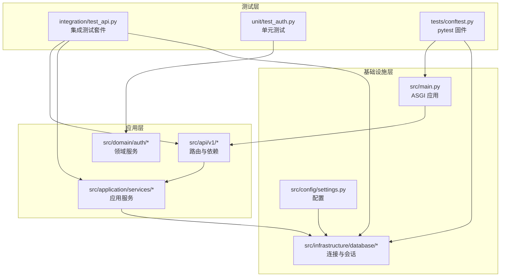
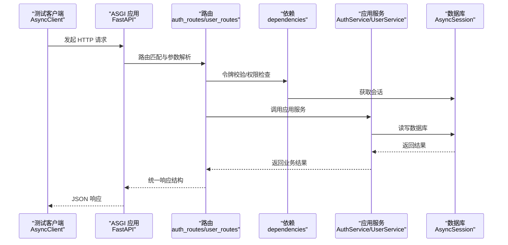
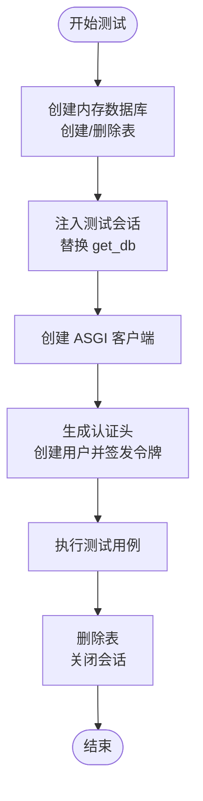
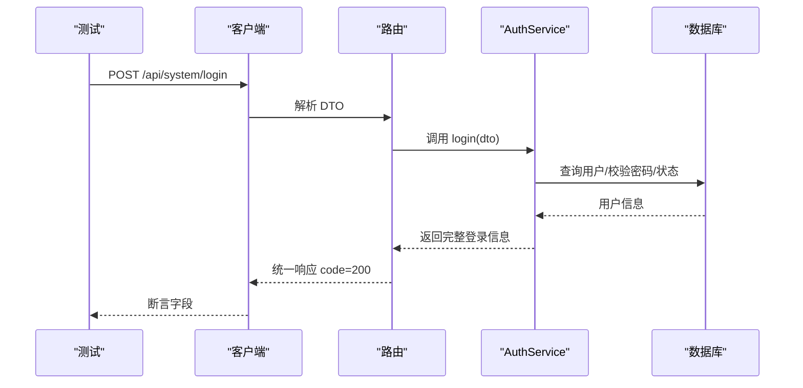
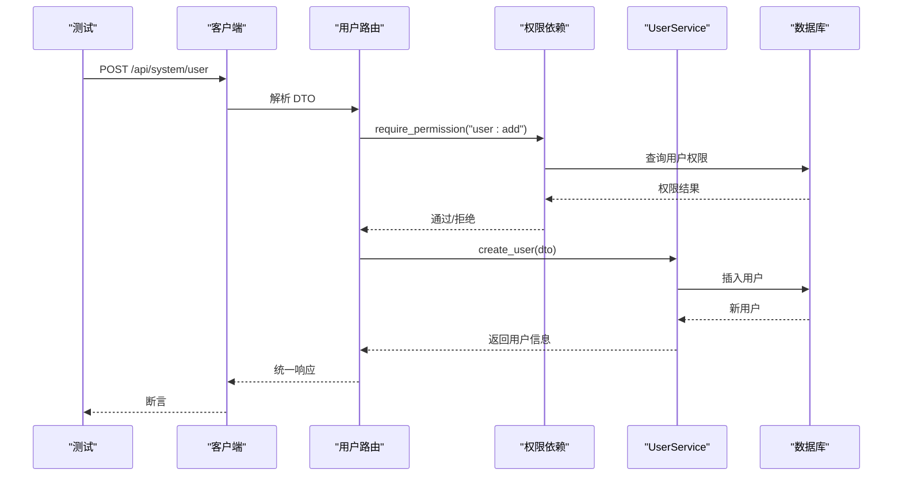
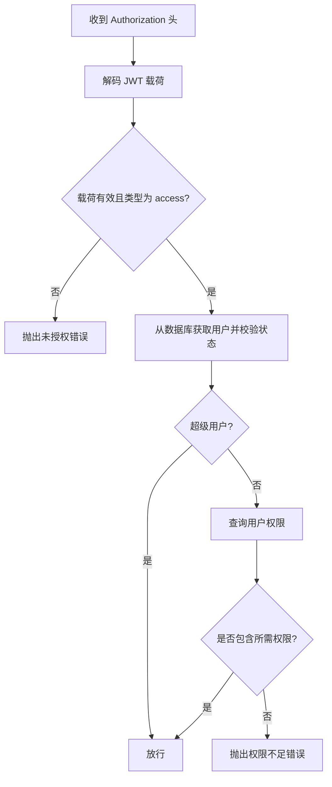
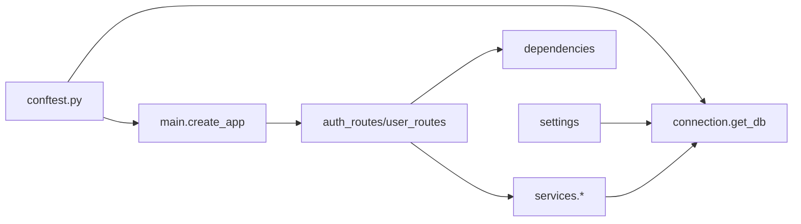

# 集成测试

<cite>
**本文引用的文件**   
- [service/tests/conftest.py](file://service/tests/conftest.py)
- [service/tests/integration/test_api.py](file://service/tests/integration/test_api.py)
- [service/pyproject.toml](file://service/pyproject.toml)
- [service/src/config/settings.py](file://service/src/config/settings.py)
- [service/src/infrastructure/database/connection.py](file://service/src/infrastructure/database/connection.py)
- [service/src/main.py](file://service/src/main.py)
- [service/src/api/v1/auth_routes.py](file://service/src/api/v1/auth_routes.py)
- [service/src/api/v1/user_routes.py](file://service/src/api/v1/user_routes.py)
- [service/src/api/common.py](file://service/src/api/common.py)
- [service/src/api/dependencies.py](file://service/src/api/dependencies.py)
- [service/src/application/services/auth_service.py](file://service/src/application/services/auth_service.py)
- [service/src/application/services/user_service.py](file://service/src/application/services/user_service.py)
- [service/src/domain/auth/token_service.py](file://service/src/domain/auth/token_service.py)
- [service/tests/unit/test_auth.py](file://service/tests/unit/test_auth.py)
</cite>

## 目录
1. [简介](#简介)
2. [项目结构](#项目结构)
3. [核心组件](#核心组件)
4. [架构总览](#架构总览)
5. [详细组件分析](#详细组件分析)
6. [依赖分析](#依赖分析)
7. [性能考虑](#性能考虑)
8. [故障排查指南](#故障排查指南)
9. [结论](#结论)
10. [附录](#附录)

## 简介
本文件面向开发者，提供 Hello-FastApi 项目的集成测试实施指南，覆盖以下目标：
- 端到端测试完整请求-响应流程与 API 端点
- 数据库集成测试的实现与测试数据准备
- 测试环境隔离与测试数据清理策略
- 认证流程、用户管理、权限控制等业务场景测试
- 性能与负载测试的可扩展建议
- 实战参考：测试数据库连接、API 接口调用、响应验证与依赖注入替换

## 项目结构
本项目采用 FastAPI + DDD + RBAC 架构，测试位于 service/tests 下，分为：
- integration：端到端与集成测试
- unit：单元测试（如密码与令牌服务）
- conftest.py：pytest 固件与依赖注入替换
- pyproject.toml：测试框架与标记配置

图表来源
- [service/tests/integration/test_api.py:1-393](file://service/tests/integration/test_api.py#L1-L393)
- [service/tests/conftest.py:1-105](file://service/tests/conftest.py#L1-L105)
- [service/src/main.py:1-96](file://service/src/main.py#L1-L96)
- [service/src/infrastructure/database/connection.py:1-35](file://service/src/infrastructure/database/connection.py#L1-L35)
- [service/src/config/settings.py:1-198](file://service/src/config/settings.py#L1-L198)
- [service/src/api/v1/auth_routes.py:1-86](file://service/src/api/v1/auth_routes.py#L1-L86)
- [service/src/api/v1/user_routes.py:1-252](file://service/src/api/v1/user_routes.py#L1-L252)
- [service/src/application/services/auth_service.py:1-154](file://service/src/application/services/auth_service.py#L1-L154)
- [service/src/application/services/user_service.py:1-322](file://service/src/application/services/user_service.py#L1-L322)
- [service/src/domain/auth/token_service.py:1-45](file://service/src/domain/auth/token_service.py#L1-L45)

章节来源
- [service/tests/conftest.py:1-105](file://service/tests/conftest.py#L1-L105)
- [service/tests/integration/test_api.py:1-393](file://service/tests/integration/test_api.py#L1-L393)
- [service/pyproject.toml:69-76](file://service/pyproject.toml#L69-L76)

## 核心组件
- 测试固件与依赖注入
  - 通过 conftest.py 提供内存数据库（SQLite 内存）、ASGI 客户端、数据库会话与认证头
  - 使用依赖注入覆盖 get_db，使测试路由直接使用测试会话
- 统一响应格式
  - API 层使用统一响应结构 code/message/data，便于断言
- 认证与权限
  - 依赖 HTTPBearer 令牌校验；权限依赖 require_permission 工厂
- 配置与数据库
  - settings 支持 testing 环境，测试数据库默认 sqlite+aiosqlite:///./sql/test.db
  - 数据库连接使用异步引擎与自动回滚/提交

章节来源
- [service/tests/conftest.py:16-62](file://service/tests/conftest.py#L16-L62)
- [service/src/api/common.py:29-65](file://service/src/api/common.py#L29-L65)
- [service/src/api/dependencies.py:16-72](file://service/src/api/dependencies.py#L16-L72)
- [service/src/config/settings.py:132-142](file://service/src/config/settings.py#L132-L142)
- [service/src/infrastructure/database/connection.py:12-21](file://service/src/infrastructure/database/connection.py#L12-L21)

## 架构总览
下图展示一次典型集成测试的端到端流程：测试客户端发起请求 → ASGI 传输 → 路由与依赖 → 应用服务 → 数据库 → 统一响应。

图表来源
- [service/tests/conftest.py:50-61](file://service/tests/conftest.py#L50-L61)
- [service/src/api/v1/auth_routes.py:1-86](file://service/src/api/v1/auth_routes.py#L1-L86)
- [service/src/api/v1/user_routes.py:1-252](file://service/src/api/v1/user_routes.py#L1-L252)
- [service/src/api/dependencies.py:1-72](file://service/src/api/dependencies.py#L1-L72)
- [service/src/application/services/auth_service.py:1-154](file://service/src/application/services/auth_service.py#L1-L154)
- [service/src/application/services/user_service.py:1-322](file://service/src/application/services/user_service.py#L1-L322)
- [service/src/api/common.py:29-65](file://service/src/api/common.py#L29-L65)

## 详细组件分析

### 测试固件与环境隔离
- 内存数据库
  - 使用 sqlite+aiosqlite:///:memory:，每个测试前创建表，结束后删除，保证隔离与干净状态
- 事件循环与会话
  - 为测试会话创建独立事件循环，避免并发问题
- 依赖注入替换
  - 将 get_db 替换为测试会话，确保路由层使用测试数据库
- 认证头生成
  - 自动创建用户并签发访问令牌，简化需要鉴权的接口测试

图表来源
- [service/tests/conftest.py:22-62](file://service/tests/conftest.py#L22-L62)

章节来源
- [service/tests/conftest.py:22-62](file://service/tests/conftest.py#L22-L62)

### 健康检查端点测试
- 目标：验证 /health 健康检查返回状态
- 断言：状态码 200，响应体包含 status 字段

章节来源
- [service/tests/integration/test_api.py:12-22](file://service/tests/integration/test_api.py#L12-L22)

### 认证端点测试
- 登录成功：POST /api/system/login，断言返回 code=200，包含 accessToken、refreshToken、expires
- 登录失败：错误密码时返回 401，统一响应包含 code=401
- 注册：POST /api/system/register，断言返回 code=200，data 包含用户基本信息
- 登出：POST /api/system/logout，断言返回 code=200
- 刷新令牌：POST /api/system/refresh，断言返回新的 accessToken/refreshToken
- 获取当前用户信息：GET /api/system/user/info，断言返回 code=200，包含用户信息
- 未认证访问：GET /api/system/user/info 不带令牌，断言 401/403

图表来源
- [service/tests/integration/test_api.py:24-195](file://service/tests/integration/test_api.py#L24-L195)
- [service/src/api/v1/auth_routes.py:19-34](file://service/src/api/v1/auth_routes.py#L19-L34)
- [service/src/application/services/auth_service.py:26-74](file://service/src/application/services/auth_service.py#L26-L74)

章节来源
- [service/tests/integration/test_api.py:24-195](file://service/tests/integration/test_api.py#L24-L195)
- [service/src/api/v1/auth_routes.py:19-34](file://service/src/api/v1/auth_routes.py#L19-L34)
- [service/src/application/services/auth_service.py:26-74](file://service/src/application/services/auth_service.py#L26-L74)

### 用户管理端点测试
- 获取用户列表：POST /api/system/user/list，断言返回 code=200（或 401/403，取决于权限）
- 创建用户：POST /api/system/user，断言返回 201 或 401/403（取决于权限）
- 获取用户详情：GET /api/system/user/{id}
- 更新用户：PUT /api/system/user/{id}
- 删除用户：DELETE /api/system/user/{id}
- 修改密码：POST /api/system/user/change-password
- 更新用户状态：PUT /api/system/user/{id}/status

图表来源
- [service/tests/integration/test_api.py:197-393](file://service/tests/integration/test_api.py#L197-L393)
- [service/src/api/v1/user_routes.py:54-73](file://service/src/api/v1/user_routes.py#L54-L73)
- [service/src/api/dependencies.py:45-60](file://service/src/api/dependencies.py#L45-L60)
- [service/src/application/services/user_service.py:25-57](file://service/src/application/services/user_service.py#L25-L57)

章节来源
- [service/tests/integration/test_api.py:197-393](file://service/tests/integration/test_api.py#L197-L393)
- [service/src/api/v1/user_routes.py:54-73](file://service/src/api/v1/user_routes.py#L54-L73)
- [service/src/api/dependencies.py:45-60](file://service/src/api/dependencies.py#L45-L60)
- [service/src/application/services/user_service.py:25-57](file://service/src/application/services/user_service.py#L25-L57)

### 权限控制与认证依赖
- 令牌校验：HTTPBearer，解码并验证 access token 类型
- 当前用户：从令牌载荷提取 sub，查询数据库并校验用户状态
- 权限检查：require_permission(code) 动态依赖，校验用户是否拥有指定权限
- 超级用户：require_superuser 仅允许超级用户访问

图表来源
- [service/src/api/dependencies.py:16-72](file://service/src/api/dependencies.py#L16-L72)
- [service/src/domain/auth/token_service.py:33-44](file://service/src/domain/auth/token_service.py#L33-L44)

章节来源
- [service/src/api/dependencies.py:16-72](file://service/src/api/dependencies.py#L16-L72)
- [service/src/domain/auth/token_service.py:33-44](file://service/src/domain/auth/token_service.py#L33-L44)

### 数据库集成测试与测试数据准备
- 测试数据库
  - 内存 SQLite：sqlite+aiosqlite:///:memory:，每个测试前创建表，结束后删除
- 测试数据
  - 使用 UserService.create_user 快速创建用户
  - 使用 TokenService.create_access_token 生成访问令牌
- 事务与清理
  - 会话自动提交/回滚；测试结束后删除所有表，确保无残留

章节来源
- [service/tests/conftest.py:16-41](file://service/tests/conftest.py#L16-L41)
- [service/tests/conftest.py:82-104](file://service/tests/conftest.py#L82-L104)
- [service/src/infrastructure/database/connection.py:12-21](file://service/src/infrastructure/database/connection.py#L12-L21)

### 统一响应与错误处理
- 统一响应结构：code/message/data
- 分页响应：total/pageNum/pageSize/totalPage/rows
- 错误响应：error_response 构造标准错误结构
- 全局异常处理：AppException/Validation/General，均返回统一格式

章节来源
- [service/src/api/common.py:29-65](file://service/src/api/common.py#L29-L65)
- [service/src/main.py:61-82](file://service/src/main.py#L61-L82)

### 单元测试参考：密码与令牌
- PasswordService：哈希与校验
- TokenService：访问/刷新令牌生成与解码、类型校验

章节来源
- [service/tests/unit/test_auth.py:1-68](file://service/tests/unit/test_auth.py#L1-L68)
- [service/src/application/services/auth_service.py:88-116](file://service/src/application/services/auth_service.py#L88-L116)
- [service/src/domain/auth/token_service.py:14-44](file://service/src/domain/auth/token_service.py#L14-L44)

## 依赖分析
- 测试对应用层的耦合
  - 集成测试通过 ASGI 客户端与路由交互，间接依赖应用服务与仓储
  - 通过依赖注入替换 get_db，降低对真实数据库的耦合
- 配置与数据库
  - settings 提供 TESTING 环境下的数据库 URL
  - connection.py 提供 get_db 异步会话与初始化/关闭逻辑

图表来源
- [service/tests/conftest.py:13-14](file://service/tests/conftest.py#L13-L14)
- [service/src/main.py:34-96](file://service/src/main.py#L34-L96)
- [service/src/infrastructure/database/connection.py:12-21](file://service/src/infrastructure/database/connection.py#L12-L21)
- [service/src/config/settings.py:132-142](file://service/src/config/settings.py#L132-L142)

章节来源
- [service/tests/conftest.py:13-14](file://service/tests/conftest.py#L13-L14)
- [service/src/main.py:34-96](file://service/src/main.py#L34-L96)
- [service/src/infrastructure/database/connection.py:12-21](file://service/src/infrastructure/database/connection.py#L12-L21)
- [service/src/config/settings.py:132-142](file://service/src/config/settings.py#L132-L142)

## 性能考虑
- 并发与事件循环
  - 使用 pytest-asyncio 与独立事件循环，避免并发竞争
- 数据库性能
  - 内存数据库适合集成测试；若需压力测试，建议使用真实数据库并开启连接池
- 负载测试建议
  - 使用 locust 或 wrk 对关键端点进行压测，关注 P95/P99 延迟与错误率
  - 配合限流与熔断策略评估系统韧性
- 日志与可观测性
  - 在测试中开启 DEBUG 级别日志，定位慢查询与异常

## 故障排查指南
- 401/403 未授权
  - 检查令牌是否正确生成与携带
  - 校验用户状态与权限是否满足 require_permission
- 参数校验失败 422
  - 查看全局异常处理器返回的 errors 字段，修正请求体
- 数据库连接问题
  - 确认测试数据库 URL 与驱动可用
  - 检查依赖注入是否正确替换 get_db
- 响应结构不符
  - 统一响应格式为 code/message/data，确认断言键名

章节来源
- [service/src/main.py:68-82](file://service/src/main.py#L68-L82)
- [service/src/api/common.py:29-65](file://service/src/api/common.py#L29-L65)
- [service/tests/conftest.py:50-61](file://service/tests/conftest.py#L50-L61)

## 结论
本指南提供了 Hello-FastApi 项目的集成测试实施路径：通过内存数据库与依赖注入替换，实现端到端的请求-响应验证；结合统一响应格式与权限依赖，覆盖认证、用户管理与权限控制等关键业务场景。配合单元测试与配置隔离，可构建稳定可靠的测试体系。

## 附录
- 测试命令与标记
  - 使用 pytest 标记 integration 执行集成测试套件
- 配置文件
  - settings 支持 testing 环境，测试数据库默认 sqlite+aiosqlite:///./sql/test.db

章节来源
- [service/pyproject.toml:69-76](file://service/pyproject.toml#L69-L76)
- [service/src/config/settings.py:132-142](file://service/src/config/settings.py#L132-L142)