# 集成测试

<cite>
**本文档引用的文件**
- [service/tests/integration/conftest.py](file://service/tests/integration/conftest.py)
- [service/tests/integration/db_seed.py](file://service/tests/integration/db_seed.py)
- [service/tests/integration/test_api.py](file://service/tests/integration/test_api.py)
- [service/tests/integration/test_api_real_flow.py](file://service/tests/integration/test_api_real_flow.py)
- [service/tests/conftest.py](file://service/tests/conftest.py)
- [service/src/infrastructure/database/connection.py](file://service/src/infrastructure/database/connection.py)
- [service/src/infrastructure/lifecycle/lifespan.py](file://service/src/infrastructure/lifecycle/lifespan.py)
- [service/src/api/v1/auth_routes.py](file://service/src/api/v1/auth_routes.py)
- [service/src/api/v1/user_routes.py](file://service/src/api/v1/user_routes.py)
- [service/src/api/dependencies.py](file://service/src/api/dependencies.py)
- [service/src/domain/rbac_defaults.py](file://service/src/domain/rbac_defaults.py)
- [service/src/config/settings.py](file://service/src/config/settings.py)
- [service/pyproject.toml](file://service/pyproject.toml)
</cite>

## 目录
1. [简介](#简介)
2. [项目结构](#项目结构)
3. [核心组件](#核心组件)
4. [架构概览](#架构概览)
5. [详细组件分析](#详细组件分析)
6. [依赖分析](#依赖分析)
7. [性能考虑](#性能考虑)
8. [故障排除指南](#故障排除指南)
9. [结论](#结论)

## 简介

本文档详细介绍了Hello-FastApi项目中的集成测试体系。集成测试是软件测试的重要组成部分，它验证多个单元组合在一起时的行为是否符合预期。在本项目中，集成测试采用真实的数据库环境，确保测试覆盖完整的业务流程。

该项目基于FastAPI构建，采用了领域驱动设计(Domain-Driven Design, DDD)和基于角色的访问控制(RBAC)权限系统。集成测试不仅验证API端点的功能，还深入测试了完整的业务流程，包括用户认证、授权、数据操作等核心功能。

集成测试的主要特点包括：
- 使用真实的异步数据库连接
- 通过依赖注入覆盖真实的服务层
- 支持完整的RBAC权限测试
- 提供端到端的业务流程验证
- 使用内存SQLite数据库提高测试效率

## 项目结构

项目采用分层架构设计，测试代码位于`service/tests`目录下，按照功能和层次进行组织：

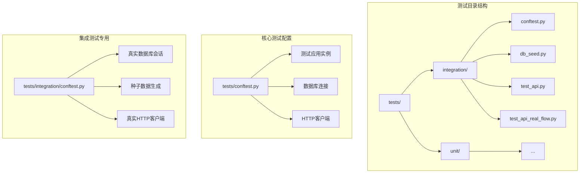

**图表来源**
- [service/tests/integration/conftest.py:1-33](file://service/tests/integration/conftest.py#L1-L33)
- [service/tests/conftest.py:1-103](file://service/tests/conftest.py#L1-L103)

**章节来源**
- [service/tests/integration/conftest.py:1-33](file://service/tests/integration/conftest.py#L1-L33)
- [service/tests/integration/db_seed.py:1-113](file://service/tests/integration/db_seed.py#L1-L113)
- [service/tests/integration/test_api.py:1-206](file://service/tests/integration/test_api.py#L1-L206)
- [service/tests/integration/test_api_real_flow.py:1-179](file://service/tests/integration/test_api_real_flow.py#L1-L179)
- [service/tests/conftest.py:1-103](file://service/tests/conftest.py#L1-L103)

## 核心组件

集成测试体系由多个核心组件构成，每个组件都有明确的职责和作用：

### 测试配置组件

测试配置组件负责设置整个测试环境，包括应用实例、数据库连接和HTTP客户端的初始化。

### 数据种子组件

数据种子组件负责在测试开始前准备必要的测试数据，确保每个测试用例都有完整的上下文环境。

### HTTP客户端组件

HTTP客户端组件提供真实的HTTP请求能力，模拟客户端与API的交互过程。

### 依赖注入组件

依赖注入组件允许在测试环境中替换真实的服务实现，确保测试的可控性和可重复性。

**章节来源**
- [service/tests/conftest.py:27-72](file://service/tests/conftest.py#L27-L72)
- [service/tests/integration/conftest.py:13-33](file://service/tests/integration/conftest.py#L13-L33)
- [service/tests/integration/db_seed.py:25-113](file://service/tests/integration/db_seed.py#L25-L113)

## 架构概览

集成测试架构采用分层设计，确保测试的独立性和可维护性：

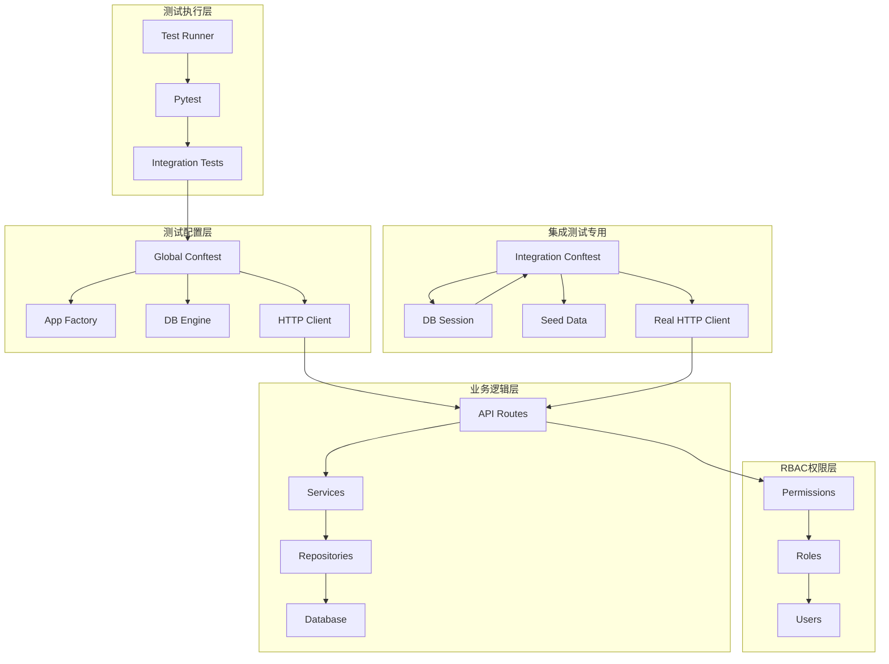

**图表来源**
- [service/tests/conftest.py:27-72](file://service/tests/conftest.py#L27-L72)
- [service/tests/integration/conftest.py:13-33](file://service/tests/integration/conftest.py#L13-L33)
- [service/src/api/v1/auth_routes.py:23-87](file://service/src/api/v1/auth_routes.py#L23-L87)
- [service/src/api/dependencies.py:84-98](file://service/src/api/dependencies.py#L84-L98)

## 详细组件分析

### 测试配置系统

测试配置系统是集成测试的基础，提供了完整的测试环境设置。

#### 全局测试配置

全局测试配置负责设置应用程序实例、数据库连接和HTTP客户端：

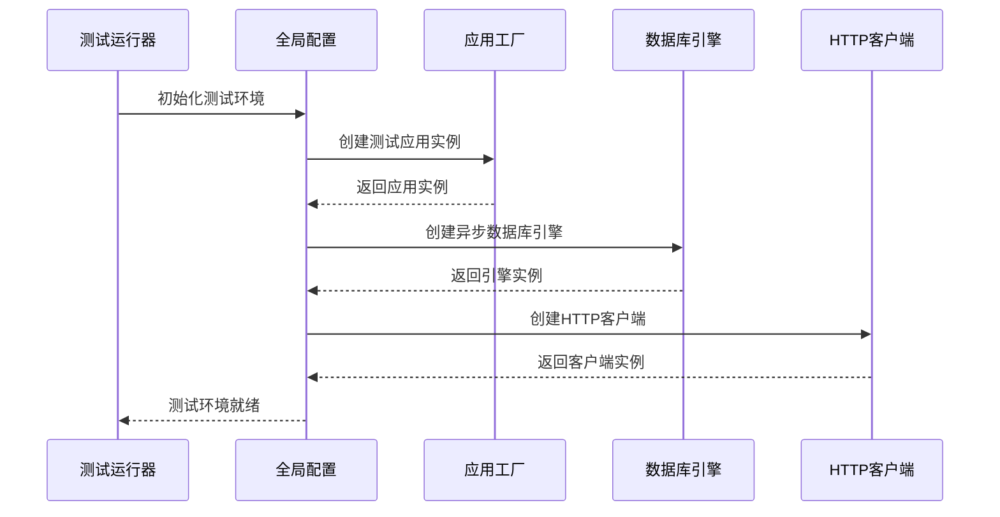

**图表来源**
- [service/tests/conftest.py:27-72](file://service/tests/conftest.py#L27-L72)
- [service/src/infrastructure/lifecycle/lifespan.py:26-30](file://service/src/infrastructure/lifecycle/lifespan.py#L26-L30)

#### 集成测试专用配置

集成测试专用配置提供了更精细的控制，特别是数据库会话管理和依赖注入：

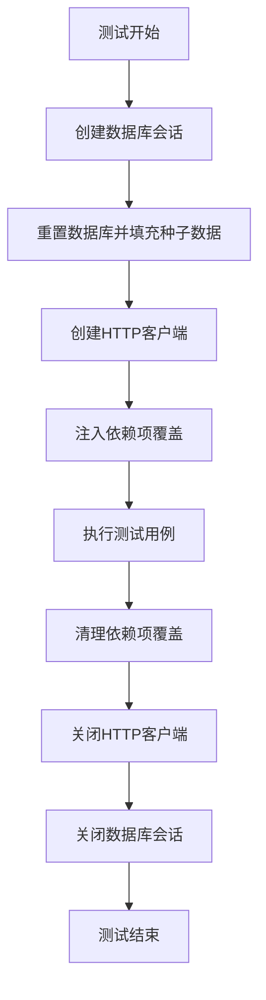

**图表来源**
- [service/tests/integration/conftest.py:13-33](file://service/tests/integration/conftest.py#L13-L33)
- [service/tests/integration/db_seed.py:109-113](file://service/tests/integration/db_seed.py#L109-L113)

**章节来源**
- [service/tests/conftest.py:27-72](file://service/tests/conftest.py#L27-L72)
- [service/tests/integration/conftest.py:13-33](file://service/tests/integration/conftest.py#L13-L33)

### 数据种子系统

数据种子系统负责在测试开始前准备必要的测试数据，确保每个测试用例都有完整的上下文环境。

#### 种子数据结构

种子数据系统定义了完整的业务实体关系，包括用户、角色、权限、菜单和部门等：

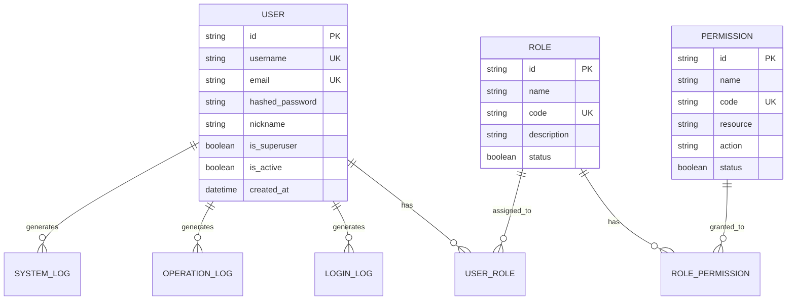

**图表来源**
- [service/tests/integration/db_seed.py:25-106](file://service/tests/integration/db_seed.py#L25-L106)
- [service/src/domain/rbac_defaults.py:6-36](file://service/src/domain/rbac_defaults.py#L6-L36)

#### 数据填充流程

数据填充遵循严格的依赖顺序，确保外键关系的完整性：

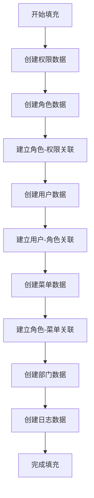

**图表来源**
- [service/tests/integration/db_seed.py:45-106](file://service/tests/integration/db_seed.py#L45-L106)

**章节来源**
- [service/tests/integration/db_seed.py:25-113](file://service/tests/integration/db_seed.py#L25-L113)
- [service/src/domain/rbac_defaults.py:1-37](file://service/src/domain/rbac_defaults.py#L1-L37)

### API集成测试

API集成测试覆盖了完整的业务流程，从用户认证到权限管理的各个方面。

#### 认证流程测试

认证流程测试验证了用户登录、注册、令牌刷新和登出的完整流程：

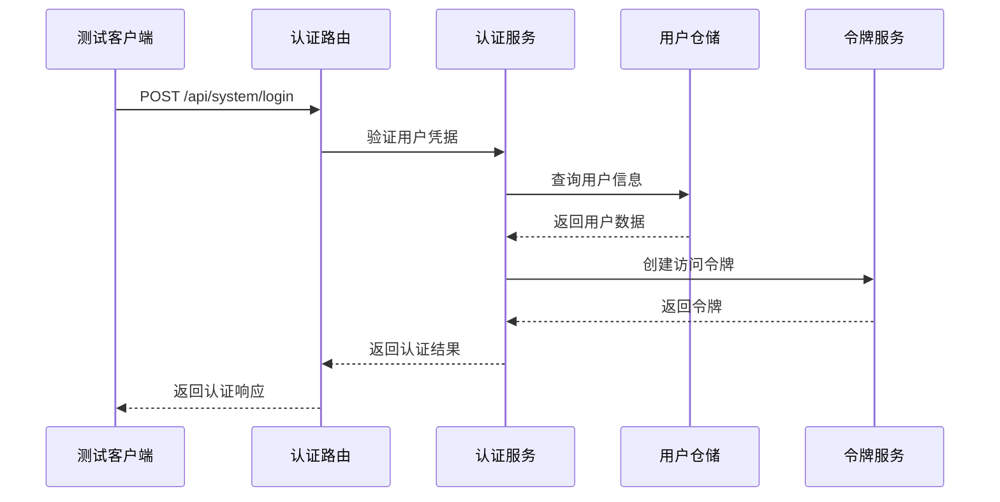

**图表来源**
- [service/src/api/v1/auth_routes.py:23-37](file://service/src/api/v1/auth_routes.py#L23-L37)
- [service/src/api/dependencies.py:116-124](file://service/src/api/dependencies.py#L116-L124)

#### 用户管理测试

用户管理测试验证了完整的CRUD操作和权限控制：

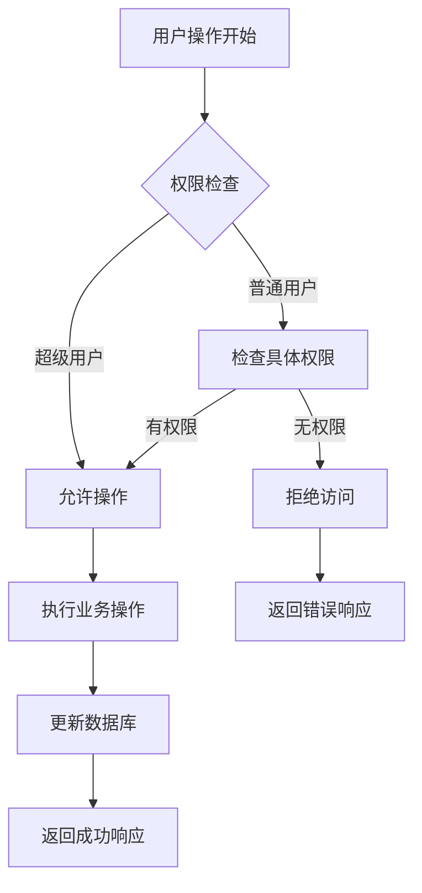

**图表来源**
- [service/src/api/v1/user_routes.py:17-35](file://service/src/api/v1/user_routes.py#L17-L35)
- [service/src/api/dependencies.py:84-98](file://service/src/api/dependencies.py#L84-L98)

**章节来源**
- [service/tests/integration/test_api.py:34-206](file://service/tests/integration/test_api.py#L34-L206)
- [service/src/api/v1/auth_routes.py:23-252](file://service/src/api/v1/auth_routes.py#L23-L252)
- [service/src/api/v1/user_routes.py:17-208](file://service/src/api/v1/user_routes.py#L17-L208)

### 真实流程测试

真实流程测试模拟了完整的业务场景，验证了系统的端到端功能。

#### 完整业务流程

真实流程测试涵盖了从用户注册到权限管理的完整业务流程：

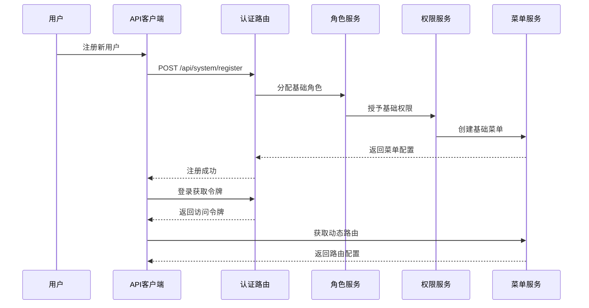

**图表来源**
- [service/tests/integration/test_api_real_flow.py:18-95](file://service/tests/integration/test_api_real_flow.py#L18-L95)
- [service/src/api/v1/auth_routes.py:179-173](file://service/src/api/v1/auth_routes.py#L179-L173)

#### 权限控制测试

权限控制测试验证了RBAC系统的有效性：

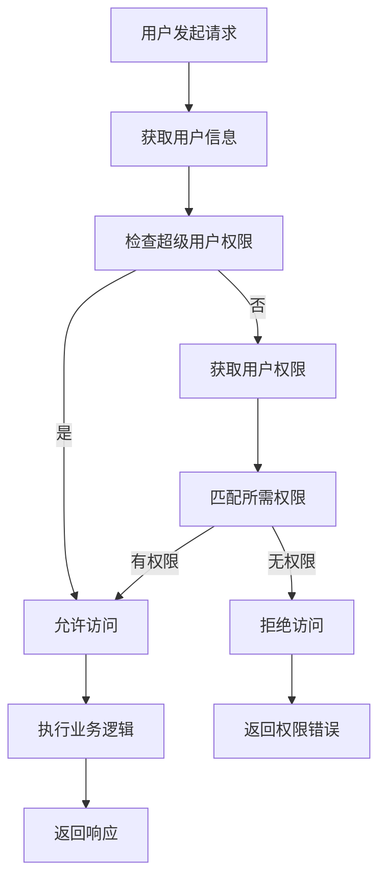

**图表来源**
- [service/src/api/dependencies.py:84-98](file://service/src/api/dependencies.py#L84-L98)
- [service/tests/integration/test_api_real_flow.py:46-63](file://service/tests/integration/test_api_real_flow.py#L46-L63)

**章节来源**
- [service/tests/integration/test_api_real_flow.py:18-179](file://service/tests/integration/test_api_real_flow.py#L18-L179)
- [service/src/api/dependencies.py:84-98](file://service/src/api/dependencies.py#L84-L98)

## 依赖分析

集成测试系统具有清晰的依赖关系，确保测试的独立性和可维护性。

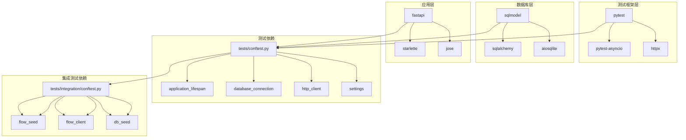

**图表来源**
- [service/pyproject.toml:7-35](file://service/pyproject.toml#L7-L35)
- [service/tests/conftest.py:17-19](file://service/tests/conftest.py#L17-L19)
- [service/src/infrastructure/database/connection.py:17-26](file://service/src/infrastructure/database/connection.py#L17-L26)

### 外部依赖

项目对外部依赖的管理采用明确的版本控制策略：

| 依赖包 | 版本要求 | 用途 |
|--------|----------|------|
| fastapi | >=0.115.0 | Web框架 |
| sqlmodel | >=0.0.22 | ORM框架 |
| pytest | >=8.0.0 | 测试框架 |
| pytest-asyncio | >=0.23.0 | 异步测试支持 |
| httpx | >=0.27.0 | HTTP客户端 |

### 内部依赖

内部依赖关系确保了测试代码的模块化和可维护性：

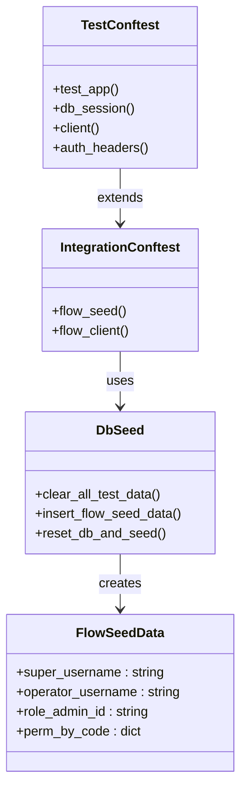

**图表来源**
- [service/tests/conftest.py:27-103](file://service/tests/conftest.py#L27-L103)
- [service/tests/integration/conftest.py:13-33](file://service/tests/integration/conftest.py#L13-L33)
- [service/tests/integration/db_seed.py:25-113](file://service/tests/integration/db_seed.py#L25-L113)

**章节来源**
- [service/pyproject.toml:7-35](file://service/pyproject.toml#L7-L35)
- [service/tests/conftest.py:17-103](file://service/tests/conftest.py#L17-L103)
- [service/src/infrastructure/database/connection.py:17-26](file://service/src/infrastructure/database/connection.py#L17-L26)

## 性能考虑

集成测试在保证测试质量的同时，也充分考虑了性能优化：

### 数据库性能优化

- 使用内存SQLite数据库减少I/O开销
- 通过依赖注入避免真实数据库连接
- 采用批量操作减少数据库往返次数

### 测试执行优化

- 并行测试执行支持
- 缓存配置和应用实例
- 最小化测试间的数据依赖

### 资源管理

- 自动化的资源清理机制
- 事件循环的正确管理
- 连接池的有效利用

## 故障排除指南

集成测试过程中可能遇到的各种问题及解决方案：

### 常见问题

#### 数据库连接问题
- **症状**: 测试执行时报数据库连接错误
- **原因**: 数据库URL配置错误或连接池耗尽
- **解决方案**: 检查DATABASE_URL配置，确认数据库服务可用

#### 权限验证失败
- **症状**: RBAC权限检查抛出UnauthorizedError或ForbiddenError
- **原因**: 用户权限配置错误或令牌过期
- **解决方案**: 验证种子数据中的权限分配，检查JWT配置

#### 依赖注入问题
- **症状**: 测试报错显示无法解析依赖项
- **原因**: 依赖项覆盖未正确设置或作用域错误
- **解决方案**: 检查fixture的作用域和依赖项的正确性

### 调试技巧

#### 日志记录
启用详细的日志记录来跟踪测试执行过程：
- 设置APP_ENV=testing
- 配置适当的日志级别
- 检查测试输出中的错误信息

#### 断点调试
使用pytest的内置调试功能：
- 在测试中添加pytest.set_trace()
- 使用pdb进行交互式调试
- 检查中间状态和变量值

**章节来源**
- [service/src/config/settings.py:128-136](file://service/src/config/settings.py#L128-L136)
- [service/src/api/dependencies.py:57-82](file://service/src/api/dependencies.py#L57-L82)

## 结论

Hello-FastApi项目的集成测试体系展现了现代Web应用测试的最佳实践。通过使用真实的数据库环境、完整的依赖注入机制和全面的业务流程覆盖，该测试体系能够有效验证系统的功能正确性和稳定性。

测试架构的关键优势包括：

1. **真实性**: 使用真实的数据库和HTTP客户端，确保测试结果的可靠性
2. **完整性**: 覆盖从认证到权限管理的完整业务流程
3. **可维护性**: 清晰的分层架构和模块化设计
4. **可扩展性**: 支持新的测试用例和业务功能的添加

通过持续改进和优化，这套集成测试体系为项目的长期发展和质量保证奠定了坚实的基础。建议在未来继续完善测试覆盖率，特别是在边缘情况和异常处理方面的测试，以进一步提升系统的健壮性。