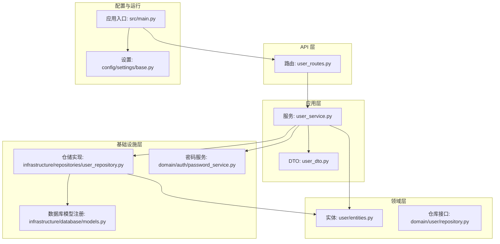
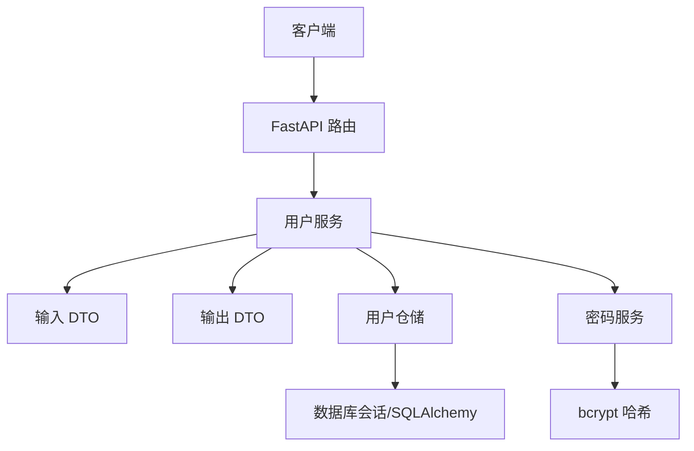
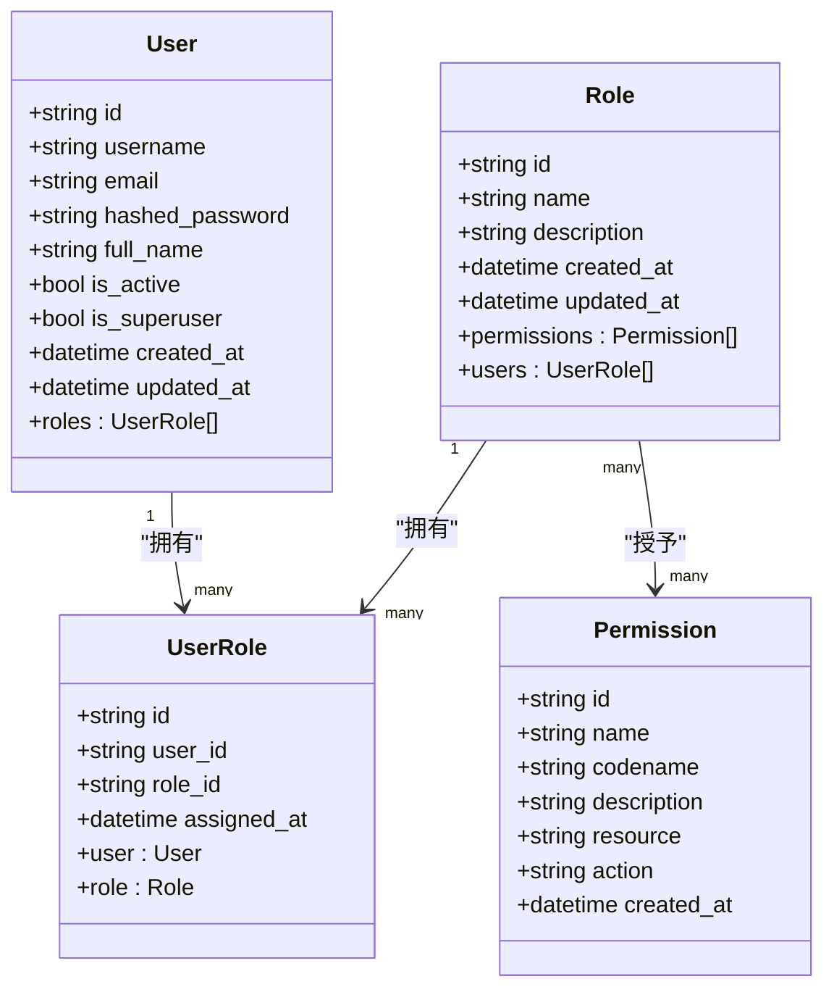
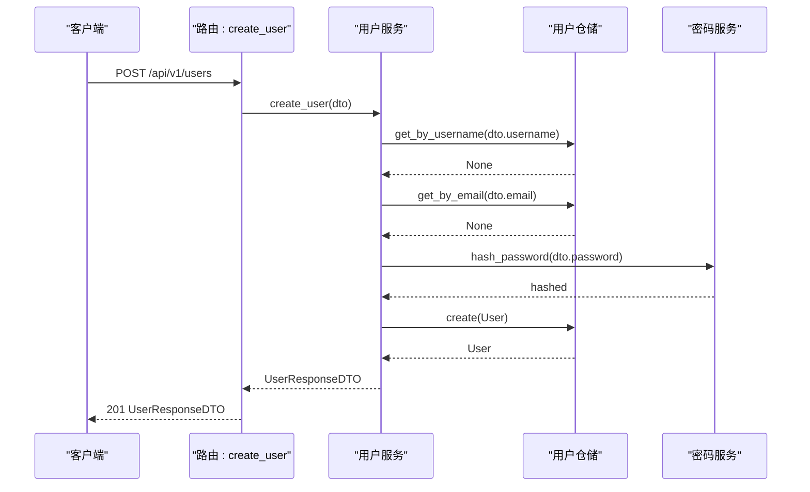
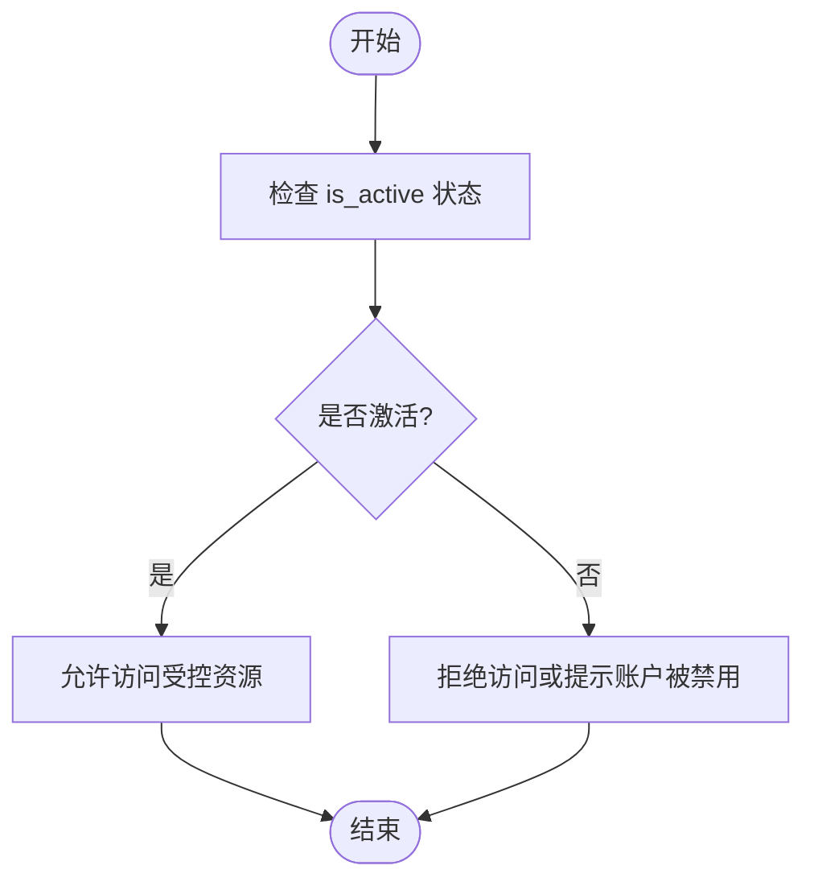
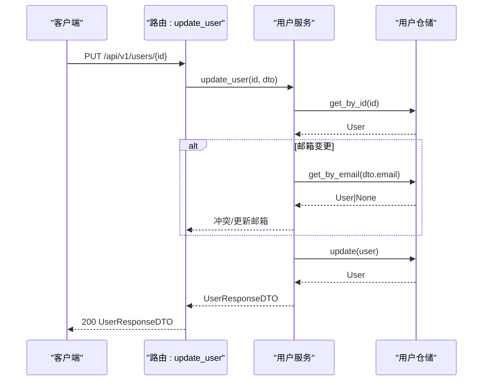
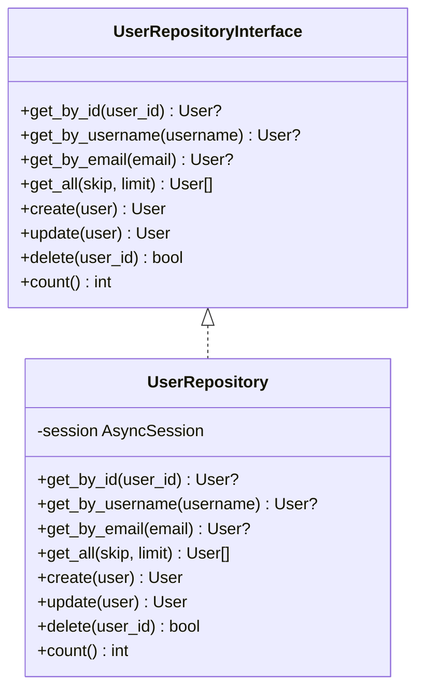
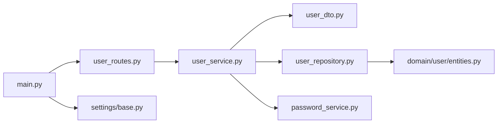

# 用户管理系统

<cite>
**本文档引用的文件**
- [src/domain/user/entities.py](file://src/domain/user/entities.py)
- [src/application/services/user_service.py](file://src/application/services/user_service.py)
- [src/infrastructure/repositories/user_repository.py](file://src/infrastructure/repositories/user_repository.py)
- [src/api/v1/user_routes.py](file://src/api/v1/user_routes.py)
- [src/application/dto/user_dto.py](file://src/application/dto/user_dto.py)
- [src/domain/user/repository.py](file://src/domain/user/repository.py)
- [src/infrastructure/database/models.py](file://src/infrastructure/database/models.py)
- [src/domain/rbac/entities.py](file://src/domain/rbac/entities.py)
- [src/main.py](file://src/main.py)
- [src/api/v1/__init__.py](file://src/api/v1/__init__.py)
- [src/core/exceptions.py](file://src/core/exceptions.py)
- [src/domain/auth/password_service.py](file://src/domain/auth/password_service.py)
- [config/settings/base.py](file://config/settings/base.py)
- [src/tests/integration/test_api.py](file://src/tests/integration/test_api.py)
</cite>

## 目录
1. [简介](#简介)
2. [项目结构](#项目结构)
3. [核心组件](#核心组件)
4. [架构总览](#架构总览)
5. [详细组件分析](#详细组件分析)
6. [依赖分析](#依赖分析)
7. [性能考虑](#性能考虑)
8. [故障排除指南](#故障排除指南)
9. [结论](#结论)
10. [附录](#附录)

## 简介
本文件为用户管理系统的综合技术文档，覆盖用户实体设计、CRUD实现、状态管理、服务与仓储模式、DTO设计、API接口与使用示例，以及安全与隐私合规要点。系统采用领域驱动设计（DDD）、分层架构与异步数据库访问，结合基于角色的访问控制（RBAC），提供可扩展、可维护且安全的用户管理能力。

## 项目结构
系统按职责分层组织，主要目录与职责如下：
- config：配置管理（环境变量、设置）
- src：
  - api/v1：REST API 路由与权限依赖
  - application：应用服务与 DTO
  - domain：领域模型与仓库接口
  - infrastructure：数据库、缓存与仓储实现
  - core：通用异常、中间件、常量等
- tests：单元与集成测试

图表来源
- [src/api/v1/user_routes.py:1-115](file://src/api/v1/user_routes.py#L1-L115)
- [src/application/services/user_service.py:1-142](file://src/application/services/user_service.py#L1-L142)
- [src/application/dto/user_dto.py:1-53](file://src/application/dto/user_dto.py#L1-L53)
- [src/domain/user/entities.py:1-38](file://src/domain/user/entities.py#L1-L38)
- [src/domain/user/repository.py:1-50](file://src/domain/user/repository.py#L1-L50)
- [src/infrastructure/repositories/user_repository.py:1-61](file://src/infrastructure/repositories/user_repository.py#L1-L61)
- [src/infrastructure/database/models.py:1-10](file://src/infrastructure/database/models.py#L1-L10)
- [src/domain/auth/password_service.py:1-24](file://src/domain/auth/password_service.py#L1-L24)
- [config/settings/base.py:1-86](file://config/settings/base.py#L1-L86)
- [src/main.py:1-83](file://src/main.py#L1-L83)

章节来源
- [src/main.py:19-83](file://src/main.py#L19-L83)
- [src/api/v1/__init__.py:1-15](file://src/api/v1/__init__.py#L1-L15)

## 核心组件
- 用户实体：定义用户标识、凭证、个人信息、状态与时间戳，并通过关系映射角色关联。
- 用户服务：封装业务规则（唯一性校验、密码哈希与校验、状态变更、权限控制），协调仓储与领域服务。
- 用户仓储：提供基于 SQLAlchemy 的异步 CRUD 与计数查询，支持预加载角色关系。
- 用户 DTO：定义输入输出数据结构与验证规则，保证 API 与应用层的数据契约一致。
- RBAC 实体：提供角色与权限模型，支撑用户的角色分配与权限控制。
- API 路由：暴露用户管理相关端点，集成权限依赖与分页参数。

章节来源
- [src/domain/user/entities.py:16-38](file://src/domain/user/entities.py#L16-L38)
- [src/application/services/user_service.py:22-142](file://src/application/services/user_service.py#L22-L142)
- [src/infrastructure/repositories/user_repository.py:11-61](file://src/infrastructure/repositories/user_repository.py#L11-L61)
- [src/application/dto/user_dto.py:8-53](file://src/application/dto/user_dto.py#L8-L53)
- [src/domain/rbac/entities.py:20-79](file://src/domain/rbac/entities.py#L20-L79)
- [src/api/v1/user_routes.py:21-115](file://src/api/v1/user_routes.py#L21-L115)

## 架构总览
系统采用分层架构与 DDD 思想：
- 表现层：FastAPI 路由与依赖注入
- 应用层：业务服务编排与规则校验
- 领域层：实体与仓库接口
- 基础设施层：数据库会话、ORM 模型与仓储实现

图表来源
- [src/api/v1/user_routes.py:24-114](file://src/api/v1/user_routes.py#L24-L114)
- [src/application/services/user_service.py:29-119](file://src/application/services/user_service.py#L29-L119)
- [src/infrastructure/repositories/user_repository.py:17-60](file://src/infrastructure/repositories/user_repository.py#L17-L60)
- [src/domain/auth/password_service.py:10-23](file://src/domain/auth/password_service.py#L10-L23)

## 详细组件分析

### 用户实体设计与属性定义
- 标识与凭证
  - id：UUID 字符串主键
  - username：唯一索引，长度限制
  - email：唯一索引，长度限制
  - hashed_password：存储经哈希的密码
- 个人信息
  - full_name：可空，长度限制
- 状态与权限
  - is_active：默认启用
  - is_superuser：默认非超级用户
- 时间戳
  - created_at、updated_at：服务器默认时间
- 关系
  - roles：与 UserRole 的一对多关系，支持级联删除

图表来源
- [src/domain/user/entities.py:16-38](file://src/domain/user/entities.py#L16-L38)
- [src/domain/rbac/entities.py:63-79](file://src/domain/rbac/entities.py#L63-L79)
- [src/domain/rbac/entities.py:40-61](file://src/domain/rbac/entities.py#L40-L61)
- [src/domain/rbac/entities.py:20-38](file://src/domain/rbac/entities.py#L20-L38)

章节来源
- [src/domain/user/entities.py:16-38](file://src/domain/user/entities.py#L16-L38)
- [src/domain/rbac/entities.py:20-79](file://src/domain/rbac/entities.py#L20-L79)

### 用户 CRUD 操作实现
- 创建用户
  - 校验用户名与邮箱唯一性
  - 使用密码服务生成哈希密码
  - 写入仓储并返回响应 DTO
- 读取用户
  - 支持按 ID、用户名、邮箱查询
  - 分页列出用户并返回总数
- 更新用户
  - 校验邮箱唯一性（排除自身）
  - 可更新邮箱、姓名与激活状态
- 删除用户
  - 不存在时抛出未找到异常
- 修改密码
  - 校验旧密码正确性后更新哈希

图表来源
- [src/api/v1/user_routes.py:24-32](file://src/api/v1/user_routes.py#L24-L32)
- [src/application/services/user_service.py:29-44](file://src/application/services/user_service.py#L29-L44)
- [src/infrastructure/repositories/user_repository.py:37-41](file://src/infrastructure/repositories/user_repository.py#L37-L41)
- [src/domain/auth/password_service.py:10-15](file://src/domain/auth/password_service.py#L10-L15)

章节来源
- [src/application/services/user_service.py:29-119](file://src/application/services/user_service.py#L29-L119)
- [src/infrastructure/repositories/user_repository.py:17-60](file://src/infrastructure/repositories/user_repository.py#L17-L60)

### 用户状态管理机制
- 激活/禁用：通过 is_active 字段控制；更新接口允许变更该状态
- 删除：物理删除用户记录；删除前应确保无业务依赖
- 超级用户：is_superuser 字段用于标识管理员角色

图表来源
- [src/application/services/user_service.py:79-81](file://src/application/services/user_service.py#L79-L81)
- [src/domain/user/entities.py:26-27](file://src/domain/user/entities.py#L26-L27)

章节来源
- [src/application/services/user_service.py:66-89](file://src/application/services/user_service.py#L66-L89)
- [src/domain/user/entities.py:26-27](file://src/domain/user/entities.py#L26-L27)

### 用户信息服务实现
- 查询与列表
  - get_user/get_user_by_username/get_by_email：按条件获取用户实体
  - get_users/get_users_count：分页与总数统计
- 更新与删除
  - update_user：邮箱唯一性校验与状态更新
  - delete_user：删除并返回成功状态
- 密码管理
  - change_password：旧密码校验与新密码哈希更新
- 超级用户创建
  - create_superuser：创建具有管理员权限的用户

图表来源
- [src/api/v1/user_routes.py:93-102](file://src/api/v1/user_routes.py#L93-L102)
- [src/application/services/user_service.py:66-83](file://src/application/services/user_service.py#L66-L83)
- [src/infrastructure/repositories/user_repository.py:43-47](file://src/infrastructure/repositories/user_repository.py#L43-L47)

章节来源
- [src/application/services/user_service.py:46-119](file://src/application/services/user_service.py#L46-L119)

### 用户仓储模式设计
- 接口定义：统一的 CRUD 与计数方法，便于替换实现
- 异步实现：基于 SQLAlchemy AsyncSession，支持 flush/refresh
- 查询优化：使用 selectinload 预加载 roles 关系，避免 N+1 查询
- 唯一性约束：通过实体列唯一性与服务层校验共同保障

图表来源
- [src/domain/user/repository.py:8-50](file://src/domain/user/repository.py#L8-L50)
- [src/infrastructure/repositories/user_repository.py:11-61](file://src/infrastructure/repositories/user_repository.py#L11-L61)

章节来源
- [src/domain/user/repository.py:8-50](file://src/domain/user/repository.py#L8-L50)
- [src/infrastructure/repositories/user_repository.py:11-61](file://src/infrastructure/repositories/user_repository.py#L11-L61)

### 用户 DTO 对象设计
- UserCreateDTO：创建用户时的输入校验（用户名、邮箱、密码、可选全名）
- UserUpdateDTO：更新用户时的输入校验（邮箱、全名、可选激活状态）
- UserResponseDTO：对外输出的用户信息（含角色名称列表）
- UserListResponseDTO：分页列表响应（总数与条目）
- ChangePasswordDTO：修改密码的输入校验（旧密码与新密码）

章节来源
- [src/application/dto/user_dto.py:8-53](file://src/application/dto/user_dto.py#L8-L53)

### API 接口文档与使用示例
- 路由前缀：/api/v1/users
- 权限要求：各端点均需相应权限（如 user.create、user.view、user.update、user.delete）
- 端点概览
  - POST /users：创建用户（需要 user.create）
  - GET /users：分页获取用户列表（需要 user.view）
  - GET /users/me：获取当前用户资料
  - PUT /users/me：更新当前用户资料
  - POST /users/me/change-password：修改当前用户密码
  - GET /users/{user_id}：按 ID 获取用户（需要 user.view）
  - PUT /users/{user_id}：按 ID 更新用户（需要 user.update）
  - DELETE /users/{user_id}：按 ID 删除用户（需要 user.delete）

使用示例（基于集成测试）
- 获取当前用户资料
  - 步骤：先创建用户并获取访问令牌，再调用 GET /api/v1/users/me
  - 断言：返回的用户名、邮箱、全名为预期值
- 更新当前用户资料
  - 步骤：携带令牌调用 PUT /api/v1/users/me，传入更新字段
  - 断言：返回值中对应字段已更新

章节来源
- [src/api/v1/user_routes.py:24-114](file://src/api/v1/user_routes.py#L24-L114)
- [src/tests/integration/test_api.py:98-142](file://src/tests/integration/test_api.py#L98-L142)

## 依赖分析
- 组件耦合
  - 路由依赖应用服务；应用服务依赖仓储接口与领域服务
  - 仓储实现依赖 SQLAlchemy 与数据库模型
- 外部依赖
  - FastAPI、SQLAlchemy（异步）、bcrypt、Pydantic（DTO）
- 权限与中间件
  - 路由层通过依赖注入实现权限校验与当前用户解析
  - 应用启动时初始化数据库连接

图表来源
- [src/api/v1/user_routes.py:18-19](file://src/api/v1/user_routes.py#L18-L19)
- [src/application/services/user_service.py:5-19](file://src/application/services/user_service.py#L5-L19)
- [src/infrastructure/repositories/user_repository.py:3-8](file://src/infrastructure/repositories/user_repository.py#L3-L8)
- [src/domain/user/entities.py:10](file://src/domain/user/entities.py#L10)
- [src/domain/auth/password_service.py:3](file://src/domain/auth/password_service.py#L3)
- [src/main.py:11-16](file://src/main.py#L11-L16)
- [config/settings/base.py:3](file://config/settings/base.py#L3)

章节来源
- [src/api/v1/user_routes.py:18-19](file://src/api/v1/user_routes.py#L18-L19)
- [src/application/services/user_service.py:5-19](file://src/application/services/user_service.py#L5-L19)
- [src/infrastructure/repositories/user_repository.py:3-8](file://src/infrastructure/repositories/user_repository.py#L3-L8)
- [src/main.py:11-16](file://src/main.py#L11-L16)

## 性能考虑
- 查询优化
  - 仓储使用 selectinload 预加载 roles 关系，减少 N+1 查询
  - 分页查询通过 offset/limit 控制结果集大小
- 数据库连接
  - 异步会话减少阻塞，提升并发吞吐
- 缓存建议
  - 对热点用户信息可引入缓存层（Redis 已在配置中定义）
- 日志与监控
  - 中间件与全局异常处理器有助于定位性能瓶颈与错误

## 故障排除指南
- 常见异常类型
  - NotFoundError：资源未找到（如用户不存在）
  - ConflictError：资源冲突（如用户名或邮箱重复）
  - UnauthorizedError：认证失败（如旧密码不正确）
  - ForbiddenError：权限不足（如缺少所需权限）
  - ValidationError：请求数据校验失败
- 排查步骤
  - 检查路由权限依赖是否正确配置
  - 核对 DTO 字段长度与格式是否满足约束
  - 查看数据库唯一性约束与服务层校验逻辑
  - 启用日志中间件定位异常堆栈

章节来源
- [src/core/exceptions.py:6-53](file://src/core/exceptions.py#L6-L53)
- [src/application/services/user_service.py:32-35](file://src/application/services/user_service.py#L32-L35)
- [src/application/services/user_service.py:97-98](file://src/application/services/user_service.py#L97-L98)

## 结论
本用户管理系统以 DDD 为核心，结合分层架构与异步数据库访问，提供了完整的用户生命周期管理能力。通过清晰的 DTO、严格的权限控制与仓储抽象，系统具备良好的可扩展性与安全性。建议在生产环境中进一步完善缓存策略、审计日志与安全扫描，并持续优化查询路径与异常处理。

## 附录
- 安全与隐私合规要点
  - 密码存储：使用强哈希算法（bcrypt），禁止明文存储
  - 输入校验：严格限制字段长度与格式，防止注入与越权
  - 权限控制：RBAC 精细化授权，最小权限原则
  - 数据最小化：仅在响应 DTO 中暴露必要字段
  - 审计与日志：记录关键操作（创建、更新、删除、密码变更）
  - 传输安全：HTTPS 与安全的令牌管理
- 配置参考
  - 数据库连接、JWT 密钥、CORS、速率限制等均通过配置类集中管理

章节来源
- [config/settings/base.py:9-46](file://config/settings/base.py#L9-L46)
- [src/domain/auth/password_service.py:10-23](file://src/domain/auth/password_service.py#L10-L23)
- [src/application/dto/user_dto.py:11-14](file://src/application/dto/user_dto.py#L11-L14)
- [src/application/dto/user_dto.py:20-22](file://src/application/dto/user_dto.py#L20-L22)
- [src/application/dto/user_dto.py:48-52](file://src/application/dto/user_dto.py#L48-L52)