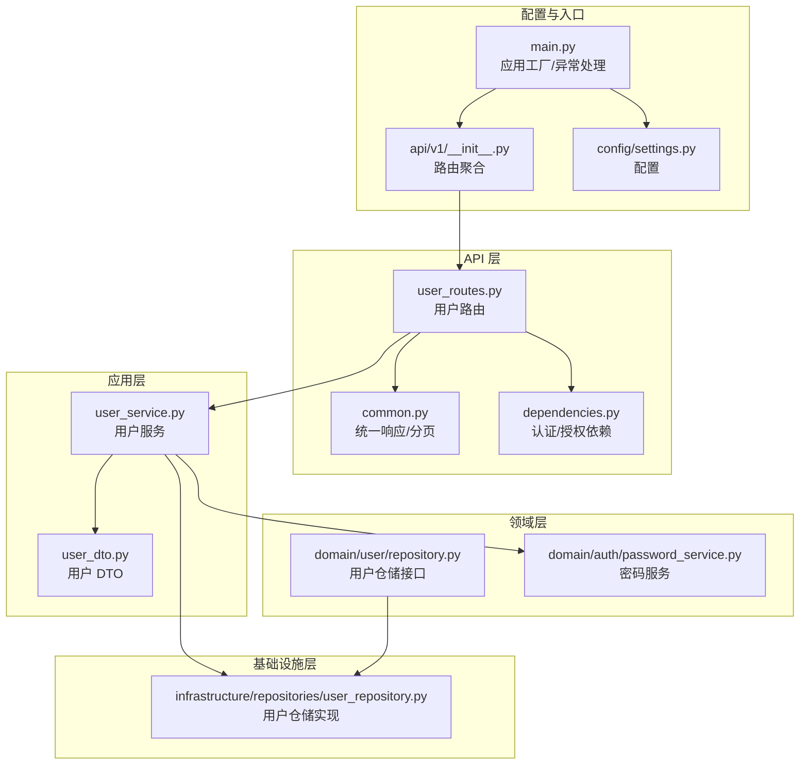
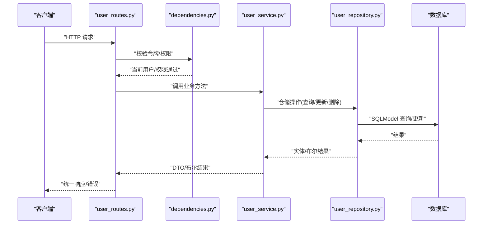
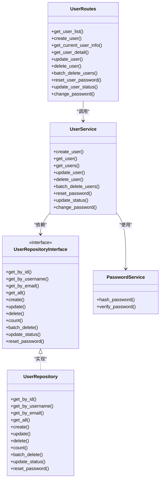

# 用户 API 接口

<cite>
**本文引用的文件**
- [service/src/api/v1/user_routes.py](file://service/src/api/v1/user_routes.py)
- [service/src/application/dto/user_dto.py](file://service/src/application/dto/user_dto.py)
- [service/src/application/services/user_service.py](file://service/src/application/services/user_service.py)
- [service/src/infrastructure/repositories/user_repository.py](file://service/src/infrastructure/repositories/user_repository.py)
- [service/src/domain/user/repository.py](file://service/src/domain/user/repository.py)
- [service/src/api/common.py](file://service/src/api/common.py)
- [service/src/api/dependencies.py](file://service/src/api/dependencies.py)
- [service/src/core/exceptions.py](file://service/src/core/exceptions.py)
- [service/src/domain/auth/password_service.py](file://service/src/domain/auth/password_service.py)
- [service/src/api/v1/__init__.py](file://service/src/api/v1/__init__.py)
- [service/src/main.py](file://service/src/main.py)
- [service/src/config/settings.py](file://service/src/config/settings.py)
- [web/src/api/user.ts](file://web/src/api/user.ts)
</cite>

## 目录
1. [简介](#简介)
2. [项目结构](#项目结构)
3. [核心组件](#核心组件)
4. [架构总览](#架构总览)
5. [详细接口说明](#详细接口说明)
6. [依赖关系分析](#依赖关系分析)
7. [性能考量](#性能考量)
8. [故障排查指南](#故障排查指南)
9. [结论](#结论)
10. [附录](#附录)

## 简介
本文件面向后端与前端开发者，系统化梳理用户管理相关的 HTTP 接口，覆盖用户列表查询、用户创建、用户详情、用户更新、用户删除、批量删除、密码重置、状态变更以及当前用户信息获取等接口。文档同时说明认证与授权要求、请求参数与响应格式、数据校验规则、错误响应格式、集成示例与最佳实践，帮助快速、安全地集成用户管理能力。

## 项目结构
用户管理 API 位于服务端工程的 API 层，采用分层架构：
- API 层：定义路由与控制器，负责接收请求、注入依赖、调用服务层并返回统一响应。
- 应用层：封装业务流程，协调仓储与领域服务，执行业务规则与数据转换。
- 领域层：定义仓储接口与领域服务（如密码服务）。
- 基础设施层：实现仓储接口，使用 SQLModel 进行数据库访问。
- 配置与入口：应用工厂、CORS、全局异常处理、路由聚合。

图表来源
- [service/src/api/v1/user_routes.py:1-252](file://service/src/api/v1/user_routes.py#L1-L252)
- [service/src/application/services/user_service.py:1-322](file://service/src/application/services/user_service.py#L1-L322)
- [service/src/infrastructure/repositories/user_repository.py:1-185](file://service/src/infrastructure/repositories/user_repository.py#L1-L185)
- [service/src/domain/user/repository.py:1-50](file://service/src/domain/user/repository.py#L1-L50)
- [service/src/api/common.py:1-65](file://service/src/api/common.py#L1-L65)
- [service/src/api/dependencies.py:1-72](file://service/src/api/dependencies.py#L1-L72)
- [service/src/api/v1/__init__.py:1-41](file://service/src/api/v1/__init__.py#L1-L41)
- [service/src/main.py:1-96](file://service/src/main.py#L1-L96)
- [service/src/config/settings.py:1-198](file://service/src/config/settings.py#L1-L198)

章节来源
- [service/src/api/v1/__init__.py:1-41](file://service/src/api/v1/__init__.py#L1-L41)
- [service/src/main.py:1-96](file://service/src/main.py#L1-L96)

## 核心组件
- 路由与控制器：定义用户相关接口，注入数据库会话与权限依赖，调用用户服务并返回统一响应。
- 用户服务：封装业务逻辑，包括创建、查询、更新、删除、批量删除、密码重置、状态变更、密码修改等。
- 用户仓储接口与实现：定义抽象仓储方法，SQLModel 实现具体查询、分页、计数、更新状态、重置密码等。
- DTO：定义请求与响应的数据结构与校验规则。
- 统一响应与分页：提供统一的响应体结构与分页包装。
- 认证与授权：基于 JWT 的访问令牌解码与校验，权限码校验与超级用户豁免。
- 异常体系：自定义异常类，统一映射到 HTTP 状态码与错误响应。

章节来源
- [service/src/api/v1/user_routes.py:1-252](file://service/src/api/v1/user_routes.py#L1-L252)
- [service/src/application/services/user_service.py:1-322](file://service/src/application/services/user_service.py#L1-L322)
- [service/src/infrastructure/repositories/user_repository.py:1-185](file://service/src/infrastructure/repositories/user_repository.py#L1-L185)
- [service/src/application/dto/user_dto.py:1-86](file://service/src/application/dto/user_dto.py#L1-L86)
- [service/src/api/common.py:1-65](file://service/src/api/common.py#L1-L65)
- [service/src/api/dependencies.py:1-72](file://service/src/api/dependencies.py#L1-L72)
- [service/src/core/exceptions.py:1-60](file://service/src/core/exceptions.py#L1-L60)

## 架构总览
用户管理 API 的调用链路如下：
- 客户端发起 HTTP 请求至用户路由。
- 路由层注入数据库会话与权限依赖，校验访问令牌与权限码。
- 调用用户服务执行业务逻辑。
- 服务层通过仓储访问数据库，必要时调用密码服务进行哈希与校验。
- 返回统一响应格式；异常由全局异常处理器统一处理。

图表来源
- [service/src/api/v1/user_routes.py:27-252](file://service/src/api/v1/user_routes.py#L27-L252)
- [service/src/api/dependencies.py:16-72](file://service/src/api/dependencies.py#L16-L72)
- [service/src/application/services/user_service.py:25-322](file://service/src/application/services/user_service.py#L25-L322)
- [service/src/infrastructure/repositories/user_repository.py:17-185](file://service/src/infrastructure/repositories/user_repository.py#L17-L185)

## 详细接口说明

### 基础信息
- API 前缀：/api/system/user
- 认证方式：Bearer Token（JWT）
- 授权方式：基于权限码的 RBAC 校验
- 统一响应格式：包含 code、message、data 字段
- 分页响应：包含 total、pageNum、pageSize、totalPage、rows 字段

章节来源
- [service/src/api/v1/__init__.py:20-23](file://service/src/api/v1/__init__.py#L20-L23)
- [service/src/api/common.py:29-65](file://service/src/api/common.py#L29-L65)
- [service/src/api/dependencies.py:16-72](file://service/src/api/dependencies.py#L16-L72)

### 1. 获取用户列表（POST /list）
- 方法：POST
- 路径：/api/system/user/list
- 权限：user:view
- 请求体：UserListQueryDTO
  - pageNum：整数，>=1，默认1
  - pageSize：整数，1-100，默认10
  - username：字符串（模糊查询）
  - phone：字符串（模糊查询）
  - email：字符串（模糊查询）
  - status：整数（0-禁用，1-启用）
  - deptId：整数（部门ID）
- 响应：分页响应（rows 为 UserResponseDTO 列表）

章节来源
- [service/src/api/v1/user_routes.py:27-51](file://service/src/api/v1/user_routes.py#L27-L51)
- [service/src/application/dto/user_dto.py:56-65](file://service/src/application/dto/user_dto.py#L56-L65)
- [service/src/application/services/user_service.py:80-114](file://service/src/application/services/user_service.py#L80-L114)

### 2. 创建用户（POST /）
- 方法：POST
- 路径：/api/system/user/
- 权限：user:add
- 请求体：UserCreateDTO
  - username：字符串，长度3-50
  - password：字符串，长度8-128
  - nickname：字符串，最大64
  - email：字符串
  - phone：字符串，最大20
  - sex：整数
  - avatar：字符串
  - status：整数，默认1
  - deptId：整数（别名）
  - remark：字符串
- 响应：统一响应，data 为 UserResponseDTO

章节来源
- [service/src/api/v1/user_routes.py:54-74](file://service/src/api/v1/user_routes.py#L54-L74)
- [service/src/application/dto/user_dto.py:8-21](file://service/src/application/dto/user_dto.py#L8-L21)
- [service/src/application/services/user_service.py:25-58](file://service/src/application/services/user_service.py#L25-L58)

### 3. 获取当前用户信息（GET /info）
- 方法：GET
- 路径：/api/system/user/info
- 权限：无需显式权限码（依赖当前用户）
- 请求头：Authorization: Bearer <token>
- 响应：统一响应，data 为包含角色与权限的 UserResponseDTO

章节来源
- [service/src/api/v1/user_routes.py:76-93](file://service/src/api/v1/user_routes.py#L76-L93)
- [service/src/application/services/user_service.py:59-75](file://service/src/application/services/user_service.py#L59-L75)

### 4. 获取用户详情（GET /{user_id}）
- 方法：GET
- 路径：/api/system/user/{user_id}
- 权限：user:view
- 参数：user_id（路径参数）
- 响应：统一响应，data 为 UserResponseDTO

章节来源
- [service/src/api/v1/user_routes.py:95-115](file://service/src/api/v1/user_routes.py#L95-L115)
- [service/src/application/services/user_service.py:59-75](file://service/src/application/services/user_service.py#L59-L75)

### 5. 更新用户（PUT /{user_id}）
- 方法：PUT
- 路径：/api/system/user/{user_id}
- 权限：user:edit
- 参数：user_id（路径参数）
- 请求体：UserUpdateDTO
  - nickname、email、phone、sex、avatar、status、deptId、remark（可选字段）
- 响应：统一响应，data 为更新后的 UserResponseDTO

章节来源
- [service/src/api/v1/user_routes.py:117-139](file://service/src/api/v1/user_routes.py#L117-L139)
- [service/src/application/dto/user_dto.py:24-36](file://service/src/application/dto/user_dto.py#L24-L36)
- [service/src/application/services/user_service.py:115-157](file://service/src/application/services/user_service.py#L115-L157)

### 6. 删除用户（DELETE /{user_id}）
- 方法：DELETE
- 路径：/api/system/user/{user_id}
- 权限：user:delete
- 参数：user_id（路径参数）
- 响应：统一响应

章节来源
- [service/src/api/v1/user_routes.py:141-161](file://service/src/api/v1/user_routes.py#L141-L161)
- [service/src/application/services/user_service.py:158-173](file://service/src/application/services/user_service.py#L158-L173)

### 7. 批量删除用户（POST /batch-delete）
- 方法：POST
- 路径：/api/system/user/batch-delete
- 权限：user:delete
- 请求体：BatchDeleteDTO
  - ids：字符串数组（用户ID列表）
- 响应：统一响应，data 为包含 deleted_count 与 total_requested 的字典

章节来源
- [service/src/api/v1/user_routes.py:163-183](file://service/src/api/v1/user_routes.py#L163-L183)
- [service/src/application/dto/user_dto.py:83-86](file://service/src/application/dto/user_dto.py#L83-L86)
- [service/src/application/services/user_service.py:174-188](file://service/src/application/services/user_service.py#L174-L188)

### 8. 重置用户密码（PUT /{user_id}/reset-password）
- 方法：PUT
- 路径：/api/system/user/{user_id}/reset-password
- 权限：user:edit
- 参数：user_id（路径参数）
- 请求体：ResetPasswordDTO
  - newPassword：字符串，长度8-128
- 响应：统一响应

章节来源
- [service/src/api/v1/user_routes.py:185-207](file://service/src/api/v1/user_routes.py#L185-L207)
- [service/src/application/dto/user_dto.py:73-76](file://service/src/application/dto/user_dto.py#L73-L76)
- [service/src/application/services/user_service.py:189-209](file://service/src/application/services/user_service.py#L189-L209)

### 9. 更改用户状态（PUT /{user_id}/status）
- 方法：PUT
- 路径：/api/system/user/{user_id}/status
- 权限：user:edit
- 参数：user_id（路径参数）
- 请求体：UpdateStatusDTO
  - status：整数，范围0-1
- 响应：统一响应

章节来源
- [service/src/api/v1/user_routes.py:209-231](file://service/src/api/v1/user_routes.py#L209-L231)
- [service/src/application/dto/user_dto.py:78-81](file://service/src/application/dto/user_dto.py#L78-L81)
- [service/src/application/services/user_service.py:210-226](file://service/src/application/services/user_service.py#L210-L226)

### 10. 修改当前用户密码（POST /change-password）
- 方法：POST
- 路径：/api/system/user/change-password
- 权限：无需显式权限码（仅当前用户）
- 请求体：ChangePasswordDTO
  - oldPassword：字符串
  - newPassword：字符串，长度8-128
- 响应：统一响应

章节来源
- [service/src/api/v1/user_routes.py:233-252](file://service/src/api/v1/user_routes.py#L233-L252)
- [service/src/application/dto/user_dto.py:67-71](file://service/src/application/dto/user_dto.py#L67-L71)
- [service/src/application/services/user_service.py:227-252](file://service/src/application/services/user_service.py#L227-L252)

### 统一响应与分页
- 成功响应：{"code": 整数, "message": 字符串, "data": 任意}
- 分页响应：在成功响应基础上增加分页字段
- 错误响应：由全局异常处理器统一返回

章节来源
- [service/src/api/common.py:29-65](file://service/src/api/common.py#L29-L65)
- [service/src/main.py:61-83](file://service/src/main.py#L61-L83)

### 认证与授权
- 认证：Bearer Token，JWT 解码与校验，校验令牌类型为 access。
- 授权：require_permission(code) 依赖，校验当前用户是否拥有指定权限码；超级用户豁免。
- 当前用户信息：get_current_user_id 从令牌载荷提取 sub 作为用户ID。

章节来源
- [service/src/api/dependencies.py:16-72](file://service/src/api/dependencies.py#L16-L72)
- [service/src/main.py:61-83](file://service/src/main.py#L61-L83)

### 请求数据验证规则
- 用户创建/更新：字段长度、数值范围、可空性等由 Pydantic DTO 定义。
- 列表查询：pageNum/pageSize 的范围约束。
- 状态变更：status 仅允许0或1。
- 密码重置/修改：最小长度8，最大长度128。

章节来源
- [service/src/application/dto/user_dto.py:8-86](file://service/src/application/dto/user_dto.py#L8-L86)

### 错误响应格式
- 自定义异常映射到 HTTP 状态码与统一错误响应。
- 参数验证错误返回 422，包含 errors 数组。
- 未认证/权限不足/资源不存在/冲突等有明确状态码。

章节来源
- [service/src/core/exceptions.py:1-60](file://service/src/core/exceptions.py#L1-L60)
- [service/src/main.py:68-83](file://service/src/main.py#L68-L83)

### 前端集成示例与最佳实践
- 使用统一响应结构，前端按 code/message/data 处理。
- 列表查询建议传入 pageNum/pageSize，结合 totalPage 控制分页。
- 修改密码接口需提供旧密码与新密码，避免错误提交。
- 批量删除需确认用户ID列表，注意权限校验。
- 建议在请求头携带 Authorization: Bearer <token>，并处理 401/403 场景。

章节来源
- [web/src/api/user.ts:1-94](file://web/src/api/user.ts#L1-L94)

## 依赖关系分析

图表来源
- [service/src/api/v1/user_routes.py:1-252](file://service/src/api/v1/user_routes.py#L1-L252)
- [service/src/application/services/user_service.py:1-322](file://service/src/application/services/user_service.py#L1-L322)
- [service/src/infrastructure/repositories/user_repository.py:1-185](file://service/src/infrastructure/repositories/user_repository.py#L1-L185)
- [service/src/domain/user/repository.py:1-50](file://service/src/domain/user/repository.py#L1-L50)
- [service/src/domain/auth/password_service.py:1-21](file://service/src/domain/auth/password_service.py#L1-L21)

章节来源
- [service/src/api/v1/user_routes.py:1-252](file://service/src/api/v1/user_routes.py#L1-L252)
- [service/src/application/services/user_service.py:1-322](file://service/src/application/services/user_service.py#L1-L322)
- [service/src/infrastructure/repositories/user_repository.py:1-185](file://service/src/infrastructure/repositories/user_repository.py#L1-L185)
- [service/src/domain/user/repository.py:1-50](file://service/src/domain/user/repository.py#L1-L50)
- [service/src/domain/auth/password_service.py:1-21](file://service/src/domain/auth/password_service.py#L1-L21)

## 性能考量
- 分页查询：列表接口支持 pageNum/pageSize，建议前端控制每页大小不超过 100。
- 数据库查询：仓储实现使用 SQLModel 查询与计数，建议在高频查询场景下为常用过滤字段建立索引。
- 密码处理：使用 bcrypt 进行哈希与校验，注意在高并发场景下的 CPU 开销。
- 缓存策略：可考虑对用户详情与权限列表进行缓存以降低数据库压力（需结合业务场景）。

## 故障排查指南
- 401 未认证：检查 Authorization 头是否正确，令牌是否过期或类型错误。
- 403 权限不足：确认当前用户是否具备所需权限码（如 user:add、user:edit、user:delete、user:view）。
- 404 资源不存在：检查 user_id 是否有效，或查询条件是否导致无结果。
- 409 冲突：用户名或邮箱重复，或更新邮箱时与其他用户冲突。
- 422 参数验证失败：检查请求体字段是否满足 DTO 的长度、范围与必填要求。
- 500 服务器错误：查看服务端日志定位异常。

章节来源
- [service/src/core/exceptions.py:1-60](file://service/src/core/exceptions.py#L1-L60)
- [service/src/main.py:61-83](file://service/src/main.py#L61-L83)

## 结论
本文档系统梳理了用户管理 API 的全部接口，明确了认证授权、数据校验、响应格式与错误处理机制，并提供了前后端集成要点与排障建议。建议在生产环境中严格遵循权限控制与输入校验，合理使用分页与缓存，确保系统的安全性与稳定性。

## 附录

### A. 接口一览表
- POST /api/system/user/list：用户列表查询（分页）
- POST /api/system/user：创建用户
- GET /api/system/user/info：获取当前用户信息
- GET /api/system/user/{user_id}：获取用户详情
- PUT /api/system/user/{user_id}：更新用户
- DELETE /api/system/user/{user_id}：删除用户
- POST /api/system/user/batch-delete：批量删除用户
- PUT /api/system/user/{user_id}/reset-password：重置用户密码
- PUT /api/system/user/{user_id}/status：更改用户状态
- POST /api/system/user/change-password：修改当前用户密码

章节来源
- [service/src/api/v1/user_routes.py:27-252](file://service/src/api/v1/user_routes.py#L27-L252)

### B. 统一响应结构
- 成功：{"code": 200, "message": "success", "data": 任意}
- 分页：在 data 中包含 total、pageNum、pageSize、totalPage、rows
- 错误：{"code": 状态码, "message": 错误信息}

章节来源
- [service/src/api/common.py:29-65](file://service/src/api/common.py#L29-L65)

### C. 权限码对照
- 用户管理：user:view、user:add、user:edit、user:delete
- 超级用户：可绕过权限校验

章节来源
- [service/src/api/dependencies.py:45-61](file://service/src/api/dependencies.py#L45-L61)