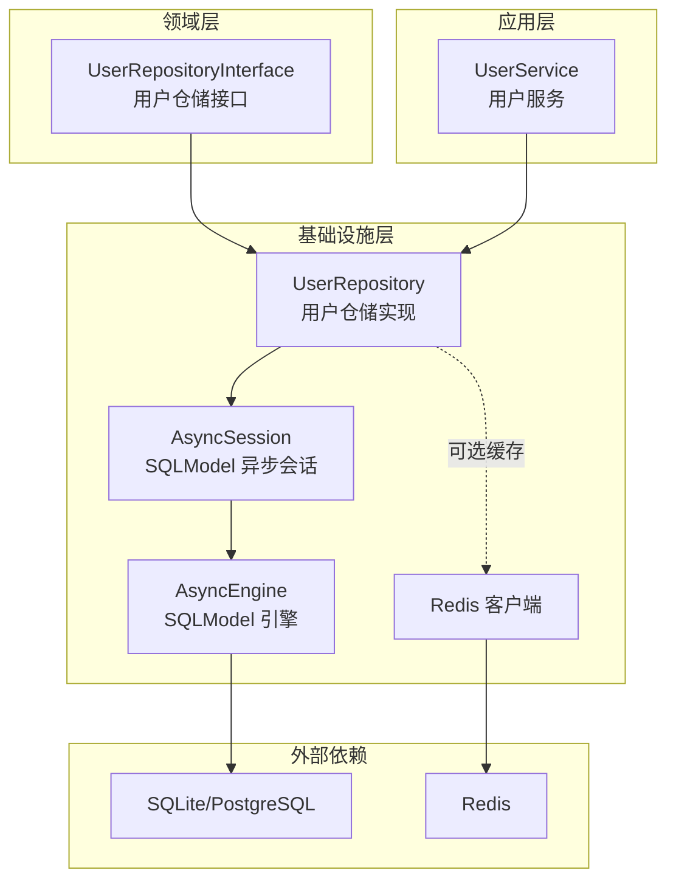
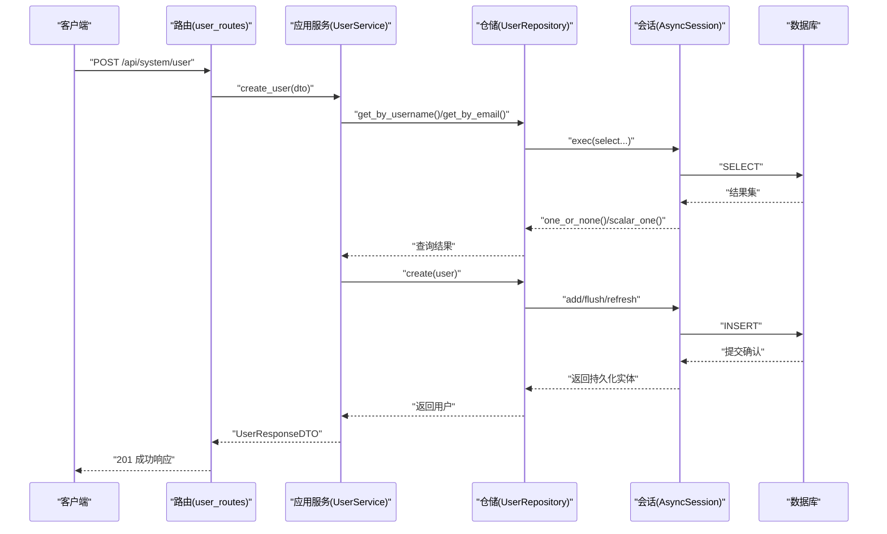
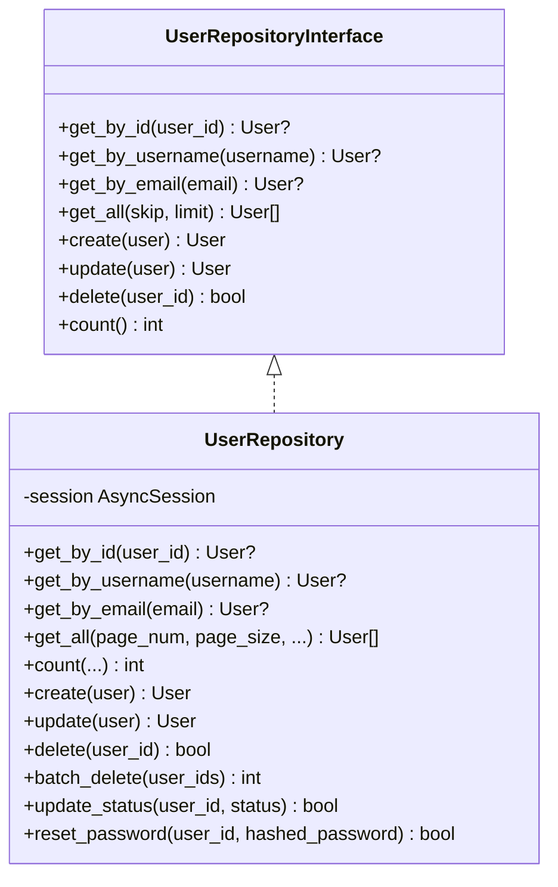
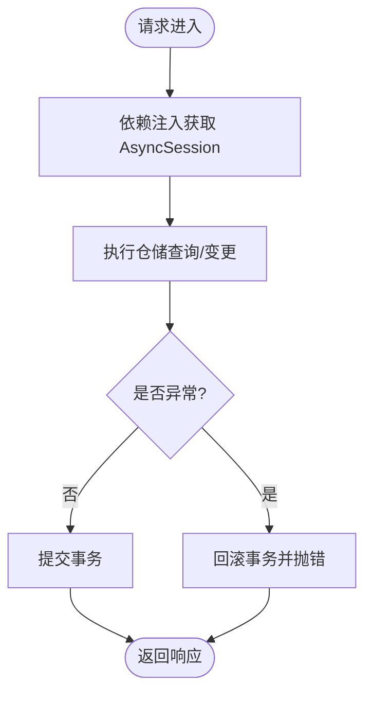
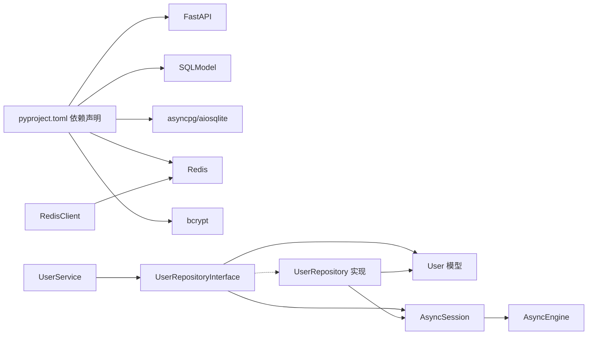

# 用户仓储层

<cite>
**本文引用的文件**
- [user_repository.py](file://service/src/domain/repositories/user_repository.py)
- [user_repository.py](file://service/src/infrastructure/repositories/user_repository.py)
- [__init__.py](file://service/src/domain/repositories/__init__.py)
- [connection.py](file://service/src/infrastructure/database/connection.py)
- [models.py](file://service/src/infrastructure/database/models.py)
- [redis_client.py](file://service/src/infrastructure/cache/redis_client.py)
- [user_service.py](file://service/src/application/services/user_service.py)
- [user_routes.py](file://service/src/api/v1/user_routes.py)
- [user_dto.py](file://service/src/application/dto/user_dto.py)
- [settings.py](file://service/src/config/settings.py)
- [department_repository.py](file://service/src/infrastructure/repositories/department_repository.py)
- [rbac_repository.py](file://service/src/infrastructure/repositories/rbac_repository.py)
- [pyproject.toml](file://service/pyproject.toml)
</cite>

## 更新摘要
**所做变更**
- 更新了项目结构部分，反映用户仓储接口已重新组织到新的domain/repositories结构
- 更新了核心组件分析，强调领域层与基础设施层的清晰分离
- 更新了依赖分析，展示新的导入路径和模块组织
- 更新了架构总览图，体现新的分层架构模式

## 目录
1. [简介](#简介)
2. [项目结构](#项目结构)
3. [核心组件](#核心组件)
4. [架构总览](#架构总览)
5. [详细组件分析](#详细组件分析)
6. [依赖分析](#依赖分析)
7. [性能考量](#性能考量)
8. [故障排查指南](#故障排查指南)
9. [结论](#结论)
10. [附录](#附录)

## 简介
本文件聚焦于"用户仓储层"的设计与实现，覆盖以下主题：
- 用户仓储接口的抽象设计与职责边界
- 基于 SQLModel 的具体实现，包含查询优化与事务管理
- 与数据库连接的交互模式与连接池管理
- 缓存策略与性能优化建议
- 单元测试与集成测试方法
- 扩展点与自定义实现指引
- 维护与优化最佳实践

## 项目结构
用户仓储层位于分层架构的基础设施层，面向领域层暴露统一的仓储接口，面向数据库提供具体实现；应用层通过仓储进行数据访问。

**更新** 项目结构已重新组织，用户仓储接口现在位于`domain/repositories`目录，基础设施实现位于`infrastructure/repositories`目录，体现了清晰的领域驱动设计分离。

**图表来源**
- [user_repository.py:11-107](file://service/src/domain/repositories/user_repository.py#L11-L107)
- [user_repository.py:11-169](file://service/src/infrastructure/repositories/user_repository.py#L11-L169)
- [connection.py:9-21](file://service/src/infrastructure/database/connection.py#L9-L21)
- [redis_client.py:10-24](file://service/src/infrastructure/cache/redis_client.py#L10-L24)

**章节来源**
- [user_repository.py:1-107](file://service/src/domain/repositories/user_repository.py#L1-L107)
- [user_repository.py:1-169](file://service/src/infrastructure/repositories/user_repository.py#L1-L169)
- [connection.py:1-35](file://service/src/infrastructure/database/connection.py#L1-L35)
- [redis_client.py:1-24](file://service/src/infrastructure/cache/redis_client.py#L1-L24)

## 核心组件
- 用户仓储接口：定义用户实体的CRUD与统计等抽象方法，确保应用层与具体数据访问解耦。
- 用户仓储实现：基于 SQLModel 的异步实现，提供分页、筛选、批量删除、状态更新、密码重置等能力。
- 数据库连接与会话：通过异步引擎与依赖注入提供会话生命周期管理，自动提交与回滚。
- 缓存客户端：提供 Redis 异步客户端，可作为仓储层的可选缓存层。
- 应用服务与路由：应用服务调用仓储完成业务逻辑，路由负责请求接入与权限校验。

**更新** 核心组件现在体现了清晰的分层架构：
- 领域层接口位于`domain/repositories`，定义抽象契约
- 基础设施层实现位于`infrastructure/repositories`，提供具体实现
- 依赖注入确保应用层只依赖抽象接口

**章节来源**
- [user_repository.py:11-107](file://service/src/domain/repositories/user_repository.py#L11-L107)
- [user_repository.py:11-169](file://service/src/infrastructure/repositories/user_repository.py#L11-L169)
- [connection.py:12-21](file://service/src/infrastructure/database/connection.py#L12-L21)
- [redis_client.py:10-24](file://service/src/infrastructure/cache/redis_client.py#L10-L24)
- [user_service.py:16-293](file://service/src/application/services/user_service.py#L16-L293)
- [user_routes.py:17-228](file://service/src/api/v1/user_routes.py#L17-L228)

## 架构总览
用户仓储层遵循 DDD 分层与依赖倒置原则：
- 领域层仅依赖抽象接口，避免被具体实现细节影响
- 基础设施层实现接口，封装数据库与缓存访问
- 应用层通过仓储执行业务操作，集中处理用例编排
- 路由层负责鉴权与输入输出，不直接操作数据

**更新** 架构现在更加清晰地分离了领域层和基础设施层：

**图表来源**
- [user_routes.py:58-73](file://service/src/api/v1/user_routes.py#L58-L73)
- [user_service.py:30-51](file://service/src/application/services/user_service.py#L30-L51)
- [user_repository.py:98-103](file://service/src/infrastructure/repositories/user_repository.py#L98-L103)
- [connection.py:12-21](file://service/src/infrastructure/database/connection.py#L12-L21)

## 详细组件分析

### 用户仓储接口设计
- 设计要点
  - 使用抽象基类定义一组异步方法，覆盖按主键/唯一键查询、分页查询、创建、更新、删除、计数等
  - 方法签名明确输入参数与返回类型，便于上层应用层契约清晰
  - 通过接口隔离具体ORM实现，利于替换与测试
- 关键方法
  - get_by_id/get_by_username/get_by_email：单条查询
  - get_all/skip/limit：分页查询
  - create/update/delete/count：标准CRUD与统计
- 与领域模型的关系
  - 返回与持久化模型一致，减少映射成本

**更新** 接口现在位于`domain/repositories`目录，体现了领域驱动设计的核心原则：
- 领域层定义抽象契约，不依赖具体实现
- 基础设施层提供具体实现
- 应用层通过接口编程，实现依赖倒置

**章节来源**
- [user_repository.py:11-107](file://service/src/domain/repositories/user_repository.py#L11-L107)

### 用户仓储实现（SQLModel）
- 查询优化
  - 支持多字段筛选（用户名、手机号、邮箱、状态、部门），并以"包含"匹配提升可用性
  - 分页采用 offset/limit，结合页码与每页大小控制结果规模
  - 计数查询复用筛选条件，避免重复扫描
- 事务管理
  - 通过依赖注入的会话在请求范围内提供自动提交/回滚
  - flush/refresh 确保写入后读取最新状态
- 扩展能力
  - 批量删除：遍历 ID 列表逐个删除并统计成功数量
  - 状态更新：仅更新状态字段
  - 密码重置：仅更新加密后的密码字段
- 错误处理
  - 删除/状态更新/密码重置均对不存在记录返回失败，避免异常传播至应用层

**更新** 实现现在导入领域接口，体现了清晰的依赖关系：
- 基础设施实现类导入`domain/repositories`中的接口定义
- 通过依赖注入确保运行时绑定到具体实现
- 保持接口契约不变，便于替换和测试

**图表来源**
- [user_repository.py:11-107](file://service/src/domain/repositories/user_repository.py#L11-L107)
- [user_repository.py:11-169](file://service/src/infrastructure/repositories/user_repository.py#L11-L169)

**章节来源**
- [user_repository.py:11-169](file://service/src/infrastructure/repositories/user_repository.py#L11-L169)

### 数据库连接与会话管理
- 连接引擎
  - 使用异步引擎创建连接，开启 echo 便于调试，启用 pre_ping 提升连接健壮性
- 会话提供
  - 依赖注入生成会话，请求结束自动提交；捕获异常后回滚并重新抛出
- 初始化与关闭
  - 初始化时创建所有表结构
  - 应用关闭时释放引擎资源

**图表来源**
- [connection.py:12-21](file://service/src/infrastructure/database/connection.py#L12-L21)

**章节来源**
- [connection.py:1-35](file://service/src/infrastructure/database/connection.py#L1-L35)

### 缓存策略与性能优化
- 现状说明
  - 项目提供了 Redis 异步客户端，但当前用户仓储实现未直接集成缓存
- 建议方案
  - 读多写少场景：对高频查询（如按 ID/用户名/邮箱）增加缓存层，设置合理 TTL
  - 写操作后：采用"失效优先"策略，删除对应键，保证一致性
  - 批量场景：对列表查询结果可做分页级缓存，结合 ETag/Last-Modified
- 与仓储的集成方式
  - 在仓储实现中注入 Redis 客户端，按策略决定命中/穿透/回写
  - 对热点数据可考虑本地缓存（进程内）降低网络开销
- 与连接池协同
  - 缓存与数据库连接池独立管理，避免相互阻塞

**章节来源**
- [redis_client.py:1-24](file://service/src/infrastructure/cache/redis_client.py#L1-L24)

### 应用服务与路由协作
- 应用服务
  - 调用仓储完成业务编排，如创建用户前检查唯一性、更新用户时选择性更新字段
  - 将实体转换为响应 DTO，补充角色与权限信息
- 路由层
  - 提供统一的 HTTP 接口，绑定权限校验与输入 DTO 校验
  - 通过依赖注入传递会话给应用服务

**更新** 依赖关系现在更加清晰：
- 应用服务依赖领域接口而非具体实现
- 路由层通过依赖注入提供仓储实例
- 便于单元测试和替换实现

**章节来源**
- [user_service.py:16-293](file://service/src/application/services/user_service.py#L16-L293)
- [user_routes.py:17-228](file://service/src/api/v1/user_routes.py#L17-L228)
- [user_dto.py:1-86](file://service/src/application/dto/user_dto.py#L1-L86)

### 其他仓储实现参考
- 菜单仓储：展示简洁 CRUD 实现，适合对比学习
- RBAC 仓储：包含多对多关系的维护与批量操作，体现复杂查询与事务处理

**章节来源**
- [department_repository.py:1-50](file://service/src/infrastructure/repositories/department_repository.py#L1-L50)
- [rbac_repository.py:1-213](file://service/src/infrastructure/repositories/rbac_repository.py#L1-L213)

## 依赖分析
- 外部依赖
  - FastAPI、SQLModel、aiosqlite/asyncpg、Pydantic Settings、Redis、bcrypt 等
- 内部依赖
  - 应用层依赖仓储接口；仓储实现依赖 SQLModel 与数据库模型
  - 路由依赖应用服务；配置模块提供数据库与缓存地址

**更新** 依赖关系现在更加清晰地体现了分层架构：
- 领域层只依赖抽象接口
- 基础设施层实现接口并依赖具体技术
- 应用层通过接口编程，实现解耦

**图表来源**
- [pyproject.toml:7-20](file://service/pyproject.toml#L7-L20)
- [user_service.py:8-10](file://service/src/application/services/user_service.py#L8-L10)
- [user_repository.py:7-8](file://service/src/infrastructure/repositories/user_repository.py#L7-L8)
- [models.py:41-112](file://service/src/infrastructure/database/models.py#L41-L112)
- [redis_client.py:1-24](file://service/src/infrastructure/cache/redis_client.py#L1-L24)

**章节来源**
- [pyproject.toml:1-76](file://service/pyproject.toml#L1-L76)
- [settings.py:57-62](file://service/src/config/settings.py#L57-L62)

## 性能考量
- 查询层面
  - 为常用过滤字段建立索引（如用户名、邮箱、部门 ID），减少 LIKE 包含查询的扫描范围
  - 对分页查询，优先使用基于索引的排序列，避免大 offset
- 写入层面
  - 批量删除建议分批执行，避免长事务占用锁资源
  - flush/refresh 的使用应与业务需求平衡，避免过度刷新
- 连接与缓存
  - 数据库连接池参数需结合并发与慢查询监控调整
  - 缓存命中率低时，评估是否需要淘汰策略或预热机制
- 监控与观测
  - 为仓储关键方法埋点，记录耗时、错误与缓存命中情况

## 故障排查指南
- 常见问题
  - 事务未提交/回滚：检查路由与服务层是否正确传递会话，确保异常路径触发回滚
  - 唯一约束冲突：创建/更新时检查 DTO 字段与仓储唯一性校验
  - 查询性能差：确认过滤条件是否走索引，避免全表扫描
- 定位手段
  - 开启数据库 echo 输出，观察生成的 SQL
  - 使用日志与指标监控仓储方法耗时
  - 对热点查询引入缓存并观察命中率变化

**章节来源**
- [connection.py:12-21](file://service/src/infrastructure/database/connection.py#L12-L21)
- [user_service.py:30-51](file://service/src/application/services/user_service.py#L30-L51)

## 结论
用户仓储层通过清晰的接口抽象与 SQLModel 实现，实现了稳定的 CRUD 与统计能力，并配合应用服务完成业务编排。当前实现具备良好的扩展性，可在不破坏契约的前提下引入缓存、优化查询与事务处理。**更新** 新的分层架构进一步增强了系统的可维护性和可测试性，领域层与基础设施层的清晰分离使得系统更易于演进和扩展。

## 附录

### 单元测试与集成测试方法
- 单元测试
  - 使用内存数据库（如 SQLite 内存库）或测试专用数据库
  - 使用工厂/伪造工具构造 DTO 与实体，隔离仓储实现
  - 验证仓储方法的返回值、异常与事务行为
- 集成测试
  - 启动完整应用栈，通过 HTTP 调用路由，验证端到端流程
  - 使用测试配置（如测试数据库 URL）与断言响应结构
- 建议的测试覆盖
  - 正常路径：创建、查询、更新、删除、批量删除
  - 边界与异常：唯一性冲突、不存在记录、权限不足、无效输入

**章节来源**
- [settings.py:132-142](file://service/src/config/settings.py#L132-L142)
- [pyproject.toml:69-76](file://service/pyproject.toml#L69-L76)

### 扩展点与自定义实现
- 自定义仓储实现
  - 可基于不同 ORM（如 SQLAlchemy Core）或存储（如 PostgreSQL JSON/JSONB）实现同一接口
  - 可引入二级缓存（Redis/Memcached）或本地缓存（进程内）
- 事务与并发
  - 在高并发场景下，细化事务粒度，必要时引入乐观锁或版本号
- 查询增强
  - 引入全文检索（如 PostgreSQL tsvector）、地理空间查询或向量化检索（视业务而定）

### 维护与优化建议
- 代码维护
  - 保持仓储接口稳定，新增方法通过扩展而非破坏性变更
  - 对复杂查询抽取为独立方法，提升可读性与可测性
- 性能优化
  - 定期审查慢查询，添加索引与优化 SQL
  - 对热点数据引入缓存，关注缓存一致性与失效策略
- 配置与部署
  - 通过配置模块区分开发/生产/测试环境，确保数据库与缓存地址正确
  - 监控连接池与缓存命中率，动态调整参数