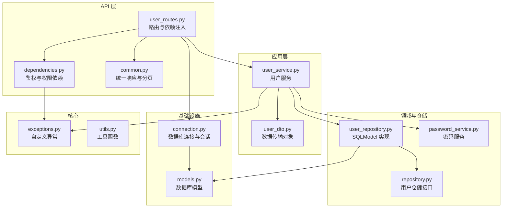
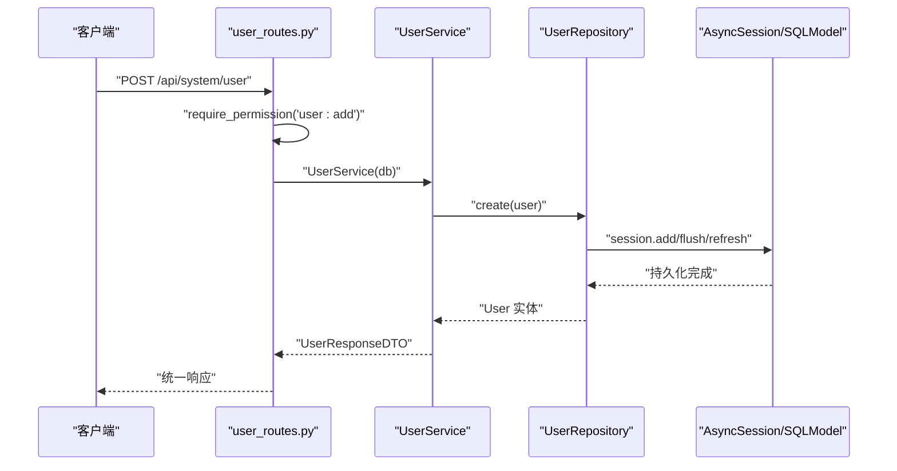
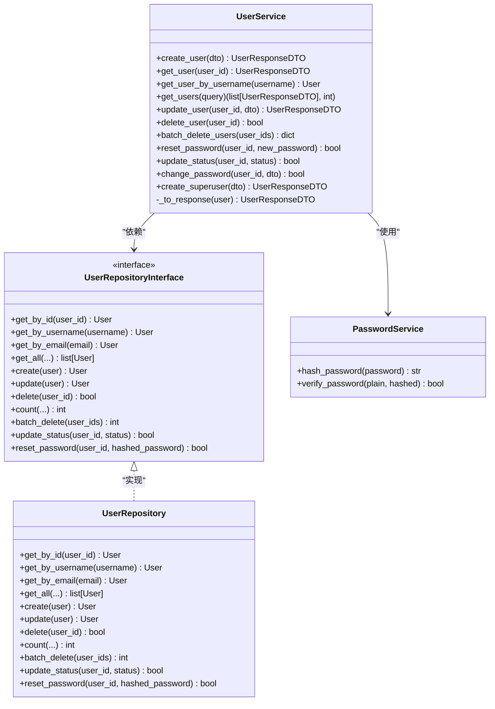
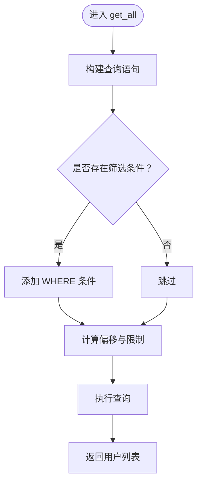
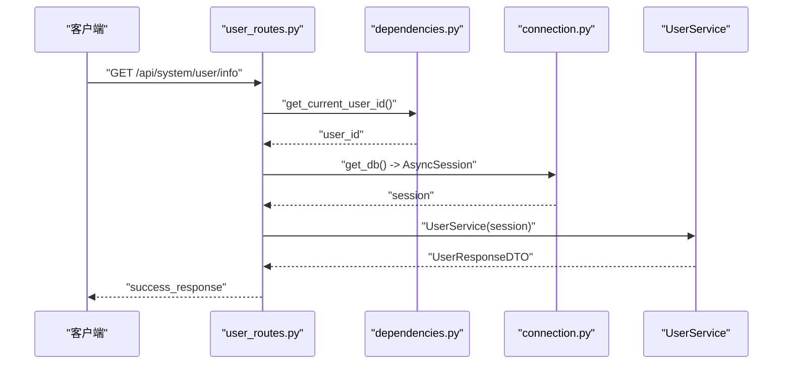
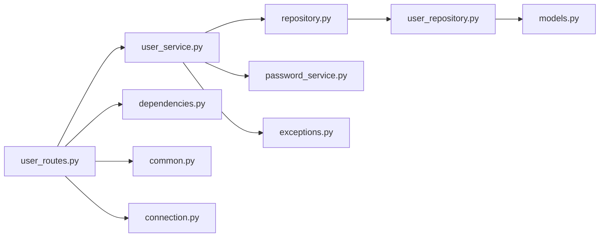

# 用户服务实现

<cite>
**本文档引用的文件**
- [user_service.py](file://service/src/application/services/user_service.py)
- [user_repository.py](file://service/src/infrastructure/repositories/user_repository.py)
- [repository.py](file://service/src/domain/user/repository.py)
- [user_routes.py](file://service/src/api/v1/user_routes.py)
- [user_dto.py](file://service/src/application/dto/user_dto.py)
- [password_service.py](file://service/src/domain/auth/password_service.py)
- [models.py](file://service/src/infrastructure/database/models.py)
- [dependencies.py](file://service/src/api/dependencies.py)
- [exceptions.py](file://service/src/core/exceptions.py)
- [connection.py](file://service/src/infrastructure/database/connection.py)
- [common.py](file://service/src/api/common.py)
- [main.py](file://service/src/main.py)
- [utils.py](file://service/src/core/utils.py)
- [pyproject.toml](file://service/pyproject.toml)
</cite>

## 目录
1. [简介](#简介)
2. [项目结构](#项目结构)
3. [核心组件](#核心组件)
4. [架构总览](#架构总览)
5. [详细组件分析](#详细组件分析)
6. [依赖分析](#依赖分析)
7. [性能考虑](#性能考虑)
8. [故障排除指南](#故障排除指南)
9. [结论](#结论)
10. [附录](#附录)

## 简介
本文件面向开发者，系统化阐述用户服务层的实现细节与最佳实践，涵盖用户 CRUD 操作、数据验证与业务规则、错误处理机制、仓储层交互与依赖注入、用户状态管理与数据一致性保障、单元测试策略与扩展建议。文档以实际源码为依据，辅以可视化图示帮助不同背景读者快速理解。

## 项目结构
后端采用分层架构（API → 应用服务 → 领域/仓储 → 基础设施），用户服务位于应用层，负责编排业务流程并与仓储层交互；API 层通过依赖注入提供数据库会话；仓储层基于 SQLModel 实现；模型定义在基础设施层；异常与通用响应在核心层与 API 层协同处理。

**图表来源**
- [user_routes.py:1-252](file://service/src/api/v1/user_routes.py#L1-L252)
- [user_service.py:1-322](file://service/src/application/services/user_service.py#L1-L322)
- [user_repository.py:1-185](file://service/src/infrastructure/repositories/user_repository.py#L1-L185)
- [repository.py:1-50](file://service/src/domain/user/repository.py#L1-L50)
- [password_service.py:1-21](file://service/src/domain/auth/password_service.py#L1-L21)
- [models.py:1-193](file://service/src/infrastructure/database/models.py#L1-L193)
- [dependencies.py:1-72](file://service/src/api/dependencies.py#L1-L72)
- [common.py:1-65](file://service/src/api/common.py#L1-L65)
- [connection.py:1-35](file://service/src/infrastructure/database/connection.py#L1-L35)
- [exceptions.py:1-60](file://service/src/core/exceptions.py#L1-L60)
- [utils.py:1-27](file://service/src/core/utils.py#L1-L27)

**章节来源**
- [user_routes.py:1-252](file://service/src/api/v1/user_routes.py#L1-L252)
- [user_service.py:1-322](file://service/src/application/services/user_service.py#L1-L322)
- [user_repository.py:1-185](file://service/src/infrastructure/repositories/user_repository.py#L1-L185)
- [repository.py:1-50](file://service/src/domain/user/repository.py#L1-L50)
- [password_service.py:1-21](file://service/src/domain/auth/password_service.py#L1-L21)
- [models.py:1-193](file://service/src/infrastructure/database/models.py#L1-L193)
- [dependencies.py:1-72](file://service/src/api/dependencies.py#L1-L72)
- [common.py:1-65](file://service/src/api/common.py#L1-L65)
- [connection.py:1-35](file://service/src/infrastructure/database/connection.py#L1-L35)
- [exceptions.py:1-60](file://service/src/core/exceptions.py#L1-L60)
- [utils.py:1-27](file://service/src/core/utils.py#L1-L27)

## 核心组件
- 用户服务（应用层）：封装用户 CRUD、密码管理、状态变更等业务逻辑，负责数据校验、唯一性检查、DTO 转换与异常抛出。
- 用户仓储接口与实现：定义抽象接口与 SQLModel 实现，提供按条件查询、分页、计数、批量删除、状态与密码重置等能力。
- DTO：Pydantic 定义的输入输出模型，内置字段长度、范围与别名等约束。
- 密码服务：基于 bcrypt 的哈希与校验。
- API 路由与依赖：提供鉴权、权限校验、统一响应与分页返回。
- 异常体系：统一的业务异常类型，便于全局捕获与标准化响应。

**章节来源**
- [user_service.py:18-322](file://service/src/application/services/user_service.py#L18-L322)
- [repository.py:8-50](file://service/src/domain/user/repository.py#L8-L50)
- [user_repository.py:11-185](file://service/src/infrastructure/repositories/user_repository.py#L11-L185)
- [user_dto.py:1-86](file://service/src/application/dto/user_dto.py#L1-L86)
- [password_service.py:6-21](file://service/src/domain/auth/password_service.py#L6-L21)
- [user_routes.py:1-252](file://service/src/api/v1/user_routes.py#L1-L252)
- [exceptions.py:1-60](file://service/src/core/exceptions.py#L1-L60)

## 架构总览
用户服务遵循“应用服务编排、仓储持久化”的分层思想。API 层通过依赖注入获取数据库会话，构造用户服务实例；用户服务调用仓储执行数据库操作；仓储使用 SQLModel 进行查询与更新；最终通过统一响应格式返回给客户端。

**图表来源**
- [user_routes.py:54-74](file://service/src/api/v1/user_routes.py#L54-L74)
- [user_service.py:25-57](file://service/src/application/services/user_service.py#L25-L57)
- [user_repository.py:114-119](file://service/src/infrastructure/repositories/user_repository.py#L114-L119)
- [connection.py:12-21](file://service/src/infrastructure/database/connection.py#L12-L21)

**章节来源**
- [user_routes.py:1-252](file://service/src/api/v1/user_routes.py#L1-L252)
- [user_service.py:1-322](file://service/src/application/services/user_service.py#L1-L322)
- [user_repository.py:1-185](file://service/src/infrastructure/repositories/user_repository.py#L1-L185)
- [connection.py:1-35](file://service/src/infrastructure/database/connection.py#L1-L35)

## 详细组件分析

### 用户服务（应用层）
- 职责边界清晰：仅编排业务，不直接操作数据库。
- 核心方法：
  - 创建用户：检查用户名/邮箱唯一性，哈希密码，创建实体并返回响应 DTO。
  - 查询用户：按 ID 获取用户详情，按条件分页查询并统计总数。
  - 更新用户：选择性更新字段，邮箱唯一性校验。
  - 删除与批量删除：删除失败抛出未找到异常，批量删除返回统计结果。
  - 密码管理：管理员重置密码、当前用户修改密码（旧密码校验）。
  - 状态管理：启用/禁用用户。
  - 超级用户创建：额外标记超级用户字段。
  - 响应转换：将实体转换为包含角色与权限的响应 DTO。
- 错误处理：抛出业务异常（未找到、冲突、未授权、禁止访问等），由全局异常处理器统一响应。

**图表来源**
- [user_service.py:18-322](file://service/src/application/services/user_service.py#L18-L322)
- [repository.py:8-50](file://service/src/domain/user/repository.py#L8-L50)
- [user_repository.py:11-185](file://service/src/infrastructure/repositories/user_repository.py#L11-L185)
- [password_service.py:6-21](file://service/src/domain/auth/password_service.py#L6-L21)

**章节来源**
- [user_service.py:18-322](file://service/src/application/services/user_service.py#L18-L322)

### 用户仓储接口与实现
- 接口职责：定义用户领域所需的查询、创建、更新、删除、计数、批量删除、状态与密码重置等方法。
- 实现要点：
  - 支持按用户名、邮箱、手机号、邮箱、状态、部门 ID 等条件筛选与分页。
  - 使用 SQLModel 的 select/exec 执行查询，支持 count 聚合统计。
  - flush/refresh 确保实体状态与数据库一致。
  - 批量删除逐条尝试删除并统计成功数量。
  - 状态与密码重置通过实体更新实现。

**图表来源**
- [user_repository.py:32-75](file://service/src/infrastructure/repositories/user_repository.py#L32-L75)

**章节来源**
- [repository.py:8-50](file://service/src/domain/user/repository.py#L8-L50)
- [user_repository.py:11-185](file://service/src/infrastructure/repositories/user_repository.py#L11-L185)

### API 路由与依赖注入
- 路由层：
  - 提供用户列表、创建、详情、更新、删除、批量删除、重置密码、状态更新、修改密码等接口。
  - 使用 require_permission 依赖进行权限控制，get_current_user_id 提取当前用户 ID。
  - 统一响应与分页格式由 common.py 提供。
- 依赖注入：
  - get_db 提供 AsyncSession，确保事务提交与回滚。
  - 路由中直接构造 UserService(db)，体现“按需注入”模式。

**图表来源**
- [user_routes.py:76-92](file://service/src/api/v1/user_routes.py#L76-L92)
- [dependencies.py:16-29](file://service/src/api/dependencies.py#L16-L29)
- [connection.py:12-21](file://service/src/infrastructure/database/connection.py#L12-L21)

**章节来源**
- [user_routes.py:1-252](file://service/src/api/v1/user_routes.py#L1-L252)
- [dependencies.py:1-72](file://service/src/api/dependencies.py#L1-L72)
- [common.py:29-65](file://service/src/api/common.py#L29-L65)
- [connection.py:1-35](file://service/src/infrastructure/database/connection.py#L1-L35)

### 数据验证与业务规则
- DTO 验证：用户名长度、密码长度、手机号长度、分页范围、状态枚举等均由 Pydantic 校验。
- 业务规则：
  - 唯一性：创建与更新时检查用户名与邮箱唯一性。
  - 选择性更新：仅当 DTO 字段非空时才更新对应实体字段。
  - 密码安全：创建与重置密码使用 bcrypt 哈希；修改密码需旧密码校验通过。
  - 状态约束：状态值在 0/1 范围内。
  - 工具辅助：邮箱格式与密码强度校验工具函数可复用到上层校验。

**章节来源**
- [user_dto.py:8-86](file://service/src/application/dto/user_dto.py#L8-L86)
- [user_service.py:25-156](file://service/src/application/services/user_service.py#L25-L156)
- [password_service.py:6-21](file://service/src/domain/auth/password_service.py#L6-L21)
- [utils.py:12-27](file://service/src/core/utils.py#L12-L27)

### 错误处理机制
- 自定义异常：NotFoundError、ConflictError、UnauthorizedError、ForbiddenError、ValidationError、RateLimitError、BusinessError。
- 全局异常处理：统一捕获 AppException 并返回标准化响应；RequestValidationError 返回 422 与错误明细；其他异常返回 500。
- 业务异常抛出：未找到资源、冲突（如用户名/邮箱已存在）、权限不足、未授权等场景。

**章节来源**
- [exceptions.py:1-60](file://service/src/core/exceptions.py#L1-L60)
- [main.py:60-82](file://service/src/main.py#L60-L82)
- [user_service.py:37-204](file://service/src/application/services/user_service.py#L37-L204)

### 用户状态管理与数据一致性
- 状态字段：User 模型包含 status 字段（0-禁用，1-启用），兼容 is_active 属性。
- 状态更新：通过 update_status 方法更新实体状态并 flush。
- 数据一致性：
  - 仓储层使用 flush/refresh 确保实体与数据库一致。
  - 会话管理在 get_db 中自动提交或回滚，避免脏读与丢失更新风险。
  - 唯一性约束由数据库层（模型定义）与应用层双重保障。

**章节来源**
- [models.py:31-65](file://service/src/infrastructure/database/models.py#L31-L65)
- [user_repository.py:152-167](file://service/src/infrastructure/repositories/user_repository.py#L152-L167)
- [connection.py:12-21](file://service/src/infrastructure/database/connection.py#L12-L21)

### 单元测试策略与用例设计
- 测试框架：pytest + pytest-asyncio，支持异步测试与覆盖率。
- 建议覆盖维度：
  - 用户服务方法：创建/查询/更新/删除/批量删除/重置密码/状态更新/修改密码。
  - DTO 校验：边界值、非法格式、缺失字段。
  - 仓储方法：条件筛选、分页、计数、唯一性冲突。
  - 异常路径：未找到、冲突、权限不足、未授权。
  - 工具函数：邮箱格式、密码强度。
- 示例用例思路（不展示具体代码）：
  - 正常用例：创建用户成功、查询用户详情、更新邮箱唯一性通过、批量删除部分存在/不存在的 ID。
  - 异常用例：用户名已存在、邮箱已存在、旧密码错误、权限不足、非法 DTO 参数。
  - 边界用例：分页大小最大/最小、状态值边界、空字段选择性更新。

**章节来源**
- [pyproject.toml:69-76](file://service/pyproject.toml#L69-L76)
- [test_core.py:1-37](file://service/tests/unit/test_core.py#L1-L37)

### 性能优化与并发处理
- 查询优化：
  - 使用索引字段（用户名、邮箱、部门 ID）进行筛选与分页。
  - 计数查询使用聚合函数减少数据传输。
- 写入优化：
  - flush/refresh 在必要时使用，避免频繁刷新。
  - 批量删除逐条处理，可在高并发下评估事务粒度。
- 并发处理：
  - AsyncSession 保证异步并发安全。
  - 唯一性检查在应用层与数据库层共同保障，降低并发冲突概率。
- 缓存建议：
  - 对热点用户信息可引入 Redis 缓存（当前仓储未实现缓存层）。

**章节来源**
- [models.py:37-46](file://service/src/infrastructure/database/models.py#L37-L46)
- [user_repository.py:56-75](file://service/src/infrastructure/repositories/user_repository.py#L56-L75)
- [connection.py:12-21](file://service/src/infrastructure/database/connection.py#L12-L21)

### 功能扩展与定制指导
- 扩展点：
  - 新增用户字段：在模型、DTO、仓储查询与响应转换处同步扩展。
  - 新增业务规则：在用户服务中增加校验逻辑并在异常体系中补充相应异常类型。
  - 权限扩展：结合 RBAC 仓储与 require_permission 依赖实现细粒度权限控制。
- 定制建议：
  - 将 UserService 构造改为依赖注入容器管理，提升可测试性与解耦。
  - 在仓储层增加缓存层（Redis）以提升高频读取性能。
  - 引入事务上下文管理器，统一处理复杂业务中的事务边界。

**章节来源**
- [user_service.py:21-23](file://service/src/application/services/user_service.py#L21-L23)
- [dependencies.py:45-60](file://service/src/api/dependencies.py#L45-L60)
- [models.py:1-193](file://service/src/infrastructure/database/models.py#L1-L193)

## 依赖分析
- 组件耦合：
  - UserService 依赖 UserRepositoryInterface，通过构造函数注入，利于替换实现与测试。
  - API 路由依赖 get_db 提供会话，依赖 require_permission 进行权限校验。
- 外部依赖：
  - FastAPI、SQLModel、asyncpg/aiosqlite、bcrypt、Pydantic。
- 循环依赖：
  - 未发现循环依赖，分层清晰。

**图表来源**
- [user_routes.py:1-252](file://service/src/api/v1/user_routes.py#L1-L252)
- [user_service.py:1-322](file://service/src/application/services/user_service.py#L1-L322)
- [repository.py:1-50](file://service/src/domain/user/repository.py#L1-L50)
- [user_repository.py:1-185](file://service/src/infrastructure/repositories/user_repository.py#L1-L185)
- [models.py:1-193](file://service/src/infrastructure/database/models.py#L1-L193)
- [dependencies.py:1-72](file://service/src/api/dependencies.py#L1-L72)
- [common.py:1-65](file://service/src/api/common.py#L1-L65)
- [connection.py:1-35](file://service/src/infrastructure/database/connection.py#L1-L35)
- [exceptions.py:1-60](file://service/src/core/exceptions.py#L1-L60)

**章节来源**
- [pyproject.toml:7-20](file://service/pyproject.toml#L7-L20)
- [user_routes.py:1-252](file://service/src/api/v1/user_routes.py#L1-L252)
- [user_service.py:1-322](file://service/src/application/services/user_service.py#L1-L322)

## 性能考虑
- I/O 密集：异步数据库驱动与 SQLModel 提升并发吞吐。
- 查询优化：合理使用索引字段与分页，避免一次性加载大量数据。
- 写入优化：批量操作建议评估事务粒度与锁竞争。
- 缓存策略：对高频读取的用户信息引入缓存层，降低数据库压力。

[本节为通用性能建议，无需特定文件引用]

## 故障排除指南
- 常见问题与定位：
  - 404 未找到：确认用户 ID 存在，检查路由参数与仓储查询。
  - 409 冲突：用户名或邮箱重复，检查唯一性校验与 DTO 字段。
  - 401/403：令牌无效或权限不足，检查鉴权与 require_permission 依赖。
  - 422 参数验证失败：检查 DTO 字段长度、范围与必填项。
- 排错步骤：
  - 查看全局异常处理器返回的标准化错误信息。
  - 检查数据库连接与会话生命周期（get_db）。
  - 核对仓储层查询条件与分页参数。

**章节来源**
- [exceptions.py:1-60](file://service/src/core/exceptions.py#L1-L60)
- [main.py:60-82](file://service/src/main.py#L60-L82)
- [user_routes.py:1-252](file://service/src/api/v1/user_routes.py#L1-L252)
- [connection.py:12-21](file://service/src/infrastructure/database/connection.py#L12-L21)

## 结论
用户服务实现遵循分层与依赖倒置原则，通过 DTO 校验、仓储抽象与统一异常处理，提供了清晰、可维护且可扩展的用户管理能力。结合权限控制与事务管理，能够满足大多数业务场景下的用户 CRUD 与状态管理需求。建议后续引入缓存与依赖注入容器，进一步提升性能与可测试性。

[本节为总结性内容，无需特定文件引用]

## 附录
- 关键实现路径参考：
  - 用户服务创建用户：[user_service.py:25-57](file://service/src/application/services/user_service.py#L25-L57)
  - 用户服务更新用户：[user_service.py:115-156](file://service/src/application/services/user_service.py#L115-L156)
  - 用户仓储分页查询：[user_repository.py:32-75](file://service/src/infrastructure/repositories/user_repository.py#L32-L75)
  - API 路由权限依赖：[dependencies.py:45-60](file://service/src/api/dependencies.py#L45-L60)
  - 统一响应格式：[common.py:29-65](file://service/src/api/common.py#L29-L65)

[本节为补充说明，无需特定文件引用]