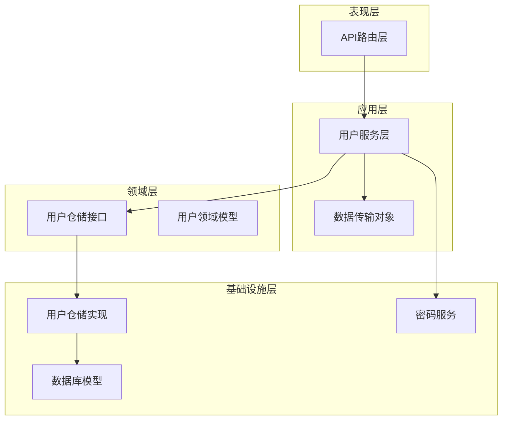
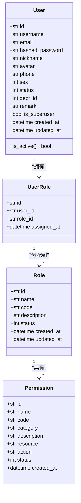
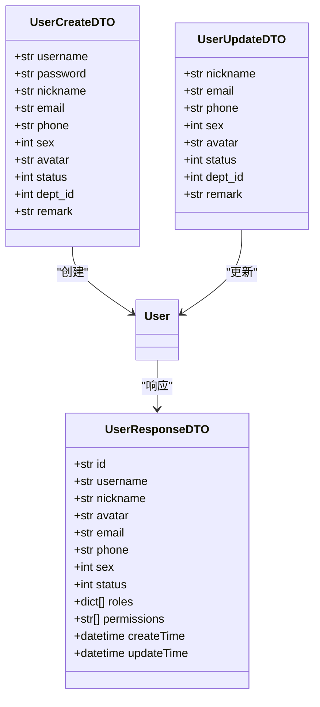
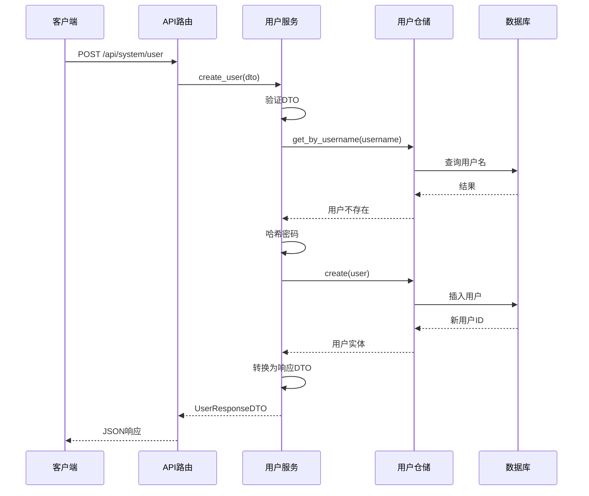
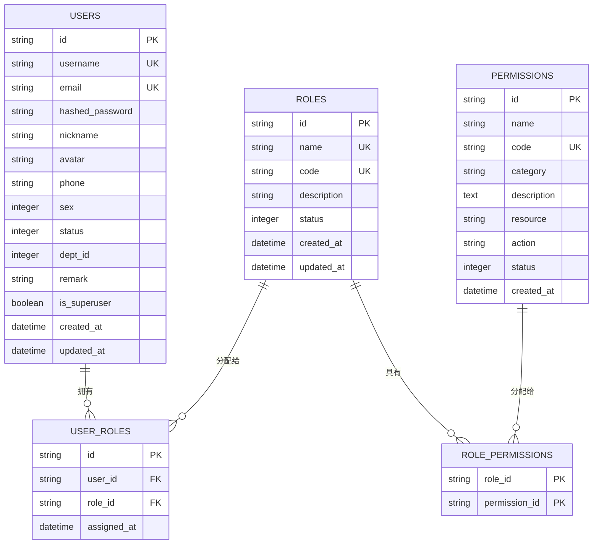
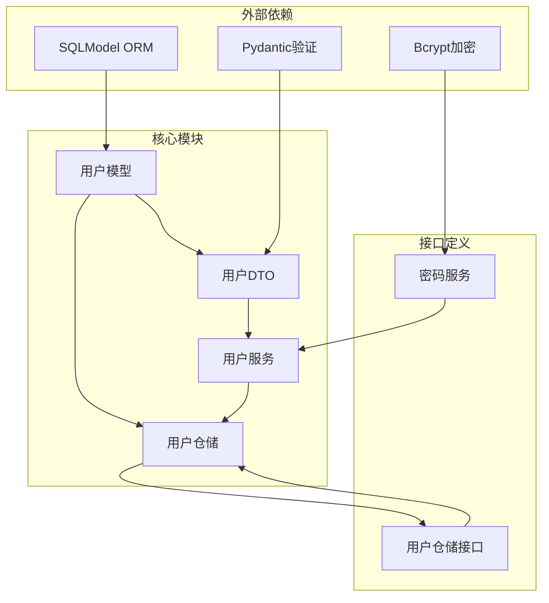

# 用户模型设计

<cite>
**本文档引用的文件**
- [models.py](file://service/src/infrastructure/database/models.py)
- [user_dto.py](file://service/src/application/dto/user_dto.py)
- [user_repository.py](file://service/src/infrastructure/repositories/user_repository.py)
- [user_service.py](file://service/src/application/services/user_service.py)
- [user_routes.py](file://service/src/api/v1/user_routes.py)
- [repository.py](file://service/src/domain/user/repository.py)
- [password_service.py](file://service/src/domain/auth/password_service.py)
- [validators.py](file://service/src/core/validators.py)
</cite>

## 目录
1. [简介](#简介)
2. [项目结构](#项目结构)
3. [核心组件](#核心组件)
4. [架构概览](#架构概览)
5. [详细组件分析](#详细组件分析)
6. [依赖关系分析](#依赖关系分析)
7. [性能考虑](#性能考虑)
8. [故障排除指南](#故障排除指南)
9. [结论](#结论)
10. [附录](#附录)

## 简介

本文件详细阐述了基于FastAPI + DDD + RBAC架构的用户实体模型设计。该系统采用SQLModel作为ORM框架，实现了完整的用户管理功能，包括用户CRUD操作、密码管理、状态控制以及基于角色的权限控制。用户模型设计遵循领域驱动设计原则，通过清晰的分层架构实现了业务逻辑与数据访问的分离。

## 项目结构

用户模型在整个应用架构中位于以下层次结构中：



**图表来源**
- [user_routes.py:1-252](file://service/src/api/v1/user_routes.py#L1-L252)
- [user_service.py:1-322](file://service/src/application/services/user_service.py#L1-L322)
- [models.py:1-193](file://service/src/infrastructure/database/models.py#L1-L193)

**章节来源**
- [user_routes.py:1-252](file://service/src/api/v1/user_routes.py#L1-L252)
- [user_service.py:1-322](file://service/src/application/services/user_service.py#L1-L322)
- [models.py:1-193](file://service/src/infrastructure/database/models.py#L1-L193)

## 核心组件

### 用户实体模型

用户实体是整个RBAC系统的核心，定义了用户的基本属性和行为：



**图表来源**
- [models.py:31-65](file://service/src/infrastructure/database/models.py#L31-L65)
- [models.py:70-95](file://service/src/infrastructure/database/models.py#L70-L95)
- [models.py:123-141](file://service/src/infrastructure/database/models.py#L123-L141)
- [models.py:97-121](file://service/src/infrastructure/database/models.py#L97-L121)

### 数据传输对象

系统使用Pydantic模型进行数据验证和序列化：



**图表来源**
- [user_dto.py:8-54](file://service/src/application/dto/user_dto.py#L8-L54)
- [user_dto.py:24-36](file://service/src/application/dto/user_dto.py#L24-L36)
- [user_dto.py:38-54](file://service/src/application/dto/user_dto.py#L38-L54)

**章节来源**
- [models.py:31-65](file://service/src/infrastructure/database/models.py#L31-L65)
- [user_dto.py:1-86](file://service/src/application/dto/user_dto.py#L1-L86)

## 架构概览

用户模型采用六边形架构（端口和适配器），实现了业务逻辑与技术细节的分离：



**图表来源**
- [user_routes.py:54-74](file://service/src/api/v1/user_routes.py#L54-L74)
- [user_service.py:25-58](file://service/src/application/services/user_service.py#L25-L58)
- [user_repository.py:114-119](file://service/src/infrastructure/repositories/user_repository.py#L114-L119)

**章节来源**
- [user_routes.py:1-252](file://service/src/api/v1/user_routes.py#L1-L252)
- [user_service.py:1-322](file://service/src/application/services/user_service.py#L1-L322)

## 详细组件分析

### 用户实体字段定义

用户实体包含以下核心字段：

| 字段名 | 类型 | 约束 | 描述 | 索引 |
|--------|------|------|------|------|
| id | str | 主键, UUID | 用户唯一标识符 | 是 |
| username | str | 非空, 唯一, 长度50 | 用户名 | 是 |
| email | str | 可空, 唯一, 长度100 | 邮箱地址 | 是 |
| hashed_password | str | 非空, 长度255 | 哈希后的密码 | 否 |
| nickname | str | 可空, 长度64 | 昵称 | 否 |
| avatar | str | 可空, 长度500 | 头像URL | 否 |
| phone | str | 可空, 长度20 | 手机号码 | 否 |
| sex | int | 可空 | 性别(0-男, 1-女) | 否 |
| status | int | 默认1 | 状态(0-禁用, 1-启用) | 否 |
| dept_id | int | 可空 | 部门ID | 否 |
| remark | str | 可空, 长度500 | 备注 | 否 |
| is_superuser | bool | 默认False | 是否超级用户 | 否 |
| created_at | datetime | 自动设置 | 创建时间 | 否 |
| updated_at | datetime | 自动更新 | 更新时间 | 否 |

**章节来源**
- [models.py:36-53](file://service/src/infrastructure/database/models.py#L36-L53)

### RBAC关联关系设计

用户模型通过多对多关系与角色和权限建立关联：



**图表来源**
- [models.py:31-65](file://service/src/infrastructure/database/models.py#L31-L65)
- [models.py:70-95](file://service/src/infrastructure/database/models.py#L70-L95)
- [models.py:97-121](file://service/src/infrastructure/database/models.py#L97-L121)
- [models.py:123-141](file://service/src/infrastructure/database/models.py#L123-L141)

### 序列化和反序列化处理

系统采用多种方式处理数据序列化：

#### Pydantic模型序列化
- 使用`model_config = {"from_attributes": True}`支持从SQLModel实体转换
- 使用`model_config = {"populate_by_name": True}`支持字段别名
- 自动处理JSON序列化和反序列化

#### 密码安全处理
- 使用bcrypt进行密码哈希
- 支持密码验证功能
- 避免存储明文密码

**章节来源**
- [user_dto.py:21-53](file://service/src/application/dto/user_dto.py#L21-L53)
- [password_service.py:9-21](file://service/src/domain/auth/password_service.py#L9-L21)

### 数据验证规则

系统在多个层面实施数据验证：

#### Pydantic验证规则
- 用户名：3-50字符，仅允许字母数字和下划线
- 密码：至少8字符，必须包含大小写字母和数字
- 手机号：最多20字符
- 邮箱：可空但需符合邮箱格式

#### 业务约束
- 用户名唯一性检查
- 邮箱唯一性检查
- 状态值范围限制(0-1)
- 部门ID外键约束

**章节来源**
- [validators.py:8-25](file://service/src/core/validators.py#L8-L25)
- [user_dto.py:10-18](file://service/src/application/dto/user_dto.py#L10-L18)

### 数据库表结构设计

用户相关表的完整设计：

#### 用户表(users)
```sql
CREATE TABLE users (
    id VARCHAR(36) PRIMARY KEY,
    username VARCHAR(50) NOT NULL UNIQUE,
    email VARCHAR(100) UNIQUE,
    hashed_password VARCHAR(255) NOT NULL,
    nickname VARCHAR(64),
    avatar VARCHAR(500),
    phone VARCHAR(20),
    sex INTEGER,
    status INTEGER DEFAULT 1,
    dept_id INTEGER,
    remark VARCHAR(500),
    is_superuser BOOLEAN DEFAULT FALSE,
    created_at TIMESTAMP WITH TIME ZONE DEFAULT CURRENT_TIMESTAMP,
    updated_at TIMESTAMP WITH TIME ZONE DEFAULT CURRENT_TIMESTAMP ON UPDATE CURRENT_TIMESTAMP
);
```

#### 用户-角色关联表(user_roles)
```sql
CREATE TABLE user_roles (
    id VARCHAR(36) PRIMARY KEY,
    user_id VARCHAR(36) NOT NULL,
    role_id VARCHAR(36) NOT NULL,
    assigned_at TIMESTAMP WITH TIME ZONE DEFAULT CURRENT_TIMESTAMP,
    FOREIGN KEY (user_id) REFERENCES users(id) ON DELETE CASCADE,
    FOREIGN KEY (role_id) REFERENCES roles(id) ON DELETE CASCADE
);
```

#### 角色-权限关联表(role_permissions)
```sql
CREATE TABLE role_permissions (
    role_id VARCHAR(36) NOT NULL,
    permission_id VARCHAR(36) NOT NULL,
    PRIMARY KEY (role_id, permission_id),
    FOREIGN KEY (role_id) REFERENCES roles(id) ON DELETE CASCADE,
    FOREIGN KEY (permission_id) REFERENCES permissions(id) ON DELETE CASCADE
);
```

**章节来源**
- [models.py:17-26](file://service/src/infrastructure/database/models.py#L17-L26)
- [models.py:34-53](file://service/src/infrastructure/database/models.py#L34-L53)
- [models.py:126-134](file://service/src/infrastructure/database/models.py#L126-L134)

### 索引策略

#### 当前索引配置
- 用户名：唯一索引
- 邮箱：唯一索引
- IP地址：普通索引
- 角色编码：唯一索引
- 权限编码：唯一索引

#### 建议的额外索引
```sql
-- 用户表建议索引
CREATE INDEX idx_users_phone ON users(phone);
CREATE INDEX idx_users_status ON users(status);
CREATE INDEX idx_users_dept_id ON users(dept_id);

-- 用户-角色关联表建议索引
CREATE INDEX idx_user_roles_user_id ON user_roles(user_id);
CREATE INDEX idx_user_roles_role_id ON user_roles(role_id);

-- 角色-权限关联表建议索引
CREATE INDEX idx_role_permissions_role_id ON role_permissions(role_id);
CREATE INDEX idx_role_permissions_permission_id ON role_permissions(permission_id);
```

**章节来源**
- [models.py:37-38](file://service/src/infrastructure/database/models.py#L37-L38)
- [models.py:182-182](file://service/src/infrastructure/database/models.py#L182-L182)

## 依赖关系分析

用户模型与其他组件的依赖关系：



**图表来源**
- [models.py:1-13](file://service/src/infrastructure/database/models.py#L1-L13)
- [user_dto.py:3-6](file://service/src/application/dto/user_dto.py#L3-L6)
- [password_service.py:3-4](file://service/src/domain/auth/password_service.py#L3-L4)

**章节来源**
- [repository.py:1-50](file://service/src/domain/user/repository.py#L1-L50)
- [user_service.py:1-16](file://service/src/application/services/user_service.py#L1-L16)

## 性能考虑

### 查询优化
- 使用selectin加载策略减少N+1查询问题
- 为常用查询字段建立索引
- 实现分页查询避免大数据集加载

### 缓存策略
- 用户信息缓存机制
- 权限缓存优化
- Redis集成支持

### 并发处理
- 异步数据库操作
- 连接池管理
- 事务一致性保证

## 故障排除指南

### 常见问题及解决方案

#### 用户名冲突
**问题**：创建用户时报用户名已存在
**解决**：检查用户名唯一性约束，使用不同的用户名

#### 邮箱冲突  
**问题**：邮箱已被其他用户使用
**解决**：修改邮箱地址或联系管理员

#### 密码验证失败
**问题**：修改密码时报旧密码不正确
**解决**：确认输入的旧密码与数据库中的哈希值匹配

#### 权限不足
**问题**：执行用户管理操作返回权限错误
**解决**：确保当前用户具有相应的RBAC权限

**章节来源**
- [user_service.py:37-41](file://service/src/application/services/user_service.py#L37-L41)
- [user_service.py:241-247](file://service/src/application/services/user_service.py#L241-L247)

## 结论

用户实体模型设计充分体现了现代Web应用的安全性和可扩展性要求。通过采用SQLModel + Pydantic + FastAPI的技术栈，实现了：

1. **安全性**：密码哈希存储、权限控制、输入验证
2. **可维护性**：清晰的分层架构、接口抽象
3. **性能**：异步操作、连接池、索引优化
4. **可扩展性**：模块化设计、易于添加新功能

该设计为后续的功能扩展和性能优化奠定了坚实的基础。

## 附录

### 开发者扩展指导

#### 添加新字段
1. 在`User`模型中添加字段定义
2. 在相关DTO中添加对应字段
3. 在服务层处理字段映射
4. 更新数据库迁移脚本

#### 修改验证规则
1. 在对应的DTO中调整验证参数
2. 在业务逻辑中添加必要的检查
3. 更新API文档

#### 扩展权限系统
1. 在`Permission`模型中添加新权限
2. 在角色中分配相应权限
3. 在API路由中添加权限检查