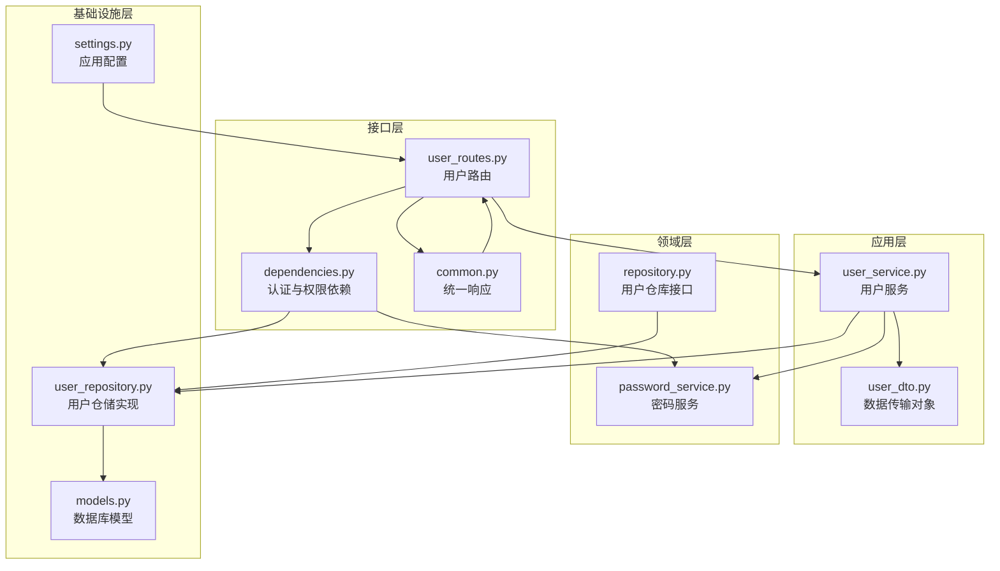
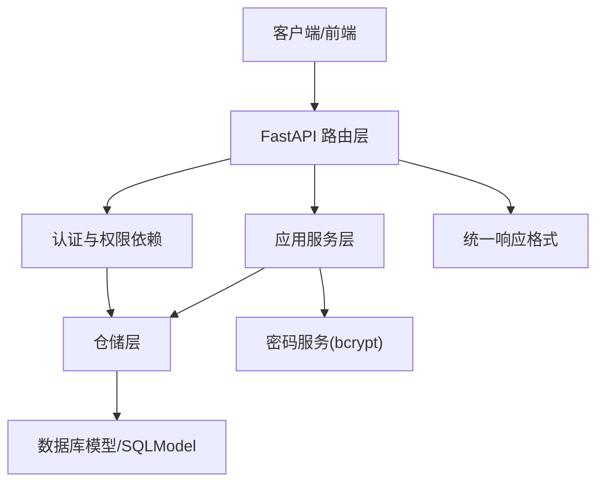
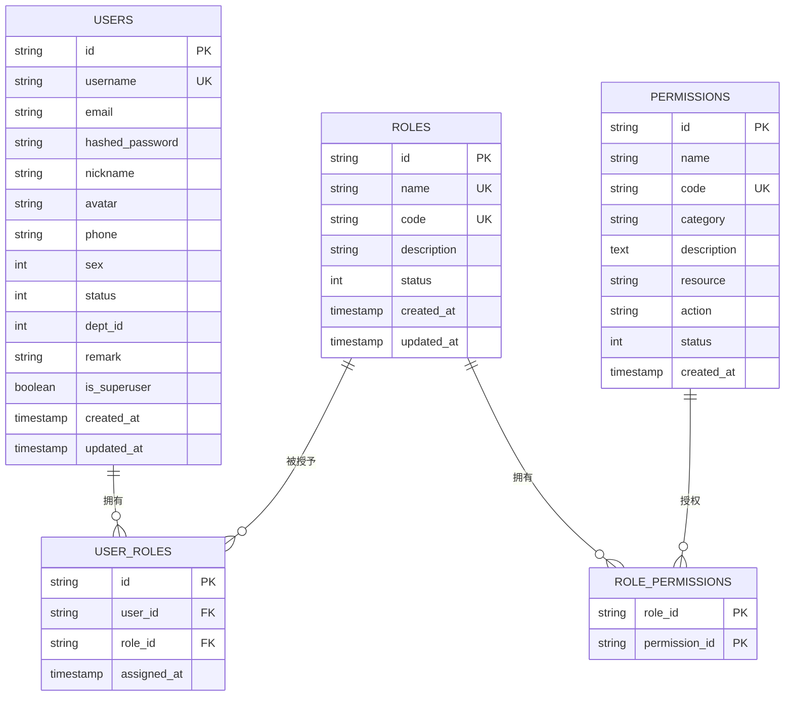
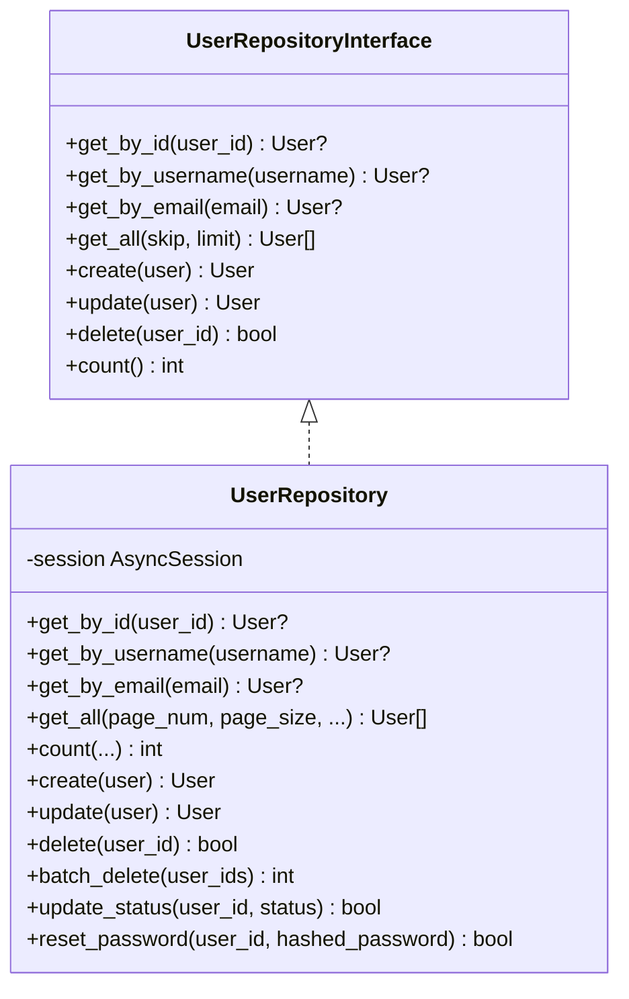
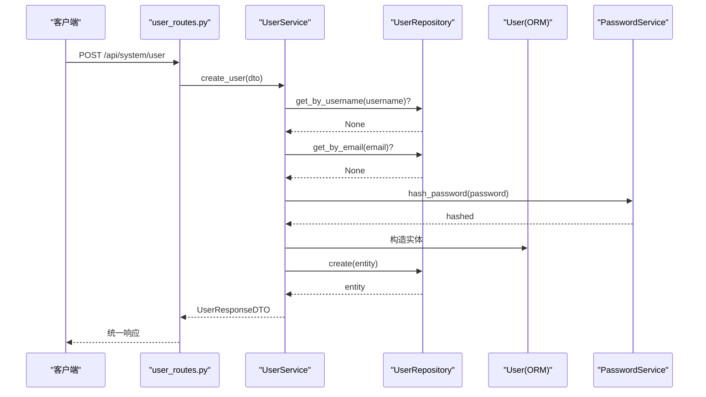
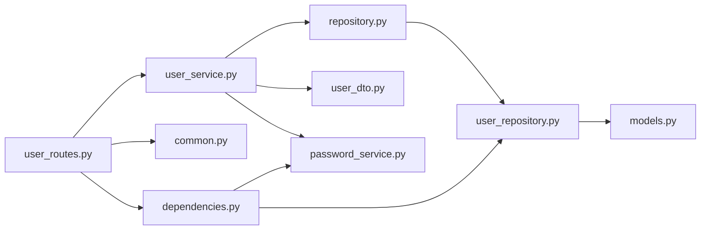

# 用户管理系统

<cite>
**本文引用的文件**
- [service/src/infrastructure/database/models.py](file://service/src/infrastructure/database/models.py)
- [service/src/domain/user/repository.py](file://service/src/domain/user/repository.py)
- [service/src/infrastructure/repositories/user_repository.py](file://service/src/infrastructure/repositories/user_repository.py)
- [service/src/application/services/user_service.py](file://service/src/application/services/user_service.py)
- [service/src/application/dto/user_dto.py](file://service/src/application/dto/user_dto.py)
- [service/src/api/v1/user_routes.py](file://service/src/api/v1/user_routes.py)
- [service/src/api/common.py](file://service/src/api/common.py)
- [service/src/core/exceptions.py](file://service/src/core/exceptions.py)
- [service/src/api/dependencies.py](file://service/src/api/dependencies.py)
- [service/src/domain/auth/password_service.py](file://service/src/domain/auth/password_service.py)
- [service/src/config/settings.py](file://service/src/config/settings.py)
- [service/tests/unit/test_auth.py](file://service/tests/unit/test_auth.py)
- [web/src/api/user.ts](file://web/src/api/user.ts)
</cite>

## 目录
1. [简介](#简介)
2. [项目结构](#项目结构)
3. [核心组件](#核心组件)
4. [架构总览](#架构总览)
5. [详细组件分析](#详细组件分析)
6. [依赖关系分析](#依赖关系分析)
7. [性能考虑](#性能考虑)
8. [故障排除指南](#故障排除指南)
9. [结论](#结论)
10. [附录](#附录)

## 简介
本文件面向开发者与运维人员，系统化阐述用户管理子系统的整体设计与实现细节。内容涵盖：
- 用户实体模型设计（字段、关系、约束）
- 用户 CRUD 与状态管理的实现逻辑
- 数据验证规则与业务处理流程
- 仓储层的数据访问模式
- API 接口文档与使用示例
- 安全与隐私保护措施
- 扩展与定制建议

## 项目结构
用户管理子系统采用分层架构，围绕“领域模型-仓储-应用服务-接口路由”的职责划分组织代码。前端通过统一响应格式与后端交互，后端通过依赖注入与权限校验保障安全。

图表来源
- [service/src/api/v1/user_routes.py:1-252](file://service/src/api/v1/user_routes.py#L1-L252)
- [service/src/api/dependencies.py:1-72](file://service/src/api/dependencies.py#L1-L72)
- [service/src/api/common.py:1-65](file://service/src/api/common.py#L1-L65)
- [service/src/application/services/user_service.py:1-322](file://service/src/application/services/user_service.py#L1-L322)
- [service/src/application/dto/user_dto.py:1-86](file://service/src/application/dto/user_dto.py#L1-L86)
- [service/src/domain/user/repository.py:1-50](file://service/src/domain/user/repository.py#L1-L50)
- [service/src/domain/auth/password_service.py:1-21](file://service/src/domain/auth/password_service.py#L1-L21)
- [service/src/infrastructure/repositories/user_repository.py:1-185](file://service/src/infrastructure/repositories/user_repository.py#L1-L185)
- [service/src/infrastructure/database/models.py:1-193](file://service/src/infrastructure/database/models.py#L1-L193)
- [service/src/config/settings.py:1-198](file://service/src/config/settings.py#L1-L198)

章节来源
- [service/src/api/v1/user_routes.py:1-252](file://service/src/api/v1/user_routes.py#L1-L252)
- [service/src/application/services/user_service.py:1-322](file://service/src/application/services/user_service.py#L1-L322)
- [service/src/infrastructure/repositories/user_repository.py:1-185](file://service/src/infrastructure/repositories/user_repository.py#L1-L185)
- [service/src/infrastructure/database/models.py:1-193](file://service/src/infrastructure/database/models.py#L1-L193)

## 核心组件
- 数据库模型：定义用户、角色、权限、菜单等实体及关联关系，使用 SQLModel 提供 ORM 与 Pydantic 数据模型能力。
- 仓储接口与实现：定义用户操作契约并提供基于 SQLModel 的异步实现，支持分页、筛选、批量删除、状态变更、密码重置等。
- 应用服务：封装业务逻辑，负责数据验证、密码哈希、DTO 转换、权限控制与异常处理。
- API 路由：暴露 REST 接口，统一响应格式，集成权限校验与当前用户依赖。
- DTO：定义请求/响应数据结构与字段约束，确保前后端一致的数据契约。
- 密码服务：基于 bcrypt 的密码哈希与校验。
- 异常体系：统一的业务异常类型，便于上层捕获与前端展示。

章节来源
- [service/src/infrastructure/database/models.py:31-65](file://service/src/infrastructure/database/models.py#L31-L65)
- [service/src/domain/user/repository.py:8-50](file://service/src/domain/user/repository.py#L8-L50)
- [service/src/infrastructure/repositories/user_repository.py:11-185](file://service/src/infrastructure/repositories/user_repository.py#L11-L185)
- [service/src/application/services/user_service.py:18-322](file://service/src/application/services/user_service.py#L18-L322)
- [service/src/application/dto/user_dto.py:8-86](file://service/src/application/dto/user_dto.py#L8-L86)
- [service/src/domain/auth/password_service.py:6-21](file://service/src/domain/auth/password_service.py#L6-L21)
- [service/src/api/v1/user_routes.py:24-252](file://service/src/api/v1/user_routes.py#L24-L252)
- [service/src/api/common.py:29-65](file://service/src/api/common.py#L29-L65)
- [service/src/core/exceptions.py:6-60](file://service/src/core/exceptions.py#L6-L60)

## 架构总览
用户管理遵循 Clean Architecture 分层思想，接口层负责对外暴露 API；应用层编排业务；领域层定义实体与仓库接口；基础设施层提供持久化与外部依赖实现。

图表来源
- [service/src/api/v1/user_routes.py:1-252](file://service/src/api/v1/user_routes.py#L1-L252)
- [service/src/api/dependencies.py:16-72](file://service/src/api/dependencies.py#L16-L72)
- [service/src/application/services/user_service.py:18-322](file://service/src/application/services/user_service.py#L18-L322)
- [service/src/infrastructure/repositories/user_repository.py:11-185](file://service/src/infrastructure/repositories/user_repository.py#L11-L185)
- [service/src/infrastructure/database/models.py:31-65](file://service/src/infrastructure/database/models.py#L31-L65)
- [service/src/domain/auth/password_service.py:6-21](file://service/src/domain/auth/password_service.py#L6-L21)
- [service/src/api/common.py:29-65](file://service/src/api/common.py#L29-L65)

## 详细组件分析

### 用户实体模型设计
- 主键与标识：用户 ID 使用 UUID 字符串，长度限制为 36。
- 唯一性与索引：用户名与邮箱在数据库层面具备唯一性与索引，提升查询效率。
- 字段与约束：
  - 用户名：长度上限 50，必填且唯一。
  - 邮箱：可空，唯一且带索引。
  - 密码：存储为哈希值，长度上限 255。
  - 基本信息：昵称、头像、手机号、性别、备注等可空字段。
  - 状态：整型状态位，0 表示禁用，1 表示启用，默认启用。
  - 超级用户标记：布尔值，用于快速判断管理员身份。
  - 时间戳：创建与更新时间，自动维护。
- 关系映射：
  - 用户与角色：多对多关系，通过中间表 user_roles 关联。
  - 角色与权限：多对多关系，通过中间表 role_permissions 关联。
- 状态兼容属性：提供 is_active 属性以兼容状态判断。

图表来源
- [service/src/infrastructure/database/models.py:31-141](file://service/src/infrastructure/database/models.py#L31-L141)

章节来源
- [service/src/infrastructure/database/models.py:31-65](file://service/src/infrastructure/database/models.py#L31-L65)
- [service/src/infrastructure/database/models.py:70-141](file://service/src/infrastructure/database/models.py#L70-L141)

### 用户仓储层实现细节
- 仓储接口：定义按 ID/用户名/邮箱查询、分页查询、创建、更新、删除、计数等方法。
- 仓储实现：
  - 查询：支持模糊匹配用户名/手机/邮箱，精确匹配状态与部门 ID，并提供分页与总数统计。
  - 创建/更新：使用 flush + refresh 确保返回最新实体。
  - 删除：支持单个与批量删除，批量删除逐个执行并统计成功数量。
  - 状态变更：仅更新状态字段。
  - 密码重置：直接更新哈希密码字段。
- 性能与复杂度：
  - 查询基于 SQLModel 的 select，支持 where + offset + limit，时间复杂度 O(n) 遍历结果集。
  - 计数使用聚合函数，避免全量扫描。
  - 建议在高频查询字段上建立索引（已在模型中定义）。

图表来源
- [service/src/domain/user/repository.py:8-50](file://service/src/domain/user/repository.py#L8-L50)
- [service/src/infrastructure/repositories/user_repository.py:11-185](file://service/src/infrastructure/repositories/user_repository.py#L11-L185)

章节来源
- [service/src/domain/user/repository.py:8-50](file://service/src/domain/user/repository.py#L8-L50)
- [service/src/infrastructure/repositories/user_repository.py:11-185](file://service/src/infrastructure/repositories/user_repository.py#L11-L185)

### 用户应用服务与业务逻辑
- 数据验证：
  - 创建/更新 DTO 对字段长度、范围进行约束，如用户名长度、密码长度、状态范围、分页大小范围等。
- 密码处理：
  - 使用 PasswordService 进行哈希与校验，确保密码安全存储。
- 业务流程：
  - 创建用户：检查用户名/邮箱唯一性，映射所有字段，保存并转换为响应 DTO。
  - 更新用户：选择性更新非空字段，邮箱唯一性校验。
  - 删除与批量删除：返回删除计数与请求总数。
  - 状态变更与密码重置：管理员操作，校验用户存在性。
  - 密码修改：当前用户凭据校验旧密码，再更新新密码。
- DTO 转换：将用户实体转换为响应 DTO，包含角色与权限列表，便于前端展示。

图表来源
- [service/src/api/v1/user_routes.py:54-74](file://service/src/api/v1/user_routes.py#L54-L74)
- [service/src/application/services/user_service.py:25-58](file://service/src/application/services/user_service.py#L25-L58)
- [service/src/infrastructure/repositories/user_repository.py:114-119](file://service/src/infrastructure/repositories/user_repository.py#L114-L119)
- [service/src/domain/auth/password_service.py:10-15](file://service/src/domain/auth/password_service.py#L10-L15)

章节来源
- [service/src/application/services/user_service.py:18-322](file://service/src/application/services/user_service.py#L18-L322)
- [service/src/application/dto/user_dto.py:8-86](file://service/src/application/dto/user_dto.py#L8-L86)
- [service/src/domain/auth/password_service.py:6-21](file://service/src/domain/auth/password_service.py#L6-L21)

### 用户状态管理与数据验证
- 状态管理：
  - 状态字段为整型，0 表示禁用，1 表示启用。
  - 提供 update_status 与 reset_password 方法，分别用于管理员变更状态与重置密码。
- 数据验证：
  - DTO 对输入字段进行长度、范围与别名（deptId）映射校验。
  - 分页参数校验 pageNum ≥ 1，pageSize ∈ [1, 100]。
  - 状态字段范围校验 0-1。
- 异常处理：
  - 未找到资源抛出 404，冲突抛出 409，认证失败 401，权限不足 403，验证错误 422。

章节来源
- [service/src/application/dto/user_dto.py:56-86](file://service/src/application/dto/user_dto.py#L56-L86)
- [service/src/core/exceptions.py:13-60](file://service/src/core/exceptions.py#L13-L60)
- [service/src/application/services/user_service.py:115-225](file://service/src/application/services/user_service.py#L115-L225)

### API 接口文档与使用示例
- 路由前缀：/api/system/user
- 权限控制：除获取当前用户信息外，均需相应权限（如 user:add、user:edit、user:delete、user:view）。
- 统一响应：success_response/page_response/error_response 提供统一结构。
- 关键接口：
  - POST /api/system/user/list：分页查询用户，支持用户名/手机/邮箱/状态/部门筛选。
  - POST /api/system/user：创建用户。
  - GET /api/system/user/info：获取当前登录用户信息（含角色与权限）。
  - GET /api/system/user/{user_id}：获取指定用户详情。
  - PUT /api/system/user/{user_id}：更新用户信息。
  - DELETE /api/system/user/{user_id}：删除用户。
  - POST /api/system/user/batch-delete：批量删除用户。
  - PUT /api/system/user/{user_id}/reset-password：管理员重置密码。
  - PUT /api/system/user/{user_id}/status：管理员更新状态。
  - POST /api/system/user/change-password：当前用户修改密码。

章节来源
- [service/src/api/v1/user_routes.py:27-252](file://service/src/api/v1/user_routes.py#L27-L252)
- [service/src/api/common.py:45-65](file://service/src/api/common.py#L45-L65)
- [service/src/api/dependencies.py:45-72](file://service/src/api/dependencies.py#L45-L72)

### 安全与隐私保护
- 密码安全：
  - 使用 bcrypt 进行哈希存储，校验时比对哈希值。
  - 前端不接收明文密码，后端仅接收明文并立即哈希。
- 认证与授权：
  - 基于 JWT 的 HTTP Bearer 令牌，校验令牌有效性与类型。
  - require_permission 依赖动态校验用户权限集合，超级用户豁免。
  - get_current_active_user 校验用户存在且启用。
- 隐私保护：
  - 响应 DTO 不包含敏感字段（如哈希密码），避免泄露。
  - 建议在网关层启用 HTTPS、CORS 白名单与速率限制。
- 配置安全：
  - Secret Key、JWT Secret Key 等敏感配置通过环境变量加载，避免硬编码。

章节来源
- [service/src/domain/auth/password_service.py:6-21](file://service/src/domain/auth/password_service.py#L6-L21)
- [service/src/api/dependencies.py:16-72](file://service/src/api/dependencies.py#L16-L72)
- [service/src/config/settings.py:41-108](file://service/src/config/settings.py#L41-L108)

### 扩展与定制指导
- 新增字段：
  - 在数据库模型中添加字段并迁移；在 DTO 中同步新增字段与约束；在应用服务中映射到实体。
- 自定义校验：
  - 在 DTO 中增加字段校验器或自定义验证逻辑；在应用服务中补充业务规则。
- 权限扩展：
  - 在权限模型中新增权限编码，分配给角色，用户继承角色权限。
- 批量操作优化：
  - 批量删除可考虑使用批量 SQL 语句减少往返次数。
- 日志与审计：
  - 在仓储与应用服务中记录关键操作日志，便于审计与追踪。

章节来源
- [service/src/infrastructure/database/models.py:31-141](file://service/src/infrastructure/database/models.py#L31-L141)
- [service/src/application/dto/user_dto.py:8-86](file://service/src/application/dto/user_dto.py#L8-L86)
- [service/src/application/services/user_service.py:174-187](file://service/src/application/services/user_service.py#L174-L187)

## 依赖关系分析
- 组件耦合：
  - 路由依赖应用服务；应用服务依赖仓储接口与密码服务；仓储实现依赖数据库模型。
  - 依赖注入通过 FastAPI 的 Depends 与 AsyncSession 注入仓储。
- 外部依赖：
  - SQLModel 提供 ORM 与异步会话；bcrypt 用于密码哈希；Pydantic 用于数据校验。
- 可能的循环依赖：
  - 通过接口与依赖注入避免直接循环导入；仓储接口与实现分离清晰。

图表来源
- [service/src/api/v1/user_routes.py:1-252](file://service/src/api/v1/user_routes.py#L1-L252)
- [service/src/application/services/user_service.py:1-322](file://service/src/application/services/user_service.py#L1-L322)
- [service/src/domain/user/repository.py:1-50](file://service/src/domain/user/repository.py#L1-L50)
- [service/src/infrastructure/repositories/user_repository.py:1-185](file://service/src/infrastructure/repositories/user_repository.py#L1-L185)
- [service/src/infrastructure/database/models.py:1-193](file://service/src/infrastructure/database/models.py#L1-L193)
- [service/src/api/common.py:1-65](file://service/src/api/common.py#L1-L65)
- [service/src/api/dependencies.py:1-72](file://service/src/api/dependencies.py#L1-L72)
- [service/src/domain/auth/password_service.py:1-21](file://service/src/domain/auth/password_service.py#L1-L21)

章节来源
- [service/src/api/v1/user_routes.py:1-252](file://service/src/api/v1/user_routes.py#L1-L252)
- [service/src/application/services/user_service.py:1-322](file://service/src/application/services/user_service.py#L1-L322)
- [service/src/infrastructure/repositories/user_repository.py:1-185](file://service/src/infrastructure/repositories/user_repository.py#L1-L185)
- [service/src/infrastructure/database/models.py:1-193](file://service/src/infrastructure/database/models.py#L1-L193)

## 性能考虑
- 查询优化：
  - 在高频查询字段（用户名、邮箱、部门 ID）上保持索引；合理使用分页与筛选条件。
- 写入优化：
  - 使用 flush + refresh 确保一致性；批量删除逐个执行，建议在高并发场景评估事务粒度。
- 缓存策略：
  - 对热点用户信息可引入 Redis 缓存（当前项目包含 Redis 客户端，可在仓储层扩展）。
- 并发与连接池：
  - 使用异步 SQLModel 会话，结合连接池与合理的超时配置。

## 故障排除指南
- 常见异常与处理：
  - 404 未找到：检查用户 ID 是否正确；确认用户是否存在。
  - 409 冲突：用户名或邮箱重复；请更换唯一字段。
  - 401 未认证：检查 JWT 令牌是否有效、类型是否为 access。
  - 403 权限不足：确认当前用户是否具备所需权限或是否为超级用户。
  - 422 参数校验失败：检查 DTO 字段长度、范围与格式。
- 密码问题：
  - 修改密码时旧密码不正确；重置密码需管理员权限。
- 响应格式：
  - 统一使用 success_response/page_response/error_response，便于前端统一处理。

章节来源
- [service/src/core/exceptions.py:13-60](file://service/src/core/exceptions.py#L13-L60)
- [service/src/api/common.py:45-65](file://service/src/api/common.py#L45-L65)
- [service/src/api/dependencies.py:16-72](file://service/src/api/dependencies.py#L16-L72)
- [service/src/application/services/user_service.py:227-251](file://service/src/application/services/user_service.py#L227-L251)

## 结论
该用户管理系统以清晰的分层架构实现了完整的用户生命周期管理，结合 SQLModel 的 ORM 能力与 bcrypt 的密码安全机制，提供了可扩展、可维护的用户管理能力。通过统一的 DTO、异常体系与权限依赖，系统在保证安全性的同时，也兼顾了易用性与可测试性。建议在生产环境中进一步完善缓存、审计与监控能力，并持续优化查询与写入路径。

## 附录
- 前端对接参考：
  - 前端通过统一的 http 工具发起请求，接口路径与响应结构与后端保持一致。
  - 建议前端在登录后缓存用户信息与权限列表，减少重复请求。

章节来源
- [web/src/api/user.ts:76-94](file://web/src/api/user.ts#L76-L94)