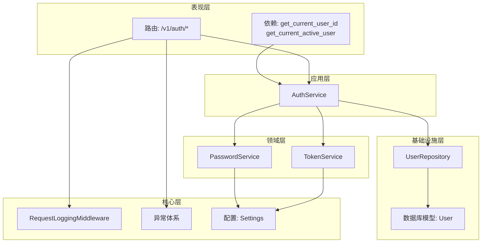
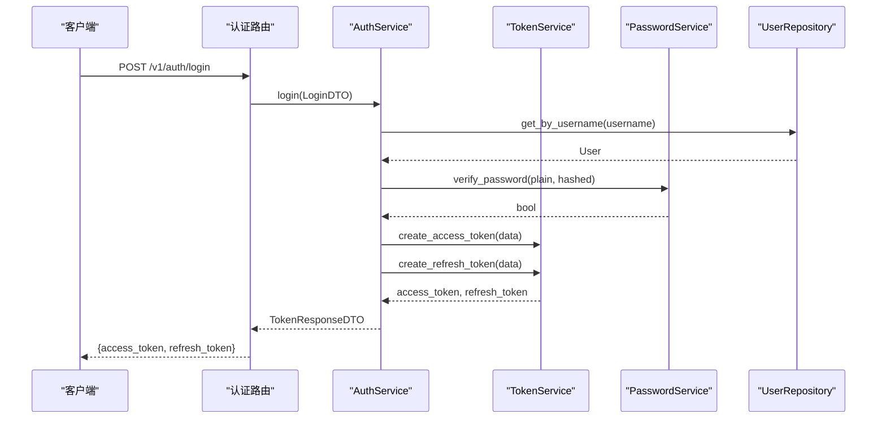
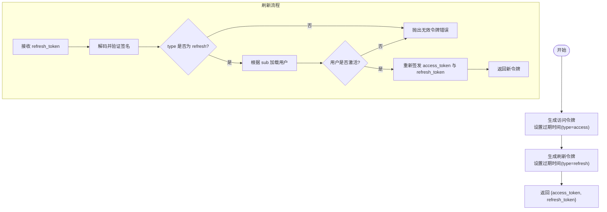
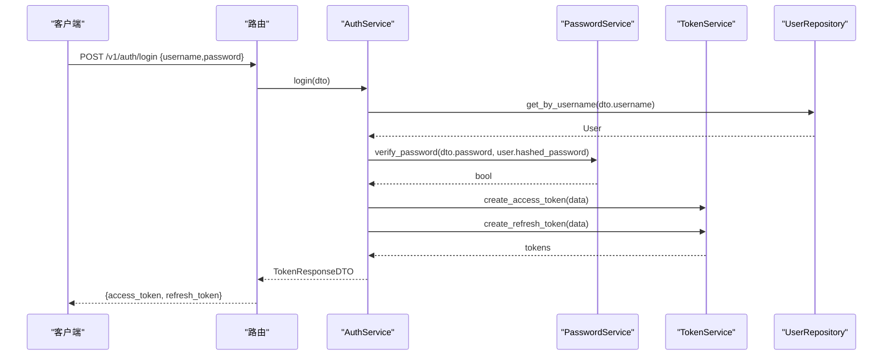
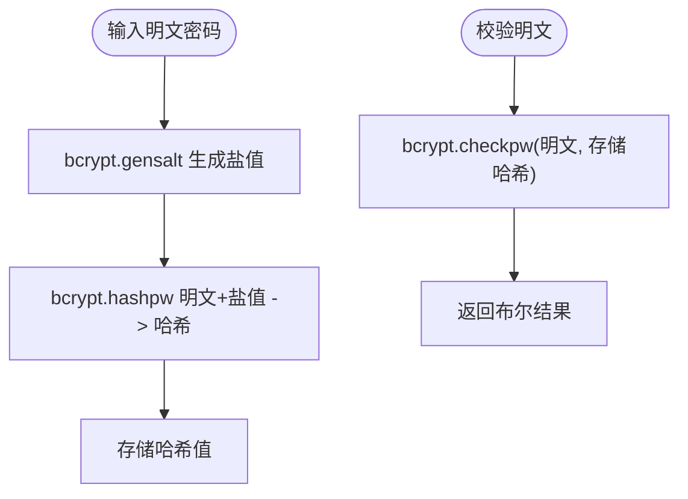
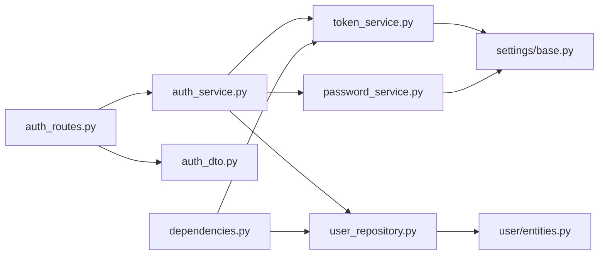

# 认证系统

<cite>
**本文档引用的文件**
- [src/main.py](file://src/main.py)
- [src/api/v1/__init__.py](file://src/api/v1/__init__.py)
- [src/api/v1/auth_routes.py](file://src/api/v1/auth_routes.py)
- [src/api/dependencies.py](file://src/api/dependencies.py)
- [src/application/services/auth_service.py](file://src/application/services/auth_service.py)
- [src/application/dto/auth_dto.py](file://src/application/dto/auth_dto.py)
- [src/domain/auth/token_service.py](file://src/domain/auth/token_service.py)
- [src/domain/auth/password_service.py](file://src/domain/auth/password_service.py)
- [src/infrastructure/repositories/user_repository.py](file://src/infrastructure/repositories/user_repository.py)
- [src/domain/user/entities.py](file://src/domain/user/entities.py)
- [src/core/middlewares.py](file://src/core/middlewares.py)
- [src/core/exceptions.py](file://src/core/exceptions.py)
- [src/tests/unit/test_auth.py](file://src/tests/unit/test_auth.py)
- [config/settings/base.py](file://config/settings/base.py)
- [src/domain/rbac/entities.py](file://src/domain/rbac/entities.py)
- [src/infrastructure/repositories/rbac_repository.py](file://src/infrastructure/repositories/rbac_repository.py)
</cite>

## 目录
1. [简介](#简介)
2. [项目结构](#项目结构)
3. [核心组件](#核心组件)
4. [架构总览](#架构总览)
5. [详细组件分析](#详细组件分析)
6. [依赖分析](#依赖分析)
7. [性能考虑](#性能考虑)
8. [故障排查指南](#故障排查指南)
9. [结论](#结论)
10. [附录](#附录)

## 简介
本文件为认证系统的综合技术文档，围绕基于 JWT 的认证机制展开，涵盖以下主题：
- JWT 令牌生成、验证与刷新流程
- 用户认证从用户名密码校验到令牌发放的完整过程
- 密码安全管理机制（哈希算法、盐值与安全存储）
- 令牌服务实现（访问令牌与刷新令牌管理）
- 认证中间件与安全策略
- 认证相关 API 接口文档与请求响应示例
- 会话管理与令牌撤销机制
- 安全最佳实践与常见攻击防护

## 项目结构
认证系统采用分层架构（DDD + FastAPI），主要分为以下层次：
- 表现层（API 层）：路由与依赖注入
- 应用层（应用服务）：业务编排与用例实现
- 领域层（领域服务）：核心业务规则（JWT、密码）
- 基础设施层（仓储与数据库）：数据持久化与查询
- 核心层（中间件、异常、日志等）

图表来源
- [src/api/v1/auth_routes.py:1-34](file://src/api/v1/auth_routes.py#L1-L34)
- [src/api/dependencies.py:1-83](file://src/api/dependencies.py#L1-L83)
- [src/application/services/auth_service.py:1-67](file://src/application/services/auth_service.py#L1-L67)
- [src/domain/auth/token_service.py:1-41](file://src/domain/auth/token_service.py#L1-L41)
- [src/domain/auth/password_service.py:1-24](file://src/domain/auth/password_service.py#L1-L24)
- [src/infrastructure/repositories/user_repository.py:1-61](file://src/infrastructure/repositories/user_repository.py#L1-L61)
- [src/domain/user/entities.py:1-38](file://src/domain/user/entities.py#L1-L38)
- [src/core/middlewares.py:1-64](file://src/core/middlewares.py#L1-L64)
- [src/core/exceptions.py:1-53](file://src/core/exceptions.py#L1-L53)
- [config/settings/base.py:1-86](file://config/settings/base.py#L1-L86)

章节来源
- [src/main.py:1-83](file://src/main.py#L1-L83)
- [src/api/v1/__init__.py:1-15](file://src/api/v1/__init__.py#L1-L15)

## 核心组件
- 路由与依赖
  - 认证路由：登录、刷新、获取当前用户信息
  - 认证依赖：从 Authorization 头解析并验证访问令牌，获取当前活跃用户
- 应用服务
  - AuthService：负责登录认证、生成访问与刷新令牌；负责刷新令牌流程
- 领域服务
  - TokenService：JWT 编码/解码、访问/刷新令牌生成、令牌类型校验
  - PasswordService：bcrypt 密码哈希与校验
- 仓储与实体
  - UserRepository：按用户名/邮箱/ID 查询用户，加载角色关系
  - User 实体：用户字段（含 hashed_password）、激活状态、超级用户标识
- 中间件与异常
  - RequestLoggingMiddleware：统一请求日志
  - 异常体系：Unauthorized、Forbidden、ValidationError 等
- 配置
  - Settings：JWT 秘钥、算法、过期时间、CORS、Redis 等

章节来源
- [src/api/v1/auth_routes.py:1-34](file://src/api/v1/auth_routes.py#L1-L34)
- [src/api/dependencies.py:1-83](file://src/api/dependencies.py#L1-L83)
- [src/application/services/auth_service.py:1-67](file://src/application/services/auth_service.py#L1-L67)
- [src/domain/auth/token_service.py:1-41](file://src/domain/auth/token_service.py#L1-L41)
- [src/domain/auth/password_service.py:1-24](file://src/domain/auth/password_service.py#L1-L24)
- [src/infrastructure/repositories/user_repository.py:1-61](file://src/infrastructure/repositories/user_repository.py#L1-L61)
- [src/domain/user/entities.py:1-38](file://src/domain/user/entities.py#L1-L38)
- [src/core/middlewares.py:1-64](file://src/core/middlewares.py#L1-L64)
- [src/core/exceptions.py:1-53](file://src/core/exceptions.py#L1-L53)
- [config/settings/base.py:1-86](file://config/settings/base.py#L1-L86)

## 架构总览
认证系统遵循“路由 → 依赖 → 应用服务 → 领域服务/仓储”的调用链路，确保职责清晰、可测试性良好。

图表来源
- [src/api/v1/auth_routes.py:14-18](file://src/api/v1/auth_routes.py#L14-L18)
- [src/application/services/auth_service.py:21-40](file://src/application/services/auth_service.py#L21-L40)
- [src/domain/auth/token_service.py:12-26](file://src/domain/auth/token_service.py#L12-L26)
- [src/domain/auth/password_service.py:17-23](file://src/domain/auth/password_service.py#L17-L23)
- [src/infrastructure/repositories/user_repository.py:22-25](file://src/infrastructure/repositories/user_repository.py#L22-L25)

## 详细组件分析

### JWT 令牌机制与流程
- 令牌生成
  - 访问令牌：包含 exp 过期时间与 type=access，算法与密钥来自配置
  - 刷新令牌：包含 exp 过期时间与 type=refresh，用于换取新的访问令牌
- 令牌验证
  - 解码并校验签名；校验 type 是否为 access 或 refresh
- 刷新流程
  - 使用刷新令牌解码得到用户标识，重新签发新的访问/刷新令牌

图表来源
- [src/domain/auth/token_service.py:12-41](file://src/domain/auth/token_service.py#L12-L41)
- [src/application/services/auth_service.py:42-66](file://src/application/services/auth_service.py#L42-L66)

章节来源
- [src/domain/auth/token_service.py:1-41](file://src/domain/auth/token_service.py#L1-L41)
- [src/application/services/auth_service.py:1-67](file://src/application/services/auth_service.py#L1-L67)

### 用户认证完整流程
- 输入：用户名、密码
- 步骤：
  1) 根据用户名查询用户
  2) 校验密码（bcrypt）
  3) 校验用户是否激活
  4) 生成访问令牌与刷新令牌
  5) 返回给客户端

图表来源
- [src/api/v1/auth_routes.py:14-18](file://src/api/v1/auth_routes.py#L14-L18)
- [src/application/services/auth_service.py:21-40](file://src/application/services/auth_service.py#L21-L40)
- [src/domain/auth/password_service.py:17-23](file://src/domain/auth/password_service.py#L17-L23)
- [src/domain/auth/token_service.py:12-26](file://src/domain/auth/token_service.py#L12-L26)
- [src/infrastructure/repositories/user_repository.py:22-25](file://src/infrastructure/repositories/user_repository.py#L22-L25)

章节来源
- [src/api/v1/auth_routes.py:1-34](file://src/api/v1/auth_routes.py#L1-L34)
- [src/application/services/auth_service.py:1-67](file://src/application/services/auth_service.py#L1-L67)

### 密码安全管理机制
- 哈希算法：bcrypt
- 盐值生成：bcrypt.gensalt 自动生成
- 存储策略：仅存储哈希值，不存储明文密码
- 校验流程：使用 bcrypt.checkpw 对比明文与存储的哈希

图表来源
- [src/domain/auth/password_service.py:9-23](file://src/domain/auth/password_service.py#L9-L23)

章节来源
- [src/domain/auth/password_service.py:1-24](file://src/domain/auth/password_service.py#L1-L24)
- [src/domain/user/entities.py:24](file://src/domain/user/entities.py#L24)

### 令牌服务实现（访问/刷新令牌）
- 访问令牌：短期有效，用于受保护资源访问
- 刷新令牌：长期有效，但仅用于换取新的访问令牌
- 类型校验：防止 access 与 refresh 混用
- 配置项：密钥、算法、过期分钟数、过期天数

章节来源
- [src/domain/auth/token_service.py:1-41](file://src/domain/auth/token_service.py#L1-L41)
- [config/settings/base.py:26-30](file://config/settings/base.py#L26-L30)

### 认证中间件与安全策略
- 请求日志中间件：记录请求方法、路径、客户端 IP、处理时长
- IP 白名单/黑名单中间件：可选的访问控制
- 认证依赖：从 Authorization Bearer 头提取令牌，解码并校验类型为 access
- 异常处理：统一捕获应用异常与通用异常，返回标准化错误响应

章节来源
- [src/core/middlewares.py:1-64](file://src/core/middlewares.py#L1-L64)
- [src/api/dependencies.py:16-31](file://src/api/dependencies.py#L16-L31)
- [src/main.py:55-69](file://src/main.py#L55-L69)

### 认证相关 API 接口文档
- 登录
  - 方法与路径：POST /v1/auth/login
  - 请求体：LoginDTO（username, password）
  - 成功响应：TokenResponseDTO（access_token, refresh_token, token_type=bearer）
  - 错误：401 无效用户名或密码；401 用户被禁用
- 刷新令牌
  - 方法与路径：POST /v1/auth/refresh
  - 请求体：RefreshTokenDTO（refresh_token）
  - 成功响应：TokenResponseDTO（新的 access_token 与 refresh_token）
  - 错误：401 无效或过期刷新令牌；401 非刷新令牌类型
- 获取当前用户
  - 方法与路径：GET /v1/auth/me
  - 认证：需要携带有效的 access_token
  - 成功响应：当前用户信息（id, username, email, is_superuser）
  - 错误：401 无效或过期令牌；401 用户不存在或未激活

请求/响应示例（路径引用）
- 登录请求体示例：[src/application/dto/auth_dto.py:6-11](file://src/application/dto/auth_dto.py#L6-L11)
- 登录响应示例：[src/application/dto/auth_dto.py:13-18](file://src/application/dto/auth_dto.py#L13-L18)
- 刷新请求体示例：[src/application/dto/auth_dto.py:21-25](file://src/application/dto/auth_dto.py#L21-L25)
- 当前用户响应示例：[src/api/dependencies.py:45-50](file://src/api/dependencies.py#L45-L50)

章节来源
- [src/api/v1/auth_routes.py:1-34](file://src/api/v1/auth_routes.py#L1-L34)
- [src/application/dto/auth_dto.py:1-25](file://src/application/dto/auth_dto.py#L1-L25)
- [src/api/dependencies.py:1-83](file://src/api/dependencies.py#L1-L83)

### 会话管理与令牌撤销机制
- 会话管理
  - 访问令牌短期有效，适合在内存或缓存中短期持有
  - 刷新令牌长期有效，但仅用于换取新的访问令牌
- 令牌撤销
  - 本项目未实现集中式令牌撤销（如黑名单）
  - 可通过以下方式间接实现：
    - 缩短访问令牌有效期，配合频繁刷新
    - 在用户修改密码或强制下线时，更换 JWT 密钥并重启服务
    - 结合 Redis 等外部缓存维护黑名单（需扩展实现）

章节来源
- [src/domain/auth/token_service.py:12-26](file://src/domain/auth/token_service.py#L12-L26)
- [config/settings/base.py:26-30](file://config/settings/base.py#L26-L30)

### 安全最佳实践与常见攻击防护
- 密码安全
  - 使用 bcrypt 存储密码哈希，自动处理盐值
  - 不在日志中输出密码明文或哈希
- 令牌安全
  - 使用强随机密钥与安全算法（默认 HS256）
  - 严格区分 access 与 refresh 令牌类型
  - 访问令牌短期有效，刷新令牌单独管理
- 传输安全
  - 生产环境启用 HTTPS
  - CORS 配置仅允许可信源
- 认证与授权
  - 使用依赖注入校验访问令牌类型
  - 结合 RBAC 实施细粒度权限控制
- 其他
  - 启用请求日志中间件便于审计
  - 统一异常处理，避免泄露敏感信息
  - 限制请求频率，防止暴力破解

章节来源
- [src/domain/auth/password_service.py:1-24](file://src/domain/auth/password_service.py#L1-L24)
- [src/domain/auth/token_service.py:1-41](file://src/domain/auth/token_service.py#L1-L41)
- [src/core/middlewares.py:1-64](file://src/core/middlewares.py#L1-L64)
- [config/settings/base.py:1-86](file://config/settings/base.py#L1-L86)
- [src/domain/rbac/entities.py:1-79](file://src/domain/rbac/entities.py#L1-L79)
- [src/infrastructure/repositories/rbac_repository.py:1-133](file://src/infrastructure/repositories/rbac_repository.py#L1-L133)

## 依赖分析
认证系统各模块之间的依赖关系如下：

图表来源
- [src/api/v1/auth_routes.py:1-34](file://src/api/v1/auth_routes.py#L1-L34)
- [src/application/services/auth_service.py:1-67](file://src/application/services/auth_service.py#L1-L67)
- [src/application/dto/auth_dto.py:1-25](file://src/application/dto/auth_dto.py#L1-L25)
- [src/domain/auth/token_service.py:1-41](file://src/domain/auth/token_service.py#L1-L41)
- [src/domain/auth/password_service.py:1-24](file://src/domain/auth/password_service.py#L1-L24)
- [src/infrastructure/repositories/user_repository.py:1-61](file://src/infrastructure/repositories/user_repository.py#L1-L61)
- [src/api/dependencies.py:1-83](file://src/api/dependencies.py#L1-L83)
- [src/domain/user/entities.py:1-38](file://src/domain/user/entities.py#L1-L38)
- [config/settings/base.py:1-86](file://config/settings/base.py#L1-L86)

章节来源
- [src/api/v1/auth_routes.py:1-34](file://src/api/v1/auth_routes.py#L1-L34)
- [src/application/services/auth_service.py:1-67](file://src/application/services/auth_service.py#L1-L67)
- [src/api/dependencies.py:1-83](file://src/api/dependencies.py#L1-L83)

## 性能考虑
- 令牌生成与校验为轻量级操作，性能开销极低
- 密码哈希成本较高，建议在用户注册/修改密码时异步处理
- 数据库查询使用预加载关系，减少 N+1 查询风险
- 建议结合缓存（如 Redis）短期缓存活跃用户信息，降低数据库压力
- 合理设置访问令牌过期时间，平衡安全性与用户体验

## 故障排查指南
- 401 无效令牌或过期
  - 检查 Authorization 头格式与令牌类型是否为 access
  - 核对 JWT 密钥与算法配置
  - 参考：[src/api/dependencies.py:16-31](file://src/api/dependencies.py#L16-L31)，[src/domain/auth/token_service.py:28-40](file://src/domain/auth/token_service.py#L28-L40)
- 401 用户不存在或未激活
  - 确认用户存在且 is_active=true
  - 参考：[src/api/dependencies.py:34-50](file://src/api/dependencies.py#L34-L50)，[src/infrastructure/repositories/user_repository.py:17-25](file://src/infrastructure/repositories/user_repository.py#L17-L25)
- 401 无效刷新令牌
  - 确认使用 refresh_token 字段，且令牌未过期
  - 参考：[src/application/services/auth_service.py:42-57](file://src/application/services/auth_service.py#L42-L57)
- 403 权限不足
  - 检查用户是否具备所需权限或超级用户
  - 参考：[src/api/dependencies.py:53-68](file://src/api/dependencies.py#L53-L68)
- 日志与调试
  - 启用请求日志中间件，定位慢请求与异常
  - 参考：[src/core/middlewares.py:12-31](file://src/core/middlewares.py#L12-L31)
- 单元测试参考
  - 密码哈希与校验、令牌生成与类型校验
  - 参考：[src/tests/unit/test_auth.py:1-68](file://src/tests/unit/test_auth.py#L1-L68)

章节来源
- [src/api/dependencies.py:1-83](file://src/api/dependencies.py#L1-L83)
- [src/application/services/auth_service.py:1-67](file://src/application/services/auth_service.py#L1-L67)
- [src/core/middlewares.py:1-64](file://src/core/middlewares.py#L1-L64)
- [src/tests/unit/test_auth.py:1-68](file://src/tests/unit/test_auth.py#L1-L68)

## 结论
本认证系统以 JWT 为核心，结合 bcrypt 密码哈希与 RBAC 权限控制，提供了清晰、可扩展的认证方案。通过严格的令牌类型校验、短期访问令牌与长期刷新令牌分离、以及完善的异常与日志体系，系统在保证安全性的同时兼顾易用性。建议在生产环境中进一步引入集中式令牌撤销、速率限制与更严格的传输加密策略。

## 附录
- 配置项摘要（来自 Settings）
  - JWT_SECRET_KEY：JWT 秘钥
  - JWT_ALGORITHM：签名算法
  - ACCESS_TOKEN_EXPIRE_MINUTES：访问令牌过期分钟数
  - REFRESH_TOKEN_EXPIRE_DAYS：刷新令牌过期天数
  - CORS_ORIGINS：允许的跨域来源列表
- RBAC 实体概览
  - Permission：权限（codename、resource、action）
  - Role：角色（名称、描述）
  - UserRole：用户-角色关联（带分配时间）
  - 参考：[src/domain/rbac/entities.py:1-79](file://src/domain/rbac/entities.py#L1-L79)

章节来源
- [config/settings/base.py:1-86](file://config/settings/base.py#L1-L86)
- [src/domain/rbac/entities.py:1-79](file://src/domain/rbac/entities.py#L1-L79)