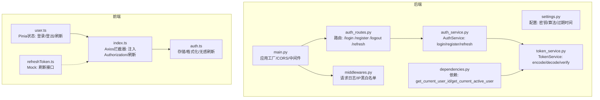
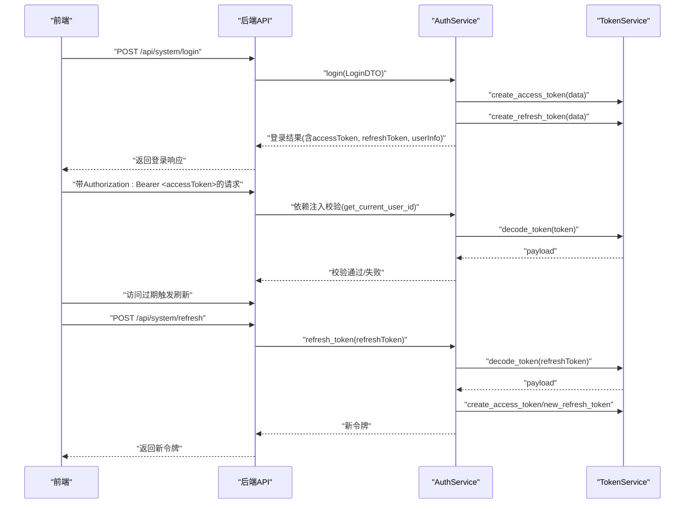
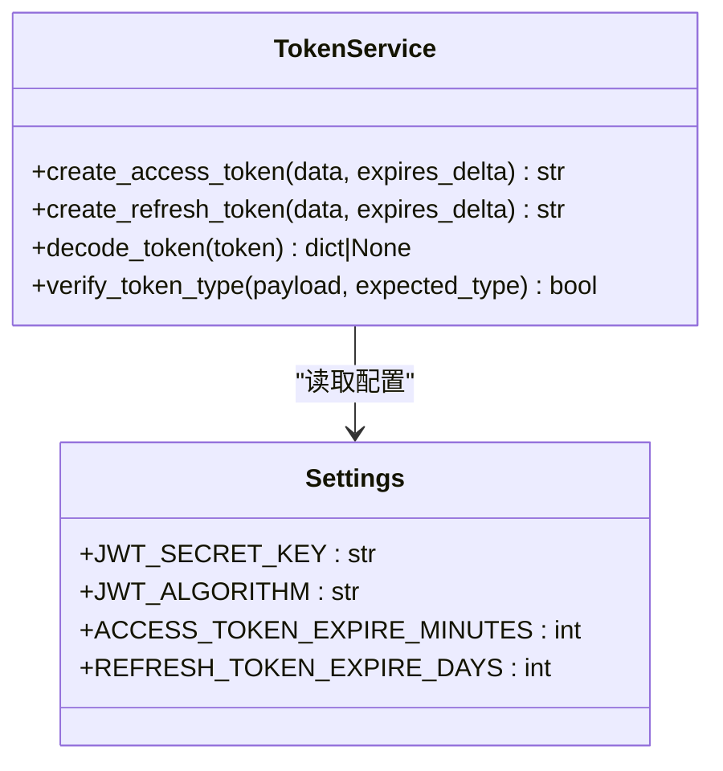
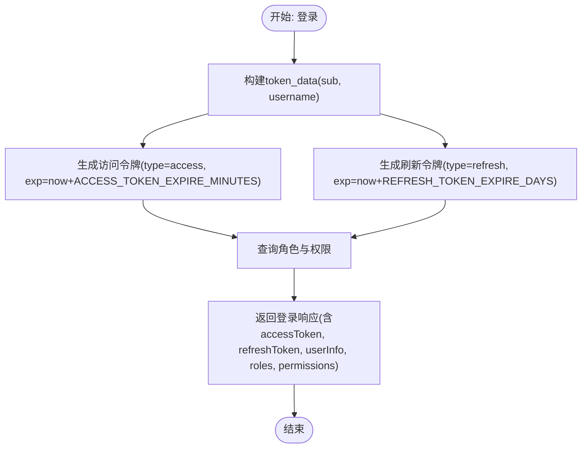
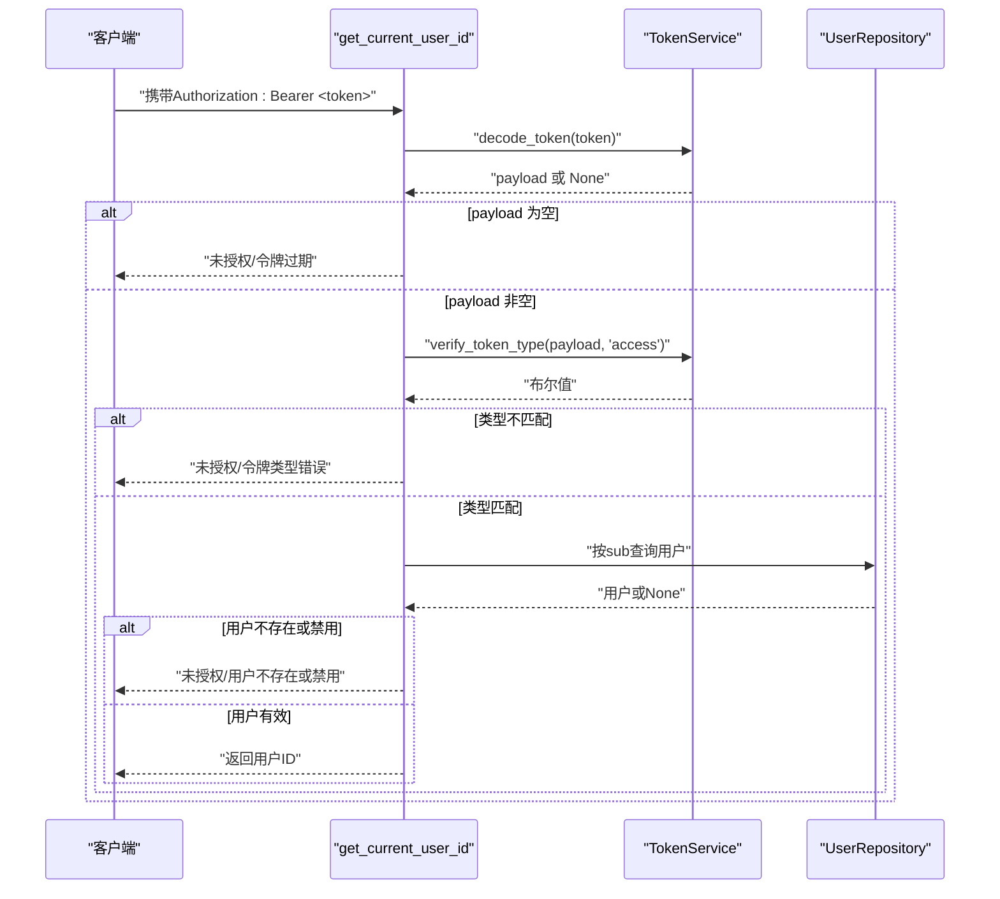
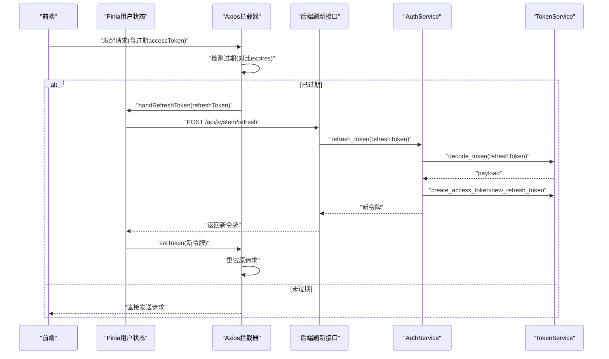
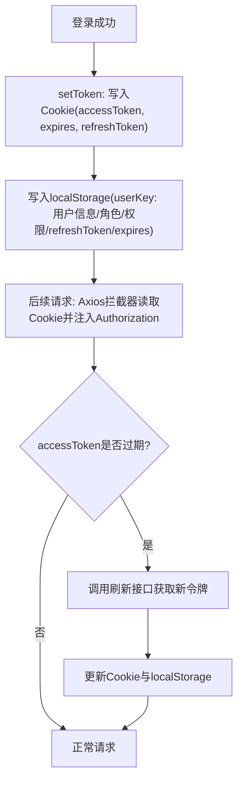
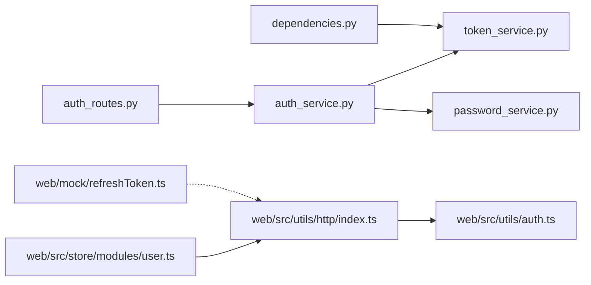

# JWT 令牌机制

<cite>
**本文引用的文件**
- [token_service.py](file://service/src/domain/auth/token_service.py)
- [auth_service.py](file://service/src/application/services/auth_service.py)
- [auth_routes.py](file://service/src/api/v1/auth_routes.py)
- [dependencies.py](file://service/src/api/dependencies.py)
- [settings.py](file://service/src/config/settings.py)
- [auth.ts](file://web/src/utils/auth.ts)
- [index.ts](file://web/src/utils/http/index.ts)
- [user.ts](file://web/src/store/modules/user.ts)
- [refreshToken.ts](file://web/mock/refreshToken.ts)
- [password_service.py](file://service/src/domain/auth/password_service.py)
- [main.py](file://service/src/main.py)
- [middlewares.py](file://service/src/core/middlewares.py)
</cite>

## 目录
1. [简介](#简介)
2. [项目结构](#项目结构)
3. [核心组件](#核心组件)
4. [架构总览](#架构总览)
5. [详细组件分析](#详细组件分析)
6. [依赖分析](#依赖分析)
7. [性能考量](#性能考量)
8. [故障排查指南](#故障排查指南)
9. [结论](#结论)
10. [附录](#附录)

## 简介
本文件系统性阐述本项目的 JWT（JSON Web Token）令牌机制，覆盖以下方面：
- JWT 结构组成：头部、载荷、签名三部分的职责与内容
- 令牌生成：用户信息编码、签名算法、过期时间设置
- 令牌验证：签名验证、过期检查、载荷解析
- 令牌刷新策略：刷新令牌生成与验证流程
- 请求头传递与前端存储策略
- 安全考量：防重放、CSRF 保护等
- 自定义与扩展指导

## 项目结构
本项目采用分层架构（DDD + 分层），JWT 机制贯穿领域层、应用层、API 层与前端。关键位置如下：
- 后端领域层：TokenService 提供 JWT 编解码与类型校验
- 后端应用层：AuthService 负责登录、注册、刷新等业务流程
- 后端 API 层：auth_routes 提供登录、注册、登出、刷新接口；dependencies 提供基于 Bearer Token 的认证依赖
- 后端配置：settings 提供密钥、算法、过期时间等配置
- 前端：auth.ts 负责 token 的存储与格式化；index.ts 负责请求拦截与无感刷新；user.ts 管理用户状态与刷新流程；mock/refreshToken.ts 提供刷新接口模拟

**图表来源**
- [settings.py:63-67](file://service/src/config/settings.py#L63-L67)
- [token_service.py:14-44](file://service/src/domain/auth/token_service.py#L14-L44)
- [auth_service.py:26-153](file://service/src/application/services/auth_service.py#L26-L153)
- [auth_routes.py:19-85](file://service/src/api/v1/auth_routes.py#L19-L85)
- [dependencies.py:16-42](file://service/src/api/dependencies.py#L16-L42)
- [main.py:34-96](file://service/src/main.py#L34-L96)
- [middlewares.py:12-64](file://service/src/core/middlewares.py#L12-L64)
- [auth.ts:34-128](file://web/src/utils/auth.ts#L34-L128)
- [index.ts:33-197](file://web/src/utils/http/index.ts#L33-L197)
- [user.ts:79-121](file://web/src/store/modules/user.ts#L79-L121)
- [refreshToken.ts:4-28](file://web/mock/refreshToken.ts#L4-L28)

**章节来源**
- [settings.py:63-67](file://service/src/config/settings.py#L63-L67)
- [token_service.py:14-44](file://service/src/domain/auth/token_service.py#L14-L44)
- [auth_service.py:26-153](file://service/src/application/services/auth_service.py#L26-L153)
- [auth_routes.py:19-85](file://service/src/api/v1/auth_routes.py#L19-L85)
- [dependencies.py:16-42](file://service/src/api/dependencies.py#L16-L42)
- [main.py:34-96](file://service/src/main.py#L34-L96)
- [middlewares.py:12-64](file://service/src/core/middlewares.py#L12-L64)
- [auth.ts:34-128](file://web/src/utils/auth.ts#L34-L128)
- [index.ts:33-197](file://web/src/utils/http/index.ts#L33-L197)
- [user.ts:79-121](file://web/src/store/modules/user.ts#L79-L121)
- [refreshToken.ts:4-28](file://web/mock/refreshToken.ts#L4-L28)

## 核心组件
- TokenService：封装 JWT 的生成、解码与类型校验
- AuthService：组合 TokenService 与仓储，完成登录、注册、刷新等业务
- Auth 路由：对外暴露登录、注册、登出、刷新接口
- 依赖注入：get_current_user_id 与 get_current_active_user 从 Authorization 头部提取并校验访问令牌
- 前端工具：auth.ts 负责 token 存储与格式化；index.ts 负责请求拦截与无感刷新；user.ts 管理状态与刷新动作

**章节来源**
- [token_service.py:11-45](file://service/src/domain/auth/token_service.py#L11-L45)
- [auth_service.py:15-25](file://service/src/application/services/auth_service.py#L15-L25)
- [auth_routes.py:19-85](file://service/src/api/v1/auth_routes.py#L19-L85)
- [dependencies.py:16-42](file://service/src/api/dependencies.py#L16-L42)
- [auth.ts:34-128](file://web/src/utils/auth.ts#L34-L128)
- [index.ts:33-197](file://web/src/utils/http/index.ts#L33-L197)
- [user.ts:79-121](file://web/src/store/modules/user.ts#L79-L121)

## 架构总览
JWT 机制在本项目中的整体流转如下：
- 登录：后端验证凭据，生成访问令牌与刷新令牌，返回给前端
- 请求：前端在每个请求头中携带 Bearer 令牌；后端通过依赖注入校验访问令牌
- 刷新：访问令牌过期时，前端调用刷新接口获取新令牌，更新本地存储

**图表来源**
- [auth_routes.py:19-85](file://service/src/api/v1/auth_routes.py#L19-L85)
- [auth_service.py:26-153](file://service/src/application/services/auth_service.py#L26-L153)
- [token_service.py:14-44](file://service/src/domain/auth/token_service.py#L14-L44)
- [dependencies.py:16-42](file://service/src/api/dependencies.py#L16-L42)
- [auth.ts:125-128](file://web/src/utils/auth.ts#L125-L128)
- [index.ts:74-116](file://web/src/utils/http/index.ts#L74-L116)
- [user.ts:105-121](file://web/src/store/modules/user.ts#L105-L121)

## 详细组件分析

### JWT 结构与配置
- 头部（Header）：包含算法与类型标记（type 字段）
- 载荷（Payload）：包含标准声明（exp）与自定义声明（sub、username、type）
- 签名（Signature）：使用 HS256 算法与密钥进行签名
- 配置项：密钥、算法、访问令牌过期分钟数、刷新令牌过期天数

**图表来源**
- [token_service.py:14-44](file://service/src/domain/auth/token_service.py#L14-L44)
- [settings.py:63-67](file://service/src/config/settings.py#L63-L67)

**章节来源**
- [token_service.py:14-44](file://service/src/domain/auth/token_service.py#L14-L44)
- [settings.py:63-67](file://service/src/config/settings.py#L63-L67)

### 令牌生成流程
- 登录阶段：AuthService 以用户标识与用户名构建 token_data，分别生成访问令牌与刷新令牌
- 过期时间：访问令牌默认分钟级，刷新令牌默认天级
- 类型标记：访问令牌 type=access，刷新令牌 type=refresh

**图表来源**
- [auth_service.py:50-74](file://service/src/application/services/auth_service.py#L50-L74)
- [settings.py:63-67](file://service/src/config/settings.py#L63-L67)

**章节来源**
- [auth_service.py:26-74](file://service/src/application/services/auth_service.py#L26-L74)
- [settings.py:63-67](file://service/src/config/settings.py#L63-L67)

### 令牌验证机制
- 解码与签名验证：TokenService 使用密钥与算法解码并验证
- 类型校验：verify_token_type 确保令牌类型为 access
- 依赖注入校验：get_current_user_id 从 Authorization 头部提取令牌并执行解码与类型校验
- 用户状态校验：get_current_active_user 从数据库确认用户存在且启用

**图表来源**
- [dependencies.py:16-42](file://service/src/api/dependencies.py#L16-L42)
- [token_service.py:33-44](file://service/src/domain/auth/token_service.py#L33-L44)
- [auth_service.py:141-143](file://service/src/application/services/auth_service.py#L141-L143)

**章节来源**
- [dependencies.py:16-42](file://service/src/api/dependencies.py#L16-L42)
- [token_service.py:33-44](file://service/src/domain/auth/token_service.py#L33-L44)
- [auth_service.py:141-143](file://service/src/application/services/auth_service.py#L141-L143)

### 令牌刷新策略
- 触发条件：前端检测 accessToken 过期（比较 expires 与当前时间）
- 刷新流程：调用刷新接口，后端解码刷新令牌，校验类型与用户状态，重新生成访问令牌与刷新令牌
- 无感刷新：Axios 请求拦截器在过期时自动刷新并重试原请求

**图表来源**
- [index.ts:74-116](file://web/src/utils/http/index.ts#L74-L116)
- [user.ts:105-121](file://web/src/store/modules/user.ts#L105-L121)
- [auth_routes.py:70-85](file://service/src/api/v1/auth_routes.py#L70-L85)
- [auth_service.py:118-153](file://service/src/application/services/auth_service.py#L118-L153)
- [token_service.py:33-44](file://service/src/domain/auth/token_service.py#L33-L44)

**章节来源**
- [index.ts:74-116](file://web/src/utils/http/index.ts#L74-L116)
- [user.ts:105-121](file://web/src/store/modules/user.ts#L105-L121)
- [auth_routes.py:70-85](file://service/src/api/v1/auth_routes.py#L70-L85)
- [auth_service.py:118-153](file://service/src/application/services/auth_service.py#L118-L153)
- [token_service.py:33-44](file://service/src/domain/auth/token_service.py#L33-L44)

### 请求头传递与前端存储策略
- 请求头传递：formatToken 将令牌格式化为 "Bearer <token>" 并注入到 Authorization 头
- 前端存储：
  - Cookie：存放 accessToken、expires、refreshToken，随过期自动销毁
  - localStorage：存放用户信息、角色、权限、refreshToken、expires，支持多标签页登录
- 登出：移除 Cookie 与 localStorage

**图表来源**
- [auth.ts:48-128](file://web/src/utils/auth.ts#L48-L128)
- [index.ts:74-116](file://web/src/utils/http/index.ts#L74-L116)
- [user.ts:79-121](file://web/src/store/modules/user.ts#L79-L121)

**章节来源**
- [auth.ts:34-128](file://web/src/utils/auth.ts#L34-L128)
- [index.ts:74-116](file://web/src/utils/http/index.ts#L74-L116)
- [user.ts:79-121](file://web/src/store/modules/user.ts#L79-L121)

### 安全考量
- 密钥与算法：使用强密钥与 HS256 算法，配置于 settings
- 令牌类型：区分 access 与 refresh，避免误用
- CORS：开启跨域并限制来源，减少 CSRF 风险
- 中间件：请求日志与 IP 黑白名单增强可观测性与访问控制
- 前端存储：敏感信息放入 Cookie（可设置 HttpOnly/SameSite/Secure，建议在后端渲染或代理层配合），localStorage 仅存放非敏感信息
- 无感刷新：避免用户感知过期，但需确保刷新接口幂等与安全

**章节来源**
- [settings.py:63-67](file://service/src/config/settings.py#L63-L67)
- [token_service.py:42-44](file://service/src/domain/auth/token_service.py#L42-L44)
- [main.py:46-53](file://service/src/main.py#L46-L53)
- [middlewares.py:12-64](file://service/src/core/middlewares.py#L12-L64)

### 自定义与扩展指导
- 自定义载荷：在构建 token_data 时加入角色、权限等自定义字段
- 自定义过期策略：调整 ACCESS_TOKEN_EXPIRE_MINUTES 与 REFRESH_TOKEN_EXPIRE_DAYS
- 自定义算法：更换 JWT_ALGORITHM（注意前后端一致）
- 自定义存储：结合 HttpOnly/SameSite/Secure 等 Cookie 属性提升安全性
- 扩展中间件：增加速率限制、审计日志、IP 白名单等

**章节来源**
- [auth_service.py:50-53](file://service/src/application/services/auth_service.py#L50-L53)
- [settings.py:63-67](file://service/src/config/settings.py#L63-L67)
- [auth.ts:48-128](file://web/src/utils/auth.ts#L48-L128)

## 依赖分析
- 后端耦合度：AuthService 依赖 TokenService、仓储与密码服务；路由依赖应用服务；依赖注入依赖 TokenService
- 前端耦合度：Axios 拦截器依赖 auth.ts；Pinia 状态依赖刷新接口与 auth.ts；mock 仅用于开发调试

**图表来源**
- [auth_routes.py:19-85](file://service/src/api/v1/auth_routes.py#L19-L85)
- [auth_service.py:15-25](file://service/src/application/services/auth_service.py#L15-L25)
- [token_service.py:11-45](file://service/src/domain/auth/token_service.py#L11-L45)
- [password_service.py:6-21](file://service/src/domain/auth/password_service.py#L6-L21)
- [dependencies.py:16-42](file://service/src/api/dependencies.py#L16-L42)
- [index.ts:33-197](file://web/src/utils/http/index.ts#L33-L197)
- [auth.ts:34-128](file://web/src/utils/auth.ts#L34-L128)
- [user.ts:79-121](file://web/src/store/modules/user.ts#L79-L121)
- [refreshToken.ts:4-28](file://web/mock/refreshToken.ts#L4-L28)

**章节来源**
- [auth_routes.py:19-85](file://service/src/api/v1/auth_routes.py#L19-L85)
- [auth_service.py:15-25](file://service/src/application/services/auth_service.py#L15-L25)
- [token_service.py:11-45](file://service/src/domain/auth/token_service.py#L11-L45)
- [password_service.py:6-21](file://service/src/domain/auth/password_service.py#L6-L21)
- [dependencies.py:16-42](file://service/src/api/dependencies.py#L16-L42)
- [index.ts:33-197](file://web/src/utils/http/index.ts#L33-L197)
- [auth.ts:34-128](file://web/src/utils/auth.ts#L34-L128)
- [user.ts:79-121](file://web/src/store/modules/user.ts#L79-L121)
- [refreshToken.ts:4-28](file://web/mock/refreshToken.ts#L4-L28)

## 性能考量
- 令牌体积：尽量精简载荷，避免冗余字段
- 解码成本：HS256 解码开销低，适合高并发场景
- 刷新频率：合理设置过期时间，避免频繁刷新
- 前端拦截：统一注入 Authorization，减少重复逻辑
- 日志与监控：开启请求日志与健康检查，便于定位性能瓶颈

## 故障排查指南
- 未授权/令牌过期：检查前端是否正确注入 Authorization；确认后端依赖注入链路是否通过
- 令牌类型错误：确认使用 access 令牌访问受保护接口
- 用户不存在或禁用：确认用户状态与数据库一致性
- 刷新失败：检查刷新令牌是否过期或被篡改；确认后端用户状态
- 跨域问题：确认 CORS 配置与来源白名单
- 请求拦截未生效：检查白名单与过期判断逻辑

**章节来源**
- [dependencies.py:16-42](file://service/src/api/dependencies.py#L16-L42)
- [auth_service.py:130-143](file://service/src/application/services/auth_service.py#L130-L143)
- [main.py:46-53](file://service/src/main.py#L46-L53)
- [index.ts:74-116](file://web/src/utils/http/index.ts#L74-L116)

## 结论
本项目实现了清晰、可扩展的 JWT 令牌机制：后端以 TokenService 为核心，结合 AuthService 完成登录、注册与刷新；前端通过 Axios 拦截器实现无感刷新与统一注入。通过合理的配置与安全实践，可在保证易用性的同时提升安全性。

## 附录
- 配置项参考：密钥、算法、过期时间
- 前端存储键位：authorized-token（Cookie）、user-info（localStorage）
- 刷新接口路径：/api/system/refresh

**章节来源**
- [settings.py:63-67](file://service/src/config/settings.py#L63-L67)
- [auth.ts:24-25](file://web/src/utils/auth.ts#L24-L25)
- [auth_routes.py:70-85](file://service/src/api/v1/auth_routes.py#L70-L85)