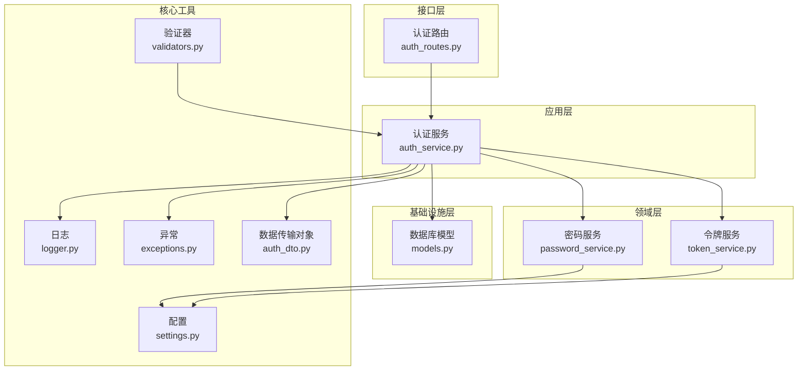
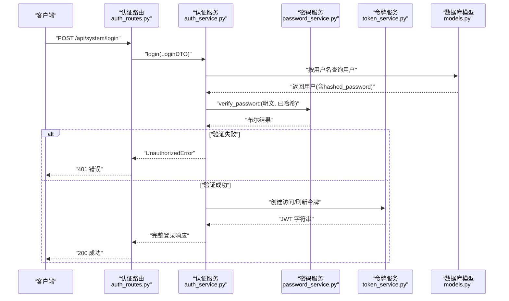
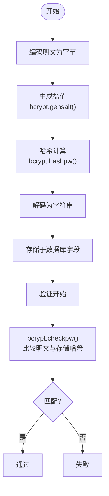
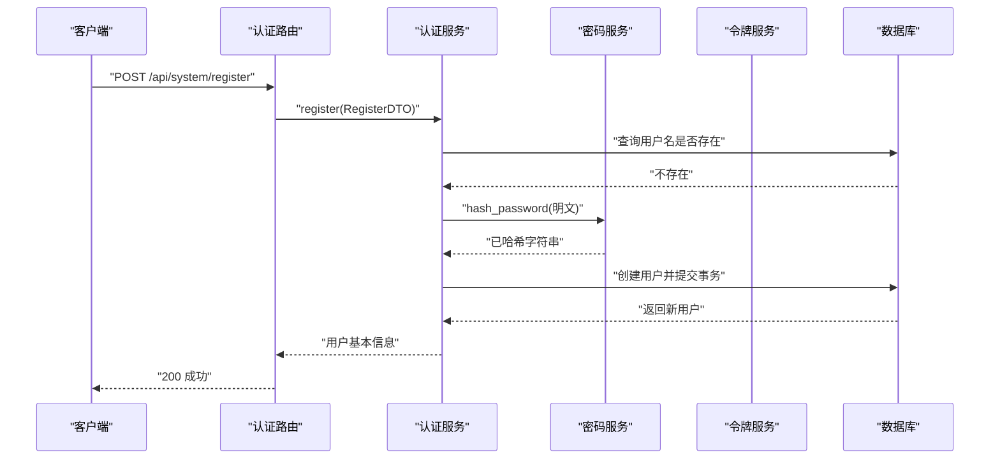
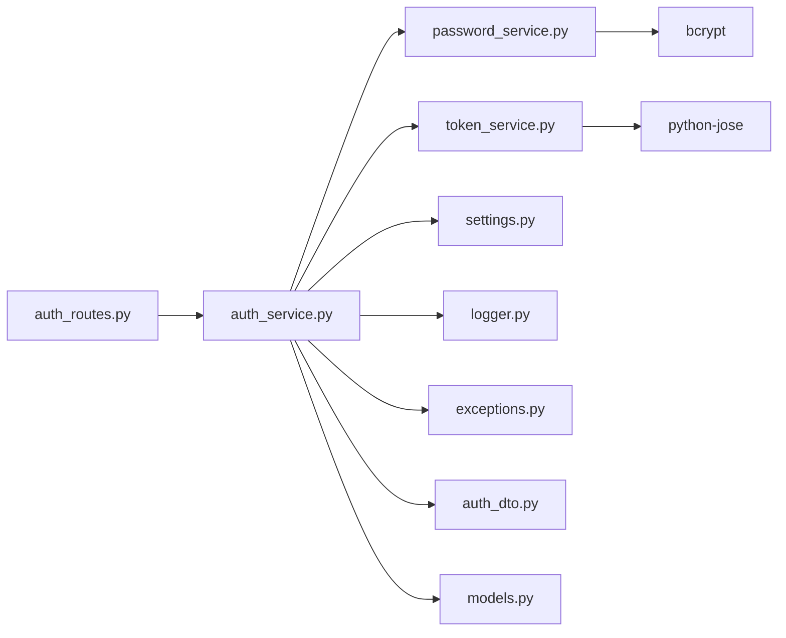

# 密码安全机制

<cite>
**本文引用的文件**
- [password_service.py](file://service/src/domain/auth/password_service.py)
- [auth_service.py](file://service/src/application/services/auth_service.py)
- [auth_routes.py](file://service/src/api/v1/auth_routes.py)
- [validators.py](file://service/src/core/validators.py)
- [settings.py](file://service/src/config/settings.py)
- [token_service.py](file://service/src/domain/auth/token_service.py)
- [models.py](file://service/src/infrastructure/database/models.py)
- [logger.py](file://service/src/core/logger.py)
- [exceptions.py](file://service/src/core/exceptions.py)
- [auth_dto.py](file://service/src/application/dto/auth_dto.py)
- [test_auth.py](file://service/tests/unit/test_auth.py)
- [pyproject.toml](file://service/pyproject.toml)
</cite>

## 目录
1. [简介](#简介)
2. [项目结构](#项目结构)
3. [核心组件](#核心组件)
4. [架构总览](#架构总览)
5. [详细组件分析](#详细组件分析)
6. [依赖分析](#依赖分析)
7. [性能考虑](#性能考虑)
8. [故障排查指南](#故障排查指南)
9. [结论](#结论)
10. [附录](#附录)

## 简介
本文件系统化阐述本项目的密码安全机制，围绕 bcrypt 哈希算法的工作原理与安全优势，详述密码哈希与验证流程、盐值生成与存储格式、密码强度规则、性能优化策略、密码重置流程、错误处理与安全日志记录，并给出可扩展与定制化的最佳实践建议。目标是帮助开发者在 FastAPI + DDD + RBAC 架构下构建健壮、可维护且符合安全标准的认证体系。

## 项目结构
密码安全相关代码主要分布在以下层次：
- 领域层：密码哈希与令牌管理
- 应用层：认证服务编排
- 接口层：认证路由
- 基础设施层：数据库模型
- 核心工具：配置、日志、异常、验证器
- 测试：密码与令牌功能的单元测试

图表来源
- [auth_routes.py:1-86](file://service/src/api/v1/auth_routes.py#L1-L86)
- [auth_service.py:1-154](file://service/src/application/services/auth_service.py#L1-L154)
- [password_service.py:1-21](file://service/src/domain/auth/password_service.py#L1-L21)
- [token_service.py:1-45](file://service/src/domain/auth/token_service.py#L1-L45)
- [models.py:1-193](file://service/src/infrastructure/database/models.py#L1-L193)
- [settings.py:1-198](file://service/src/config/settings.py#L1-L198)
- [logger.py:1-117](file://service/src/core/logger.py#L1-L117)
- [exceptions.py:1-60](file://service/src/core/exceptions.py#L1-L60)
- [validators.py:1-26](file://service/src/core/validators.py#L1-L26)
- [auth_dto.py:1-54](file://service/src/application/dto/auth_dto.py#L1-L54)

章节来源
- [auth_routes.py:1-86](file://service/src/api/v1/auth_routes.py#L1-L86)
- [auth_service.py:1-154](file://service/src/application/services/auth_service.py#L1-L154)
- [password_service.py:1-21](file://service/src/domain/auth/password_service.py#L1-L21)
- [token_service.py:1-45](file://service/src/domain/auth/token_service.py#L1-L45)
- [models.py:1-193](file://service/src/infrastructure/database/models.py#L1-L193)
- [settings.py:1-198](file://service/src/config/settings.py#L1-L198)
- [logger.py:1-117](file://service/src/core/logger.py#L1-L117)
- [exceptions.py:1-60](file://service/src/core/exceptions.py#L1-L60)
- [validators.py:1-26](file://service/src/core/validators.py#L1-L26)
- [auth_dto.py:1-54](file://service/src/application/dto/auth_dto.py#L1-L54)

## 核心组件
- 密码服务：封装 bcrypt 哈希与校验，负责盐值生成、哈希计算与存储格式转换。
- 认证服务：编排登录、注册、令牌刷新流程，调用密码服务与令牌服务，执行业务规则与状态检查。
- 令牌服务：基于 JWT 的访问令牌与刷新令牌生成、解码与类型校验。
- 数据模型：用户实体包含哈希密码字段，配合应用层服务完成持久化。
- 配置与日志：集中管理密钥、算法与过期时间；统一日志输出与访问日志记录。
- 异常与验证器：标准化错误类型与密码强度规则。

章节来源
- [password_service.py:1-21](file://service/src/domain/auth/password_service.py#L1-L21)
- [auth_service.py:1-154](file://service/src/application/services/auth_service.py#L1-L154)
- [token_service.py:1-45](file://service/src/domain/auth/token_service.py#L1-L45)
- [models.py:31-65](file://service/src/infrastructure/database/models.py#L31-L65)
- [settings.py:63-67](file://service/src/config/settings.py#L63-L67)
- [logger.py:1-117](file://service/src/core/logger.py#L1-L117)
- [exceptions.py:1-60](file://service/src/core/exceptions.py#L1-L60)
- [validators.py:15-26](file://service/src/core/validators.py#L15-L26)

## 架构总览
密码安全贯穿“接口层 → 应用层 → 领域层 → 基础设施层”的调用链路，确保密码只在领域层进行哈希与校验，应用层负责业务编排与状态控制，接口层仅暴露受控的认证接口。

图表来源
- [auth_routes.py:19-34](file://service/src/api/v1/auth_routes.py#L19-L34)
- [auth_service.py:26-74](file://service/src/application/services/auth_service.py#L26-L74)
- [password_service.py:18-20](file://service/src/domain/auth/password_service.py#L18-L20)
- [token_service.py:15-30](file://service/src/domain/auth/token_service.py#L15-L30)
- [models.py:31-65](file://service/src/infrastructure/database/models.py#L31-L65)

## 详细组件分析

### 密码哈希与验证（bcrypt）
- 盐值生成：使用 bcrypt.gensalt() 自动生成高熵盐值，保证相同明文每次生成不同哈希。
- 哈希计算：将明文密码编码为字节后与盐值进行哈希，返回字节结果再解码为字符串存储。
- 存储格式：bcrypt 输出包含算法标识、成本因子与盐值的完整字符串，可直接存储于数据库字段。
- 验证流程：bcrypt.checkpw 将明文与存储的哈希进行比较，返回布尔值，时间复杂度与成本因子相关。

图表来源
- [password_service.py:10-15](file://service/src/domain/auth/password_service.py#L10-L15)
- [password_service.py:18-20](file://service/src/domain/auth/password_service.py#L18-L20)

章节来源
- [password_service.py:1-21](file://service/src/domain/auth/password_service.py#L1-L21)

### 密码强度验证规则
- 长度：至少 8 个字符。
- 复杂度：必须包含至少一个大写字母、一个小写字母与一个数字。
- 常见密码检测：当前实现未包含常见弱密码列表检测，可在验证器中扩展黑名单校验。

章节来源
- [validators.py:15-26](file://service/src/core/validators.py#L15-L26)

### 密码验证机制与性能优化
- 时间复杂度：bcrypt 的哈希计算时间与成本因子成正比，可通过调整成本因子平衡安全与性能。
- 优化策略：
  - 合理设置成本因子（如在配置中引入 bcrypt_rounds），在生产环境适当提高以抵御暴力破解。
  - 对于高并发场景，结合速率限制与异步处理，避免阻塞主线程。
  - 使用连接池与索引优化数据库查询，减少 I/O 瓶颈。
  - 缓存热点用户信息（注意敏感数据不缓存明文密码）。

章节来源
- [settings.py:63-67](file://service/src/config/settings.py#L63-L67)
- [pyproject.toml:15](file://service/pyproject.toml#L15)

### 密码重置流程（安全实现建议）
- 当前后端未提供专用的“重置密码”接口，前端存在重置密码交互组件，但未展示后端实现。
- 安全建议（概念性说明，非现有实现）：
  - 生成一次性重置令牌并设置过期时间，发送至用户邮箱/手机。
  - 仅允许在有效期内、且与账户绑定的令牌下更新密码。
  - 更新密码后立即使旧令牌失效，并记录安全日志。
  - 可选：在用户侧增加“最近设备登录提醒”，增强异常登录感知。

[本节为概念性说明，不直接分析具体文件，故无章节来源]

### 错误处理与安全日志
- 自定义异常：提供统一的业务异常类型（认证失败、参数校验失败、业务错误等），便于前端与监控系统识别。
- 安全日志：使用 loguru 记录访问日志（HTTP 请求）、应用日志与错误日志，支持按级别与文件轮转。
- 建议：
  - 对认证失败事件记录客户端 IP、用户名（可选脱敏）、时间戳与上下文信息。
  - 对关键操作（如登录、刷新令牌）记录成功与失败事件，便于审计与风控。

章节来源
- [exceptions.py:1-60](file://service/src/core/exceptions.py#L1-L60)
- [logger.py:75-86](file://service/src/core/logger.py#L75-L86)

### 数据模型与存储
- 用户模型包含 hashed_password 字段，长度上限 255，足以容纳 bcrypt 输出。
- 建议：
  - 为 username、email 建立唯一索引，保障唯一性约束。
  - 对敏感字段（如 hashed_password）避免在日志中打印明文或哈希细节。

章节来源
- [models.py:31-65](file://service/src/infrastructure/database/models.py#L31-L65)

### 认证服务编排
- 登录流程：查询用户 → 校验密码 → 检查用户状态 → 生成访问/刷新令牌 → 返回角色与权限。
- 注册流程：检查用户名唯一性 → 哈希密码 → 创建用户 → 提交事务 → 返回用户基本信息。
- 刷新令牌：解码并校验令牌类型 → 校验用户状态 → 重新签发访问/刷新令牌。

图表来源
- [auth_routes.py:37-52](file://service/src/api/v1/auth_routes.py#L37-L52)
- [auth_service.py:76-116](file://service/src/application/services/auth_service.py#L76-L116)
- [password_service.py:10-15](file://service/src/domain/auth/password_service.py#L10-L15)

章节来源
- [auth_service.py:1-154](file://service/src/application/services/auth_service.py#L1-L154)
- [auth_routes.py:1-86](file://service/src/api/v1/auth_routes.py#L1-L86)

### 令牌与会话管理
- 访问令牌：短期有效，用于受保护资源访问。
- 刷新令牌：长期有效但受限于过期天数，用于换取新的访问令牌。
- 类型校验：解码后验证令牌类型，防止混淆攻击。

章节来源
- [token_service.py:15-44](file://service/src/domain/auth/token_service.py#L15-L44)
- [settings.py:63-67](file://service/src/config/settings.py#L63-L67)

## 依赖分析
- 外部依赖：bcrypt（密码哈希）、jose（JWT 编解码）、loguru（日志）、pydantic-settings（配置）。
- 内部依赖：认证服务依赖密码服务与令牌服务；路由依赖认证服务；模型依赖 SQLModel。

图表来源
- [password_service.py:3](file://service/src/domain/auth/password_service.py#L3)
- [token_service.py:6](file://service/src/domain/auth/token_service.py#L6)
- [auth_service.py:5-12](file://service/src/application/services/auth_service.py#L5-L12)
- [auth_routes.py:12-14](file://service/src/api/v1/auth_routes.py#L12-L14)
- [settings.py:41-67](file://service/src/config/settings.py#L41-L67)
- [logger.py:13](file://service/src/core/logger.py#L13)
- [exceptions.py:3](file://service/src/core/exceptions.py#L3)
- [auth_dto.py:3-5](file://service/src/application/dto/auth_dto.py#L3-L5)
- [models.py:11-12](file://service/src/infrastructure/database/models.py#L11-L12)

章节来源
- [pyproject.toml:7-20](file://service/pyproject.toml#L7-L20)
- [auth_service.py:1-154](file://service/src/application/services/auth_service.py#L1-L154)
- [auth_routes.py:1-86](file://service/src/api/v1/auth_routes.py#L1-L86)

## 性能考虑
- bcrypt 成本因子：在安全与性能间权衡，建议在生产环境逐步提升，配合基准测试确定最优值。
- 并发与限流：结合全局限流中间件与令牌桶算法，限制同一 IP 的认证尝试频率。
- 数据库优化：为用户名与邮箱建立唯一索引，使用异步连接池，避免 N+1 查询。
- 缓存策略：对非敏感的用户元信息进行缓存，避免重复查询；严格禁止缓存明文密码或哈希。

[本节提供通用指导，不直接分析具体文件，故无章节来源]

## 故障排查指南
- 登录失败：
  - 检查用户名是否存在与用户状态是否启用。
  - 核对密码哈希是否正确存储与 bcrypt 版本兼容。
  - 查看访问日志定位异常请求与耗时。
- 令牌问题：
  - 校验 JWT 密钥与算法配置是否一致。
  - 确认刷新令牌类型与过期时间设置。
- 密码强度：
  - 若前端提示不符合规则，检查验证器规则与国际化文案。
- 单元测试参考：
  - 密码哈希与校验、令牌创建与解码、类型校验的断言可作为回归测试基线。

章节来源
- [auth_service.py:26-74](file://service/src/application/services/auth_service.py#L26-L74)
- [test_auth.py:10-25](file://service/tests/unit/test_auth.py#L10-L25)
- [test_auth.py:30-67](file://service/tests/unit/test_auth.py#L30-L67)
- [logger.py:75-86](file://service/src/core/logger.py#L75-L86)

## 结论
本项目采用 bcrypt 进行密码哈希，结合 JWT 令牌与严格的业务编排，实现了基础而稳健的认证安全框架。通过统一的异常与日志体系、清晰的分层设计以及可扩展的配置，开发者可以在不牺牲安全性的前提下快速迭代功能。建议在生产环境中进一步完善密码强度规则、引入一次性重置令牌与安全审计日志，并持续评估 bcrypt 成本因子与系统性能表现。

## 附录
- 最佳实践清单
  - 使用 bcrypt 并设置合理成本因子。
  - 严格区分访问令牌与刷新令牌，短时访问、长时刷新。
  - 对认证失败与关键操作进行安全日志记录。
  - 在注册与登录前执行密码强度校验。
  - 定期轮换密钥与算法配置，遵循最小权限原则。
  - 对外部依赖版本进行安全扫描与升级。

[本节为总结性内容，不直接分析具体文件，故无章节来源]