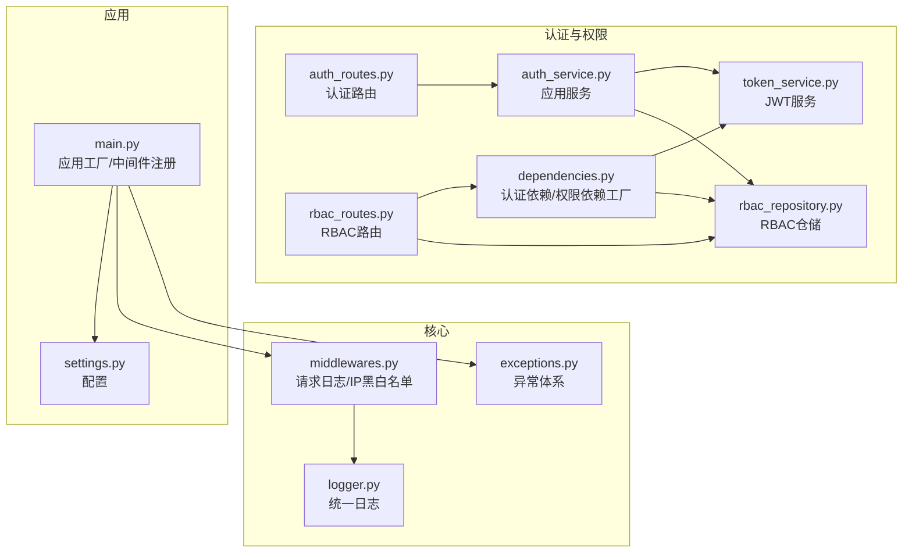
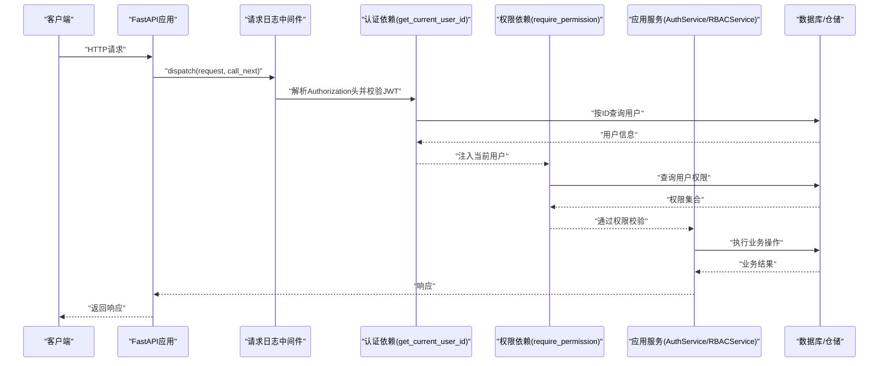
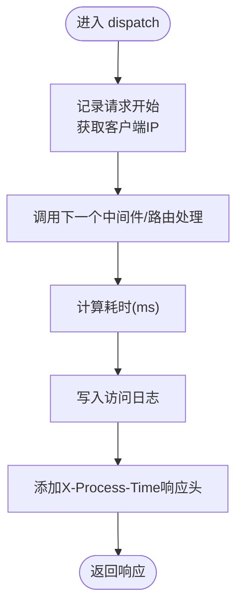
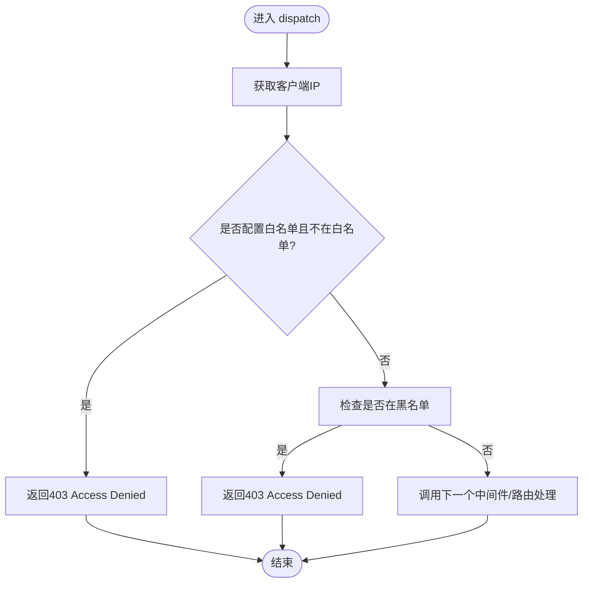
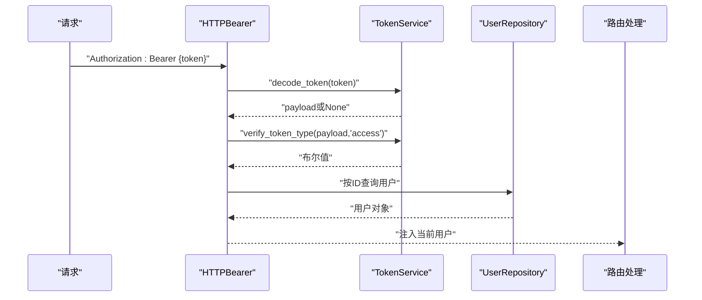
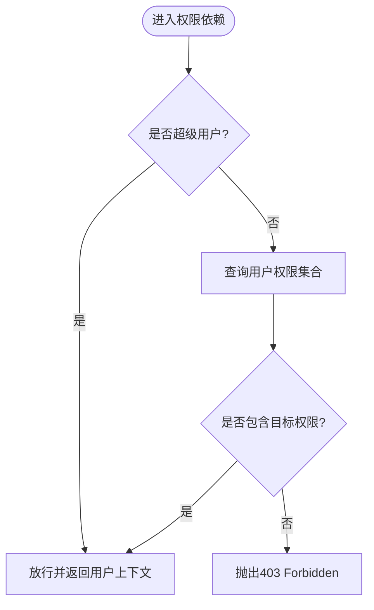
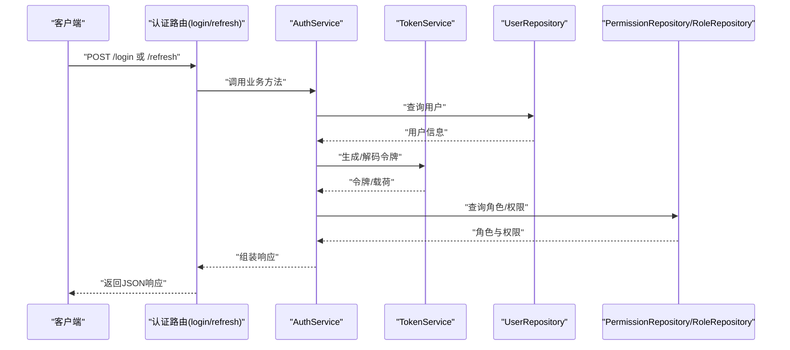
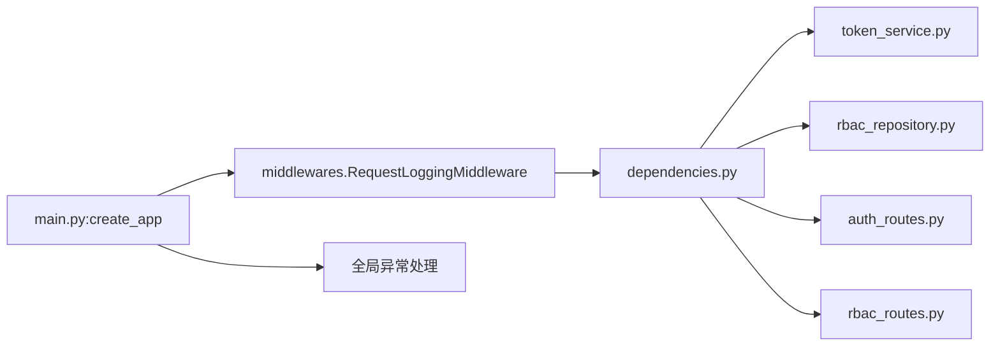

# 认证中间件

<cite>
**本文引用的文件**
- [middlewares.py](file://service/src/core/middlewares.py)
- [dependencies.py](file://service/src/api/dependencies.py)
- [token_service.py](file://service/src/domain/auth/token_service.py)
- [auth_service.py](file://service/src/application/services/auth_service.py)
- [auth_routes.py](file://service/src/api/v1/auth_routes.py)
- [rbac_routes.py](file://service/src/api/v1/rbac_routes.py)
- [rbac_repository.py](file://service/src/infrastructure/repositories/rbac_repository.py)
- [main.py](file://service/src/main.py)
- [settings.py](file://service/src/config/settings.py)
- [logger.py](file://service/src/core/logger.py)
- [exceptions.py](file://service/src/core/exceptions.py)
- [test_auth.py](file://service/tests/unit/test_auth.py)
</cite>

## 目录
1. [简介](#简介)
2. [项目结构](#项目结构)
3. [核心组件](#核心组件)
4. [架构总览](#架构总览)
5. [组件详解](#组件详解)
6. [依赖关系分析](#依赖关系分析)
7. [性能与缓存](#性能与缓存)
8. [故障排查指南](#故障排查指南)
9. [结论](#结论)
10. [附录](#附录)

## 简介
本文件聚焦于认证中间件与权限校验体系，系统阐述以下内容：
- 认证中间件在认证系统中的职责与执行顺序
- 请求拦截机制：预处理、认证检查、后处理三阶段
- 权限验证中间件：路由级权限检查与动态权限验证
- 认证状态提取：从请求头解析令牌与用户信息注入
- 中间件配置选项：白名单/黑名单、认证策略、错误处理
- 中间件链组合与优先级管理
- 性能优化与缓存策略
- 自定义中间件的开发与集成
- 调试与监控工具与技巧

## 项目结构
本项目采用分层架构（DDD），认证相关代码主要分布在以下模块：
- 核心中间件：请求日志与IP黑白名单
- 认证依赖：令牌解析、用户上下文注入、权限依赖工厂
- 领域服务：JWT令牌生成、刷新与校验
- 应用服务：登录、注册、令牌刷新流程编排
- 路由：认证接口与RBAC接口
- 配置与日志：全局中间件注册、日志与异常处理
- 测试：认证与令牌服务的单元测试

图表来源
- [middlewares.py:12-64](file://service/src/core/middlewares.py#L12-L64)
- [dependencies.py:16-71](file://service/src/api/dependencies.py#L16-L71)
- [token_service.py:11-44](file://service/src/domain/auth/token_service.py#L11-L44)
- [auth_service.py:15-154](file://service/src/application/services/auth_service.py#L15-L154)
- [auth_routes.py:19-85](file://service/src/api/v1/auth_routes.py#L19-L85)
- [rbac_routes.py:33-256](file://service/src/api/v1/rbac_routes.py#L33-L256)
- [rbac_repository.py:11-212](file://service/src/infrastructure/repositories/rbac_repository.py#L11-L212)
- [main.py:34-96](file://service/src/main.py#L34-L96)
- [settings.py:41-198](file://service/src/config/settings.py#L41-L198)
- [logger.py:75-117](file://service/src/core/logger.py#L75-L117)

章节来源
- [main.py:34-96](file://service/src/main.py#L34-L96)
- [middlewares.py:12-64](file://service/src/core/middlewares.py#L12-L64)
- [dependencies.py:16-71](file://service/src/api/dependencies.py#L16-L71)
- [token_service.py:11-44](file://service/src/domain/auth/token_service.py#L11-L44)
- [auth_service.py:15-154](file://service/src/application/services/auth_service.py#L15-L154)
- [auth_routes.py:19-85](file://service/src/api/v1/auth_routes.py#L19-L85)
- [rbac_routes.py:33-256](file://service/src/api/v1/rbac_routes.py#L33-L256)
- [rbac_repository.py:11-212](file://service/src/infrastructure/repositories/rbac_repository.py#L11-L212)
- [settings.py:41-198](file://service/src/config/settings.py#L41-L198)
- [logger.py:75-117](file://service/src/core/logger.py#L75-L117)

## 核心组件
- 请求日志中间件：记录请求开始、结束与耗时，统一注入响应头
- IP黑白名单中间件：基于白名单放行或黑名单拒绝
- 认证依赖：从Authorization头解析JWT，校验令牌类型与有效性，注入当前用户
- 权限依赖工厂：按需校验用户是否具备指定权限或超级用户
- JWT服务：生成访问/刷新令牌、解码与类型校验
- 应用服务：登录、注册、刷新令牌的业务编排
- RBAC路由：基于权限依赖进行路由级访问控制
- 异常与日志：统一异常处理与访问日志输出

章节来源
- [middlewares.py:12-64](file://service/src/core/middlewares.py#L12-L64)
- [dependencies.py:16-71](file://service/src/api/dependencies.py#L16-L71)
- [token_service.py:11-44](file://service/src/domain/auth/token_service.py#L11-L44)
- [auth_service.py:15-154](file://service/src/application/services/auth_service.py#L15-L154)
- [rbac_routes.py:33-256](file://service/src/api/v1/rbac_routes.py#L33-L256)
- [exceptions.py:6-60](file://service/src/core/exceptions.py#L6-L60)
- [logger.py:75-117](file://service/src/core/logger.py#L75-L117)

## 架构总览
认证与权限控制在应用启动时注册为中间件，并在路由层通过依赖注入实现“声明式”权限控制。

图表来源
- [main.py:55-58](file://service/src/main.py#L55-L58)
- [middlewares.py:15-39](file://service/src/core/middlewares.py#L15-L39)
- [dependencies.py:16-42](file://service/src/api/dependencies.py#L16-L42)
- [dependencies.py:45-60](file://service/src/api/dependencies.py#L45-L60)
- [rbac_repository.py:203-212](file://service/src/infrastructure/repositories/rbac_repository.py#L203-L212)
- [auth_service.py:26-74](file://service/src/application/services/auth_service.py#L26-L74)

## 组件详解

### 请求日志中间件
- 职责：记录请求开始、计算处理耗时、写入访问日志、向响应头注入X-Process-Time
- 执行顺序：在路由处理前执行，确保覆盖全链路
- 性能：轻量计时与日志输出，建议结合异步队列与日志轮转

图表来源
- [middlewares.py:15-39](file://service/src/core/middlewares.py#L15-L39)
- [logger.py:75-85](file://service/src/core/logger.py#L75-L85)

章节来源
- [middlewares.py:12-39](file://service/src/core/middlewares.py#L12-L39)
- [logger.py:75-85](file://service/src/core/logger.py#L75-L85)

### IP黑白名单中间件
- 职责：基于白名单优先策略放行；若未命中白名单则拒绝；随后检查黑名单
- 执行顺序：在请求日志之后、路由处理之前
- 配置：构造函数接收blacklist与whitelist集合

图表来源
- [middlewares.py:42-64](file://service/src/core/middlewares.py#L42-L64)

章节来源
- [middlewares.py:42-64](file://service/src/core/middlewares.py#L42-L64)

### 认证状态提取与用户注入
- 令牌来源：HTTP Authorization: Bearer {token}
- 解析与校验：使用JWT服务解码并校验类型为access
- 用户注入：按ID查询用户，校验账户状态，注入当前用户上下文
- 依赖链：get_current_user_id -> get_current_active_user

图表来源
- [dependencies.py:16-42](file://service/src/api/dependencies.py#L16-L42)
- [token_service.py:33-44](file://service/src/domain/auth/token_service.py#L33-L44)
- [rbac_repository.py:17-20](file://service/src/infrastructure/repositories/rbac_repository.py#L17-L20)

章节来源
- [dependencies.py:16-42](file://service/src/api/dependencies.py#L16-L42)
- [token_service.py:33-44](file://service/src/domain/auth/token_service.py#L33-L44)
- [rbac_repository.py:17-20](file://service/src/infrastructure/repositories/rbac_repository.py#L17-L20)

### 权限验证中间件与动态权限
- 路由级权限：通过require_permission(code)依赖工厂在路由上声明所需权限
- 动态权限：非超级用户时查询用户权限集合，判断是否包含目标权限
- 超级用户豁免：is_superuser为真时跳过权限校验

图表来源
- [dependencies.py:45-60](file://service/src/api/dependencies.py#L45-L60)
- [rbac_repository.py:203-212](file://service/src/infrastructure/repositories/rbac_repository.py#L203-L212)

章节来源
- [dependencies.py:45-71](file://service/src/api/dependencies.py#L45-L71)
- [rbac_repository.py:203-212](file://service/src/infrastructure/repositories/rbac_repository.py#L203-L212)

### 登录与令牌刷新流程
- 登录：校验用户名/密码与账户状态，生成access/refresh令牌，查询角色与权限，返回完整登录信息
- 刷新：校验refresh令牌类型与有效性，查询用户状态，签发新令牌

图表来源
- [auth_routes.py:19-85](file://service/src/api/v1/auth_routes.py#L19-L85)
- [auth_service.py:26-154](file://service/src/application/services/auth_service.py#L26-L154)
- [token_service.py:14-44](file://service/src/domain/auth/token_service.py#L14-L44)
- [rbac_repository.py:128-133](file://service/src/infrastructure/repositories/rbac_repository.py#L128-L133)

章节来源
- [auth_routes.py:19-85](file://service/src/api/v1/auth_routes.py#L19-L85)
- [auth_service.py:26-154](file://service/src/application/services/auth_service.py#L26-L154)
- [token_service.py:14-44](file://service/src/domain/auth/token_service.py#L14-L44)
- [rbac_repository.py:128-133](file://service/src/infrastructure/repositories/rbac_repository.py#L128-L133)

### RBAC路由与权限依赖
- 角色与权限管理路由均通过require_permission声明所需权限
- 依赖链：路由 -> require_permission -> get_current_active_user -> UserRepository
- 支持分页查询、创建、更新、删除与权限分配

章节来源
- [rbac_routes.py:33-256](file://service/src/api/v1/rbac_routes.py#L33-L256)
- [dependencies.py:45-71](file://service/src/api/dependencies.py#L45-L71)

## 依赖关系分析
- 中间件注册：应用工厂在CORSMiddleware之后注册请求日志中间件
- 认证链：HTTPBearer -> TokenService -> UserRepository -> 路由处理
- 权限链：get_current_active_user -> PermissionRepository -> 路由处理
- 异常处理：全局捕获AppException、参数校验错误与未处理异常

图表来源
- [main.py:55-82](file://service/src/main.py#L55-L82)
- [middlewares.py:15-39](file://service/src/core/middlewares.py#L15-L39)
- [dependencies.py:16-71](file://service/src/api/dependencies.py#L16-L71)
- [token_service.py:14-44](file://service/src/domain/auth/token_service.py#L14-L44)
- [rbac_repository.py:203-212](file://service/src/infrastructure/repositories/rbac_repository.py#L203-L212)
- [auth_routes.py:19-85](file://service/src/api/v1/auth_routes.py#L19-L85)
- [rbac_routes.py:33-256](file://service/src/api/v1/rbac_routes.py#L33-L256)

章节来源
- [main.py:55-82](file://service/src/main.py#L55-L82)
- [middlewares.py:15-39](file://service/src/core/middlewares.py#L15-L39)
- [dependencies.py:16-71](file://service/src/api/dependencies.py#L16-L71)
- [rbac_repository.py:203-212](file://service/src/infrastructure/repositories/rbac_repository.py#L203-L212)

## 性能与缓存
- 中间件开销：请求日志中间件为O(1)，IP黑白名单为集合查找，开销极低
- 令牌校验：JWT解码与算法验证为CPU密集型，建议：
  - 缓存热点用户权限（Redis）以减少数据库查询
  - 对频繁访问的静态资源启用CDN与缓存头
  - 合理设置ACCESS_TOKEN_EXPIRE_MINUTES，避免频繁刷新
- 日志性能：使用异步队列与文件轮转，避免阻塞IO
- 连接池：数据库连接池与事务批量提交降低延迟

[本节为通用性能建议，不直接分析具体文件]

## 故障排查指南
- 401未认证：检查Authorization头格式与令牌有效性；确认令牌类型为access
- 403权限不足：确认用户权限集合是否包含目标code；超级用户可豁免
- 422参数校验失败：查看全局参数校验异常处理器返回的errors字段
- 500内部错误：查看全局异常处理器与日志文件
- 访问日志：通过访问日志定位慢请求与错误路径

章节来源
- [dependencies.py:16-42](file://service/src/api/dependencies.py#L16-L42)
- [dependencies.py:45-71](file://service/src/api/dependencies.py#L45-L71)
- [main.py:68-82](file://service/src/main.py#L68-L82)
- [logger.py:75-85](file://service/src/core/logger.py#L75-L85)

## 结论
本认证与权限体系通过“中间件 + 依赖注入 + RBAC”的组合，实现了清晰的请求拦截与权限控制：
- 中间件负责基础设施层（日志、IP过滤）
- 依赖注入负责认证与权限的声明式校验
- RBAC路由将权限约束落实到具体资源操作
整体具备良好的扩展性与可观测性，适合在生产环境中稳定运行。

[本节为总结性内容，不直接分析具体文件]

## 附录

### 中间件配置选项与最佳实践
- 白名单/黑名单：在IP过滤中间件构造函数传入集合
- 认证策略：Bearer令牌 + access令牌类型校验
- 错误处理：统一异常映射为JSON响应，保留错误细节但不泄露敏感信息
- 日志：访问日志独立文件，便于审计与性能分析

章节来源
- [middlewares.py:42-64](file://service/src/core/middlewares.py#L42-L64)
- [main.py:60-82](file://service/src/main.py#L60-L82)
- [logger.py:75-117](file://service/src/core/logger.py#L75-L117)

### 自定义中间件开发与集成
- 继承BaseHTTPMiddleware，实现dispatch方法
- 在应用工厂中通过add_middleware注册
- 注意中间件顺序：越靠前的中间件越早执行
- 保持无状态与幂等，避免共享可变状态

章节来源
- [middlewares.py:12-39](file://service/src/core/middlewares.py#L12-L39)
- [main.py:55-58](file://service/src/main.py#L55-L58)

### 调试与监控工具与技巧
- 单元测试：参考认证与令牌服务测试用例，验证令牌生成、解码与类型校验
- 日志：利用访问日志定位问题；结合X-Process-Time响应头评估性能
- 异常：通过全局异常处理器统一输出，便于前端与运维处理

章节来源
- [test_auth.py:30-67](file://service/tests/unit/test_auth.py#L30-L67)
- [logger.py:75-85](file://service/src/core/logger.py#L75-L85)
- [main.py:60-82](file://service/src/main.py#L60-L82)