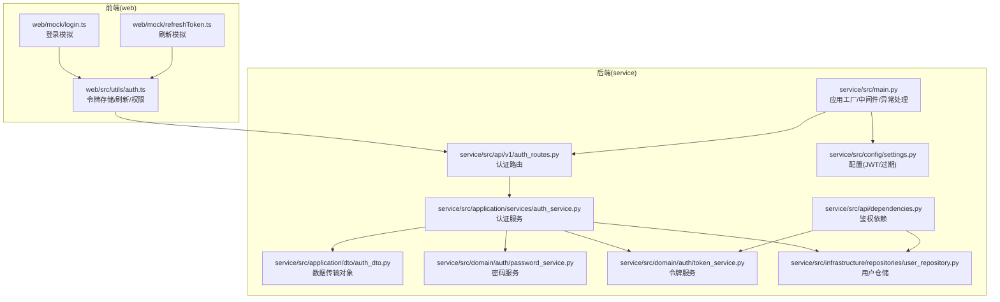
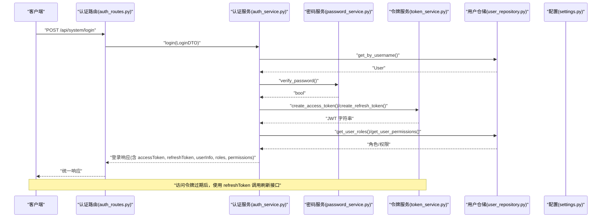
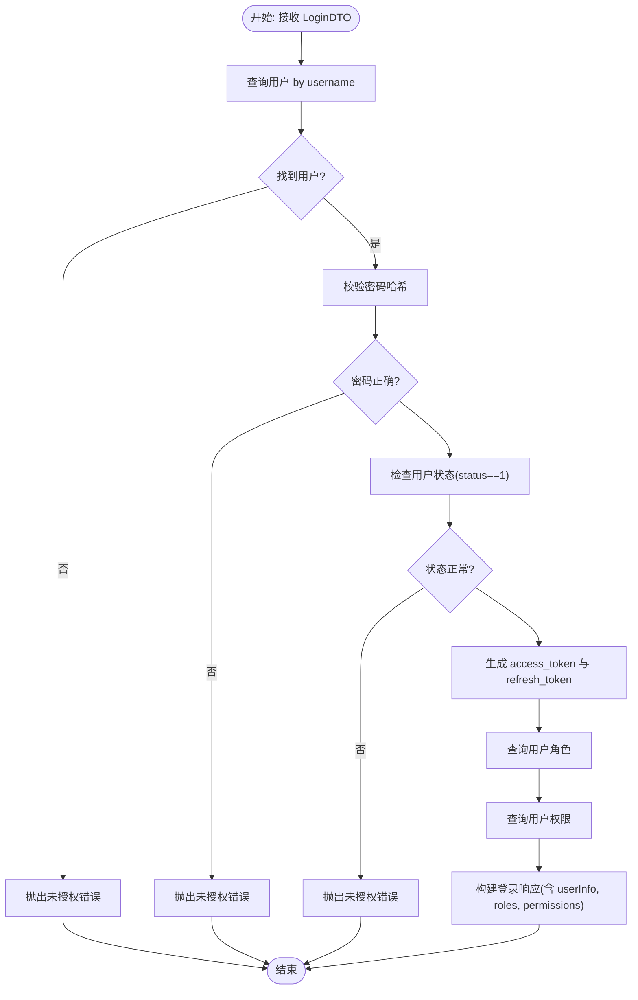
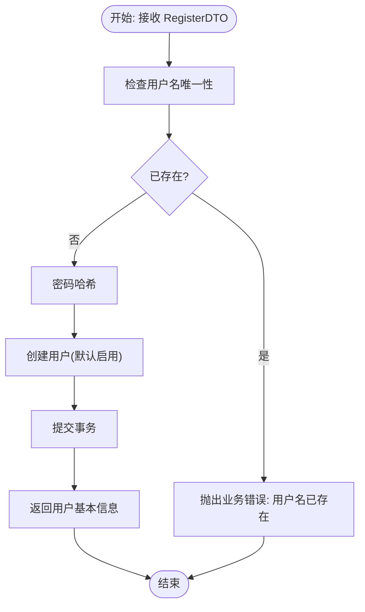
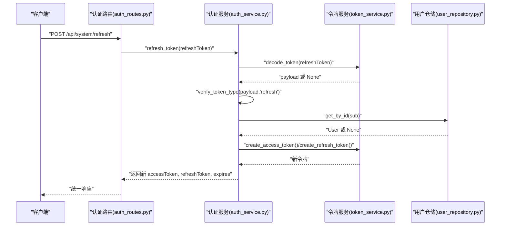
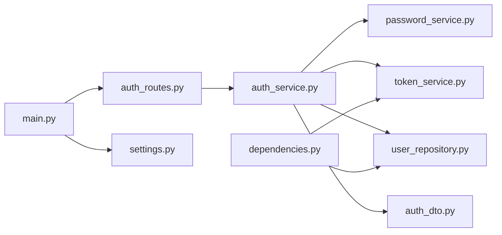

# 认证工作流程

<cite>
**本文引用的文件**
- [service/src/api/v1/auth_routes.py](file://service/src/api/v1/auth_routes.py)
- [service/src/application/services/auth_service.py](file://service/src/application/services/auth_service.py)
- [service/src/application/dto/auth_dto.py](file://service/src/application/dto/auth_dto.py)
- [service/src/domain/auth/password_service.py](file://service/src/domain/auth/password_service.py)
- [service/src/domain/auth/token_service.py](file://service/src/domain/auth/token_service.py)
- [service/src/infrastructure/repositories/user_repository.py](file://service/src/infrastructure/repositories/user_repository.py)
- [service/src/api/dependencies.py](file://service/src/api/dependencies.py)
- [service/src/config/settings.py](file://service/src/config/settings.py)
- [service/src/main.py](file://service/src/main.py)
- [web/src/utils/auth.ts](file://web/src/utils/auth.ts)
- [web/mock/login.ts](file://web/mock/login.ts)
- [web/mock/refreshToken.ts](file://web/mock/refreshToken.ts)
- [service/tests/unit/test_auth.py](file://service/tests/unit/test_auth.py)
</cite>

## 目录
1. [简介](#简介)
2. [项目结构](#项目结构)
3. [核心组件](#核心组件)
4. [架构总览](#架构总览)
5. [详细组件分析](#详细组件分析)
6. [依赖分析](#依赖分析)
7. [性能考虑](#性能考虑)
8. [故障排查指南](#故障排查指南)
9. [结论](#结论)
10. [附录](#附录)

## 简介
本文件系统化梳理认证工作流程，覆盖从用户发起认证请求到会话建立的完整生命周期，包括登录认证、注册、令牌刷新、登出、状态管理与会话超时处理、并发会话与多设备登录策略、错误处理与安全响应，以及面向开发者的监控与调试方法。该实现采用 JWT 无状态认证，服务端不维护会话状态，客户端负责存储与传递令牌。

## 项目结构
后端采用 FastAPI + DDD 分层架构，认证相关代码集中在以下模块：
- API 层：定义认证路由与依赖注入
- 应用层：封装业务逻辑（登录、注册、刷新）
- 领域层：密码哈希与 JWT 工具
- 基础设施层：用户仓储与数据库模型
- 配置层：JWT 与过期时间等参数
- 前端：令牌存储、刷新与权限控制

图表来源
- [service/src/main.py:34-96](file://service/src/main.py#L34-L96)
- [service/src/api/v1/auth_routes.py:19-86](file://service/src/api/v1/auth_routes.py#L19-L86)
- [service/src/api/dependencies.py:16-72](file://service/src/api/dependencies.py#L16-L72)
- [service/src/application/services/auth_service.py:26-154](file://service/src/application/services/auth_service.py#L26-L154)
- [service/src/application/dto/auth_dto.py:7-54](file://service/src/application/dto/auth_dto.py#L7-L54)
- [service/src/domain/auth/password_service.py:9-21](file://service/src/domain/auth/password_service.py#L9-L21)
- [service/src/domain/auth/token_service.py:14-45](file://service/src/domain/auth/token_service.py#L14-L45)
- [service/src/infrastructure/repositories/user_repository.py:17-119](file://service/src/infrastructure/repositories/user_repository.py#L17-L119)
- [service/src/config/settings.py:63-67](file://service/src/config/settings.py#L63-L67)

章节来源
- [service/src/main.py:34-96](file://service/src/main.py#L34-L96)
- [service/src/api/v1/auth_routes.py:19-86](file://service/src/api/v1/auth_routes.py#L19-L86)
- [service/src/api/dependencies.py:16-72](file://service/src/api/dependencies.py#L16-L72)
- [service/src/application/services/auth_service.py:26-154](file://service/src/application/services/auth_service.py#L26-L154)
- [service/src/application/dto/auth_dto.py:7-54](file://service/src/application/dto/auth_dto.py#L7-L54)
- [service/src/domain/auth/password_service.py:9-21](file://service/src/domain/auth/password_service.py#L9-L21)
- [service/src/domain/auth/token_service.py:14-45](file://service/src/domain/auth/token_service.py#L14-L45)
- [service/src/infrastructure/repositories/user_repository.py:17-119](file://service/src/infrastructure/repositories/user_repository.py#L17-L119)
- [service/src/config/settings.py:63-67](file://service/src/config/settings.py#L63-L67)

## 核心组件
- 认证路由：提供登录、注册、登出、刷新四个接口，统一返回结构。
- 认证服务：封装登录验证、注册流程、刷新令牌的核心逻辑。
- 密码服务：基于 bcrypt 的密码哈希与校验。
- 令牌服务：JWT 访问令牌与刷新令牌的签发、解码与类型校验。
- 用户仓储：提供按用户名/ID 查询、创建、状态更新等能力。
- 鉴权依赖：从 Authorization 头部提取并校验访问令牌，获取当前活跃用户。
- 配置：JWT 秘钥、算法、访问令牌与刷新令牌过期时间等。

章节来源
- [service/src/api/v1/auth_routes.py:19-86](file://service/src/api/v1/auth_routes.py#L19-L86)
- [service/src/application/services/auth_service.py:26-154](file://service/src/application/services/auth_service.py#L26-L154)
- [service/src/domain/auth/password_service.py:9-21](file://service/src/domain/auth/password_service.py#L9-L21)
- [service/src/domain/auth/token_service.py:14-45](file://service/src/domain/auth/token_service.py#L14-L45)
- [service/src/infrastructure/repositories/user_repository.py:17-119](file://service/src/infrastructure/repositories/user_repository.py#L17-L119)
- [service/src/api/dependencies.py:16-72](file://service/src/api/dependencies.py#L16-L72)
- [service/src/config/settings.py:63-67](file://service/src/config/settings.py#L63-L67)

## 架构总览
认证系统遵循“路由 → 服务 → 领域/仓储”的分层设计，JWT 无状态特性使得服务端无需维护会话；前端负责令牌持久化与刷新。

图表来源
- [service/src/api/v1/auth_routes.py:19-34](file://service/src/api/v1/auth_routes.py#L19-L34)
- [service/src/application/services/auth_service.py:26-74](file://service/src/application/services/auth_service.py#L26-L74)
- [service/src/domain/auth/password_service.py:18-21](file://service/src/domain/auth/password_service.py#L18-L21)
- [service/src/domain/auth/token_service.py:15-30](file://service/src/domain/auth/token_service.py#L15-L30)
- [service/src/infrastructure/repositories/user_repository.py:17-25](file://service/src/infrastructure/repositories/user_repository.py#L17-L25)
- [service/src/config/settings.py:63-67](file://service/src/config/settings.py#L63-L67)

## 详细组件分析

### 登录认证流程
- 输入：用户名与密码
- 核心步骤：
  1) 通过用户名查询用户
  2) 校验密码哈希
  3) 检查用户状态（启用）
  4) 生成访问令牌与刷新令牌
  5) 查询用户角色与权限
  6) 返回完整登录响应
- 错误处理：用户名或密码错误、用户被禁用、令牌签发失败等

图表来源
- [service/src/application/services/auth_service.py:26-74](file://service/src/application/services/auth_service.py#L26-L74)
- [service/src/domain/auth/password_service.py:18-21](file://service/src/domain/auth/password_service.py#L18-L21)
- [service/src/domain/auth/token_service.py:15-30](file://service/src/domain/auth/token_service.py#L15-L30)
- [service/src/infrastructure/repositories/user_repository.py:17-25](file://service/src/infrastructure/repositories/user_repository.py#L17-L25)

章节来源
- [service/src/application/services/auth_service.py:26-74](file://service/src/application/services/auth_service.py#L26-L74)
- [service/src/domain/auth/password_service.py:18-21](file://service/src/domain/auth/password_service.py#L18-L21)
- [service/src/infrastructure/repositories/user_repository.py:17-25](file://service/src/infrastructure/repositories/user_repository.py#L17-L25)

### 用户注册流程
- 输入：用户名、密码、昵称、邮箱、手机号
- 核心步骤：
  1) 校验用户名唯一性
  2) 对密码进行哈希
  3) 创建用户（默认启用）
  4) 提交事务并返回用户基本信息
- 错误处理：用户名已存在

图表来源
- [service/src/application/services/auth_service.py:76-116](file://service/src/application/services/auth_service.py#L76-L116)
- [service/src/domain/auth/password_service.py:10-15](file://service/src/domain/auth/password_service.py#L10-L15)
- [service/src/infrastructure/repositories/user_repository.py:114-119](file://service/src/infrastructure/repositories/user_repository.py#L114-L119)

章节来源
- [service/src/application/services/auth_service.py:76-116](file://service/src/application/services/auth_service.py#L76-L116)
- [service/src/domain/auth/password_service.py:10-15](file://service/src/domain/auth/password_service.py#L10-L15)
- [service/src/infrastructure/repositories/user_repository.py:114-119](file://service/src/infrastructure/repositories/user_repository.py#L114-L119)

### 令牌刷新流程
- 输入：刷新令牌
- 核心步骤：
  1) 解码并验证刷新令牌
  2) 校验令牌类型为 refresh
  3) 从载荷提取用户标识并查询用户
  4) 校验用户存在且状态正常
  5) 生成新的访问令牌与刷新令牌
  6) 返回新令牌与过期时间
- 错误处理：无效/过期令牌、类型不符、用户不存在或被禁用

图表来源
- [service/src/api/v1/auth_routes.py:70-85](file://service/src/api/v1/auth_routes.py#L70-L85)
- [service/src/application/services/auth_service.py:118-153](file://service/src/application/services/auth_service.py#L118-L153)
- [service/src/domain/auth/token_service.py:33-44](file://service/src/domain/auth/token_service.py#L33-L44)
- [service/src/infrastructure/repositories/user_repository.py:17-20](file://service/src/infrastructure/repositories/user_repository.py#L17-L20)

章节来源
- [service/src/api/v1/auth_routes.py:70-85](file://service/src/api/v1/auth_routes.py#L70-L85)
- [service/src/application/services/auth_service.py:118-153](file://service/src/application/services/auth_service.py#L118-L153)
- [service/src/domain/auth/token_service.py:33-44](file://service/src/domain/auth/token_service.py#L33-L44)
- [service/src/infrastructure/repositories/user_repository.py:17-20](file://service/src/infrastructure/repositories/user_repository.py#L17-L20)

### 用户登出机制
- JWT 为无状态认证，服务端不保存会话；登出即客户端删除本地令牌
- 建议前端在登出时清除 Cookie 与 LocalStorage 中的令牌与用户信息

章节来源
- [service/src/api/v1/auth_routes.py:55-67](file://service/src/api/v1/auth_routes.py#L55-L67)
- [web/src/utils/auth.ts:118-123](file://web/src/utils/auth.ts#L118-L123)

### 认证状态管理与会话超时
- 前端通过 Cookie 存储 accessToken 与 refreshToken，并以 expires 控制过期
- 前端在每次请求时附加 Bearer 令牌
- 访问令牌过期后，使用刷新令牌换取新令牌
- 若刷新令牌也过期或无效，需重新登录

章节来源
- [web/src/utils/auth.ts:48-123](file://web/src/utils/auth.ts#L48-L123)
- [service/src/domain/auth/token_service.py:15-30](file://service/src/domain/auth/token_service.py#L15-L30)
- [service/src/config/settings.py:63-67](file://service/src/config/settings.py#L63-L67)

### 并发会话与多设备登录
- 当前实现未限制同一账户的并发登录数，可在令牌服务或仓储层扩展“在线会话表”以实现并发控制
- 可选策略：每设备发放独立刷新令牌，服务端记录并校验；或引入 Redis 缓存维护设备维度的令牌集合

（本节为概念性建议，不直接对应现有代码）

### 错误处理与安全响应
- 未授权/无效令牌：抛出未授权错误
- 权限不足：抛出禁止访问错误
- 参数校验失败：统一 422 响应
- 未捕获异常：统一 500 响应
- 前端统一拦截并提示

章节来源
- [service/src/api/dependencies.py:16-42](file://service/src/api/dependencies.py#L16-L42)
- [service/src/main.py:61-82](file://service/src/main.py#L61-L82)

### 监控与调试方法
- 请求日志中间件：记录请求路径、状态码与耗时
- 全局异常处理器：规范化错误响应
- 单元测试：覆盖密码哈希与令牌编解码、类型校验
- 前端 Mock：模拟登录与刷新接口，便于联调

章节来源
- [service/src/main.py:55-82](file://service/src/main.py#L55-L82)
- [service/tests/unit/test_auth.py:10-67](file://service/tests/unit/test_auth.py#L10-L67)
- [web/mock/login.ts:8-43](file://web/mock/login.ts#L8-L43)
- [web/mock/refreshToken.ts:8-27](file://web/mock/refreshToken.ts#L8-L27)

## 依赖分析
认证相关模块之间的依赖关系如下：

图表来源
- [service/src/api/v1/auth_routes.py:12-14](file://service/src/api/v1/auth_routes.py#L12-L14)
- [service/src/application/services/auth_service.py:5-24](file://service/src/application/services/auth_service.py#L5-L24)
- [service/src/api/dependencies.py:8-11](file://service/src/api/dependencies.py#L8-L11)
- [service/src/main.py:90](file://service/src/main.py#L90)
- [service/src/config/settings.py:63-67](file://service/src/config/settings.py#L63-L67)

章节来源
- [service/src/api/v1/auth_routes.py:12-14](file://service/src/api/v1/auth_routes.py#L12-L14)
- [service/src/application/services/auth_service.py:5-24](file://service/src/application/services/auth_service.py#L5-L24)
- [service/src/api/dependencies.py:8-11](file://service/src/api/dependencies.py#L8-L11)
- [service/src/main.py:90](file://service/src/main.py#L90)
- [service/src/config/settings.py:63-67](file://service/src/config/settings.py#L63-L67)

## 性能考虑
- 密码哈希使用 bcrypt，成本因子适中，兼顾安全性与性能
- JWT 无状态，避免服务端会话存储开销
- 建议：
  - 将访问令牌过期时间设为较短周期，结合刷新令牌降低风险
  - 对频繁刷新场景增加速率限制
  - 使用异步数据库连接池与合适的索引优化用户查询

（本节为通用建议，不直接对应现有代码）

## 故障排查指南
- 登录失败
  - 检查用户名是否存在与状态是否启用
  - 核对密码哈希是否正确
- 刷新失败
  - 校验刷新令牌是否有效、类型是否为 refresh
  - 确认用户存在且状态正常
- 前端无法携带令牌
  - 确认 Cookie 与 LocalStorage 中的令牌与过期时间
  - 检查请求头是否附加 Bearer 令牌
- 异常响应
  - 查看全局异常处理器输出的错误码与消息
  - 结合请求日志中间件定位问题

章节来源
- [service/src/application/services/auth_service.py:38-48](file://service/src/application/services/auth_service.py#L38-L48)
- [service/src/application/services/auth_service.py:130-143](file://service/src/application/services/auth_service.py#L130-L143)
- [service/src/api/dependencies.py:16-29](file://service/src/api/dependencies.py#L16-L29)
- [service/src/main.py:61-82](file://service/src/main.py#L61-L82)
- [web/src/utils/auth.ts:34-123](file://web/src/utils/auth.ts#L34-L123)

## 结论
该认证体系以 JWT 为核心，配合清晰的分层设计与完善的错误处理，实现了从登录到刷新的完整生命周期管理。前端负责令牌存储与刷新，服务端保持无状态，具备良好的可扩展性。建议后续在并发会话与在线设备管理方面进一步增强，以满足多设备场景下的安全需求。

## 附录
- 前端令牌存储与刷新流程参考
  - [web/src/utils/auth.ts:48-123](file://web/src/utils/auth.ts#L48-L123)
- 登录与刷新接口 Mock
  - [web/mock/login.ts:8-43](file://web/mock/login.ts#L8-L43)
  - [web/mock/refreshToken.ts:8-27](file://web/mock/refreshToken.ts#L8-L27)
- 单元测试
  - [service/tests/unit/test_auth.py:10-67](file://service/tests/unit/test_auth.py#L10-L67)