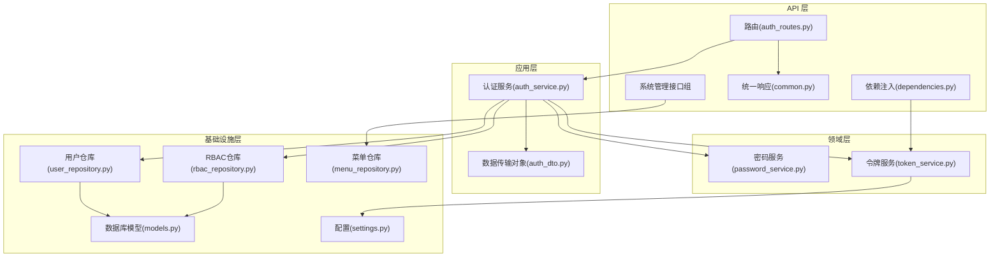
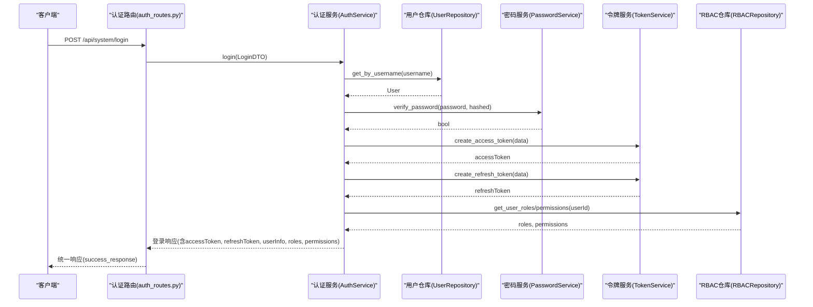
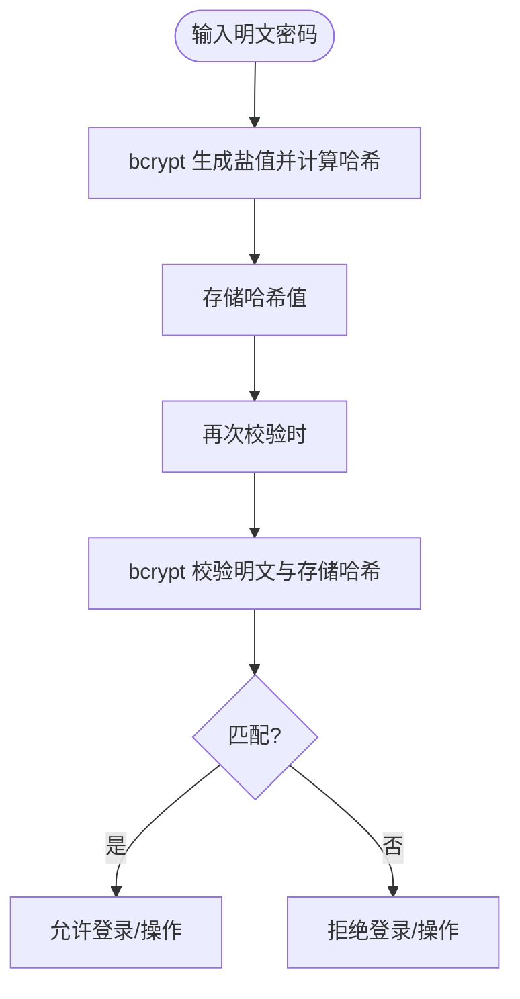
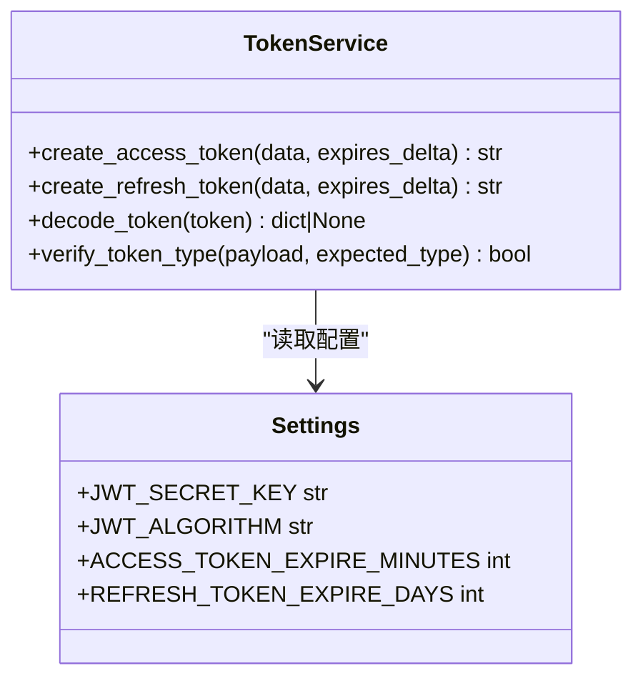
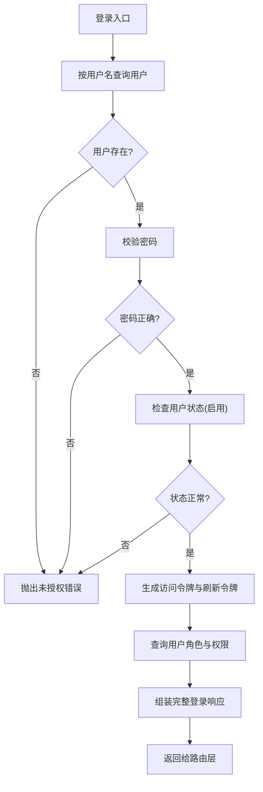
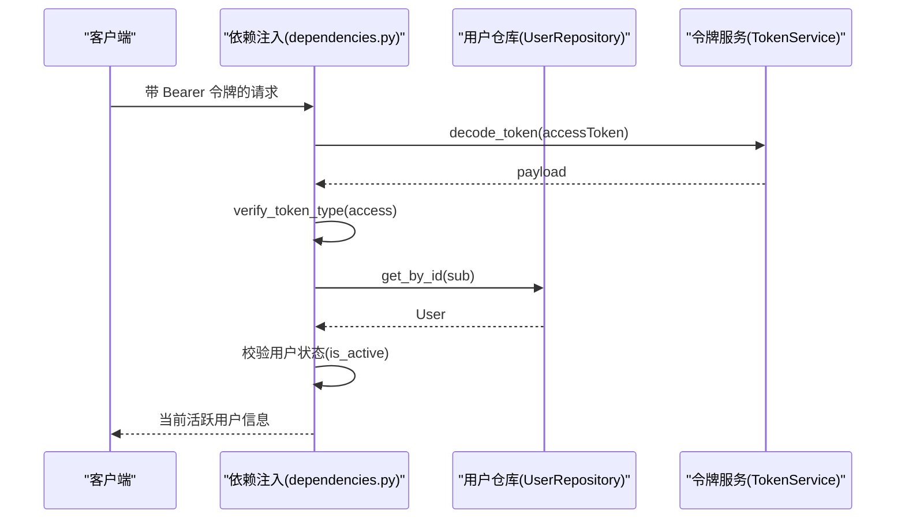
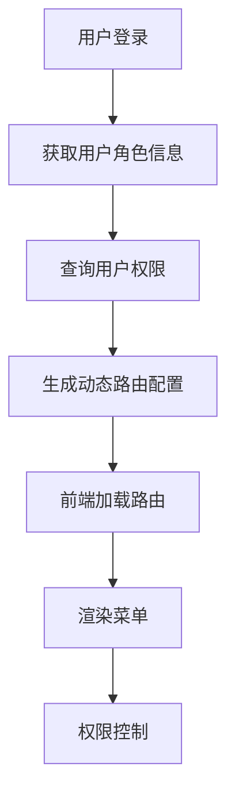
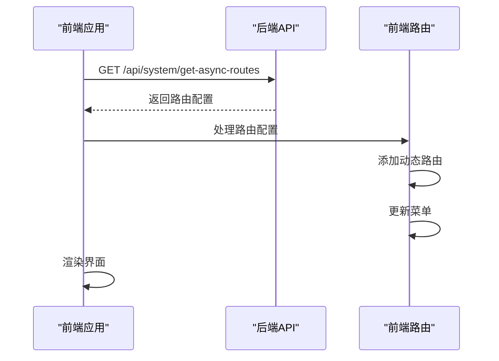
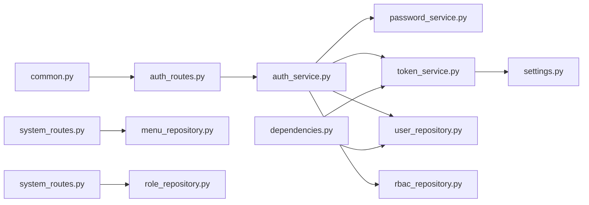

# 认证系统

<cite>
**本文引用的文件**
- [service/src/domain/auth/password_service.py](file://service/src/domain/auth/password_service.py)
- [service/src/domain/auth/token_service.py](file://service/src/domain/auth/token_service.py)
- [service/src/application/services/auth_service.py](file://service/src/application/services/auth_service.py)
- [service/src/api/v1/auth_routes.py](file://service/src/api/v1/auth_routes.py)
- [service/src/api/dependencies.py](file://service/src/api/dependencies.py)
- [service/src/application/dto/auth_dto.py](file://service/src/application/dto/auth_dto.py)
- [service/src/config/settings.py](file://service/src/config/settings.py)
- [service/src/infrastructure/repositories/user_repository.py](file://service/src/infrastructure/repositories/user_repository.py)
- [service/src/infrastructure/repositories/rbac_repository.py](file://service/src/infrastructure/repositories/rbac_repository.py)
- [service/src/infrastructure/database/models.py](file://service/src/infrastructure/database/models.py)
- [service/src/api/common.py](file://service/src/api/common.py)
- [service/tests/unit/test_auth.py](file://service/tests/unit/test_auth.py)
- [web/src/utils/auth.ts](file://web/src/utils/auth.ts)
- [web/mock/login.ts](file://web/mock/login.ts)
- [web/mock/refreshToken.ts](file://web/mock/refreshToken.ts)
- [web/src/store/modules/user.ts](file://web/src/store/modules/user.ts)
- [web/src/api/user.ts](file://web/src/api/user.ts)
- [web/src/api/system.ts](file://web/src/api/system.ts)
- [web/src/api/routes.ts](file://web/src/api/routes.ts)
- [web/src/router/utils.ts](file://web/src/router/utils.ts)
- [web/src/store/modules/permission.ts](file://web/src/store/modules/permission.ts)
- [web/mock/mine.ts](file://web/mock/mine.ts)
- [web/mock/system.ts](file://web/mock/system.ts)
- [service/pyproject.toml](file://service/pyproject.toml)
</cite>

## 更新摘要
**所做更改**
- 新增当前用户信息获取接口(/api/system/auth/mine)的详细说明
- 新增安全日志查询接口(/api/system/auth/mine-logs)的实现分析
- 新增动态路由配置接口(/api/system/auth/get-async-routes)的完整实现
- 新增系统管理工具接口组(/api/system/auth/list-all-role, /api/system/auth/role-menu等)的功能说明
- 完善基于角色的动态菜单生成机制
- 更新前端集成方案，包括动态路由加载和权限管理

## 目录
1. [简介](#简介)
2. [项目结构](#项目结构)
3. [核心组件](#核心组件)
4. [架构总览](#架构总览)
5. [详细组件分析](#详细组件分析)
6. [新增认证接口详解](#新增认证接口详解)
7. [动态路由与权限管理](#动态路由与权限管理)
8. [前端集成方案](#前端集成方案)
9. [依赖分析](#依赖分析)
10. [性能考量](#性能考量)
11. [故障排查指南](#故障排查指南)
12. [结论](#结论)
13. [附录](#附录)

## 简介
本文件系统性阐述 Hello-FastApi 的认证系统设计与实现，覆盖以下主题：
- JWT（JSON Web Token）认证机制：令牌生成、验证与刷新策略
- 密码安全机制：哈希算法、盐值处理与安全存储
- 用户认证流程：从登录到会话管理的完整过程
- 认证中间件与依赖注入的实现与配置
- **新增**：当前用户信息获取、安全日志查询、动态路由配置等增强功能
- **新增**：基于角色的动态菜单生成与系统管理工具接口
- 认证相关 API 接口文档与使用示例
- 安全性考虑与最佳实践
- 扩展与定制指导

## 项目结构
认证系统位于后端服务模块（service），采用分层架构（DDD + FastAPI）：
- 领域层：密码与令牌服务，负责核心安全逻辑
- 应用层：认证服务，编排业务流程
- 基础设施层：仓库与数据库模型，提供持久化能力
- API 层：路由与依赖，暴露 REST 接口并集成认证中间件
- 前端（web）：令牌存储、刷新与权限校验的前端配合

**图表来源**
- [service/src/api/v1/auth_routes.py:1-391](file://service/src/api/v1/auth_routes.py#L1-L391)
- [service/src/api/dependencies.py:1-72](file://service/src/api/dependencies.py#L1-L72)
- [service/src/api/common.py:1-88](file://service/src/api/common.py#L1-L88)
- [service/src/application/services/auth_service.py:1-164](file://service/src/application/services/auth_service.py#L1-L164)
- [service/src/application/dto/auth_dto.py:1-54](file://service/src/application/dto/auth_dto.py#L1-L54)
- [service/src/domain/auth/password_service.py:1-21](file://service/src/domain/auth/password_service.py#L1-L21)
- [service/src/domain/auth/token_service.py:1-45](file://service/src/domain/auth/token_service.py#L1-L45)
- [service/src/infrastructure/repositories/user_repository.py:1-185](file://service/src/infrastructure/repositories/user_repository.py#L1-L185)
- [service/src/infrastructure/repositories/rbac_repository.py:1-213](file://service/src/infrastructure/repositories/rbac_repository.py#L1-L213)
- [service/src/infrastructure/database/models.py:1-193](file://service/src/infrastructure/database/models.py#L1-L193)
- [service/src/config/settings.py:1-198](file://service/src/config/settings.py#L1-L198)

**章节来源**
- [service/src/api/v1/auth_routes.py:1-391](file://service/src/api/v1/auth_routes.py#L1-L391)
- [service/src/application/services/auth_service.py:1-164](file://service/src/application/services/auth_service.py#L1-L164)
- [service/src/domain/auth/password_service.py:1-21](file://service/src/domain/auth/password_service.py#L1-L21)
- [service/src/domain/auth/token_service.py:1-45](file://service/src/domain/auth/token_service.py#L1-L45)
- [service/src/infrastructure/repositories/user_repository.py:1-185](file://service/src/infrastructure/repositories/user_repository.py#L1-L185)
- [service/src/infrastructure/repositories/rbac_repository.py:1-213](file://service/src/infrastructure/repositories/rbac_repository.py#L1-L213)
- [service/src/infrastructure/database/models.py:1-193](file://service/src/infrastructure/database/models.py#L1-L193)
- [service/src/config/settings.py:1-198](file://service/src/config/settings.py#L1-L198)
- [service/src/api/common.py:1-88](file://service/src/api/common.py#L1-L88)

## 核心组件
- 密码服务：基于 bcrypt 的密码哈希与校验
- 令牌服务：基于 python-jose 的 JWT 编解码与类型校验
- 认证服务：登录、注册、刷新令牌的业务编排
- 路由与依赖：登录、注册、登出、刷新接口与访问令牌校验
- **新增**：系统管理接口组，包括角色管理、菜单权限查询等
- 数据传输对象：LoginDTO、RegisterDTO、RefreshTokenDTO、UserInfoDTO、TokenResponseDTO、LoginResponseDTO
- 配置：JWT 秘钥、算法、过期时间、Redis、CORS 等
- 仓库与模型：用户、角色、权限、用户-角色、角色-权限关联、菜单、IP 规则等

**章节来源**
- [service/src/domain/auth/password_service.py:1-21](file://service/src/domain/auth/password_service.py#L1-L21)
- [service/src/domain/auth/token_service.py:1-45](file://service/src/domain/auth/token_service.py#L1-L45)
- [service/src/application/services/auth_service.py:1-164](file://service/src/application/services/auth_service.py#L1-L164)
- [service/src/api/v1/auth_routes.py:1-391](file://service/src/api/v1/auth_routes.py#L1-L391)
- [service/src/api/dependencies.py:1-72](file://service/src/api/dependencies.py#L1-L72)
- [service/src/application/dto/auth_dto.py:1-54](file://service/src/application/dto/auth_dto.py#L1-L54)
- [service/src/config/settings.py:1-198](file://service/src/config/settings.py#L1-L198)
- [service/src/infrastructure/database/models.py:1-193](file://service/src/infrastructure/database/models.py#L1-L193)

## 架构总览
认证系统遵循"无状态"JWT设计：
- 客户端登录成功后获得 accessToken、refreshToken 与过期时间
- accessToken 用于后续受保护资源访问；refreshToken 用于刷新 accessToken
- 服务端不维护会话状态，仅依赖令牌内容与签名进行校验
- 前端负责本地存储与携带令牌（Cookie + localStorage）
- **新增**：支持基于角色的动态菜单生成和系统管理工具接口

**图表来源**
- [service/src/api/v1/auth_routes.py:23-38](file://service/src/api/v1/auth_routes.py#L23-L38)
- [service/src/application/services/auth_service.py:28-80](file://service/src/application/services/auth_service.py#L28-L80)
- [service/src/infrastructure/repositories/user_repository.py:41-46](file://service/src/infrastructure/repositories/user_repository.py#L41-L46)
- [service/src/domain/auth/password_service.py:18-20](file://service/src/domain/auth/password_service.py#L18-L20)
- [service/src/domain/auth/token_service.py:15-30](file://service/src/domain/auth/token_service.py#L15-L30)
- [service/src/infrastructure/repositories/rbac_repository.py:59-64](file://service/src/infrastructure/repositories/rbac_repository.py#L59-L64)

## 详细组件分析

### 密码安全机制
- 哈希算法：bcrypt
- 盐值处理：由 bcrypt 自动生成并内嵌在哈希结果中
- 存储策略：仅存储哈希值，不保存明文密码
- 校验流程：将输入明文与存储的哈希进行比对

**图表来源**
- [service/src/domain/auth/password_service.py:10-20](file://service/src/domain/auth/password_service.py#L10-L20)

**章节来源**
- [service/src/domain/auth/password_service.py:1-21](file://service/src/domain/auth/password_service.py#L1-L21)
- [service/tests/unit/test_auth.py:10-24](file://service/tests/unit/test_auth.py#L10-L24)

### JWT 令牌机制
- 令牌类型：
  - 访问令牌（access）：短期有效，用于访问受保护资源
  - 刷新令牌（refresh）：长期有效，用于换取新的访问令牌
- 生成策略：
  - 访问令牌：基于配置的过期分钟数
  - 刷新令牌：基于配置的过期天数
- 解码与验证：
  - 使用配置的算法与密钥进行解码
  - 校验令牌类型（access/refresh）
  - 提取载荷（payload）中的用户标识（sub）与用户名
- 刷新流程：
  - 使用有效的刷新令牌换取新的访问令牌与刷新令牌
  - 校验用户状态（启用）以确保安全

**图表来源**
- [service/src/domain/auth/token_service.py:11-45](file://service/src/domain/auth/token_service.py#L11-L45)
- [service/src/config/settings.py:63-67](file://service/src/config/settings.py#L63-L67)

**章节来源**
- [service/src/domain/auth/token_service.py:1-45](file://service/src/domain/auth/token_service.py#L1-L45)
- [service/src/config/settings.py:1-198](file://service/src/config/settings.py#L1-L198)
- [service/tests/unit/test_auth.py:30-67](file://service/tests/unit/test_auth.py#L30-L67)

### 认证服务（应用层）
- 登录：
  - 校验用户名与密码
  - 检查用户状态（启用）
  - 生成访问令牌与刷新令牌
  - 查询用户角色与权限
  - 返回包含用户信息、角色与权限的完整登录响应
- 注册：
  - 校验用户名唯一性
  - 对密码进行哈希
  - 创建启用状态的用户
- 刷新令牌：
  - 解码并校验刷新令牌类型
  - 校验用户存在且启用
  - 生成新的访问令牌与刷新令牌

**图表来源**
- [service/src/application/services/auth_service.py:28-80](file://service/src/application/services/auth_service.py#L28-L80)

**章节来源**
- [service/src/application/services/auth_service.py:1-164](file://service/src/application/services/auth_service.py#L1-L164)

### API 接口与使用示例
- 登录接口
  - 方法与路径：POST /api/system/login
  - 请求体：LoginDTO（username, password）
  - 成功响应：统一响应，data 包含 accessToken、expires、refreshToken、userInfo、roles、permissions
- 注册接口
  - 方法与路径：POST /api/system/register
  - 请求体：RegisterDTO（username, password, nickname, email, phone）
  - 成功响应：统一响应，data 包含新用户基本信息
- 刷新接口
  - 方法与路径：POST /api/system/refresh-token
  - 请求体：RefreshTokenDTO（refreshToken）
  - 成功响应：统一响应，data 包含新的 accessToken、expires、refreshToken
- 登出接口
  - 方法与路径：POST /api/system/logout
  - 说明：JWT 无状态认证，服务端无需特殊处理，客户端删除本地令牌即可
  - 成功响应：统一响应，message 为"登出成功"

**章节来源**
- [service/src/api/v1/auth_routes.py:23-89](file://service/src/api/v1/auth_routes.py#L23-L89)
- [service/src/api/common.py:45-47](file://service/src/api/common.py#L45-L47)

### 认证中间件与依赖注入
- 访问令牌依赖：
  - 通过 HTTP Bearer 方式获取 Authorization 凭据
  - 解码并校验令牌类型为 access
  - 提取用户标识（sub），并从数据库获取当前活跃用户
- 权限依赖：
  - require_permission(code)：校验用户是否拥有指定权限
  - require_superuser()：校验是否为超级用户
- 中间件：
  - 请求日志中间件：记录请求开始与结束、处理时间
  - IP 黑白名单中间件：基于配置的白/黑名单控制访问

**图表来源**
- [service/src/api/dependencies.py:16-42](file://service/src/api/dependencies.py#L16-L42)
- [service/src/domain/auth/token_service.py:33-39](file://service/src/domain/auth/token_service.py#L33-L39)
- [service/src/infrastructure/repositories/user_repository.py:37-42](file://service/src/infrastructure/repositories/user_repository.py#L37-L42)

**章节来源**
- [service/src/api/dependencies.py:1-72](file://service/src/api/dependencies.py#L1-L72)
- [service/src/core/middlewares.py:1-65](file://service/src/core/middlewares.py#L1-L65)

### 前端配合与令牌存储
- 令牌存储策略：
  - accessToken、expires、refreshToken 存入 Cookie（带过期时间）
  - 用户头像、用户名、昵称、角色、权限、refreshToken、expires 存入 localStorage
- 无感刷新：
  - 前端根据 expires 自动触发刷新流程，保证长期在线体验
- 权限校验：
  - 前端根据登录返回的 permissions 字段进行按钮级权限判断

**章节来源**
- [web/src/utils/auth.ts:1-142](file://web/src/utils/auth.ts#L1-L142)
- [web/mock/login.ts:1-45](file://web/mock/login.ts#L1-L45)
- [web/mock/refreshToken.ts:1-30](file://web/mock/refreshToken.ts#L1-L30)
- [web/src/store/modules/user.ts:1-128](file://web/src/store/modules/user.ts#L1-L128)

## 新增认证接口详解

### 当前用户信息获取接口
**接口功能**：获取当前登录用户的个人信息，包括头像、用户名、昵称、邮箱、电话等基础信息。

**接口定义**：
- 方法与路径：GET /api/system/mine
- 认证要求：需要有效的访问令牌
- 成功响应：统一响应格式，data 包含用户基础信息

**实现细节**：
- 通过依赖注入获取当前活跃用户信息
- 从用户仓库查询用户详细信息
- 返回标准化的用户信息结构

**章节来源**
- [service/src/api/v1/auth_routes.py:92-119](file://service/src/api/v1/auth_routes.py#L92-L119)
- [service/src/api/dependencies.py:32-42](file://service/src/api/dependencies.py#L32-L42)

### 安全日志查询接口
**接口功能**：获取当前用户的安全日志记录，支持分页查询。

**接口定义**：
- 方法与路径：GET /api/system/mine-logs
- 认证要求：需要有效的访问令牌
- 成功响应：统一响应格式，data 包含分页的日志列表

**实现细节**：
- 当前为 stub 实现，返回空列表
- 支持分页参数：pageSize、currentPage
- 日志字段包括：ip地址、地理位置、操作系统、浏览器、操作摘要、时间等

**章节来源**
- [service/src/api/v1/auth_routes.py:122-134](file://service/src/api/v1/auth_routes.py#L122-L134)

### 动态路由配置接口
**接口功能**：根据用户角色返回对应的动态路由配置，支持前端动态加载菜单。

**接口定义**：
- 方法与路径：GET /api/system/get-async-routes
- 认证要求：需要有效的访问令牌
- 成功响应：统一响应格式，data 包含路由配置数组

**路由配置结构**：
系统包含以下主要路由类别：

1. **系统管理路由**（path: /system）
   - 用户管理：/system/user/index（admin 角色）
   - 角色管理：/system/role/index（admin 角色）
   - 菜单管理：/system/menu/index（admin 角色）
   - 部门管理：/system/dept/index（admin 角色）

2. **系统监控路由**（path: /monitor）
   - 在线用户：/monitor/online-user（admin 角色）
   - 登录日志：/monitor/login-logs（admin 角色）
   - 操作日志：/monitor/operation-logs（admin 角色）
   - 系统日志：/monitor/system-logs（admin 角色）

3. **权限管理路由**（path: /permission）
   - 页面权限：/permission/page/index（admin, common 角色）
   - 按钮权限：支持权限按钮的细粒度控制

4. **外部页面路由**（path: /iframe）
   - 嵌入式文档：支持多个技术文档站点
   - 外部链接：支持纯文本链接

5. **标签页路由**（path: /tabs）
   - 基础标签页：/tabs/index
   - 查询详情标签页：/tabs/query-detail
   - 参数详情标签页：/tabs/params-detail/:id

**章节来源**
- [service/src/api/v1/auth_routes.py:137-292](file://service/src/api/v1/auth_routes.py#L137-L292)

### 系统管理工具接口组

#### 获取所有角色列表
**接口功能**：获取系统中所有角色的简单列表，用于用户管理中的角色分配。

**接口定义**：
- 方法与路径：GET /api/system/list-all-role
- 认证要求：需要有效的访问令牌
- 成功响应：统一响应格式，data 包含角色列表（id, name）

**章节来源**
- [service/src/api/v1/auth_routes.py:300-313](file://service/src/api/v1/auth_routes.py#L300-L313)

#### 根据用户ID获取角色ID列表
**接口功能**：根据用户ID获取该用户对应的角色ID列表。

**接口定义**：
- 方法与路径：POST /api/system/list-role-ids
- 请求体：{ "userId": 用户ID }
- 认证要求：需要有效的访问令牌
- 成功响应：统一响应格式，data 包含角色ID数组

**章节来源**
- [service/src/api/v1/auth_routes.py:316-333](file://service/src/api/v1/auth_routes.py#L316-L333)

#### 获取角色菜单权限树
**接口功能**：获取角色的菜单权限树形结构，用于角色权限分配。

**接口定义**：
- 方法与路径：POST /api/system/role-menu
- 认证要求：需要有效的访问令牌
- 成功响应：统一响应格式，data 包含菜单权限树列表

**菜单权限结构**：
- parentId：父级菜单ID
- id：菜单ID
- menuType：菜单类型（0-菜单, 1-iframe, 2-外链, 3-按钮）
- title：菜单标题

**章节来源**
- [service/src/api/v1/auth_routes.py:336-360](file://service/src/api/v1/auth_routes.py#L336-L360)

#### 根据角色ID获取菜单ID列表
**接口功能**：根据角色ID获取该角色已分配的菜单ID列表。

**接口定义**：
- 方法与路径：POST /api/system/role-menu-ids
- 请求体：{ "id": 角色ID }
- 认证要求：需要有效的访问令牌
- 成功响应：统一响应格式，data 包含菜单ID数组

**实现逻辑**：
- 超级管理员（id=1）：返回所有菜单ID
- 普通角色：返回空数组（待实现角色-菜单关联表）

**章节来源**
- [service/src/api/v1/auth_routes.py:363-390](file://service/src/api/v1/auth_routes.py#L363-L390)

## 动态路由与权限管理

### 基于角色的动态菜单生成
系统实现了完整的基于角色的动态菜单生成功能：

**图表来源**
- [service/src/api/v1/auth_routes.py:137-292](file://service/src/api/v1/auth_routes.py#L137-L292)
- [web/src/router/utils.ts:157-234](file://web/src/router/utils.ts#L157-L234)

### 路由配置特点
- **角色控制**：每个路由都包含角色权限标识
- **权限继承**：子路由自动继承父路由的权限
- **动态加载**：前端按需加载路由配置
- **缓存机制**：支持路由配置的本地缓存

### 权限管理机制
- **页面权限**：控制用户能否访问特定页面
- **按钮权限**：控制页面上按钮的显示和操作权限
- **菜单权限**：控制菜单项的显示和访问
- **超级管理员**：拥有所有权限的特殊角色

**章节来源**
- [service/src/api/v1/auth_routes.py:137-292](file://service/src/api/v1/auth_routes.py#L137-L292)
- [web/src/router/utils.ts:157-234](file://web/src/router/utils.ts#L157-L234)
- [web/src/store/modules/permission.ts:1-76](file://web/src/store/modules/permission.ts#L1-L76)

## 前端集成方案

### 动态路由加载流程
前端通过以下流程实现动态路由加载：

**图表来源**
- [web/src/api/routes.ts:9-10](file://web/src/api/routes.ts#L9-L10)
- [web/src/router/utils.ts:200-234](file://web/src/router/utils.ts#L200-L234)

### 前端接口集成
- **用户信息接口**：`getMine()` 用于获取当前用户信息
- **安全日志接口**：`getMineLogs()` 用于获取安全日志
- **动态路由接口**：`getAsyncRoutes()` 用于获取路由配置
- **系统管理接口**：`getAllRoleList()`, `getRoleIds()`, `getRoleMenu()`, `getRoleMenuIds()`

**章节来源**
- [web/src/api/user.ts:85-93](file://web/src/api/user.ts#L85-L93)
- [web/src/api/system.ts:29-87](file://web/src/api/system.ts#L29-L87)
- [web/src/api/routes.ts:9-10](file://web/src/api/routes.ts#L9-L10)

### 状态管理集成
- **用户状态**：在 Pinia store 中存储用户信息和权限
- **路由状态**：管理动态路由的加载和缓存
- **权限状态**：维护菜单权限和页面权限状态

**章节来源**
- [web/src/store/modules/user.ts:19-127](file://web/src/store/modules/user.ts#L19-L127)
- [web/src/store/modules/permission.ts:14-76](file://web/src/store/modules/permission.ts#L14-L76)

## 依赖分析
- 外部依赖：
  - FastAPI、SQLModel、aiosqlite/asyncpg、pydantic-settings、python-jose、bcrypt、redis、loguru、httpx
- 内部依赖：
  - 认证服务依赖密码服务、令牌服务、用户仓库、RBAC 仓库
  - 路由依赖认证服务与统一响应
  - 依赖注入依赖令牌服务与仓库
  - 配置为令牌服务与中间件提供参数
  - **新增**：系统管理接口依赖菜单仓库和角色仓库

**图表来源**
- [service/src/api/v1/auth_routes.py:1-391](file://service/src/api/v1/auth_routes.py#L1-L391)
- [service/src/application/services/auth_service.py:1-164](file://service/src/application/services/auth_service.py#L1-L164)
- [service/src/domain/auth/password_service.py:1-21](file://service/src/domain/auth/password_service.py#L1-L21)
- [service/src/domain/auth/token_service.py:1-45](file://service/src/domain/auth/token_service.py#L1-L45)
- [service/src/infrastructure/repositories/user_repository.py:1-185](file://service/src/infrastructure/repositories/user_repository.py#L1-L185)
- [service/src/infrastructure/repositories/rbac_repository.py:1-213](file://service/src/infrastructure/repositories/rbac_repository.py#L1-L213)
- [service/src/api/dependencies.py:1-72](file://service/src/api/dependencies.py#L1-L72)
- [service/src/api/common.py:1-88](file://service/src/api/common.py#L1-L88)
- [service/src/config/settings.py:1-198](file://service/src/config/settings.py#L1-L198)

**章节来源**
- [service/pyproject.toml:7-20](file://service/pyproject.toml#L7-L20)

## 性能考量
- 令牌生成与校验为 CPU 密集型但开销较小，可忽略不计
- bcrypt 哈希成本可控，建议在生产环境使用足够强度的密码策略
- JWT 无状态特性降低服务端会话存储压力，适合水平扩展
- **新增**：动态路由配置支持本地缓存，减少重复请求
- **新增**：系统管理接口支持分页查询，避免大数据量传输
- 建议开启 Redis 作为缓存（如需实现黑名单/限流），结合连接池优化数据库访问
- 对高频接口启用合理的过期时间与刷新策略，减少频繁鉴权开销

## 故障排查指南
- 常见错误与定位
  - 未授权/无效令牌：检查令牌是否过期、类型是否为 access、签名是否正确
  - 用户不存在/被禁用：确认用户状态与数据库一致性
  - 密码错误：确认 bcrypt 校验流程与存储哈希一致性
  - 刷新失败：确认刷新令牌有效、用户状态正常
  - **新增**：动态路由加载失败：检查用户角色权限和路由配置
  - **新增**：系统管理接口异常：确认角色权限和数据库连接
- 单元测试参考
  - 密码服务：哈希生成、正确/错误密码校验
  - 令牌服务：访问/刷新令牌生成、解码、类型校验
  - **新增**：认证服务：用户信息获取、安全日志查询、动态路由生成

**章节来源**
- [service/tests/unit/test_auth.py:1-68](file://service/tests/unit/test_auth.py#L1-L68)

## 结论
本认证系统以 bcrypt 与 JWT 为核心，结合清晰的分层架构与严格的依赖注入，实现了安全、可扩展的认证能力。**本次更新增强了系统的实用性和可维护性**，新增的当前用户信息获取、安全日志查询、动态路由配置和系统管理工具接口，使得系统具备了完整的后台管理能力。通过基于角色的动态菜单生成和完善的权限控制，系统既满足了用户体验需求，又保证了安全性。建议在生产环境中强化密钥管理、启用 HTTPS、实施速率限制与审计日志，并定期轮换密钥。

## 附录

### 新增 API 接口一览

#### 用户信息相关接口
- **当前用户信息**
  - 方法：GET
  - 路径：/api/system/mine
  - 认证：需要访问令牌
  - 响应：统一响应，data 包含用户基础信息
- **安全日志查询**
  - 方法：GET
  - 路径：/api/system/mine-logs
  - 认证：需要访问令牌
  - 响应：统一响应，data 包含分页日志列表

#### 动态路由相关接口
- **动态路由配置**
  - 方法：GET
  - 路径：/api/system/get-async-routes
  - 认证：需要访问令牌
  - 响应：统一响应，data 包含路由配置数组

#### 系统管理工具接口
- **获取所有角色列表**
  - 方法：GET
  - 路径：/api/system/list-all-role
  - 认证：需要访问令牌
  - 响应：统一响应，data 包含角色列表
- **根据用户ID获取角色ID列表**
  - 方法：POST
  - 路径：/api/system/list-role-ids
  - 认证：需要访问令牌
  - 请求体：{ "userId": 用户ID }
  - 响应：统一响应，data 包含角色ID数组
- **获取角色菜单权限树**
  - 方法：POST
  - 路径：/api/system/role-menu
  - 认证：需要访问令牌
  - 响应：统一响应，data 包含菜单权限树
- **根据角色ID获取菜单ID列表**
  - 方法：POST
  - 路径：/api/system/role-menu-ids
  - 认证：需要访问令牌
  - 请求体：{ "id": 角色ID }
  - 响应：统一响应，data 包含菜单ID数组

**章节来源**
- [service/src/api/v1/auth_routes.py:92-134](file://service/src/api/v1/auth_routes.py#L92-L134)
- [service/src/api/v1/auth_routes.py:137-292](file://service/src/api/v1/auth_routes.py#L137-L292)
- [service/src/api/v1/auth_routes.py:300-390](file://service/src/api/v1/auth_routes.py#L300-L390)

### 安全性最佳实践
- 强制 HTTPS 传输，防止令牌在传输过程中泄露
- 严格管理 JWT 密钥，定期轮换，避免硬编码在代码中
- 合理设置过期时间：access_token 短期、refresh_token 较长
- 实施速率限制与账户锁定策略，防范暴力破解
- 审计与日志：记录登录、登出、令牌刷新等关键事件
- 前端安全：避免在 URL 中暴露令牌；使用 HttpOnly Cookie 存储敏感令牌
- **新增**：动态路由权限控制，防止越权访问
- **新增**：系统管理接口的细粒度权限控制

### 扩展与定制指导
- 新增认证方式：可在应用层新增服务方法，并在路由层添加接口
- 自定义权限模型：扩展 RBAC 仓库与模型，支持更复杂的权限组合
- 集成第三方登录：在认证服务中接入 OAuth/SSO 流程
- 令牌黑名单：结合 Redis 实现失效令牌的快速检测
- 多设备登录：引入设备指纹与会话管理，支持踢人或并发会话控制
- **新增**：动态路由扩展：根据用户角色动态生成菜单和权限配置
- **新增**：系统管理接口扩展：支持更多管理功能和权限控制
- 前端状态管理：增强 Pinia store 的 token 管理和权限缓存机制

### 前端集成改进
- 令牌存储优化：采用 Cookie + localStorage 的双重存储策略
- 无感刷新机制：基于过期时间自动触发刷新流程
- 权限校验增强：支持按钮级权限和页面级权限的精细化控制
- **新增**：动态路由加载：支持基于角色的菜单动态生成
- **新增**：系统管理界面：集成角色管理、菜单管理等功能
- 单点登录支持：提供简化的 SSO 集成方案
- 状态持久化：支持多标签页的登录状态保持

**章节来源**
- [web/src/utils/auth.ts:1-142](file://web/src/utils/auth.ts#L1-L142)
- [web/src/store/modules/user.ts:1-128](file://web/src/store/modules/user.ts#L1-L128)
- [web/mock/login.ts:1-45](file://web/mock/login.ts#L1-L45)
- [web/mock/refreshToken.ts:1-30](file://web/mock/refreshToken.ts#L1-L30)
- [web/src/api/user.ts:85-93](file://web/src/api/user.ts#L85-L93)
- [web/src/api/system.ts:29-87](file://web/src/api/system.ts#L29-L87)
- [web/src/api/routes.ts:9-10](file://web/src/api/routes.ts#L9-L10)
- [web/src/router/utils.ts:157-234](file://web/src/router/utils.ts#L157-L234)