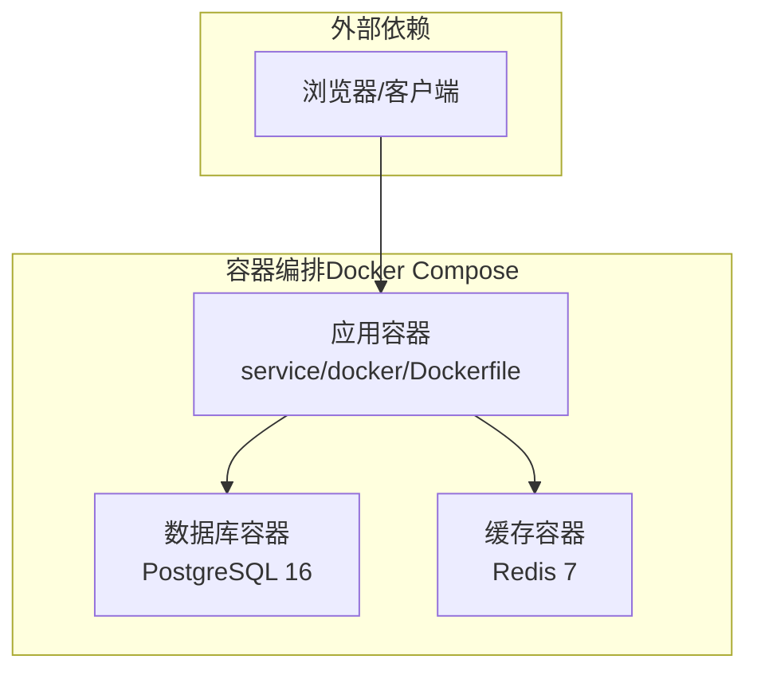
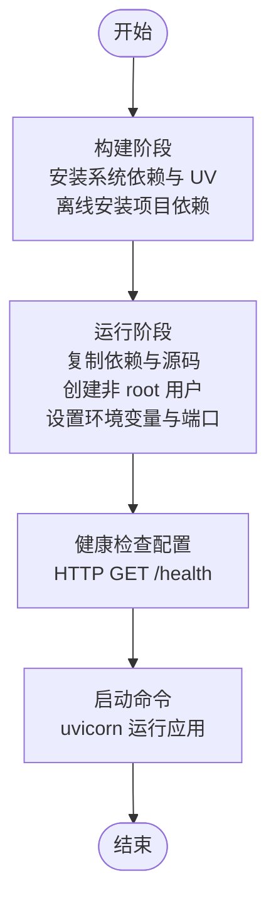
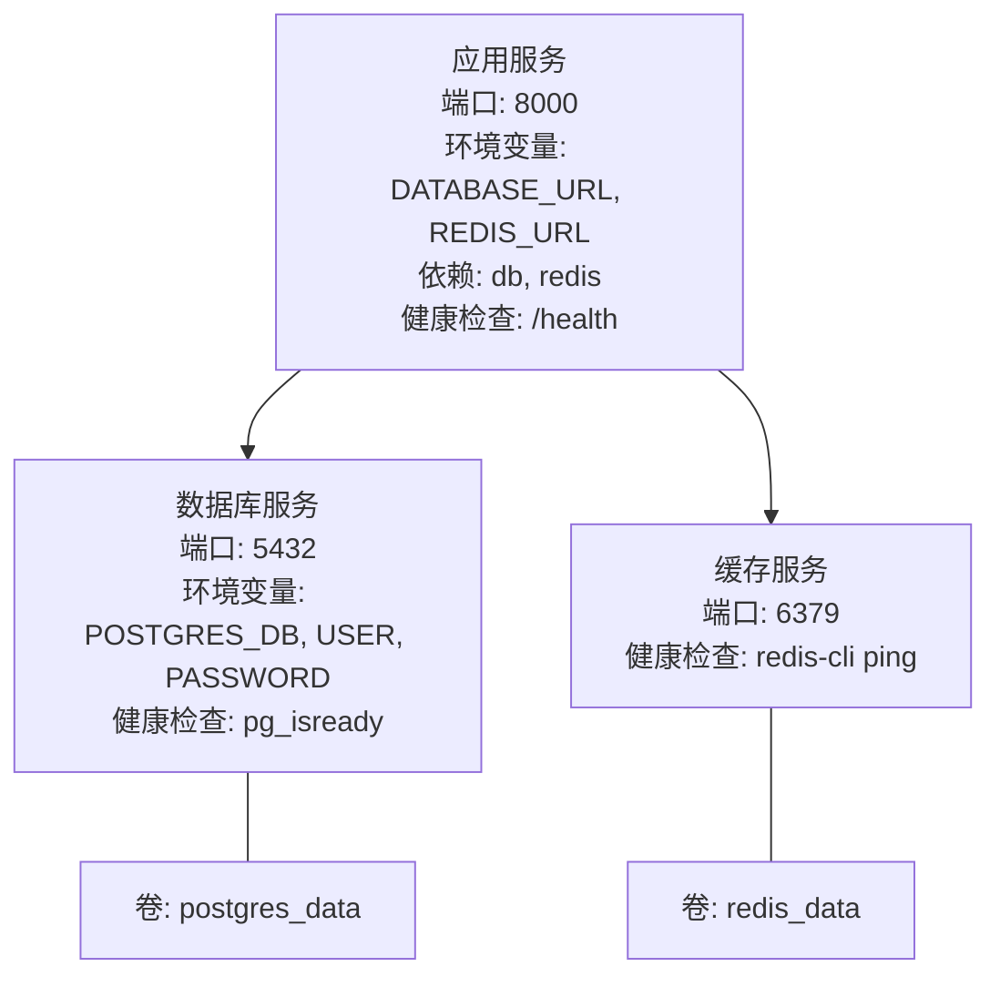
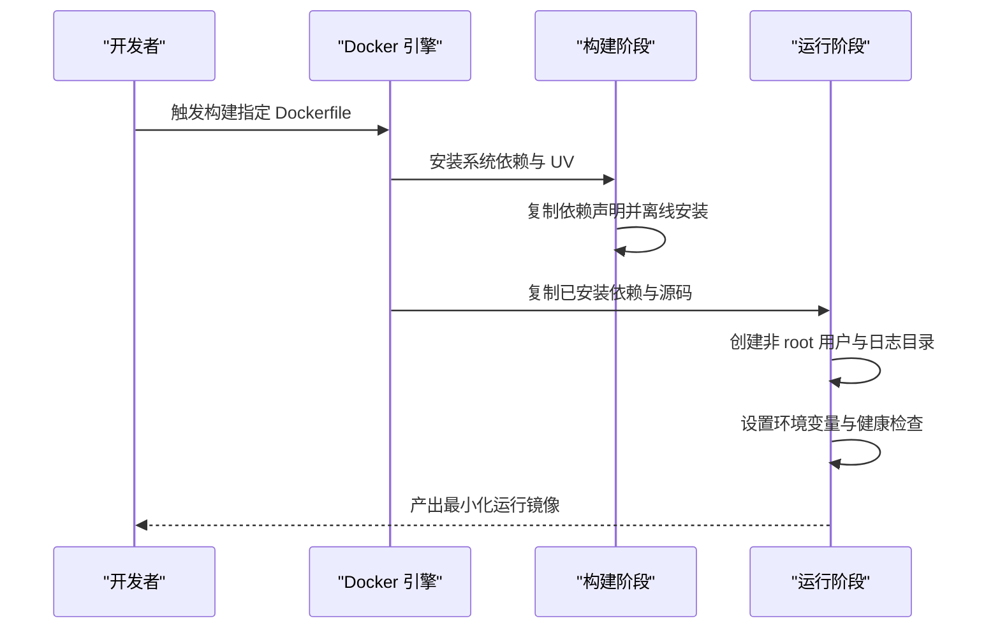
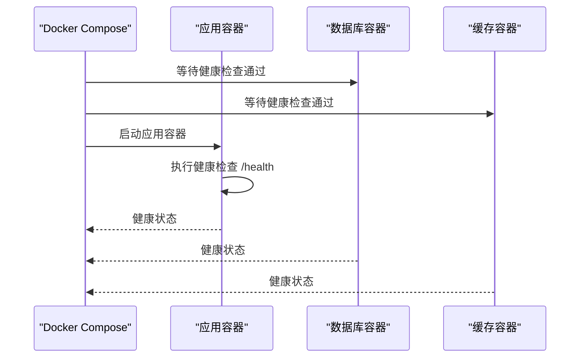
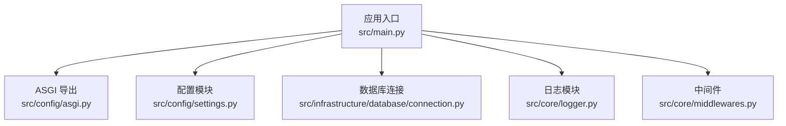

# Docker 容器化部署

<cite>
**本文引用的文件**
- [service\docker\Dockerfile](file://service/docker/Dockerfile)
- [service\docker\docker-compose.yml](file://service/docker/docker-compose.yml)
- [web\Dockerfile](file://web/Dockerfile)
- [service\pyproject.toml](file://service/pyproject.toml)
- [service\src\main.py](file://service/src/main.py)
- [service\src\config\settings.py](file://service/src/config/settings.py)
- [service\src\config\asgi.py](file://service/src/config/asgi.py)
- [service\src\infrastructure\database\connection.py](file://service/src/infrastructure/database/connection.py)
- [service\src\core\logger.py](file://service/src/core/logger.py)
- [service\src\core\middlewares.py](file://service/src/core/middlewares.py)
- [service\README.md](file://service/README.md)
- [.env.example](file://service/.env.example)
</cite>

## 目录
1. [简介](#简介)
2. [项目结构](#项目结构)
3. [核心组件](#核心组件)
4. [架构总览](#架构总览)
5. [详细组件分析](#详细组件分析)
6. [依赖关系分析](#依赖关系分析)
7. [性能考量](#性能考量)
8. [故障排除指南](#故障排除指南)
9. [结论](#结论)
10. [附录](#附录)

## 简介
本文件面向 Hello-FastApi 项目的容器化部署，围绕多阶段 Dockerfile 构建策略、Docker Compose 服务编排、镜像构建与依赖管理、安全加固、容器启动参数与环境变量、健康检查机制、本地与生产部署策略、容器间通信与数据持久化、日志收集、监控与故障排除等方面进行系统性说明。目标是帮助读者在本地开发与生产环境中快速、稳定地部署该 FastAPI 应用及其依赖服务。

## 项目结构
Hello-FastApi 项目包含两套 Docker 配置：
- 后端服务（FastAPI）：位于 service/docker，提供多阶段构建与 Compose 编排。
- 前端静态资源（Web）：位于 web，提供 Nginx 静态托管的多阶段构建。

```mermaid
graph TB
subgraph "后端服务FastAPI"
S_Dockerfile["service/docker/Dockerfile"]
S_Compose["service/docker/docker-compose.yml"]
S_Main["service/src/main.py"]
S_Settings["service/src/config/settings.py"]
S_Asgi["service/src/config/asgi.py"]
S_DBConn["service/src/infrastructure/database/connection.py"]
S_Logger["service/src/core/logger.py"]
S_MW["service/src/core/middlewares.py"]
end
subgraph "前端Web"
W_Dockerfile["web/Dockerfile"]
end
S_Compose --> S_Dockerfile
S_Compose --> S_Main
S_Compose --> S_Settings
S_Compose --> S_DBConn
S_Compose --> S_Logger
S_Compose --> S_MW
S_Compose --> S_Asgi
W_Dockerfile -.-> "Nginx 静态托管"
```

图表来源
- [service\docker\docker-compose.yml:1-65](file://service/docker/docker-compose.yml#L1-L65)
- [service\docker\Dockerfile:1-58](file://service/docker/Dockerfile#L1-L58)
- [service\src\main.py:1-96](file://service/src/main.py#L1-L96)
- [service\src\config\settings.py:1-198](file://service/src/config/settings.py#L1-L198)
- [service\src\config\asgi.py:1-6](file://service/src/config/asgi.py#L1-L6)
- [service\src\infrastructure\database\connection.py:1-35](file://service/src/infrastructure/database/connection.py#L1-L35)
- [service\src\core\logger.py:1-117](file://service/src/core/logger.py#L1-L117)
- [service\src\core\middlewares.py:1-65](file://service/src/core/middlewares.py#L1-L65)
- [web\Dockerfile:1-20](file://web/Dockerfile#L1-L20)

章节来源
- [service\docker\docker-compose.yml:1-65](file://service/docker/docker-compose.yml#L1-L65)
- [service\docker\Dockerfile:1-58](file://service/docker/Dockerfile#L1-L58)
- [web\Dockerfile:1-20](file://web/Dockerfile#L1-L20)

## 核心组件
- 多阶段 Dockerfile（后端）
  - 构建阶段使用 slim 基础镜像与 UV 包管理器，离线安装项目依赖，减少镜像体积。
  - 运行阶段以最小化基础镜像为基础，复制已安装依赖与源码，创建非 root 用户并切换执行，暴露端口，配置健康检查与启动命令。
- Docker Compose 编排
  - 定义三个服务：后端应用、PostgreSQL 数据库、Redis 缓存；声明依赖健康检查、端口映射、卷挂载与重启策略。
- 应用配置与运行
  - FastAPI 应用通过 ASGI 入口导出，内置健康检查端点；配置文件支持多环境加载与日志、CORS、限流等参数。
- 前端静态资源
  - 使用 Node.js 构建产物，通过 Nginx 静态托管，暴露 80 端口。

章节来源
- [service\docker\Dockerfile:1-58](file://service/docker/Dockerfile#L1-L58)
- [service\docker\docker-compose.yml:1-65](file://service/docker/docker-compose.yml#L1-L65)
- [service\src\config\asgi.py:1-6](file://service/src/config/asgi.py#L1-L6)
- [service\src\main.py:84-87](file://service/src/main.py#L84-L87)
- [web\Dockerfile:1-20](file://web/Dockerfile#L1-L20)

## 架构总览
下图展示容器化部署的整体架构：后端应用容器依赖数据库与缓存容器，Compose 统一编排；前端容器独立部署并通过反向代理或直接访问后端 API。



图表来源
- [service\docker\docker-compose.yml:3-65](file://service/docker/docker-compose.yml#L3-L65)
- [service\docker\Dockerfile:24-58](file://service/docker/Dockerfile#L24-L58)

## 详细组件分析

### 多阶段 Dockerfile 构建策略与优化
- 构建阶段
  - 基于 slim 基础镜像，安装必要系统工具，使用 UV 安装项目依赖，确保后续运行阶段仅携带运行时所需包。
- 运行阶段
  - 再次基于 slim 基础镜像，复制构建阶段生成的依赖与可执行文件，复制源码并设置日志目录权限。
  - 创建非 root 用户组与用户，切换执行，降低攻击面。
  - 设置环境变量（禁用字节码写入、缓冲输出），暴露端口，配置健康检查，使用 Uvicorn 启动应用。
- 优化要点
  - 分离构建与运行阶段，显著减小最终镜像体积。
  - 使用 UV 与离线安装，提升依赖安装效率与一致性。
  - 非 root 用户运行，增强安全性。
  - 健康检查与启动参数明确，便于编排与运维。



图表来源
- [service\docker\Dockerfile:4-58](file://service/docker/Dockerfile#L4-L58)

章节来源
- [service\docker\Dockerfile:1-58](file://service/docker/Dockerfile#L1-L58)
- [service\pyproject.toml:1-76](file://service/pyproject.toml#L1-L76)

### Docker Compose 配置详解
- 服务定义
  - 应用服务：基于后端 Dockerfile 构建，端口映射 8000:8000，注入环境变量（应用环境、数据库与缓存地址），依赖数据库与缓存健康就绪，挂载日志目录，配置健康检查与重启策略。
  - 数据库服务：PostgreSQL 16，设置数据库名、用户与密码，端口映射 5432:5432，持久化数据卷，健康检查使用 pg_isready。
  - 缓存服务：Redis 7，端口映射 6379:6379，持久化数据卷，健康检查使用 redis-cli ping。
- 网络与存储
  - 未显式声明 networks，默认使用 bridge 网络互通；通过服务名进行容器间 DNS 解析（如 DATABASE_URL 使用 db:5432）。
  - 使用命名卷 postgres_data 与 redis_data 实现数据持久化。
- 重启策略
  - unless-stopped，保证容器异常退出后自动重启。



图表来源
- [service\docker\docker-compose.yml:3-65](file://service/docker/docker-compose.yml#L3-L65)

章节来源
- [service\docker\docker-compose.yml:1-65](file://service/docker/docker-compose.yml#L1-L65)

### 容器镜像构建流程与依赖管理
- 构建流程
  - 构建阶段：安装系统依赖与 UV，复制项目依赖声明，离线安装依赖。
  - 运行阶段：复制依赖与源码，设置非 root 用户与日志目录，设置环境变量，暴露端口，配置健康检查，启动应用。
- 依赖管理
  - 项目使用 pyproject.toml 声明依赖，Dockerfile 通过 UV 安装依赖，确保镜像内依赖与项目一致。
  - 依赖安装采用离线模式，减少网络不确定性与构建时间。



图表来源
- [service\docker\Dockerfile:4-58](file://service/docker/Dockerfile#L4-L58)
- [service\pyproject.toml:1-76](file://service/pyproject.toml#L1-L76)

章节来源
- [service\docker\Dockerfile:1-58](file://service/docker/Dockerfile#L1-L58)
- [service\pyproject.toml:1-76](file://service/pyproject.toml#L1-L76)

### 安全加固措施
- 非 root 用户运行
  - 运行阶段创建专用用户组与用户，并在容器启动前切换执行，降低权限风险。
- 环境变量与敏感信息
  - 通过环境变量注入数据库与缓存地址、密钥等敏感信息，避免硬编码。
  - 建议在生产环境使用更安全的密钥管理方案（如外部密钥服务或编排平台的密文管理）。
- 健康检查
  - 应用与数据库、缓存均配置健康检查，便于编排层进行故障检测与恢复。
- 网络与访问控制
  - 建议在生产环境限制容器对外暴露端口，结合反向代理与防火墙策略。

章节来源
- [service\docker\Dockerfile:29-43](file://service/docker/Dockerfile#L29-L43)
- [service\docker\docker-compose.yml:11-19](file://service/docker/docker-compose.yml#L11-L19)
- [service\src\config\settings.py:46-107](file://service/src/config/settings.py#L46-L107)

### 容器启动参数、环境变量与健康检查
- 启动参数
  - Uvicorn 启动命令包含主机、端口与工作进程数，确保容器内监听 0.0.0.0 并暴露 8000 端口。
- 环境变量
  - 应用环境（APP_ENV）、数据库连接串（DATABASE_URL）、缓存连接串（REDIS_URL）等通过 Compose 注入。
  - 配置模块支持多环境加载，优先级为：系统环境变量 > 环境配置文件 > 通用 .env > 默认值。
- 健康检查
  - 应用健康检查：HTTP GET /health。
  - 数据库健康检查：pg_isready。
  - 缓存健康检查：redis-cli ping。

章节来源
- [service\docker\Dockerfile:52-57](file://service/docker/Dockerfile#L52-L57)
- [service\docker\docker-compose.yml:23-28](file://service/docker/docker-compose.yml#L23-L28)
- [service\src\main.py:84-87](file://service/src/main.py#L84-L87)
- [service\src\config\settings.py:144-198](file://service/src/config/settings.py#L144-L198)

### 本地开发与生产环境部署策略
- 本地开发
  - 使用 Compose 启动应用、数据库与缓存，挂载日志目录以便本地查看；数据库与缓存使用本地持久化卷。
- 生产环境
  - 建议使用反向代理（如 Nginx/Gunicorn）承载应用，结合负载均衡与证书管理；数据库与缓存建议使用云服务或独立高可用集群。
  - 将敏感配置移至外部密钥管理或编排平台的密文管理，避免明文注入。

章节来源
- [service\docker\docker-compose.yml:1-65](file://service/docker/docker-compose.yml#L1-L65)
- [service\README.md:240-254](file://service/README.md#L240-L254)

### 容器间通信、数据持久化与日志收集
- 容器间通信
  - 通过服务名进行 DNS 解析（如 db、redis），应用容器通过 DATABASE_URL 与 REDIS_URL 访问数据库与缓存。
- 数据持久化
  - 数据库与缓存分别使用命名卷（postgres_data、redis_data）持久化数据，避免容器重建导致数据丢失。
- 日志收集
  - 应用日志目录挂载到宿主机 logs 目录，便于采集与分析；应用内部使用 loguru 输出到控制台与文件，支持轮转与压缩。

章节来源
- [service\docker\docker-compose.yml:20-21](file://service/docker/docker-compose.yml#L20-L21)
- [service\docker\docker-compose.yml:39-40](file://service/docker/docker-compose.yml#L39-L40)
- [service\docker\docker-compose.yml:53-54](file://service/docker/docker-compose.yml#L53-L54)
- [service\docker\Dockerfile:39-40](file://service/docker/Dockerfile#L39-L40)
- [service\src\core\logger.py:32-72](file://service/src/core/logger.py#L32-L72)

### 健康检查与可用性保障
- 应用健康检查
  - 提供 /health 端点，返回应用状态与版本信息；Compose 与 Dockerfile 均配置健康检查，确保编排层能及时发现异常。
- 数据库与缓存健康检查
  - 数据库使用 pg_isready，缓存使用 redis-cli ping，确保依赖服务可用后再启动应用。



图表来源
- [service\docker\docker-compose.yml:15-19](file://service/docker/docker-compose.yml#L15-L19)
- [service\docker\docker-compose.yml:23-28](file://service/docker/docker-compose.yml#L23-L28)
- [service\docker\docker-compose.yml:41-45](file://service/docker/docker-compose.yml#L41-L45)
- [service\docker\docker-compose.yml:55-59](file://service/docker/docker-compose.yml#L55-L59)
- [service\src\main.py:84-87](file://service/src/main.py#L84-L87)

## 依赖关系分析
- 应用与配置
  - 应用通过 ASGI 入口导出，配置模块负责多环境加载与参数校验，数据库连接模块负责引擎创建与会话管理，中间件负责请求日志与访问控制，日志模块负责统一输出。
- Compose 与应用
  - Compose 通过环境变量注入数据库与缓存地址，依赖服务健康检查，挂载日志目录，重启策略确保稳定性。



图表来源
- [service\src\main.py:1-96](file://service/src/main.py#L1-L96)
- [service\src\config\asgi.py:1-6](file://service/src/config/asgi.py#L1-L6)
- [service\src\config\settings.py:1-198](file://service/src/config/settings.py#L1-L198)
- [service\src\infrastructure\database\connection.py:1-35](file://service/src/infrastructure/database/connection.py#L1-L35)
- [service\src\core\logger.py:1-117](file://service/src/core/logger.py#L1-L117)
- [service\src\core\middlewares.py:1-65](file://service/src/core/middlewares.py#L1-L65)

章节来源
- [service\src\main.py:1-96](file://service/src/main.py#L1-L96)
- [service\src\config\asgi.py:1-6](file://service/src/config/asgi.py#L1-L6)
- [service\src\config\settings.py:1-198](file://service/src/config/settings.py#L1-L198)
- [service\src\infrastructure\database\connection.py:1-35](file://service/src/infrastructure/database/connection.py#L1-L35)
- [service\src\core\logger.py:1-117](file://service/src/core/logger.py#L1-L117)
- [service\src\core\middlewares.py:1-65](file://service/src/core/middlewares.py#L1-L65)

## 性能考量
- 多阶段构建与最小化运行镜像，降低启动与运行时资源占用。
- 使用 UV 进行依赖安装，提升安装速度与一致性。
- 非 root 用户运行与健康检查，有助于编排层进行快速故障恢复。
- 建议在生产环境结合反向代理与负载均衡，进一步提升吞吐与可用性。

## 故障排除指南
- 健康检查失败
  - 检查应用 /health 端点是否可达；确认数据库与缓存服务健康检查通过；查看容器日志定位问题。
- 数据库连接失败
  - 核对 DATABASE_URL 是否正确（主机名、端口、数据库名、凭据）；确认数据库容器已健康且网络连通。
- 缓存连接失败
  - 核对 REDIS_URL 是否正确；确认缓存容器已健康且网络连通。
- 日志无法收集
  - 确认日志目录已挂载到宿主机；检查应用日志输出级别与文件轮转配置。
- 端口冲突
  - 修改 Compose 中的端口映射，避免与宿主机或其他容器冲突。

章节来源
- [service\docker\docker-compose.yml:11-19](file://service/docker/docker-compose.yml#L11-L19)
- [service\docker\docker-compose.yml:23-28](file://service/docker/docker-compose.yml#L23-L28)
- [service\docker\docker-compose.yml:41-45](file://service/docker/docker-compose.yml#L41-L45)
- [service\docker\docker-compose.yml:55-59](file://service/docker/docker-compose.yml#L55-L59)
- [service\src\main.py:84-87](file://service/src/main.py#L84-L87)
- [service\src\core\logger.py:32-72](file://service/src/core/logger.py#L32-L72)

## 结论
通过多阶段 Dockerfile 与 Compose 编排，Hello-FastApi 实现了高效、安全、可维护的容器化部署。结合健康检查、数据持久化与日志收集，能够在本地与生产环境中稳定运行。建议在生产环境进一步引入反向代理、密钥管理与监控告警体系，以满足更高的可靠性与可观测性需求。

## 附录
- 环境变量模板参考
  - 示例模板包含应用配置、服务器配置、数据库与缓存配置、JWT 配置、CORS、限流与日志级别等键位，可据此创建 .env.production 等环境配置文件。
- 前端静态资源镜像
  - Web 侧使用 Node.js 构建产物并通过 Nginx 静态托管，适合与后端服务共同编排部署。

章节来源
- [.env.example:1-63](file://service/.env.example#L1-L63)
- [web\Dockerfile:1-20](file://web/Dockerfile#L1-L20)