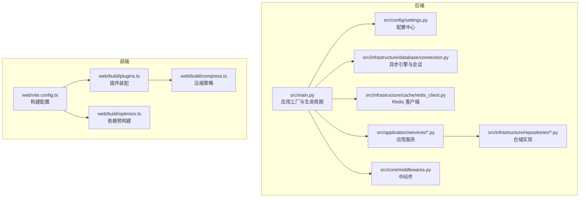
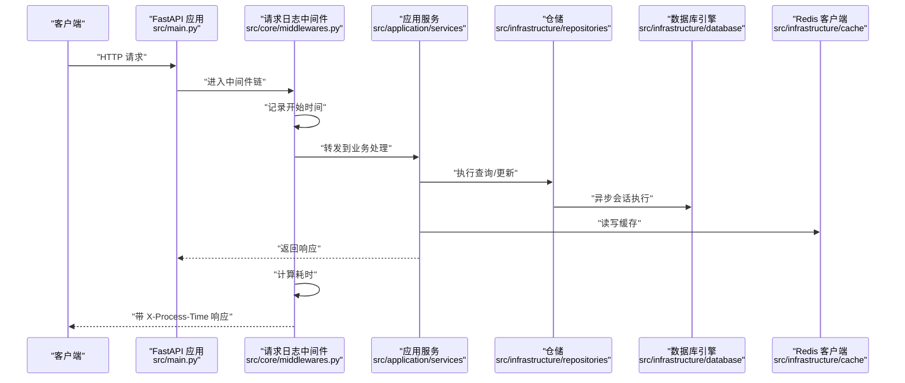
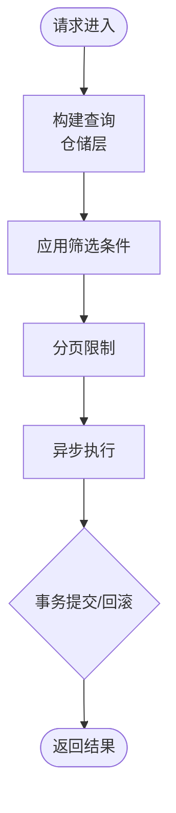
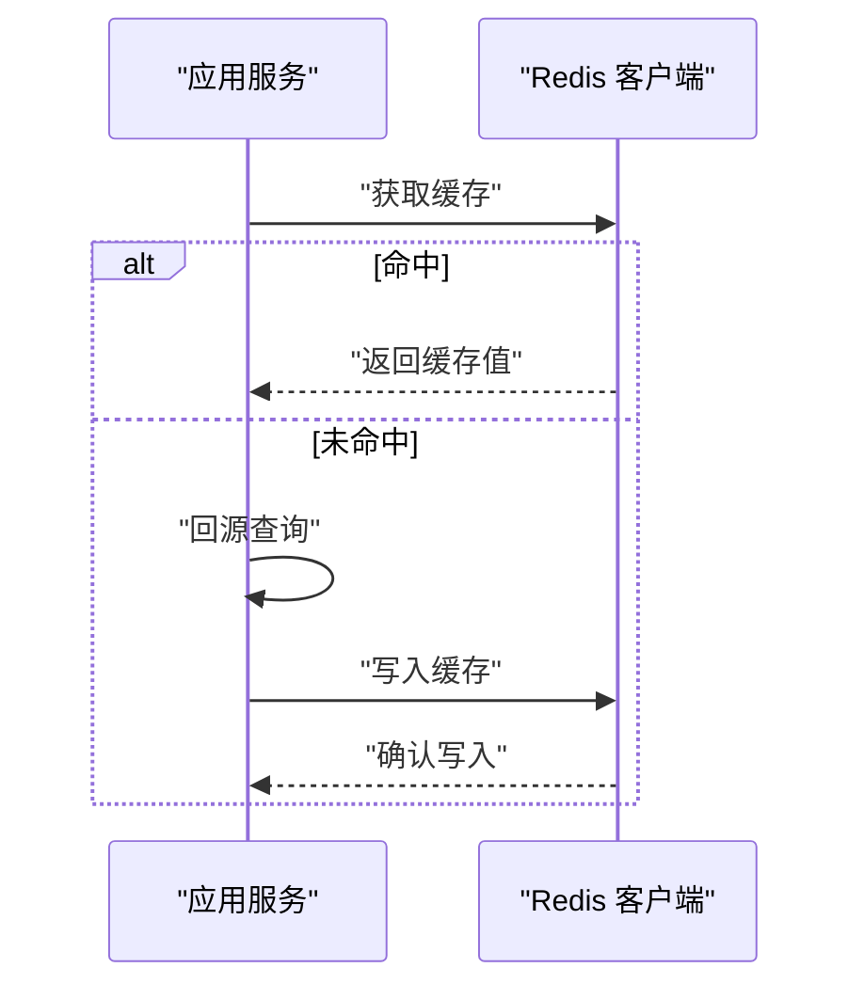
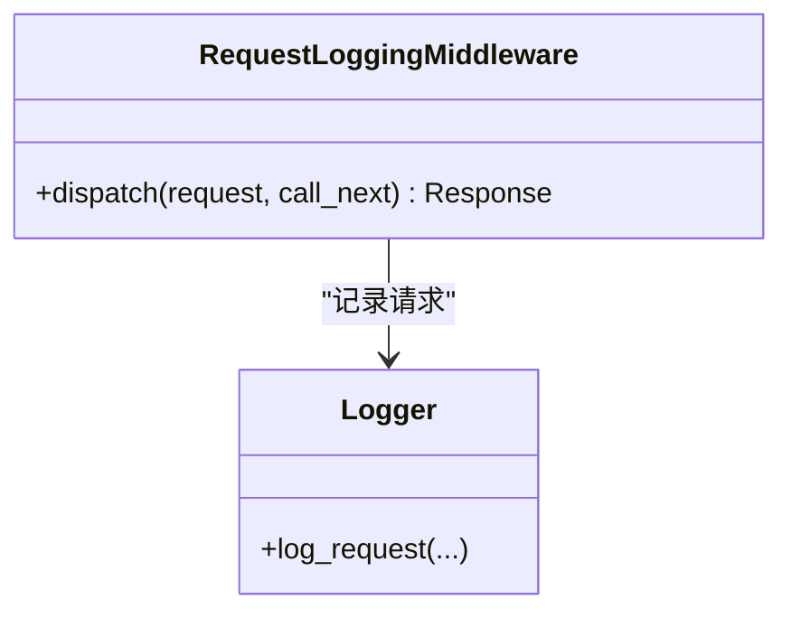
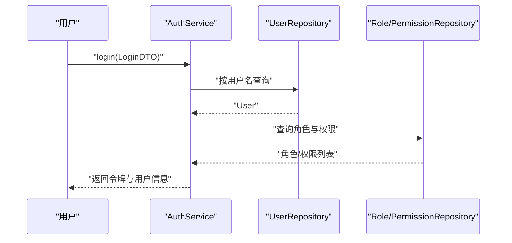
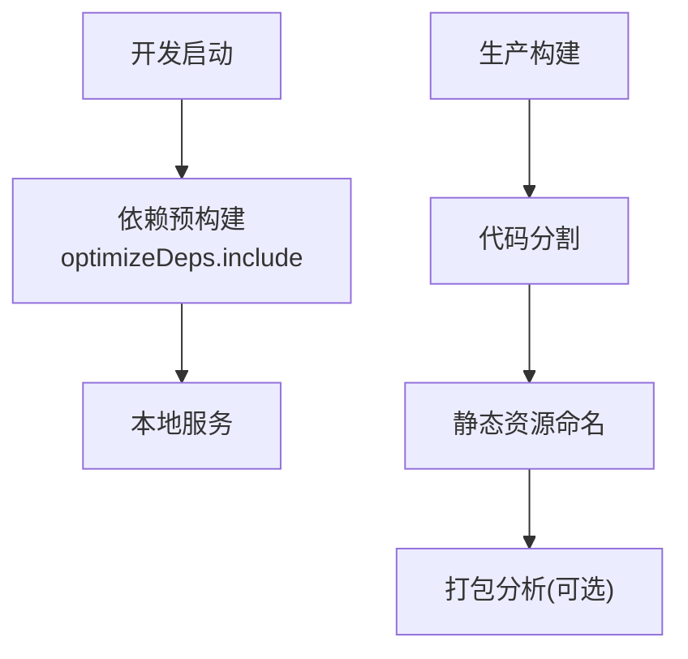
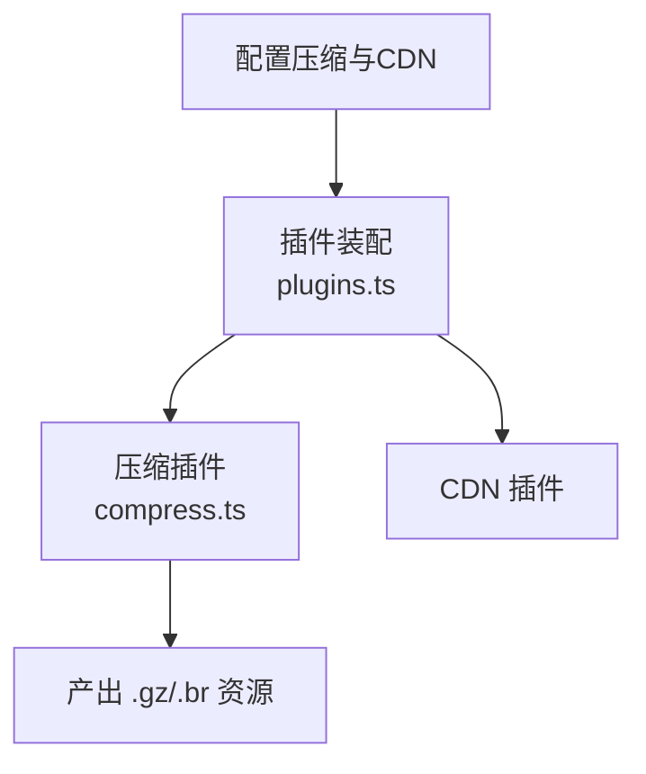
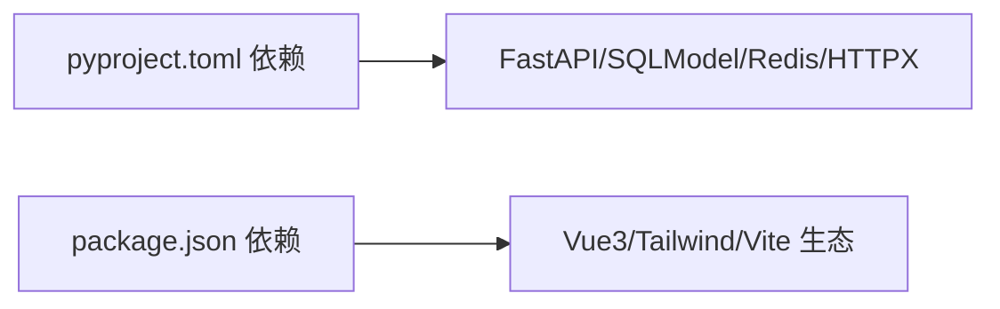

# 性能优化与调优

<cite>
**本文引用的文件**
- [pyproject.toml](file://service/pyproject.toml)
- [package.json](file://web/package.json)
- [settings.py](file://service/src/config/settings.py)
- [asgi.py](file://service/src/config/asgi.py)
- [main.py](file://service/src/main.py)
- [middlewares.py](file://service/src/core/middlewares.py)
- [connection.py](file://service/src/infrastructure/database/connection.py)
- [redis_client.py](file://service/src/infrastructure/cache/redis_client.py)
- [auth_service.py](file://service/src/application/services/auth_service.py)
- [user_repository.py](file://service/src/infrastructure/repositories/user_repository.py)
- [vite.config.ts](file://web/vite.config.ts)
- [plugins.ts](file://web/build/plugins.ts)
- [compress.ts](file://web/build/compress.ts)
- [optimize.ts](file://web/build/optimize.ts)
</cite>

## 目录
1. [简介](#简介)
2. [项目结构](#项目结构)
3. [核心组件](#核心组件)
4. [架构总览](#架构总览)
5. [详细组件分析](#详细组件分析)
6. [依赖关系分析](#依赖关系分析)
7. [性能考量](#性能考量)
8. [故障排查指南](#故障排查指南)
9. [结论](#结论)
10. [附录](#附录)

## 简介
本文件面向 Hello-FastApi 项目的性能优化与调优，覆盖后端（FastAPI + SQLModel + Redis）与前端（Vite + Vue3）的优化策略。内容包括数据库查询优化、缓存策略与连接池配置、前端代码分割与资源压缩、异步与并发优化、内存与垃圾回收、CDN 与静态资源优化、负载均衡与水平扩展、性能测试与基准测试、常见瓶颈识别与诊断等。

## 项目结构
- 后端采用 FastAPI + DDD 分层，配置通过 Pydantic Settings 管理，数据库使用 SQLModel 异步引擎，缓存使用 Redis。
- 前端基于 Vite + Vue3，构建期插件化配置，支持压缩、CDN、打包分析等能力。

图表来源
- [main.py:1-96](file://service/src/main.py#L1-L96)
- [settings.py:1-198](file://service/src/config/settings.py#L1-L198)
- [connection.py:1-35](file://service/src/infrastructure/database/connection.py#L1-L35)
- [redis_client.py:1-24](file://service/src/infrastructure/cache/redis_client.py#L1-L24)
- [middlewares.py:1-65](file://service/src/core/middlewares.py#L1-L65)
- [vite.config.ts:1-67](file://web/vite.config.ts#L1-L67)
- [plugins.ts:1-77](file://web/build/plugins.ts#L1-L77)
- [compress.ts:1-64](file://web/build/compress.ts#L1-L64)
- [optimize.ts:1-65](file://web/build/optimize.ts#L1-L65)

章节来源
- [main.py:1-96](file://service/src/main.py#L1-L96)
- [settings.py:1-198](file://service/src/config/settings.py#L1-L198)
- [vite.config.ts:1-67](file://web/vite.config.ts#L1-L67)

## 核心组件
- 配置中心：集中管理数据库、Redis、CORS、限流、日志等级等，支持多环境加载与缓存。
- 数据库层：异步引擎 + 会话依赖注入；提供初始化与关闭钩子。
- 缓存层：Redis 客户端单例管理，支持关闭释放。
- 中间件：请求日志中间件记录耗时与状态，便于性能观测。
- 应用服务：认证服务等业务逻辑封装，依赖仓储与领域服务。
- 前端构建：Vite 插件体系，支持压缩、CDN、依赖预构建与打包分析。

章节来源
- [settings.py:41-108](file://service/src/config/settings.py#L41-L108)
- [connection.py:9-21](file://service/src/infrastructure/database/connection.py#L9-L21)
- [redis_client.py:10-23](file://service/src/infrastructure/cache/redis_client.py#L10-L23)
- [middlewares.py:12-39](file://service/src/core/middlewares.py#L12-L39)
- [auth_service.py:15-74](file://service/src/application/services/auth_service.py#L15-L74)
- [vite.config.ts:12-66](file://web/vite.config.ts#L12-L66)
- [plugins.ts:17-76](file://web/build/plugins.ts#L17-L76)

## 架构总览
后端通过 ASGI 应用对外提供 API，中间件统一记录请求耗时；数据库与缓存通过依赖注入在请求生命周期内复用；前端通过 Vite 构建，按需启用压缩与 CDN，提升首屏与传输效率。

图表来源
- [main.py:34-92](file://service/src/main.py#L34-L92)
- [middlewares.py:12-39](file://service/src/core/middlewares.py#L12-L39)
- [auth_service.py:26-74](file://service/src/application/services/auth_service.py#L26-L74)
- [user_repository.py:17-25](file://service/src/infrastructure/repositories/user_repository.py#L17-L25)
- [connection.py:12-21](file://service/src/infrastructure/database/connection.py#L12-L21)
- [redis_client.py:10-15](file://service/src/infrastructure/cache/redis_client.py#L10-L15)

## 详细组件分析

### 后端性能组件

#### 数据库查询与连接池优化
- 异步引擎与会话：使用 SQLModel 异步引擎，配合依赖注入提供会话，减少同步阻塞。
- 连接池与健康检查：开启 pre_ping 提升连接可用性，结合 lifespan 初始化与关闭确保资源回收。
- 查询优化建议：
  - 使用仓储层的精确字段查询替代全量扫描，避免 N+1 查询。
  - 对高频查询建立合适索引（如用户名、邮箱、主键）。
  - 分页查询使用 limit+offset，避免一次性拉取大量数据。
  - 复杂统计使用原生聚合查询，减少 ORM 层开销。

图表来源
- [user_repository.py:32-75](file://service/src/infrastructure/repositories/user_repository.py#L32-L75)
- [connection.py:9-21](file://service/src/infrastructure/database/connection.py#L9-L21)

章节来源
- [connection.py:9-21](file://service/src/infrastructure/database/connection.py#L9-L21)
- [user_repository.py:32-75](file://service/src/infrastructure/repositories/user_repository.py#L32-L75)

#### 缓存策略与连接管理
- 单例 Redis 客户端：延迟创建与全局复用，避免频繁握手。
- 生命周期关闭：在应用关闭时主动释放连接，防止资源泄漏。
- 缓存命中路径：热点数据优先读缓存，写操作采用“先删后写”或“写后失效”策略，保证一致性与性能平衡。

图表来源
- [redis_client.py:10-23](file://service/src/infrastructure/cache/redis_client.py#L10-L23)

章节来源
- [redis_client.py:10-23](file://service/src/infrastructure/cache/redis_client.py#L10-L23)

#### 中间件与请求耗时观测
- 请求日志中间件记录方法、路径、状态码与耗时，并在响应头附加处理时间，便于前端与运维侧观测。
- 建议结合日志级别与采样策略，在生产环境控制日志量。

图表来源
- [middlewares.py:12-39](file://service/src/core/middlewares.py#L12-L39)

章节来源
- [middlewares.py:12-39](file://service/src/core/middlewares.py#L12-L39)

#### 应用服务与并发
- 认证服务：登录流程包含密码校验、角色与权限查询、令牌签发，建议对用户信息与权限进行缓存，降低重复查询成本。
- 并发优化：FastAPI 默认异步，建议将 IO 密集型操作（数据库、缓存、外部接口）保持异步，避免阻塞事件循环。

图表来源
- [auth_service.py:26-74](file://service/src/application/services/auth_service.py#L26-L74)
- [user_repository.py:17-25](file://service/src/infrastructure/repositories/user_repository.py#L17-L25)

章节来源
- [auth_service.py:26-74](file://service/src/application/services/auth_service.py#L26-L74)
- [user_repository.py:17-25](file://service/src/infrastructure/repositories/user_repository.py#L17-L25)

### 前端性能组件

#### 构建与代码分割
- 依赖预构建：通过 optimizeDeps.include 将常用第三方库预编译为 ESM，减少首次加载等待。
- 输出命名：静态资源按类型分类打包，减小缓存失效范围。
- 打包分析：在 report 脚本下启用可视化分析，定位大包与重复依赖。

图表来源
- [vite.config.ts:35-59](file://web/vite.config.ts#L35-L59)
- [optimize.ts:7-56](file://web/build/optimize.ts#L7-L56)

章节来源
- [vite.config.ts:35-59](file://web/vite.config.ts#L35-L59)
- [optimize.ts:7-56](file://web/build/optimize.ts#L7-L56)

#### 资源压缩与传输优化
- 压缩策略：支持 gzip/brotli 双通道，按阈值与文件类型过滤，可选择保留或删除原始文件。
- CDN 集成：通过插件开关启用，将静态资源指向 CDN，降低源站压力并提升全球访问速度。

图表来源
- [plugins.ts:17-76](file://web/build/plugins.ts#L17-L76)
- [compress.ts:5-63](file://web/build/compress.ts#L5-L63)

章节来源
- [plugins.ts:17-76](file://web/build/plugins.ts#L17-L76)
- [compress.ts:5-63](file://web/build/compress.ts#L5-L63)

#### 懒加载与按需加载
- 组件与路由：建议将重型组件与路由按需加载，减少首屏 JS 体积。
- 图标与 SVG：通过图标按需加载插件，仅打包使用到的图标，降低包体。

章节来源
- [plugins.ts:60-66](file://web/build/plugins.ts#L60-L66)

## 依赖关系分析
- 后端依赖：FastAPI、SQLModel、aiosqlite/asyncpg、redis、httpx、loguru 等。
- 前端依赖：Vue3、Element Plus、Vite、TailwindCSS、各类生态插件与构建工具。

图表来源
- [pyproject.toml:7-20](file://service/pyproject.toml#L7-L20)
- [package.json:49-114](file://web/package.json#L49-L114)

章节来源
- [pyproject.toml:7-20](file://service/pyproject.toml#L7-L20)
- [package.json:49-114](file://web/package.json#L49-L114)

## 性能考量

### 数据库查询优化
- 使用仓储层精确查询，避免 SELECT * 与 N+1。
- 对高频字段建立索引，合理使用 LIMIT/OFFSET。
- 复用会话与事务，减少连接开销。

章节来源
- [user_repository.py:32-75](file://service/src/infrastructure/repositories/user_repository.py#L32-L75)
- [connection.py:9-21](file://service/src/infrastructure/database/connection.py#L9-L21)

### 缓存策略
- 热点数据缓存：用户资料、菜单树、权限清单等。
- 写策略：先删后写或写后失效，避免脏读。
- 过期策略：结合业务设置 TTL，定期清理过期键。

章节来源
- [redis_client.py:10-23](file://service/src/infrastructure/cache/redis_client.py#L10-L23)

### 异步与并发
- 保持异步：数据库、缓存、外部接口均使用异步客户端。
- 限流与熔断：结合配置中心限流参数与中间件实现速率控制。
- 并发连接：数据库连接池与 Redis 连接池按并发峰值配置。

章节来源
- [settings.py:77-79](file://service/src/config/settings.py#L77-L79)
- [middlewares.py:12-39](file://service/src/core/middlewares.py#L12-L39)

### 内存与垃圾回收
- 后端：合理使用 lifespan 管理资源，避免全局对象常驻。
- 前端：Vite 构建脚本设置最大堆内存参数，避免 OOM；按需加载与懒编译降低峰值内存。

章节来源
- [main.py:19-32](file://service/src/main.py#L19-L32)
- [package.json:7-9](file://web/package.json#L7-L9)

### CDN 与静态资源优化
- CDN：启用 CDN 插件，将静态资源指向 CDN，提升全球访问速度。
- 压缩：开启 gzip/brotli 压缩，减少传输体积。
- 缓存：静态资源采用强缓存策略，版本化文件名避免缓存污染。

章节来源
- [plugins.ts:67-68](file://web/build/plugins.ts#L67-L68)
- [compress.ts:5-63](file://web/build/compress.ts#L5-L63)
- [vite.config.ts:49-54](file://web/vite.config.ts#L49-L54)

### 负载均衡与水平扩展
- 应用层：多副本部署，结合反向代理实现请求分发。
- 数据层：数据库读写分离、缓存集群化，提升吞吐与可用性。
- 无状态设计：确保会话与状态尽量外置（Redis），便于横向扩容。

章节来源
- [asgi.py:1-6](file://service/src/config/asgi.py#L1-L6)
- [settings.py:57-61](file://service/src/config/settings.py#L57-L61)

### 性能测试与基准测试
- 工具：Locust、k6、Artillery 等压测工具；Vite 报告分析定位体积问题。
- 指标：P50/P95/P99 延迟、吞吐、错误率、缓存命中率、数据库慢查询数。
- 方法：分阶段压测（起步、峰值、稳定性），逐步放大并发与数据规模。

章节来源
- [vite.config.ts:72-74](file://web/vite.config.ts#L72-L74)

### 常见瓶颈与解决方案
- 数据库慢查询：索引缺失、锁竞争、大事务；优化 SQL、拆分查询、使用缓存。
- 缓存穿透/击穿：布隆过滤器、互斥锁、热点永不过期。
- 前端白屏/卡顿：首屏资源过大、未做代码分割；启用预构建与懒加载。
- GC 抖动：对象频繁分配、闭包持有；优化数据结构与生命周期。

章节来源
- [user_repository.py:32-75](file://service/src/infrastructure/repositories/user_repository.py#L32-L75)
- [optimize.ts:7-56](file://web/build/optimize.ts#L7-L56)

### 监控指标与诊断
- 后端：请求耗时（X-Process-Time）、错误率、数据库连接数、Redis 命中率。
- 前端：首屏时间、TTFB、资源体积、打包报告。
- 诊断：结合日志与指标定位异常，逐步缩小范围至具体模块或查询。

章节来源
- [middlewares.py:12-39](file://service/src/core/middlewares.py#L12-L39)
- [vite.config.ts:72-74](file://web/vite.config.ts#L72-L74)

## 故障排查指南
- 启动/关闭异常：检查 lifespan 初始化与关闭流程，确保数据库与缓存正确释放。
- 请求超时：查看中间件耗时与慢查询日志，定位瓶颈模块。
- 缓存异常：核对连接串、TTL 与序列化格式，确认写入/读取路径。
- 构建失败：检查插件配置与 Node 版本要求，清理缓存后重试。

章节来源
- [main.py:19-32](file://service/src/main.py#L19-L32)
- [middlewares.py:12-39](file://service/src/core/middlewares.py#L12-L39)
- [redis_client.py:18-23](file://service/src/infrastructure/cache/redis_client.py#L18-L23)
- [package.json:177-180](file://web/package.json#L177-L180)

## 结论
通过合理的数据库查询与索引、缓存策略与连接池配置、异步与并发优化、前端代码分割与资源压缩、以及完善的监控与压测体系，Hello-FastApi 可在高并发场景下保持稳定与高性能。建议持续迭代：以监控驱动优化，以压测保障稳定性，并结合业务增长趋势动态调整资源配置。

## 附录
- 配置中心：多环境配置与缓存，便于在不同环境快速切换与优化。
- ASGI 入口：标准化生产部署入口，便于容器化与云平台集成。

章节来源
- [settings.py:144-198](file://service/src/config/settings.py#L144-L198)
- [asgi.py:1-6](file://service/src/config/asgi.py#L1-L6)