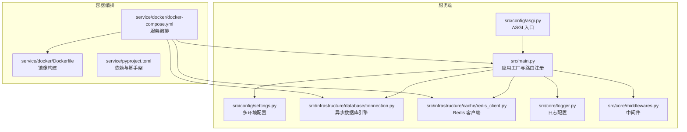
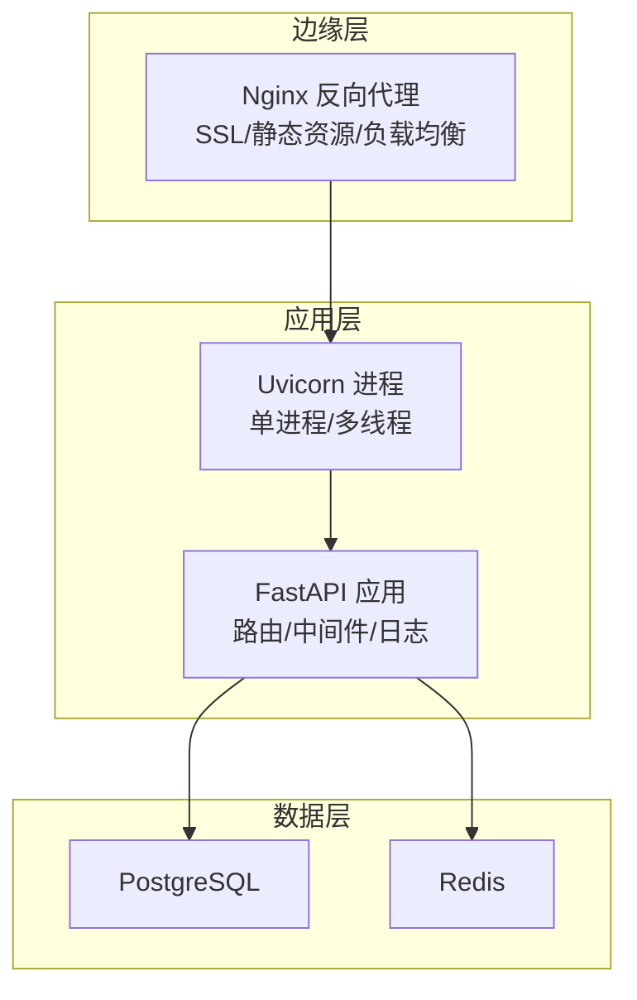
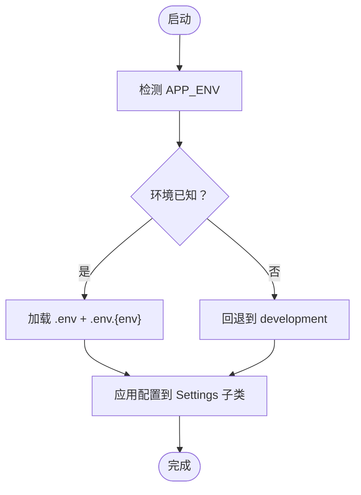
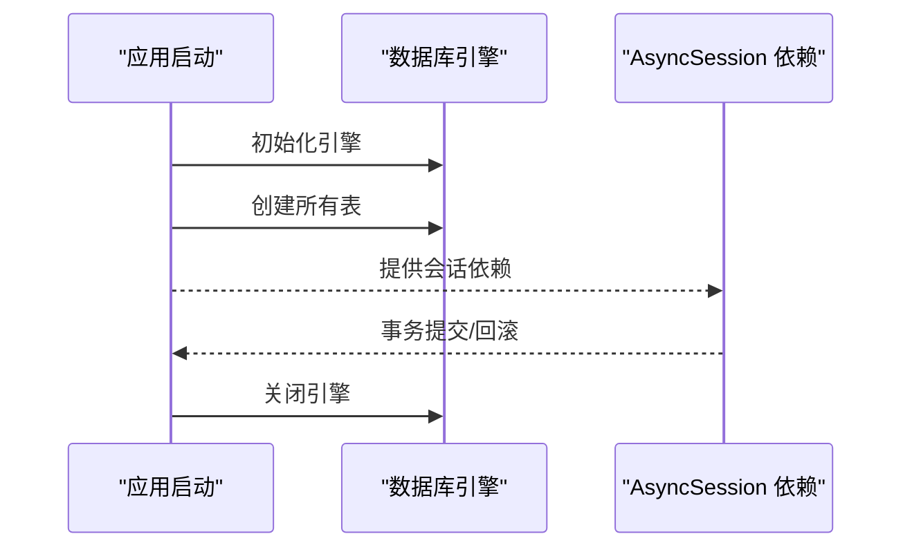
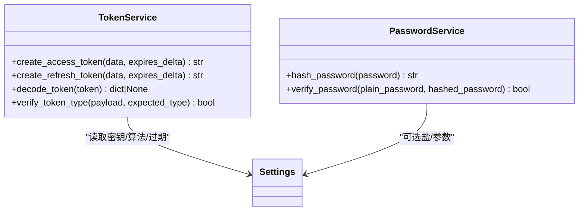
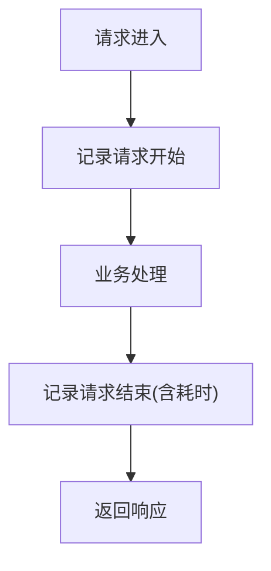
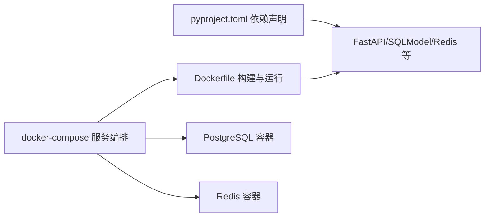

# 生产环境配置

<cite>
**本文引用的文件**
- [settings.py](file://service/src/config/settings.py)
- [asgi.py](file://service/src/config/asgi.py)
- [Dockerfile](file://service/docker/Dockerfile)
- [docker-compose.yml](file://service/docker/docker-compose.yml)
- [pyproject.toml](file://service/pyproject.toml)
- [connection.py](file://service/src/infrastructure/database/connection.py)
- [redis_client.py](file://service/src/infrastructure/cache/redis_client.py)
- [main.py](file://service/src/main.py)
- [middlewares.py](file://service/src/core/middlewares.py)
- [logger.py](file://service/src/core/logger.py)
- [auth_routes.py](file://service/src/api/v1/auth_routes.py)
- [password_service.py](file://service/src/domain/auth/password_service.py)
- [token_service.py](file://service/src/domain/auth/token_service.py)
</cite>

## 目录
1. [简介](#简介)
2. [项目结构](#项目结构)
3. [核心组件](#核心组件)
4. [架构总览](#架构总览)
5. [详细组件分析](#详细组件分析)
6. [依赖分析](#依赖分析)
7. [性能考虑](#性能考虑)
8. [故障排查指南](#故障排查指南)
9. [结论](#结论)
10. [附录](#附录)

## 简介
本文件面向生产环境部署，围绕 Hello-FastApi 的多环境配置、反向代理与 WSGI 部署、数据库与缓存、安全与日志、性能与资源限制、备份与灾备等方面提供系统化说明。内容基于仓库现有实现，结合最佳实践给出可落地的配置建议与排障指引。

## 项目结构
服务端采用 Python + FastAPI + SQLModel 异步架构，容器化部署通过 Dockerfile 与 docker-compose 编排；配置通过 pydantic-settings 从环境变量与 .env 文件加载，支持 development/production/testing 三套配置。

**图表来源**
- [main.py:1-96](file://service/src/main.py#L1-L96)
- [settings.py:1-198](file://service/src/config/settings.py#L1-L198)
- [asgi.py:1-6](file://service/src/config/asgi.py#L1-L6)
- [connection.py:1-35](file://service/src/infrastructure/database/connection.py#L1-L35)
- [redis_client.py:1-24](file://service/src/infrastructure/cache/redis_client.py#L1-L24)
- [logger.py:1-117](file://service/src/core/logger.py#L1-L117)
- [middlewares.py:1-65](file://service/src/core/middlewares.py#L1-L65)
- [Dockerfile:1-58](file://service/docker/Dockerfile#L1-L58)
- [docker-compose.yml:1-65](file://service/docker/docker-compose.yml#L1-L65)
- [pyproject.toml:1-76](file://service/pyproject.toml#L1-L76)

**章节来源**
- [main.py:1-96](file://service/src/main.py#L1-L96)
- [settings.py:1-198](file://service/src/config/settings.py#L1-L198)
- [Dockerfile:1-58](file://service/docker/Dockerfile#L1-L58)
- [docker-compose.yml:1-65](file://service/docker/docker-compose.yml#L1-L65)
- [pyproject.toml:1-76](file://service/pyproject.toml#L1-L76)

## 核心组件
- 多环境配置：通过 settings.py 提供 development/production/testing 三套配置，支持从 .env.* 文件与系统环境变量加载，生产默认关闭 DEBUG 并提升日志级别。
- 数据库连接：使用 SQLModel + SQLAlchemy 异步引擎，启用 pool_pre_ping，提供 get_db 依赖注入与 init/close 生命周期钩子。
- 缓存：Redis 异步客户端，按需懒加载与复用，提供 close 接口。
- 日志：loguru 统一输出，控制台彩色、文件轮转压缩、访问日志分离。
- 中间件：CORS、请求日志、可选 IP 白黑名单过滤。
- 安全：JWT 令牌签发与校验、密码哈希使用 bcrypt。
- 部署：Docker 多阶段构建、健康检查、uvicorn 进程数默认 1。

**章节来源**
- [settings.py:41-198](file://service/src/config/settings.py#L41-L198)
- [connection.py:1-35](file://service/src/infrastructure/database/connection.py#L1-L35)
- [redis_client.py:1-24](file://service/src/infrastructure/cache/redis_client.py#L1-L24)
- [logger.py:1-117](file://service/src/core/logger.py#L1-L117)
- [middlewares.py:1-65](file://service/src/core/middlewares.py#L1-L65)
- [password_service.py:1-21](file://service/src/domain/auth/password_service.py#L1-L21)
- [token_service.py:1-45](file://service/src/domain/auth/token_service.py#L1-L45)
- [Dockerfile:56-58](file://service/docker/Dockerfile#L56-L58)

## 架构总览
生产部署采用“容器 + 反向代理 + 数据库/缓存”的三层架构。应用容器内运行 uvicorn，默认单进程；反向代理负责 SSL、静态资源与上游转发；数据库与缓存以独立容器运行并通过健康检查保障可用性。

[此图为概念性架构示意，不直接映射具体源码文件]

## 详细组件分析

### 多环境配置管理策略
- 环境选择优先级：系统环境变量 > .env.* 文件 > .env 通用文件 > 默认值。
- 开发环境：DEBUG=真，日志级别 DEBUG，便于本地调试。
- 生产环境：DEBUG=假，日志级别 WARNING，数据库与缓存地址指向外部服务。
- 测试环境：使用独立数据库文件，日志级别 DEBUG。
- CORS 源可通过配置项动态解析为列表，便于在不同环境灵活调整。
- 限流参数可按环境调整，生产建议更严格。

**图表来源**
- [settings.py:144-198](file://service/src/config/settings.py#L144-L198)

**章节来源**
- [settings.py:1-198](file://service/src/config/settings.py#L1-L198)

### Nginx 反向代理配置要点
- SSL 证书：建议在生产使用 Let’s Encrypt 自动续期，或在 Nginx 层挂载自有证书。
- 负载均衡：若部署多副本应用容器，可在 Nginx 层配置 upstream 并启用健康检查探针。
- 静态资源：将前端构建产物托管于 Nginx，或通过 CDN 加速；后端 API 走反向代理转发至应用容器。
- 安全：开启 HTTPS、HSTS、限制请求体大小、超时与速率限制，防止常见攻击。

[本节为通用实践说明，不直接分析具体源码文件]

### Gunicorn WSGI 服务器部署配置
- 适用场景：当前仓库使用 uvicorn 直接运行 ASGI 应用，未内置 Gunicorn 配置。
- 若需 Gunicorn：建议使用 asgi.py 导出的 application 对象，设置 workers 与 threads，结合系统 CPU 核心数与内存上限进行调优；生产通常采用“进程数 ≈ CPU 核心数，每进程线程数 ≈ 2~4”经验公式。

**章节来源**
- [asgi.py:1-6](file://service/src/config/asgi.py#L1-L6)
- [Dockerfile:56-58](file://service/docker/Dockerfile#L56-L58)

### 数据库连接池与会话管理
- 连接池：使用异步引擎，启用 pool_pre_ping，确保连接可用性；生产建议配合数据库侧连接池参数（最大连接数、空闲连接、超时）共同调优。
- 会话：通过依赖注入提供 AsyncSession，事务在依赖作用域内提交或回滚，异常自动回滚，保证一致性。
- 初始化：应用启动时创建所有表，关闭时释放引擎。

**图表来源**
- [connection.py:1-35](file://service/src/infrastructure/database/connection.py#L1-L35)
- [main.py:19-32](file://service/src/main.py#L19-L32)

**章节来源**
- [connection.py:1-35](file://service/src/infrastructure/database/connection.py#L1-L35)
- [main.py:19-32](file://service/src/main.py#L19-L32)

### 缓存策略（Redis）
- 连接：按需创建异步 Redis 客户端，复用全局实例，提供 close 接口。
- 使用建议：生产建议启用持久化（RDB/AOF）、主从/哨兵、密码认证与网络隔离；结合连接池与超时重试策略。

**章节来源**
- [redis_client.py:1-24](file://service/src/infrastructure/cache/redis_client.py#L1-L24)

### 安全配置
- 认证与授权：JWT 令牌签发与校验，支持访问/刷新令牌；密码使用 bcrypt 哈希。
- CORS：允许来源、凭证、方法与头均可配置。
- 中间件：可选 IP 白名单/黑名单过滤，拒绝非法来源访问。
- 传输安全：建议在反向代理层启用 TLS，并限制协议与加密套件。

**图表来源**
- [token_service.py:1-45](file://service/src/domain/auth/token_service.py#L1-L45)
- [password_service.py:1-21](file://service/src/domain/auth/password_service.py#L1-L21)
- [settings.py:63-67](file://service/src/config/settings.py#L63-L67)

**章节来源**
- [auth_routes.py:1-86](file://service/src/api/v1/auth_routes.py#L1-L86)
- [token_service.py:1-45](file://service/src/domain/auth/token_service.py#L1-L45)
- [password_service.py:1-21](file://service/src/domain/auth/password_service.py#L1-L21)
- [middlewares.py:42-65](file://service/src/core/middlewares.py#L42-L65)

### 日志与监控
- 日志：控制台彩色输出、应用日志与错误日志分离、访问日志独立文件，均支持轮转与压缩。
- 监控：应用提供 /health 健康检查端点；容器健康检查通过 httpx 访问该端点。

**图表来源**
- [middlewares.py:12-39](file://service/src/core/middlewares.py#L12-L39)
- [logger.py:75-85](file://service/src/core/logger.py#L75-L85)
- [main.py:84-87](file://service/src/main.py#L84-L87)

**章节来源**
- [logger.py:1-117](file://service/src/core/logger.py#L1-L117)
- [middlewares.py:1-65](file://service/src/core/middlewares.py#L1-L65)
- [main.py:84-87](file://service/src/main.py#L84-L87)

## 依赖分析
- 应用依赖：FastAPI、SQLModel、aiosqlite/asyncpg、pydantic-settings、redis、loguru、httpx 等。
- 容器编排：应用容器依赖数据库与缓存容器，均配置健康检查；卷挂载日志目录。
- 部署入口：Dockerfile 中 CMD 直接运行 uvicorn，暴露 8000 端口。

**图表来源**
- [pyproject.toml:1-76](file://service/pyproject.toml#L1-L76)
- [Dockerfile:1-58](file://service/docker/Dockerfile#L1-L58)
- [docker-compose.yml:1-65](file://service/docker/docker-compose.yml#L1-L65)

**章节来源**
- [pyproject.toml:1-76](file://service/pyproject.toml#L1-L76)
- [Dockerfile:1-58](file://service/docker/Dockerfile#L1-L58)
- [docker-compose.yml:1-65](file://service/docker/docker-compose.yml#L1-L65)

## 性能考虑
- 进程与线程：当前容器默认单进程，生产可根据 CPU 与内存资源评估增加 workers；注意内存占用与并发锁竞争。
- 连接池：数据库与 Redis 均建议按 QPS 与 RT 调整最大连接数、空闲连接与超时；启用 keepalive。
- 缓存命中：热点数据预热，设置合理 TTL；对写多读少场景使用队列削峰。
- 日志：生产建议降低日志量级，避免 IO 抖动；必要时异步写入或采样。
- 反向代理：开启 gzip/br 压缩、连接复用、合理的超时与队列长度。

[本节为通用性能建议，不直接分析具体源码文件]

## 故障排查指南
- 健康检查失败：确认 /health 可达，检查容器健康检查命令与端口映射；查看日志目录 app.log/error.log。
- 数据库连接异常：核对 DATABASE_URL、网络连通性与数据库健康状态；关注连接池耗尽与超时。
- Redis 连接异常：核对 REDIS_URL、网络连通性与容器健康状态；检查键空间与过期策略。
- CORS/跨域问题：核对 CORS_ORIGINS 配置与来源域名；生产环境建议最小化允许范围。
- 认证失败：核对 JWT_SECRET_KEY、算法与过期时间；检查 token 类型与签名有效性。
- 日志定位：访问日志位于 access.log，应用日志 app.log，错误日志 error.log；按时间与关键字检索。

**章节来源**
- [main.py:84-87](file://service/src/main.py#L84-L87)
- [logger.py:32-72](file://service/src/core/logger.py#L32-L72)
- [settings.py:69-75](file://service/src/config/settings.py#L69-L75)
- [docker-compose.yml:23-28](file://service/docker/docker-compose.yml#L23-L28)

## 结论
本项目提供了清晰的多环境配置、完善的日志与中间件体系、以及容器化的部署骨架。生产落地建议围绕反向代理、连接池、缓存、安全与可观测性进一步细化参数与流程，确保高可用与高性能。

## 附录

### 生产环境配置清单（建议）
- 环境变量
  - APP_ENV=production
  - DATABASE_URL=postgresql+asyncpg://...（生产数据库）
  - REDIS_URL=redis://...（生产缓存）
  - SECRET_KEY/JWT_SECRET_KEY：足够强度的随机字符串
- 反向代理
  - 启用 HTTPS、HSTS、限流与超时
  - 负载均衡多副本应用容器
- 数据库
  - 最大连接数、空闲连接、查询超时、慢查询日志
- 缓存
  - RDB/AOF、主从/哨兵、密码认证、网络隔离
- 安全
  - 最小权限原则、白名单/IP 限制、TLS 与加密套件加固
- 备份与灾备
  - 数据库定时快照与增量备份、二进制日志保留策略
  - 缓存数据持久化与异地容灾
  - 容器镜像版本化与回滚策略

[本节为通用实践汇总，不直接分析具体源码文件]