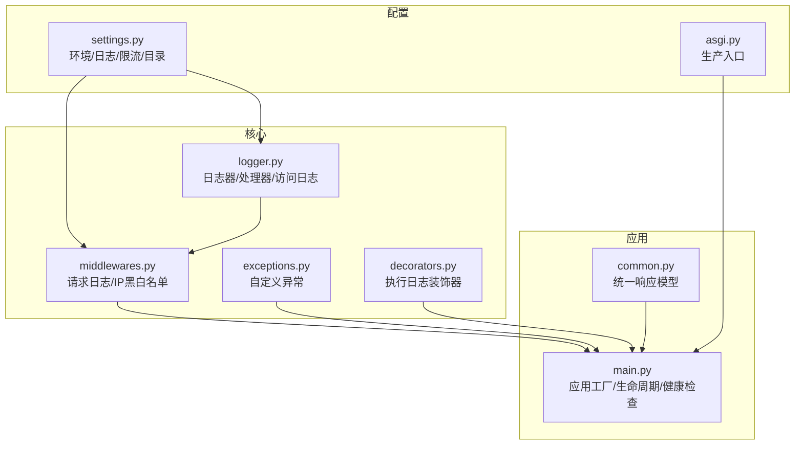
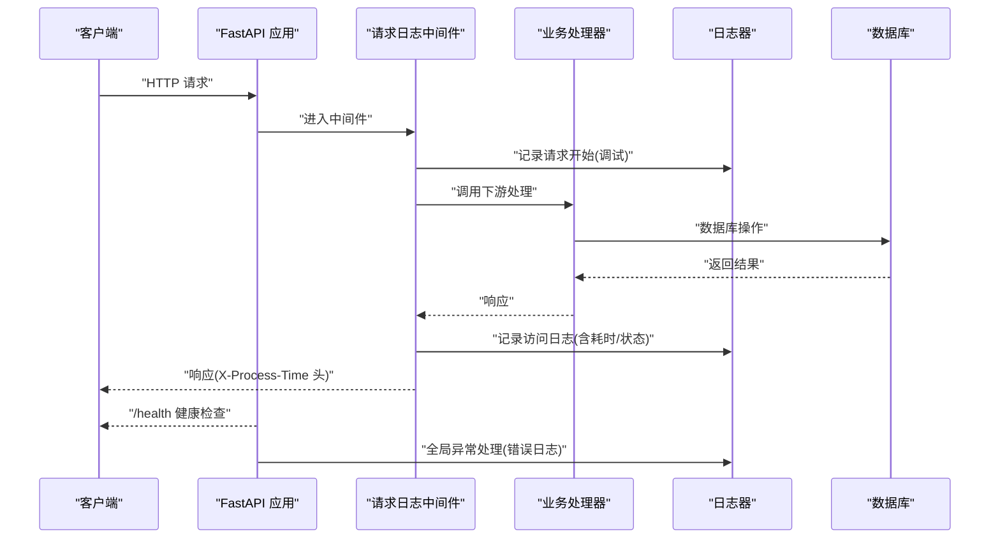
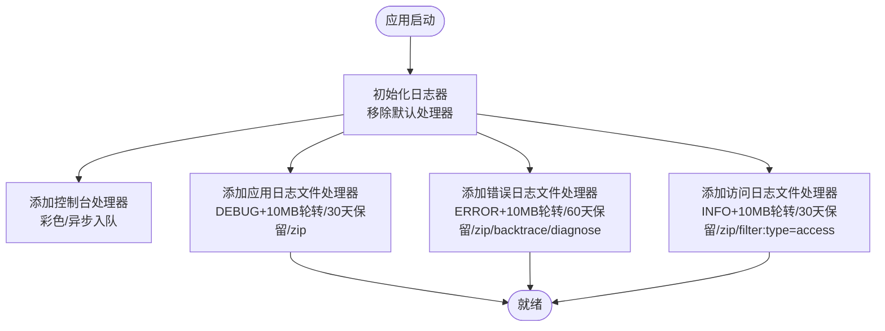
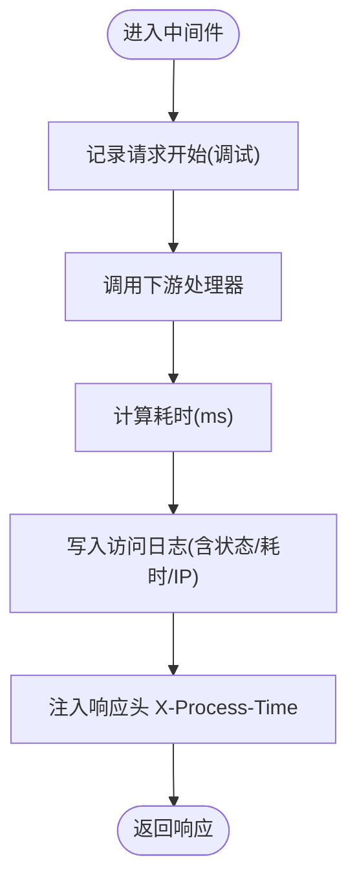
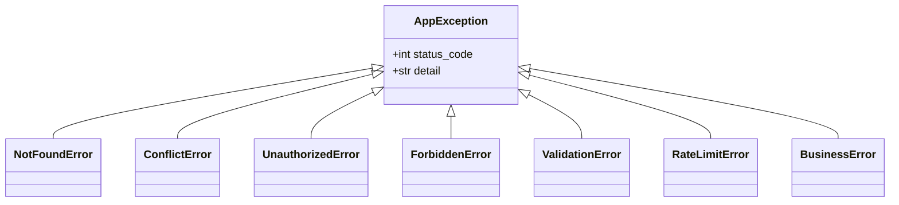
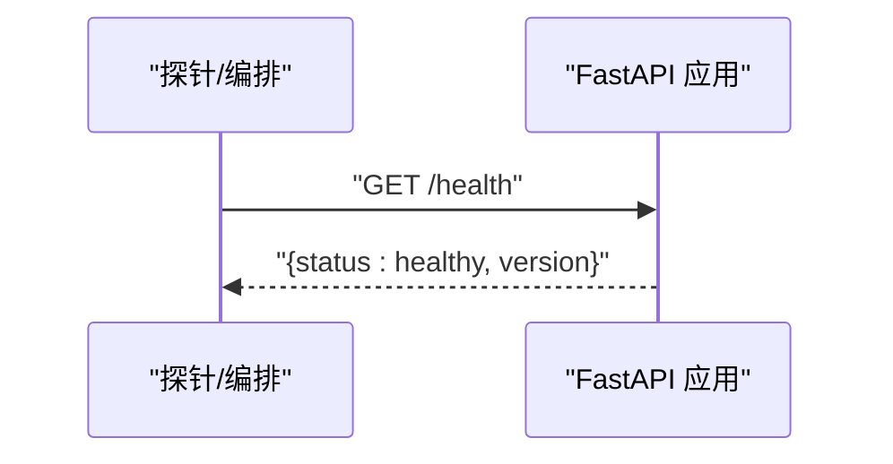
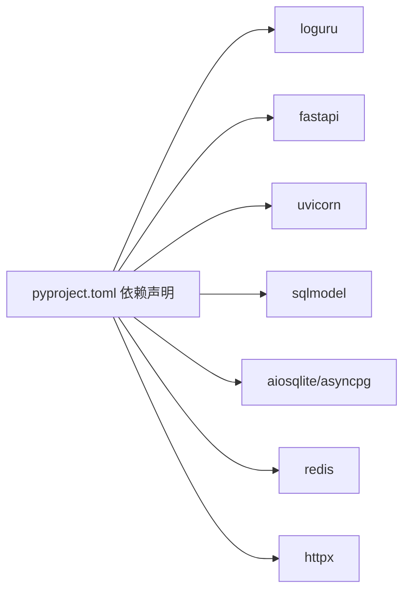

# 监控与日志管理

<cite>
**本文引用的文件**
- [service/src/core/logger.py](file://service/src/core/logger.py)
- [service/src/core/middlewares.py](file://service/src/core/middlewares.py)
- [service/src/config/settings.py](file://service/src/config/settings.py)
- [service/src/main.py](file://service/src/main.py)
- [service/src/core/exceptions.py](file://service/src/core/exceptions.py)
- [service/src/core/decorators.py](file://service/src/core/decorators.py)
- [service/src/api/common.py](file://service/src/api/common.py)
- [service/pyproject.toml](file://service/pyproject.toml)
- [service/src/config/asgi.py](file://service/src/config/asgi.py)
</cite>

## 目录
1. [简介](#简介)
2. [项目结构](#项目结构)
3. [核心组件](#核心组件)
4. [架构总览](#架构总览)
5. [详细组件分析](#详细组件分析)
6. [依赖分析](#依赖分析)
7. [性能考虑](#性能考虑)
8. [故障排查指南](#故障排查指南)
9. [结论](#结论)
10. [附录](#附录)

## 简介
本文件面向 Hello-FastApi 的监控与日志管理，系统性说明应用日志体系的配置与管理策略、结构化日志格式与级别、错误监控与告警建议、性能指标采集（响应时间、吞吐量、资源使用）、日志聚合与分析集成、分布式追踪与链路监控配置思路、系统健康检查与可用性监控、日志轮转与归档清理策略，以及监控数据可视化与报表生成建议。内容基于仓库现有代码实现进行提炼，并提供可落地的扩展建议。

## 项目结构
围绕监控与日志的关键模块分布如下：
- 配置层：环境与日志级别、目录、限流等配置
- 核心层：日志器、中间件、异常体系、装饰器
- 应用层：应用工厂、生命周期、健康检查、路由注册
- 工具与脚本：包依赖与构建配置

图表来源
- [service/src/config/settings.py:32-93](file://service/src/config/settings.py#L32-L93)
- [service/src/core/logger.py:17-72](file://service/src/core/logger.py#L17-L72)
- [service/src/core/middlewares.py:12-39](file://service/src/core/middlewares.py#L12-L39)
- [service/src/main.py:19-96](file://service/src/main.py#L19-L96)
- [service/src/core/exceptions.py:6-60](file://service/src/core/exceptions.py#L6-L60)
- [service/src/core/decorators.py:9-24](file://service/src/core/decorators.py#L9-L24)
- [service/src/api/common.py:29-47](file://service/src/api/common.py#L29-L47)
- [service/src/config/asgi.py:1-6](file://service/src/config/asgi.py#L1-L6)

章节来源
- [service/src/config/settings.py:32-93](file://service/src/config/settings.py#L32-L93)
- [service/src/core/logger.py:17-72](file://service/src/core/logger.py#L17-L72)
- [service/src/core/middlewares.py:12-39](file://service/src/core/middlewares.py#L12-L39)
- [service/src/main.py:19-96](file://service/src/main.py#L19-L96)

## 核心组件
- 日志器与处理器：控制台彩色输出、应用日志文件、错误日志文件、访问日志文件；支持按大小轮转、保留期、压缩、编码与异步入队。
- 请求日志中间件：计算请求耗时、记录访问日志、注入响应头 X-Process-Time。
- 异常与统一响应：自定义异常类与全局异常处理器，统一错误响应格式。
- 健康检查：/health 接口返回服务状态与版本。
- 配置与环境：多环境配置、日志级别校验、目录创建。
- 执行日志装饰器：对函数执行进行开始/结束/异常记录。

章节来源
- [service/src/core/logger.py:17-117](file://service/src/core/logger.py#L17-L117)
- [service/src/core/middlewares.py:12-65](file://service/src/core/middlewares.py#L12-L65)
- [service/src/core/exceptions.py:6-60](file://service/src/core/exceptions.py#L6-L60)
- [service/src/api/common.py:29-65](file://service/src/api/common.py#L29-L65)
- [service/src/main.py:84-87](file://service/src/main.py#L84-L87)
- [service/src/config/settings.py:81-93](file://service/src/config/settings.py#L81-L93)
- [service/src/core/decorators.py:9-24](file://service/src/core/decorators.py#L9-L24)

## 架构总览
下图展示了请求在系统中的流转与日志记录位置，以及健康检查与异常处理的落点。

图表来源
- [service/src/core/middlewares.py:15-39](file://service/src/core/middlewares.py#L15-L39)
- [service/src/core/logger.py:75-85](file://service/src/core/logger.py#L75-L85)
- [service/src/main.py:84-87](file://service/src/main.py#L84-L87)
- [service/src/core/exceptions.py:6-60](file://service/src/core/exceptions.py#L6-L60)

## 详细组件分析

### 日志系统与结构化日志
- 控制台处理器：彩色输出、包含时间、级别、来源、函数、行号与消息。
- 应用日志文件：DEBUG 及以上级别，按 10MB 轮转、30 天保留、zip 压缩、UTF-8 编码、异步入队，过滤非 ERROR 级别。
- 错误日志文件：仅 ERROR 级别，10MB 轮转、60 天保留、zip 压缩、开启回溯与诊断。
- 访问日志文件：INFO 级别，按 10MB 轮转、30 天保留、zip 压缩，通过额外字段 type=access 过滤输出。
- 结构化访问日志格式：包含客户端 IP、方法、路径、状态码、耗时（毫秒）。
- 启动/关闭日志：记录应用名、版本、环境、调试模式、日志级别、启动/关闭时间。

图表来源
- [service/src/core/logger.py:17-72](file://service/src/core/logger.py#L17-L72)

章节来源
- [service/src/core/logger.py:17-117](file://service/src/core/logger.py#L17-L117)

### 请求日志中间件与性能指标
- 记录请求开始（调试级别），包含方法、路径与来源 IP。
- 计算处理时间（毫秒），写入访问日志并注入响应头 X-Process-Time。
- 支持 IP 白名单/黑名单过滤，拒绝访问并记录警告。

图表来源
- [service/src/core/middlewares.py:15-39](file://service/src/core/middlewares.py#L15-L39)

章节来源
- [service/src/core/middlewares.py:12-65](file://service/src/core/middlewares.py#L12-L65)

### 异常监控与统一响应
- 自定义异常类覆盖常见业务场景（未找到、冲突、未授权、禁止、验证、限流、业务错误）。
- 全局异常处理器：
  - AppException：返回 code、message。
  - 参数验证错误：返回 422 与 errors。
  - 未处理异常：记录错误日志并返回 500。
- 统一响应模型：code、message、data；分页响应模型。

图表来源
- [service/src/core/exceptions.py:6-60](file://service/src/core/exceptions.py#L6-L60)

章节来源
- [service/src/core/exceptions.py:6-60](file://service/src/core/exceptions.py#L6-L60)
- [service/src/api/common.py:29-65](file://service/src/api/common.py#L29-L65)
- [service/src/main.py:60-83](file://service/src/main.py#L60-L83)

### 健康检查与可用性监控
- 提供 /health 接口，返回服务状态与版本，便于探活与编排系统监控。
- 应用生命周期：启动时记录启动日志并初始化数据库，关闭时记录关闭日志并关闭数据库连接。

图表来源
- [service/src/main.py:84-87](file://service/src/main.py#L84-L87)
- [service/src/main.py:23-31](file://service/src/main.py#L23-L31)

章节来源
- [service/src/main.py:84-87](file://service/src/main.py#L84-L87)
- [service/src/main.py:19-32](file://service/src/main.py#L19-L32)

### 执行日志装饰器
- 对异步函数执行进行“开始/完成/异常”记录，便于定位慢调用与异常点。

章节来源
- [service/src/core/decorators.py:9-24](file://service/src/core/decorators.py#L9-L24)

### 配置与环境
- 多环境配置：development/production/testing，分别设置 DEBUG、LOG_LEVEL、数据库等。
- 日志目录与文档目录自动创建。
- 日志级别校验，确保合法值集合。

章节来源
- [service/src/config/settings.py:81-93](file://service/src/config/settings.py#L81-L93)
- [service/src/config/settings.py:110-142](file://service/src/config/settings.py#L110-L142)

## 依赖分析
- 日志：loguru 作为统一日志后端，提供高性能、结构化、异步入队能力。
- Web：FastAPI + Uvicorn，中间件与异常处理在应用层集中管理。
- ORM/数据库：SQLModel + aiosqlite/asyncpg，结合生命周期初始化/关闭数据库。
- 缓存：Redis 客户端，可用于限流、会话等场景（当前未见限流中间件实现）。
- 工具：httpx 用于外部请求，pydantic-settings 管理配置。

图表来源
- [service/pyproject.toml:7-20](file://service/pyproject.toml#L7-L20)

章节来源
- [service/pyproject.toml:7-20](file://service/pyproject.toml#L7-L20)

## 性能考虑
- 响应时间：中间件计算并注入 X-Process-Time，访问日志记录耗时，便于统计 P50/P90/P99。
- 吞吐量：可通过访问日志中的时间戳与状态码聚合统计 QPS、成功率。
- 资源使用：建议结合系统监控（CPU/内存/IO）与容器指标（Docker/Prometheus Node Exporter）进行综合评估。
- 日志性能：启用 enqueue 异步入队、合理轮转大小与保留期，避免磁盘 IO 抖动。

章节来源
- [service/src/core/middlewares.py:24-39](file://service/src/core/middlewares.py#L24-L39)
- [service/src/core/logger.py:34-72](file://service/src/core/logger.py#L34-L72)

## 故障排查指南
- 访问日志缺失：确认访问日志处理器已启用且 filter(type=access) 生效。
- 错误日志过多：检查 LOG_LEVEL 与错误日志处理器配置，必要时调整级别或增加过滤。
- 健康检查失败：检查 /health 路由与应用生命周期钩子，确认数据库初始化与关闭流程正常。
- 异常未捕获：核对全局异常处理器注册与自定义异常类继承关系。
- 性能抖动：查看访问日志耗时分布，结合执行日志装饰器定位慢函数。

章节来源
- [service/src/core/logger.py:61-72](file://service/src/core/logger.py#L61-L72)
- [service/src/main.py:84-87](file://service/src/main.py#L84-L87)
- [service/src/core/exceptions.py:6-60](file://service/src/core/exceptions.py#L6-L60)
- [service/src/core/decorators.py:9-24](file://service/src/core/decorators.py#L9-L24)

## 结论
本项目以 loguru 为核心实现了结构化、异步、多目标的日志体系，并通过中间件统一采集访问日志与性能指标，结合统一异常处理与健康检查接口，形成了较为完善的监控与日志基线。建议在此基础上引入分布式追踪（如 OpenTelemetry）、日志聚合平台（如 ELK/Vector/Loki）、指标采集（Prometheus）与可视化（Grafana）以完善可观测性闭环。

## 附录

### 结构化日志格式规范
- 应用日志：包含时间、级别、来源、函数、行号与消息。
- 错误日志：包含时间、级别、来源、函数、行号与消息，开启回溯与诊断。
- 访问日志：包含时间、级别、客户端 IP、方法、路径、状态码、耗时（毫秒）。
- 启动/关闭日志：包含应用名、版本、环境、调试模式、日志级别、时间。

章节来源
- [service/src/core/logger.py:24-68](file://service/src/core/logger.py#L24-L68)
- [service/src/core/logger.py:88-114](file://service/src/core/logger.py#L88-L114)

### 日志级别设置
- 开发环境：DEBUG，便于问题定位。
- 生产环境：WARNING，减少噪音，聚焦关键问题。
- 测试环境：DEBUG，便于回归与问题复现。

章节来源
- [service/src/config/settings.py:117-141](file://service/src/config/settings.py#L117-L141)

### 错误监控与告警机制建议
- 基于错误日志文件进行告警（如 ERROR 级别阈值、异常堆栈关键字匹配）。
- 结合统一异常处理返回码与业务语义，建立业务告警规则。
- 建议引入分布式追踪（OpenTelemetry）以关联错误与链路。

章节来源
- [service/src/core/logger.py:47-59](file://service/src/core/logger.py#L47-L59)
- [service/src/core/exceptions.py:6-60](file://service/src/core/exceptions.py#L6-L60)

### 性能指标监控建议
- 响应时间：从访问日志统计 P50/P90/P99；从中间件注入头读取实时值。
- 吞吐量：按时间窗口统计访问日志条数与状态码分布。
- 资源使用：结合系统与容器指标采集，形成综合仪表板。

章节来源
- [service/src/core/middlewares.py:24-39](file://service/src/core/middlewares.py#L24-L39)

### 日志聚合与分析集成方案
- 收集：Uvicorn/ASGI 生产入口，结合 loguru 文件处理器输出。
- 聚合：使用 Vector/Fluent Bit/Filebeat 将日志推送至 Loki/ELK。
- 分析：在 Grafana 中查询与可视化日志指标（错误率、耗时分布、TopK）。

章节来源
- [service/src/config/asgi.py:1-6](file://service/src/config/asgi.py#L1-L6)
- [service/src/core/logger.py:32-72](file://service/src/core/logger.py#L32-L72)

### 分布式追踪与链路监控
- 建议引入 OpenTelemetry SDK，对 FastAPI 路由、数据库、缓存调用进行自动采样。
- 将 Trace ID 注入日志上下文，实现日志与链路的关联查询。

章节来源
- [service/src/core/logger.py:15-15](file://service/src/core/logger.py#L15-L15)

### 系统健康检查与可用性监控
- /health 接口返回服务状态与版本，适合探活与编排系统。
- 应用生命周期钩子负责数据库初始化与关闭，保障健康检查一致性。

章节来源
- [service/src/main.py:84-87](file://service/src/main.py#L84-L87)
- [service/src/main.py:23-31](file://service/src/main.py#L23-L31)

### 日志轮转、归档与清理策略
- 应用日志：10MB 轮转、30 天保留、zip 压缩。
- 错误日志：10MB 轮转、60 天保留、zip 压缩。
- 访问日志：10MB 轮转、30 天保留、zip 压缩。
- 建议：定期清理过期归档、监控磁盘使用率、设置告警阈值。

章节来源
- [service/src/core/logger.py:34-72](file://service/src/core/logger.py#L34-L72)

### 监控数据可视化与报表生成
- 指标面板：QPS、错误率、P50/P90/P99 耗时、资源使用率。
- 日志报表：错误 TopK、IP 访问趋势、接口成功率。
- 建议：基于 Grafana 与 Loki/Prometheus/InfluxDB 构建仪表板。

章节来源
- [service/src/core/middlewares.py:24-39](file://service/src/core/middlewares.py#L24-L39)
- [service/src/core/logger.py:61-72](file://service/src/core/logger.py#L61-L72)