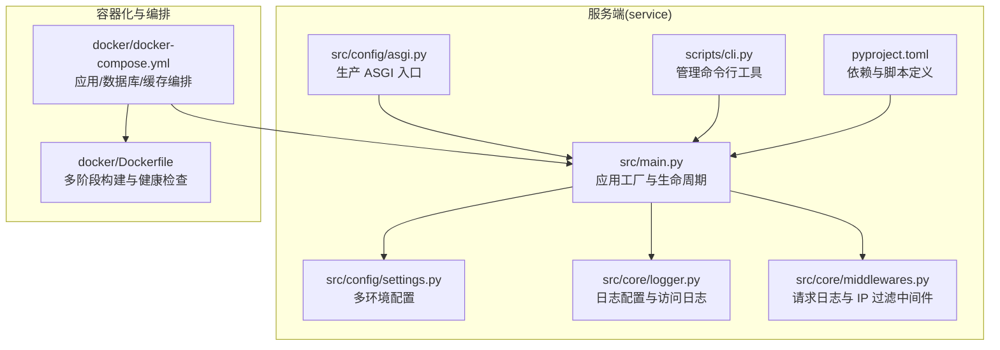
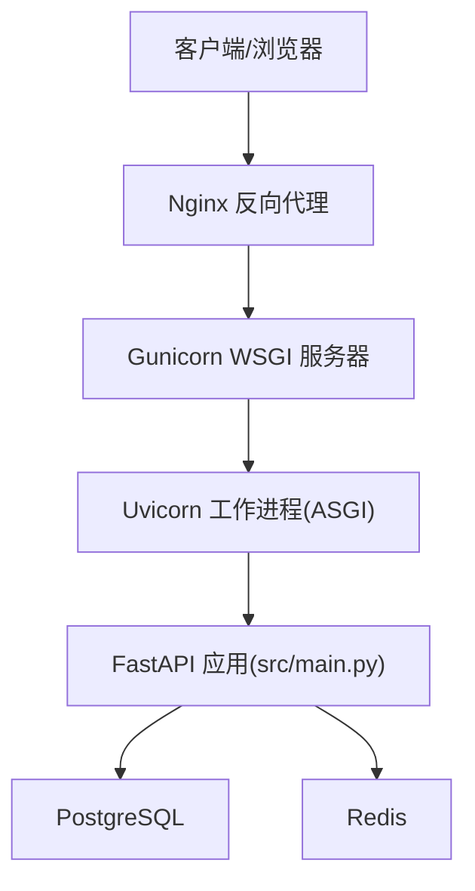
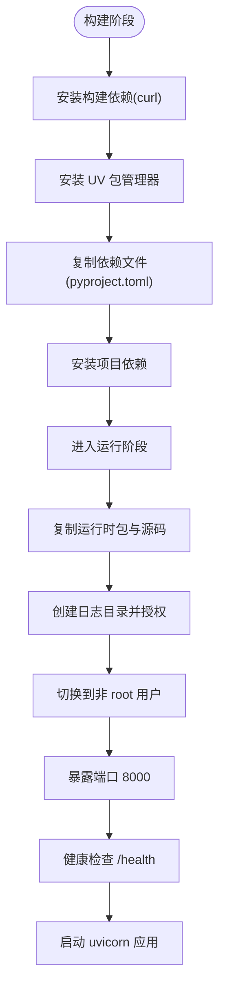
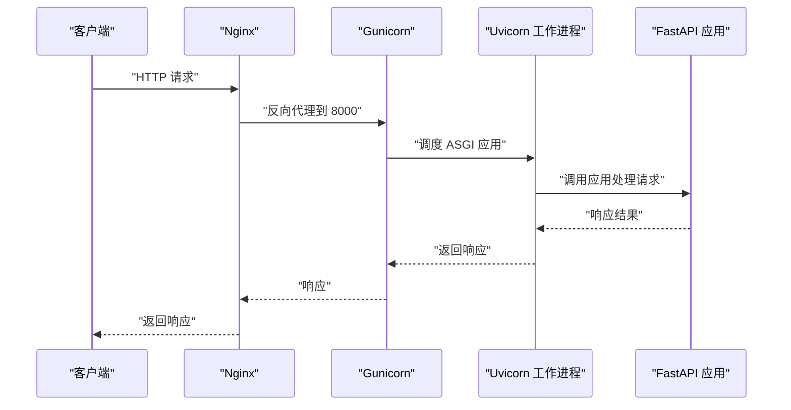
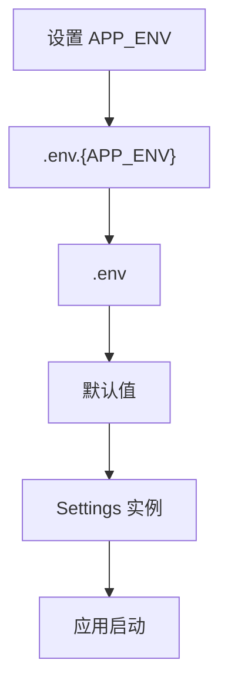
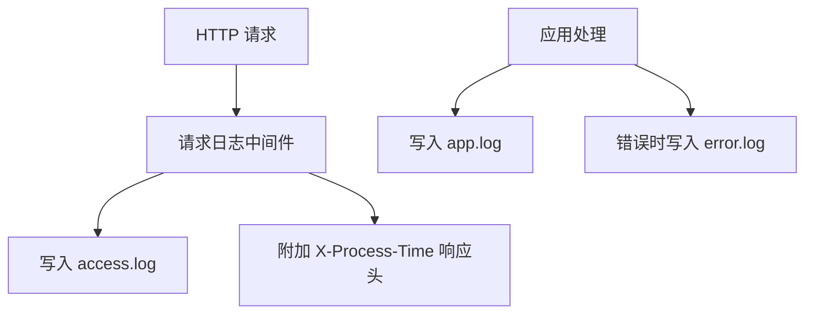
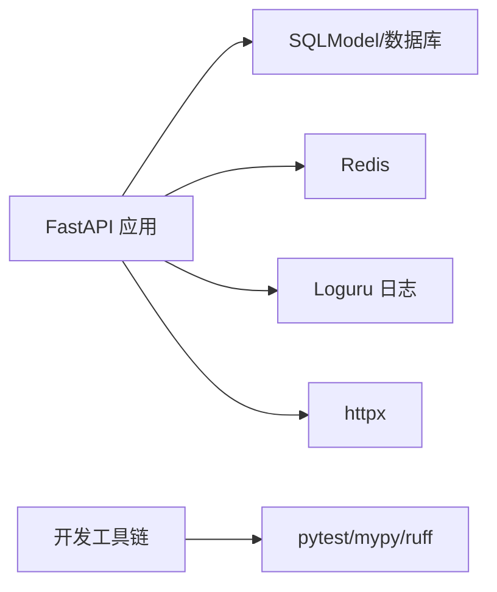

# 部署与运维

<cite>
**本文引用的文件**   
- [service/src/main.py](file://service/src/main.py)
- [service/pyproject.toml](file://service/pyproject.toml)
- [service/src/config/settings.py](file://service/src/config/settings.py)
- [service/src/config/asgi.py](file://service/src/config/asgi.py)
- [service/docker/Dockerfile](file://service/docker/Dockerfile)
- [service/docker/docker-compose.yml](file://service/docker/docker-compose.yml)
- [service/src/core/logger.py](file://service/src/core/logger.py)
- [service/src/core/middlewares.py](file://service/src/core/middlewares.py)
- [service/scripts/cli.py](file://service/scripts/cli.py)
- [service/README.md](file://service/README.md)
</cite>

## 目录
1. [简介](#简介)
2. [项目结构](#项目结构)
3. [核心组件](#核心组件)
4. [架构总览](#架构总览)
5. [详细组件分析](#详细组件分析)
6. [依赖分析](#依赖分析)
7. [性能考虑](#性能考虑)
8. [故障排除指南](#故障排除指南)
9. [结论](#结论)
10. [附录](#附录)

## 简介
本文件面向运维工程师与平台团队，提供 Hello-FastApi 的完整部署与运维指导。内容覆盖：
- Docker 容器化部署配置与使用
- 生产环境部署策略（Nginx 反向代理 + Gunicorn + Uvicorn 工作进程）
- 多环境部署差异与配置管理
- 监控与日志收集方案
- 性能优化与故障排除建议
- 自动化部署与 CI/CD 流程配置思路
- 安全加固与备份恢复最佳实践

## 项目结构
服务端位于 service 目录，采用 FastAPI + DDD + RBAC 架构，核心入口为应用工厂与生命周期管理；容器化与编排在 docker 子目录中提供；日志与中间件在 core 子目录中实现。

**图表来源**
- [service/src/main.py:1-96](file://service/src/main.py#L1-L96)
- [service/src/config/settings.py:1-198](file://service/src/config/settings.py#L1-L198)
- [service/src/config/asgi.py:1-6](file://service/src/config/asgi.py#L1-L6)
- [service/src/core/logger.py:1-117](file://service/src/core/logger.py#L1-L117)
- [service/src/core/middlewares.py:1-65](file://service/src/core/middlewares.py#L1-L65)
- [service/scripts/cli.py:1-135](file://service/scripts/cli.py#L1-L135)
- [service/pyproject.toml:1-76](file://service/pyproject.toml#L1-L76)
- [service/docker/Dockerfile:1-58](file://service/docker/Dockerfile#L1-L58)
- [service/docker/docker-compose.yml:1-65](file://service/docker/docker-compose.yml#L1-L65)

**章节来源**
- [service/src/main.py:1-96](file://service/src/main.py#L1-L96)
- [service/src/config/settings.py:1-198](file://service/src/config/settings.py#L1-L198)
- [service/docker/docker-compose.yml:1-65](file://service/docker/docker-compose.yml#L1-L65)

## 核心组件
- 应用工厂与生命周期：负责应用初始化、数据库连接、健康检查端点与全局异常处理。
- 配置系统：支持 development/production/testing 三套配置，按环境加载 .env.* 文件，提供缓存实例。
- 日志系统：统一使用 loguru，分别输出应用日志、错误日志与访问日志，并在中间件中记录请求耗时。
- 中间件：请求日志中间件与可选的 IP 白名单/黑名单过滤。
- 容器化与编排：多阶段 Dockerfile、健康检查、docker-compose 编排数据库与缓存。
- 管理命令：开发服务器、数据库初始化、RBAC 初始数据填充、超级管理员创建等。

**章节来源**
- [service/src/main.py:19-96](file://service/src/main.py#L19-L96)
- [service/src/config/settings.py:41-198](file://service/src/config/settings.py#L41-L198)
- [service/src/core/logger.py:17-117](file://service/src/core/logger.py#L17-L117)
- [service/src/core/middlewares.py:12-65](file://service/src/core/middlewares.py#L12-L65)
- [service/docker/Dockerfile:52-58](file://service/docker/Dockerfile#L52-L58)
- [service/docker/docker-compose.yml:23-28](file://service/docker/docker-compose.yml#L23-L28)
- [service/scripts/cli.py:22-135](file://service/scripts/cli.py#L22-L135)

## 架构总览
生产部署推荐组合：Nginx（反向代理）+ Gunicorn（WSGI 服务器）+ Uvicorn 工作进程（ASGI）+ PostgreSQL + Redis。应用通过 ASGI 入口对外提供服务，容器内以单工作进程运行，外部由 Gunicorn 管理多工作进程。

**图表来源**
- [service/src/config/asgi.py:1-6](file://service/src/config/asgi.py#L1-L6)
- [service/docker/Dockerfile:56-58](file://service/docker/Dockerfile#L56-L58)
- [service/README.md:248-254](file://service/README.md#L248-L254)

## 详细组件分析

### Docker 容器化部署
- 多阶段构建：使用构建阶段安装依赖，运行阶段仅复制必要运行时文件，减小镜像体积。
- 非 root 用户：创建专用用户组与用户，降低权限风险。
- 健康检查：容器内通过 /health 端点进行健康探测，失败时自动重启。
- 端口暴露与启动命令：容器内监听 8000 端口，使用 uvicorn 直接运行应用。
- 编排：docker-compose 提供应用、数据库、缓存服务，设置环境变量与持久化卷。

**图表来源**
- [service/docker/Dockerfile:1-58](file://service/docker/Dockerfile#L1-L58)

**章节来源**
- [service/docker/Dockerfile:1-58](file://service/docker/Dockerfile#L1-L58)
- [service/docker/docker-compose.yml:1-65](file://service/docker/docker-compose.yml#L1-L65)

### 生产环境部署策略（Nginx + Gunicorn + Uvicorn）
- ASGI 入口：通过 asgi.py 导出 application，供 Gunicorn 加载。
- Gunicorn 启动：使用 uvicorn.workers.UvicornWorker，指定工作进程数与绑定地址。
- Nginx 反代：将请求转发至 Gunicorn 绑定的 8000 端口，实现静态资源、压缩与 TLS 终止等能力。
- 环境变量：通过 APP_ENV 切换 production，数据库与缓存地址通过环境变量注入。

**图表来源**
- [service/src/config/asgi.py:1-6](file://service/src/config/asgi.py#L1-L6)
- [service/README.md:248-254](file://service/README.md#L248-L254)

**章节来源**
- [service/src/config/asgi.py:1-6](file://service/src/config/asgi.py#L1-L6)
- [service/README.md:248-254](file://service/README.md#L248-L254)

### 多环境部署与配置管理
- 环境类型：development、production、testing，通过 APP_ENV 切换。
- 配置加载顺序：系统环境变量 > .env.{APP_ENV} > .env > 默认值。
- 关键差异：
  - development：DEBUG=true，日志级别更详细，数据库默认 sqlite。
  - production：DEBUG=false，日志级别较低，数据库默认 PostgreSQL，启用健康检查。
  - testing：使用独立测试数据库，便于 CI。
- 目录结构：日志、文档、SQL 文件目录在配置中统一创建与管理。

**图表来源**
- [service/src/config/settings.py:144-198](file://service/src/config/settings.py#L144-L198)

**章节来源**
- [service/src/config/settings.py:1-198](file://service/src/config/settings.py#L1-L198)
- [service/README.md:141-179](file://service/README.md#L141-L179)

### 监控与日志收集
- 日志分类：
  - 应用日志：所有级别，按大小轮转与压缩，保留 30 天。
  - 错误日志：仅 ERROR 级别，保留 60 天，开启回溯与诊断。
  - 访问日志：HTTP 请求记录，包含客户端 IP、方法、路径、状态码与耗时。
- 访问日志中间件：在响应头中附加 X-Process-Time，便于性能观测。
- 健康检查：/health 端点返回状态与版本信息，容器与编排均使用该端点进行健康探测。

**图表来源**
- [service/src/core/middlewares.py:12-40](file://service/src/core/middlewares.py#L12-L40)
- [service/src/core/logger.py:32-86](file://service/src/core/logger.py#L32-L86)
- [service/src/main.py:84-87](file://service/src/main.py#L84-L87)

**章节来源**
- [service/src/core/logger.py:1-117](file://service/src/core/logger.py#L1-L117)
- [service/src/core/middlewares.py:1-65](file://service/src/core/middlewares.py#L1-L65)
- [service/src/main.py:84-87](file://service/src/main.py#L84-L87)

### 自动化部署与 CI/CD 流程
- 服务端部署要点：
  - 使用 docker-compose 或容器编排平台（如 Kubernetes）部署。
  - 通过环境变量注入数据库与缓存地址，挂载日志卷以便采集。
  - 在生产环境设置 APP_ENV=production，确保 DEBUG=false 且日志级别合理。
- 前端（web 目录）CI 参考：
  - 仓库中存在前端 Lint 工作流示例，可借鉴其缓存与安装流程，服务端可采用 uv 与 pip 的缓存策略。
- 建议流程：
  - 构建镜像 → 推送镜像 → 滚动更新 → 健康检查 → 回滚策略。

**章节来源**
- [service/docker/docker-compose.yml:1-65](file://service/docker/docker-compose.yml#L1-L65)
- [service/README.md:240-254](file://service/README.md#L240-L254)

### 安全加固与备份恢复
- 安全加固建议：
  - 强制 HTTPS：在 Nginx 层启用 TLS 并重定向 80→443。
  - 限流与防护：在 Nginx 层配置限速与请求大小限制；应用层可结合速率限制配置。
  - 最小权限：容器使用非 root 用户；数据库与缓存使用强密码与网络隔离。
  - 审计与访问控制：启用访问日志与错误日志，定期审计；必要时启用 IP 白名单中间件。
- 备份恢复：
  - 数据库：定期导出 PostgreSQL 数据，结合 WAL 归档与快照策略。
  - 缓存：Redis 持久化策略（RDB/AOF），定期备份。
  - 配置与日志：将 .env.* 与日志目录纳入备份范围。

## 依赖分析
- 应用依赖：FastAPI、Uvicorn、SQLModel、aiosqlite/asyncpg、Pydantic Settings、Redis、Loguru、httpx 等。
- 开发依赖：pytest、pytest-asyncio、ruff、mypy、factory-boy、faker 等。
- 项目脚本：提供 CLI 命令入口，便于开发与运维操作。

**图表来源**
- [service/pyproject.toml:7-20](file://service/pyproject.toml#L7-L20)
- [service/pyproject.toml:22-32](file://service/pyproject.toml#L22-L32)

**章节来源**
- [service/pyproject.toml:1-76](file://service/pyproject.toml#L1-L76)

## 性能考虑
- 工作进程与并发：
  - 容器内使用单工作进程，生产环境通过 Gunicorn 管理多工作进程，提升并发处理能力。
  - 合理设置工作进程数与每个进程的 worker_class（uvicorn.workers.UvicornWorker）。
- 日志开销：
  - 访问日志按大小轮转，避免磁盘膨胀；生产环境建议降低日志级别。
- 数据库与缓存：
  - 使用连接池与合适的超时配置；Redis 作为热点数据缓存，减少数据库压力。
- 健康检查与探针：
  - 容器与编排层面的健康检查有助于快速发现异常并触发重启或替换。

[本节为通用性能建议，无需特定文件引用]

## 故障排除指南
- 常见问题定位：
  - 应用无法启动：查看 /health 端点与容器日志；确认数据库与缓存连通性。
  - 访问缓慢：检查响应头 X-Process-Time；审查慢查询与缓存命中率。
  - 权限错误：确认非 root 用户对日志目录的写权限；检查容器卷挂载。
- 配置问题：
  - 环境变量未生效：核对 APP_ENV 与 .env.* 文件加载顺序；确认缓存配置实例。
- 运维命令：
  - 初始化数据库与 RBAC：使用管理命令行工具执行初始化与种子数据填充。

**章节来源**
- [service/src/main.py:84-87](file://service/src/main.py#L84-L87)
- [service/src/core/middlewares.py:37-39](file://service/src/core/middlewares.py#L37-L39)
- [service/scripts/cli.py:59-101](file://service/scripts/cli.py#L59-L101)

## 结论
本文提供了 Hello-FastApi 的端到端部署与运维方案：容器化、生产级编排、日志与监控、性能优化与故障排除、安全加固与备份恢复。建议在生产环境中采用 Nginx + Gunicorn + Uvicorn 的组合，并结合完善的 CI/CD 与监控告警体系，确保系统的稳定性与可维护性。

[本节为总结性内容，无需特定文件引用]

## 附录

### A. Docker 部署步骤
- 使用 docker-compose 启动：在 service/docker 目录下执行编排文件，应用、数据库与缓存将同时启动。
- 容器健康检查：容器内置 /health 端点与健康检查指令，编排层可据此进行滚动更新与故障恢复。

**章节来源**
- [service/docker/docker-compose.yml:1-65](file://service/docker/docker-compose.yml#L1-L65)
- [service/docker/Dockerfile:52-58](file://service/docker/Dockerfile#L52-L58)

### B. 生产环境启动命令参考
- 使用 Gunicorn 启动：通过 asgi.py 导出的 application，结合 uvicorn.workers.UvicornWorker 与工作进程数启动。
- 环境变量：设置 APP_ENV=production，注入 DATABASE_URL 与 REDIS_URL。

**章节来源**
- [service/src/config/asgi.py:1-6](file://service/src/config/asgi.py#L1-L6)
- [service/README.md:248-254](file://service/README.md#L248-L254)

### C. 管理命令清单
- runserver：启动开发服务器（支持热重载）。
- initdb：初始化数据库表。
- seedrbac：填充默认角色与权限。
- createsuperuser：交互式创建超级管理员。

**章节来源**
- [service/scripts/cli.py:22-135](file://service/scripts/cli.py#L22-L135)