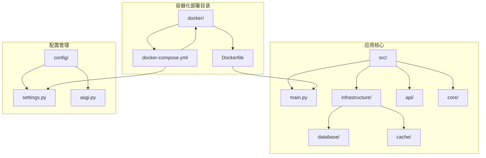
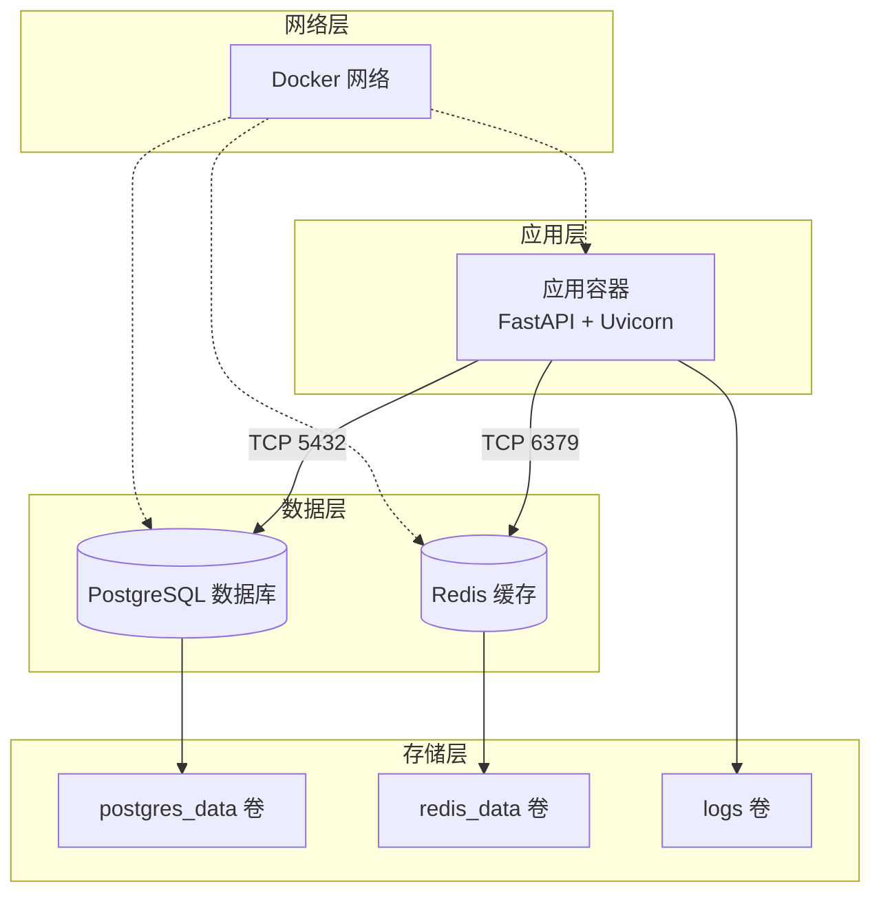
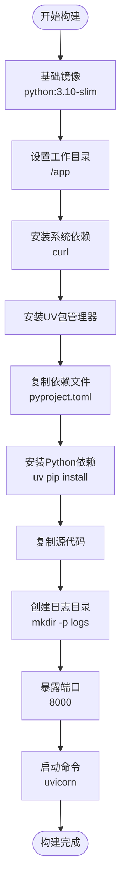
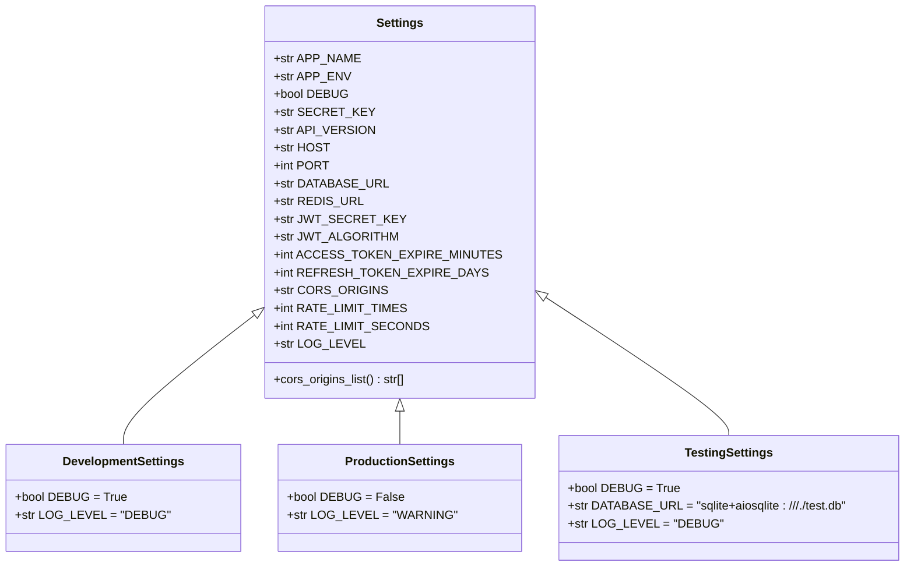
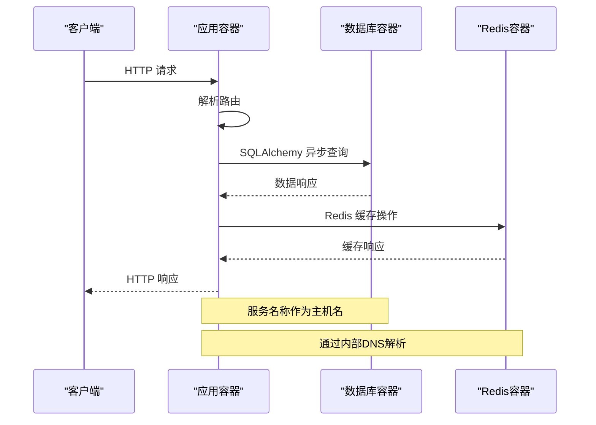
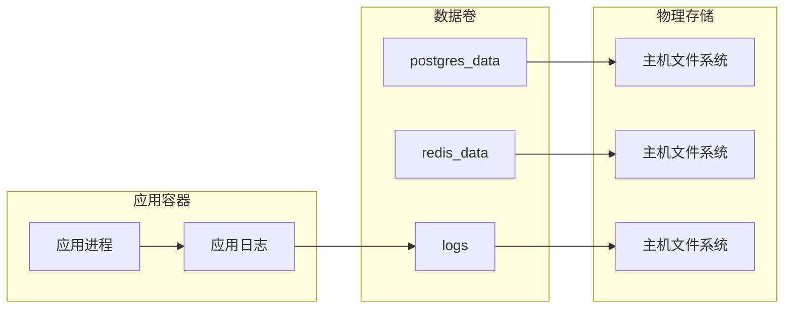
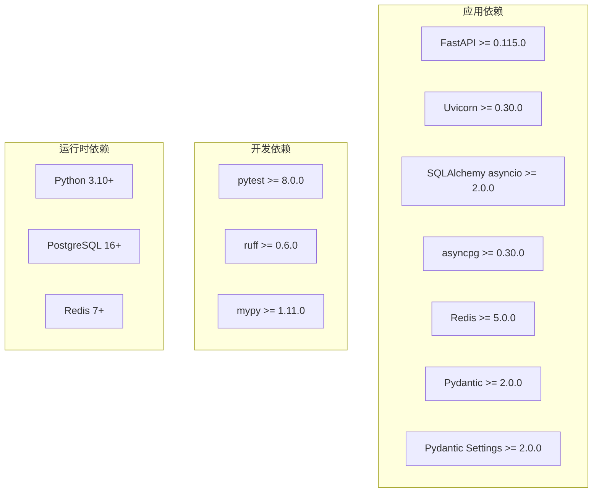
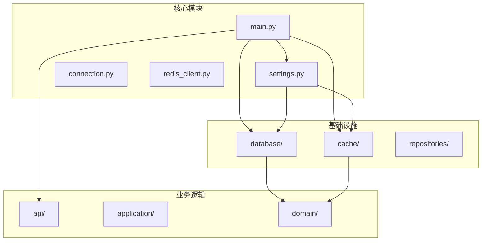
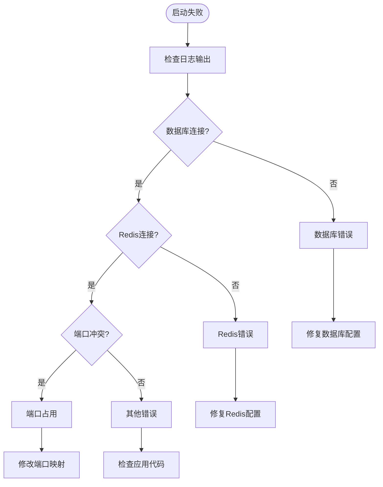

# 容器化部署

<cite>
**本文档引用的文件**
- [Dockerfile](file://docker/Dockerfile)
- [docker-compose.yml](file://docker/docker-compose.yml)
- [pyproject.toml](file://pyproject.toml)
- [main.py](file://src/main.py)
- [settings.py](file://config/settings.py)
- [connection.py](file://src/infrastructure/database/connection.py)
- [redis_client.py](file://src/infrastructure/cache/redis_client.py)
- [asgi.py](file://config/asgi.py)
</cite>

## 目录
1. [简介](#简介)
2. [项目结构](#项目结构)
3. [核心组件](#核心组件)
4. [架构概览](#架构概览)
5. [详细组件分析](#详细组件分析)
6. [依赖关系分析](#依赖关系分析)
7. [性能考虑](#性能考虑)
8. [故障排除指南](#故障排除指南)
9. [结论](#结论)
10. [附录](#附录)

## 简介

本指南详细介绍了基于FastAPI的容器化部署方案，涵盖Docker Compose配置、Dockerfile构建过程、服务间网络通信、环境变量配置、健康检查与重启策略、数据卷挂载以及日志管理等关键主题。该应用采用PostgreSQL数据库和Redis缓存，通过容器编排实现可扩展的微服务架构。

## 项目结构

项目采用标准的FastAPI项目布局，容器化部署相关的核心文件位于`docker/`目录中：



**图表来源**
- [Dockerfile:1-29](file://docker/Dockerfile#L1-L29)
- [docker-compose.yml:1-59](file://docker/docker-compose.yml#L1-L59)

**章节来源**
- [Dockerfile:1-29](file://docker/Dockerfile#L1-L29)
- [docker-compose.yml:1-59](file://docker/docker-compose.yml#L1-L59)

## 核心组件

### 应用服务 (App Service)

应用服务是基于FastAPI的Web应用程序，负责处理HTTP请求、路由管理和业务逻辑执行。其核心特性包括：

- **异步生命周期管理**：使用`@asynccontextmanager`实现数据库初始化和清理
- **中间件集成**：支持CORS、请求日志记录和异常处理
- **健康检查端点**：提供`/health`端点用于监控
- **路由组织**：通过版本化的API路由实现模块化设计

### 数据库服务 (Database Service)

数据库服务采用PostgreSQL 16，提供企业级的关系型数据存储：

- **连接池管理**：使用SQLAlchemy异步引擎和连接池
- **自动迁移**：通过Alembic实现数据库模式管理
- **健康检查**：基于`pg_isready`命令的自动健康监测
- **持久化存储**：使用独立的数据卷确保数据持久性

### 缓存服务 (Cache Service)

缓存服务基于Redis，提供高性能的键值存储解决方案：

- **异步客户端**：使用`redis.asyncio`实现非阻塞操作
- **连接复用**：全局单例模式管理Redis连接
- **健康检查**：通过`redis-cli ping`验证连接状态
- **内存优化**：配置专用的数据卷进行持久化

**章节来源**
- [main.py:19-83](file://src/main.py#L19-L83)
- [connection.py:1-51](file://src/infrastructure/database/connection.py#L1-L51)
- [redis_client.py:1-27](file://src/infrastructure/cache/redis_client.py#L1-L27)

## 架构概览

容器化架构采用多服务协作模式，各服务通过Docker网络进行通信：



**图表来源**
- [docker-compose.yml:3-59](file://docker/docker-compose.yml#L3-L59)

## 详细组件分析

### Dockerfile 构建流程

Dockerfile采用多阶段构建策略，优化镜像大小和构建效率：



**图表来源**
- [Dockerfile:1-29](file://docker/Dockerfile#L1-L29)

构建优化策略：
- **轻量级基础镜像**：使用`python:3.10-slim`减少镜像体积
- **系统依赖最小化**：仅安装必要的系统工具
- **UV包管理器**：加速依赖安装和解析
- **分层缓存**：合理安排指令顺序以利用Docker缓存

**章节来源**
- [Dockerfile:1-29](file://docker/Dockerfile#L1-L29)
- [pyproject.toml:1-74](file://pyproject.toml#L1-L74)

### Docker Compose 配置详解

Compose文件定义了完整的微服务架构，包含三个核心服务：

#### 应用服务配置要点

| 配置项 | 值 | 说明 |
|--------|-----|------|
| `container_name` | `hello-fastapi` | 容器唯一标识符 |
| `ports` | `"8000:8000"` | 端口映射 |
| `restart` | `unless-stopped` | 重启策略 |
| `depends_on` | `db: healthy`, `redis: healthy` | 启动依赖 |

#### 数据库服务配置要点

| 配置项 | 值 | 说明 |
|--------|-----|------|
| `image` | `postgres:16-alpine` | PostgreSQL 16镜像 |
| `environment` | `POSTGRES_DB`, `POSTGRES_USER`, `POSTGRES_PASSWORD` | 数据库凭据 |
| `healthcheck` | `pg_isready -U postgres` | 健康检查命令 |
| `volumes` | `postgres_data:/var/lib/postgresql/data` | 数据持久化 |

#### 缓存服务配置要点

| 配置项 | 值 | 说明 |
|--------|-----|------|
| `image` | `redis:7-alpine` | Redis 7镜像 |
| `ports` | `"6379:6379"` | 端口映射 |
| `volumes` | `redis_data:/data` | 数据持久化 |
| `healthcheck` | `redis-cli ping` | 健康检查命令 |

**章节来源**
- [docker-compose.yml:1-59](file://docker/docker-compose.yml#L1-L59)

### 环境变量配置

应用通过Pydantic Settings实现环境变量管理，支持多环境配置：



**图表来源**
- [settings.py:6-85](file://config/settings.py#L6-L85)

环境变量加载机制：
- **默认值**：为每个配置项提供合理的默认值
- **环境覆盖**：通过`.env`文件支持运行时配置覆盖
- **类型安全**：使用Pydantic进行类型验证和转换
- **动态选择**：根据`APP_ENV`环境变量选择配置类

**章节来源**
- [settings.py:1-86](file://config/settings.py#L1-L86)

### 服务间网络通信

容器间通信通过Docker网络实现，采用服务发现机制：



**图表来源**
- [docker-compose.yml:13-14](file://docker/docker-compose.yml#L13-L14)
- [connection.py:7-11](file://src/infrastructure/database/connection.py#L7-L11)
- [redis_client.py:13-17](file://src/infrastructure/cache/redis_client.py#L13-L17)

网络通信特点：
- **内部网络**：容器间通过Docker网络通信
- **服务发现**：使用服务名称作为主机名
- **端口隔离**：外部访问通过端口映射
- **依赖管理**：通过`depends_on`确保启动顺序

**章节来源**
- [docker-compose.yml:13-19](file://docker/docker-compose.yml#L13-L19)
- [connection.py:7-11](file://src/infrastructure/database/connection.py#L7-L11)
- [redis_client.py:13-17](file://src/infrastructure/cache/redis_client.py#L13-L17)

### 健康检查与重启策略

健康检查机制确保服务可用性和自动恢复能力：

| 服务 | 健康检查命令 | 检查间隔 | 超时时间 | 重试次数 |
|------|-------------|----------|----------|----------|
| 应用服务 | 内部健康端点 | 30秒 | 10秒 | 3次 |
| 数据库服务 | `pg_isready -U postgres` | 5秒 | 5秒 | 5次 |
| 缓存服务 | `redis-cli ping` | 5秒 | 5秒 | 5次 |

重启策略配置：
- **unless-stopped**：除非手动停止，否则容器异常退出后自动重启
- **条件启动**：应用服务等待数据库和Redis服务健康后再启动

**章节来源**
- [docker-compose.yml:35-54](file://docker/docker-compose.yml#L35-L54)
- [main.py:71-74](file://src/main.py#L71-L74)

### 数据持久化存储

数据持久化通过Docker命名卷实现，确保数据在容器重建后不丢失：



**图表来源**
- [docker-compose.yml:34-58](file://docker/docker-compose.yml#L34-L58)

卷挂载策略：
- **数据库卷**：`postgres_data:/var/lib/postgresql/data`
- **缓存卷**：`redis_data:/data`
- **日志卷**：`../logs:/app/logs`

**章节来源**
- [docker-compose.yml:20-58](file://docker/docker-compose.yml#L20-L58)
- [Dockerfile:23-24](file://docker/Dockerfile#L23-L24)

## 依赖关系分析

### 外部依赖关系

应用依赖的关键外部服务：



**图表来源**
- [pyproject.toml:7-27](file://pyproject.toml#L7-L27)

### 内部模块依赖



**图表来源**
- [main.py:1-83](file://src/main.py#L1-L83)
- [settings.py:1-86](file://config/settings.py#L1-L86)

**章节来源**
- [pyproject.toml:1-74](file://pyproject.toml#L1-L74)
- [main.py:1-83](file://src/main.py#L1-L83)

## 性能考虑

### 镜像优化策略

1. **多阶段构建**：利用`python:3.10-slim`基础镜像减少体积
2. **依赖管理**：使用UV替代pip，提高安装效率
3. **缓存优化**：合理安排Docker指令顺序，最大化缓存命中率
4. **运行时精简**：移除不必要的系统包和开发工具

### 应用性能优化

1. **异步编程**：充分利用FastAPI的异步特性
2. **连接池**：配置合适的数据库连接池参数
3. **缓存策略**：合理使用Redis缓存热点数据
4. **中间件优化**：最小化中间件数量，避免性能瓶颈

### 资源管理

1. **内存限制**：为容器设置合理的内存限制
2. **CPU配额**：根据负载需求调整CPU分配
3. **并发控制**：配置Uvicorn的工作进程数
4. **数据库连接池**：根据容器数量优化连接池大小

## 故障排除指南

### 常见问题诊断

#### 启动失败排查



#### 网络连接问题

1. **服务发现失败**：确认服务名称正确无误
2. **端口不可达**：检查容器端口映射和防火墙设置
3. **DNS解析问题**：验证Docker网络配置
4. **超时错误**：检查服务健康状态和资源限制

#### 数据持久化问题

1. **数据丢失**：确认卷挂载路径正确
2. **权限问题**：检查卷所有权和权限设置
3. **磁盘空间不足**：监控存储使用情况
4. **备份恢复**：定期备份重要数据

**章节来源**
- [docker-compose.yml:35-54](file://docker/docker-compose.yml#L35-L54)
- [connection.py:7-11](file://src/infrastructure/database/connection.py#L7-L11)
- [redis_client.py:13-17](file://src/infrastructure/cache/redis_client.py#L13-L17)

### 日志查看方法

#### 应用日志

```bash
# 查看应用容器日志
docker compose logs -f app

# 查看特定时间段的日志
docker compose logs --since "2024-01-01" app

# 过滤错误日志
docker compose logs app | grep ERROR
```

#### 数据库日志

```bash
# 查看PostgreSQL日志
docker compose logs db

# 查看Redis日志
docker compose logs redis
```

#### 日志分析技巧

1. **实时监控**：使用`-f`参数实时查看日志流
2. **时间戳过滤**：结合`--since`和`--until`参数
3. **关键字搜索**：使用`grep`过滤特定信息
4. **日志轮转**：配置日志轮转避免磁盘空间不足

**章节来源**
- [docker-compose.yml:20-21](file://docker/docker-compose.yml#L20-L21)
- [Dockerfile:23-24](file://docker/Dockerfile#L23-L24)

## 结论

本容器化部署方案提供了完整的微服务架构实现，具有以下优势：

1. **架构清晰**：采用分层设计，职责分离明确
2. **可扩展性强**：支持水平扩展和垂直扩展
3. **运维友好**：完善的监控、日志和故障排除机制
4. **性能优化**：多层面的性能优化策略
5. **环境适配**：支持开发、测试、生产多环境部署

建议在生产环境中进一步完善：
- 添加负载均衡和反向代理
- 配置SSL/TLS加密传输
- 实施更严格的访问控制
- 建立完整的CI/CD流水线
- 制定灾难恢复计划

## 附录

### 环境变量参考表

| 变量名 | 默认值 | 用途 | 生产环境建议 |
|--------|--------|------|-------------|
| `APP_ENV` | `development` | 应用环境 | `production` |
| `DATABASE_URL` | `postgresql+asyncpg://...` | 数据库连接 | 使用密钥管理服务 |
| `REDIS_URL` | `redis://localhost:6379/0` | Redis连接 | 使用内网地址 |
| `SECRET_KEY` | `your-secret-key-change-in-production` | 应用密钥 | 随机生成并加密存储 |
| `JWT_SECRET_KEY` | `your-jwt-secret-key-change-in-production` | JWT密钥 | 独立密钥管理 |
| `LOG_LEVEL` | `INFO` | 日志级别 | `WARNING` 或 `ERROR` |

### 健康检查命令

```bash
# 检查应用健康状态
curl http://localhost:8000/health

# 检查数据库连接
docker compose exec db pg_isready -U postgres

# 检查Redis连接
docker compose exec redis redis-cli ping
```

### 部署脚本示例

```bash
#!/bin/bash
# 部署脚本

# 构建镜像
docker compose build

# 启动服务
docker compose up -d

# 查看服务状态
docker compose ps

# 查看日志
docker compose logs -f app
```