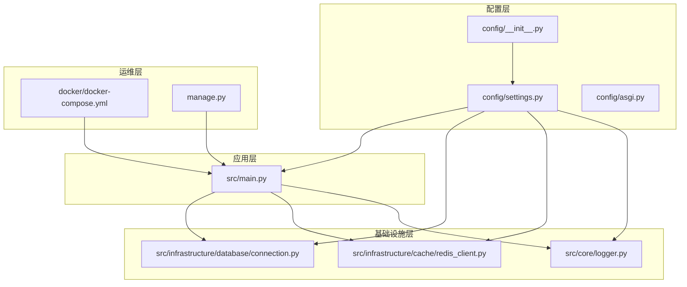
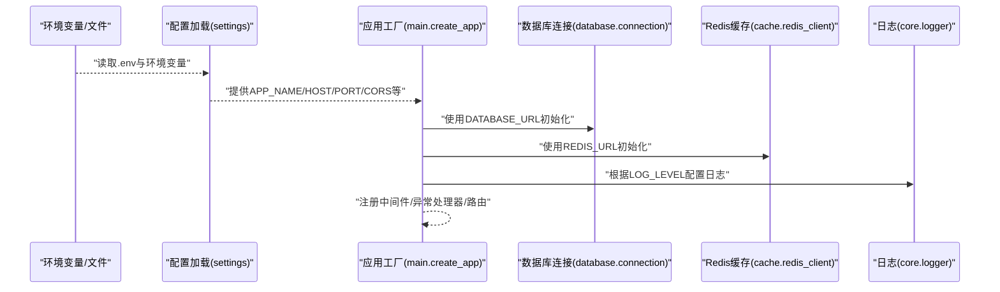
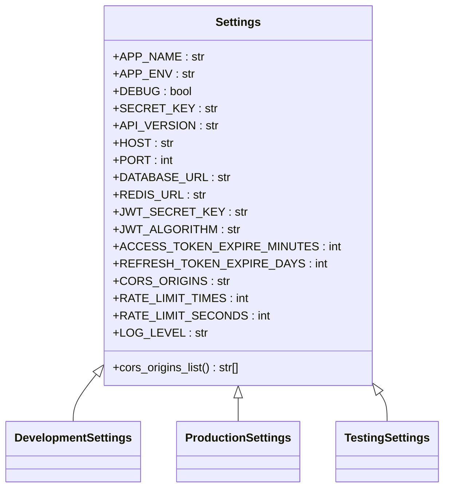
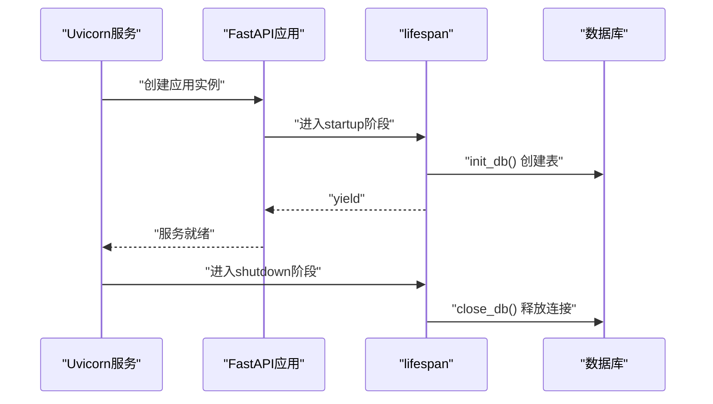
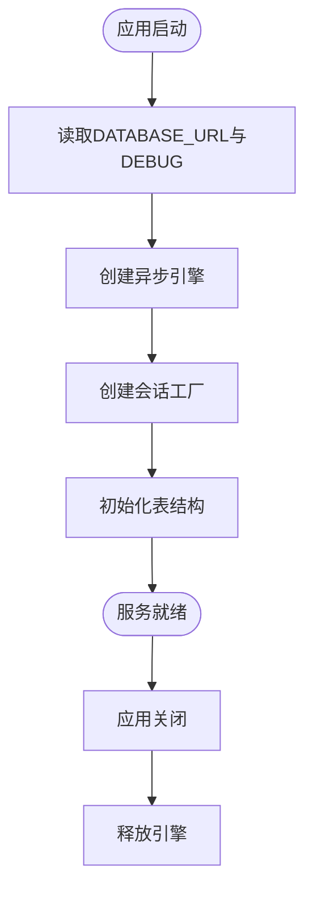
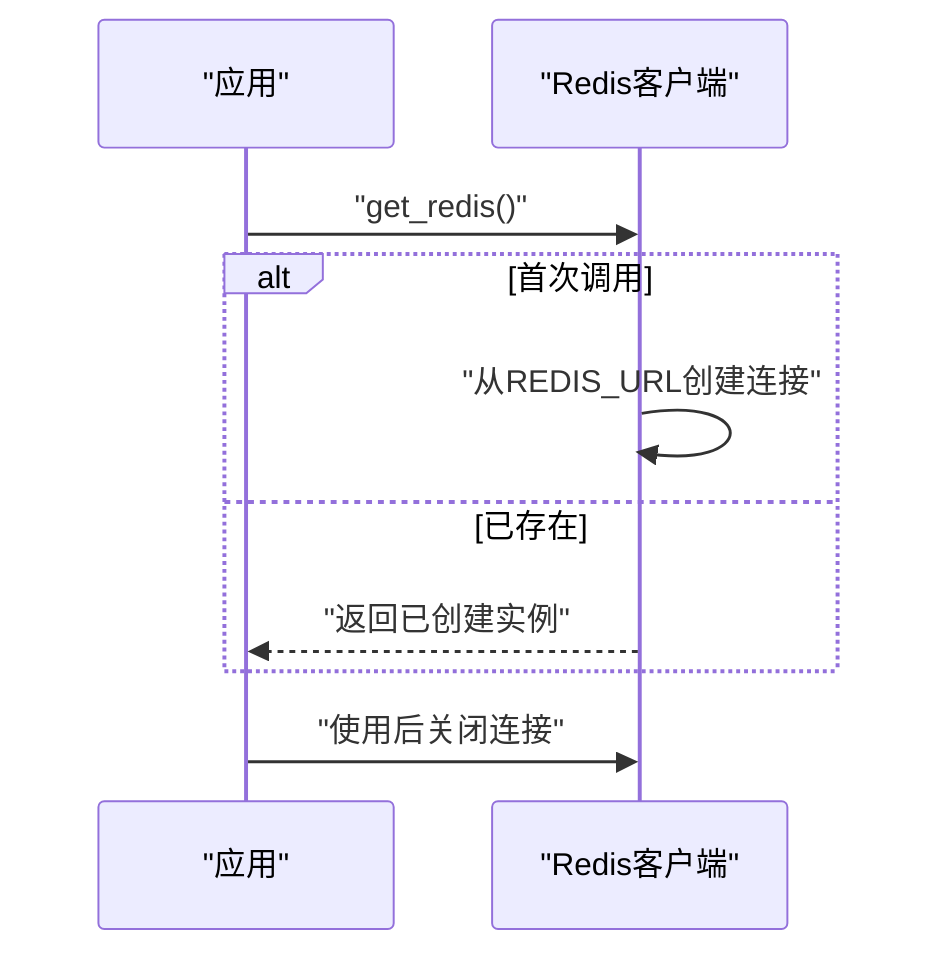
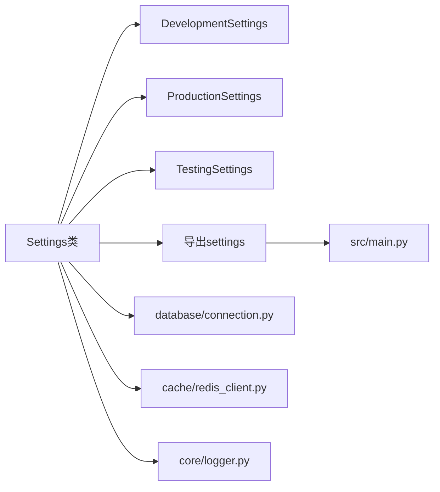

# 环境配置

<cite>
**本文引用的文件**
- [config/settings.py](file://config/settings.py)
- [config/__init__.py](file://config/__init__.py)
- [config/asgi.py](file://config/asgi.py)
- [src/main.py](file://src/main.py)
- [src/infrastructure/database/connection.py](file://src/infrastructure/database/connection.py)
- [src/infrastructure/cache/redis_client.py](file://src/infrastructure/cache/redis_client.py)
- [src/core/logger.py](file://src/core/logger.py)
- [docker/docker-compose.yml](file://docker/docker-compose.yml)
- [manage.py](file://manage.py)
- [pyproject.toml](file://pyproject.toml)
- [scripts/setup_dev.sh](file://scripts/setup_dev.sh)
- [scripts/setup_dev.bat](file://scripts/setup_dev.bat)
</cite>

## 目录
1. [简介](#简介)
2. [项目结构](#项目结构)
3. [核心组件](#核心组件)
4. [架构总览](#架构总览)
5. [详细组件分析](#详细组件分析)
6. [依赖分析](#依赖分析)
7. [性能考虑](#性能考虑)
8. [故障排查指南](#故障排查指南)
9. [结论](#结论)
10. [附录](#附录)

## 简介
本指南围绕多环境配置管理展开，系统性阐述配置文件的组织结构、环境变量加载与优先级、开发/测试/生产环境差异与最佳实践、数据库与缓存连接配置、安全配置要点、配置验证与错误处理、敏感信息安全管理、配置热更新与动态配置思路，以及配置迁移与版本管理流程。文档以仓库现有代码为依据，结合实际可落地的实现路径，帮助读者在不同环境中稳定、安全地运行应用。

## 项目结构
本项目采用“按职责分层”的配置组织方式：
- 配置层：集中于 config 包，通过 settings 模块定义基础配置类与环境派生类，并导出统一的 settings 实例供应用使用。
- 应用层：在主程序中注入配置，用于初始化数据库、缓存、CORS、日志等。
- 基础设施层：数据库与缓存模块从配置读取连接参数，确保一致性。
- 运维层：Docker Compose 在容器编排时直接注入环境变量；管理脚本提供本地开发与初始化命令。

图表来源
- [config/__init__.py:1-6](file://config/__init__.py#L1-L6)
- [config/settings.py:1-85](file://config/settings.py#L1-L85)
- [config/asgi.py:1-6](file://config/asgi.py#L1-L6)
- [src/main.py:1-83](file://src/main.py#L1-L83)
- [src/infrastructure/database/connection.py:1-51](file://src/infrastructure/database/connection.py#L1-L51)
- [src/infrastructure/cache/redis_client.py:1-27](file://src/infrastructure/cache/redis_client.py#L1-L27)
- [src/core/logger.py:1-48](file://src/core/logger.py#L1-L48)
- [docker/docker-compose.yml:1-59](file://docker/docker-compose.yml#L1-L59)
- [manage.py:1-127](file://manage.py#L1-L127)

章节来源
- [config/__init__.py:1-6](file://config/__init__.py#L1-L6)
- [config/settings.py:1-85](file://config/settings.py#L1-L85)
- [src/main.py:1-83](file://src/main.py#L1-L83)
- [docker/docker-compose.yml:1-59](file://docker/docker-compose.yml#L1-L59)

## 核心组件
- 配置类体系与环境选择
  - 基类 Settings 定义了应用名称、环境、调试模式、服务器地址与端口、数据库URL、Redis URL、JWT密钥与过期时间、CORS来源、限流阈值、日志级别等键，并通过 env_file 指向 .env 文件。
  - 派生类 DevelopmentSettings、ProductionSettings、TestingSettings 覆盖调试与日志级别等差异化配置。
  - 工厂函数 get_settings 根据 APP_ENV 选择对应配置类实例化，最终导出全局 settings 对象。
- 应用启动与生命周期
  - 主程序 create_app 使用 settings 初始化 FastAPI 实例、CORS 中间件、请求日志中间件、异常处理器、健康检查路由，并注册业务路由。
  - lifespan 在启动时初始化数据库，在关闭时释放数据库连接。
- 数据库与缓存
  - 数据库连接从 settings 读取 DATABASE_URL，启用 echo（调试时）与 pool_pre_ping。
  - Redis 客户端从 settings 读取 REDIS_URL，延迟创建单例实例。
- 日志
  - 使用 loguru 按配置级别输出到控制台与文件，支持轮转与压缩。

章节来源
- [config/settings.py:1-85](file://config/settings.py#L1-L85)
- [src/main.py:19-83](file://src/main.py#L19-L83)
- [src/infrastructure/database/connection.py:1-51](file://src/infrastructure/database/connection.py#L1-L51)
- [src/infrastructure/cache/redis_client.py:1-27](file://src/infrastructure/cache/redis_client.py#L1-L27)
- [src/core/logger.py:1-48](file://src/core/logger.py#L1-L48)

## 架构总览
下图展示配置在系统中的流向：配置被加载后，贯穿应用初始化、数据库/缓存连接、日志与中间件配置，最终服务于请求处理。

图表来源
- [config/settings.py:46](file://config/settings.py#L46)
- [src/main.py:31-83](file://src/main.py#L31-L83)
- [src/infrastructure/database/connection.py:7-17](file://src/infrastructure/database/connection.py#L7-L17)
- [src/infrastructure/cache/redis_client.py:9-18](file://src/infrastructure/cache/redis_client.py#L9-L18)
- [src/core/logger.py:13-45](file://src/core/logger.py#L13-L45)

## 详细组件分析

### 配置类与环境选择
- 设计要点
  - 使用 pydantic_settings.BaseSettings 加载 .env 与环境变量，键名与默认值集中定义，便于统一维护。
  - 通过 APP_ENV 选择不同环境配置，保证开发、测试、生产行为一致且可控。
  - 提供 cors_origins_list 属性，将逗号分隔字符串转换为列表，供中间件使用。
- 关键路径
  - 配置类与工厂：[config/settings.py:6-85](file://config/settings.py#L6-L85)
  - 导出 settings：[config/__init__.py:3](file://config/__init__.py#L3)

图表来源
- [config/settings.py:6-85](file://config/settings.py#L6-L85)

章节来源
- [config/settings.py:6-85](file://config/settings.py#L6-L85)
- [config/__init__.py:1-6](file://config/__init__.py#L1-L6)

### 应用启动与生命周期
- 启动流程
  - create_app 使用 settings 初始化 FastAPI，设置标题、版本、文档路由前缀、生命周期回调。
  - 添加 CORS 中间件与请求日志中间件，注册全局异常处理器。
  - lifespan 在启动时调用 init_db 初始化数据库表，在关闭时释放连接。
- 关键路径
  - 应用工厂与生命周期：[src/main.py:19-83](file://src/main.py#L19-L83)
  - 数据库初始化与关闭：[src/infrastructure/database/connection.py:39-51](file://src/infrastructure/database/connection.py#L39-L51)

图表来源
- [src/main.py:19-29](file://src/main.py#L19-L29)
- [src/infrastructure/database/connection.py:39-51](file://src/infrastructure/database/connection.py#L39-L51)

章节来源
- [src/main.py:19-83](file://src/main.py#L19-L83)
- [src/infrastructure/database/connection.py:39-51](file://src/infrastructure/database/connection.py#L39-L51)

### 数据库连接配置
- 配置项
  - DATABASE_URL：支持 sqlite、postgresql 等多种驱动，开发默认 sqlite，生产通过环境变量覆盖。
  - DEBUG：决定是否开启 SQL echo。
  - pool_pre_ping：提升连接池稳定性。
- 关键路径
  - 引擎与会话工厂：[src/infrastructure/database/connection.py:7-17](file://src/infrastructure/database/connection.py#L7-L17)
  - 初始化与关闭：[src/infrastructure/database/connection.py:39-51](file://src/infrastructure/database/connection.py#L39-L51)

图表来源
- [src/infrastructure/database/connection.py:7-17](file://src/infrastructure/database/connection.py#L7-L17)
- [src/infrastructure/database/connection.py:39-51](file://src/infrastructure/database/connection.py#L39-L51)

章节来源
- [src/infrastructure/database/connection.py:1-51](file://src/infrastructure/database/connection.py#L1-L51)

### 缓存配置（Redis）
- 配置项
  - REDIS_URL：缓存服务地址，默认本地开发，生产通过环境变量覆盖。
  - 单例客户端：延迟创建，避免重复连接。
- 关键路径
  - 客户端获取与关闭：[src/infrastructure/cache/redis_client.py:9-27](file://src/infrastructure/cache/redis_client.py#L9-L27)

图表来源
- [src/infrastructure/cache/redis_client.py:9-27](file://src/infrastructure/cache/redis_client.py#L9-L27)

章节来源
- [src/infrastructure/cache/redis_client.py:1-27](file://src/infrastructure/cache/redis_client.py#L1-L27)

### 安全配置要点
- JWT 配置
  - JWT_SECRET_KEY、JWT_ALGORITHM、ACCESS_TOKEN_EXPIRE_MINUTES、REFRESH_TOKEN_EXPIRE_DAYS 等在配置中集中管理，避免硬编码。
- CORS 与限流
  - CORS_ORIGINS 支持多源，配合 cors_origins_list 属性供中间件使用。
  - RATE_LIMIT_TIMES 与 RATE_LIMIT_SECONDS 限制请求频率，适合生产环境。
- 关键路径
  - 安全与限流配置：[config/settings.py:26-37](file://config/settings.py#L26-L37)
  - CORS 中间件注入：[src/main.py:44-50](file://src/main.py#L44-L50)

章节来源
- [config/settings.py:26-37](file://config/settings.py#L26-L37)
- [src/main.py:44-50](file://src/main.py#L44-L50)

### 日志与可观测性
- 日志级别与输出
  - LOG_LEVEL 控制台输出级别，应用日志与错误日志分别落盘，支持轮转与压缩。
- 关键路径
  - 日志配置：[src/core/logger.py:13-45](file://src/core/logger.py#L13-L45)

章节来源
- [src/core/logger.py:1-48](file://src/core/logger.py#L1-48)

### 开发、测试、生产环境差异与最佳实践
- 环境差异
  - 开发：DEBUG=True，LOG_LEVEL=DEBUG，DATABASE_URL=sqlite（本地文件），CORS 允许本地前端域名。
  - 测试：DEBUG=True，LOG_LEVEL=DEBUG，DATABASE_URL=独立测试库，便于隔离。
  - 生产：DEBUG=False，LOG_LEVEL=WARNING，通过环境变量注入数据库与缓存地址，强调安全性与稳定性。
- 最佳实践
  - 所有敏感配置（如密钥、数据库密码）必须来自环境变量或外部机密管理，不写入仓库。
  - 不同环境使用不同的 .env 或容器环境变量，避免混用。
  - 生产环境使用只读文件系统与最小权限原则部署。
- 关键路径
  - 环境选择逻辑：[config/settings.py:71-82](file://config/settings.py#L71-L82)
  - Docker 生产环境变量示例：[docker/docker-compose.yml:11-14](file://docker/docker-compose.yml#L11-L14)

章节来源
- [config/settings.py:49-69](file://config/settings.py#L49-L69)
- [docker/docker-compose.yml:11-14](file://docker/docker-compose.yml#L11-L14)

### 配置优先级与覆盖机制
- 优先级顺序（从高到低）
  1) 环境变量（容器/系统环境）
  2) .env 文件（开发/CI）
  3) 配置类默认值（fallback）
- 覆盖方式
  - Docker Compose 直接注入环境变量，覆盖 .env 与默认值。
  - 本地开发可通过 .env 覆盖默认值；生产通过平台环境变量覆盖。
- 关键路径
  - env_file 配置：[config/settings.py:46](file://config/settings.py#L46)
  - 环境变量选择逻辑：[config/settings.py:71-82](file://config/settings.py#L71-L82)
  - Docker 环境注入：[docker/docker-compose.yml:11-14](file://docker/docker-compose.yml#L11-L14)

章节来源
- [config/settings.py:46](file://config/settings.py#L46)
- [config/settings.py:71-82](file://config/settings.py#L71-L82)
- [docker/docker-compose.yml:11-14](file://docker/docker-compose.yml#L11-L14)

### 配置验证与错误处理
- 验证
  - pydantic-settings 自动进行类型校验与字段解析，缺失必填项会在实例化时抛出异常。
- 错误处理
  - 应用层对未捕获异常统一返回 500；对自定义业务异常返回指定状态码与消息。
- 关键路径
  - 配置加载与异常：[config/settings.py:71-82](file://config/settings.py#L71-L82)
  - 全局异常处理：[src/main.py:56-69](file://src/main.py#L56-L69)

章节来源
- [config/settings.py:71-82](file://config/settings.py#L71-L82)
- [src/main.py:56-69](file://src/main.py#L56-L69)

### 敏感信息的安全存储与管理
- 建议策略
  - 将密钥、数据库密码、第三方服务凭据放入平台机密管理（如云厂商密钥管理、Kubernetes Secret、Docker Secrets）。
  - .env 仅用于本地开发，禁止提交到版本库；使用 .gitignore 保护。
  - 严格最小权限原则：数据库、缓存、邮件等服务仅授予必要权限。
- 关键路径
  - Docker Secret 参考：[docker/docker-compose.yml:27-30](file://docker/docker-compose.yml#L27-L30)

章节来源
- [docker/docker-compose.yml:27-30](file://docker/docker-compose.yml#L27-L30)

### 配置热更新与动态配置
- 现状
  - 当前配置在应用启动时一次性加载，运行期不会自动刷新。
- 动态配置建议
  - 引入配置中心（如 etcd、Consul、Apollo）或文件监听（watchdog），在配置变更时触发重载。
  - 对于数据库与缓存连接，建议提供“优雅重启”或连接池重建策略，避免中断服务。
  - 对于日志级别、限流阈值等可动态调整的参数，可在运行期暴露管理接口或信号处理。
- 本节为概念性指导，不直接对应具体代码文件。

### 配置迁移与版本管理
- 版本管理
  - 将 .env 示例文件纳入版本库，但不包含真实密钥；提供 .env.example 并在 CI/CD 中替换为真实值。
  - Docker Compose 中的环境变量随镜像发布，确保环境一致性。
- 迁移流程
  - 新增配置项：先在 Settings 中添加默认值，再在各环境 .env 或平台环境变量中补充。
  - 删除或重命名：先兼容过渡期（双写/映射），再逐步清理。
  - 变更影响评估：通过单元测试与集成测试验证配置变更对数据库、缓存、日志的影响。
- 关键路径
  - 依赖声明与打包：[pyproject.toml:46](file://pyproject.toml#L46)
  - 开发环境初始化脚本：[scripts/setup_dev.sh:1-47](file://scripts/setup_dev.sh#L1-L47)，[scripts/setup_dev.bat:1-44](file://scripts/setup_dev.bat#L1-L44)

章节来源
- [pyproject.toml:46](file://pyproject.toml#L46)
- [scripts/setup_dev.sh:1-47](file://scripts/setup_dev.sh#L1-L47)
- [scripts/setup_dev.bat:1-44](file://scripts/setup_dev.bat#L1-L44)

## 依赖分析
- 组件耦合
  - 应用层对配置层强依赖（settings），通过 config/__init__.py 统一导出。
  - 基础设施层（数据库、缓存、日志）均从配置读取参数，降低跨模块耦合。
- 外部依赖
  - pydantic-settings 负责配置加载与校验。
  - SQLAlchemy、redis、loguru 等作为基础设施依赖。
- 关键路径
  - 配置导入与导出：[config/__init__.py:3](file://config/__init__.py#L3)
  - 配置加载入口：[config/settings.py:85](file://config/settings.py#L85)

图表来源
- [config/settings.py:6-85](file://config/settings.py#L6-L85)
- [config/__init__.py:3](file://config/__init__.py#L3)
- [src/main.py:6](file://src/main.py#L6)
- [src/infrastructure/database/connection.py:3](file://src/infrastructure/database/connection.py#L3)
- [src/infrastructure/cache/redis_client.py:4](file://src/infrastructure/cache/redis_client.py#L4)
- [src/core/logger.py:6](file://src/core/logger.py#L6)

章节来源
- [config/__init__.py:1-6](file://config/__init__.py#L1-L6)
- [config/settings.py:1-85](file://config/settings.py#L1-L85)

## 性能考虑
- 数据库
  - 使用 pool_pre_ping 提升连接稳定性；在高并发场景建议配合连接池大小与超时参数优化。
- 缓存
  - Redis 连接复用与连接池配置，避免频繁创建销毁连接。
- 日志
  - 生产环境降低日志级别，减少磁盘 IO；合理设置轮转大小与保留天数。
- 关键路径
  - 连接池与 echo：[src/infrastructure/database/connection.py:7-11](file://src/infrastructure/database/connection.py#L7-L11)
  - 日志轮转与压缩：[src/core/logger.py:23-45](file://src/core/logger.py#L23-L45)

## 故障排查指南
- 配置加载失败
  - 症状：应用启动时报错，提示缺少必要配置。
  - 排查：确认 .env 是否存在、键名拼写是否正确、环境变量是否覆盖成功。
  - 参考：[config/settings.py:46](file://config/settings.py#L46)
- 数据库连接异常
  - 症状：启动时报数据库连接错误。
  - 排查：核对 DATABASE_URL、驱动安装、网络连通性；生产环境检查容器依赖健康状态。
  - 参考：[docker/docker-compose.yml:15-22](file://docker/docker-compose.yml#L15-L22)
- Redis 连接异常
  - 症状：缓存功能不可用。
  - 排查：核对 REDIS_URL、容器网络、Redis 健康检查。
  - 参考：[docker/docker-compose.yml:18-22](file://docker/docker-compose.yml#L18-L22)
- 日志不输出或级别不对
  - 症状：控制台无日志或日志级别不符合预期。
  - 排查：确认 LOG_LEVEL 设置、日志文件目录权限、轮转配置。
  - 参考：[src/core/logger.py:13-45](file://src/core/logger.py#L13-L45)
- 异常处理
  - 症状：未捕获异常导致 500。
  - 排查：查看全局异常处理器返回内容，定位上游异常。
  - 参考：[src/main.py:56-69](file://src/main.py#L56-L69)

章节来源
- [config/settings.py:46](file://config/settings.py#L46)
- [docker/docker-compose.yml:15-22](file://docker/docker-compose.yml#L15-L22)
- [src/core/logger.py:13-45](file://src/core/logger.py#L13-L45)
- [src/main.py:56-69](file://src/main.py#L56-L69)

## 结论
本项目通过 pydantic-settings 将配置集中化管理，并以环境变量与 .env 文件实现灵活覆盖。数据库、缓存、日志与中间件均从配置读取，形成清晰的依赖链。建议在生产环境强化机密管理与最小权限原则，结合 Docker Compose 的环境注入实现多环境一致性。对于动态配置与热更新，可引入配置中心或文件监听机制，确保运行期平滑变更。

## 附录
- 快速开始
  - 本地开发：执行开发脚本完成虚拟环境、依赖安装、数据库初始化与数据种子。
  - 参考：[scripts/setup_dev.sh:1-47](file://scripts/setup_dev.sh#L1-L47)，[scripts/setup_dev.bat:1-44](file://scripts/setup_dev.bat#L1-L44)
- 管理命令
  - 运行开发服务器、初始化数据库、创建超级用户、填充 RBAC 数据。
  - 参考：[manage.py:95-127](file://manage.py#L95-L127)