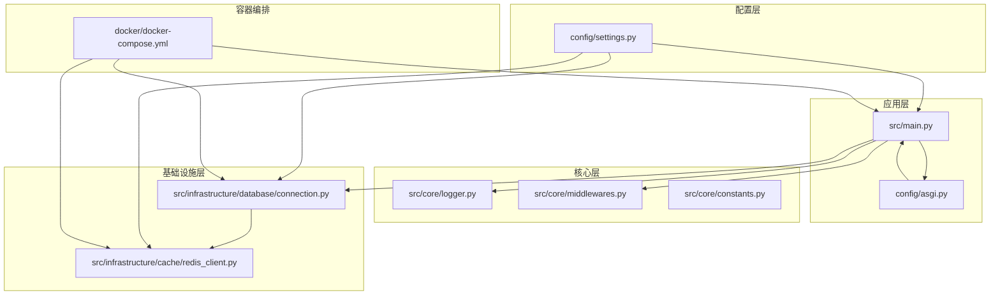
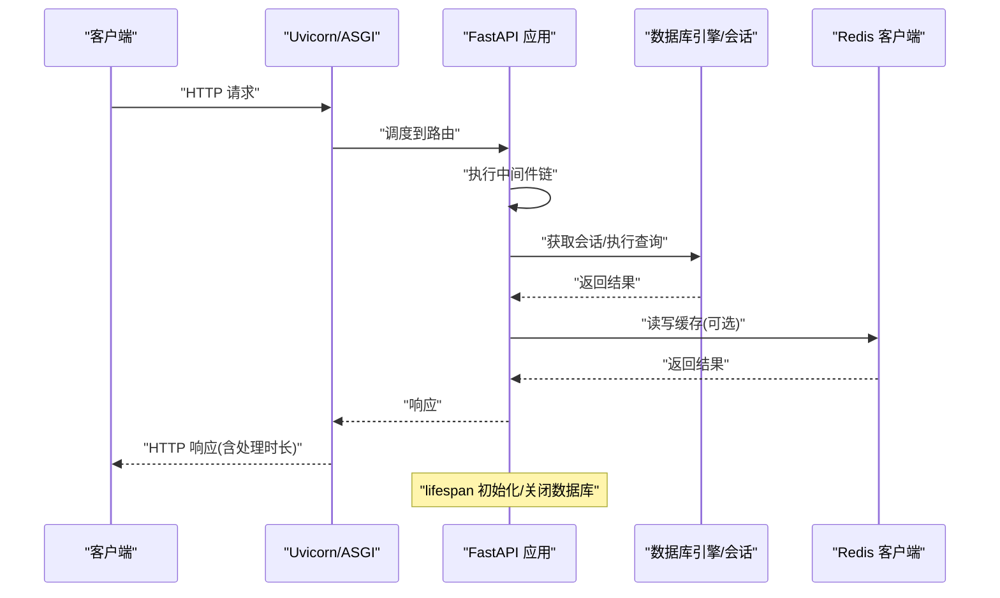
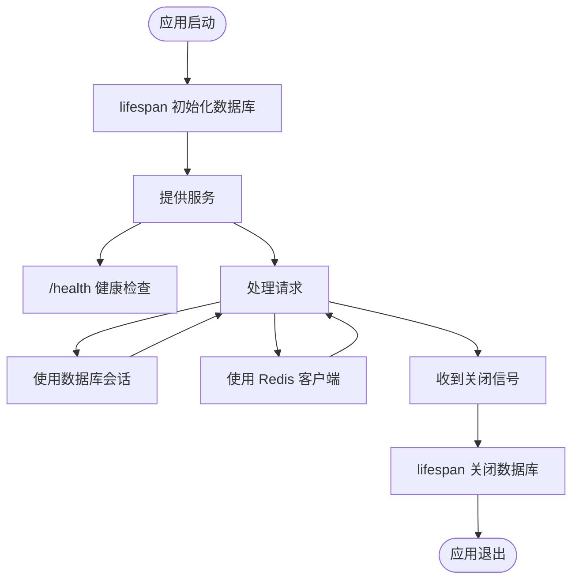
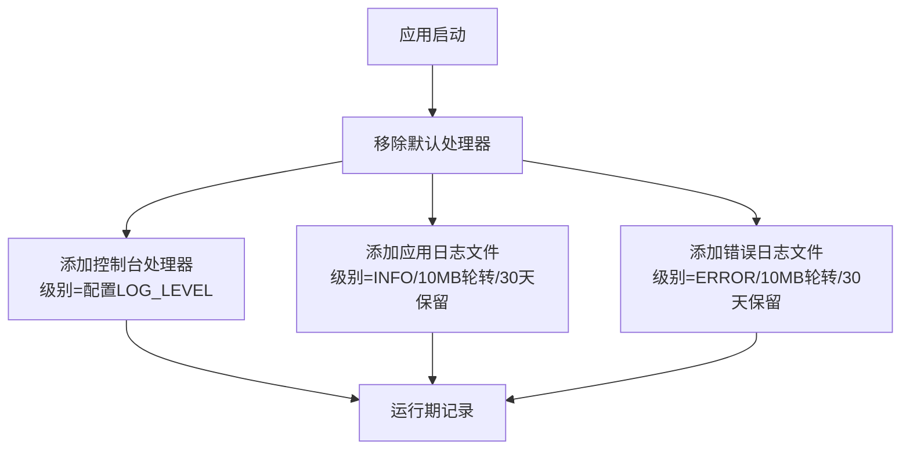
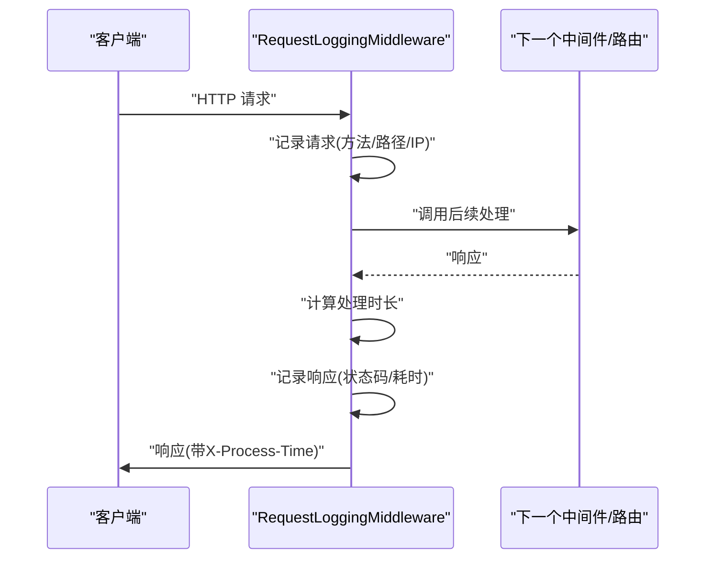
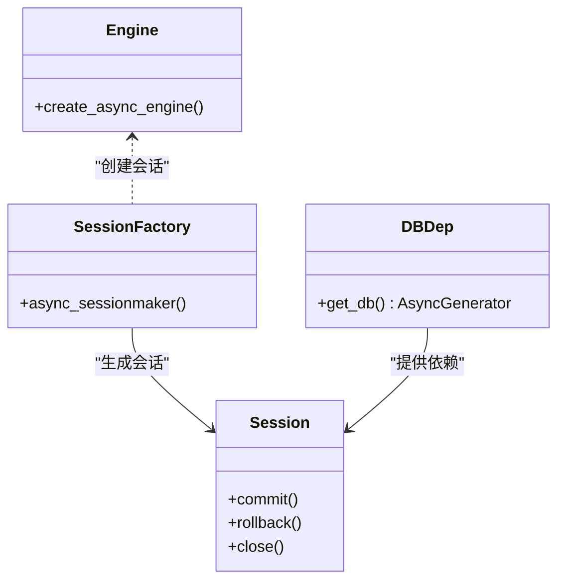
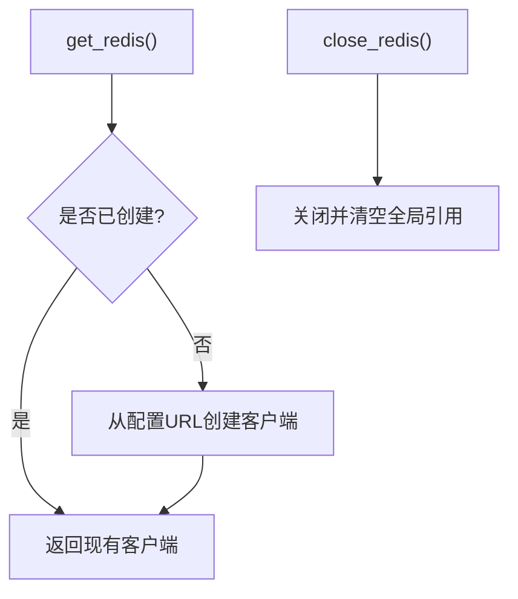
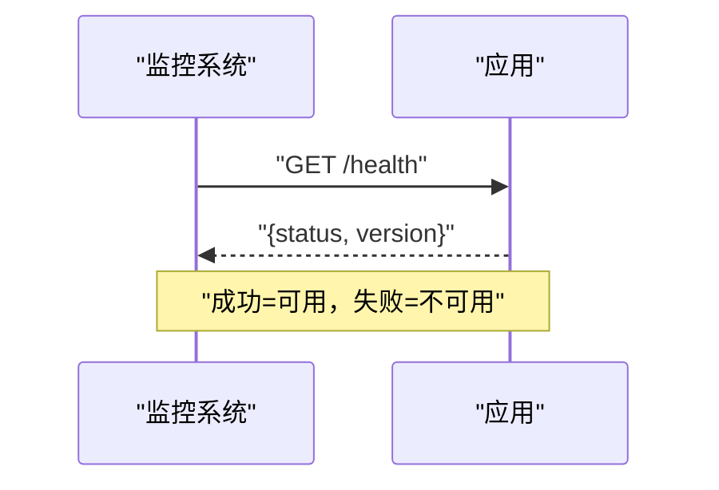
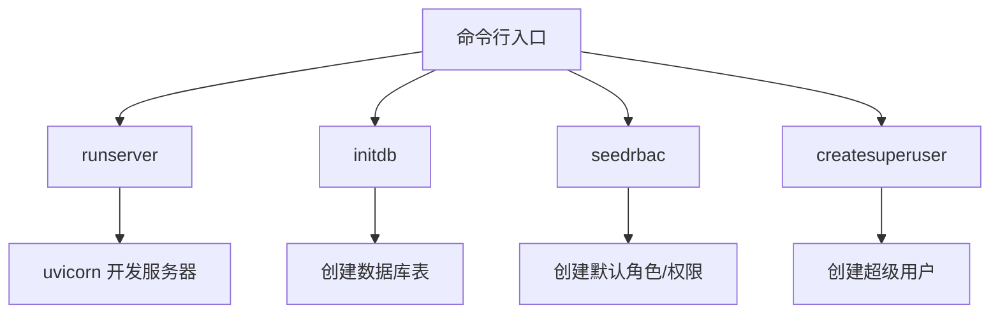
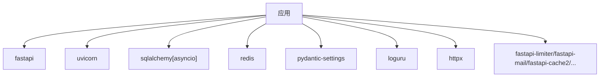

# 监控运维

<cite>
**本文引用的文件**
- [src/main.py](file://src/main.py)
- [config/settings.py](file://config/settings.py)
- [config/asgi.py](file://config/asgi.py)
- [src/core/logger.py](file://src/core/logger.py)
- [src/core/middlewares.py](file://src/core/middlewares.py)
- [src/infrastructure/database/connection.py](file://src/infrastructure/database/connection.py)
- [src/infrastructure/cache/redis_client.py](file://src/infrastructure/cache/redis_client.py)
- [docker/docker-compose.yml](file://docker/docker-compose.yml)
- [scripts/verify_api.py](file://scripts/verify_api.py)
- [manage.py](file://manage.py)
- [pyproject.toml](file://pyproject.toml)
</cite>

## 目录
1. [简介](#简介)
2. [项目结构](#项目结构)
3. [核心组件](#核心组件)
4. [架构总览](#架构总览)
5. [详细组件分析](#详细组件分析)
6. [依赖分析](#依赖分析)
7. [性能考虑](#性能考虑)
8. [故障排查指南](#故障排查指南)
9. [结论](#结论)
10. [附录](#附录)

## 简介
本指南面向监控与运维团队，围绕该 FastAPI 项目在“指标采集与展示、日志管理、健康检查与可用性监控、数据库与缓存监控、告警与通知、性能优化与瓶颈排查、备份与恢复、运维脚本与自动化”等方面提供可落地的实践建议。文档基于仓库现有代码与配置进行分析，并结合最佳实践给出实施路径。

## 项目结构
该项目采用分层架构：核心层负责日志、中间件与异常处理；基础设施层包含数据库与缓存；API 层提供路由与业务接口；配置层通过 pydantic-settings 提供多环境配置；Docker Compose 将应用、数据库与缓存编排为可部署的整体。

**图表来源**
- [src/main.py:1-83](file://src/main.py#L1-L83)
- [config/asgi.py:1-6](file://config/asgi.py#L1-L6)
- [src/core/logger.py:1-48](file://src/core/logger.py#L1-L48)
- [src/core/middlewares.py:1-64](file://src/core/middlewares.py#L1-L64)
- [src/infrastructure/database/connection.py:1-51](file://src/infrastructure/database/connection.py#L1-L51)
- [src/infrastructure/cache/redis_client.py:1-27](file://src/infrastructure/cache/redis_client.py#L1-L27)
- [config/settings.py:1-199](file://config/settings.py#L1-L199)
- [docker/docker-compose.yml:1-59](file://docker/docker-compose.yml#L1-L59)

**章节来源**
- [src/main.py:1-83](file://src/main.py#L1-L83)
- [config/asgi.py:1-6](file://config/asgi.py#L1-L6)
- [config/settings.py:1-199](file://config/settings.py#L1-L199)
- [docker/docker-compose.yml:1-59](file://docker/docker-compose.yml#L1-L59)

## 核心组件
- 应用生命周期与健康检查：应用工厂在 lifespan 中初始化数据库并在关闭时释放连接；提供 /health 健康检查端点。
- 日志系统：使用 loguru 统一输出到控制台与文件，按大小轮转与保留策略管理日志。
- 请求中间件：统一记录请求与响应信息，并在响应头注入处理时长。
- 数据库与缓存：异步 SQLAlchemy 引擎与会话工厂；Redis 客户端连接池管理。
- 多环境配置：通过 pydantic-settings 加载 .env.* 文件，支持 development/production/testing 三套配置。
- 容器编排：Compose 启动应用、PostgreSQL 与 Redis，并挂载日志卷。

**章节来源**
- [src/main.py:19-83](file://src/main.py#L19-L83)
- [src/core/logger.py:1-48](file://src/core/logger.py#L1-L48)
- [src/core/middlewares.py:12-31](file://src/core/middlewares.py#L12-L31)
- [src/infrastructure/database/connection.py:26-51](file://src/infrastructure/database/connection.py#L26-L51)
- [src/infrastructure/cache/redis_client.py:9-27](file://src/infrastructure/cache/redis_client.py#L9-L27)
- [config/settings.py:29-101](file://config/settings.py#L29-L101)
- [docker/docker-compose.yml:1-59](file://docker/docker-compose.yml#L1-L59)

## 架构总览
下图展示了应用启动、请求处理、数据库与缓存交互以及健康检查的关键流程。

**图表来源**
- [src/main.py:19-83](file://src/main.py#L19-L83)
- [src/core/middlewares.py:12-31](file://src/core/middlewares.py#L12-L31)
- [src/infrastructure/database/connection.py:26-51](file://src/infrastructure/database/connection.py#L26-L51)
- [src/infrastructure/cache/redis_client.py:9-27](file://src/infrastructure/cache/redis_client.py#L9-L27)
- [config/asgi.py:1-6](file://config/asgi.py#L1-L6)

## 详细组件分析

### 应用生命周期与健康检查
- 生命周期：在 lifespan 中初始化数据库并在关闭时释放连接，确保资源有序管理。
- 健康检查：提供 /health 端点返回服务状态与版本信息，便于外部监控系统探测。
- 全局异常处理：对自定义异常与通用异常分别处理，保证错误信息一致化输出。

**图表来源**
- [src/main.py:19-83](file://src/main.py#L19-L83)
- [src/infrastructure/database/connection.py:39-51](file://src/infrastructure/database/connection.py#L39-L51)

**章节来源**
- [src/main.py:19-83](file://src/main.py#L19-L83)
- [src/infrastructure/database/connection.py:39-51](file://src/infrastructure/database/connection.py#L39-L51)

### 日志管理策略
- 控制台输出：彩色格式，包含时间、级别、模块名、函数名、行号与消息。
- 文件输出：应用日志与错误日志分离，按 10MB 轮转、30 天保留、zip 压缩。
- 日志级别：通过配置校验，支持 DEBUG/INFO/WARNING/ERROR/CRITICAL。
- 日志位置：容器部署时挂载 logs 目录，便于外部采集。

**图表来源**
- [src/core/logger.py:9-45](file://src/core/logger.py#L9-L45)

**章节来源**
- [src/core/logger.py:1-48](file://src/core/logger.py#L1-L48)
- [config/settings.py:77-85](file://config/settings.py#L77-L85)
- [docker/docker-compose.yml:20-22](file://docker/docker-compose.yml#L20-L22)

### 请求中间件与可观测性
- 请求记录：记录方法、路径与来源 IP；在响应头注入 X-Process-Time。
- 响应统计：记录状态码与处理时长，便于下游监控系统采集。
- 安全扩展：提供 IP 白名单/黑名单中间件，可作为第一道访问控制。

**图表来源**
- [src/core/middlewares.py:12-31](file://src/core/middlewares.py#L12-L31)

**章节来源**
- [src/core/middlewares.py:12-31](file://src/core/middlewares.py#L12-L31)

### 数据库监控配置
- 连接与会话：异步引擎启用 pool_pre_ping；会话工厂在提交/回滚后关闭。
- 依赖注入：通过 get_db 提供会话依赖，确保事务边界清晰。
- 初始化与关闭：在 lifespan 中创建所有表并在关闭时释放引擎。

**图表来源**
- [src/infrastructure/database/connection.py:7-37](file://src/infrastructure/database/connection.py#L7-L37)

**章节来源**
- [src/infrastructure/database/connection.py:1-51](file://src/infrastructure/database/connection.py#L1-L51)

### 缓存服务监控配置
- 客户端管理：全局单例 Redis 客户端，延迟创建与显式关闭。
- 连接参数：从配置读取 REDIS_URL，编码与解码设置为 utf-8。
- 使用场景：可配合速率限制、热点数据缓存等模块使用。

**图表来源**
- [src/infrastructure/cache/redis_client.py:9-27](file://src/infrastructure/cache/redis_client.py#L9-L27)

**章节来源**
- [src/infrastructure/cache/redis_client.py:1-27](file://src/infrastructure/cache/redis_client.py#L1-L27)

### API 健康检查与可用性监控
- 内置健康检查：/health 返回服务状态与版本，适合探活与编排健康检查。
- 功能验证脚本：提供端到端验证流程，覆盖健康检查、登录、受保护端点、RBAC 端点与未认证访问。
- 推荐扩展：结合中间件统计 2xx/4xx/5xx 比例、P95/P99 延迟、并发请求数等指标。

**图表来源**
- [src/main.py:71-75](file://src/main.py#L71-L75)
- [scripts/verify_api.py:8-16](file://scripts/verify_api.py#L8-L16)

**章节来源**
- [src/main.py:71-75](file://src/main.py#L71-L75)
- [scripts/verify_api.py:1-176](file://scripts/verify_api.py#L1-L176)

### 告警机制与通知（实施建议）
- 指标来源：/health、中间件注入的处理时长、数据库/Redis 连接池状态。
- 告警规则示例（建议）：
  - 连续 N 次 /health 失败
  - P95 延迟超过阈值
  - 错误率（5xx 占比）超过阈值
  - 数据库/Redis 连接池空闲数长期为 0
- 通知渠道：邮件、IM、Webhook 等，结合现有邮件依赖进行集成。

[本节为概念性指导，不直接分析具体文件，故不附加章节来源]

### 性能优化与瓶颈排查
- 延迟与吞吐：利用中间件的处理时长与响应状态，结合数据库慢查询日志定位热点 SQL。
- 连接池：调整数据库连接池大小与超时，避免连接争用；监控 Redis 命中率。
- 缓存策略：对读多写少的数据引入缓存，减少数据库压力；注意缓存一致性。
- 并发与限流：结合速率限制中间件与负载均衡，防止突发流量击穿。

[本节为通用指导，不直接分析具体文件，故不附加章节来源]

### 备份策略与数据恢复
- 数据库备份：定期导出 PostgreSQL 数据，结合 WAL 归档实现增量备份。
- 恢复演练：制定 RTO/RPO 目标，定期进行恢复演练。
- 配置与密钥：将敏感配置纳入安全存储，备份与恢复流程需加密传输与存储。

[本节为通用指导，不直接分析具体文件，故不附加章节来源]

### 运维脚本与自动化
- 开发服务器：通过管理脚本启动开发服务器，支持热重载。
- 数据库初始化：一键创建表结构，便于新环境快速就绪。
- RBAC 初始化：批量创建默认角色与权限，确保最小权限原则。
- 自动化建议：将上述命令纳入 CI/CD 流水线，结合容器镜像构建与部署。

**图表来源**
- [manage.py:14-123](file://manage.py#L14-L123)

**章节来源**
- [manage.py:1-127](file://manage.py#L1-L127)

## 依赖分析
- 应用依赖：FastAPI、Uvicorn、SQLAlchemy 异步、Redis、Pydantic Settings、Loguru、HTTPX 等。
- 开发依赖：pytest、ruff、mypy、httpx、factory-boy、faker 等。
- 运行时依赖：日志、缓存、数据库、邮件、限流、分页、缓存等。

**图表来源**
- [pyproject.toml:7-27](file://pyproject.toml#L7-L27)

**章节来源**
- [pyproject.toml:1-74](file://pyproject.toml#L1-L74)

## 性能考虑
- 日志开销：生产环境降低日志级别，避免高频 INFO/DEBUG 写盘。
- 数据库：开启 pool_pre_ping，合理设置连接池大小；对热点查询建立索引。
- 缓存：提升命中率，避免缓存穿透与雪崩；设定合理的过期策略。
- 中间件：仅保留必要中间件，避免重复 IO 与序列化。

[本节为通用指导，不直接分析具体文件，故不附加章节来源]

## 故障排查指南
- 健康检查失败：确认 /health 是否可达，查看应用日志与容器状态。
- 数据库连接异常：检查连接字符串、网络连通性与数据库健康检查。
- Redis 连接异常：检查 REDIS_URL 与网络连通性，确认容器健康检查。
- 请求超时：查看中间件处理时长，定位慢查询与缓存缺失。
- 日志缺失：确认日志目录挂载与轮转策略，核对日志级别配置。

**章节来源**
- [src/main.py:71-75](file://src/main.py#L71-L75)
- [src/core/logger.py:23-45](file://src/core/logger.py#L23-L45)
- [docker/docker-compose.yml:35-54](file://docker/docker-compose.yml#L35-L54)

## 结论
本项目已具备完善的日志、中间件与健康检查基础，结合容器编排可快速落地监控与运维体系。建议在此基础上补充指标采集、告警与通知、性能优化与备份恢复策略，形成闭环的可观测性与可靠性保障。

## 附录
- 多环境配置：开发/生产/测试三套配置，支持 .env.* 文件加载与校验。
- ASGI 入口：生产部署通过 ASGI 应用暴露，便于 Gunicorn/uwsgi 等 WSGI 服务器托管。
- 端到端验证：功能验证脚本覆盖健康检查、认证、RBAC 等关键路径，可用于回归与冒烟测试。

**章节来源**
- [config/settings.py:146-199](file://config/settings.py#L146-L199)
- [config/asgi.py:1-6](file://config/asgi.py#L1-L6)
- [scripts/verify_api.py:137-176](file://scripts/verify_api.py#L137-L176)