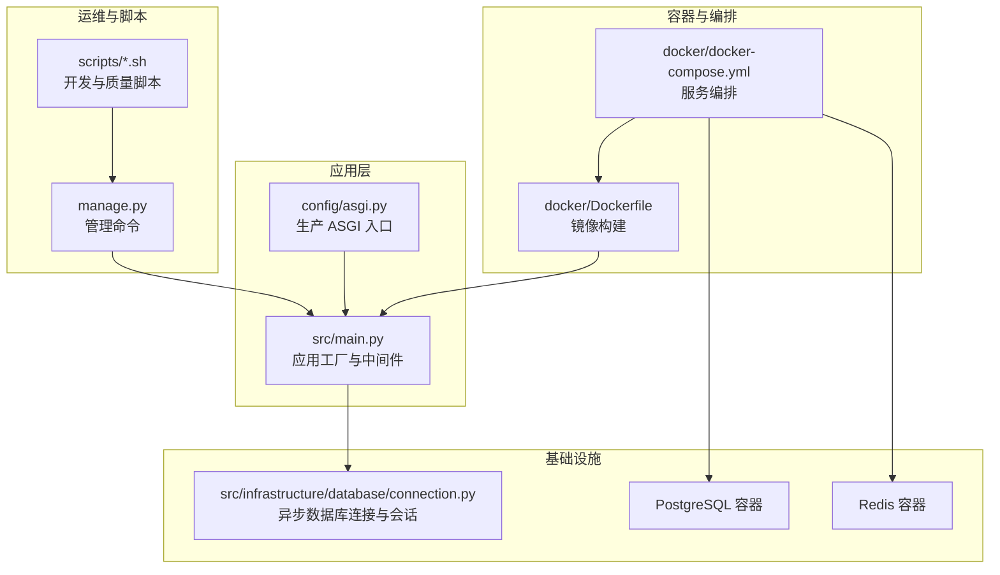
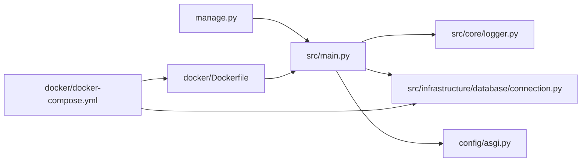

# 部署运维

<cite>
**本文引用的文件**
- [docker/Dockerfile](file://docker/Dockerfile)
- [docker/docker-compose.yml](file://docker/docker-compose.yml)
- [config/asgi.py](file://config/asgi.py)
- [src/main.py](file://src/main.py)
- [src/core/logger.py](file://src/core/logger.py)
- [src/infrastructure/database/connection.py](file://src/infrastructure/database/connection.py)
- [manage.py](file://manage.py)
- [pyproject.toml](file://pyproject.toml)
- [scripts/setup_dev.sh](file://scripts/setup_dev.sh)
- [scripts/setup_dev.bat](file://scripts/setup_dev.bat)
- [scripts/lint.sh](file://scripts/lint.sh)
- [scripts/verify_api.py](file://scripts/verify_api.py)
</cite>

## 目录
1. [简介](#简介)
2. [项目结构](#项目结构)
3. [核心组件](#核心组件)
4. [架构总览](#架构总览)
5. [详细组件分析](#详细组件分析)
6. [依赖关系分析](#依赖关系分析)
7. [性能考量](#性能考量)
8. [故障排查指南](#故障排查指南)
9. [结论](#结论)
10. [附录](#附录)

## 简介
本指南面向部署与运维团队，围绕该 FastAPI 项目提供从容器化构建、容器编排、网络与存储配置，到多环境部署策略、环境变量与配置文件组织、数据库迁移与版本升级自动化、监控与日志管理、负载均衡与高可用、备份与灾备、运维脚本与自动化工具、安全加固与漏洞扫描、以及 CI/CD 流水线配置的全栈运维方案。文档以仓库现有实现为依据，结合最佳实践给出可落地的操作建议。

## 项目结构
该项目采用分层架构与领域驱动设计（DDD），核心运行时由 FastAPI 应用、数据库与缓存组成；通过 Docker 与 docker-compose 实现本地与生产级容器化部署；管理脚本与质量工具保障开发与运维效率。



图表来源
- [src/main.py:1-83](file://src/main.py#L1-L83)
- [config/asgi.py:1-6](file://config/asgi.py#L1-L6)
- [src/infrastructure/database/connection.py:1-51](file://src/infrastructure/database/connection.py#L1-L51)
- [docker/Dockerfile:1-29](file://docker/Dockerfile#L1-L29)
- [docker/docker-compose.yml:1-59](file://docker/docker-compose.yml#L1-L59)
- [manage.py:1-127](file://manage.py#L1-L127)
- [scripts/setup_dev.sh:1-47](file://scripts/setup_dev.sh#L1-L47)

章节来源
- [src/main.py:1-83](file://src/main.py#L1-L83)
- [docker/docker-compose.yml:1-59](file://docker/docker-compose.yml#L1-L59)

## 核心组件
- 应用入口与生命周期：应用工厂负责中间件、异常处理、路由注册与健康检查；生命周期在启动时初始化数据库，在关闭时释放连接。
- 数据库连接：基于 SQLAlchemy 异步引擎，提供会话工厂与依赖注入；支持连接池预热与回滚/提交语义。
- 日志系统：使用 loguru 统一输出到控制台与文件，按大小轮转与保留策略管理日志。
- 生产 ASGI：通过独立 ASGI 文件导出应用实例，便于生产服务器（如 Uvicorn）直接加载。
- 运维脚本：提供开发环境一键安装、格式化、测试、数据库初始化与种子数据导入等命令。
- 容器化：Dockerfile 使用 UV 加速依赖安装，暴露 8000 端口；docker-compose 编排应用、数据库与缓存服务。

章节来源
- [src/main.py:19-79](file://src/main.py#L19-L79)
- [src/infrastructure/database/connection.py:7-37](file://src/infrastructure/database/connection.py#L7-L37)
- [src/core/logger.py:9-45](file://src/core/logger.py#L9-L45)
- [config/asgi.py:1-6](file://config/asgi.py#L1-L6)
- [manage.py:14-93](file://manage.py#L14-L93)
- [docker/Dockerfile:1-29](file://docker/Dockerfile#L1-L29)
- [docker/docker-compose.yml:1-59](file://docker/docker-compose.yml#L1-L59)

## 架构总览
下图展示应用、数据库与缓存在容器内的交互关系，以及健康检查与持久化卷的配置。

```mermaid
graph TB
subgraph "应用服务"
APP["应用容器<br/>监听 8000"]
LOG["日志目录<br/>logs 挂载"]
end
subgraph "数据库服务"
PG["PostgreSQL 容器<br/>5432"]
PGDATA["持久化卷<br/>postgres_data"]
end
subgraph "缓存服务"
RD["Redis 容器<br/>6379"]
RDDATA["持久化卷<br/>redis_data"]
end
APP -- "HTTP 8000" --> APP
APP -- "DATABASE_URL" --> PG
APP -- "REDIS_URL" --> RD
APP -. "挂载" .-> LOG
PG -- "卷" .-> PGDATA
RD -- "卷" .-> RDDATA
```

图表来源
- [docker/docker-compose.yml:4-59](file://docker/docker-compose.yml#L4-L59)
- [docker/Dockerfile:23-28](file://docker/Dockerfile#L23-L28)

## 详细组件分析

### 容器化与镜像构建
- 基础镜像与依赖安装：使用 Python slim 基础镜像，安装系统依赖并通过 UV 安装项目依赖，提升安装速度。
- 工作目录与源码复制：设置工作目录，先复制依赖声明再安装，利用缓存加速；随后复制源码。
- 日志目录与端口：创建 logs 目录用于落盘日志；暴露 8000 端口。
- 启动命令：通过 Uvicorn 启动应用，绑定 0.0.0.0 以允许外部访问。

章节来源
- [docker/Dockerfile:1-29](file://docker/Dockerfile#L1-L29)

### 容器编排与网络配置
- 服务编排：定义应用、数据库与缓存三类服务，分别指定镜像、环境变量、端口映射与健康检查。
- 环境变量：集中于 compose 文件，包含应用环境、数据库连接串与 Redis 连接串。
- 依赖与健康检查：应用服务依赖数据库与缓存健康；数据库与缓存均配置健康检查探针。
- 存储卷：数据库与缓存使用命名卷进行持久化。
- 重启策略：unless-stopped，确保非人为停止的服务自动恢复。

章节来源
- [docker/docker-compose.yml:1-59](file://docker/docker-compose.yml#L1-L59)

### 多环境部署策略
- 开发环境：推荐使用 docker-compose 在本地快速拉起；通过脚本完成虚拟环境、依赖安装、格式化、初始化数据库与种子数据、运行测试。
- 测试环境：可复用 compose 配置，替换环境变量与密钥，启用更严格的日志级别与资源限制。
- 生产环境：建议使用独立的 compose 或 K8s 清单，分离 secrets、持久化卷与网络策略；启用只读根文件系统、最小权限与健康检查。

章节来源
- [scripts/setup_dev.sh:1-47](file://scripts/setup_dev.sh#L1-L47)
- [docker/docker-compose.yml:11-22](file://docker/docker-compose.yml#L11-L22)

### 环境变量与配置文件组织
- 配置入口：应用通过 settings 获取运行参数，如主机、端口、CORS 允许域、日志级别、数据库与缓存连接串等。
- ASGI 入口：生产环境通过独立 ASGI 文件导出应用实例，便于服务器直接加载。
- 管理命令：通过 manage.py 提供 runserver、initdb、seedrbac 等运维命令，统一入口便于 CI/CD 调用。

章节来源
- [src/main.py:6, 31-79](file://src/main.py#L6,L31-L79)
- [config/asgi.py:1-6](file://config/asgi.py#L1-L6)
- [manage.py:14-93](file://manage.py#L14-L93)

### 数据库迁移与版本升级自动化
- 迁移工具：项目包含 Alembic 依赖，适合在生产环境执行数据库迁移。
- 升级流程建议：
  - 在 CI 中对迁移脚本进行静态检查与单元测试；
  - 在预生产环境先行演练；
  - 使用只读模式或备份后执行迁移；
  - 结合健康检查与滚动更新策略降低停机风险。
- 代码内初始化：应用启动时会初始化数据库表，适用于开发与小型生产场景；生产建议使用 Alembic 进行受控迁移。

章节来源
- [pyproject.toml:24](file://pyproject.toml#L24)
- [src/infrastructure/database/connection.py:39-45](file://src/infrastructure/database/connection.py#L39-L45)
- [src/main.py:22-28](file://src/main.py#L22-L28)

### 监控与日志管理
- 日志配置：控制台与文件双通道输出，INFO 与 ERROR 分离，按大小轮转与保留策略管理。
- 健康检查：应用提供 /health 端点，compose 中配置数据库与缓存健康检查，便于编排平台感知服务状态。
- 建议增强：接入集中式日志（如 ELK/Fluentd）、指标采集（Prometheus/Grafana）、链路追踪（OpenTelemetry）与告警（AlertManager）。

章节来源
- [src/core/logger.py:13-45](file://src/core/logger.py#L13-L45)
- [src/main.py:71-74](file://src/main.py#L71-L74)
- [docker/docker-compose.yml:35-54](file://docker/docker-compose.yml#L35-L54)

### 负载均衡与高可用
- 负载均衡：在 compose 场景可通过反向代理（如 Nginx/Traefik）对外暴露；生产建议使用云厂商 LB 或 Ingress。
- 高可用：多副本部署应用容器，结合数据库主从/集群与 Redis 集群；健康检查与自动重启策略保证可用性。
- 会话与缓存：通过 Redis 承载分布式缓存与速率限制等能力，避免状态耦合。

章节来源
- [docker/docker-compose.yml:15-22](file://docker/docker-compose.yml#L15-L22)
- [docker/docker-compose.yml:42-54](file://docker/docker-compose.yml#L42-L54)

### 备份与灾难恢复
- 数据备份：定期导出 PostgreSQL 数据卷快照或使用逻辑备份；验证恢复流程。
- 配置备份：将 secrets、环境变量与 compose 文件纳入版本控制或密管系统。
- 灾难恢复：制定 RTO/RPO 指标，演练跨区容灾与服务切换流程。

章节来源
- [docker/docker-compose.yml:33-39, 47-53](file://docker/docker-compose.yml#L33-L39,L47-L53)

### 运维脚本与自动化工具
- 开发脚本：Linux/macOS 与 Windows 双版本脚本，完成虚拟环境、依赖安装、格式化、初始化数据库、种子数据与测试。
- 质量脚本：统一的格式化与静态检查脚本，便于 CI 执行。
- 功能验证：集成测试脚本覆盖健康检查、登录、受保护端点、RBAC 等关键路径。

章节来源
- [scripts/setup_dev.sh:1-47](file://scripts/setup_dev.sh#L1-L47)
- [scripts/setup_dev.bat:1-44](file://scripts/setup_dev.bat#L1-L44)
- [scripts/lint.sh:1-19](file://scripts/lint.sh#L1-L19)
- [scripts/verify_api.py:1-176](file://scripts/verify_api.py#L1-L176)

### 安全加固与漏洞扫描
- 最小化镜像：使用 slim 基础镜像，减少攻击面。
- 只读根文件系统：生产镜像启用只读根文件系统，仅挂载必要卷。
- 密钥管理：将敏感信息放入 secrets，不写入镜像或配置文件。
- 漏洞扫描：在 CI 中集成镜像与依赖扫描（如 Trivy/Snyk），阻断高危漏洞进入生产。
- 网络隔离：使用自定义网络与防火墙策略，限制不必要的端口暴露。

章节来源
- [docker/Dockerfile:1-29](file://docker/Dockerfile#L1-L29)
- [docker/docker-compose.yml:11-22](file://docker/docker-compose.yml#L11-L22)

### CI/CD 流水线配置与部署策略
- 构建阶段：拉取代码 → 安装依赖（UV）→ 运行质量检查（格式化、静态检查、类型检查）→ 构建镜像。
- 测试阶段：运行单元与集成测试，生成覆盖率报告。
- 安全扫描：镜像与依赖漏洞扫描，阻断高危问题。
- 部署阶段：推送镜像至私有仓库 → 应用配置变更（环境变量、secrets）→ 滚动更新 → 健康检查 → 回滚策略。
- 多环境：分支策略区分 develop/test/prod；不同环境使用不同 compose 或 K8s 清单。

章节来源
- [pyproject.toml:48-74](file://pyproject.toml#L48-L74)
- [scripts/lint.sh:1-19](file://scripts/lint.sh#L1-L19)
- [docker/docker-compose.yml:1-59](file://docker/docker-compose.yml#L1-L59)

## 依赖关系分析
应用与基础设施之间的依赖关系如下：



图表来源
- [src/main.py:1-83](file://src/main.py#L1-L83)
- [src/core/logger.py:1-48](file://src/core/logger.py#L1-L48)
- [src/infrastructure/database/connection.py:1-51](file://src/infrastructure/database/connection.py#L1-L51)
- [config/asgi.py:1-6](file://config/asgi.py#L1-L6)
- [manage.py:1-127](file://manage.py#L1-L127)
- [docker/Dockerfile:1-29](file://docker/Dockerfile#L1-L29)
- [docker/docker-compose.yml:1-59](file://docker/docker-compose.yml#L1-L59)

章节来源
- [src/main.py:1-83](file://src/main.py#L1-L83)
- [docker/docker-compose.yml:1-59](file://docker/docker-compose.yml#L1-L59)

## 性能考量
- 数据库连接池：启用 pre_ping 与合理的超时设置，避免连接失效导致的请求延迟。
- 缓存命中：合理设置 Redis 缓存键与过期策略，降低数据库压力。
- 日志级别：生产环境适度降低日志量，避免 I/O 影响。
- 并发与并发：根据 CPU/内存资源设置 worker 数量与连接数上限。
- 网络与带宽：在容器间使用内部网络，减少外网暴露；对静态资源使用 CDN。

## 故障排查指南
- 应用无法启动：检查日志文件与容器状态，确认数据库与缓存健康检查是否通过。
- 数据库连接失败：核对 DATABASE_URL 与网络连通性；查看连接池与超时配置。
- 认证与授权问题：确认 JWT 密钥、令牌有效期与权限模型；检查受保护端点的访问控制。
- 健康检查失败：查看 /health 返回值与依赖服务状态；调整探针间隔与重试次数。
- 日志缺失：确认日志目录挂载与权限；检查 loguru 输出配置。

章节来源
- [src/core/logger.py:13-45](file://src/core/logger.py#L13-L45)
- [docker/docker-compose.yml:35-54](file://docker/docker-compose.yml#L35-L54)
- [src/main.py:71-74](file://src/main.py#L71-L74)

## 结论
本指南基于仓库现有实现，给出了从容器化构建、编排与网络配置，到多环境部署、配置与环境变量管理、数据库迁移与升级自动化、监控与日志、高可用与备份、运维脚本与自动化、安全加固与漏洞扫描、以及 CI/CD 流水线的完整运维方案。建议在生产环境中进一步完善密管、监控、告警与灾备体系，并持续优化镜像与依赖的安全与性能。

## 附录
- 快速启动（开发）
  - Linux/macOS：执行开发脚本，自动完成虚拟环境、依赖、格式化、初始化数据库与种子数据、测试。
  - Windows：执行对应批处理脚本。
- 生产部署建议
  - 使用独立 compose/K8s 清单，分离 secrets 与持久化卷；
  - 启用只读根文件系统与最小权限；
  - 配置健康检查与滚动更新；
  - 引入集中式日志、指标与链路追踪。

章节来源
- [scripts/setup_dev.sh:1-47](file://scripts/setup_dev.sh#L1-L47)
- [scripts/setup_dev.bat:1-44](file://scripts/setup_dev.bat#L1-L44)
- [docker/docker-compose.yml:1-59](file://docker/docker-compose.yml#L1-L59)