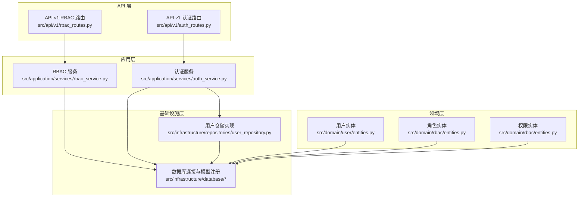
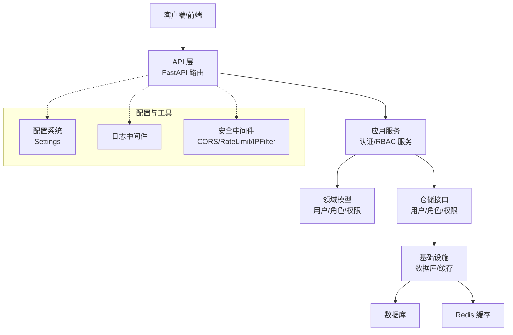
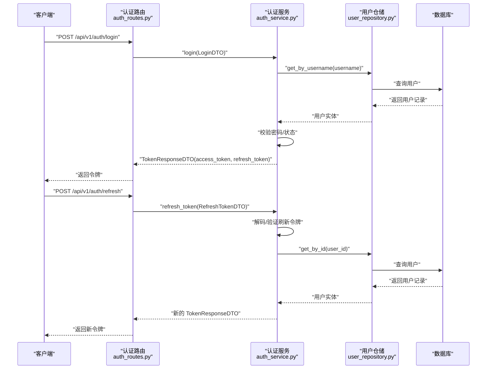
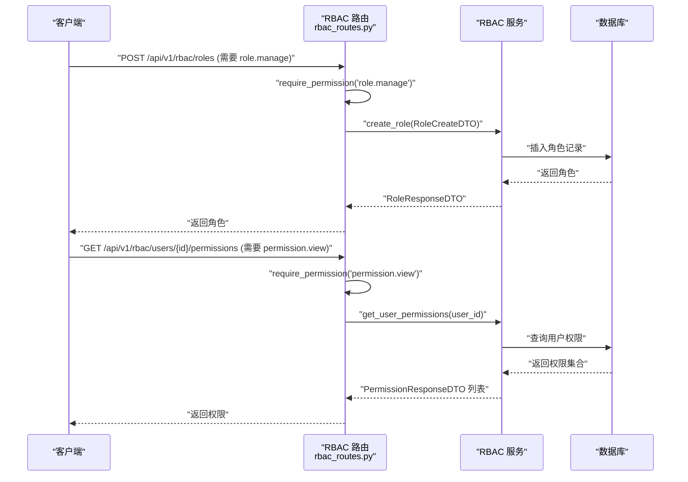
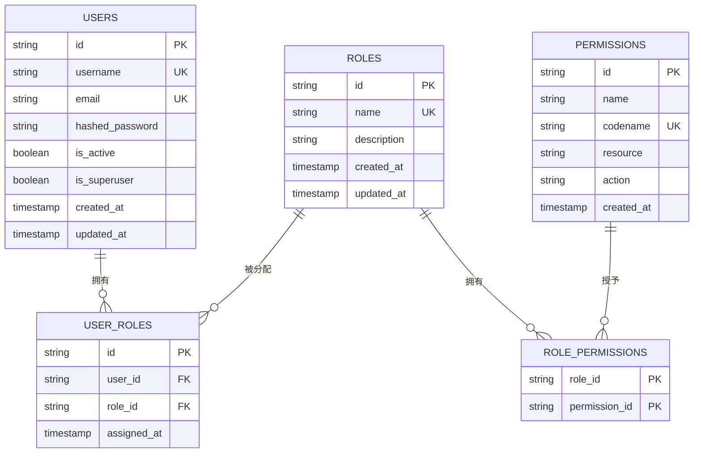
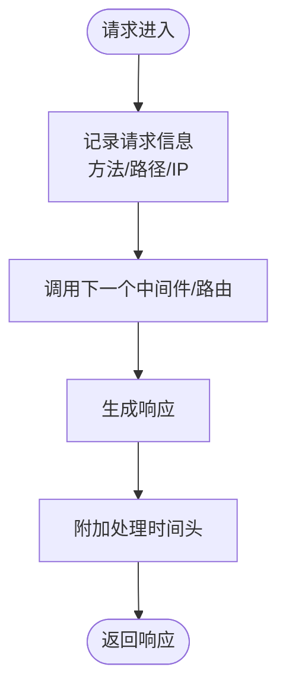
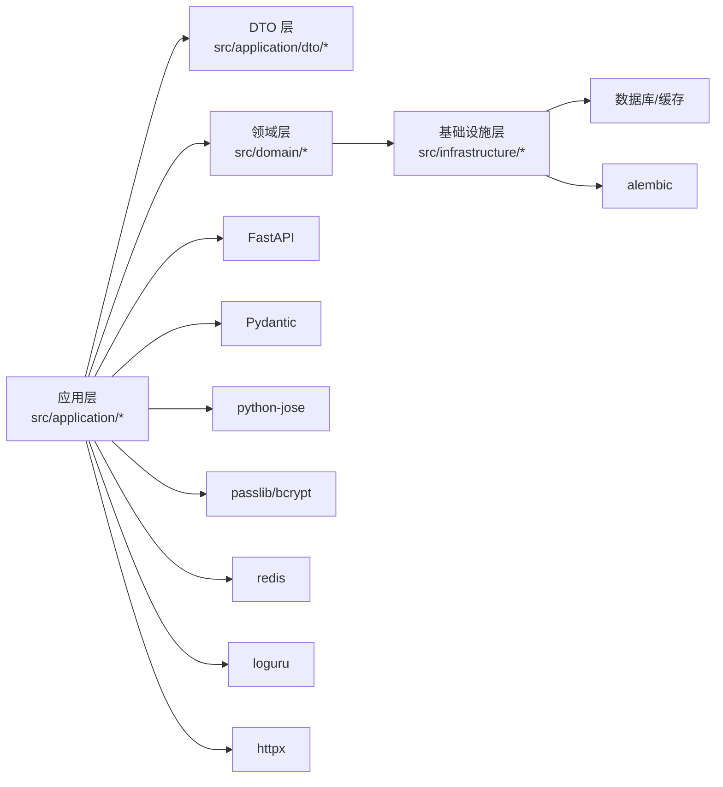

# 项目概述

<cite>
**本文档引用的文件**
- [pyproject.toml](file://pyproject.toml)
- [README.md](file://README.md)
- [src/main.py](file://src/main.py)
- [config/settings/base.py](file://config/settings/base.py)
- [src/domain/rbac/entities.py](file://src/domain/rbac/entities.py)
- [src/application/services/auth_service.py](file://src/application/services/auth_service.py)
- [src/api/v1/auth_routes.py](file://src/api/v1/auth_routes.py)
- [src/domain/user/entities.py](file://src/domain/user/entities.py)
- [src/infrastructure/database/models.py](file://src/infrastructure/database/models.py)
- [src/core/constants.py](file://src/core/constants.py)
- [docker/docker-compose.yml](file://docker/docker-compose.yml)
- [src/application/dto/auth_dto.py](file://src/application/dto/auth_dto.py)
- [src/infrastructure/repositories/user_repository.py](file://src/infrastructure/repositories/user_repository.py)
- [src/api/v1/rbac_routes.py](file://src/api/v1/rbac_routes.py)
- [src/core/middlewares.py](file://src/core/middlewares.py)
</cite>

## 目录
1. [引言](#引言)
2. [项目结构](#项目结构)
3. [核心组件](#核心组件)
4. [架构总览](#架构总览)
5. [详细组件分析](#详细组件分析)
6. [依赖分析](#依赖分析)
7. [性能考虑](#性能考虑)
8. [故障排除指南](#故障排除指南)
9. [结论](#结论)
10. [附录](#附录)

## 引言
Hello-FastApi 是一个基于 FastAPI 的企业级权限认证系统，融合领域驱动设计（DDD）与基于角色的访问控制（RBAC）架构理念。项目旨在提供安全、可扩展、可维护的认证与授权能力，支持多租户、细粒度权限管理与高并发场景下的稳定运行。

本项目的核心价值体现在：
- 安全性：采用 JWT 令牌机制、密码哈希与刷新令牌策略，结合速率限制与 IP 过滤中间件，构建多层防护体系。
- 可扩展性：通过 DDD 分层解耦业务逻辑，配合异步 SQLAlchemy 和 Redis 缓存，满足企业级高并发需求。
- 可维护性：清晰的模块划分、完善的 DTO 层与统一异常处理，降低变更成本并提升开发效率。
- 易部署：提供 Docker Compose 编排，一键启动数据库与缓存服务，便于本地开发与生产部署。

## 项目结构
项目采用分层架构与功能模块化组织，主要分为以下层次：
- API 层：负责路由定义、请求参数校验与响应封装，使用 Pydantic DTO 进行输入输出约束。
- 应用层：实现业务用例，协调领域服务与仓储，保证业务规则的正确执行。
- 领域层：承载核心业务模型与不变式，如用户、角色、权限等实体及其行为。
- 基础设施层：提供数据库连接、缓存客户端、外部服务集成等支撑能力。
- 配置与工具：集中管理环境变量、日志、中间件与常量定义。

**图表来源**
- [src/api/v1/auth_routes.py:1-34](file://src/api/v1/auth_routes.py#L1-L34)
- [src/api/v1/rbac_routes.py:1-168](file://src/api/v1/rbac_routes.py#L1-L168)
- [src/application/services/auth_service.py:1-67](file://src/application/services/auth_service.py#L1-L67)
- [src/infrastructure/repositories/user_repository.py:1-61](file://src/infrastructure/repositories/user_repository.py#L1-L61)
- [src/domain/user/entities.py:1-38](file://src/domain/user/entities.py#L1-L38)
- [src/domain/rbac/entities.py:1-79](file://src/domain/rbac/entities.py#L1-L79)
- [src/infrastructure/database/models.py:1-10](file://src/infrastructure/database/models.py#L1-L10)

**章节来源**
- [src/main.py:1-83](file://src/main.py#L1-L83)
- [config/settings/base.py:1-86](file://config/settings/base.py#L1-L86)
- [src/core/constants.py:1-29](file://src/core/constants.py#L1-L29)

## 核心组件
- 应用入口与生命周期管理：通过应用程序工厂创建 FastAPI 实例，配置 CORS、请求日志中间件、全局异常处理器，并在启动时初始化数据库，在关闭时释放连接。
- 配置系统：基于 Pydantic Settings 的环境变量加载，支持开发、测试、生产三套配置，提供统一的设置访问接口。
- 认证服务：实现登录、令牌刷新与当前用户查询，结合密码服务与令牌服务完成身份验证与会话管理。
- RBAC 管理：提供角色、权限的增删改查与用户角色分配、权限查询等接口，配合权限依赖装饰器实现细粒度访问控制。
- 数据持久化：使用 SQLAlchemy 异步 ORM 映射用户、角色、权限等实体，通过仓储模式隔离数据访问细节。
- 中间件与安全：内置请求日志中间件与 IP 白黑名单过滤中间件，结合速率限制与 JWT 机制保障系统安全。

**章节来源**
- [src/main.py:19-83](file://src/main.py#L19-L83)
- [config/settings/base.py:6-86](file://config/settings/base.py#L6-L86)
- [src/application/services/auth_service.py:13-67](file://src/application/services/auth_service.py#L13-L67)
- [src/api/v1/rbac_routes.py:25-168](file://src/api/v1/rbac_routes.py#L25-L168)
- [src/infrastructure/repositories/user_repository.py:11-61](file://src/infrastructure/repositories/user_repository.py#L11-L61)
- [src/core/middlewares.py:12-64](file://src/core/middlewares.py#L12-L64)

## 架构总览
系统采用分层架构与 DDD 思想，自顶向下分为 API 层、应用层、领域层与基础设施层；同时引入 RBAC 权限模型与 DTO 数据传输对象，确保职责清晰、边界明确。

**图表来源**
- [src/main.py:31-83](file://src/main.py#L31-L83)
- [config/settings/base.py:71-86](file://config/settings/base.py#L71-L86)
- [src/core/middlewares.py:12-64](file://src/core/middlewares.py#L12-L64)
- [src/application/services/auth_service.py:13-67](file://src/application/services/auth_service.py#L13-L67)
- [src/api/v1/rbac_routes.py:1-168](file://src/api/v1/rbac_routes.py#L1-L168)

## 详细组件分析

### 认证流程（登录与令牌刷新）
该流程展示了从 API 调用到应用服务再到仓储与领域服务的完整链路，体现 DDD 的分层与职责分离。

**图表来源**
- [src/api/v1/auth_routes.py:14-25](file://src/api/v1/auth_routes.py#L14-L25)
- [src/application/services/auth_service.py:21-66](file://src/application/services/auth_service.py#L21-L66)
- [src/infrastructure/repositories/user_repository.py:17-25](file://src/infrastructure/repositories/user_repository.py#L17-L25)

**章节来源**
- [src/api/v1/auth_routes.py:1-34](file://src/api/v1/auth_routes.py#L1-L34)
- [src/application/services/auth_service.py:1-67](file://src/application/services/auth_service.py#L1-L67)
- [src/application/dto/auth_dto.py:6-25](file://src/application/dto/auth_dto.py#L6-L25)
- [src/infrastructure/repositories/user_repository.py:1-61](file://src/infrastructure/repositories/user_repository.py#L1-L61)

### RBAC 权限管理流程
该流程展示角色与权限的创建、查询与分配，强调权限依赖装饰器在路由层的强制校验。

**图表来源**
- [src/api/v1/rbac_routes.py:25-168](file://src/api/v1/rbac_routes.py#L25-L168)
- [src/domain/rbac/entities.py:20-79](file://src/domain/rbac/entities.py#L20-L79)

**章节来源**
- [src/api/v1/rbac_routes.py:1-168](file://src/api/v1/rbac_routes.py#L1-L168)
- [src/domain/rbac/entities.py:1-79](file://src/domain/rbac/entities.py#L1-L79)
- [src/core/constants.py:11-29](file://src/core/constants.py#L11-L29)

### 数据模型与关系
系统使用 SQLAlchemy ORM 映射用户、角色、权限等实体，并通过关联表实现角色与权限的多对多关系，用户与角色的多对多关系通过中间表携带分配时间等元数据。

**图表来源**
- [src/domain/user/entities.py:16-38](file://src/domain/user/entities.py#L16-L38)
- [src/domain/rbac/entities.py:20-79](file://src/domain/rbac/entities.py#L20-L79)
- [src/infrastructure/database/models.py:1-10](file://src/infrastructure/database/models.py#L1-L10)

**章节来源**
- [src/domain/user/entities.py:1-38](file://src/domain/user/entities.py#L1-L38)
- [src/domain/rbac/entities.py:1-79](file://src/domain/rbac/entities.py#L1-L79)
- [src/infrastructure/database/models.py:1-10](file://src/infrastructure/database/models.py#L1-L10)

### 请求处理与日志中间件
请求在进入业务逻辑前经过日志中间件记录方法、路径与耗时，并在响应中附加处理时间头，便于监控与调试。

**图表来源**
- [src/core/middlewares.py:15-31](file://src/core/middlewares.py#L15-L31)

**章节来源**
- [src/core/middlewares.py:1-64](file://src/core/middlewares.py#L1-L64)

## 依赖分析
项目采用现代化 Python 技术栈，关键依赖及其作用如下：
- FastAPI：提供高性能异步 Web 框架与自动 OpenAPI 文档生成功能。
- SQLAlchemy asyncio：异步 ORM，支持 PostgreSQL/SQLite 等数据库，满足高并发读写。
- Pydantic：数据验证与序列化，用于 DTO 与配置模型。
- python-jose：JWT 令牌生成与解析，保障会话安全。
- passlib/bcrypt：密码哈希与验证，保护用户凭据。
- redis：缓存与速率限制，提升响应速度与抗攻击能力。
- alembic：数据库迁移工具，确保 Schema 变更可控。
- loguru：结构化日志，简化日志配置与输出。
- httpx：HTTP 客户端，用于测试与外部服务集成。

**图表来源**
- [pyproject.toml:7-27](file://pyproject.toml#L7-L27)
- [src/application/services/auth_service.py:1-11](file://src/application/services/auth_service.py#L1-L11)
- [src/application/dto/auth_dto.py:1-25](file://src/application/dto/auth_dto.py#L1-L25)
- [src/infrastructure/repositories/user_repository.py:1-9](file://src/infrastructure/repositories/user_repository.py#L1-L9)

**章节来源**
- [pyproject.toml:1-74](file://pyproject.toml#L1-L74)

## 性能考虑
- 异步 I/O：使用 SQLAlchemy asyncio 与 FastAPI 异步特性，减少阻塞，提升吞吐量。
- 缓存策略：利用 Redis 存储会话与热点数据，降低数据库压力。
- 连接池与事务：合理配置数据库连接池大小与超时，避免资源泄露。
- 日志与监控：通过中间件记录请求耗时与状态码，辅助性能分析与瓶颈定位。
- 速率限制：结合限流中间件与数据库索引优化，防止滥用与 DDoS 攻击。

## 故障排除指南
- 启动失败：检查数据库连接串与 Redis 地址是否正确，确认容器健康状态与端口映射。
- 认证错误：核对 JWT 秘钥、算法与过期时间配置，确保刷新令牌有效且用户状态正常。
- 权限不足：确认用户角色与权限分配，检查路由上的权限依赖装饰器是否正确配置。
- 日志排查：查看日志中间件输出的请求与响应信息，定位异常请求与错误堆栈。

**章节来源**
- [src/main.py:22-28](file://src/main.py#L22-L28)
- [config/settings/base.py:20-46](file://config/settings/base.py#L20-L46)
- [src/core/middlewares.py:15-31](file://src/core/middlewares.py#L15-L31)

## 结论
Hello-FastApi 将 DDD 与 RBAC 融合到 FastAPI 生态中，形成一套安全、可扩展、易维护的企业级认证与授权解决方案。通过清晰的分层设计、严格的 DTO 约束与完善的基础设施支持，项目能够快速适配复杂业务场景并持续演进。

## 附录
- 版本信息：项目版本为 0.1.0，遵循语义化版本管理。
- 开发与测试：提供 pytest 测试框架与类型检查工具，支持单元与集成测试。
- 部署建议：使用 Docker Compose 编排，生产环境建议启用 HTTPS、密钥轮换与审计日志。

**章节来源**
- [pyproject.toml:3-4](file://pyproject.toml#L3-L4)
- [docker/docker-compose.yml:1-59](file://docker/docker-compose.yml#L1-L59)