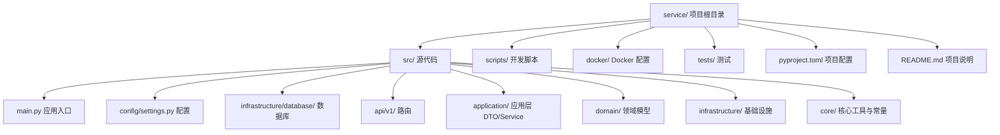
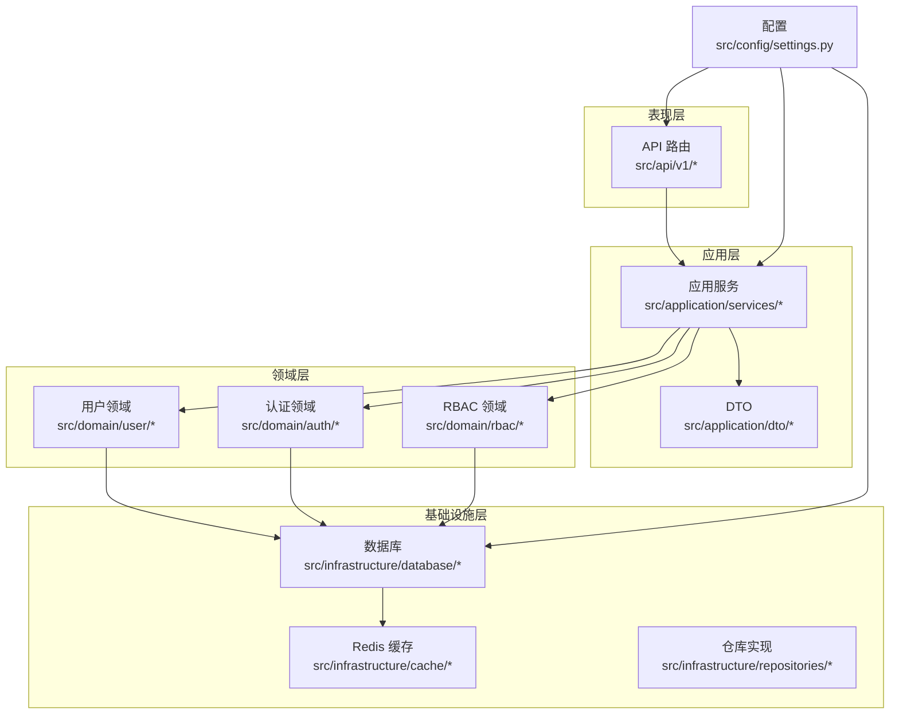
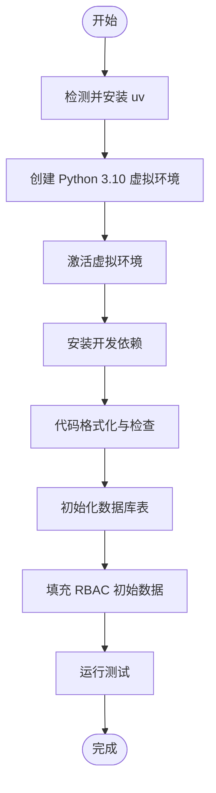
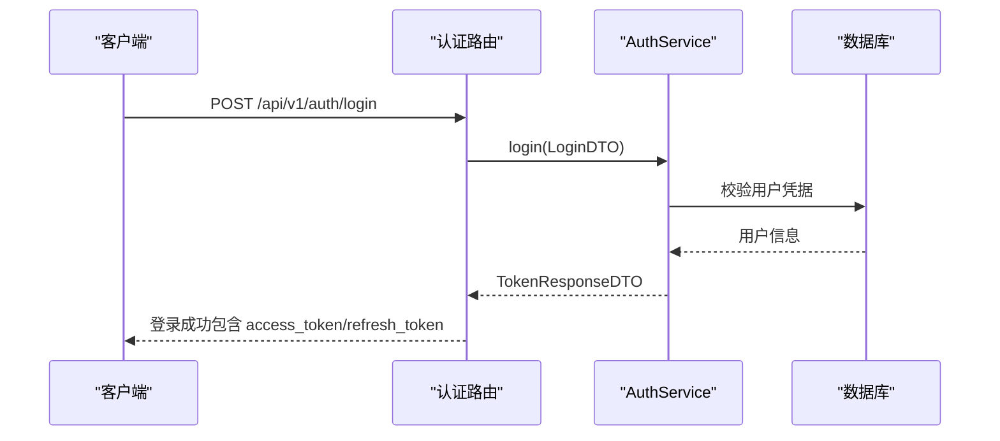
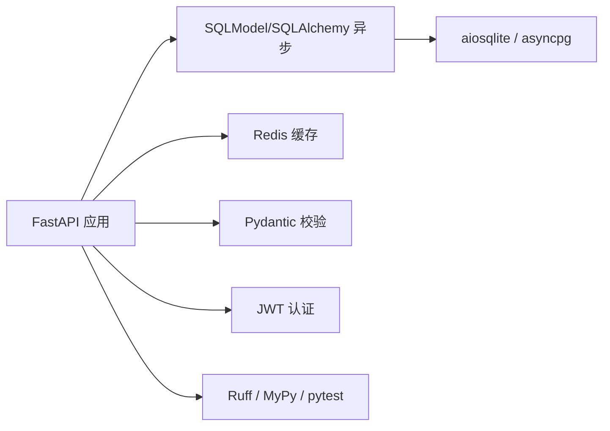

# 快速开始

<cite>
**本文引用的文件**
- [service/README.md](file://service/README.md)
- [service/pyproject.toml](file://service/pyproject.toml)
- [service/src/main.py](file://service/src/main.py)
- [service/src/config/settings.py](file://service/src/config/settings.py)
- [service/scripts/cli.py](file://service/scripts/cli.py)
- [service/scripts/setup_dev.sh](file://service/scripts/setup_dev.sh)
- [service/scripts/setup_dev.bat](file://service/scripts/setup_dev.bat)
- [service/src/infrastructure/database/connection.py](file://service/src/infrastructure/database/connection.py)
- [service/docker/docker-compose.yml](file://service/docker/docker-compose.yml)
- [service/src/api/v1/auth_routes.py](file://service/src/api/v1/auth_routes.py)
- [service/src/core/constants.py](file://service/src/core/constants.py)
- [service/scripts/verify_api.py](file://service/scripts/verify_api.py)
</cite>

## 目录
1. [简介](#简介)
2. [项目结构](#项目结构)
3. [核心组件](#核心组件)
4. [架构总览](#架构总览)
5. [详细组件分析](#详细组件分析)
6. [依赖关系分析](#依赖关系分析)
7. [性能考虑](#性能考虑)
8. [故障排除指南](#故障排除指南)
9. [结论](#结论)
10. [附录](#附录)

## 简介
本指南面向首次接触 Hello-FastApi 的开发者，帮助你在最短时间内完成环境搭建、依赖安装、数据库初始化与项目启动，并提供首个 API 请求示例与验证方法。项目采用 FastAPI + DDD + RBAC 架构，支持 SQLite（开发）与 PostgreSQL（生产），并提供一键脚本与 Docker 部署方案。

## 项目结构
- 服务端位于 service/ 目录，包含源码、脚本、Docker 配置与测试。
- 前端位于 web/ 目录，与后端通过 API 交互。
- 本快速开始聚焦于 service/ 的环境搭建与启动流程。

**图表来源**
- [service/README.md:27-93](file://service/README.md#L27-L93)
- [service/src/main.py:1-96](file://service/src/main.py#L1-L96)

**章节来源**
- [service/README.md:27-93](file://service/README.md#L27-L93)

## 核心组件
- 应用入口与生命周期：负责创建 FastAPI 实例、注册中间件与全局异常处理器、挂载路由、以及数据库初始化与关闭。
- 配置系统：支持 development/production/testing 三套配置，按优先级从系统环境变量到 .env.* 文件再到默认值加载。
- 管理命令：提供 runserver、createsuperuser、initdb、seedrbac 等常用命令。
- 数据库：使用异步 SQLAlchemy 与 SQLModel，支持 SQLite（开发）与 PostgreSQL（生产）。
- 认证与 RBAC：提供登录、刷新、受保护端点与角色/权限体系。

**章节来源**
- [service/src/main.py:19-96](file://service/src/main.py#L19-L96)
- [service/src/config/settings.py:41-198](file://service/src/config/settings.py#L41-L198)
- [service/scripts/cli.py:22-135](file://service/scripts/cli.py#L22-L135)
- [service/src/infrastructure/database/connection.py:23-35](file://service/src/infrastructure/database/connection.py#L23-L35)

## 架构总览
后端采用分层架构（DDD），核心模块如下：
- 表现层：API 路由（src/api/v1）
- 应用层：DTO 与 Service（src/application）
- 领域层：实体与业务规则（src/domain）
- 基础设施层：数据库、缓存、仓库实现（src/infrastructure）

**图表来源**
- [service/src/main.py:34-96](file://service/src/main.py#L34-L96)
- [service/src/config/settings.py:41-198](file://service/src/config/settings.py#L41-L198)

## 详细组件分析

### 环境要求与安装
- 系统要求
  - Python 版本：3.10 及以上
  - 包管理工具：推荐使用 uv（可自动安装）
- 一键安装（推荐）
  - Linux/Mac：执行脚本自动安装 uv、创建虚拟环境、安装依赖、格式化代码、初始化数据库、填充 RBAC 数据并运行测试。
  - Windows：同上，使用批处理脚本。
- 手动安装
  - 安装 uv
  - 创建并激活 Python 3.10 虚拟环境
  - 安装开发依赖（包含 pytest、ruff、mypy 等）
- 环境变量与配置
  - 通过 APP_ENV 切换 development/production/testing
  - 配置加载顺序：系统环境变量 > .env.{APP_ENV} > .env > 默认值

**章节来源**
- [service/README.md:97-129](file://service/README.md#L97-L129)
- [service/README.md:141-179](file://service/README.md#L141-L179)
- [service/scripts/setup_dev.sh:1-47](file://service/scripts/setup_dev.sh#L1-L47)
- [service/scripts/setup_dev.bat:1-44](file://service/scripts/setup_dev.bat#L1-L44)
- [service/src/config/settings.py:144-198](file://service/src/config/settings.py#L144-L198)

### 项目启动
- 使用管理命令启动开发服务器
  - runserver：根据配置文件中的 HOST/PORT 启动服务，开发模式下启用热重载
- 访问文档
  - Swagger 文档：http://localhost:8000/api/docs
  - ReDoc 文档：http://localhost:8000/api/redoc
- 健康检查
  - GET /health：确认服务可用

**章节来源**
- [service/scripts/cli.py:22-30](file://service/scripts/cli.py#L22-L30)
- [service/src/main.py:84-87](file://service/src/main.py#L84-L87)
- [service/README.md:131-140](file://service/README.md#L131-L140)

### 数据库初始化与 RBAC 初始数据
- 初始化数据库表
  - 命令：initdb
  - 功能：创建所有表（基于 SQLModel metadata）
- 填充 RBAC 初始数据
  - 命令：seedrbac
  - 默认角色：admin、user、moderator
  - 默认权限：用户、角色、权限、菜单相关基础权限
- 开发数据库
  - SQLite 文件位于 service/sql/dev.db；测试数据库位于 service/sql/test.db

**章节来源**
- [service/scripts/cli.py:59-65](file://service/scripts/cli.py#L59-L65)
- [service/scripts/cli.py:67-101](file://service/scripts/cli.py#L67-L101)
- [service/src/infrastructure/database/connection.py:23-35](file://service/src/infrastructure/database/connection.py#L23-L35)
- [service/src/core/constants.py:11-37](file://service/src/core/constants.py#L11-L37)

### 开发环境初始化流程（含数据库与初始数据）

**图表来源**
- [service/scripts/setup_dev.sh:8-47](file://service/scripts/setup_dev.sh#L8-L47)
- [service/scripts/setup_dev.bat:6-44](file://service/scripts/setup_dev.bat#L6-L44)
- [service/scripts/cli.py:59-101](file://service/scripts/cli.py#L59-L101)

### 第一个 API 请求与验证
- 健康检查
  - 方法：GET /health
  - 用途：确认服务正常运行
- 用户登录
  - 方法：POST /api/v1/auth/login
  - 用途：获取访问令牌与刷新令牌
- 获取当前用户信息（受保护端点）
  - 方法：GET /api/v1/auth/me
  - 需要：在请求头添加 Authorization: Bearer <access_token>
- 自动验证脚本
  - 提供端到端验证流程：健康检查 → 登录 → 受保护端点 → 更新资料 → RBAC 端点 → 未认证访问测试
  - 使用：python scripts/verify_api.py

**图表来源**
- [service/src/api/v1/auth_routes.py:19-35](file://service/src/api/v1/auth_routes.py#L19-L35)
- [service/src/application/dto/auth_dto.py:7-54](file://service/src/application/dto/auth_dto.py#L7-L54)

**章节来源**
- [service/scripts/verify_api.py:8-176](file://service/scripts/verify_api.py#L8-L176)
- [service/src/api/v1/auth_routes.py:19-86](file://service/src/api/v1/auth_routes.py#L19-L86)

### Docker 部署（生产环境）
- 使用 docker-compose 启动应用、PostgreSQL 与 Redis
- 环境变量
  - APP_ENV=production
  - DATABASE_URL=postgresql+asyncpg://postgres:postgres@db:5432/hello_fastapi
  - REDIS_URL=redis://redis:6379/0
- 健康检查
  - 应用健康检查：/health
  - 数据库与 Redis 健康检查：内置命令

**章节来源**
- [service/docker/docker-compose.yml:1-65](file://service/docker/docker-compose.yml#L1-L65)

## 依赖关系分析
- 语言与框架
  - Python 3.10+、FastAPI、Uvicorn
- 数据库与缓存
  - 异步 SQLAlchemy + SQLModel、aiosqlite（开发）、asyncpg（生产）、Redis
- 认证与校验
  - JWT（python-jose）、Pydantic、bcrypt
- 工具链
  - Ruff（格式化与检查）、MyPy（类型检查）、pytest（测试）
- 项目构建
  - Hatchling（构建后端）

**图表来源**
- [service/pyproject.toml:1-76](file://service/pyproject.toml#L1-L76)

**章节来源**
- [service/pyproject.toml:1-76](file://service/pyproject.toml#L1-L76)

## 性能考虑
- 异步 I/O：使用异步数据库引擎与 SQLModel，提升高并发场景下的吞吐能力。
- 连接池与预检：开启 pool_pre_ping，减少无效连接。
- 开发/生产差异：生产环境禁用 DEBUG、降低日志级别，避免不必要的开销。
- 缓存：Redis 用于会话与热点数据缓存，建议结合业务场景合理使用。

[本节为通用指导，无需特定文件引用]

## 故障排除指南
- 无法找到 uv
  - 现象：脚本报错找不到 uv
  - 解决：按一键脚本自动安装或手动安装 uv 并加入 PATH
- 虚拟环境未激活或 Python 版本不符
  - 现象：安装依赖时报版本不匹配
  - 解决：确保使用 Python 3.10 创建并激活虚拟环境
- 数据库连接失败
  - 现象：启动时报数据库连接错误
  - 解决：检查 DATABASE_URL 是否正确；开发环境使用 SQLite，生产环境使用 PostgreSQL；确认数据库服务可用
- Redis 连接失败
  - 现象：启动时报 Redis 连接错误
  - 解决：确认 Redis 服务已启动且 REDIS_URL 正确
- 端口占用
  - 现象：启动失败提示端口被占用
  - 解决：修改 settings.py 中的 HOST/PORT 或释放端口
- 权限不足导致无法创建用户
  - 现象：POST /api/v1/users 返回 401/403
  - 解决：使用已创建的管理员账户登录，或先执行 seedrbac 初始化默认角色/权限
- 未携带认证访问受保护端点
  - 现象：GET /api/v1/auth/me 返回 401/403
  - 解决：登录后在请求头添加 Authorization: Bearer <access_token>

**章节来源**
- [service/scripts/setup_dev.sh:8-14](file://service/scripts/setup_dev.sh#L8-L14)
- [service/scripts/setup_dev.bat:6-12](file://service/scripts/setup_dev.bat#L6-L12)
- [service/src/config/settings.py:57-67](file://service/src/config/settings.py#L57-L67)
- [service/scripts/verify_api.py:127-135](file://service/scripts/verify_api.py#L127-L135)

## 结论
通过本快速开始指南，你已经完成了环境准备、依赖安装、数据库初始化与 RBAC 初始数据填充，并成功启动了服务。你可以使用 scripts/verify_api.py 或浏览器访问 API 文档进行首个请求验证。如需部署到生产环境，可参考 docker-compose 配置与生产环境启动方式。

[本节为总结性内容，无需特定文件引用]

## 附录

### 常用命令清单
- 启动开发服务器：python -m scripts.cli runserver
- 创建超级管理员：python -m scripts.cli createsuperuser
- 初始化数据库：python -m scripts.cli initdb
- 填充 RBAC 初始数据：python -m scripts.cli seedrbac
- 运行测试：pytest
- 一键开发环境初始化（Linux/Mac）：bash scripts/setup_dev.sh
- 一键开发环境初始化（Windows）：scripts\setup_dev.bat

**章节来源**
- [service/README.md:181-188](file://service/README.md#L181-L188)
- [service/scripts/cli.py:103-131](file://service/scripts/cli.py#L103-L131)