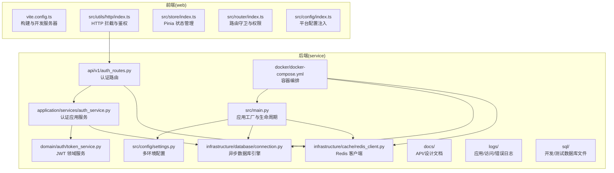
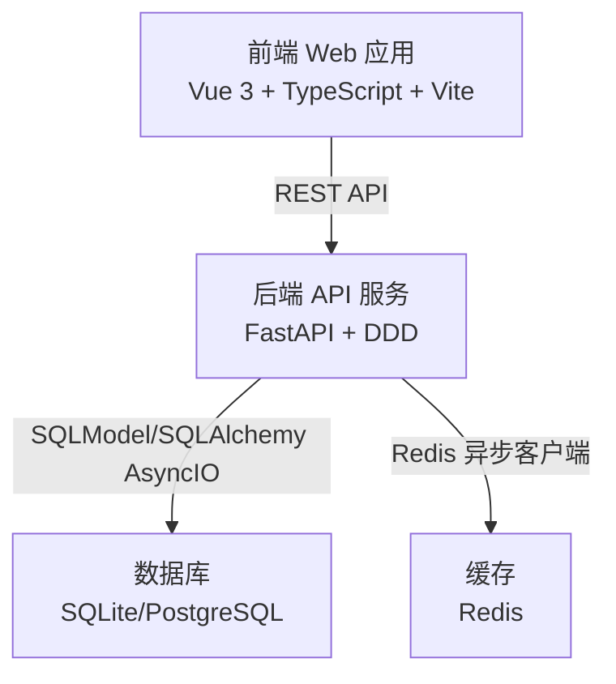
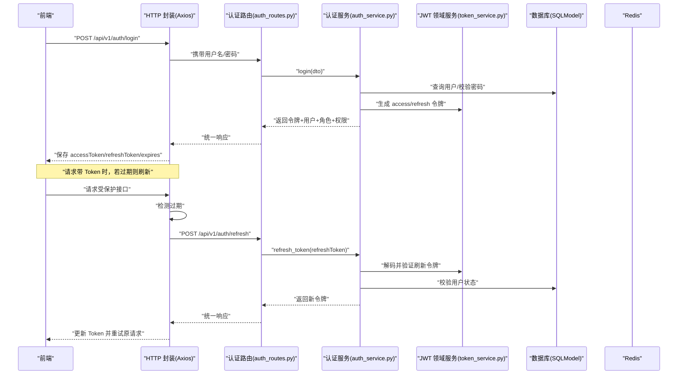
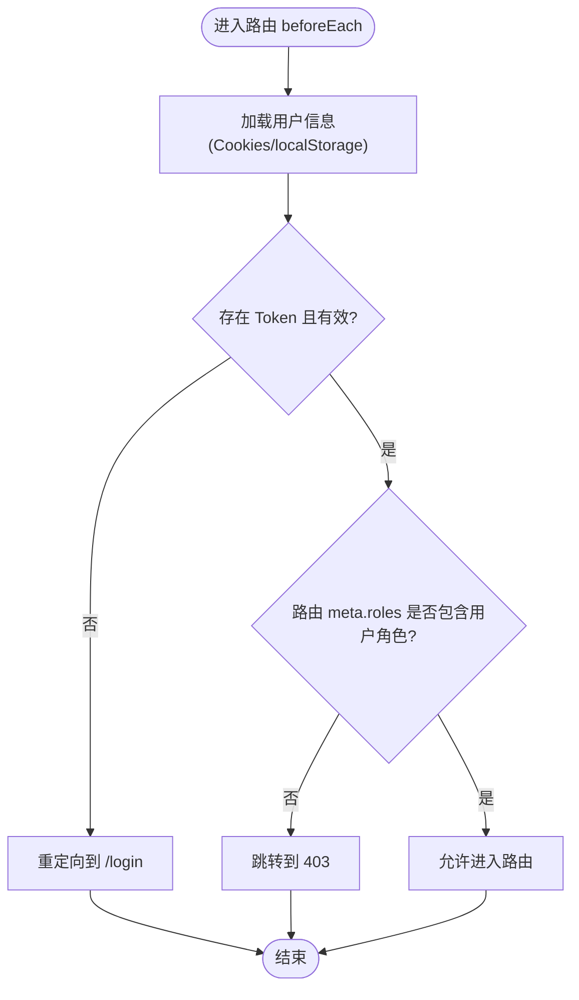
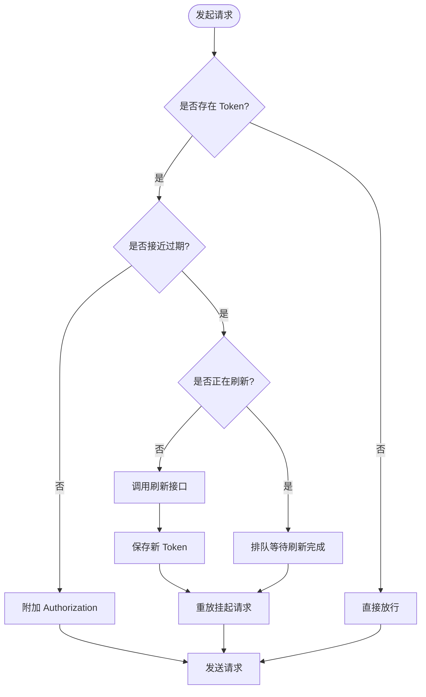
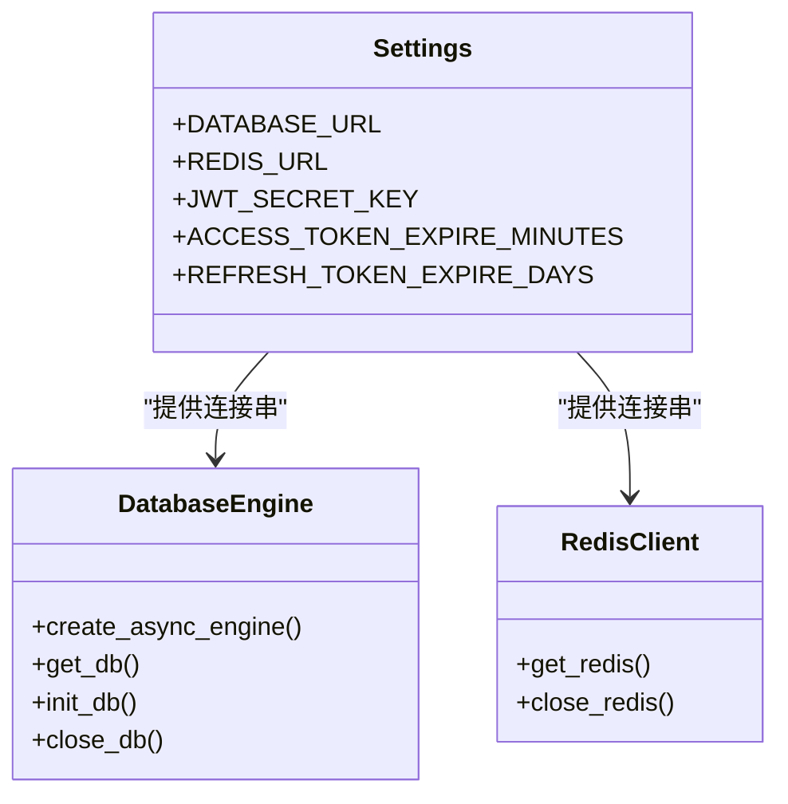

# 技术栈

<cite>
**本文引用的文件**
- [service/pyproject.toml](file://service/pyproject.toml)
- [web/package.json](file://web/package.json)
- [service/README.md](file://service/README.md)
- [web/README.md](file://web/README.md)
- [service/src/main.py](file://service/src/main.py)
- [service/src/config/settings.py](file://service/src/config/settings.py)
- [service/src/infrastructure/cache/redis_client.py](file://service/src/infrastructure/cache/redis_client.py)
- [service/src/domain/auth/token_service.py](file://service/src/domain/auth/token_service.py)
- [service/src/infrastructure/database/connection.py](file://service/src/infrastructure/database/connection.py)
- [service/src/api/v1/auth_routes.py](file://service/src/api/v1/auth_routes.py)
- [service/src/application/services/auth_service.py](file://service/src/application/services/auth_service.py)
- [service/docker/docker-compose.yml](file://service/docker/docker-compose.yml)
- [web/vite.config.ts](file://web/vite.config.ts)
- [web/src/config/index.ts](file://web/src/config/index.ts)
- [web/src/store/index.ts](file://web/src/store/index.ts)
- [web/src/router/index.ts](file://web/src/router/index.ts)
- [web/src/utils/http/index.ts](file://web/src/utils/http/index.ts)
</cite>

## 目录
1. [简介](#简介)
2. [项目结构](#项目结构)
3. [核心组件](#核心组件)
4. [架构总览](#架构总览)
5. [详细组件分析](#详细组件分析)
6. [依赖分析](#依赖分析)
7. [性能考量](#性能考量)
8. [故障排查指南](#故障排查指南)
9. [结论](#结论)
10. [附录](#附录)

## 简介
本文件面向 Hello-FastApi 项目的后端与前端技术栈，系统梳理并解释：
- 后端技术栈：FastAPI、SQLAlchemy AsyncIO、Pydantic、Redis、JWT、日志与中间件等
- 前端技术栈：Vue 3、TypeScript、Element Plus、Pinia、Vite 等
- 技术选型理由、版本要求与兼容性
- 技术间的协作关系与集成方式
- 开发工具链、构建与部署配置
- 最佳实践与性能优化建议
- 学习路径与参考资料

## 项目结构
项目采用前后端分离架构：
- 后端（service）：基于 FastAPI 的 DDD 分层架构，提供 REST API 与认证、RBAC、缓存、数据库等能力
- 前端（web）：基于 Vue 3 + TypeScript + Vite 的中后台模板，使用 Element Plus、Pinia、Vue Router 等

图表来源
- [service/src/main.py:1-96](file://service/src/main.py#L1-L96)
- [service/src/config/settings.py:1-198](file://service/src/config/settings.py#L1-L198)
- [service/src/infrastructure/database/connection.py:1-35](file://service/src/infrastructure/database/connection.py#L1-L35)
- [service/src/infrastructure/cache/redis_client.py:1-24](file://service/src/infrastructure/cache/redis_client.py#L1-L24)
- [service/src/api/v1/auth_routes.py:1-86](file://service/src/api/v1/auth_routes.py#L1-L86)
- [service/src/application/services/auth_service.py:1-154](file://service/src/application/services/auth_service.py#L1-L154)
- [service/src/domain/auth/token_service.py:1-45](file://service/src/domain/auth/token_service.py#L1-L45)
- [service/docker/docker-compose.yml:1-65](file://service/docker/docker-compose.yml#L1-L65)
- [web/vite.config.ts:1-67](file://web/vite.config.ts#L1-L67)
- [web/src/utils/http/index.ts:1-197](file://web/src/utils/http/index.ts#L1-L197)
- [web/src/store/index.ts:1-10](file://web/src/store/index.ts#L1-L10)
- [web/src/router/index.ts:1-230](file://web/src/router/index.ts#L1-L230)
- [web/src/config/index.ts:1-56](file://web/src/config/index.ts#L1-L56)

章节来源
- [service/README.md:27-93](file://service/README.md#L27-L93)
- [web/README.md:9-239](file://web/README.md#L9-L239)

## 核心组件
- 后端核心
  - 应用工厂与生命周期：统一创建 FastAPI 实例、注册中间件、异常处理器、健康检查与路由
  - 配置系统：多环境配置加载（development/production/testing），支持 .env.* 与系统环境变量
  - 数据库：SQLAlchemy 2.x + SQLModel 异步引擎，自动建表与会话管理
  - 缓存：Redis 异步客户端，集中于基础设施层
  - 认证与授权：JWT 领域服务、密码服务、RBAC 仓储与应用服务
- 前端核心
  - 构建与开发：Vite 配置、插件、依赖预优化、目标浏览器兼容
  - 状态管理：Pinia 单一状态树
  - 路由与权限：Vue Router 动态路由、路由守卫、按钮级权限校验
  - HTTP 与鉴权：Axios 封装、请求拦截、Token 过期刷新、白名单放行

章节来源
- [service/src/main.py:19-96](file://service/src/main.py#L19-L96)
- [service/src/config/settings.py:41-198](file://service/src/config/settings.py#L41-L198)
- [service/src/infrastructure/database/connection.py:9-35](file://service/src/infrastructure/database/connection.py#L9-L35)
- [service/src/infrastructure/cache/redis_client.py:10-24](file://service/src/infrastructure/cache/redis_client.py#L10-L24)
- [service/src/application/services/auth_service.py:15-154](file://service/src/application/services/auth_service.py#L15-L154)
- [service/src/domain/auth/token_service.py:11-45](file://service/src/domain/auth/token_service.py#L11-L45)
- [web/vite.config.ts:12-67](file://web/vite.config.ts#L12-L67)
- [web/src/store/index.ts:1-10](file://web/src/store/index.ts#L1-L10)
- [web/src/router/index.ts:123-222](file://web/src/router/index.ts#L123-L222)
- [web/src/utils/http/index.ts:33-197](file://web/src/utils/http/index.ts#L33-L197)

## 架构总览
后端采用 DDD 分层与 FastAPI 路由/依赖注入结合，前端通过 Axios 封装与 Pinia/Pinia 管理状态，二者通过 REST API 通信。

图表来源
- [service/src/main.py:34-96](file://service/src/main.py#L34-L96)
- [service/src/infrastructure/database/connection.py:9-35](file://service/src/infrastructure/database/connection.py#L9-L35)
- [service/src/infrastructure/cache/redis_client.py:10-24](file://service/src/infrastructure/cache/redis_client.py#L10-L24)
- [web/src/utils/http/index.ts:150-197](file://web/src/utils/http/index.ts#L150-L197)

## 详细组件分析

### 后端：认证与令牌流程
从前端登录到后端认证再到令牌下发，以及前端对过期令牌的刷新策略。

图表来源
- [service/src/api/v1/auth_routes.py:19-86](file://service/src/api/v1/auth_routes.py#L19-L86)
- [service/src/application/services/auth_service.py:26-154](file://service/src/application/services/auth_service.py#L26-L154)
- [service/src/domain/auth/token_service.py:14-45](file://service/src/domain/auth/token_service.py#L14-L45)
- [web/src/utils/http/index.ts:74-122](file://web/src/utils/http/index.ts#L74-L122)
- [web/src/utils/http/index.ts:124-197](file://web/src/utils/http/index.ts#L124-L197)

章节来源
- [service/src/api/v1/auth_routes.py:19-86](file://service/src/api/v1/auth_routes.py#L19-L86)
- [service/src/application/services/auth_service.py:26-154](file://service/src/application/services/auth_service.py#L26-L154)
- [service/src/domain/auth/token_service.py:14-45](file://service/src/domain/auth/token_service.py#L14-L45)
- [web/src/utils/http/index.ts:74-122](file://web/src/utils/http/index.ts#L74-L122)
- [web/src/utils/http/index.ts:124-197](file://web/src/utils/http/index.ts#L124-L197)

### 前端：路由守卫与权限校验
前端通过路由守卫进行登录态与角色/权限校验，支持动态路由与按钮级权限。

图表来源
- [web/src/router/index.ts:123-222](file://web/src/router/index.ts#L123-L222)

章节来源
- [web/src/router/index.ts:123-222](file://web/src/router/index.ts#L123-L222)

### 前端：HTTP 拦截与 Token 刷新
Axios 请求拦截器负责：
- 注入 Authorization 头
- 检测 Token 过期
- 通过刷新接口获取新 Token
- 重放之前被挂起的请求

图表来源
- [web/src/utils/http/index.ts:62-122](file://web/src/utils/http/index.ts#L62-L122)
- [web/src/utils/http/index.ts:124-197](file://web/src/utils/http/index.ts#L124-L197)

章节来源
- [web/src/utils/http/index.ts:62-122](file://web/src/utils/http/index.ts#L62-L122)
- [web/src/utils/http/index.ts:124-197](file://web/src/utils/http/index.ts#L124-L197)

### 后端：数据库与缓存集成
- 数据库：异步引擎 + 会话管理，自动建表
- 缓存：Redis 异步客户端，按需注入使用

图表来源
- [service/src/config/settings.py:57-67](file://service/src/config/settings.py#L57-L67)
- [service/src/infrastructure/database/connection.py:9-35](file://service/src/infrastructure/database/connection.py#L9-L35)
- [service/src/infrastructure/cache/redis_client.py:10-24](file://service/src/infrastructure/cache/redis_client.py#L10-L24)

章节来源
- [service/src/config/settings.py:57-67](file://service/src/config/settings.py#L57-L67)
- [service/src/infrastructure/database/connection.py:9-35](file://service/src/infrastructure/database/connection.py#L9-L35)
- [service/src/infrastructure/cache/redis_client.py:10-24](file://service/src/infrastructure/cache/redis_client.py#L10-L24)

## 依赖分析
- 后端依赖
  - FastAPI + Uvicorn：ASGI 服务器与高性能 API 框架
  - SQLModel + SQLAlchemy AsyncIO：异步 ORM 与 SQL 建模
  - Pydantic Settings：强类型配置加载
  - python-jose + bcrypt：JWT 与密码哈希
  - Redis：缓存与会话状态
  - Loguru：结构化日志
  - httpx：HTTP 客户端
- 前端依赖
  - Vue 3 + TypeScript：渐进式框架与类型系统
  - Element Plus：组件库
  - Pinia：状态管理
  - Vite：构建与开发体验
  - Axios：HTTP 客户端
  - Vue Router：路由管理

章节来源
- [service/pyproject.toml:7-20](file://service/pyproject.toml#L7-L20)
- [web/package.json:49-114](file://web/package.json#L49-L114)
- [web/package.json:115-176](file://web/package.json#L115-L176)

## 性能考量
- 后端
  - 异步 I/O：SQLModel AsyncIO 与 Redis 异步客户端减少阻塞
  - 依赖注入与会话池：减少连接建立成本
  - 中间件与异常处理：统一处理与日志，避免泄漏
  - 配置缓存：Pydantic Settings 单例缓存
- 前端
  - Vite 依赖预优化与按需加载，提升首开与开发体验
  - Axios 请求/响应拦截减少样板代码
  - Pinia 轻量状态管理，避免过度渲染
- 部署
  - Docker Compose：一键启动应用、数据库与缓存
  - 健康检查：容器健康度保障

章节来源
- [service/src/config/settings.py:186-198](file://service/src/config/settings.py#L186-L198)
- [service/docker/docker-compose.yml:23-28](file://service/docker/docker-compose.yml#L23-L28)
- [web/vite.config.ts:35-45](file://web/vite.config.ts#L35-L45)

## 故障排查指南
- 后端
  - 配置加载顺序：系统环境变量 > .env.{APP_ENV} > .env > 默认值
  - 常见错误：422 参数校验失败、500 未捕获异常、CORS 跨域问题
  - 健康检查：/health 返回版本与健康状态
- 前端
  - Token 过期：Axios 自动刷新并重试，若失败则清空本地状态并跳转登录
  - 路由白名单：/login 与 /refresh-token 不需要 Token
  - 构建问题：Node 版本与包管理器版本要求

章节来源
- [service/src/main.py:60-87](file://service/src/main.py#L60-L87)
- [service/src/config/settings.py:144-198](file://service/src/config/settings.py#L144-L198)
- [web/src/utils/http/index.ts:74-122](file://web/src/utils/http/index.ts#L74-L122)
- [web/src/utils/http/index.ts:124-197](file://web/src/utils/http/index.ts#L124-L197)
- [web/package.json:177-180](file://web/package.json#L177-L180)

## 结论
本项目通过 FastAPI 的异步能力与 DDD 分层，结合 Pydantic 的强类型配置与 JWT 认证，形成高内聚低耦合的后端体系；前端以 Vue 3 + Vite 为核心，配合 Axios、Pinia 与 Element Plus，构建现代化中后台体验。两者通过 REST API 协同，具备良好的可维护性与扩展性。

## 附录

### 版本与兼容性
- 后端
  - Python >= 3.10
  - FastAPI >= 0.115.0
  - SQLModel >= 0.0.22
  - Redis >= 5.0.0
  - Pydantic Settings >= 2.0.0
  - python-jose[cryptography] >= 3.3.0
  - bcrypt >= 4.0.0
- 前端
  - Node ^20.19.0 或 >=22.13.0
  - pnpm >= 9
  - Vue 3、TypeScript、Element Plus、Pinia、Vite

章节来源
- [service/README.md:99-101](file://service/README.md#L99-L101)
- [service/pyproject.toml:6-20](file://service/pyproject.toml#L6-L20)
- [web/package.json:177-180](file://web/package.json#L177-L180)

### 开发工具链与构建
- 后端
  - 包管理：uv（推荐）
  - Lint：Ruff（格式化与检查）
  - 类型检查：MyPy
  - 测试：pytest + pytest-asyncio + coverage
- 前端
  - 包管理：pnpm
  - Lint：ESLint + Prettier + Stylelint
  - 构建：Vite（目标 es2015，产物分包优化）

章节来源
- [service/README.md:198-210](file://service/README.md#L198-L210)
- [service/pyproject.toml:22-32](file://service/pyproject.toml#L22-L32)
- [web/package.json:6-23](file://web/package.json#L6-L23)
- [web/package.json:115-176](file://web/package.json#L115-L176)
- [web/vite.config.ts:40-60](file://web/vite.config.ts#L40-L60)

### 部署与运行
- Docker Compose：一键启动应用、数据库与 Redis，包含健康检查
- 生产部署：Gunicorn + Nginx（参考 README 中的命令）

章节来源
- [service/docker/docker-compose.yml:1-65](file://service/docker/docker-compose.yml#L1-L65)
- [service/README.md:240-254](file://service/README.md#L240-L254)

### 学习路径与参考资料
- 后端
  - FastAPI 官方文档与示例
  - SQLModel/SQLAlchemy AsyncIO 异步 ORM
  - Pydantic Settings 多环境配置
  - JWT 与 python-jose
  - Redis 官方 Python 异步客户端
- 前端
  - Vue 3 官方文档与最佳实践
  - TypeScript 官方文档
  - Element Plus 组件库
  - Pinia 状态管理
  - Vite 官方文档与生态插件
  - Axios 官方文档

章节来源
- [service/README.md:15-26](file://service/README.md#L15-L26)
- [web/README.md:9-239](file://web/README.md#L9-L239)