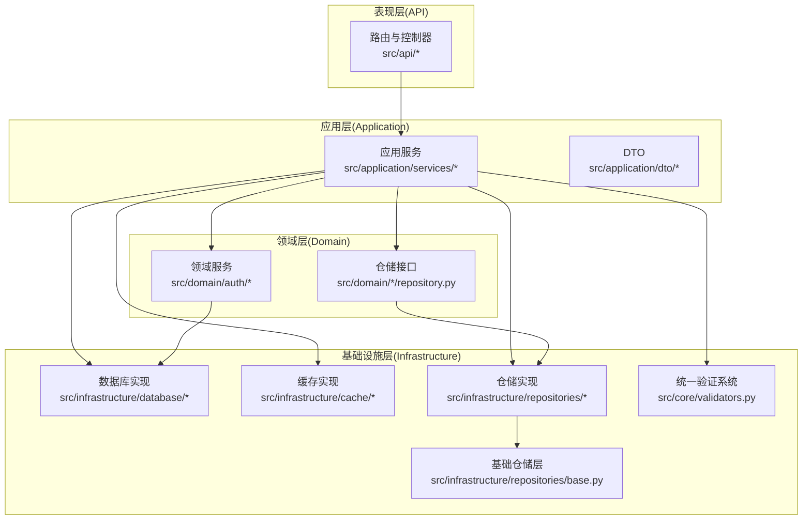
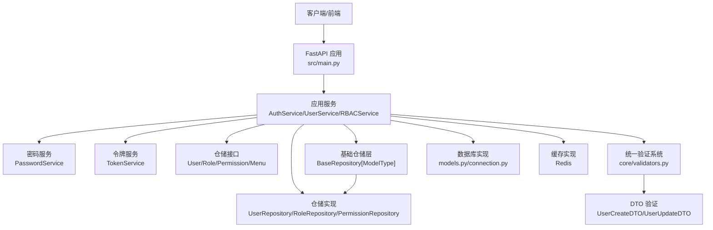
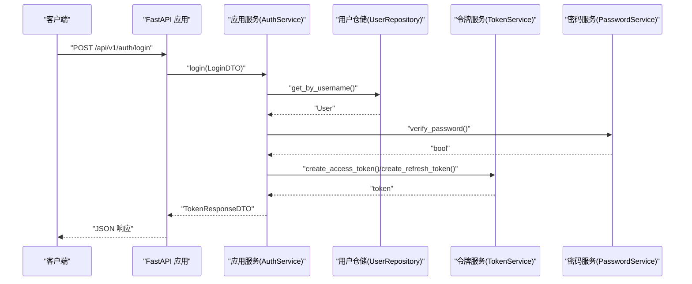
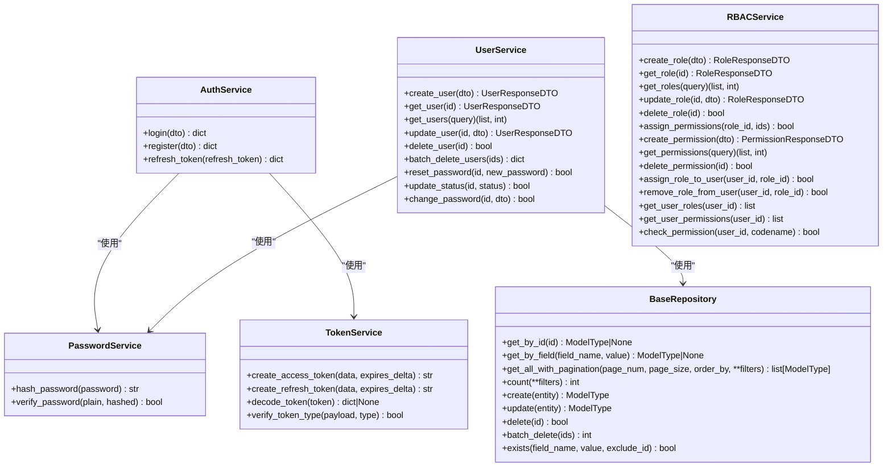
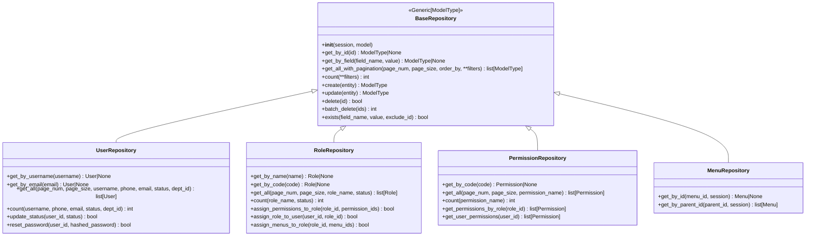
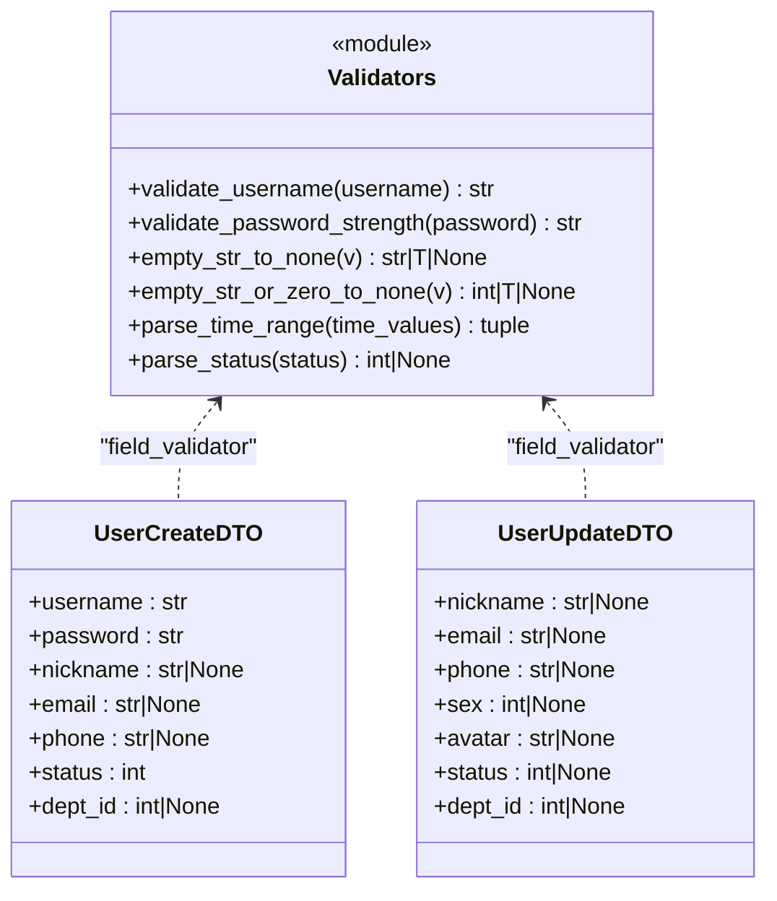
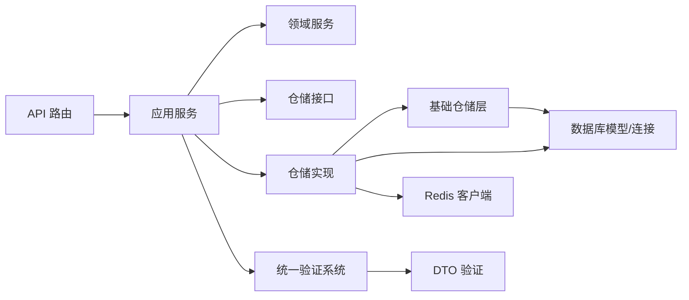

# DDD 领域驱动设计

<cite>
**本文引用的文件**
- [service/src/main.py](file://service/src/main.py)
- [service/README.md](file://service/README.md)
- [service/pyproject.toml](file://service/pyproject.toml)
- [service/src/config/settings.py](file://service/src/config/settings.py)
- [service/src/core/constants.py](file://service/src/core/constants.py)
- [service/src/core/exceptions.py](file://service/src/core/exceptions.py)
- [service/src/core/validators.py](file://service/src/core/validators.py)
- [service/src/domain/auth/password_service.py](file://service/src/domain/auth/password_service.py)
- [service/src/domain/auth/token_service.py](file://service/src/domain/auth/token_service.py)
- [service/src/domain/user/repository.py](file://service/src/domain/user/repository.py)
- [service/src/domain/rbac/repository.py](file://service/src/domain/rbac/repository.py)
- [service/src/domain/menu/repository.py](file://service/src/domain/menu/repository.py)
- [service/src/application/dto/auth_dto.py](file://service/src/application/dto/auth_dto.py)
- [service/src/application/dto/user_dto.py](file://service/src/application/dto/user_dto.py)
- [service/src/application/dto/rbac_dto.py](file://service/src/application/dto/rbac_dto.py)
- [service/src/application/services/auth_service.py](file://service/src/application/services/auth_service.py)
- [service/src/application/services/user_service.py](file://service/src/application/services/user_service.py)
- [service/src/application/services/rbac_service.py](file://service/src/application/services/rbac_service.py)
- [service/src/infrastructure/repositories/base.py](file://service/src/infrastructure/repositories/base.py)
- [service/src/infrastructure/repositories/user_repository.py](file://service/src/infrastructure/repositories/user_repository.py)
- [service/src/infrastructure/repositories/rbac_repository.py](file://service/src/infrastructure/repositories/rbac_repository.py)
- [service/src/infrastructure/repositories/menu_repository.py](file://service/src/infrastructure/repositories/menu_repository.py)
</cite>

## 更新摘要
**变更内容**
- 新增基础仓储层架构改进，引入通用 CRUD 操作基类
- 新增统一验证系统，提供跨领域的数据验证功能
- DTO 层增强，集成统一验证器提升数据质量
- 基础设施层重构，减少重复代码，提高可维护性

## 目录
1. [引言](#引言)
2. [项目结构](#项目结构)
3. [核心组件](#核心组件)
4. [架构总览](#架构总览)
5. [详细组件分析](#详细组件分析)
6. [依赖分析](#依赖分析)
7. [性能考虑](#性能考虑)
8. [故障排查指南](#故障排查指南)
9. [结论](#结论)
10. [附录](#附录)

## 引言
本文件面向 Hello-FastApi 项目，系统化阐述其采用的领域驱动设计（DDD）分层架构，包括表现层（API）、应用层（Application）、领域层（Domain）、基础设施层（Infrastructure）。文档聚焦于：
- 四层职责边界与设计原则
- 业务逻辑与技术实现的分离
- 层间依赖关系与交互流程
- DDD 实践最佳实践与常见设计模式
- 面向复杂业务的架构指导

该服务以 FastAPI 为基础，结合异步 IO、Pydantic 数据校验、SQLModel ORM、Redis 缓存与 JWT 认证，构建高内聚、低耦合、可测试、可演进的 API 体系。

**更新** 本次更新反映了新增的基础仓储层和统一验证系统的架构改进，进一步增强了领域驱动设计的实现。

## 项目结构
服务端代码位于 service/src，采用按"层"组织的目录结构：
- 表现层（API）：路由与控制器，负责请求接入、参数绑定、响应封装与异常处理
- 应用层（Application）：应用服务与 DTO，编排领域用例，协调仓储与外部能力
- 领域层（Domain）：领域模型与领域服务，承载核心业务规则与不变量
- 基础设施层（Infrastructure）：数据库、缓存、仓储实现等技术细节

**图表来源**
- [service/src/main.py:34-96](file://service/src/main.py#L34-L96)
- [service/src/application/services/auth_service.py:15-154](file://service/src/application/services/auth_service.py#L15-L154)
- [service/src/application/services/user_service.py:18-322](file://service/src/application/services/user_service.py#L18-L322)
- [service/src/application/services/rbac_service.py:19-231](file://service/src/application/services/rbac_service.py#L19-L231)
- [service/src/domain/auth/password_service.py:6-21](file://service/src/domain/auth/password_service.py#L6-L21)
- [service/src/domain/auth/token_service.py:11-45](file://service/src/domain/auth/token_service.py#L11-L45)
- [service/src/domain/user/repository.py:8-50](file://service/src/domain/user/repository.py#L8-L50)
- [service/src/domain/rbac/repository.py:8-77](file://service/src/domain/rbac/repository.py#L8-L77)
- [service/src/domain/menu/repository.py:11-43](file://service/src/domain/menu/repository.py#L11-L43)
- [service/src/infrastructure/repositories/base.py:15-211](file://service/src/infrastructure/repositories/base.py#L15-L211)
- [service/src/core/validators.py:1-122](file://service/src/core/validators.py#L1-L122)

**章节来源**
- [service/README.md:27-93](file://service/README.md#L27-L93)
- [service/src/main.py:34-96](file://service/src/main.py#L34-L96)

## 核心组件
- 配置与常量
  - 配置模块：集中管理多环境配置、CORS、JWT、限流、日志级别等
  - 常量模块：API 前缀、分页默认值、RBAC 默认角色与权限
- 异常体系：统一的业务异常基类与细分异常类型，便于全局捕获与标准化响应
- 应用服务：封装业务用例，协调仓储与领域服务，保证事务边界与业务一致性
- 领域服务：密码哈希、JWT 签发与校验等纯业务逻辑
- 仓储接口：定义抽象契约，隔离持久化细节，便于替换实现
- **基础仓储层**：提供通用 CRUD 操作，减少重复代码，提升可维护性
- **统一验证系统**：提供跨领域的数据验证功能，确保数据质量

**更新** 新增基础仓储层和统一验证系统，进一步完善了架构的基础设施能力。

**章节来源**
- [service/src/config/settings.py:41-198](file://service/src/config/settings.py#L41-L198)
- [service/src/core/constants.py:1-37](file://service/src/core/constants.py#L1-L37)
- [service/src/core/exceptions.py:6-60](file://service/src/core/exceptions.py#L6-L60)
- [service/src/application/services/auth_service.py:15-154](file://service/src/application/services/auth_service.py#L15-L154)
- [service/src/application/services/user_service.py:18-322](file://service/src/application/services/user_service.py#L18-L322)
- [service/src/application/services/rbac_service.py:19-231](file://service/src/application/services/rbac_service.py#L19-L231)
- [service/src/domain/auth/password_service.py:6-21](file://service/src/domain/auth/password_service.py#L6-L21)
- [service/src/domain/auth/token_service.py:11-45](file://service/src/domain/auth/token_service.py#L11-L45)
- [service/src/domain/user/repository.py:8-50](file://service/src/domain/user/repository.py#L8-L50)
- [service/src/domain/rbac/repository.py:8-77](file://service/src/domain/rbac/repository.py#L8-L77)
- [service/src/domain/menu/repository.py:11-43](file://service/src/domain/menu/repository.py#L11-L43)
- [service/src/infrastructure/repositories/base.py:15-211](file://service/src/infrastructure/repositories/base.py#L15-L211)
- [service/src/core/validators.py:1-122](file://service/src/core/validators.py#L1-L122)

## 架构总览
四层架构的设计目标是将业务规则与技术实现解耦，确保：
- 表现层仅负责输入输出与协议适配
- 应用层编排业务流程，保证用例边界清晰
- 领域层专注不变量与核心算法
- 基础设施层提供可替换的技术实现

**更新** 新增的基础仓储层和统一验证系统进一步强化了基础设施层的能力，提供了更好的代码复用和数据质量保障。

**图表来源**
- [service/src/main.py:34-96](file://service/src/main.py#L34-L96)
- [service/src/application/services/auth_service.py:15-154](file://service/src/application/services/auth_service.py#L15-L154)
- [service/src/application/services/user_service.py:18-322](file://service/src/application/services/user_service.py#L18-L322)
- [service/src/application/services/rbac_service.py:19-231](file://service/src/application/services/rbac_service.py#L19-L231)
- [service/src/domain/auth/password_service.py:6-21](file://service/src/domain/auth/password_service.py#L6-L21)
- [service/src/domain/auth/token_service.py:11-45](file://service/src/domain/auth/token_service.py#L11-L45)
- [service/src/domain/user/repository.py:8-50](file://service/src/domain/user/repository.py#L8-L50)
- [service/src/domain/rbac/repository.py:8-77](file://service/src/domain/rbac/repository.py#L8-L77)
- [service/src/domain/menu/repository.py:11-43](file://service/src/domain/menu/repository.py#L11-L43)
- [service/src/infrastructure/repositories/base.py:15-211](file://service/src/infrastructure/repositories/base.py#L15-L211)
- [service/src/core/validators.py:1-122](file://service/src/core/validators.py#L1-L122)

## 详细组件分析

### 表现层（API）
- 负责路由注册、中间件、异常处理、健康检查与文档端点
- 通过应用服务编排业务，返回标准化响应
- 统一异常处理：AppException、参数校验异常、通用异常

**图表来源**
- [service/src/main.py:34-96](file://service/src/main.py#L34-L96)
- [service/src/application/services/auth_service.py:26-74](file://service/src/application/services/auth_service.py#L26-L74)
- [service/src/application/dto/auth_dto.py:7-54](file://service/src/application/dto/auth_dto.py#L7-L54)
- [service/src/domain/auth/token_service.py:14-30](file://service/src/domain/auth/token_service.py#L14-L30)
- [service/src/domain/auth/password_service.py:17-20](file://service/src/domain/auth/password_service.py#L17-L20)

**章节来源**
- [service/src/main.py:34-96](file://service/src/main.py#L34-L96)
- [service/src/application/dto/auth_dto.py:7-54](file://service/src/application/dto/auth_dto.py#L7-L54)

### 应用层（Application）
- 应用服务：封装业务用例，协调仓储与领域服务，保证事务边界
- DTO：输入/输出数据结构，配合 Pydantic 提供类型安全与校验
- 典型用例：
  - 认证登录：校验凭据、生成令牌、查询角色与权限
  - 用户管理：创建、查询、更新、删除、批量删除、重置密码、修改密码
  - RBAC：角色与权限的增删改查、角色授权、权限校验

**更新** 应用层现在受益于统一验证系统，通过 DTO 中的验证器确保输入数据的质量。

**图表来源**
- [service/src/application/services/auth_service.py:15-154](file://service/src/application/services/auth_service.py#L15-L154)
- [service/src/application/services/user_service.py:18-322](file://service/src/application/services/user_service.py#L18-L322)
- [service/src/application/services/rbac_service.py:19-231](file://service/src/application/services/rbac_service.py#L19-L231)
- [service/src/domain/auth/password_service.py:6-21](file://service/src/domain/auth/password_service.py#L6-L21)
- [service/src/domain/auth/token_service.py:11-45](file://service/src/domain/auth/token_service.py#L11-L45)
- [service/src/infrastructure/repositories/base.py:15-211](file://service/src/infrastructure/repositories/base.py#L15-L211)

**章节来源**
- [service/src/application/services/auth_service.py:15-154](file://service/src/application/services/auth_service.py#L15-L154)
- [service/src/application/services/user_service.py:18-322](file://service/src/application/services/user_service.py#L18-L322)
- [service/src/application/services/rbac_service.py:19-231](file://service/src/application/services/rbac_service.py#L19-L231)
- [service/src/application/dto/auth_dto.py:7-54](file://service/src/application/dto/auth_dto.py#L7-L54)
- [service/src/application/dto/user_dto.py:8-86](file://service/src/application/dto/user_dto.py#L8-L86)

### 领域层（Domain）
- 密码服务：提供密码哈希与校验，保障凭据安全
- 令牌服务：封装 JWT 签发、刷新与校验，统一令牌类型与有效期
- 仓储接口：定义用户、角色、权限、菜单等领域的抽象契约，遵循依赖倒置原则

```mermaid
classDiagram
class PasswordService {
+hash_password(password) str
+verify_password(plain, hashed) bool
}
class TokenService {
+create_access_token(data, expires_delta) str
+create_refresh_token(data, expires_delta) str
+decode_token(token) dict|None
+verify_token_type(payload, type) bool
}
class UserRepositoryInterface {
<<interface>>
+get_by_id(user_id) User|None
+get_by_username(username) User|None
+get_by_email(email) User|None
+get_all(skip, limit) User[]
+create(user) User
+update(user) User
+delete(user_id) bool
+count() int
}
class RoleRepositoryInterface {
<<interface>>
+get_by_id(role_id) Role|None
+get_by_name(name) Role|None
+get_by_code(code) Role|None
+get_all(page_num, page_size, ...) Role[]
+count(...) int
+create(role) Role
+update(role) Role
+delete(role_id) bool
+assign_permissions_to_role(role_id, permission_ids) bool
+get_role_permissions(role_id) Permission[]
+assign_role_to_user(user_id, role_id) bool
+remove_role_from_user(user_id, role_id) bool
+get_user_roles(user_id) Role[]
}
class PermissionRepositoryInterface {
<<interface>>
+get_by_id(permission_id) Permission|None
+get_by_code(code) Permission|None
+get_all(page_num, page_size, ...) Permission[]
+count(...) int
+create(permission) Permission
+delete(permission_id) bool
+get_permissions_by_role(role_id) Permission[]
+get_user_permissions(user_id) Permission[]
}
class MenuRepositoryInterface {
<<interface>>
+get_all(session) Menu[]
+get_by_id(menu_id, session) Menu|None
+create(menu, session) Menu
+update(menu, session) Menu
+delete(menu_id, session) bool
+get_by_parent_id(parent_id, session) Menu[]
}
```

**图表来源**
- [service/src/domain/auth/password_service.py:6-21](file://service/src/domain/auth/password_service.py#L6-L21)
- [service/src/domain/auth/token_service.py:11-45](file://service/src/domain/auth/token_service.py#L11-L45)
- [service/src/domain/user/repository.py:8-50](file://service/src/domain/user/repository.py#L8-L50)
- [service/src/domain/rbac/repository.py:8-77](file://service/src/domain/rbac/repository.py#L8-L77)
- [service/src/domain/menu/repository.py:11-43](file://service/src/domain/menu/repository.py#L11-L43)

**章节来源**
- [service/src/domain/auth/password_service.py:6-21](file://service/src/domain/auth/password_service.py#L6-L21)
- [service/src/domain/auth/token_service.py:11-45](file://service/src/domain/auth/token_service.py#L11-L45)
- [service/src/domain/user/repository.py:8-50](file://service/src/domain/user/repository.py#L8-L50)
- [service/src/domain/rbac/repository.py:8-77](file://service/src/domain/rbac/repository.py#L8-L77)
- [service/src/domain/menu/repository.py:11-43](file://service/src/domain/menu/repository.py#L11-L43)

### 基础设施层（Infrastructure）
- 数据库实现：ORM 模型与连接管理，提供异步会话
- 缓存实现：Redis 客户端，用于令牌缓存、会话存储等
- **基础仓储层**：提供通用 CRUD 操作，减少重复代码，提升可维护性
- **仓储实现**：具体实现依赖数据库，注入 AsyncSession 并与模型交互
- **统一验证系统**：提供跨领域的数据验证功能，确保数据质量

**更新** 基础设施层现在包含基础仓储层和统一验证系统，显著提升了代码复用性和数据质量。

**图表来源**
- [service/src/infrastructure/repositories/base.py:15-211](file://service/src/infrastructure/repositories/base.py#L15-L211)
- [service/src/infrastructure/repositories/user_repository.py:11-185](file://service/src/infrastructure/repositories/user_repository.py#L11-L185)
- [service/src/infrastructure/repositories/rbac_repository.py:11-289](file://service/src/infrastructure/repositories/rbac_repository.py#L11-L289)
- [service/src/infrastructure/repositories/menu_repository.py:10-50](file://service/src/infrastructure/repositories/menu_repository.py#L10-L50)

**章节来源**
- [service/src/infrastructure/database/models.py](file://service/src/infrastructure/database/models.py)
- [service/src/infrastructure/database/connection.py](file://service/src/infrastructure/database/connection.py)
- [service/src/infrastructure/cache/redis_client.py](file://service/src/infrastructure/cache/redis_client.py)
- [service/src/infrastructure/repositories/user_repository.py](file://service/src/infrastructure/repositories/user_repository.py)
- [service/src/infrastructure/repositories/rbac_repository.py](file://service/src/infrastructure/repositories/rbac_repository.py)
- [service/src/infrastructure/repositories/menu_repository.py](file://service/src/infrastructure/repositories/menu_repository.py)
- [service/src/infrastructure/repositories/base.py](file://service/src/infrastructure/repositories/base.py)
- [service/src/core/validators.py](file://service/src/core/validators.py)

### 统一验证系统（新增）
- **通用验证器**：提供跨领域的数据验证功能
- **用户名验证**：3-50个字符，字母数字和下划线
- **密码强度验证**：至少8位，包含大小写字母和数字
- **DTO验证器**：空字符串转换、状态解析、时间范围解析等
- **Pydantic集成**：与数据传输对象无缝集成，提供类型安全

**新增** 统一验证系统显著提升了数据验证的一致性和可维护性。

**图表来源**
- [service/src/core/validators.py:11-122](file://service/src/core/validators.py#L11-L122)
- [service/src/application/dto/user_dto.py:10-124](file://service/src/application/dto/user_dto.py#L10-L124)

**章节来源**
- [service/src/core/validators.py:1-122](file://service/src/core/validators.py#L1-L122)
- [service/src/application/dto/user_dto.py:25-96](file://service/src/application/dto/user_dto.py#L25-L96)
- [service/src/application/dto/rbac_dto.py:18-72](file://service/src/application/dto/rbac_dto.py#L18-L72)

## 依赖分析
- 层间依赖方向
  - API 依赖应用层
  - 应用层依赖领域层（领域服务）与仓储接口
  - 应用层通过仓储实现访问基础设施层
  - **应用层现在依赖统一验证系统**
  - **仓储实现依赖基础仓储层**
- 依赖倒置
  - 应用层与 API 不直接依赖具体实现，而是依赖仓储接口
- 循环依赖规避
  - 通过接口与抽象类避免跨层循环引用

**更新** 新增的依赖关系体现了统一验证系统和基础仓储层对整个架构的支持作用。

**图表来源**
- [service/src/main.py:34-96](file://service/src/main.py#L34-L96)
- [service/src/application/services/auth_service.py:15-154](file://service/src/application/services/auth_service.py#L15-L154)
- [service/src/application/services/user_service.py:18-322](file://service/src/application/services/user_service.py#L18-L322)
- [service/src/application/services/rbac_service.py:19-231](file://service/src/application/services/rbac_service.py#L19-L231)
- [service/src/domain/auth/password_service.py:6-21](file://service/src/domain/auth/password_service.py#L6-L21)
- [service/src/domain/auth/token_service.py:11-45](file://service/src/domain/auth/token_service.py#L11-L45)
- [service/src/domain/user/repository.py:8-50](file://service/src/domain/user/repository.py#L8-L50)
- [service/src/domain/rbac/repository.py:8-77](file://service/src/domain/rbac/repository.py#L8-L77)
- [service/src/domain/menu/repository.py:11-43](file://service/src/domain/menu/repository.py#L11-L43)
- [service/src/infrastructure/repositories/base.py:15-211](file://service/src/infrastructure/repositories/base.py#L15-L211)
- [service/src/core/validators.py:1-122](file://service/src/core/validators.py#L1-L122)

**章节来源**
- [service/src/main.py:34-96](file://service/src/main.py#L34-L96)
- [service/src/application/services/auth_service.py:15-154](file://service/src/application/services/auth_service.py#L15-L154)
- [service/src/application/services/user_service.py:18-322](file://service/src/application/services/user_service.py#L18-L322)
- [service/src/application/services/rbac_service.py:19-231](file://service/src/application/services/rbac_service.py#L19-L231)

## 性能考虑
- 异步优先：全链路使用 async/await，减少阻塞，提升并发吞吐
- 事务边界：应用服务内聚合业务操作，减少数据库往返
- DTO 映射：避免在响应中暴露 ORM 模型细节，降低序列化开销
- 缓存策略：利用 Redis 存储短期令牌与热点数据，减轻数据库压力
- 参数校验：通过 Pydantic 在进入业务前拦截非法输入，减少无效调用
- **基础仓储层优化**：通用 CRUD 操作减少重复代码，提升开发效率
- **统一验证系统**：提前验证数据质量，减少后续处理开销
- 日志与监控：统一日志级别与异常处理，便于定位性能瓶颈

**更新** 新增的基础仓储层和统一验证系统进一步优化了性能和开发体验。

## 故障排查指南
- 全局异常处理
  - 自定义业务异常：统一状态码与消息结构
  - 参数校验异常：返回错误详情，便于前端定位问题
  - 未处理异常：记录错误日志并返回通用 500 响应
- 常见问题定位
  - 认证失败：检查用户名/密码、账户状态、令牌类型与有效期
  - 资源不存在：确认 ID 与查询条件，核对仓储实现
  - 冲突错误：检查唯一约束（用户名/邮箱/角色编码/权限编码）
  - **验证失败**：检查统一验证系统的错误信息，确认数据格式
  - **仓储操作失败**：检查基础仓储层的通用操作是否正常工作

**更新** 新增了验证失败和仓储操作失败的故障排查指导。

**章节来源**
- [service/src/core/exceptions.py:6-60](file://service/src/core/exceptions.py#L6-L60)
- [service/src/main.py:60-82](file://service/src/main.py#L60-L82)

## 结论
本项目通过清晰的四层架构实现了业务与技术的解耦，应用服务作为用例编排者，领域服务承载核心规则，仓储接口隔离持久化细节，基础设施层提供可替换实现。配合异步 IO、类型安全与统一异常处理，形成高内聚、低耦合、易维护、可扩展的 API 体系，适合复杂业务场景下的长期演进。

**更新** 新增的基础仓储层和统一验证系统进一步增强了架构的可维护性和数据质量，为项目的长期发展奠定了坚实基础。

## 附录
- 环境配置与部署
  - 多环境配置：development/production/testing，支持 .env.* 文件与系统环境变量
  - 部署建议：Docker 与 Gunicorn+Nginx 生产部署
- 开发规范
  - 代码风格：Ruff 格式化与检查
  - 类型检查：MyPy
  - 测试：pytest，覆盖单元与集成测试
  - **验证测试**：统一验证系统的单元测试，确保数据质量

**更新** 新增了验证测试的相关说明。

**章节来源**
- [service/src/config/settings.py:144-198](file://service/src/config/settings.py#L144-L198)
- [service/README.md:141-188](file://service/README.md#L141-L188)
- [service/pyproject.toml:69-76](file://service/pyproject.toml#L69-L76)