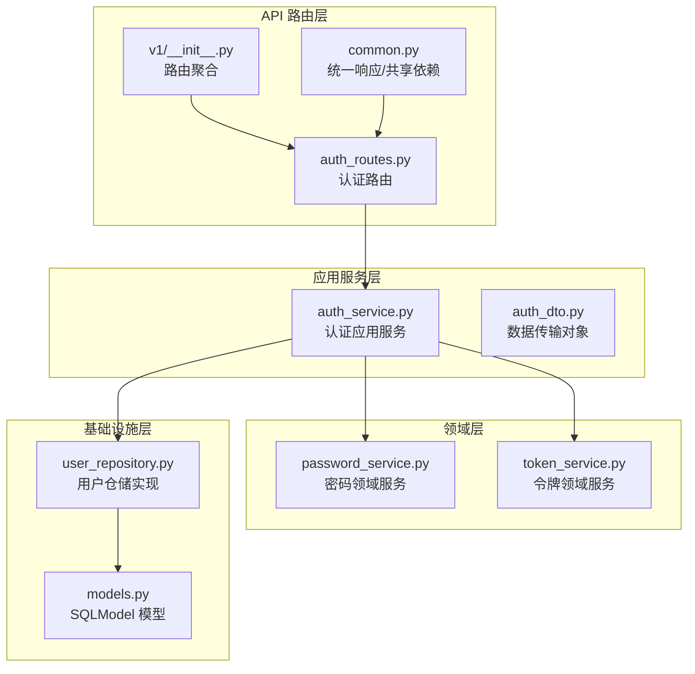
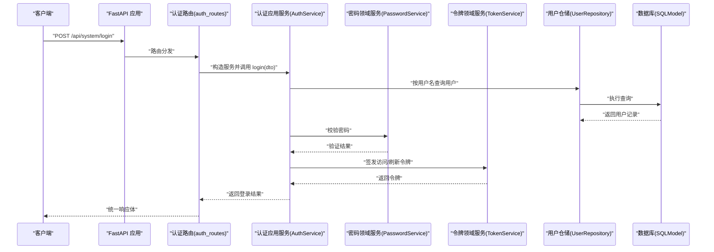
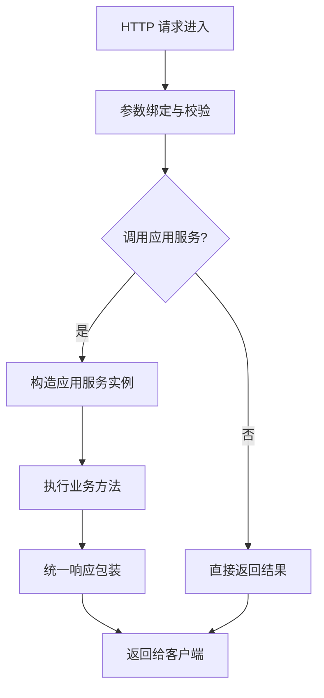
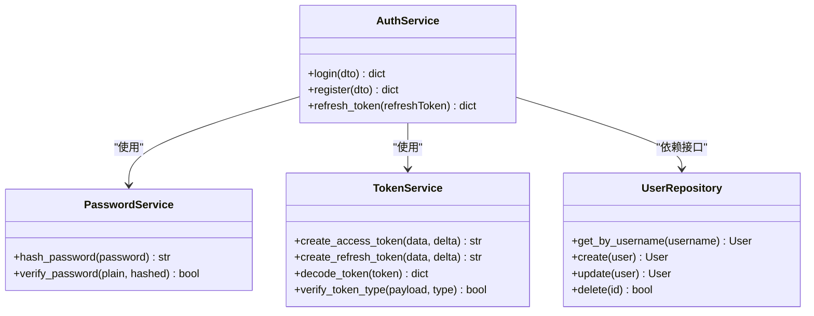
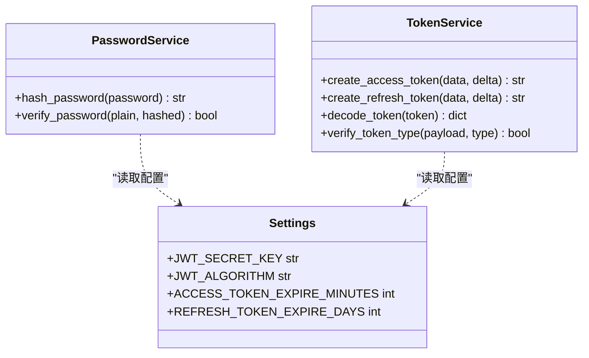
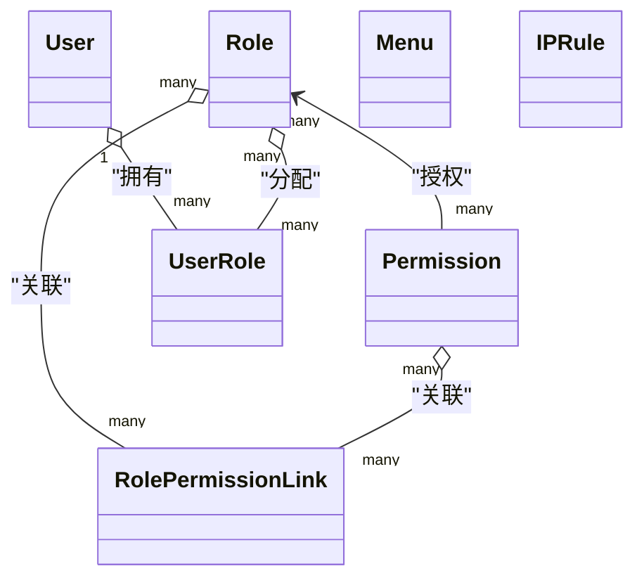
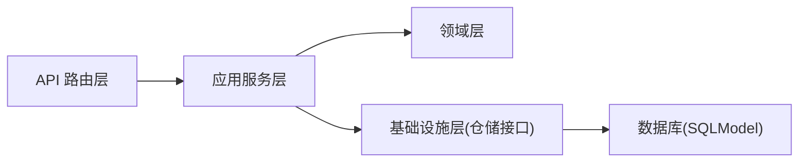

# 分层架构详解

<cite>
**本文引用的文件**
- [service/src/main.py](file://service/src/main.py)
- [service/src/api/v1/__init__.py](file://service/src/api/v1/__init__.py)
- [service/src/api/v1/auth_routes.py](file://service/src/api/v1/auth_routes.py)
- [service/src/api/common.py](file://service/src/api/common.py)
- [service/src/application/services/auth_service.py](file://service/src/application/services/auth_service.py)
- [service/src/application/dto/auth_dto.py](file://service/src/application/dto/auth_dto.py)
- [service/src/domain/auth/password_service.py](file://service/src/domain/auth/password_service.py)
- [service/src/domain/auth/token_service.py](file://service/src/domain/auth/token_service.py)
- [service/src/infrastructure/repositories/user_repository.py](file://service/src/infrastructure/repositories/user_repository.py)
- [service/src/infrastructure/database/models.py](file://service/src/infrastructure/database/models.py)
- [service/src/config/settings.py](file://service/src/config/settings.py)
- [service/src/core/exceptions.py](file://service/src/core/exceptions.py)
</cite>

## 目录
1. [引言](#引言)
2. [项目结构](#项目结构)
3. [核心组件](#核心组件)
4. [架构总览](#架构总览)
5. [详细组件分析](#详细组件分析)
6. [依赖分析](#依赖分析)
7. [性能考虑](#性能考虑)
8. [故障排查指南](#故障排查指南)
9. [结论](#结论)
10. [附录](#附录)

## 引言
本文件面向 Hello-FastApi 项目的后端服务（service 子项目），系统化阐述其基于 FastAPI 的四层架构设计与实现：API 路由层、应用服务层、领域层、基础设施层。文档重点说明：
- 各层职责与边界
- 层间依赖方向与通信方式
- 依赖倒置原则在项目中的落地
- 典型层间交互流程与最佳实践
- 可扩展性与可维护性的建议

## 项目结构
service/src 目录采用按“关注点”分层的组织方式，配合 FastAPI 的路由聚合机制，形成清晰的分层结构：
- API 路由层：负责 HTTP 请求接入、参数校验、统一响应包装与依赖注入
- 应用服务层：封装业务用例、编排领域对象与仓储，保证业务逻辑的稳定与可测试
- 领域层：承载核心业务规则与不变量（如密码哈希、JWT 签发）
- 基础设施层：提供数据库访问、ORM 模型、仓储实现等技术细节

图表来源
- [service/src/api/v1/auth_routes.py:1-86](file://service/src/api/v1/auth_routes.py#L1-L86)
- [service/src/api/v1/__init__.py:1-41](file://service/src/api/v1/__init__.py#L1-L41)
- [service/src/api/common.py:1-65](file://service/src/api/common.py#L1-L65)
- [service/src/application/services/auth_service.py:1-154](file://service/src/application/services/auth_service.py#L1-L154)
- [service/src/application/dto/auth_dto.py:1-54](file://service/src/application/dto/auth_dto.py#L1-L54)
- [service/src/domain/auth/password_service.py:1-21](file://service/src/domain/auth/password_service.py#L1-L21)
- [service/src/domain/auth/token_service.py:1-45](file://service/src/domain/auth/token_service.py#L1-L45)
- [service/src/infrastructure/repositories/user_repository.py:1-185](file://service/src/infrastructure/repositories/user_repository.py#L1-L185)
- [service/src/infrastructure/database/models.py:1-193](file://service/src/infrastructure/database/models.py#L1-L193)

章节来源
- [service/src/main.py:1-96](file://service/src/main.py#L1-L96)
- [service/src/api/v1/__init__.py:1-41](file://service/src/api/v1/__init__.py#L1-L41)

## 核心组件
- 应用入口与生命周期：通过应用工厂函数创建 FastAPI 实例，注册中间件、异常处理器、健康检查与路由，并在 lifespan 中完成数据库初始化与关闭。
- 路由聚合：系统级路由在 v1 聚合模块中统一挂载，便于扩展与维护。
- 统一响应与异常：提供统一响应体与常见异常类型，确保前端一致的交互体验。

章节来源
- [service/src/main.py:34-96](file://service/src/main.py#L34-L96)
- [service/src/api/v1/__init__.py:14-41](file://service/src/api/v1/__init__.py#L14-L41)
- [service/src/api/common.py:29-65](file://service/src/api/common.py#L29-L65)

## 架构总览
下图展示了从 HTTP 请求到数据库写入的典型调用链路，体现四层协作与依赖方向：

图表来源
- [service/src/api/v1/auth_routes.py:19-34](file://service/src/api/v1/auth_routes.py#L19-L34)
- [service/src/application/services/auth_service.py:26-74](file://service/src/application/services/auth_service.py#L26-L74)
- [service/src/domain/auth/password_service.py:17-20](file://service/src/domain/auth/password_service.py#L17-L20)
- [service/src/domain/auth/token_service.py:14-30](file://service/src/domain/auth/token_service.py#L14-L30)
- [service/src/infrastructure/repositories/user_repository.py:17-25](file://service/src/infrastructure/repositories/user_repository.py#L17-L25)
- [service/src/infrastructure/database/models.py:31-64](file://service/src/infrastructure/database/models.py#L31-L64)

## 详细组件分析

### API 路由层
- 职责
  - 接收 HTTP 请求，进行参数绑定与校验
  - 调用应用服务执行业务用例
  - 使用统一响应包装返回结果
  - 通过依赖注入获取数据库会话与当前用户上下文
- 关键交互
  - 认证路由在登录、注册、刷新等接口中构造应用服务实例并调用相应方法
  - 统一响应通过公共模块提供的工具函数生成
- 依赖方向
  - 仅依赖应用服务层与基础设施层（仓储）以获取数据
  - 不直接依赖领域层实现细节

图表来源
- [service/src/api/v1/auth_routes.py:19-86](file://service/src/api/v1/auth_routes.py#L19-L86)
- [service/src/api/common.py:45-65](file://service/src/api/common.py#L45-L65)

章节来源
- [service/src/api/v1/auth_routes.py:1-86](file://service/src/api/v1/auth_routes.py#L1-L86)
- [service/src/api/common.py:1-65](file://service/src/api/common.py#L1-L65)

### 应用服务层
- 职责
  - 封装业务用例，协调领域服务与仓储
  - 组织业务流程，处理跨实体的业务规则
  - 对外暴露简洁的服务契约，屏蔽底层实现细节
- 认证应用服务
  - 登录：校验凭据、检查用户状态、签发令牌、查询角色与权限
  - 注册：检查用户名唯一性、哈希密码、创建用户并返回基本信息
  - 刷新：解码刷新令牌、校验类型与用户有效性、签发新令牌
- 依赖方向
  - 依赖领域服务（密码与令牌）
  - 依赖仓储接口以访问持久化数据
  - 依赖配置与异常体系

图表来源
- [service/src/application/services/auth_service.py:15-154](file://service/src/application/services/auth_service.py#L15-L154)
- [service/src/domain/auth/password_service.py:6-21](file://service/src/domain/auth/password_service.py#L6-L21)
- [service/src/domain/auth/token_service.py:11-45](file://service/src/domain/auth/token_service.py#L11-L45)
- [service/src/infrastructure/repositories/user_repository.py:11-185](file://service/src/infrastructure/repositories/user_repository.py#L11-L185)

章节来源
- [service/src/application/services/auth_service.py:1-154](file://service/src/application/services/auth_service.py#L1-L154)
- [service/src/application/dto/auth_dto.py:1-54](file://service/src/application/dto/auth_dto.py#L1-L54)

### 领域层
- 职责
  - 定义核心业务规则与不变量
  - 提供与技术无关的领域服务
- 密码领域服务
  - 提供密码哈希与校验能力
- 令牌领域服务
  - 提供访问令牌与刷新令牌的签发、解码与类型校验
- 依赖方向
  - 依赖配置模块以获取密钥与算法等参数
  - 不依赖上层框架或基础设施

图表来源
- [service/src/domain/auth/password_service.py:6-21](file://service/src/domain/auth/password_service.py#L6-L21)
- [service/src/domain/auth/token_service.py:11-45](file://service/src/domain/auth/token_service.py#L11-L45)
- [service/src/config/settings.py:63-67](file://service/src/config/settings.py#L63-L67)

章节来源
- [service/src/domain/auth/password_service.py:1-21](file://service/src/domain/auth/password_service.py#L1-L21)
- [service/src/domain/auth/token_service.py:1-45](file://service/src/domain/auth/token_service.py#L1-L45)
- [service/src/config/settings.py:1-198](file://service/src/config/settings.py#L1-L198)

### 基础设施层
- 职责
  - 提供数据库访问、ORM 模型与仓储实现
  - 封装技术细节，向上层暴露抽象接口
- 用户仓储实现
  - 提供按 ID/用户名/邮箱查询、分页查询、计数、创建、更新、删除等操作
  - 支持批量删除与状态更新等扩展能力
- 数据库模型
  - 使用 SQLModel 定义用户、角色、权限、菜单等实体及关联表
  - 统一了 ORM 与数据校验模型，减少重复定义
- 依赖方向
  - 依赖 SQLModel 与异步会话
  - 通过接口向上层暴露能力

图表来源
- [service/src/infrastructure/database/models.py:31-193](file://service/src/infrastructure/database/models.py#L31-L193)
- [service/src/infrastructure/repositories/user_repository.py:11-185](file://service/src/infrastructure/repositories/user_repository.py#L11-L185)

章节来源
- [service/src/infrastructure/repositories/user_repository.py:1-185](file://service/src/infrastructure/repositories/user_repository.py#L1-L185)
- [service/src/infrastructure/database/models.py:1-193](file://service/src/infrastructure/database/models.py#L1-L193)

## 依赖分析
- 依赖方向
  - API 路由层 → 应用服务层
  - 应用服务层 → 领域层、基础设施层（仓储接口）
  - 基础设施层 → 数据库（SQLModel）
- 依赖倒置原则
  - 应用服务层依赖于仓储接口而非具体实现，便于替换存储后端与单元测试
  - 领域层不依赖外部框架，保持纯净的业务规则
- 循环依赖
  - 通过接口与抽象隔离，避免层间循环导入
- 外部依赖
  - FastAPI、SQLModel、Pydantic、JWALib、bcrypt 等

图表来源
- [service/src/api/v1/auth_routes.py:13-14](file://service/src/api/v1/auth_routes.py#L13-L14)
- [service/src/application/services/auth_service.py:10-24](file://service/src/application/services/auth_service.py#L10-L24)
- [service/src/infrastructure/repositories/user_repository.py:7-8](file://service/src/infrastructure/repositories/user_repository.py#L7-L8)

章节来源
- [service/src/application/services/auth_service.py:1-154](file://service/src/application/services/auth_service.py#L1-L154)
- [service/src/infrastructure/repositories/user_repository.py:1-185](file://service/src/infrastructure/repositories/user_repository.py#L1-L185)

## 性能考虑
- 事务与会话
  - 在应用服务层集中管理数据库会话与提交，避免在仓储中分散事务控制
- 查询优化
  - 仓储实现支持筛选与分页，建议结合索引与必要字段选择，减少不必要的列加载
- 缓存策略
  - 可在应用服务层引入只读缓存（如 Redis）以降低热点查询压力（需在基础设施层扩展）
- 并发与限流
  - 结合配置中心的限流参数，可在路由层或中间件层实施请求频率控制

## 故障排查指南
- 统一异常处理
  - 自定义异常类型覆盖常见业务场景（未找到、冲突、认证失败、权限不足、验证错误、限流、业务错误）
  - 全局异常处理器将异常转换为统一响应格式，便于前端处理
- 参数验证
  - FastAPI 的请求验证错误会被捕获并返回结构化的错误信息
- 日志与健康检查
  - 应用启动与关闭阶段的日志输出有助于定位生命周期问题
  - 健康检查接口可用于容器编排与运维监控

章节来源
- [service/src/core/exceptions.py:1-60](file://service/src/core/exceptions.py#L1-L60)
- [service/src/main.py:60-83](file://service/src/main.py#L60-L83)

## 结论
本项目通过清晰的四层架构实现了关注点分离：API 路由层专注于协议与契约，应用服务层封装业务用例，领域层沉淀核心规则，基础设施层提供技术实现。依赖倒置原则贯穿其中，使系统具备良好的可测试性与可扩展性。遵循本文的层间交互模式与最佳实践，可帮助团队在保持代码整洁的同时快速迭代功能。

## 附录
- 配置管理
  - 通过配置类与环境变量加载机制，支持多环境部署与参数校验
- 路由组织
  - 系统级路由在聚合模块中统一挂载，便于新增模块与版本演进

章节来源
- [service/src/config/settings.py:144-198](file://service/src/config/settings.py#L144-L198)
- [service/src/api/v1/__init__.py:14-41](file://service/src/api/v1/__init__.py#L14-L41)