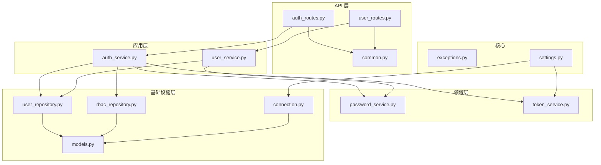
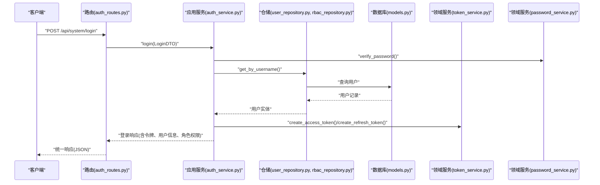
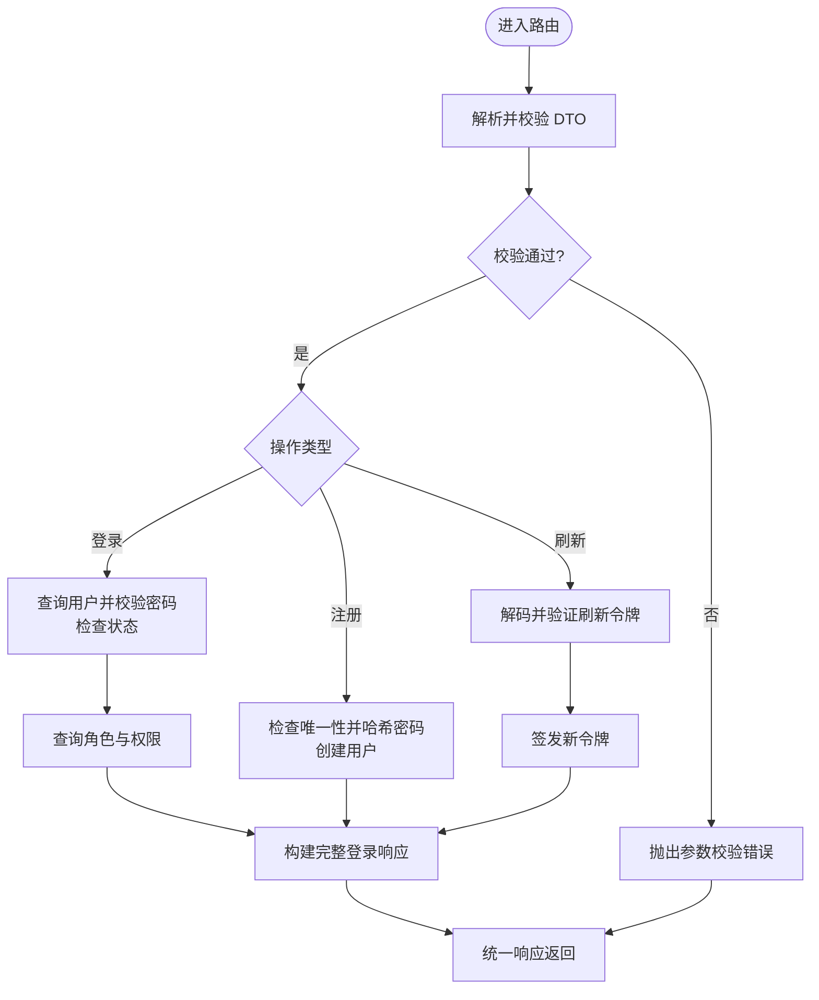
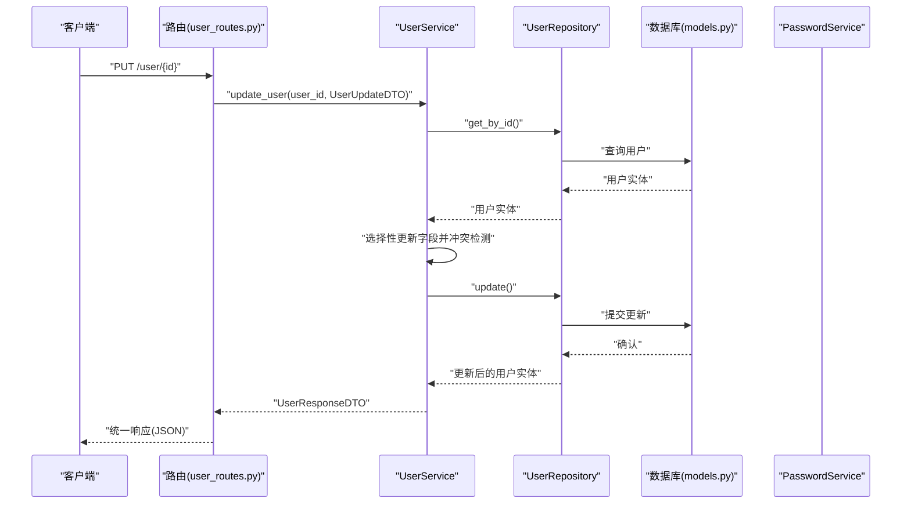
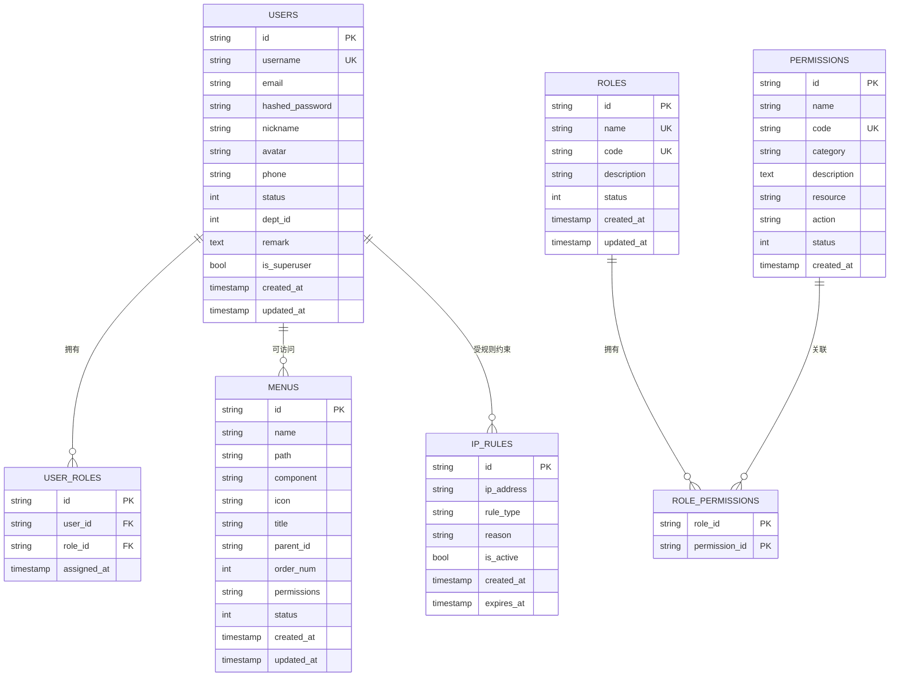
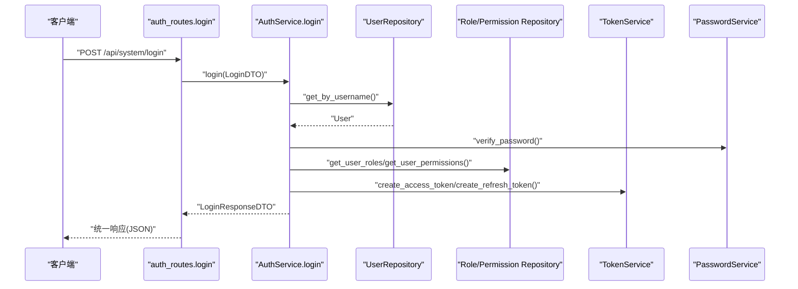
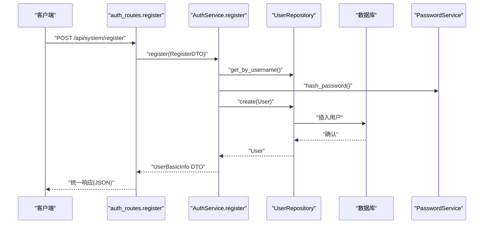
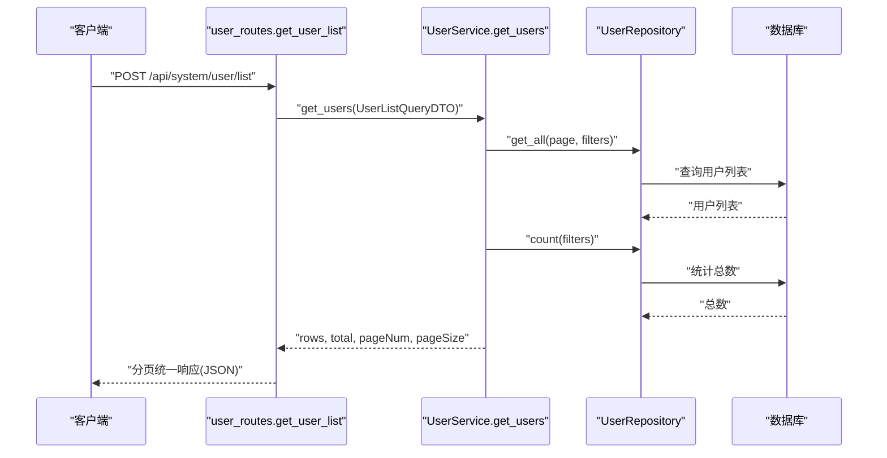
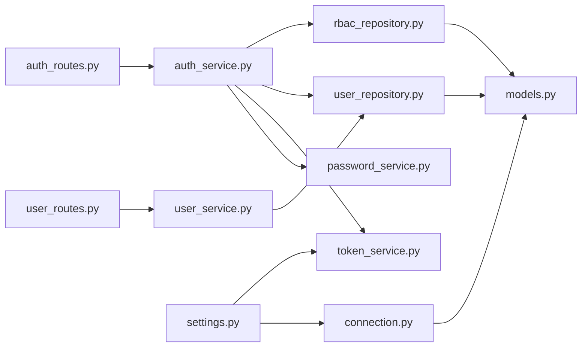

# 数据流设计

<cite>
**本文引用的文件**
- [main.py](file://service/src/main.py)
- [settings.py](file://service/src/config/settings.py)
- [common.py](file://service/src/api/common.py)
- [auth_routes.py](file://service/src/api/v1/auth_routes.py)
- [user_routes.py](file://service/src/api/v1/user_routes.py)
- [auth_dto.py](file://service/src/application/dto/auth_dto.py)
- [user_dto.py](file://service/src/application/dto/user_dto.py)
- [auth_service.py](file://service/src/application/services/auth_service.py)
- [user_service.py](file://service/src/application/services/user_service.py)
- [models.py](file://service/src/infrastructure/database/models.py)
- [connection.py](file://service/src/infrastructure/database/connection.py)
- [user_repository.py](file://service/src/infrastructure/repositories/user_repository.py)
- [rbac_repository.py](file://service/src/infrastructure/repositories/rbac_repository.py)
- [password_service.py](file://service/src/domain/auth/password_service.py)
- [token_service.py](file://service/src/domain/auth/token_service.py)
- [exceptions.py](file://service/src/core/exceptions.py)
- [__init__.py](file://service/src/api/v1/__init__.py)
</cite>

## 目录
1. [引言](#引言)
2. [项目结构](#项目结构)
3. [核心组件](#核心组件)
4. [架构总览](#架构总览)
5. [详细组件分析](#详细组件分析)
6. [依赖分析](#依赖分析)
7. [性能考量](#性能考量)
8. [故障排查指南](#故障排查指南)
9. [结论](#结论)
10. [附录](#附录)

## 引言
本文件面向 Hello-FastApi 项目的开发者，系统化梳理“从 HTTP 请求到数据库持久化”的完整数据流设计。重点覆盖：
- 输入数据的校验与转换（Pydantic DTO → 应用服务）
- 认证与授权链路（JWT 令牌、RBAC 权限）
- 输出数据的统一序列化与分页封装
- 典型业务场景（用户登录、注册、密码修改、用户列表）的数据流图
- 数据一致性与事务管理策略
- 异步数据处理与并发控制
- 性能优化与调优建议

## 项目结构
后端采用 FastAPI + SQLModel + DDD 分层架构，按职责划分为：
- API 层：路由定义与依赖注入
- 应用层：业务编排与用例执行
- 领域层：密码与令牌等核心领域逻辑
- 基础设施层：数据库模型、仓储与连接管理
- 核心模块：异常体系、中间件、公共响应格式

图表来源
- [auth_routes.py:1-86](file://service/src/api/v1/auth_routes.py#L1-L86)
- [user_routes.py:1-252](file://service/src/api/v1/user_routes.py#L1-L252)
- [common.py:1-65](file://service/src/api/common.py#L1-L65)
- [auth_service.py:1-154](file://service/src/application/services/auth_service.py#L1-L154)
- [user_service.py:1-322](file://service/src/application/services/user_service.py#L1-L322)
- [password_service.py:1-21](file://service/src/domain/auth/password_service.py#L1-L21)
- [token_service.py:1-45](file://service/src/domain/auth/token_service.py#L1-L45)
- [models.py:1-193](file://service/src/infrastructure/database/models.py#L1-L193)
- [user_repository.py:1-185](file://service/src/infrastructure/repositories/user_repository.py#L1-L185)
- [rbac_repository.py:1-213](file://service/src/infrastructure/repositories/rbac_repository.py#L1-L213)
- [connection.py:1-35](file://service/src/infrastructure/database/connection.py#L1-L35)
- [settings.py:1-198](file://service/src/config/settings.py#L1-L198)
- [exceptions.py:1-60](file://service/src/core/exceptions.py#L1-L60)

章节来源
- [main.py:1-96](file://service/src/main.py#L1-L96)
- [__init__.py:1-41](file://service/src/api/v1/__init__.py#L1-L41)

## 核心组件
- 应用工厂与生命周期
  - 应用启动时初始化数据库并创建表；关闭时释放连接。
  - 注册全局异常处理器与请求日志中间件。
- 统一响应与分页
  - 统一成功/错误/分页响应格式，便于前端一致处理。
- 配置中心
  - 支持多环境配置（开发/生产/测试），集中管理数据库、Redis、JWT、CORS、限流等参数。

章节来源
- [main.py:19-96](file://service/src/main.py#L19-L96)
- [common.py:29-65](file://service/src/api/common.py#L29-L65)
- [settings.py:41-198](file://service/src/config/settings.py#L41-L198)

## 架构总览
系统采用“路由 → DTO → 应用服务 → 仓储 → 数据库”的单向数据流，结合领域服务完成密码与令牌处理，最终以统一响应返回。

图表来源
- [auth_routes.py:19-34](file://service/src/api/v1/auth_routes.py#L19-L34)
- [auth_service.py:26-74](file://service/src/application/services/auth_service.py#L26-L74)
- [user_repository.py:22-25](file://service/src/infrastructure/repositories/user_repository.py#L22-L25)
- [rbac_repository.py:128-133](file://service/src/infrastructure/repositories/rbac_repository.py#L128-L133)
- [token_service.py:14-30](file://service/src/domain/auth/token_service.py#L14-L30)
- [password_service.py:17-20](file://service/src/domain/auth/password_service.py#L17-L20)
- [models.py:31-64](file://service/src/infrastructure/database/models.py#L31-L64)

## 详细组件分析

### 认证与授权数据流（登录/注册/刷新）
- 输入校验
  - 登录/注册/刷新 DTO 基于 Pydantic，自动进行字段类型、长度、必填等校验。
- 认证流程
  - 登录：校验用户名与密码，检查用户状态，生成访问/刷新令牌，并查询角色与权限。
  - 注册：检查用户名唯一性，哈希密码，创建启用用户。
  - 刷新：解码并验证刷新令牌，重新签发访问/刷新令牌。
- 输出序列化
  - 统一响应包装，登录/刷新返回包含令牌、过期时间与用户信息的结构化数据。

图表来源
- [auth_dto.py:7-54](file://service/src/application/dto/auth_dto.py#L7-L54)
- [auth_service.py:26-154](file://service/src/application/services/auth_service.py#L26-L154)
- [rbac_repository.py:98-133](file://service/src/infrastructure/repositories/rbac_repository.py#L98-L133)
- [token_service.py:14-44](file://service/src/domain/auth/token_service.py#L14-L44)
- [common.py:45-59](file://service/src/api/common.py#L45-L59)

章节来源
- [auth_routes.py:19-86](file://service/src/api/v1/auth_routes.py#L19-L86)
- [auth_service.py:26-154](file://service/src/application/services/auth_service.py#L26-L154)
- [auth_dto.py:7-54](file://service/src/application/dto/auth_dto.py#L7-L54)
- [token_service.py:14-44](file://service/src/domain/auth/token_service.py#L14-L44)
- [rbac_repository.py:98-133](file://service/src/infrastructure/repositories/rbac_repository.py#L98-L133)

### 用户管理数据流（列表/新增/更新/删除/密码修改）
- 输入校验
  - 用户相关 DTO 对字段长度、范围、别名等进行约束。
- 业务处理
  - 列表：支持多维筛选与分页，返回行数据与总数。
  - 新增：检查用户名/邮箱唯一性，映射字段并创建用户。
  - 更新：选择性更新，避免空值污染；邮箱冲突检测。
  - 删除/批量删除：基于主键删除，返回计数。
  - 密码修改：校验旧密码，哈希新密码并保存。
- 输出序列化
  - 统一分页响应与成功响应，DTO 负责从实体到响应的转换。

图表来源
- [user_routes.py:117-138](file://service/src/api/v1/user_routes.py#L117-L138)
- [user_service.py:115-156](file://service/src/application/services/user_service.py#L115-L156)
- [user_repository.py:121-126](file://service/src/infrastructure/repositories/user_repository.py#L121-L126)
- [models.py:31-64](file://service/src/infrastructure/database/models.py#L31-L64)

章节来源
- [user_routes.py:27-252](file://service/src/api/v1/user_routes.py#L27-L252)
- [user_service.py:25-322](file://service/src/application/services/user_service.py#L25-L322)
- [user_dto.py:8-86](file://service/src/application/dto/user_dto.py#L8-L86)
- [user_repository.py:17-184](file://service/src/infrastructure/repositories/user_repository.py#L17-L184)

### 数据模型与仓储映射
- 数据模型
  - 用户、角色、权限、用户-角色关联、角色-权限关联、菜单、IP 规则等。
- 仓储接口
  - 用户仓储：按 ID/用户名/邮箱查询、分页列表、计数、创建/更新/删除、批量删除、状态更新、重置密码。
  - RBAC 仓储：角色/权限 CRUD、角色权限分配、用户角色分配/移除、用户角色与权限查询。
- 事务与一致性
  - 会话在路由层注入，提交/回滚由会话依赖统一管理；部分业务显式提交（如注册成功后提交）。

图表来源
- [models.py:31-193](file://service/src/infrastructure/database/models.py#L31-L193)
- [user_repository.py:17-184](file://service/src/infrastructure/repositories/user_repository.py#L17-L184)
- [rbac_repository.py:11-213](file://service/src/infrastructure/repositories/rbac_repository.py#L11-L213)

章节来源
- [models.py:31-193](file://service/src/infrastructure/database/models.py#L31-L193)
- [user_repository.py:17-184](file://service/src/infrastructure/repositories/user_repository.py#L17-L184)
- [rbac_repository.py:11-213](file://service/src/infrastructure/repositories/rbac_repository.py#L11-L213)

### 输入校验与错误处理策略
- Pydantic DTO 校验
  - 登录/注册/刷新、用户创建/更新/列表查询、密码修改等均通过 Pydantic 进行强类型与范围校验。
- 全局异常处理
  - 参数校验失败返回统一 422 错误结构；业务异常映射为统一错误响应；未捕获异常返回 500。
- 业务异常
  - 未找到、冲突、认证失败、权限不足、请求频率超限、业务错误等均有专用异常类型。

章节来源
- [auth_dto.py:7-54](file://service/src/application/dto/auth_dto.py#L7-L54)
- [user_dto.py:8-86](file://service/src/application/dto/user_dto.py#L8-L86)
- [main.py:68-82](file://service/src/main.py#L68-L82)
- [exceptions.py:6-60](file://service/src/core/exceptions.py#L6-L60)

### 输出序列化与格式化
- 统一响应
  - 成功/错误/分页响应统一封装，包含 code、message、data 等字段，便于前端一致处理。
- DTO 到响应
  - 应用服务将领域实体转换为响应 DTO，确保对外暴露字段与层级清晰。

章节来源
- [common.py:29-65](file://service/src/api/common.py#L29-L65)
- [user_service.py:283-322](file://service/src/application/services/user_service.py#L283-L322)

### 典型业务场景数据流图

#### 场景一：用户登录

图表来源
- [auth_routes.py:19-34](file://service/src/api/v1/auth_routes.py#L19-L34)
- [auth_service.py:26-74](file://service/src/application/services/auth_service.py#L26-L74)
- [rbac_repository.py:98-133](file://service/src/infrastructure/repositories/rbac_repository.py#L98-L133)
- [token_service.py:14-30](file://service/src/domain/auth/token_service.py#L14-L30)
- [password_service.py:17-20](file://service/src/domain/auth/password_service.py#L17-L20)

#### 场景二：用户注册

图表来源
- [auth_routes.py:37-52](file://service/src/api/v1/auth_routes.py#L37-L52)
- [auth_service.py:76-116](file://service/src/application/services/auth_service.py#L76-L116)
- [user_repository.py:114-119](file://service/src/infrastructure/repositories/user_repository.py#L114-L119)
- [password_service.py:9-15](file://service/src/domain/auth/password_service.py#L9-L15)

#### 场景三：用户列表（带分页）

图表来源
- [user_routes.py:27-51](file://service/src/api/v1/user_routes.py#L27-L51)
- [user_service.py:80-113](file://service/src/application/services/user_service.py#L80-L113)
- [user_repository.py:32-112](file://service/src/infrastructure/repositories/user_repository.py#L32-L112)

### 数据一致性与事务管理策略
- 会话生命周期
  - 依赖注入提供异步会话，请求结束时提交；异常时回滚，保证原子性。
- 显式提交
  - 注册成功后显式提交，确保数据可见性。
- 并发控制
  - 用户名/邮箱唯一性约束由数据库唯一索引保障；仓储方法在单事务内执行，避免脏写。

章节来源
- [connection.py:12-21](file://service/src/infrastructure/database/connection.py#L12-L21)
- [auth_service.py:106-106](file://service/src/application/services/auth_service.py#L106-L106)
- [models.py:37-38](file://service/src/infrastructure/database/models.py#L37-L38)

### 异步数据处理与并发控制
- 异步会话
  - 使用 SQLModel 异步引擎与会话，提升高并发下的吞吐。
- 依赖注入
  - 路由层通过依赖注入获取会话，避免跨请求共享状态。
- 令牌与密码
  - JWT 解码/签发与密码哈希均为纯函数式操作，线程安全且易于扩展。

章节来源
- [connection.py:9-19](file://service/src/infrastructure/database/connection.py#L9-L19)
- [auth_routes.py:8-14](file://service/src/api/v1/auth_routes.py#L8-L14)
- [token_service.py:14-44](file://service/src/domain/auth/token_service.py#L14-L44)
- [password_service.py:9-20](file://service/src/domain/auth/password_service.py#L9-L20)

## 依赖分析
- 路由到服务
  - 认证与用户路由分别依赖对应应用服务，服务内部组合仓储与领域服务。
- 服务到仓储
  - 应用服务通过仓储访问数据库，仓储实现基于 SQLModel 异步查询。
- 领域服务
  - 密码与令牌服务提供无副作用的纯函数，便于测试与复用。
- 配置与连接
  - 配置驱动数据库连接与 JWT 策略；连接池预热与会话过期策略由设置控制。

图表来源
- [auth_routes.py:1-86](file://service/src/api/v1/auth_routes.py#L1-L86)
- [user_routes.py:1-252](file://service/src/api/v1/user_routes.py#L1-L252)
- [auth_service.py:1-25](file://service/src/application/services/auth_service.py#L1-L25)
- [user_service.py:1-24](file://service/src/application/services/user_service.py#L1-L24)
- [password_service.py:1-21](file://service/src/domain/auth/password_service.py#L1-L21)
- [token_service.py:1-45](file://service/src/domain/auth/token_service.py#L1-L45)
- [user_repository.py:1-16](file://service/src/infrastructure/repositories/user_repository.py#L1-L16)
- [rbac_repository.py:1-16](file://service/src/infrastructure/repositories/rbac_repository.py#L1-L16)
- [models.py:1-14](file://service/src/infrastructure/database/models.py#L1-L14)
- [connection.py:1-9](file://service/src/infrastructure/database/connection.py#L1-L9)
- [settings.py:57-67](file://service/src/config/settings.py#L57-L67)

章节来源
- [__init__.py:8-38](file://service/src/api/v1/__init__.py#L8-L38)

## 性能考量
- 数据库层
  - 使用异步引擎与连接池预热；为高频查询字段建立索引（用户名、邮箱、角色编码等）。
  - 分页查询限制每页最大条数，避免大页扫描。
- 应用层
  - DTO 校验前置，减少无效请求进入业务逻辑。
  - 选择性更新字段，降低写放大。
- 缓存与限流
  - 可结合 Redis 缓存热点用户信息与令牌元数据；利用配置中的限流参数进行速率控制。
- 日志与监控
  - 启用请求日志中间件，结合统一响应结构便于埋点与追踪。

## 故障排查指南
- 常见错误定位
  - 参数校验失败：检查 DTO 字段约束与前端传参。
  - 未找到资源：确认 ID 存在与权限。
  - 冲突（用户名/邮箱已存在）：检查唯一性约束。
  - 认证失败：核对用户名/密码与用户状态；检查令牌签名与过期。
- 异常映射
  - 业务异常与通用异常分别映射为统一错误响应，便于前端提示与重试策略。
- 数据库问题
  - 检查会话提交/回滚逻辑；必要时开启 SQL 日志辅助诊断。

章节来源
- [main.py:60-82](file://service/src/main.py#L60-L82)
- [exceptions.py:13-60](file://service/src/core/exceptions.py#L13-L60)
- [connection.py:17-20](file://service/src/infrastructure/database/connection.py#L17-L20)

## 结论
本设计以 DTO 校验为入口、应用服务为中枢、仓储为边界、领域服务为内核，形成清晰、可测试、可扩展的数据流闭环。通过统一响应、事务管理与异常处理，确保了系统的稳定性与可观测性。建议在生产环境中进一步引入缓存、限流与更细粒度的指标埋点，持续优化性能与可靠性。

## 附录
- 路由聚合
  - 系统路由在聚合模块中统一挂载，便于维护与扩展。
- 配置要点
  - 数据库 URL、JWT 密钥与算法、CORS 源、日志级别等均通过配置集中管理。

章节来源
- [__init__.py:14-38](file://service/src/api/v1/__init__.py#L14-L38)
- [settings.py:57-76](file://service/src/config/settings.py#L57-L76)