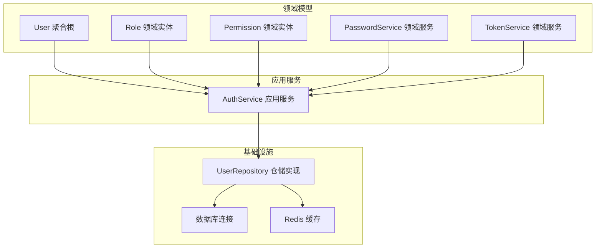
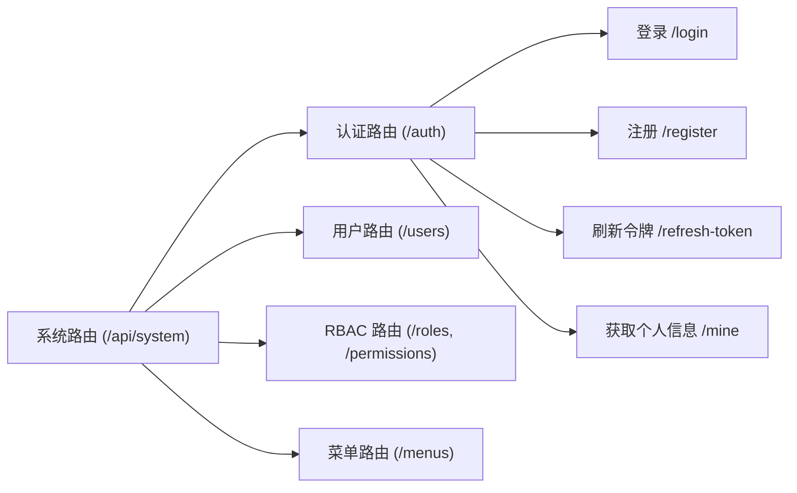
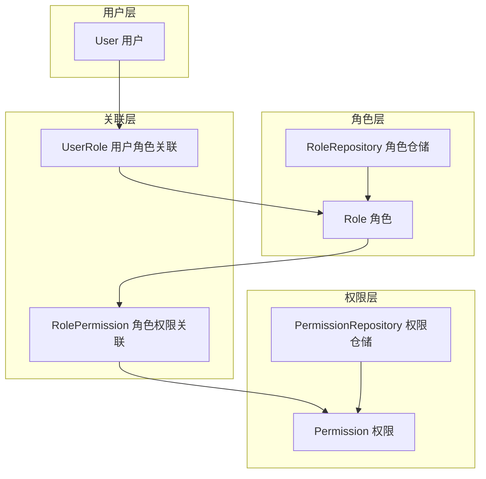
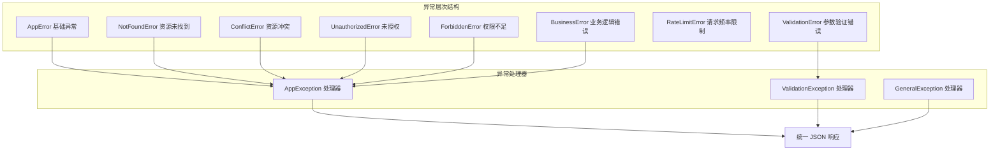
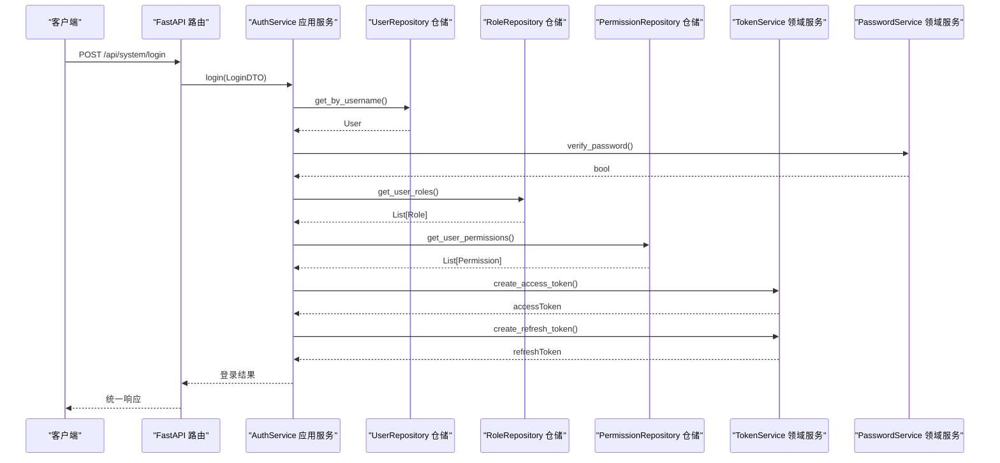
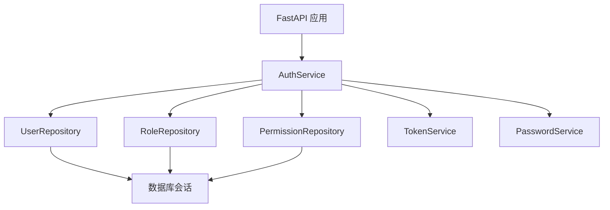
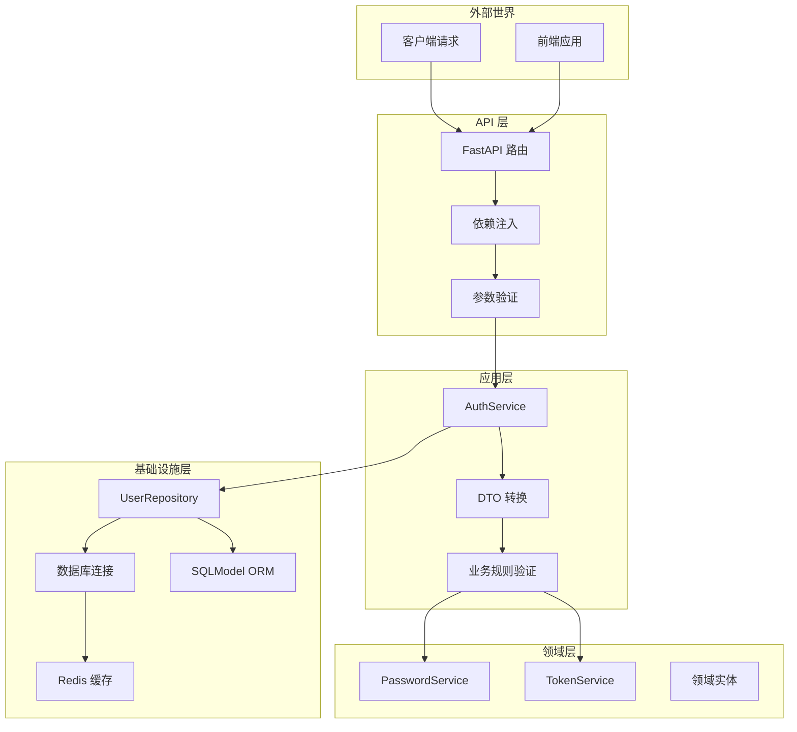
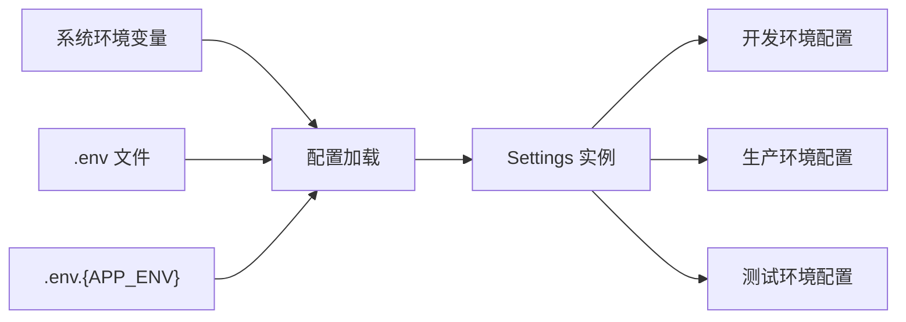
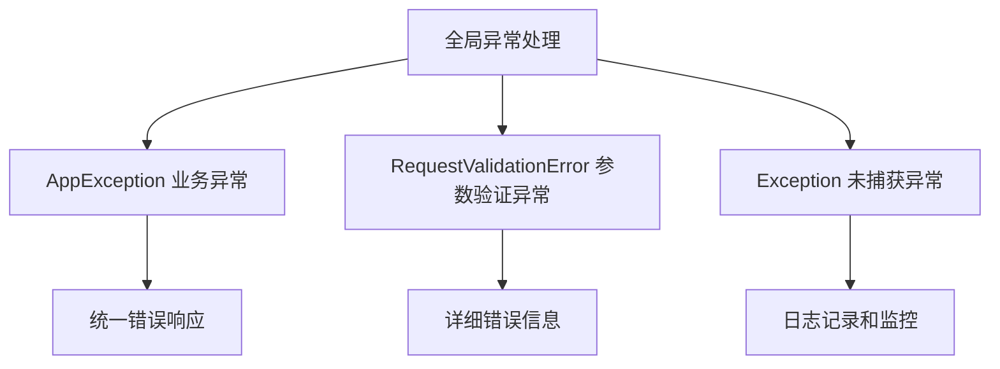

# 架构设计

<cite>
**本文引用的文件**
- [service/src/main.py](file://service/src/main.py)
- [service/README.md](file://service/README.md)
- [service/pyproject.toml](file://service/pyproject.toml)
- [service/src/config/settings.py](file://service/src/config/settings.py)
- [service/src/config/asgi.py](file://service/src/config/asgi.py)
- [service/src/api/v1/__init__.py](file://service/src/api/v1/__init__.py)
- [service/src/api/v1/auth_routes.py](file://service/src/api/v1/auth_routes.py)
- [service/src/application/services/auth_service.py](file://service/src/application/services/auth_service.py)
- [service/src/application/dto/auth_dto.py](file://service/src/application/dto/auth_dto.py)
- [service/src/domain/entities/user.py](file://service/src/domain/entities/user.py)
- [service/src/domain/exceptions.py](file://service/src/domain/exceptions.py)
- [service/src/domain/rbac_defaults.py](file://service/src/domain/rbac_defaults.py)
- [service/src/domain/services/password_service.py](file://service/src/domain/services/password_service.py)
- [service/src/domain/services/token_service.py](file://service/src/domain/services/token_service.py)
- [service/src/domain/repositories/user_repository.py](file://service/src/domain/repositories/user_repository.py)
- [service/src/infrastructure/http/exception_handlers.py](file://service/src/infrastructure/http/exception_handlers.py)
- [service/src/infrastructure/repositories/user_repository.py](file://service/src/infrastructure/repositories/user_repository.py)
- [service/src/infrastructure/database/models.py](file://service/src/infrastructure/database/models.py)
- [service/src/infrastructure/http/middlewares.py](file://service/src/infrastructure/http/middlewares.py)
</cite>

## 更新摘要
**所做更改**
- 更新了 DDD 分层架构重构后的目录结构：src/core/ 已重构为 src/application/, src/domain/, src/infrastructure/
- 新增了集中式异常处理系统的详细说明
- 完善了 RBAC 默认权限配置的架构设计
- 更新了四层架构的职责划分和组件关系
- 增强了异常处理和权限控制的架构说明

## 目录
1. [引言](#引言)
2. [项目概述](#项目概述)
3. [DDD 领域驱动设计核心理念](#ddd-领域驱动设计核心理念)
4. [四层架构设计详解](#四层架构设计详解)
5. [RBAC 权限控制系统](#rbac-权限控制系统)
6. [集中式异常处理系统](#集中式异常处理系统)
7. [组件交互模式](#组件交互模式)
8. [数据流向分析](#数据流向分析)
9. [架构决策与技术考量](#架构决策与技术考量)
10. [性能优化策略](#性能优化策略)
11. [故障排查与监控](#故障排查与监控)
12. [扩展性与演进指导](#扩展性与演进指导)
13. [结论](#结论)

## 引言
Hello-FastApi 项目采用先进的 DDD（领域驱动设计）思想，结合 FastAPI 的异步能力，构建了一个高度模块化、可扩展的分层架构 API 服务。项目不仅实现了业务逻辑与技术实现的完全分离，还集成了 RBAC（基于角色的访问控制）权限管理系统和集中式异常处理体系，为企业级应用提供了坚实的技术基础。

经过架构重构，项目现已采用全新的 DDD 分层结构，将原有的 src/core/ 目录重构为更清晰的 src/application/、src/domain/、src/infrastructure/ 三层结构，每个层级都有明确的职责边界和依赖方向。

## 项目概述
Hello-FastApi 是一个基于 FastAPI 框架的企业级 API 服务系统，具有以下核心特性：

- **DDD 架构**：采用领域驱动设计思想，实现业务领域与技术实现的完全分离
- **RBAC 权限控制**：集成基于角色的访问控制系统，支持精细化权限管理
- **JWT 认证**：现代化的 Token 认证机制，支持令牌刷新和过期管理
- **异步处理**：全面支持 async/await，利用 SQLAlchemy 2.0 的异步能力实现高性能并发处理
- **类型安全**：完整的类型提示系统，结合 Pydantic 进行数据验证
- **多环境配置**：支持 development、production、testing 三种运行环境的灵活切换
- **集中式异常处理**：统一的异常处理机制，提供一致的错误响应格式

## DDD 领域驱动设计核心理念
DDD（Domain-Driven Design）是一种软件开发方法论，强调业务复杂性与软件结构的对应关系。在 Hello-FastApi 中，我们通过以下核心概念实现业务建模：

### 核心概念映射
- **聚合根（Aggregate Root）**：User、Role、Permission 等核心业务实体
- **值对象（Value Object）**：LoginDTO、RegisterDTO 等数据传输对象
- **领域服务（Domain Service）**：PasswordService、TokenService 等业务逻辑封装
- **仓储接口（Repository Interface）**：UserRepositoryInterface 等抽象数据访问接口
- **应用服务（Application Service）**：AuthService 等协调业务用例的服务

### 领域建模实践
项目中的认证和权限管理体现了典型的 DDD 应用场景：

**图表来源**
- [service/src/domain/entities/user.py:11-51](file://service/src/domain/entities/user.py#L11-L51)
- [service/src/domain/services/password_service.py](file://service/src/domain/services/password_service.py)
- [service/src/domain/services/token_service.py](file://service/src/domain/services/token_service.py)
- [service/src/application/services/auth_service.py:18-38](file://service/src/application/services/auth_service.py#L18-L38)
- [service/src/infrastructure/repositories/user_repository.py:11-22](file://service/src/infrastructure/repositories/user_repository.py#L11-L22)

## 四层架构设计详解

### API 层（接口层）
API 层是系统的最外层，负责处理外部请求和响应。在 Hello-FastApi 中，API 层主要承担以下职责：

- **HTTP 接口暴露**：通过 FastAPI 路由系统提供 RESTful API
- **请求参数验证**：利用 Pydantic 模型进行数据验证和序列化
- **统一响应格式**：提供标准化的响应结构，便于前端消费
- **依赖注入管理**：通过 FastAPI 的依赖系统管理服务实例
- **中间件集成**：实现 CORS、日志记录、权限验证等横切关注点

API 层的路由组织体现了清晰的业务分组：

**图表来源**
- [service/src/api/v1/auth_routes.py](file://service/src/api/v1/auth_routes.py)

### 应用层（应用服务层）
应用层是业务用例的编排者，负责协调领域服务和仓储接口，确保业务流程的正确执行。在 Hello-FastApi 中，应用层的核心职责包括：

- **业务流程编排**：组合多个领域操作形成完整的业务用例
- **事务管理**：确保业务操作的原子性和一致性
- **DTO 数据转换**：在 API 层和领域层之间进行数据格式转换
- **异常处理**：捕获和转换业务异常为标准响应格式

认证服务展示了应用层的典型实现模式：

**章节来源**
- [service/src/application/services/auth_service.py:18-151](file://service/src/application/services/auth_service.py#L18-L151)

### 领域层（领域模型层）
领域层封装了核心业务规则和不变量，是系统中最稳定的层次。在 Hello-FastApi 中，领域层包含以下关键组件：

- **领域实体**：UserEntity 等核心业务实体，使用 dataclass 实现
- **领域服务**：PasswordService 和 TokenService 提供核心业务逻辑
- **领域接口**：UserRepositoryInterface 等抽象接口定义业务契约
- **业务规则**：密码强度验证、令牌类型检查、用户状态管理等
- **不变量保护**：确保业务状态的一致性和完整性

用户实体和密码服务体现了领域层的纯业务逻辑特性：

**章节来源**
- [service/src/domain/entities/user.py:11-51](file://service/src/domain/entities/user.py#L11-L51)
- [service/src/domain/services/password_service.py](file://service/src/domain/services/password_service.py)
- [service/src/domain/services/token_service.py](file://service/src/domain/services/token_service.py)

### 基础设施层（基础设施层）
基础设施层提供技术实现细节，对上层透明。在 Hello-FastApi 中，基础设施层包括：

- **数据库实现**：基于 SQLModel 的仓储实现，使用 FastCRUD 简化 CRUD 操作
- **缓存服务**：Redis 客户端集成
- **外部服务**：JWT 解码、密码加密等第三方服务
- **配置管理**：多环境配置加载和管理
- **HTTP 服务**：异常处理、中间件等 HTTP 层功能

仓储实现展示了基础设施层的具体技术选择：

**章节来源**
- [service/src/infrastructure/repositories/user_repository.py:11-196](file://service/src/infrastructure/repositories/user_repository.py#L11-L196)

## RBAC 权限控制系统
Hello-FastApi 集成了完整的 RBAC（基于角色的访问控制）权限管理系统，支持精细化的权限控制需求。

### 权限模型设计
系统采用经典的 RBAC 三层模型：

**图表来源**
- [service/src/domain/repositories/user_repository.py](file://service/src/domain/repositories/user_repository.py)
- [service/src/domain/repositories/role_repository.py](file://service/src/domain/repositories/role_repository.py)
- [service/src/domain/repositories/permission_repository.py](file://service/src/domain/repositories/permission_repository.py)

### RBAC 默认权限配置
系统提供了完整的 RBAC 默认权限配置，包括预定义的角色和权限：

**章节来源**
- [service/src/domain/rbac_defaults.py:1-37](file://service/src/domain/rbac_defaults.py#L1-L37)

### 动态路由权限
系统支持根据用户角色动态生成前端路由配置，实现细粒度的界面权限控制：

- **菜单权限**：根据角色显示不同的菜单项
- **按钮权限**：控制页面按钮的显示和操作权限
- **页面权限**：基于角色限制页面访问

动态路由生成展示了权限控制的灵活性：

**章节来源**
- [service/src/api/v1/auth_routes.py](file://service/src/api/v1/auth_routes.py)

## 集中式异常处理系统
Hello-FastApi 采用了全新的集中式异常处理系统，提供统一的错误处理机制和一致的响应格式。

### 异常处理架构
系统采用分层异常处理策略：

**图表来源**
- [service/src/domain/exceptions.py:6-62](file://service/src/domain/exceptions.py#L6-L62)
- [service/src/infrastructure/http/exception_handlers.py:13-28](file://service/src/infrastructure/http/exception_handlers.py#L13-L28)

### 异常处理流程
系统通过全局异常处理器实现统一的异常处理：

**章节来源**
- [service/src/infrastructure/http/exception_handlers.py:13-28](file://service/src/infrastructure/http/exception_handlers.py#L13-L28)

### 错误响应格式
所有异常都返回统一的 JSON 格式响应：

| 字段 | 类型 | 描述 | 示例 |
|------|------|------|------|
| code | int | HTTP 状态码 | 404, 401, 403 |
| message | string | 错误消息 | "资源未找到", "需要认证" |

## 组件交互模式
系统采用清晰的组件交互模式，确保各层之间的松耦合和高内聚。

### 请求处理流程
典型的认证请求处理流程如下：

**图表来源**
- [service/src/api/v1/auth_routes.py](file://service/src/api/v1/auth_routes.py)
- [service/src/application/services/auth_service.py:39-82](file://service/src/application/services/auth_service.py#L39-L82)

### 依赖注入模式
系统采用依赖注入模式管理组件间的依赖关系：

**图表来源**
- [service/src/application/services/auth_service.py:21-37](file://service/src/application/services/auth_service.py#L21-L37)

## 数据流向分析
系统中的数据流向体现了清晰的单向依赖关系和数据转换过程。

### 数据流图

**图表来源**
- [service/src/main.py:19-43](file://service/src/main.py#L19-L43)
- [service/src/api/v1/auth_routes.py](file://service/src/api/v1/auth_routes.py)

### 数据转换过程
系统在不同层次间进行数据转换，确保各层专注于特定的关注点：

1. **API 层**：接收原始请求数据，转换为 Pydantic DTO
2. **应用层**：DTO 转换为领域实体，执行业务逻辑
3. **领域层**：领域实体进行业务规则验证和计算
4. **基础设施层**：领域实体转换为数据库模型进行持久化

## 架构决策与技术考量
本架构设计基于多项技术决策和权衡考量：

### 技术选型决策
- **FastAPI + SQLAlchemy 2.0**：选择异步 ORM 支持高性能并发处理
- **Pydantic**：提供强大的数据验证和序列化功能
- **JWT**：无状态认证机制，支持水平扩展
- **Redis**：缓存热点数据和令牌，提升系统性能
- **bcrypt**：安全的密码哈希算法
- **FastCRUD**：简化 CRUD 操作，提高开发效率

### 架构权衡分析
- **复杂度 vs 可维护性**：DDD 增加了架构复杂度，但提升了长期可维护性
- **性能 vs 功能**：异步设计提升性能，但增加了开发复杂度
- **安全性 vs 便利性**：严格的权限控制提升了安全性，但增加了配置复杂度
- **扩展性 vs 简洁性**：分层架构便于扩展，但需要更多的样板代码
- **异常处理 vs 开发效率**：集中式异常处理提高了代码质量，但需要额外的学习成本

### 配置管理策略
系统支持多环境配置，通过环境变量和配置文件实现灵活的部署管理：

**图表来源**
- [service/src/config/settings.py](file://service/src/config/settings.py)

## 性能优化策略
系统采用了多项性能优化策略以确保高并发场景下的稳定运行：

### 异步处理优化
- **异步数据库操作**：基于 SQLAlchemy 2.0 的异步 ORM 支持
- **事件循环优化**：充分利用 Python 事件循环提升并发性能
- **连接池管理**：合理配置数据库连接池大小

### 缓存策略
- **Redis 缓存**：热点数据和令牌缓存
- **分层缓存**：应用层、服务层、数据库层多级缓存
- **缓存失效策略**：基于 TTL 和业务规则的智能缓存管理

### 中间件优化
- **请求日志中间件**：非阻塞的日志记录
- **CORS 配置**：最小化跨域请求的开销
- **异常处理优化**：快速失败和错误响应

## 故障排查与监控
系统提供了完善的故障排查和监控机制：

### 异常处理体系

**图表来源**
- [service/src/infrastructure/http/exception_handlers.py:13-28](file://service/src/infrastructure/http/exception_handlers.py#L13-L28)

### 监控指标
- **健康检查**：/health 接口提供系统状态监控
- **性能指标**：请求响应时间、并发数、错误率
- **资源监控**：内存使用、数据库连接数、Redis 连接数
- **业务指标**：用户活跃度、认证成功率、权限访问统计

### 日志管理
- **多级别日志**：DEBUG、INFO、WARNING、ERROR、CRITICAL
- **结构化日志**：JSON 格式便于机器解析
- **日志轮转**：自动日志文件轮转和清理

## 扩展性与演进指导
系统设计充分考虑了未来的扩展需求和演进路径：

### 水平扩展支持
- **无状态设计**：JWT 认证支持水平扩展
- **数据库分离**：读写分离和分库分表支持
- **缓存集群**：Redis 集群支持高可用和扩展

### 微服务演进路径
- **服务拆分**：用户服务、权限服务、内容服务独立部署
- **API 网关**：统一的 API 网关管理
- **服务发现**：基于 Consul 或 Kubernetes 的服务发现

### 技术栈演进
- **框架升级**：FastAPI 和 SQLAlchemy 的版本升级路径
- **数据库迁移**：从 SQLite 到 PostgreSQL 的平滑迁移
- **监控体系**：从本地日志到集中式监控的演进

## 结论
Hello-FastApi 项目通过精心设计的 DDD 四层架构，成功实现了业务逻辑与技术实现的完全分离。经过架构重构，项目现已采用更清晰的 src/application/、src/domain/、src/infrastructure/ 分层结构，并引入了集中式异常处理系统和完整的 RBAC 默认权限配置。

架构设计的关键优势包括：
- **清晰的职责分离**：四层架构确保各层专注于特定关注点
- **强健的业务建模**：DDD 思想确保业务规则的准确表达
- **灵活的权限控制**：RBAC 系统支持精细化的权限管理
- **统一的异常处理**：集中式异常处理提供一致的错误响应
- **高性能的异步处理**：充分利用现代 Python 异步能力
- **完善的监控体系**：提供全面的故障排查和性能监控

通过遵循本文档的架构原则和最佳实践，开发者可以在此基础上进行功能扩展和技术演进，构建更加复杂和强大的企业级应用系统。