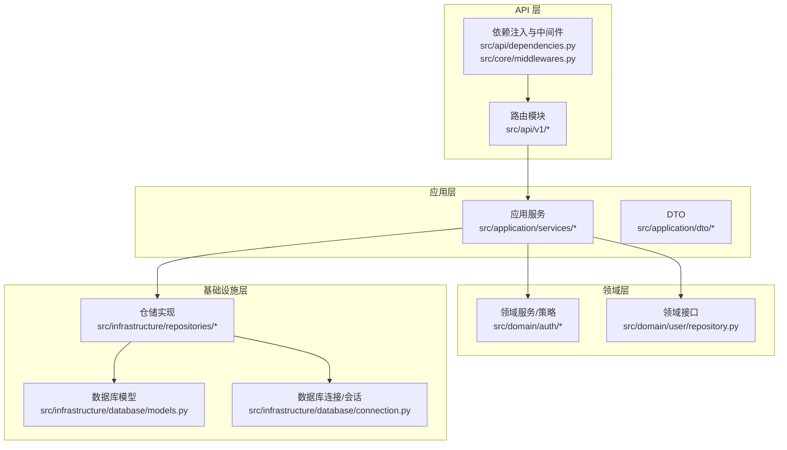
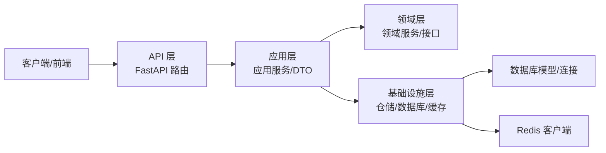
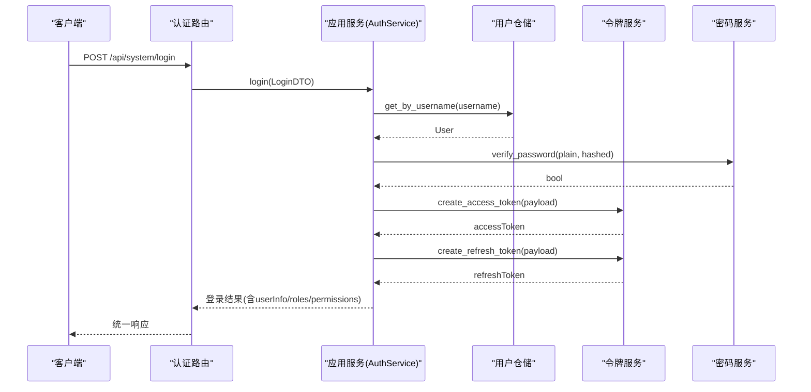
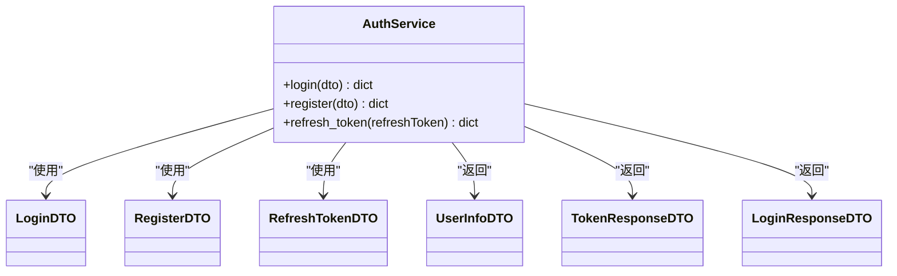
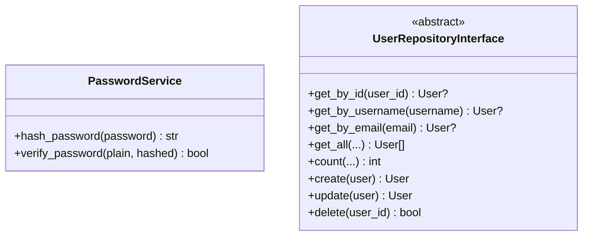
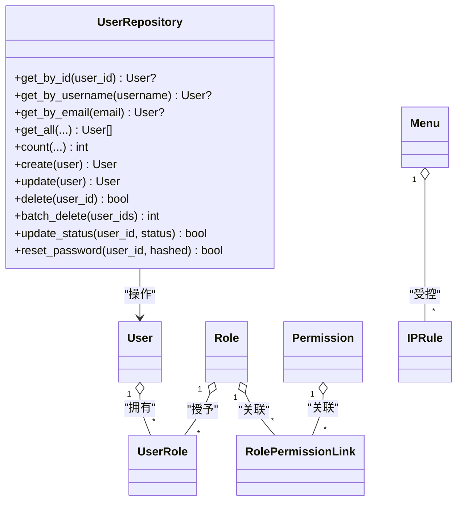
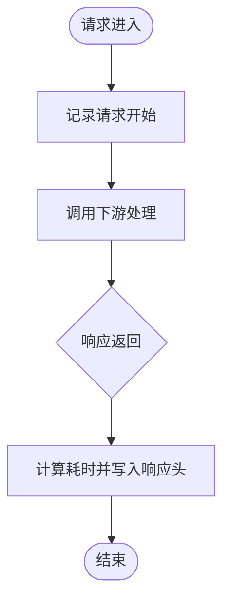
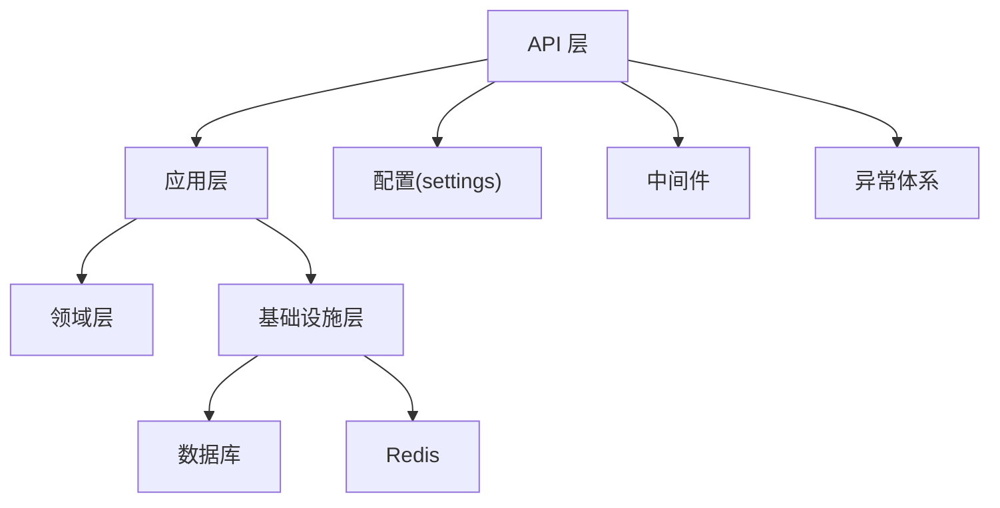

# 架构设计

<cite>
**本文引用的文件**
- [service/src/main.py](file://service/src/main.py)
- [service/README.md](file://service/README.md)
- [service/pyproject.toml](file://service/pyproject.toml)
- [service/src/config/settings.py](file://service/src/config/settings.py)
- [service/src/config/asgi.py](file://service/src/config/asgi.py)
- [service/src/api/v1/__init__.py](file://service/src/api/v1/__init__.py)
- [service/src/api/v1/auth_routes.py](file://service/src/api/v1/auth_routes.py)
- [service/src/application/services/auth_service.py](file://service/src/application/services/auth_service.py)
- [service/src/application/dto/auth_dto.py](file://service/src/application/dto/auth_dto.py)
- [service/src/domain/auth/password_service.py](file://service/src/domain/auth/password_service.py)
- [service/src/domain/user/repository.py](file://service/src/domain/user/repository.py)
- [service/src/infrastructure/repositories/user_repository.py](file://service/src/infrastructure/repositories/user_repository.py)
- [service/src/infrastructure/database/models.py](file://service/src/infrastructure/database/models.py)
- [service/src/core/exceptions.py](file://service/src/core/exceptions.py)
- [service/src/core/middlewares.py](file://service/src/core/middlewares.py)
</cite>

## 目录
1. [引言](#引言)
2. [项目结构](#项目结构)
3. [核心组件](#核心组件)
4. [架构总览](#架构总览)
5. [详细组件分析](#详细组件分析)
6. [依赖分析](#依赖分析)
7. [性能考虑](#性能考虑)
8. [故障排查指南](#故障排查指南)
9. [结论](#结论)
10. [附录](#附录)

## 引言
本项目采用 DDD（领域驱动设计）思想，结合 FastAPI 的异步能力，构建一个高内聚、低耦合、可扩展的分层架构 API 服务。整体目标是实现“业务逻辑与技术实现分离”，通过清晰的四层边界（API 层、应用层、领域层、基础设施层）隔离关注点，并在各层之间建立明确的依赖方向与交互模式。

## 项目结构
项目采用按层组织的目录结构，核心代码位于 service/src 下，前端位于 web/。本文聚焦后端 service/src 的架构实现。

- API 层：对外暴露 HTTP 接口，负责请求接入、参数校验、统一响应包装与依赖注入。
- 应用层：编排业务用例，协调领域服务与仓储，保证业务流程的正确性与幂等性。
- 领域层：封装核心业务规则与不变量，强调业务语义与可测试性。
- 基础设施层：提供数据库、缓存、外部服务等技术实现细节，对上层透明。

图表来源
- [service/src/api/v1/__init__.py:1-41](file://service/src/api/v1/__init__.py#L1-L41)
- [service/src/application/services/auth_service.py:1-154](file://service/src/application/services/auth_service.py#L1-L154)
- [service/src/domain/auth/password_service.py:1-21](file://service/src/domain/auth/password_service.py#L1-L21)
- [service/src/domain/user/repository.py:1-50](file://service/src/domain/user/repository.py#L1-L50)
- [service/src/infrastructure/repositories/user_repository.py:1-185](file://service/src/infrastructure/repositories/user_repository.py#L1-L185)
- [service/src/infrastructure/database/models.py:1-193](file://service/src/infrastructure/database/models.py#L1-L193)

章节来源
- [service/README.md:27-93](file://service/README.md#L27-L93)

## 核心组件
- 应用入口与生命周期：应用工厂、CORS、全局中间件、异常处理器、健康检查、路由注册。
- 配置系统：多环境配置加载、缓存、日志级别、数据库与 Redis 连接、JWT 参数等。
- 中间件：请求日志、IP 白黑名单过滤。
- 异常体系：统一业务异常基类与常见错误类型。
- 数据模型：用户、角色、权限、菜单、IP 规则等，采用 SQLModel 定义。
- 仓储接口与实现：领域接口定义与 SQLModel 实现，支持分页、筛选、批量操作等。
- 应用服务：认证服务，编排登录、注册、令牌刷新等业务流程。
- DTO：输入输出数据结构，确保 API 与应用层的数据契约清晰。

章节来源
- [service/src/main.py:1-96](file://service/src/main.py#L1-L96)
- [service/src/config/settings.py:1-198](file://service/src/config/settings.py#L1-L198)
- [service/src/core/middlewares.py:1-65](file://service/src/core/middlewares.py#L1-L65)
- [service/src/core/exceptions.py:1-60](file://service/src/core/exceptions.py#L1-L60)
- [service/src/infrastructure/database/models.py:1-193](file://service/src/infrastructure/database/models.py#L1-L193)
- [service/src/domain/user/repository.py:1-50](file://service/src/domain/user/repository.py#L1-L50)
- [service/src/infrastructure/repositories/user_repository.py:1-185](file://service/src/infrastructure/repositories/user_repository.py#L1-L185)
- [service/src/application/services/auth_service.py:1-154](file://service/src/application/services/auth_service.py#L1-L154)
- [service/src/application/dto/auth_dto.py:1-54](file://service/src/application/dto/auth_dto.py#L1-L54)

## 架构总览
本项目采用“自顶向下”的分层架构，API 层仅负责协议与协议转换；应用层编排业务；领域层承载不变量；基础设施层提供持久化与外部能力。依赖方向严格“向内”，即上层依赖下层接口，下层不依赖上层。

图表来源
- [service/src/main.py:34-96](file://service/src/main.py#L34-L96)
- [service/src/api/v1/auth_routes.py:1-86](file://service/src/api/v1/auth_routes.py#L1-L86)
- [service/src/application/services/auth_service.py:1-154](file://service/src/application/services/auth_service.py#L1-L154)
- [service/src/infrastructure/repositories/user_repository.py:1-185](file://service/src/infrastructure/repositories/user_repository.py#L1-L185)
- [service/src/infrastructure/database/models.py:1-193](file://service/src/infrastructure/database/models.py#L1-L193)

## 详细组件分析

### API 层：认证路由与依赖注入
- 路由聚合：系统级路由聚合器将认证、用户、角色、权限、菜单等子路由整合，统一前缀与标签。
- 认证路由：登录、注册、登出、刷新令牌接口，使用依赖注入获取数据库会话与当前用户。
- 统一响应：通过通用响应包装函数返回标准结构，便于前端消费与错误处理。

图表来源
- [service/src/api/v1/auth_routes.py:1-86](file://service/src/api/v1/auth_routes.py#L1-L86)
- [service/src/application/services/auth_service.py:1-154](file://service/src/application/services/auth_service.py#L1-L154)
- [service/src/infrastructure/repositories/user_repository.py:1-185](file://service/src/infrastructure/repositories/user_repository.py#L1-L185)
- [service/src/domain/auth/password_service.py:1-21](file://service/src/domain/auth/password_service.py#L1-L21)

章节来源
- [service/src/api/v1/__init__.py:1-41](file://service/src/api/v1/__init__.py#L1-L41)
- [service/src/api/v1/auth_routes.py:1-86](file://service/src/api/v1/auth_routes.py#L1-L86)

### 应用层：认证服务与 DTO
- 认证服务：封装登录、注册、刷新令牌等业务流程，协调仓储与领域服务，保证事务一致性与业务规则。
- DTO：定义输入输出数据结构，确保 API 与应用层契约清晰，便于测试与演进。

图表来源
- [service/src/application/services/auth_service.py:1-154](file://service/src/application/services/auth_service.py#L1-L154)
- [service/src/application/dto/auth_dto.py:1-54](file://service/src/application/dto/auth_dto.py#L1-L54)

章节来源
- [service/src/application/services/auth_service.py:1-154](file://service/src/application/services/auth_service.py#L1-L154)
- [service/src/application/dto/auth_dto.py:1-54](file://service/src/application/dto/auth_dto.py#L1-L54)

### 领域层：密码服务与用户仓储接口
- 密码服务：提供密码哈希与校验，封装底层加密算法，保障安全性。
- 用户仓储接口：定义用户相关操作的抽象契约，使应用层与基础设施层解耦。

图表来源
- [service/src/domain/auth/password_service.py:1-21](file://service/src/domain/auth/password_service.py#L1-L21)
- [service/src/domain/user/repository.py:1-50](file://service/src/domain/user/repository.py#L1-L50)

章节来源
- [service/src/domain/auth/password_service.py:1-21](file://service/src/domain/auth/password_service.py#L1-L21)
- [service/src/domain/user/repository.py:1-50](file://service/src/domain/user/repository.py#L1-L50)

### 基础设施层：仓储实现与数据库模型
- 仓储实现：基于 SQLModel 的用户仓储，实现查询、分页、筛选、批量删除、状态更新、密码重置等。
- 数据模型：定义用户、角色、权限、菜单、IP 规则等实体与关系，统一 ORM 与 Pydantic 数据模型。

图表来源
- [service/src/infrastructure/repositories/user_repository.py:1-185](file://service/src/infrastructure/repositories/user_repository.py#L1-L185)
- [service/src/infrastructure/database/models.py:1-193](file://service/src/infrastructure/database/models.py#L1-L193)

章节来源
- [service/src/infrastructure/repositories/user_repository.py:1-185](file://service/src/infrastructure/repositories/user_repository.py#L1-L185)
- [service/src/infrastructure/database/models.py:1-193](file://service/src/infrastructure/database/models.py#L1-L193)

### 配置与中间件
- 配置系统：多环境配置加载（development/production/testing），支持缓存与校验。
- 中间件：请求日志中间件记录请求耗时与状态；IP 白黑名单中间件进行访问控制。

图表来源
- [service/src/core/middlewares.py:1-65](file://service/src/core/middlewares.py#L1-L65)

章节来源
- [service/src/config/settings.py:1-198](file://service/src/config/settings.py#L1-L198)
- [service/src/core/middlewares.py:1-65](file://service/src/core/middlewares.py#L1-L65)

## 依赖分析
- 依赖方向：API 层 → 应用层 → 领域层；应用层 → 基础设施层；领域层不依赖应用层。
- 外部依赖：FastAPI、SQLModel、aiosqlite/asyncpg、Redis、bcrypt、JWE（JWT）、Loguru 等。
- 配置加载：按环境优先级加载，支持缓存与校验，确保运行时一致性。

图表来源
- [service/src/main.py:1-96](file://service/src/main.py#L1-L96)
- [service/src/config/settings.py:1-198](file://service/src/config/settings.py#L1-L198)
- [service/pyproject.toml:1-76](file://service/pyproject.toml#L1-L76)

章节来源
- [service/src/main.py:1-96](file://service/src/main.py#L1-L96)
- [service/pyproject.toml:1-76](file://service/pyproject.toml#L1-L76)

## 性能考虑
- 异步与并发：基于 FastAPI/SQLModel 异步能力，充分利用事件循环与连接池，提升吞吐。
- 事务与一致性：应用服务内聚合业务操作，减少跨层往返，降低锁竞争。
- 缓存策略：结合 Redis 缓存热点数据与令牌，降低数据库压力。
- 分页与筛选：仓储实现支持分页与多字段筛选，避免一次性加载大量数据。
- 中间件开销：请求日志中间件仅记录必要信息，避免阻塞主流程。

## 故障排查指南
- 全局异常处理：针对业务异常、参数校验异常与未捕获异常分别处理，统一返回结构，便于定位问题。
- 日志与追踪：中间件记录请求耗时与状态码，配合配置的日志级别快速定位问题。
- 健康检查：提供 /health 接口，便于容器编排与运维监控。

章节来源
- [service/src/main.py:60-87](file://service/src/main.py#L60-L87)
- [service/src/core/exceptions.py:1-60](file://service/src/core/exceptions.py#L1-L60)
- [service/src/core/middlewares.py:1-65](file://service/src/core/middlewares.py#L1-L65)

## 结论
本项目通过 DDD 四层架构实现了业务与技术的清晰分离，API 层专注协议与契约，应用层编排业务流程，领域层承载不变量，基础设施层提供可替换的技术实现。配合完善的配置、中间件与异常体系，既保证了可维护性，也为后续扩展与演进提供了坚实基础。

## 附录
- 部署与运行：支持 Docker 与生产环境部署，提供 CLI 管理命令与多环境配置。
- 开发规范：代码风格、静态检查与测试规范，确保质量与一致性。

章节来源
- [service/README.md:140-259](file://service/README.md#L140-L259)
- [service/pyproject.toml:69-76](file://service/pyproject.toml#L69-L76)