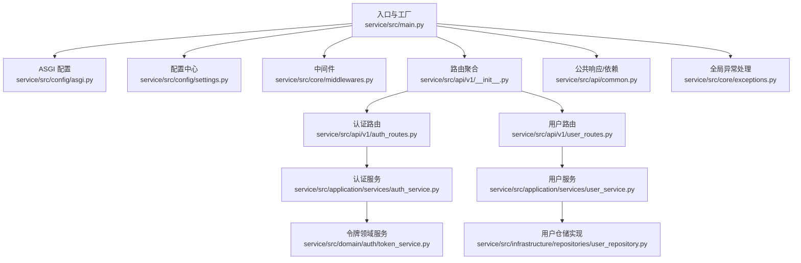
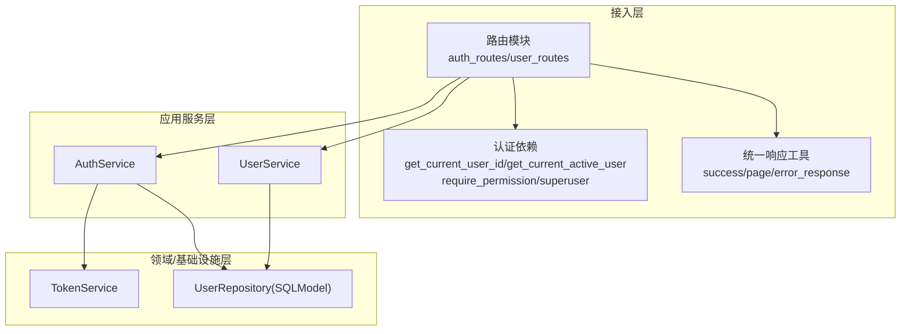
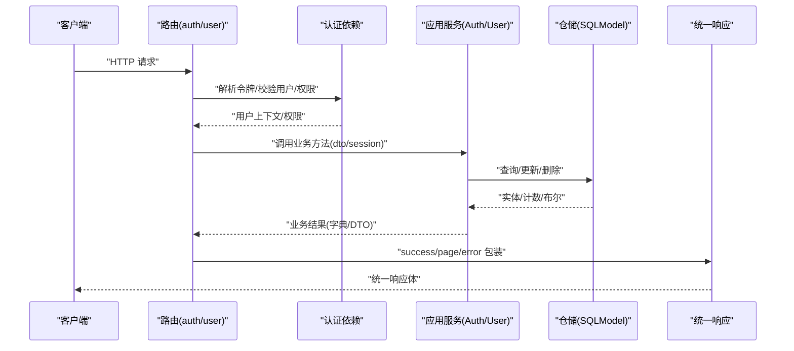
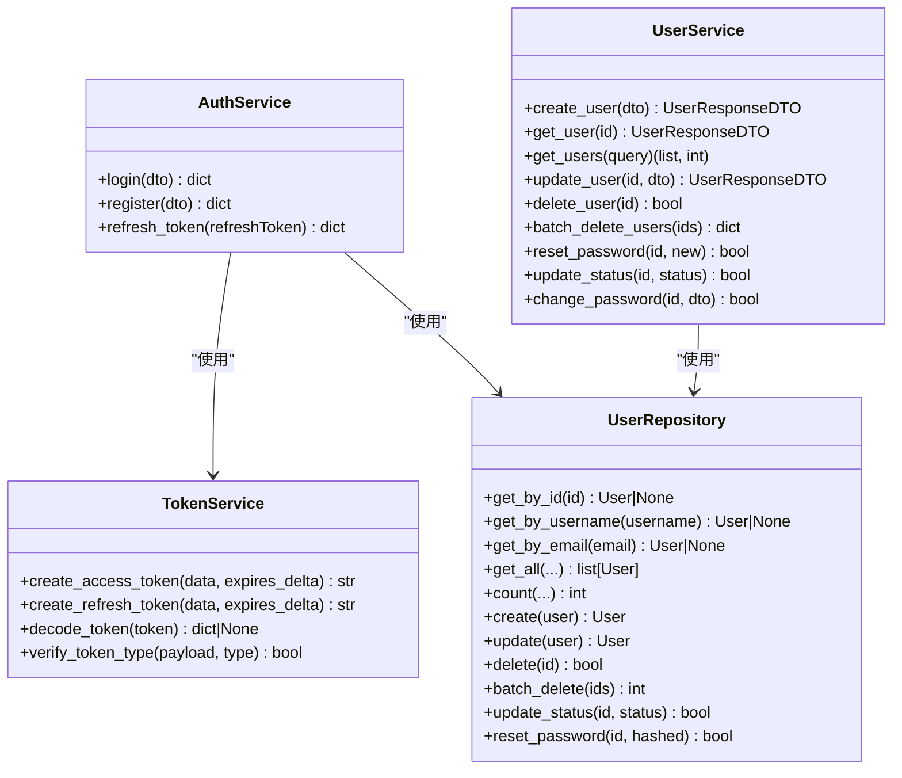
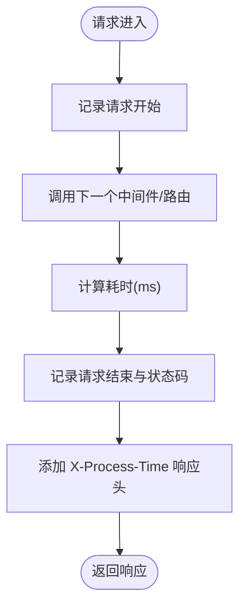
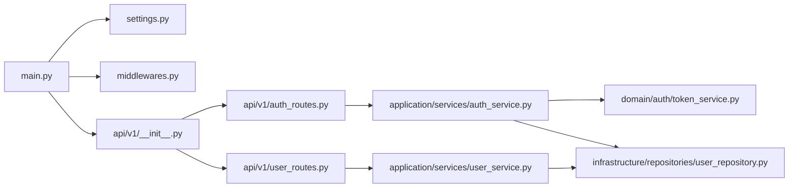

# 组件交互模式

<cite>
**本文引用的文件**
- [service/src/main.py](file://service/src/main.py)
- [service/src/config/asgi.py](file://service/src/config/asgi.py)
- [service/src/config/settings.py](file://service/src/config/settings.py)
- [service/src/core/middlewares.py](file://service/src/core/middlewares.py)
- [service/src/api/dependencies.py](file://service/src/api/dependencies.py)
- [service/src/api/common.py](file://service/src/api/common.py)
- [service/src/api/v1/__init__.py](file://service/src/api/v1/__init__.py)
- [service/src/api/v1/auth_routes.py](file://service/src/api/v1/auth_routes.py)
- [service/src/api/v1/user_routes.py](file://service/src/api/v1/user_routes.py)
- [service/src/application/dto/__init__.py](file://service/src/application/dto/__init__.py)
- [service/src/application/services/auth_service.py](file://service/src/application/services/auth_service.py)
- [service/src/application/services/user_service.py](file://service/src/application/services/user_service.py)
- [service/src/domain/auth/token_service.py](file://service/src/domain/auth/token_service.py)
- [service/src/infrastructure/repositories/user_repository.py](file://service/src/infrastructure/repositories/user_repository.py)
- [service/src/core/exceptions.py](file://service/src/core/exceptions.py)
</cite>

## 目录
1. [引言](#引言)
2. [项目结构](#项目结构)
3. [核心组件](#核心组件)
4. [架构总览](#架构总览)
5. [详细组件分析](#详细组件分析)
6. [依赖关系分析](#依赖关系分析)
7. [性能考量](#性能考量)
8. [故障排查指南](#故障排查指南)
9. [结论](#结论)
10. [附录](#附录)

## 引言
本文件面向 Hello-FastApi 项目的后端服务，系统性梳理组件交互模式与通信协议，重点覆盖以下主题：
- 依赖注入与工厂模式在路由、服务与仓储层的使用
- 中间件系统的工作原理与扩展方式
- DTO（数据传输对象）在请求/响应数据流转中的职责边界
- 请求处理流水线与响应生成流程
- 组件解耦与模块化设计最佳实践
- 常见设计模式（工厂、策略）在项目中的落地
- 组件集成与扩展的实用指导

## 项目结构
后端采用 FastAPI 应用工厂模式，按“配置 → 核心中间件 → 路由 → 应用服务 → 领域/仓储”的层次化组织。核心入口通过生命周期钩子进行数据库初始化与关闭；路由按功能域聚合；应用服务作为业务编排者，协调领域服务与仓储；DTO 作为跨层数据契约。

图表来源
- [service/src/main.py:34-96](file://service/src/main.py#L34-L96)
- [service/src/config/asgi.py:1-6](file://service/src/config/asgi.py#L1-L6)
- [service/src/config/settings.py:41-198](file://service/src/config/settings.py#L41-L198)
- [service/src/core/middlewares.py:12-65](file://service/src/core/middlewares.py#L12-L65)
- [service/src/api/v1/__init__.py:1-41](file://service/src/api/v1/__init__.py#L1-L41)
- [service/src/api/v1/auth_routes.py:1-86](file://service/src/api/v1/auth_routes.py#L1-L86)
- [service/src/api/v1/user_routes.py:1-252](file://service/src/api/v1/user_routes.py#L1-L252)
- [service/src/application/services/auth_service.py:15-154](file://service/src/application/services/auth_service.py#L15-L154)
- [service/src/application/services/user_service.py:18-322](file://service/src/application/services/user_service.py#L18-L322)
- [service/src/domain/auth/token_service.py:11-45](file://service/src/domain/auth/token_service.py#L11-L45)
- [service/src/infrastructure/repositories/user_repository.py:11-185](file://service/src/infrastructure/repositories/user_repository.py#L11-L185)
- [service/src/api/common.py:29-65](file://service/src/api/common.py#L29-L65)
- [service/src/core/exceptions.py:6-60](file://service/src/core/exceptions.py#L6-L60)

章节来源
- [service/src/main.py:34-96](file://service/src/main.py#L34-L96)
- [service/src/config/asgi.py:1-6](file://service/src/config/asgi.py#L1-L6)
- [service/src/config/settings.py:41-198](file://service/src/config/settings.py#L41-L198)

## 核心组件
- 应用工厂与生命周期：创建 FastAPI 实例、注册中间件、异常处理器、健康检查、路由聚合，并通过 lifespan 管理数据库连接的初始化与关闭。
- 配置中心：集中管理应用、数据库、Redis、JWT、CORS、限流、日志等配置，支持多环境加载与缓存。
- 中间件：提供请求日志中间件与 IP 白黑名单过滤中间件，统一处理请求前后置逻辑。
- 路由与依赖：路由模块按功能域聚合，认证依赖提供令牌解析、用户校验与权限校验；公共响应工具统一输出格式。
- 应用服务：封装业务流程，协调仓储与领域服务，保证业务规则与事务边界。
- 领域服务：如 TokenService，封装领域内算法与规则（JWT 编解码、类型校验）。
- 仓储实现：基于 SQLModel 的异步仓储，提供 CRUD 与复杂查询能力。
- DTO：定义请求/响应的数据结构与约束，确保跨层契约清晰。

章节来源
- [service/src/main.py:34-96](file://service/src/main.py#L34-L96)
- [service/src/config/settings.py:41-198](file://service/src/config/settings.py#L41-L198)
- [service/src/core/middlewares.py:12-65](file://service/src/core/middlewares.py#L12-L65)
- [service/src/api/dependencies.py:16-72](file://service/src/api/dependencies.py#L16-L72)
- [service/src/api/common.py:29-65](file://service/src/api/common.py#L29-L65)
- [service/src/application/services/auth_service.py:15-154](file://service/src/application/services/auth_service.py#L15-L154)
- [service/src/application/services/user_service.py:18-322](file://service/src/application/services/user_service.py#L18-L322)
- [service/src/domain/auth/token_service.py:11-45](file://service/src/domain/auth/token_service.py#L11-L45)
- [service/src/infrastructure/repositories/user_repository.py:11-185](file://service/src/infrastructure/repositories/user_repository.py#L11-L185)
- [service/src/application/dto/__init__.py:1-70](file://service/src/application/dto/__init__.py#L1-L70)

## 架构总览
系统采用“路由层 → 应用服务层 → 领域/仓储层”的分层架构，配合 DTO 进行数据契约约束，中间件贯穿请求处理流水线，异常体系统一处理业务与系统异常。

图表来源
- [service/src/api/v1/auth_routes.py:19-86](file://service/src/api/v1/auth_routes.py#L19-L86)
- [service/src/api/v1/user_routes.py:27-252](file://service/src/api/v1/user_routes.py#L27-L252)
- [service/src/api/dependencies.py:16-72](file://service/src/api/dependencies.py#L16-L72)
- [service/src/api/common.py:45-65](file://service/src/api/common.py#L45-L65)
- [service/src/application/services/auth_service.py:15-154](file://service/src/application/services/auth_service.py#L15-L154)
- [service/src/application/services/user_service.py:18-322](file://service/src/application/services/user_service.py#L18-L322)
- [service/src/domain/auth/token_service.py:11-45](file://service/src/domain/auth/token_service.py#L11-L45)
- [service/src/infrastructure/repositories/user_repository.py:11-185](file://service/src/infrastructure/repositories/user_repository.py#L11-L185)

## 详细组件分析

### 组件 A：请求处理流水线与响应生成
- 路由接收请求，依赖注入解析令牌与用户上下文，随后调用应用服务执行业务逻辑。
- 应用服务协调仓储与领域服务，完成数据持久化与业务规则校验。
- 服务返回 DTO 或字典结构，统一由公共响应工具包装为统一响应格式。
- 中间件在请求进入与返回阶段进行日志与安全控制。

图表来源
- [service/src/api/v1/auth_routes.py:19-86](file://service/src/api/v1/auth_routes.py#L19-L86)
- [service/src/api/v1/user_routes.py:27-252](file://service/src/api/v1/user_routes.py#L27-L252)
- [service/src/api/dependencies.py:16-72](file://service/src/api/dependencies.py#L16-L72)
- [service/src/api/common.py:45-65](file://service/src/api/common.py#L45-L65)
- [service/src/application/services/auth_service.py:26-74](file://service/src/application/services/auth_service.py#L26-L74)
- [service/src/application/services/user_service.py:25-57](file://service/src/application/services/user_service.py#L25-L57)
- [service/src/infrastructure/repositories/user_repository.py:17-25](file://service/src/infrastructure/repositories/user_repository.py#L17-L25)

章节来源
- [service/src/api/v1/auth_routes.py:19-86](file://service/src/api/v1/auth_routes.py#L19-L86)
- [service/src/api/v1/user_routes.py:27-252](file://service/src/api/v1/user_routes.py#L27-L252)
- [service/src/api/common.py:45-65](file://service/src/api/common.py#L45-L65)

### 组件 B：依赖注入与工厂模式
- 应用服务在路由中以构造函数注入 Session，形成“服务工厂”式调用，便于测试与替换。
- 认证依赖通过 FastAPI Security 与 Depends 实现，形成可组合的依赖链。
- 仓储实现遵循接口约定，便于替换与扩展。

图表来源
- [service/src/application/services/auth_service.py:15-154](file://service/src/application/services/auth_service.py#L15-L154)
- [service/src/application/services/user_service.py:18-322](file://service/src/application/services/user_service.py#L18-L322)
- [service/src/domain/auth/token_service.py:11-45](file://service/src/domain/auth/token_service.py#L11-L45)
- [service/src/infrastructure/repositories/user_repository.py:11-185](file://service/src/infrastructure/repositories/user_repository.py#L11-L185)

章节来源
- [service/src/application/services/auth_service.py:18-25](file://service/src/application/services/auth_service.py#L18-L25)
- [service/src/application/services/user_service.py:21-23](file://service/src/application/services/user_service.py#L21-L23)
- [service/src/api/dependencies.py:16-72](file://service/src/api/dependencies.py#L16-L72)

### 组件 C：中间件系统与扩展
- 请求日志中间件：记录请求开始、结束与耗时，附加 X-Process-Time 响应头。
- IP 白黑名单中间件：支持白名单优先与黑名单拦截。
- 扩展建议：新增限流中间件可复用 BaseHTTPMiddleware，按需在 dispatch 中实现速率控制与缓存统计。

图表来源
- [service/src/core/middlewares.py:12-40](file://service/src/core/middlewares.py#L12-L40)

章节来源
- [service/src/core/middlewares.py:12-65](file://service/src/core/middlewares.py#L12-L65)

### 组件 D：DTO 模式与数据契约
- DTO 作为跨层数据载体，明确输入输出结构，避免业务层与接口层耦合。
- 聚合导出统一暴露 DTO 名称，便于路由与服务层引用。
- 建议：对复杂查询 DTO（如分页）在应用服务层进行参数校验与默认值处理。

章节来源
- [service/src/application/dto/__init__.py:1-70](file://service/src/application/dto/__init__.py#L1-L70)

### 组件 E：路由聚合与命名空间
- 路由按功能域聚合，统一前缀与标签，提升可维护性与可发现性。
- 认证路由直接挂载在系统路由下，用户/角色/权限/菜单路由分别挂载不同前缀。

章节来源
- [service/src/api/v1/__init__.py:14-41](file://service/src/api/v1/__init__.py#L14-L41)

### 组件 F：异常处理与统一响应
- 全局异常处理器捕获业务异常与验证异常，统一返回 code/message/data 结构。
- 统一响应工具提供 success/page/error 三种常用响应模板，减少重复代码。

章节来源
- [service/src/main.py:60-83](file://service/src/main.py#L60-L83)
- [service/src/api/common.py:29-65](file://service/src/api/common.py#L29-L65)
- [service/src/core/exceptions.py:6-60](file://service/src/core/exceptions.py#L6-L60)

## 依赖关系分析
- 入口依赖配置中心与路由聚合，路由依赖认证依赖与应用服务，应用服务依赖仓储与领域服务，仓储依赖 SQLModel。
- 依赖方向清晰，低层组件不依赖高层组件，符合分层架构原则。
- 可能的循环依赖风险：路由与服务之间为单向依赖，未见循环；仓储与领域服务为单向依赖，未见循环。

图表来源
- [service/src/main.py:34-96](file://service/src/main.py#L34-L96)
- [service/src/config/settings.py:41-198](file://service/src/config/settings.py#L41-L198)
- [service/src/core/middlewares.py:12-65](file://service/src/core/middlewares.py#L12-L65)
- [service/src/api/v1/__init__.py:14-41](file://service/src/api/v1/__init__.py#L14-L41)
- [service/src/api/v1/auth_routes.py:19-86](file://service/src/api/v1/auth_routes.py#L19-L86)
- [service/src/api/v1/user_routes.py:27-252](file://service/src/api/v1/user_routes.py#L27-L252)
- [service/src/application/services/auth_service.py:15-154](file://service/src/application/services/auth_service.py#L15-L154)
- [service/src/application/services/user_service.py:18-322](file://service/src/application/services/user_service.py#L18-L322)
- [service/src/domain/auth/token_service.py:11-45](file://service/src/domain/auth/token_service.py#L11-L45)
- [service/src/infrastructure/repositories/user_repository.py:11-185](file://service/src/infrastructure/repositories/user_repository.py#L11-L185)

章节来源
- [service/src/main.py:34-96](file://service/src/main.py#L34-L96)
- [service/src/api/v1/__init__.py:14-41](file://service/src/api/v1/__init__.py#L14-L41)

## 性能考量
- 中间件开销：请求日志中间件仅做轻量记录与耗时计算，对性能影响较小；IP 过滤中间件在高并发场景建议结合缓存与限流。
- 仓储查询：分页与筛选参数在仓储层实现，注意索引与 SQL 复杂度；批量删除建议分批处理以避免长事务。
- 令牌签发：JWT 编解码为纯内存操作，注意密钥长度与算法选择；刷新令牌流程避免频繁调用。
- 响应头：X-Process-Time 仅用于调试，生产环境可关闭或降采样。

## 故障排查指南
- 认证失败：检查令牌是否过期、类型是否正确、用户是否存在且启用；查看依赖注入是否正确传递用户上下文。
- 权限不足：确认用户角色与权限集合，检查 require_permission 的权限码是否一致。
- 参数校验失败：关注统一响应中的 errors 字段，定位具体字段与错误原因。
- 未捕获异常：查看全局异常处理器返回的统一错误结构，核对业务异常类型与状态码映射。

章节来源
- [service/src/api/dependencies.py:16-72](file://service/src/api/dependencies.py#L16-L72)
- [service/src/main.py:60-83](file://service/src/main.py#L60-L83)
- [service/src/core/exceptions.py:6-60](file://service/src/core/exceptions.py#L6-L60)

## 结论
本项目通过清晰的分层架构、统一的 DTO 契约、可组合的依赖注入与中间件体系，实现了高内聚、低耦合的服务设计。路由聚合与工厂模式提升了可维护性与可扩展性；异常与响应统一处理增强了可观测性与一致性。建议在后续迭代中引入限流中间件、缓存策略与更细粒度的监控埋点，持续优化性能与稳定性。

## 附录
- 组件集成与扩展最佳实践
  - 新增路由：在对应 v1 子模块创建路由文件，按现有前缀与权限约定注册。
  - 新增应用服务：在 application/services 下新增服务类，构造函数注入 Session，必要时注入领域服务。
  - 新增仓储：在 infrastructure/repositories 下新增实现类，遵循接口约定，保持异步与事务边界。
  - 新增 DTO：在 application/dto 下新增 DTO 类，通过 __init__.py 聚合导出。
  - 中间件扩展：继承 BaseHTTPMiddleware，在 dispatch 中实现前置/后置逻辑，按需注册到应用。
  - 配置扩展：在 settings.py 中新增字段与校验，必要时新增环境配置类。