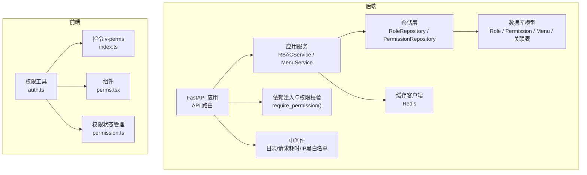
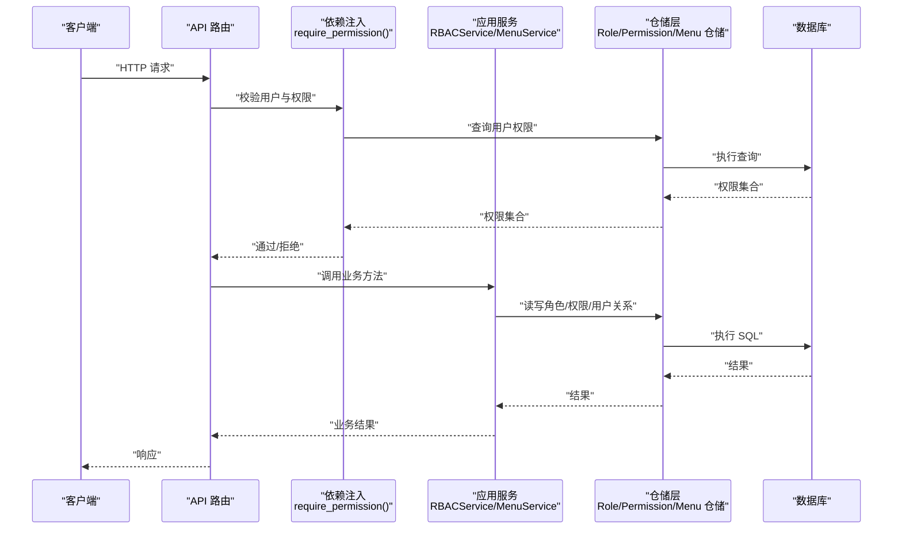
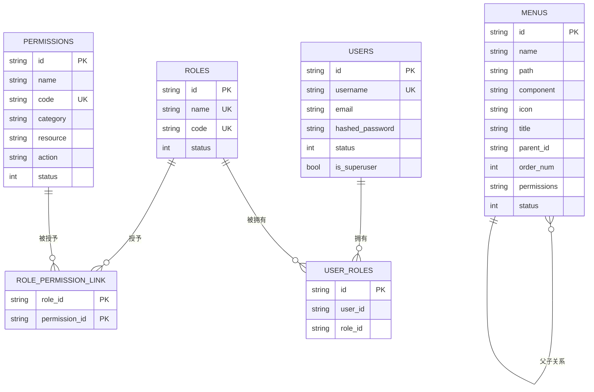
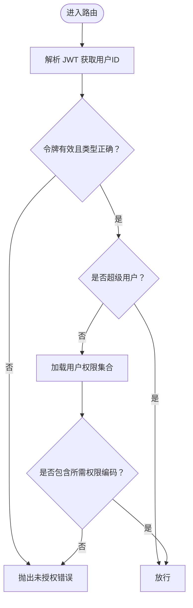
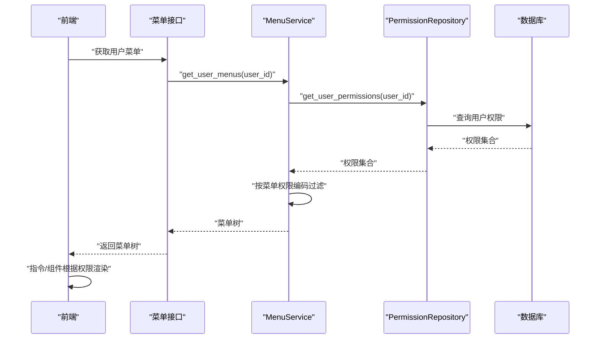
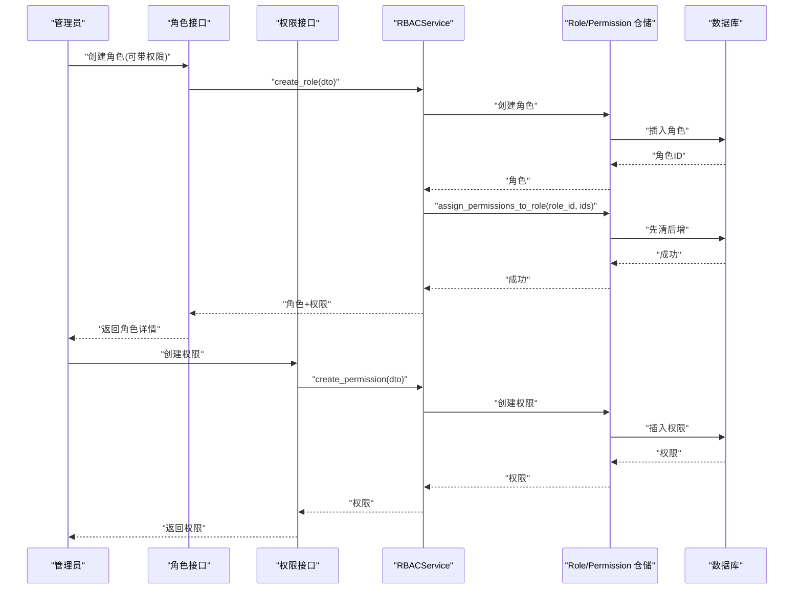
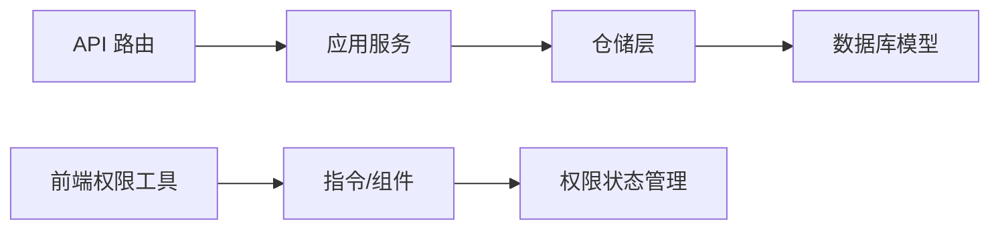

# RBAC 权限控制

<cite>
**本文引用的文件**
- [rbac_repository.py](file://service/src/infrastructure/repositories/rbac_repository.py)
- [rbac_service.py](file://service/src/application/services/rbac_service.py)
- [rbac_routes.py](file://service/src/api/v1/rbac_routes.py)
- [models.py](file://service/src/infrastructure/database/models.py)
- [dependencies.py](file://service/src/api/dependencies.py)
- [menu_routes.py](file://service/src/api/v1/menu_routes.py)
- [menu_service.py](file://service/src/application/services/menu_service.py)
- [rbac_dto.py](file://service/src/application/dto/rbac_dto.py)
- [auth.ts](file://web/src/utils/auth.ts)
- [index.ts](file://web/src/directives/perms/index.ts)
- [perms.tsx](file://web/src/components/RePerms/src/perms.tsx)
- [permission.ts](file://web/src/store/modules/permission.ts)
- [redis_client.py](file://service/src/infrastructure/cache/redis_client.py)
- [middlewares.py](file://service/src/core/middlewares.py)
</cite>

## 目录
1. [简介](#简介)
2. [项目结构](#项目结构)
3. [核心组件](#核心组件)
4. [架构总览](#架构总览)
5. [详细组件分析](#详细组件分析)
6. [依赖分析](#依赖分析)
7. [性能考虑](#性能考虑)
8. [故障排查指南](#故障排查指南)
9. [结论](#结论)
10. [附录](#附录)

## 简介
本文件面向 RBAC（基于角色的访问控制）权限控制系统，系统分为后端服务与前端界面两部分：
- 后端采用 FastAPI + SQLModel，提供角色、权限、用户三者关系的管理与校验；菜单权限与按钮权限由后端权限编码驱动，前端据此渲染与控制可见性。
- 前端采用 Vue 3 + TypeScript，通过指令与组件实现按钮级权限控制，通过权限状态管理与路由守卫实现菜单级权限过滤。

本技术文档将从数据模型、服务层、API 路由、中间件与前端集成等维度，系统阐述 RBAC 设计原理与实现细节，并给出最佳实践与性能优化建议。

## 项目结构
后端服务位于 service/src，前端界面位于 web/src。RBAC 相关的关键目录与文件如下：
- 后端
  - 数据模型：service/src/infrastructure/database/models.py
  - 仓储层：service/src/infrastructure/repositories/rbac_repository.py
  - 应用服务：service/src/application/services/rbac_service.py
  - API 路由：service/src/api/v1/rbac_routes.py、service/src/api/v1/menu_routes.py
  - DTO：service/src/application/dto/rbac_dto.py
  - 依赖注入与权限校验：service/src/api/dependencies.py
  - 中间件：service/src/core/middlewares.py
  - 缓存：service/src/infrastructure/cache/redis_client.py
- 前端
  - 权限工具：web/src/utils/auth.ts
  - 指令 v-perms：web/src/directives/perms/index.ts
  - 组件 <Perms>：web/src/components/RePerms/src/perms.tsx
  - 权限状态管理：web/src/store/modules/permission.ts

**图表来源**
- [rbac_routes.py:1-257](file://service/src/api/v1/rbac_routes.py#L1-L257)
- [menu_routes.py:1-71](file://service/src/api/v1/menu_routes.py#L1-L71)
- [rbac_service.py:1-231](file://service/src/application/services/rbac_service.py#L1-L231)
- [menu_service.py:1-169](file://service/src/application/services/menu_service.py#L1-L169)
- [rbac_repository.py:1-213](file://service/src/infrastructure/repositories/rbac_repository.py#L1-L213)
- [models.py:1-193](file://service/src/infrastructure/database/models.py#L1-L193)
- [dependencies.py:1-72](file://service/src/api/dependencies.py#L1-L72)
- [middlewares.py:1-65](file://service/src/core/middlewares.py#L1-L65)
- [redis_client.py:1-24](file://service/src/infrastructure/cache/redis_client.py#L1-L24)
- [auth.ts:1-142](file://web/src/utils/auth.ts#L1-L142)
- [index.ts:1-16](file://web/src/directives/perms/index.ts#L1-L16)
- [perms.tsx:1-21](file://web/src/components/RePerms/src/perms.tsx#L1-L21)
- [permission.ts:1-76](file://web/src/store/modules/permission.ts#L1-L76)

**章节来源**
- [rbac_routes.py:1-257](file://service/src/api/v1/rbac_routes.py#L1-L257)
- [menu_routes.py:1-71](file://service/src/api/v1/menu_routes.py#L1-L71)
- [rbac_service.py:1-231](file://service/src/application/services/rbac_service.py#L1-L231)
- [menu_service.py:1-169](file://service/src/application/services/menu_service.py#L1-L169)
- [rbac_repository.py:1-213](file://service/src/infrastructure/repositories/rbac_repository.py#L1-L213)
- [models.py:1-193](file://service/src/infrastructure/database/models.py#L1-L193)
- [dependencies.py:1-72](file://service/src/api/dependencies.py#L1-L72)
- [middlewares.py:1-65](file://service/src/core/middlewares.py#L1-L65)
- [redis_client.py:1-24](file://service/src/infrastructure/cache/redis_client.py#L1-L24)
- [auth.ts:1-142](file://web/src/utils/auth.ts#L1-L142)
- [index.ts:1-16](file://web/src/directives/perms/index.ts#L1-L16)
- [perms.tsx:1-21](file://web/src/components/RePerms/src/perms.tsx#L1-L21)
- [permission.ts:1-76](file://web/src/store/modules/permission.ts#L1-L76)

## 核心组件
- 数据模型与关系
  - 用户、角色、权限三者通过关联表建立多对多关系：用户-角色、角色-权限。
  - 菜单模型包含权限编码字符串，用于后端按权限过滤菜单。
- 仓储层
  - 提供角色、权限、用户-角色、角色-权限等 CRUD 与聚合查询。
  - 支持“先清后增”的权限分配策略，确保角色权限的原子替换。
- 应用服务
  - RBACService：封装角色、权限、用户角色/权限的业务逻辑。
  - MenuService：构建菜单树、按用户权限过滤菜单。
- API 路由
  - 提供角色与权限的增删改查、权限分配、用户角色管理等接口。
  - 使用依赖项 require_permission 对接口进行动态权限校验。
- 前端
  - 权限工具：存储与解析用户权限，提供按钮级权限判断。
  - 指令与组件：v-perms 与 <Perms> 组件实现按钮级可见性控制。
  - 权限状态管理：整合菜单树与路由，过滤无权限节点。

**章节来源**
- [models.py:17-141](file://service/src/infrastructure/database/models.py#L17-L141)
- [rbac_repository.py:11-213](file://service/src/infrastructure/repositories/rbac_repository.py#L11-L213)
- [rbac_service.py:19-231](file://service/src/application/services/rbac_service.py#L19-L231)
- [menu_service.py:15-169](file://service/src/application/services/menu_service.py#L15-L169)
- [rbac_routes.py:30-257](file://service/src/api/v1/rbac_routes.py#L30-L257)
- [menu_routes.py:19-71](file://service/src/api/v1/menu_routes.py#L19-L71)
- [auth.ts:130-142](file://web/src/utils/auth.ts#L130-L142)
- [index.ts:4-16](file://web/src/directives/perms/index.ts#L4-L16)
- [perms.tsx:4-21](file://web/src/components/RePerms/src/perms.tsx#L4-L21)
- [permission.ts:25-71](file://web/src/store/modules/permission.ts#L25-L71)

## 架构总览
RBAC 架构遵循分层设计：API 路由层负责请求接入与权限依赖注入，应用服务层编排业务逻辑，仓储层封装数据访问，数据库模型定义实体与关系。前端通过指令与组件消费后端权限能力，实现菜单与按钮级权限控制。

**图表来源**
- [rbac_routes.py:33-177](file://service/src/api/v1/rbac_routes.py#L33-L177)
- [menu_routes.py:19-71](file://service/src/api/v1/menu_routes.py#L19-L71)
- [dependencies.py:45-61](file://service/src/api/dependencies.py#L45-L61)
- [rbac_service.py:19-231](file://service/src/application/services/rbac_service.py#L19-L231)
- [menu_service.py:22-169](file://service/src/application/services/menu_service.py#L22-L169)
- [rbac_repository.py:11-213](file://service/src/infrastructure/repositories/rbac_repository.py#L11-L213)
- [models.py:17-141](file://service/src/infrastructure/database/models.py#L17-L141)

## 详细组件分析

### 数据模型与关系映射
- 实体与关系
  - User：用户实体，包含基础字段与状态。
  - Role：角色实体，包含唯一编码与状态。
  - Permission：权限实体，包含唯一编码、分类、资源与动作等。
  - 关联表：
    - RolePermissionLink：角色-权限多对多。
    - UserRole：用户-角色多对多。
  - Menu：菜单实体，包含权限编码字符串，用于后端按权限过滤。
- 复杂度与约束
  - 唯一索引：角色编码、权限编码唯一。
  - 外键级联：删除角色/用户时级联删除关联记录。
  - 查询复杂度：用户权限查询通过三层 JOIN，时间复杂度 O(n)（n 为用户角色数）。

**图表来源**
- [models.py:31-141](file://service/src/infrastructure/database/models.py#L31-L141)

**章节来源**
- [models.py:17-141](file://service/src/infrastructure/database/models.py#L17-L141)

### 权限验证中间件与动态权限检查流程
- 动态权限依赖注入
  - require_permission(code) 依赖工厂：在路由层声明所需权限，运行时校验当前用户是否具备该权限编码。
  - 超级用户 bypass：is_superuser 为真时跳过权限校验。
- 校验流程
  - 从 JWT 解析用户 ID，校验令牌类型与有效性。
  - 通过 PermissionRepository 获取用户权限集合，匹配目标权限编码。
  - 未满足则抛出禁止访问错误，否则放行。
- 中间件
  - RequestLoggingMiddleware：统一记录请求与耗时。
  - IPFilterMiddleware：基于白/黑名单过滤访问。

**图表来源**
- [dependencies.py:45-61](file://service/src/api/dependencies.py#L45-L61)
- [rbac_repository.py:203-212](file://service/src/infrastructure/repositories/rbac_repository.py#L203-L212)
- [middlewares.py:12-65](file://service/src/core/middlewares.py#L12-L65)

**章节来源**
- [dependencies.py:16-72](file://service/src/api/dependencies.py#L16-L72)
- [rbac_repository.py:84-96](file://service/src/infrastructure/repositories/rbac_repository.py#L84-L96)
- [rbac_service.py:195-199](file://service/src/application/services/rbac_service.py#L195-L199)
- [middlewares.py:12-65](file://service/src/core/middlewares.py#L12-L65)

### 菜单权限生成与按钮权限控制
- 菜单权限生成
  - 后端菜单模型保存权限编码字符串，MenuService 在获取用户菜单时按权限集合过滤。
  - 超级用户返回全部菜单树；普通用户仅返回与用户权限有交集的菜单。
- 按钮权限控制
  - 前端权限工具 hasPerms 判断当前用户是否拥有指定按钮权限编码。
  - 指令 v-perms 与组件 <Perms> 在挂载时根据权限决定 DOM 是否渲染。
  - 权限状态管理整合菜单树与路由，过滤无权限节点。

**图表来源**
- [menu_routes.py:29-36](file://service/src/api/v1/menu_routes.py#L29-L36)
- [menu_service.py:27-51](file://service/src/application/services/menu_service.py#L27-L51)
- [rbac_repository.py:203-212](file://service/src/infrastructure/repositories/rbac_repository.py#L203-L212)
- [auth.ts:130-142](file://web/src/utils/auth.ts#L130-L142)
- [index.ts:4-16](file://web/src/directives/perms/index.ts#L4-L16)
- [perms.tsx:12-19](file://web/src/components/RePerms/src/perms.tsx#L12-L19)

**章节来源**
- [menu_routes.py:19-71](file://service/src/api/v1/menu_routes.py#L19-L71)
- [menu_service.py:27-51](file://service/src/application/services/menu_service.py#L27-L51)
- [rbac_repository.py:203-212](file://service/src/infrastructure/repositories/rbac_repository.py#L203-L212)
- [auth.ts:130-142](file://web/src/utils/auth.ts#L130-L142)
- [index.ts:4-16](file://web/src/directives/perms/index.ts#L4-L16)
- [perms.tsx:12-19](file://web/src/components/RePerms/src/perms.tsx#L12-L19)
- [permission.ts:25-34](file://web/src/store/modules/permission.ts#L25-L34)

### 角色、权限、用户关系与 API 工作流
- 角色与权限
  - 角色创建支持同时分配权限；更新角色可替换权限集合。
  - 为角色分配权限采用“先清后增”策略，保证幂等与一致性。
- 用户与角色/权限
  - 为用户分配角色时去重；移除角色时精确匹配。
  - 用户权限查询通过用户-角色-角色-权限链路聚合，去重返回。
- API 工作流
  - 角色管理与权限管理接口均通过 require_permission 进行动态校验。
  - 返回数据统一通过 DTO 转换，保持前后端契约稳定。

**图表来源**
- [rbac_routes.py:64-177](file://service/src/api/v1/rbac_routes.py#L64-L177)
- [rbac_service.py:28-147](file://service/src/application/services/rbac_service.py#L28-L147)
- [rbac_repository.py:84-96](file://service/src/infrastructure/repositories/rbac_repository.py#L84-L96)
- [rbac_dto.py:8-88](file://service/src/application/dto/rbac_dto.py#L8-L88)

**章节来源**
- [rbac_routes.py:33-177](file://service/src/api/v1/rbac_routes.py#L33-L177)
- [rbac_service.py:28-147](file://service/src/application/services/rbac_service.py#L28-L147)
- [rbac_repository.py:84-96](file://service/src/infrastructure/repositories/rbac_repository.py#L84-L96)
- [rbac_dto.py:8-88](file://service/src/application/dto/rbac_dto.py#L8-L88)

## 依赖分析
- 组件耦合与内聚
  - API 路由依赖依赖注入与应用服务，职责清晰；应用服务依赖仓储接口，便于替换实现。
  - 仓储层依赖 SQLModel 与数据库模型，关注数据访问细节。
  - 前端权限工具与指令/组件解耦，通过权限状态管理统一消费。
- 外部依赖
  - FastAPI、SQLModel、Pydantic、redis.asyncio。
- 循环依赖
  - 未发现循环导入；各层单向依赖，结构清晰。

**图表来源**
- [rbac_routes.py:1-257](file://service/src/api/v1/rbac_routes.py#L1-L257)
- [menu_routes.py:1-71](file://service/src/api/v1/menu_routes.py#L1-L71)
- [rbac_service.py:1-231](file://service/src/application/services/rbac_service.py#L1-L231)
- [menu_service.py:1-169](file://service/src/application/services/menu_service.py#L1-L169)
- [rbac_repository.py:1-213](file://service/src/infrastructure/repositories/rbac_repository.py#L1-L213)
- [models.py:1-193](file://service/src/infrastructure/database/models.py#L1-L193)
- [auth.ts:1-142](file://web/src/utils/auth.ts#L1-L142)
- [index.ts:1-16](file://web/src/directives/perms/index.ts#L1-L16)
- [perms.tsx:1-21](file://web/src/components/RePerms/src/perms.tsx#L1-L21)
- [permission.ts:1-76](file://web/src/store/modules/permission.ts#L1-L76)

**章节来源**
- [rbac_routes.py:1-257](file://service/src/api/v1/rbac_routes.py#L1-L257)
- [menu_routes.py:1-71](file://service/src/api/v1/menu_routes.py#L1-L71)
- [rbac_service.py:1-231](file://service/src/application/services/rbac_service.py#L1-L231)
- [menu_service.py:1-169](file://service/src/application/services/menu_service.py#L1-L169)
- [rbac_repository.py:1-213](file://service/src/infrastructure/repositories/rbac_repository.py#L1-L213)
- [models.py:1-193](file://service/src/infrastructure/database/models.py#L1-L193)
- [auth.ts:1-142](file://web/src/utils/auth.ts#L1-L142)
- [index.ts:1-16](file://web/src/directives/perms/index.ts#L1-L16)
- [perms.tsx:1-21](file://web/src/components/RePerms/src/perms.tsx#L1-L21)
- [permission.ts:1-76](file://web/src/store/modules/permission.ts#L1-L76)

## 性能考虑
- 查询优化
  - 用户权限查询使用 JOIN 并去重，建议在权限编码与用户-角色关联上建立索引以提升匹配效率。
  - 菜单过滤采用集合交集，建议限制单个菜单关联权限数量，避免过多权限字符串导致匹配成本上升。
- 缓存策略
  - 可引入 Redis 缓存用户权限集合与菜单树，结合令牌失效时间进行缓存更新/淘汰。
  - 缓存客户端已提供连接管理，可在应用服务层封装缓存读写。
- 批量操作
  - 角色权限分配采用“先清后增”，在权限数量较大时建议批量插入以减少往返。
- 日志与监控
  - 使用请求耗时中间件记录慢查询与异常路径，结合指标监控定位热点接口。

**章节来源**
- [rbac_repository.py:203-212](file://service/src/infrastructure/repositories/rbac_repository.py#L203-L212)
- [menu_service.py:40-51](file://service/src/application/services/menu_service.py#L40-L51)
- [redis_client.py:10-24](file://service/src/infrastructure/cache/redis_client.py#L10-L24)
- [middlewares.py:12-39](file://service/src/core/middlewares.py#L12-L39)

## 故障排查指南
- 常见错误与定位
  - 未授权/权限不足：检查 require_permission 依赖是否正确声明，确认用户权限集合是否包含目标编码。
  - 用户不存在或账户禁用：检查 get_current_active_user 依赖与用户状态字段。
  - 角色/权限不存在：检查 DTO 校验与服务层异常抛出点。
  - 菜单删除失败：检查是否存在子菜单，避免破坏层级完整性。
- 建议排查步骤
  - 查看请求日志与耗时头，定位慢接口。
  - 校验 JWT 令牌类型与有效期，确认令牌解析正确。
  - 核对权限编码命名规范与大小写，避免匹配失败。
  - 前端检查权限状态管理与指令/组件使用方式。

**章节来源**
- [dependencies.py:16-72](file://service/src/api/dependencies.py#L16-L72)
- [rbac_routes.py:132-151](file://service/src/api/v1/rbac_routes.py#L132-L151)
- [menu_routes.py:117-129](file://service/src/api/v1/menu_routes.py#L117-L129)
- [middlewares.py:12-39](file://service/src/core/middlewares.py#L12-L39)

## 结论
本系统以清晰的分层架构实现了 RBAC 权限控制：后端通过依赖注入与应用服务实现动态权限校验与菜单/按钮级权限过滤，前端通过指令与组件实现 UI 层的权限控制。数据模型简洁明确，仓储层提供稳定的 CRUD 与聚合查询能力。建议在生产环境中引入缓存与索引优化，并持续完善权限编码规范与前端权限状态管理。

## 附录
- 最佳实践
  - 权限编码命名规范：采用“资源:动作”语义，如 “menu:view”、“btn.add”。
  - 角色最小权限原则：为角色分配必要的最小权限集合。
  - 超级用户谨慎使用：仅在运维场景启用，避免滥用。
  - 前端权限控制：指令与组件双保险，避免仅依赖后端校验。
- 扩展性设计
  - 自定义权限类型：在 Permission 模型中新增字段（如资源、动作），在前端与后端分别扩展匹配逻辑。
  - 多租户支持：在用户、角色、权限模型中增加租户字段与过滤条件。
  - 权限继承：在角色层级上实现继承关系，扩展用户权限计算逻辑。
- 性能优化清单
  - 为权限编码与用户-角色关联建立索引。
  - 引入 Redis 缓存用户权限与菜单树。
  - 批量插入角色权限，减少数据库往返。
  - 使用异步查询与连接池，提升并发处理能力。