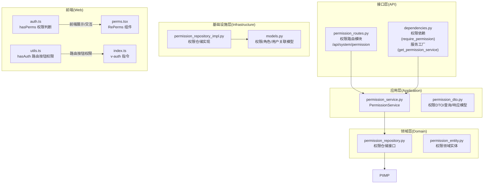
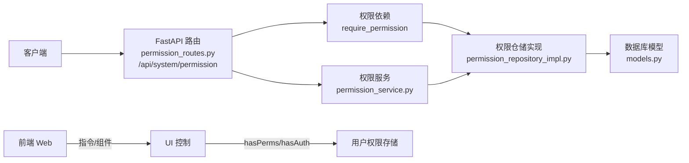
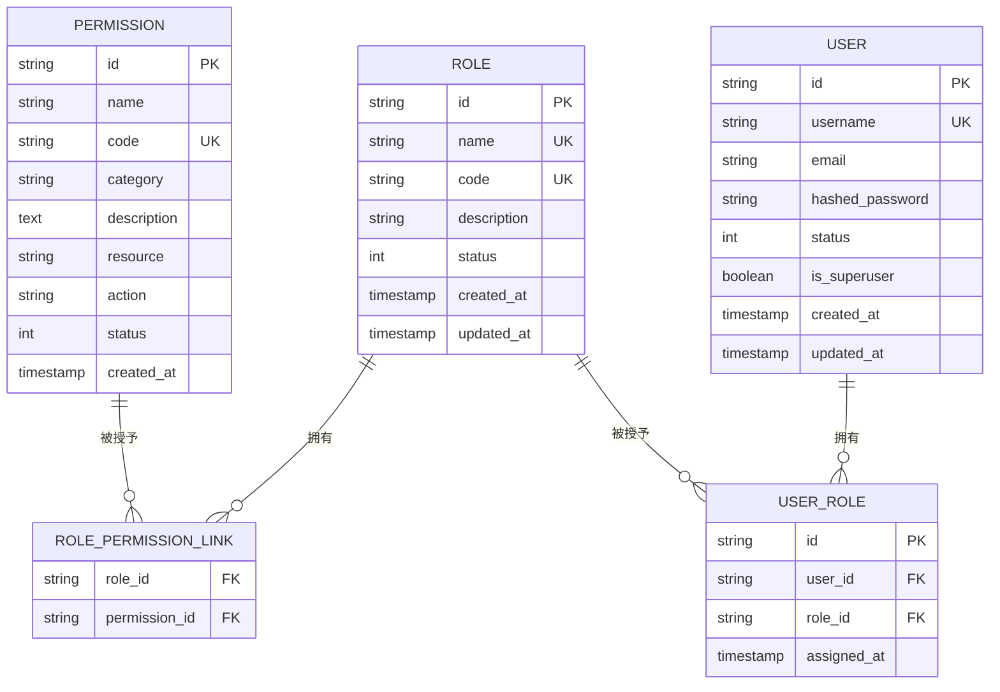
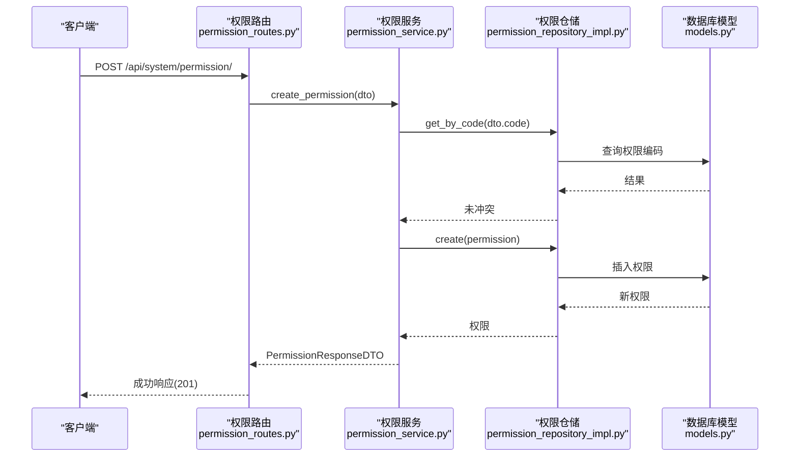
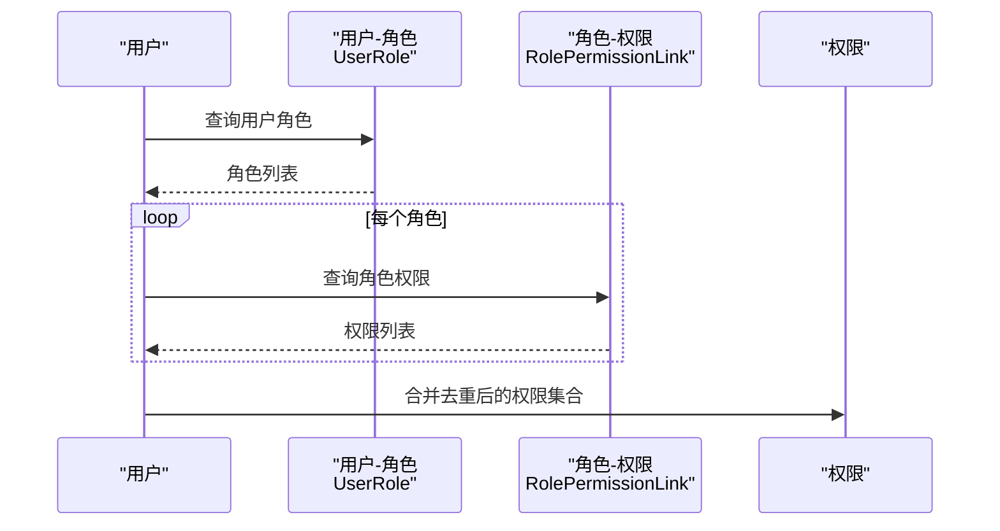
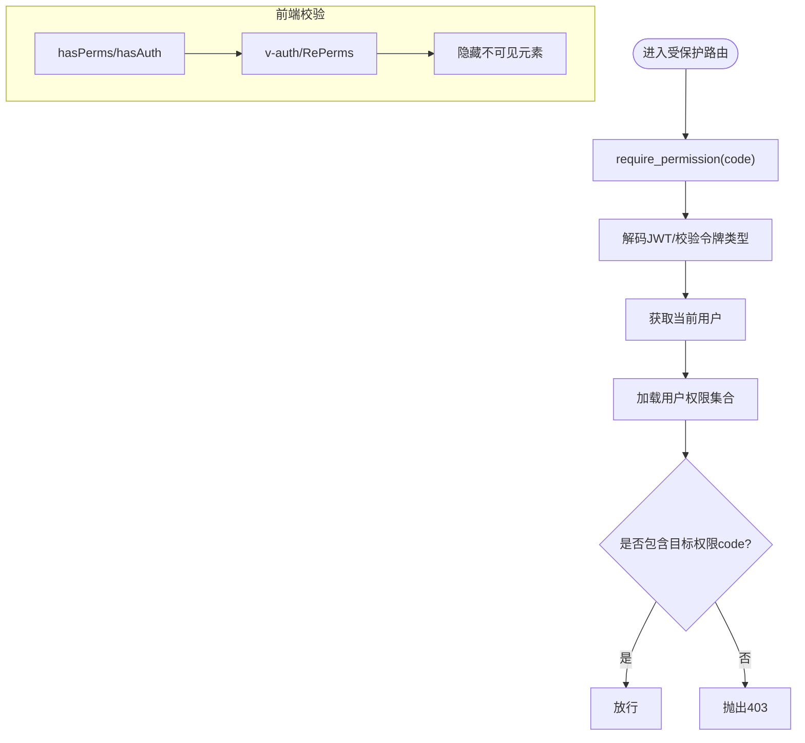
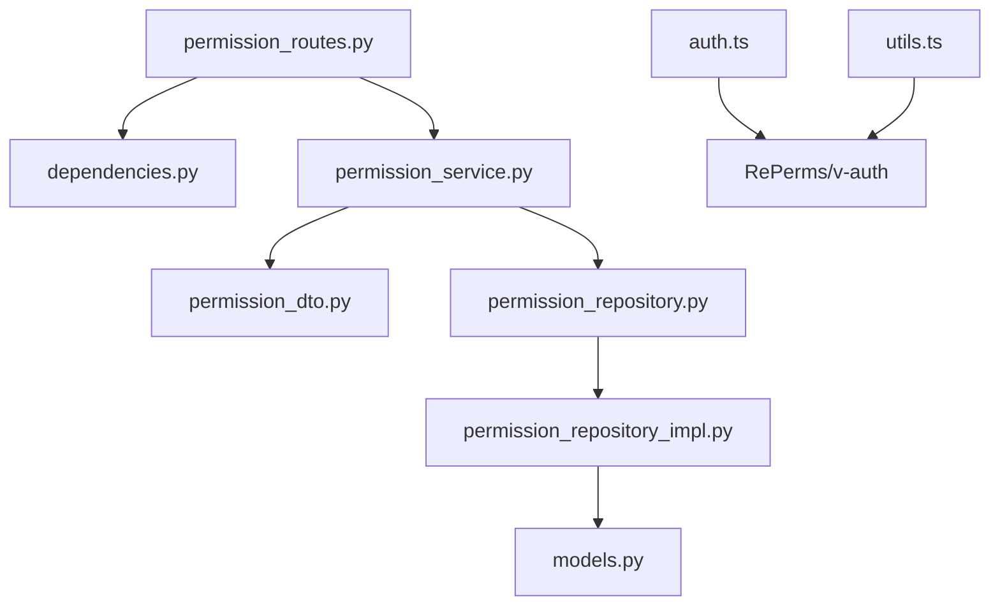

# 权限管理

<cite>
**本文引用的文件**   
- [permission_routes.py](file://service/src/api/v1/permission_routes.py)
- [permission_service.py](file://service/src/application/services/permission_service.py)
- [permission_dto.py](file://service/src/application/dto/permission_dto.py)
- [permission_repository.py](file://service/src/domain/repositories/permission_repository.py)
- [permission_repository_impl.py](file://service/src/infrastructure/repositories/permission_repository.py)
- [permission_entity.py](file://service/src/domain/entities/permission.py)
- [models.py](file://service/src/infrastructure/database/models.py)
- [common.py](file://service/src/api/common.py)
- [dependencies.py](file://service/src/api/dependencies.py)
- [exceptions.py](file://service/src/core/exceptions.py)
- [README.md](file://service/README.md)
- [auth.ts](file://web/src/utils/auth.ts)
- [utils.ts](file://web/src/router/utils.ts)
- [index.ts](file://web/src/directives/auth/index.ts)
- [perms.tsx](file://web/src/components/RePerms/src/perms.tsx)
</cite>

## 更新摘要
**所做更改**   
- 更新了权限管理模块的文件结构，反映新增独立的 permission_routes.py 文件
- 更新了权限管理 API 的路由路径为 `/api/system/permission`
- 更新了服务层使用新的 permission_service.py 文件
- 更新了权限实体、DTO、仓储和模型的对应关系
- 更新了架构图和组件分析以反映模块化重构后的结构

## 目录
1. [简介](#简介)
2. [项目结构](#项目结构)
3. [核心组件](#核心组件)
4. [架构总览](#架构总览)
5. [详细组件分析](#详细组件分析)
6. [依赖分析](#依赖分析)
7. [性能考量](#性能考量)
8. [故障排查指南](#故障排查指南)
9. [结论](#结论)
10. [附录](#附录)

## 简介
本文件面向权限管理系统，围绕权限实体设计、权限与角色关联、权限 CRUD 流程、权限验证与继承机制、性能优化与最佳实践展开，帮助开发者与运维人员快速理解并高效使用该 RBAC 子系统。

**更新** 反映了权限管理功能的模块化重构，新增独立的权限路由模块和权限服务层，采用更清晰的分层架构设计。

## 项目结构
后端采用分层架构（接口层、应用层、领域层、基础设施层），权限管理现在位于独立的 `/api/system/permission` 路径下，涉及权限路由、应用服务、仓储与数据库模型，前端提供指令与组件层面的权限校验与渲染控制。

**图表来源**
- [permission_routes.py:1-85](file://service/src/api/v1/permission_routes.py#L1-L85)
- [dependencies.py:156-162](file://service/src/api/dependencies.py#L156-L162)
- [permission_service.py:1-78](file://service/src/application/services/permission_service.py#L1-L78)
- [permission_dto.py:1-38](file://service/src/application/dto/permission_dto.py#L1-L38)
- [permission_repository.py:1-101](file://service/src/domain/repositories/permission_repository.py#L1-L101)
- [permission_entity.py:1-41](file://service/src/domain/entities/permission.py#L1-L41)
- [permission_repository_impl.py:1-149](file://service/src/infrastructure/repositories/permission_repository.py#L1-L149)
- [models.py:149-179](file://service/src/infrastructure/database/models.py#L149-L179)
- [auth.ts:1-142](file://web/src/utils/auth.ts#L1-L142)
- [utils.ts:1-424](file://web/src/router/utils.ts#L1-L424)
- [index.ts:1-16](file://web/src/directives/auth/index.ts#L1-L16)
- [perms.tsx:1-21](file://web/src/components/RePerms/src/perms.tsx#L1-L21)

**章节来源**
- [README.md:1-259](file://service/README.md#L1-L259)

## 核心组件
- 权限实体与模型
  - 权限实体：id、name、code（唯一索引）、category、description、resource、action、status、created_at。
  - 权限领域实体：使用 dataclass 实现，包含权限的基本属性和状态检查。
  - 数据库模型：SQLModel 实现，定义权限表结构和关系映射。
- 权限 DTO
  - 创建/列表/响应 DTO，统一输入输出约束与分页参数。
- 权限服务
  - PermissionService 提供权限的创建、查询、删除、用户权限获取等业务逻辑。
- 仓储接口与实现
  - PermissionRepositoryInterface 定义抽象接口，PermissionRepository 使用 FastCRUD 实现具体功能。
- 权限依赖注入
  - require_permission 依赖工厂，get_permission_service 服务工厂，按需校验用户权限。
- 前端权限
  - hasPerms（按钮级权限）、hasAuth（路由按钮权限）、v-auth 指令、RePerms 组件。

**章节来源**
- [models.py:149-179](file://service/src/infrastructure/database/models.py#L149-L179)
- [permission_entity.py:11-41](file://service/src/domain/entities/permission.py#L11-L41)
- [permission_dto.py:8-38](file://service/src/application/dto/permission_dto.py#L8-L38)
- [permission_service.py:15-78](file://service/src/application/services/permission_service.py#L15-L78)
- [permission_repository.py:13-101](file://service/src/domain/repositories/permission_repository.py#L13-L101)
- [permission_repository_impl.py:14-149](file://service/src/infrastructure/repositories/permission_repository.py#L14-L149)
- [dependencies.py:84-97](file://service/src/api/dependencies.py#L84-L97)
- [dependencies.py:156-162](file://service/src/api/dependencies.py#L156-L162)
- [auth.ts:131-141](file://web/src/utils/auth.ts#L131-L141)
- [utils.ts:374-383](file://web/src/router/utils.ts#L374-L383)
- [index.ts:1-16](file://web/src/directives/auth/index.ts#L1-L16)
- [perms.tsx:1-21](file://web/src/components/RePerms/src/perms.tsx#L1-L21)

## 架构总览
后端采用 DDD 分层，接口层负责权限路由与鉴权依赖，应用层封装权限业务流程，仓储层对接数据库，模型层定义实体与关系。前端通过指令与组件在 UI 层进行权限控制。

**图表来源**
- [permission_routes.py:17-85](file://service/src/api/v1/permission_routes.py#L17-L85)
- [dependencies.py:84-97](file://service/src/api/dependencies.py#L84-L97)
- [permission_repository_impl.py:14-149](file://service/src/infrastructure/repositories/permission_repository.py#L14-L149)
- [models.py:149-179](file://service/src/infrastructure/database/models.py#L149-L179)
- [permission_service.py:15-78](file://service/src/application/services/permission_service.py#L15-L78)
- [auth.ts:131-141](file://web/src/utils/auth.ts#L131-L141)
- [utils.ts:374-383](file://web/src/router/utils.ts#L374-L383)

## 详细组件分析

### 权限实体与数据模型
- 字段定义与约束
  - 权限实体：id（UUID）、name（2-100字符）、code（2-128字符，唯一）、category（64字符）、description（500字符）、resource、action、status（0-禁用,1-启用）、created_at。
  - 权限领域实体：使用 dataclass 实现，包含权限的基本属性和状态检查 is_active。
  - 数据库模型：SQLModel 实现，定义权限表结构，包含唯一索引约束。
- 关系映射
  - 权限与角色多对多关系，通过 RolePermissionLink 关联表维护。
  - 权限与用户通过角色间接关联，支持用户权限继承。
- 唯一性与索引
  - code 在权限表上建立唯一索引，确保权限编码的唯一性。
  - 名称和状态建立索引，提升查询效率。

**图表来源**
- [models.py:149-179](file://service/src/infrastructure/database/models.py#L149-L179)
- [permission_entity.py:11-41](file://service/src/domain/entities/permission.py#L11-L41)

**章节来源**
- [models.py:149-179](file://service/src/infrastructure/database/models.py#L149-L179)
- [permission_entity.py:11-41](file://service/src/domain/entities/permission.py#L11-L41)

### 权限 CRUD 与用户权限管理流程
- 权限管理
  - 创建：校验权限编码唯一性，支持分类、描述、状态等属性设置。
  - 查询：分页列表与总数统计，支持按权限名称模糊查询。
  - 删除：删除权限，自动清理相关角色关联。
- 用户权限管理
  - 获取用户权限：通过角色继承机制获取用户的完整权限集合。
  - 权限检查：检查用户是否具有特定权限编码。
- 权限服务编排
  - 应用服务统一处理业务逻辑，仓储层负责数据持久化。
  - 服务层提供事务控制和异常处理。

**图表来源**
- [permission_routes.py:45-63](file://service/src/api/v1/permission_routes.py#L45-L63)
- [permission_service.py:28-38](file://service/src/application/services/permission_service.py#L28-L38)
- [permission_repository_impl.py:37-46](file://service/src/infrastructure/repositories/permission_repository.py#L37-L46)
- [models.py:149-179](file://service/src/infrastructure/database/models.py#L149-L179)

**章节来源**
- [permission_routes.py:17-85](file://service/src/api/v1/permission_routes.py#L17-L85)
- [permission_service.py:28-59](file://service/src/application/services/permission_service.py#L28-L59)
- [permission_repository_impl.py:48-114](file://service/src/infrastructure/repositories/permission_repository.py#L48-L114)

### 权限分类体系与标识符命名规范
- 权限分类 category
  - 支持按业务域/模块进行分类，便于前端菜单与按钮权限的组织与展示。
- 权限标识符命名规范
  - 建议采用"模块:操作"或"资源:动作"的层级命名，例如 "user:list"、"menu:create"。
  - 权限编码长度限制为2-128字符，确保唯一性和可读性。
  - 前端按钮级权限通常使用"资源:动作"组合，如 "btn:add"、"btn:edit"。

**章节来源**
- [permission_dto.py:8-15](file://service/src/application/dto/permission_dto.py#L8-L15)
- [models.py:156](file://service/src/infrastructure/database/models.py#L156)

### 权限与角色的关联关系与继承机制
- 角色-权限多对多
  - 通过中间表 RolePermissionLink 维护角色与权限的关联关系。
- 用户-角色多对多
  - 通过中间表 UserRole 维护用户与角色的关联关系。
- 权限继承
  - 用户通过其角色获得权限集合；权限服务提供 get_user_permissions 方法。
  - 仓储实现通过三层 JOIN 查询用户权限：用户 → 角色 → 权限。
- 路由按钮权限
  - 前端路由 meta.auths 字段声明按钮权限，hasAuth 做精确匹配。
  - RePerms 组件与 v-auth 指令在 UI 层面控制元素可见性。

**图表来源**
- [permission_repository_impl.py:132-148](file://service/src/infrastructure/repositories/permission_repository.py#L132-L148)
- [models.py:182-197](file://service/src/infrastructure/database/models.py#L182-L197)

**章节来源**
- [permission_service.py:56-64](file://service/src/application/services/permission_service.py#L56-L64)
- [permission_repository_impl.py:116-148](file://service/src/infrastructure/repositories/permission_repository.py#L116-L148)
- [utils.ts:374-383](file://web/src/router/utils.ts#L374-L383)
- [index.ts:1-16](file://web/src/directives/auth/index.ts#L1-L16)
- [perms.tsx:1-21](file://web/src/components/RePerms/src/perms.tsx#L1-L21)

### 权限验证实现细节
- 后端
  - require_permission(code) 依赖：解析 JWT、校验访问令牌类型、获取当前用户、查询用户权限集合。
  - 权限服务提供 check_permission 方法进行便捷的权限判定。
  - 服务工厂 get_permission_service 提供依赖注入支持。
- 前端
  - hasPerms：判断当前用户权限集合是否包含目标权限（支持通配符与数组全包含）。
  - hasAuth：判断当前路由 meta.auths 中是否包含目标按钮权限。
  - v-auth 指令与 RePerms 组件：在 DOM 层面控制元素可见性。

**图表来源**
- [dependencies.py:84-97](file://service/src/api/dependencies.py#L84-L97)
- [permission_service.py:61-64](file://service/src/application/services/permission_service.py#L61-L64)
- [auth.ts:131-141](file://web/src/utils/auth.ts#L131-L141)
- [utils.ts:374-383](file://web/src/router/utils.ts#L374-L383)
- [index.ts:1-16](file://web/src/directives/auth/index.ts#L1-L16)
- [perms.tsx:1-21](file://web/src/components/RePerms/src/perms.tsx#L1-L21)

**章节来源**
- [dependencies.py:84-97](file://service/src/api/dependencies.py#L84-L97)
- [permission_service.py:61-64](file://service/src/application/services/permission_service.py#L61-L64)
- [auth.ts:131-141](file://web/src/utils/auth.ts#L131-L141)
- [utils.ts:374-383](file://web/src/router/utils.ts#L374-L383)
- [index.ts:1-16](file://web/src/directives/auth/index.ts#L1-L16)
- [perms.tsx:1-21](file://web/src/components/RePerms/src/perms.tsx#L1-L21)

## 依赖分析
- 接口层依赖
  - permission_routes.py 依赖 require_permission 实现运行时权限校验。
  - 使用 get_permission_service 服务工厂进行依赖注入。
- 应用服务依赖
  - permission_service.py 依赖 DTO、异常类、权限仓储接口，编排权限业务流程。
- 仓储依赖
  - permission_repository_impl.py 依赖 SQLModel 和 FastCRUD，实现权限 CRUD 操作。
  - permission_repository.py 定义抽象仓储接口，遵循依赖倒置原则。
- 前端依赖
  - auth.ts 与 utils.ts 提供权限判断与路由按钮权限控制，指令与组件消费权限状态。

**图表来源**
- [permission_routes.py:1-85](file://service/src/api/v1/permission_routes.py#L1-L85)
- [dependencies.py:156-162](file://service/src/api/dependencies.py#L156-L162)
- [permission_service.py:1-78](file://service/src/application/services/permission_service.py#L1-L78)
- [permission_dto.py:1-38](file://service/src/application/dto/permission_dto.py#L1-L38)
- [permission_repository.py:1-101](file://service/src/domain/repositories/permission_repository.py#L1-L101)
- [permission_repository_impl.py:1-149](file://service/src/infrastructure/repositories/permission_repository.py#L1-L149)
- [models.py:149-179](file://service/src/infrastructure/database/models.py#L149-L179)
- [auth.ts:1-142](file://web/src/utils/auth.ts#L1-L142)
- [utils.ts:1-424](file://web/src/router/utils.ts#L1-L424)

**章节来源**
- [permission_routes.py:1-85](file://service/src/api/v1/permission_routes.py#L1-L85)
- [permission_service.py:1-78](file://service/src/application/services/permission_service.py#L1-L78)
- [permission_repository_impl.py:1-149](file://service/src/infrastructure/repositories/permission_repository.py#L1-L149)
- [models.py:149-179](file://service/src/infrastructure/database/models.py#L149-L179)
- [auth.ts:1-142](file://web/src/utils/auth.ts#L1-L142)
- [utils.ts:1-424](file://web/src/router/utils.ts#L1-L424)

## 性能考量
- 查询与分页
  - 仓储实现提供分页与计数，建议在高频查询字段上建立合适索引（如 code、name、status）。
  - FastCRUD 优化 CRUD 操作，减少样板代码和查询开销。
- 关联查询
  - 用户权限聚合通过三层 JOIN 查询完成，建议在关联键上建立索引以降低查询成本。
  - 使用 distinct 避免重复权限记录。
- 缓存策略
  - 前端可缓存用户权限集合与路由树，减少重复请求。
  - 后端可在热点场景引入缓存存储用户权限清单，结合失效策略。
- 并发与事务
  - 权限创建在事务内执行，保证权限编码唯一性约束的一致性。
  - 批量写入时注意数据库锁竞争，必要时拆分批次。
- 响应序列化
  - DTO 层统一输出字段与时间格式，减少前端二次处理开销。

## 故障排查指南
- 常见异常
  - 资源不存在：抛出 404（NotFoundError）。
  - 资源冲突（权限编码重复）：抛出 409（ConflictError）。
  - 未授权/令牌无效：抛出 401（UnauthorizedError）。
  - 权限不足：抛出 403（ForbiddenError）。
- 排查要点
  - 后端：确认 JWT 解析与令牌类型校验是否通过；确认 require_permission 依赖是否正确注入；检查权限编码唯一性约束。
  - 前端：确认 hasPerms/hasAuth 参数格式与用户权限存储；检查 v-auth/RePerms 是否正确绑定；核对路由 meta.auths 配置。
  - 数据一致性：权限创建后，确认唯一索引约束生效；权限删除后，确认关联关系正确清理。

**章节来源**
- [exceptions.py:13-59](file://service/src/core/exceptions.py#L13-L59)
- [dependencies.py:84-97](file://service/src/api/dependencies.py#L84-L97)
- [permission_routes.py:17-85](file://service/src/api/v1/permission_routes.py#L17-L85)
- [permission_service.py:28-38](file://service/src/application/services/permission_service.py#L28-L38)
- [auth.ts:131-141](file://web/src/utils/auth.ts#L131-L141)
- [utils.ts:374-383](file://web/src/router/utils.ts#L374-L383)

## 结论
该权限管理子系统经过模块化重构后，采用了更清晰的分层设计与完善的 DTO/仓储/模型配合，实现了权限的全生命周期管理。新增独立的权限路由模块和权限服务层，通过 require_permission 与前端指令/组件形成前后端协同的权限控制闭环。遵循统一的命名规范与继承机制，可有效支撑复杂业务场景下的细粒度权限管控。

## 附录
- API 路由概览（后端）
  - 权限：GET /api/system/permission/list（分页列表）、POST /api/system/permission/（创建）、DELETE /api/system/permission/{permission_id}（删除）。
- 前端权限控制
  - 按钮级：hasPerms、v-auth、RePerms。
  - 路由级：hasAuth、meta.auths。
- 服务依赖
  - get_permission_service：权限服务工厂函数。
  - require_permission：权限依赖工厂，支持 permission:view 和 permission:manage 权限。

**章节来源**
- [permission_routes.py:17-85](file://service/src/api/v1/permission_routes.py#L17-L85)
- [dependencies.py:156-162](file://service/src/api/dependencies.py#L156-L162)
- [dependencies.py:84-97](file://service/src/api/dependencies.py#L84-L97)
- [auth.ts:131-141](file://web/src/utils/auth.ts#L131-L141)
- [utils.ts:374-383](file://web/src/router/utils.ts#L374-L383)
- [index.ts:1-16](file://web/src/directives/auth/index.ts#L1-L16)
- [perms.tsx:1-21](file://web/src/components/RePerms/src/perms.tsx#L1-L21)