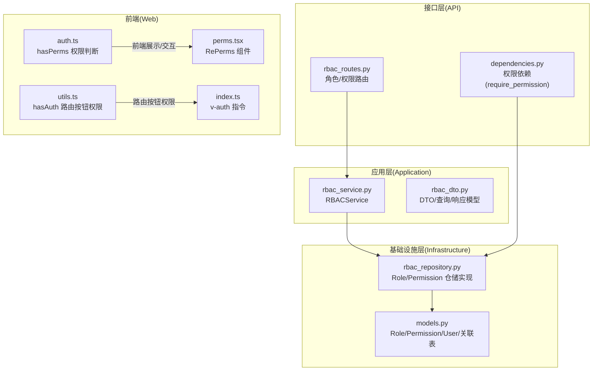
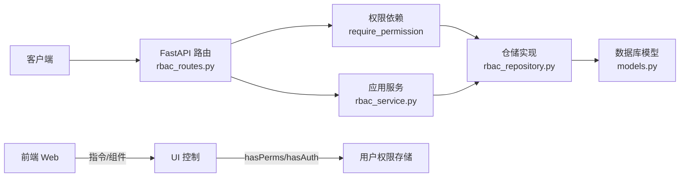
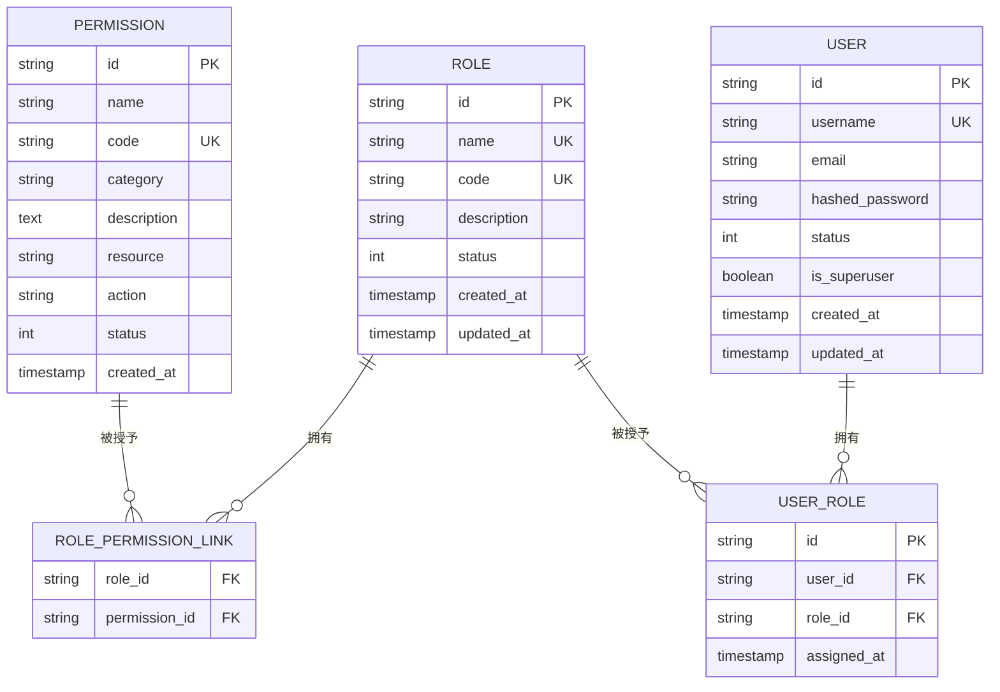
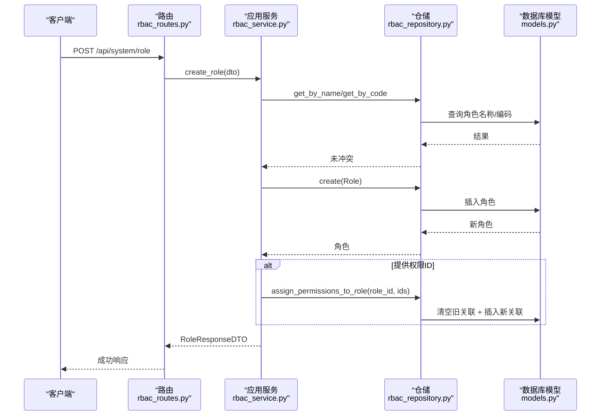
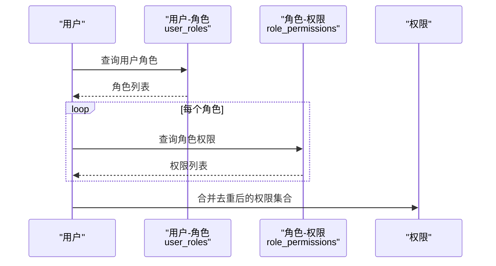
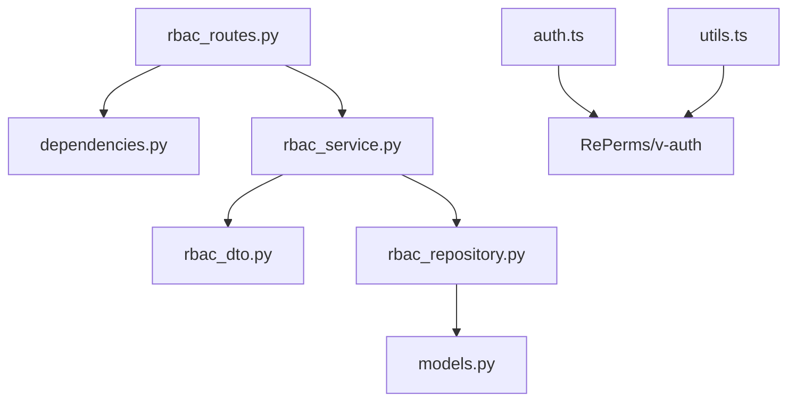

# 权限管理

<cite>
**本文引用的文件**   
- [rbac_routes.py](file://service/src/api/v1/rbac_routes.py)
- [rbac_service.py](file://service/src/application/services/rbac_service.py)
- [rbac_dto.py](file://service/src/application/dto/rbac_dto.py)
- [rbac_repository.py](file://service/src/infrastructure/repositories/rbac_repository.py)
- [models.py](file://service/src/infrastructure/database/models.py)
- [dependencies.py](file://service/src/api/dependencies.py)
- [exceptions.py](file://service/src/core/exceptions.py)
- [README.md](file://service/README.md)
- [auth.ts](file://web/src/utils/auth.ts)
- [utils.ts](file://web/src/router/utils.ts)
- [index.ts](file://web/src/directives/auth/index.ts)
- [perms.tsx](file://web/src/components/RePerms/src/perms.tsx)
</cite>

## 目录
1. [简介](#简介)
2. [项目结构](#项目结构)
3. [核心组件](#核心组件)
4. [架构总览](#架构总览)
5. [详细组件分析](#详细组件分析)
6. [依赖分析](#依赖分析)
7. [性能考量](#性能考量)
8. [故障排查指南](#故障排查指南)
9. [结论](#结论)
10. [附录](#附录)

## 简介
本文件面向权限管理系统，围绕权限实体设计、权限与角色关联、权限 CRUD 流程、权限验证与继承机制、性能优化与最佳实践展开，帮助开发者与运维人员快速理解并高效使用该 RBAC 子系统。

## 项目结构
后端采用分层架构（接口层、应用层、领域层、基础设施层），权限管理涉及 API 路由、应用服务、仓储与数据库模型，前端提供指令与组件层面的权限校验与渲染控制。

**图表来源**
- [rbac_routes.py:1-257](file://service/src/api/v1/rbac_routes.py#L1-L257)
- [dependencies.py:1-72](file://service/src/api/dependencies.py#L1-L72)
- [rbac_service.py:1-231](file://service/src/application/services/rbac_service.py#L1-L231)
- [rbac_dto.py:1-88](file://service/src/application/dto/rbac_dto.py#L1-L88)
- [rbac_repository.py:1-213](file://service/src/infrastructure/repositories/rbac_repository.py#L1-L213)
- [models.py:1-193](file://service/src/infrastructure/database/models.py#L1-L193)
- [auth.ts:1-142](file://web/src/utils/auth.ts#L1-L142)
- [utils.ts:1-424](file://web/src/router/utils.ts#L1-L424)
- [index.ts:1-16](file://web/src/directives/auth/index.ts#L1-L16)
- [perms.tsx:1-21](file://web/src/components/RePerms/src/perms.tsx#L1-L21)

**章节来源**
- [README.md:1-259](file://service/README.md#L1-L259)

## 核心组件
- 权限实体与模型
  - 权限标识符：code（唯一索引），名称 name，分类 category，动作 action、资源 resource，状态 status，创建时间 created_at。
  - 角色实体：name（唯一索引）、code（唯一索引）、状态 status、创建/更新时间。
  - 关联表：角色-权限多对多（role_permissions），用户-角色多对多（user_roles）。
- 权限 DTO
  - 创建/更新/列表/响应 DTO，统一输入输出约束与分页参数。
- 应用服务
  - 提供角色与权限的创建、查询、更新、删除、分配等业务编排。
- 仓储实现
  - 基于 SQLModel 的查询、分页、计数、插入/删除、关联维护。
- 权限依赖注入
  - require_permission 依赖工厂，按需校验用户是否具备指定权限 code。
- 前端权限
  - hasPerms（按钮级权限）、hasAuth（路由按钮权限）、v-auth 指令、RePerms 组件。

**章节来源**
- [models.py:97-121](file://service/src/infrastructure/database/models.py#L97-L121)
- [rbac_dto.py:8-88](file://service/src/application/dto/rbac_dto.py#L8-L88)
- [rbac_service.py:19-231](file://service/src/application/services/rbac_service.py#L19-L231)
- [rbac_repository.py:11-213](file://service/src/infrastructure/repositories/rbac_repository.py#L11-L213)
- [dependencies.py:45-61](file://service/src/api/dependencies.py#L45-L61)
- [auth.ts:131-141](file://web/src/utils/auth.ts#L131-L141)
- [utils.ts:374-383](file://web/src/router/utils.ts#L374-L383)
- [index.ts:1-16](file://web/src/directives/auth/index.ts#L1-L16)
- [perms.tsx:1-21](file://web/src/components/RePerms/src/perms.tsx#L1-L21)

## 架构总览
后端采用 DDD 分层，接口层负责路由与鉴权依赖，应用层封装业务流程，仓储层对接数据库，模型层定义实体与关系。前端通过指令与组件在 UI 层进行权限控制。

**图表来源**
- [rbac_routes.py:30-257](file://service/src/api/v1/rbac_routes.py#L30-L257)
- [dependencies.py:45-61](file://service/src/api/dependencies.py#L45-L61)
- [rbac_repository.py:11-213](file://service/src/infrastructure/repositories/rbac_repository.py#L11-L213)
- [models.py:17-141](file://service/src/infrastructure/database/models.py#L17-L141)
- [rbac_service.py:19-231](file://service/src/application/services/rbac_service.py#L19-L231)
- [auth.ts:131-141](file://web/src/utils/auth.ts#L131-L141)
- [utils.ts:374-383](file://web/src/router/utils.ts#L374-L383)

## 详细组件分析

### 权限实体与数据模型
- 字段定义与约束
  - 权限：id、name、code（唯一索引）、category、description、resource、action、status、created_at。
  - 角色：id、name（唯一索引）、code（唯一索引）、description、status、created_at、updated_at。
  - 关联：role_permissions（角色-权限多对多），user_roles（用户-角色多对多）。
- 关系映射
  - Role 与 Permission 多对多，通过 RolePermissionLink 关联。
  - User 与 Role 多对多，通过 UserRole 关联。
- 唯一性与索引
  - code 在权限与角色上均唯一，提升查询效率与一致性。
  - 名称与角色 code 建有唯一约束，避免重复。

**图表来源**
- [models.py:17-141](file://service/src/infrastructure/database/models.py#L17-L141)

**章节来源**
- [models.py:70-141](file://service/src/infrastructure/database/models.py#L70-L141)

### 权限 CRUD 与角色管理流程
- 角色管理
  - 创建：校验名称/编码唯一性，可选同时分配权限。
  - 查询：分页列表与总数统计，详情含权限列表。
  - 更新：可更新名称/编码/描述/状态，支持替换权限集。
  - 删除：删除角色。
- 权限管理
  - 创建：校验权限编码唯一性。
  - 查询：分页列表与总数统计。
  - 删除：删除权限。
- 分配管理
  - 为角色分配权限（先清后增）。
  - 为用户分配/移除角色。
  - 获取用户角色与权限（通过角色继承）。

**图表来源**
- [rbac_routes.py:64-83](file://service/src/api/v1/rbac_routes.py#L64-L83)
- [rbac_service.py:28-49](file://service/src/application/services/rbac_service.py#L28-L49)
- [rbac_repository.py:84-96](file://service/src/infrastructure/repositories/rbac_repository.py#L84-L96)
- [models.py:70-91](file://service/src/infrastructure/database/models.py#L70-L91)

**章节来源**
- [rbac_routes.py:33-177](file://service/src/api/v1/rbac_routes.py#L33-L177)
- [rbac_service.py:28-129](file://service/src/application/services/rbac_service.py#L28-L129)
- [rbac_repository.py:62-96](file://service/src/infrastructure/repositories/rbac_repository.py#L62-L96)

### 权限分类体系与标识符命名规范
- 权限分类 category
  - 支持按业务域/模块进行分类，便于前端菜单与按钮权限的组织与展示。
- 权限标识符命名规范
  - 建议采用“模块:操作”或“资源:动作”的层级命名，例如 “user:list”、“menu:create”，确保 code 唯一且语义明确。
  - 前端按钮级权限通常使用“资源:动作”组合，如 “btn:add”、“btn:edit”。

**章节来源**
- [rbac_dto.py:48-55](file://service/src/application/dto/rbac_dto.py#L48-L55)
- [models.py:104-108](file://service/src/infrastructure/database/models.py#L104-L108)

### 权限与角色的关联关系与继承机制
- 角色-权限多对多
  - 通过中间表 role_permissions 维护角色与权限的关联。
- 用户-角色多对多
  - 通过中间表 user_roles 维护用户与角色的关联。
- 权限继承
  - 用户通过其角色获得权限集合；应用服务提供 get_user_permissions，底层仓储通过 join 用户-角色-角色-权限链路聚合用户权限。
- 路由按钮权限
  - 前端路由 meta.auths 字段声明按钮权限，hasAuth 做精确匹配；RePerms 组件与 v-auth 指令在 UI 层屏蔽不可见元素。

**图表来源**
- [rbac_repository.py:203-212](file://service/src/infrastructure/repositories/rbac_repository.py#L203-L212)
- [models.py:123-141](file://service/src/infrastructure/database/models.py#L123-L141)

**章节来源**
- [rbac_service.py:185-193](file://service/src/application/services/rbac_service.py#L185-L193)
- [rbac_repository.py:128-133](file://service/src/infrastructure/repositories/rbac_repository.py#L128-L133)
- [utils.ts:374-383](file://web/src/router/utils.ts#L374-L383)
- [index.ts:1-16](file://web/src/directives/auth/index.ts#L1-L16)
- [perms.tsx:1-21](file://web/src/components/RePerms/src/perms.tsx#L1-L21)

### 权限验证实现细节
- 后端
  - require_permission(code) 依赖：解析 JWT、校验访问令牌类型、获取当前用户、查询用户权限集合，若不包含目标 code 则抛出 403。
  - RBACService.check_permission 提供便捷的权限判定。
- 前端
  - hasPerms：判断当前用户权限集合是否包含目标权限（支持通配符与数组全包含）。
  - hasAuth：判断当前路由 meta.auths 中是否包含目标按钮权限。
  - v-auth 指令与 RePerms 组件：在 DOM 层面控制元素可见性。

**图表来源**
- [dependencies.py:45-61](file://service/src/api/dependencies.py#L45-L61)
- [rbac_service.py:195-198](file://service/src/application/services/rbac_service.py#L195-L198)
- [auth.ts:131-141](file://web/src/utils/auth.ts#L131-L141)
- [utils.ts:374-383](file://web/src/router/utils.ts#L374-L383)
- [index.ts:1-16](file://web/src/directives/auth/index.ts#L1-L16)
- [perms.tsx:1-21](file://web/src/components/RePerms/src/perms.tsx#L1-L21)

**章节来源**
- [dependencies.py:45-61](file://service/src/api/dependencies.py#L45-L61)
- [rbac_service.py:195-198](file://service/src/application/services/rbac_service.py#L195-L198)
- [auth.ts:131-141](file://web/src/utils/auth.ts#L131-L141)
- [utils.ts:374-383](file://web/src/router/utils.ts#L374-L383)
- [index.ts:1-16](file://web/src/directives/auth/index.ts#L1-L16)
- [perms.tsx:1-21](file://web/src/components/RePerms/src/perms.tsx#L1-L21)

## 依赖分析
- 接口层依赖
  - rbac_routes.py 依赖 require_permission 实现运行时权限校验。
- 应用服务依赖
  - rbac_service.py 依赖 DTO、异常类、仓储接口，编排业务流程。
- 仓储依赖
  - rbac_repository.py 依赖 SQLModel 查询与删除语句，实现分页、计数与关联维护。
- 前端依赖
  - auth.ts 与 utils.ts 提供权限判断与路由按钮权限控制，指令与组件消费权限状态。

**图表来源**
- [rbac_routes.py:1-257](file://service/src/api/v1/rbac_routes.py#L1-L257)
- [dependencies.py:1-72](file://service/src/api/dependencies.py#L1-L72)
- [rbac_service.py:1-231](file://service/src/application/services/rbac_service.py#L1-L231)
- [rbac_dto.py:1-88](file://service/src/application/dto/rbac_dto.py#L1-L88)
- [rbac_repository.py:1-213](file://service/src/infrastructure/repositories/rbac_repository.py#L1-L213)
- [models.py:1-193](file://service/src/infrastructure/database/models.py#L1-L193)
- [auth.ts:1-142](file://web/src/utils/auth.ts#L1-L142)
- [utils.ts:1-424](file://web/src/router/utils.ts#L1-L424)

**章节来源**
- [rbac_routes.py:1-257](file://service/src/api/v1/rbac_routes.py#L1-L257)
- [rbac_service.py:1-231](file://service/src/application/services/rbac_service.py#L1-L231)
- [rbac_repository.py:1-213](file://service/src/infrastructure/repositories/rbac_repository.py#L1-L213)
- [models.py:1-193](file://service/src/infrastructure/database/models.py#L1-L193)
- [auth.ts:1-142](file://web/src/utils/auth.ts#L1-L142)
- [utils.ts:1-424](file://web/src/router/utils.ts#L1-L424)

## 性能考量
- 查询与分页
  - 仓储实现提供分页与计数，建议在高并发场景下对高频查询字段建立合适索引（如 code、name、status）。
- 关联查询
  - 用户权限聚合通过三层 join（用户-角色-权限）完成，建议在关联键上建立索引以降低查询成本。
- 缓存策略
  - 前端可缓存用户权限集合与路由树，减少重复请求；后端可在热点场景引入缓存（如 Redis）存储用户权限清单，结合失效策略。
- 并发与事务
  - 分配权限（先清后增）在事务内执行，保证一致性；批量写入时注意数据库锁竞争，必要时拆分批次。
- 响应序列化
  - DTO 层统一输出字段与时间格式，减少前端二次处理开销。

[本节为通用性能建议，不直接分析具体文件，故不附“章节来源”]

## 故障排查指南
- 常见异常
  - 资源不存在：抛出 404（NotFoundError）。
  - 资源冲突（如名称/编码重复）：抛出 409（ConflictError）。
  - 未授权/令牌无效：抛出 401（UnauthorizedError）。
  - 权限不足：抛出 403（ForbiddenError）。
- 排查要点
  - 后端：确认 JWT 解析与令牌类型校验是否通过；确认 require_permission 依赖是否正确注入；检查仓储查询条件与关联表数据。
  - 前端：确认 hasPerms/hasAuth 参数格式与用户权限存储；检查 v-auth/RePerms 是否正确绑定；核对路由 meta.auths 配置。
  - 数据一致性：角色权限分配后，确认中间表已清空旧记录并写入新记录；用户权限变更后，前端是否刷新权限集合。

**章节来源**
- [exceptions.py:13-59](file://service/src/core/exceptions.py#L13-L59)
- [dependencies.py:45-61](file://service/src/api/dependencies.py#L45-L61)
- [rbac_routes.py:33-177](file://service/src/api/v1/rbac_routes.py#L33-L177)
- [auth.ts:131-141](file://web/src/utils/auth.ts#L131-L141)
- [utils.ts:374-383](file://web/src/router/utils.ts#L374-L383)

## 结论
该权限管理子系统以清晰的分层设计与完善的 DTO/仓储/模型配合，实现了角色与权限的全生命周期管理，并通过 require_permission 与前端指令/组件形成前后端协同的权限控制闭环。遵循统一的命名规范与继承机制，可有效支撑复杂业务场景下的细粒度权限管控。

## 附录
- API 路由概览（后端）
  - 角色：GET/POST/PUT/DELETE 列表与详情，角色权限分配。
  - 权限：GET/POST/DELETE 列表与创建、删除。
- 前端权限控制
  - 按钮级：hasPerms、v-auth、RePerms。
  - 路由级：hasAuth、meta.auths。

**章节来源**
- [rbac_routes.py:33-257](file://service/src/api/v1/rbac_routes.py#L33-L257)
- [auth.ts:131-141](file://web/src/utils/auth.ts#L131-L141)
- [utils.ts:374-383](file://web/src/router/utils.ts#L374-L383)
- [index.ts:1-16](file://web/src/directives/auth/index.ts#L1-L16)
- [perms.tsx:1-21](file://web/src/components/RePerms/src/perms.tsx#L1-L21)