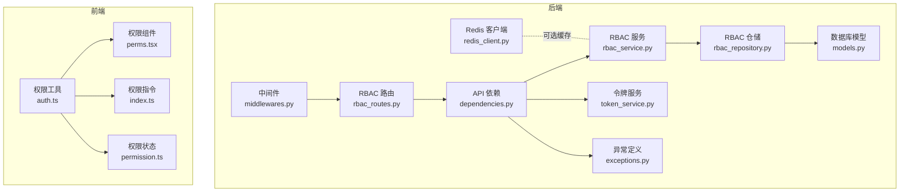
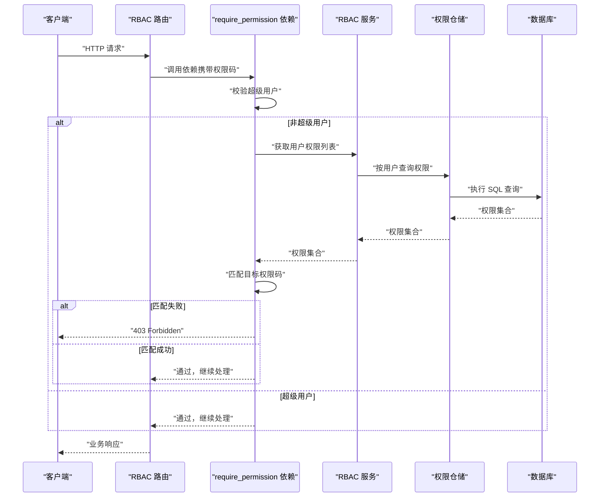
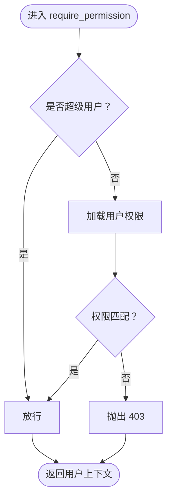
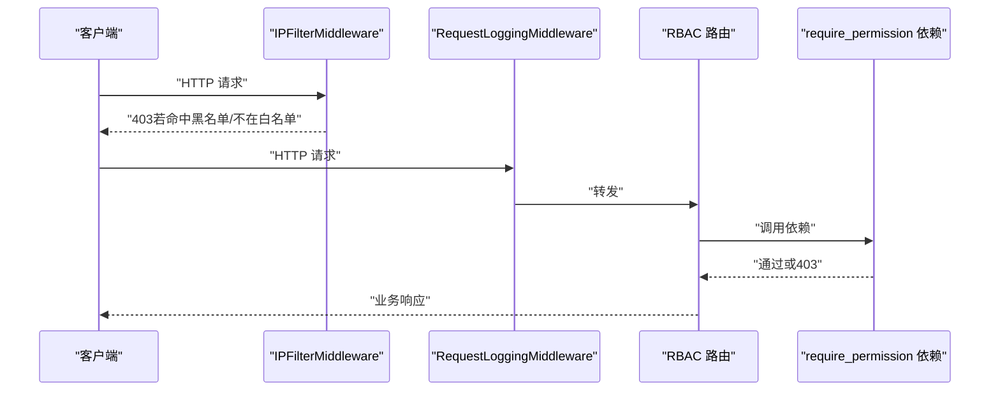
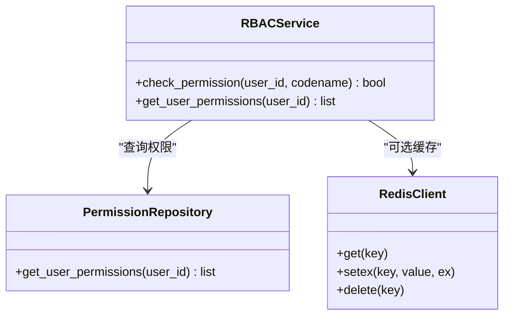
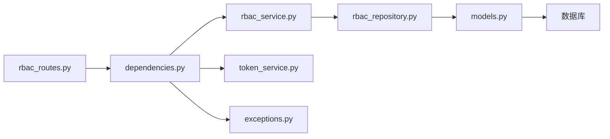

# 权限验证机制

<cite>
**本文引用的文件**
- [dependencies.py](file://service/src/api/dependencies.py)
- [rbac_routes.py](file://service/src/api/v1/rbac_routes.py)
- [rbac_service.py](file://service/src/application/services/rbac_service.py)
- [rbac_repository.py](file://service/src/infrastructure/repositories/rbac_repository.py)
- [token_service.py](file://service/src/domain/auth/token_service.py)
- [models.py](file://service/src/infrastructure/database/models.py)
- [exceptions.py](file://service/src/core/exceptions.py)
- [middlewares.py](file://service/src/core/middlewares.py)
- [redis_client.py](file://service/src/infrastructure/cache/redis_client.py)
- [auth.ts](file://web/src/utils/auth.ts)
- [perms.tsx](file://web/src/components/RePerms/src/perms.tsx)
- [index.ts](file://web/src/directives/perms/index.ts)
- [permission.ts](file://web/src/store/modules/permission.ts)
</cite>

## 目录
1. [引言](#引言)
2. [项目结构](#项目结构)
3. [核心组件](#核心组件)
4. [架构总览](#架构总览)
5. [详细组件分析](#详细组件分析)
6. [依赖关系分析](#依赖关系分析)
7. [性能考量](#性能考量)
8. [故障排查指南](#故障排查指南)
9. [结论](#结论)
10. [附录](#附录)

## 引言
本文件围绕后端 FastAPI 的权限验证机制展开，重点解析 require_permission 依赖函数的实现原理与工作流程，说明权限中间件如何拦截请求并进行权限检查，阐述动态权限验证的实现与缓存策略，解释权限验证失败时的错误处理与响应格式，并给出扩展性设计与自定义权限类型的添加方法，最后提供最佳实践与常见问题的解决方案。

## 项目结构
本项目采用分层架构：API 层负责路由与依赖注入；应用服务层封装业务逻辑；基础设施层负责仓储与数据库交互；领域层提供令牌与安全服务；前端 Vue 侧提供权限指令与组件以控制界面元素展示。

图表来源
- [dependencies.py:1-72](file://service/src/api/dependencies.py#L1-L72)
- [rbac_routes.py:1-257](file://service/src/api/v1/rbac_routes.py#L1-L257)
- [rbac_service.py:1-231](file://service/src/application/services/rbac_service.py#L1-L231)
- [rbac_repository.py:1-213](file://service/src/infrastructure/repositories/rbac_repository.py#L1-L213)
- [token_service.py:1-45](file://service/src/domain/auth/token_service.py#L1-L45)
- [models.py:1-193](file://service/src/infrastructure/database/models.py#L1-L193)
- [exceptions.py:1-60](file://service/src/core/exceptions.py#L1-L60)
- [middlewares.py:1-65](file://service/src/core/middlewares.py#L1-L65)
- [redis_client.py:1-24](file://service/src/infrastructure/cache/redis_client.py#L1-L24)
- [auth.ts:1-142](file://web/src/utils/auth.ts#L1-L142)
- [perms.tsx:1-21](file://web/src/components/RePerms/src/perms.tsx#L1-L21)
- [index.ts:1-16](file://web/src/directives/perms/index.ts#L1-L16)
- [permission.ts:1-76](file://web/src/store/modules/permission.ts#L1-L76)

章节来源
- [dependencies.py:1-72](file://service/src/api/dependencies.py#L1-L72)
- [rbac_routes.py:1-257](file://service/src/api/v1/rbac_routes.py#L1-L257)
- [rbac_service.py:1-231](file://service/src/application/services/rbac_service.py#L1-L231)
- [rbac_repository.py:1-213](file://service/src/infrastructure/repositories/rbac_repository.py#L1-L213)
- [token_service.py:1-45](file://service/src/domain/auth/token_service.py#L1-L45)
- [models.py:1-193](file://service/src/infrastructure/database/models.py#L1-L193)
- [exceptions.py:1-60](file://service/src/core/exceptions.py#L1-L60)
- [middlewares.py:1-65](file://service/src/core/middlewares.py#L1-L65)
- [redis_client.py:1-24](file://service/src/infrastructure/cache/redis_client.py#L1-L24)
- [auth.ts:1-142](file://web/src/utils/auth.ts#L1-L142)
- [perms.tsx:1-21](file://web/src/components/RePerms/src/perms.tsx#L1-L21)
- [index.ts:1-16](file://web/src/directives/perms/index.ts#L1-L16)
- [permission.ts:1-76](file://web/src/store/modules/permission.ts#L1-L76)

## 核心组件
- 依赖注入与权限检查
  - get_current_user_id：从 Authorization 头解析并校验 JWT，提取用户标识。
  - get_current_active_user：基于用户 ID 查询活跃用户并校验账户状态。
  - require_permission：依赖工厂，返回一个异步依赖函数，用于在路由层强制执行权限校验。
  - require_superuser：依赖工厂，返回一个异步依赖函数，仅允许超级用户访问。
- RBAC 服务与仓储
  - RBACService：封装角色、权限、用户授权的业务逻辑，提供权限检查方法。
  - PermissionRepository：基于 SQLModel 实现的权限仓储，提供按用户查询权限列表的能力。
- 令牌与异常
  - TokenService：JWT 的签发、解码与类型校验。
  - 自定义异常：UnauthorizedError、ForbiddenError 等，统一错误响应。
- 中间件与缓存
  - RequestLoggingMiddleware：请求日志与耗时统计。
  - IPFilterMiddleware：基于白/黑名单的访问控制。
  - Redis 客户端：可选的缓存连接管理。
- 前端权限控制
  - auth.ts：权限判断 hasPerms、令牌格式化与存储。
  - perms 组件与指令：基于权限渲染 UI 元素。
  - permission 状态：维护菜单、路由与缓存页面列表。

章节来源
- [dependencies.py:16-71](file://service/src/api/dependencies.py#L16-L71)
- [rbac_service.py:190-198](file://service/src/application/services/rbac_service.py#L190-L198)
- [rbac_repository.py:203-212](file://service/src/infrastructure/repositories/rbac_repository.py#L203-L212)
- [token_service.py:14-44](file://service/src/domain/auth/token_service.py#L14-L44)
- [exceptions.py:27-38](file://service/src/core/exceptions.py#L27-L38)
- [middlewares.py:12-64](file://service/src/core/middlewares.py#L12-L64)
- [redis_client.py:10-23](file://service/src/infrastructure/cache/redis_client.py#L10-L23)
- [auth.ts:130-141](file://web/src/utils/auth.ts#L130-L141)
- [perms.tsx:12-18](file://web/src/components/RePerms/src/perms.tsx#L12-L18)
- [index.ts:4-14](file://web/src/directives/perms/index.ts#L4-L14)
- [permission.ts:25-70](file://web/src/store/modules/permission.ts#L25-L70)

## 架构总览
后端权限验证链路由“路由 → 依赖 → 服务 → 仓储 → 数据库”构成，前端通过令牌与权限集合在 UI 层做二次防护。

图表来源
- [rbac_routes.py:33-61](file://service/src/api/v1/rbac_routes.py#L33-L61)
- [dependencies.py:45-60](file://service/src/api/dependencies.py#L45-L60)
- [rbac_service.py:190-198](file://service/src/application/services/rbac_service.py#L190-L198)
- [rbac_repository.py:203-212](file://service/src/infrastructure/repositories/rbac_repository.py#L203-L212)

## 详细组件分析

### require_permission 依赖函数
- 设计模式
  - 依赖工厂：require_permission(code) 返回一个异步依赖函数 permission_checker，该函数在 FastAPI 路由调用时被注入。
- 执行流程
  - 通过 get_current_active_user 依赖获取当前用户上下文（含 is_superuser 字段）。
  - 若用户为超级用户，直接放行。
  - 否则，通过 PermissionRepository 获取用户权限列表，遍历匹配目标权限码。
  - 匹配失败抛出 ForbiddenError，匹配成功返回用户上下文。
- 错误处理
  - 依赖内部抛出 ForbiddenError，由 FastAPI 统一转为 403 响应。
- 性能要点
  - 每个路由调用都会触发一次数据库查询，建议结合缓存策略降低压力。

图表来源
- [dependencies.py:45-60](file://service/src/api/dependencies.py#L45-L60)
- [rbac_repository.py:203-212](file://service/src/infrastructure/repositories/rbac_repository.py#L203-L212)
- [exceptions.py:34-38](file://service/src/core/exceptions.py#L34-L38)

章节来源
- [dependencies.py:45-60](file://service/src/api/dependencies.py#L45-L60)
- [rbac_routes.py:33-61](file://service/src/api/v1/rbac_routes.py#L33-L61)
- [exceptions.py:34-38](file://service/src/core/exceptions.py#L34-L38)

### 权限中间件拦截与检查
- 请求拦截
  - RequestLoggingMiddleware：记录请求开始与结束、计算耗时并写入响应头。
  - IPFilterMiddleware：基于白/黑名单拒绝访问，返回 403。
- 与权限依赖的关系
  - 中间件在路由依赖之前执行，可快速拒绝非法来源。
  - 权限依赖在路由处理函数内部执行，确保业务级权限控制。

图表来源
- [middlewares.py:42-64](file://service/src/core/middlewares.py#L42-L64)
- [middlewares.py:12-39](file://service/src/core/middlewares.py#L12-L39)
- [rbac_routes.py:33-61](file://service/src/api/v1/rbac_routes.py#L33-L61)

章节来源
- [middlewares.py:12-64](file://service/src/core/middlewares.py#L12-L64)

### 动态权限验证与缓存策略
- 动态权限验证
  - RBACService.check_permission：通过 PermissionRepository.get_user_permissions 获取用户权限集合，再进行匹配。
  - RBACService.get_user_permissions：聚合用户通过角色继承的权限列表。
- 缓存策略建议
  - 用户维度缓存：以用户 ID 为键，缓存权限列表，设置合理 TTL。
  - 路由维度缓存：对高频路由的权限结果进行短期缓存。
  - 失效策略：角色变更、权限分配/回收时主动失效相关缓存键。
  - Redis 客户端：可复用 redis_client 提供的连接池能力。
- 性能优化
  - 减少 N+1 查询：一次性批量查询用户权限。
  - 前端缓存：前端 hasPerms 读取本地权限集合，避免重复请求。

图表来源
- [rbac_service.py:190-198](file://service/src/application/services/rbac_service.py#L190-L198)
- [rbac_repository.py:203-212](file://service/src/infrastructure/repositories/rbac_repository.py#L203-L212)
- [redis_client.py:10-23](file://service/src/infrastructure/cache/redis_client.py#L10-L23)

章节来源
- [rbac_service.py:190-198](file://service/src/application/services/rbac_service.py#L190-L198)
- [rbac_repository.py:203-212](file://service/src/infrastructure/repositories/rbac_repository.py#L203-L212)
- [redis_client.py:10-23](file://service/src/infrastructure/cache/redis_client.py#L10-L23)

### 权限验证失败的错误处理与响应格式
- 后端错误
  - ForbiddenError：权限不足，返回 403。
  - UnauthorizedError：认证失败（如无效/过期令牌），返回 401。
- 前端错误
  - 前端 hasPerms 用于 UI 层权限判断，不直接产生 HTTP 错误。
- 建议
  - 统一异常处理器将 AppException 子类映射为标准 HTTP 状态码与错误体。
  - 在网关或中间件层输出一致的错误响应结构。

章节来源
- [exceptions.py:27-38](file://service/src/core/exceptions.py#L27-L38)
- [dependencies.py:16-29](file://service/src/api/dependencies.py#L16-L29)
- [auth.ts:130-141](file://web/src/utils/auth.ts#L130-L141)

### 扩展性设计与自定义权限类型
- 权限类型扩展
  - 在数据库模型中新增权限字段（如 resource、action）以表达更细粒度的权限。
  - 在 DTO 与服务层增加相应字段与校验逻辑。
- 权限码规范
  - 建议采用“模块:动作”或“资源:操作”的命名约定，便于前端指令与后端匹配。
- 菜单与路由联动
  - 菜单模型的 permissions 字段可引用权限码，前端据此生成导航与按钮权限。
- 前端指令与组件
  - v-perms 指令与 <Perms> 组件基于权限集合进行条件渲染，保持前后一致。

章节来源
- [models.py:97-121](file://service/src/infrastructure/database/models.py#L97-L121)
- [rbac_routes.py:33-61](file://service/src/api/v1/rbac_routes.py#L33-L61)
- [rbac_routes.py:186-256](file://service/src/api/v1/rbac_routes.py#L186-L256)
- [index.ts:4-14](file://web/src/directives/perms/index.ts#L4-L14)
- [perms.tsx:12-18](file://web/src/components/RePerms/src/perms.tsx#L12-L18)

## 依赖关系分析
- 组件耦合
  - 路由依赖 require_permission 依赖 get_current_active_user 与 PermissionRepository，耦合集中在权限查询。
  - RBACService 对仓储与模型有直接依赖，属于业务层关键路径。
- 外部依赖
  - JWT 解析依赖 jose/jwt。
  - 数据库访问依赖 SQLModel 与 SQLAlchemy。
  - 可选 Redis 缓存依赖 redis-py。
- 循环依赖
  - 未发现循环导入；各层职责清晰。

图表来源
- [rbac_routes.py:1-257](file://service/src/api/v1/rbac_routes.py#L1-L257)
- [dependencies.py:1-72](file://service/src/api/dependencies.py#L1-L72)
- [rbac_service.py:1-231](file://service/src/application/services/rbac_service.py#L1-L231)
- [rbac_repository.py:1-213](file://service/src/infrastructure/repositories/rbac_repository.py#L1-L213)
- [models.py:1-193](file://service/src/infrastructure/database/models.py#L1-L193)
- [token_service.py:1-45](file://service/src/domain/auth/token_service.py#L1-L45)
- [exceptions.py:1-60](file://service/src/core/exceptions.py#L1-L60)

章节来源
- [rbac_routes.py:1-257](file://service/src/api/v1/rbac_routes.py#L1-L257)
- [dependencies.py:1-72](file://service/src/api/dependencies.py#L1-L72)
- [rbac_service.py:1-231](file://service/src/application/services/rbac_service.py#L1-L231)
- [rbac_repository.py:1-213](file://service/src/infrastructure/repositories/rbac_repository.py#L1-L213)
- [models.py:1-193](file://service/src/infrastructure/database/models.py#L1-L193)
- [token_service.py:1-45](file://service/src/domain/auth/token_service.py#L1-L45)
- [exceptions.py:1-60](file://service/src/core/exceptions.py#L1-L60)

## 性能考量
- 查询优化
  - 使用 distinct 避免重复权限项。
  - 对用户、角色、权限建立合适的索引（如用户 ID、权限编码）。
- 缓存策略
  - 用户权限缓存：TTL 建议与令牌有效期一致或略长。
  - 路由级缓存：对只读接口的权限结果进行短期缓存。
  - 主动失效：角色/权限变更时清理缓存。
- 并发与连接
  - 使用连接池与异步会话减少开销。
  - Redis 连接复用，避免频繁创建销毁。

## 故障排查指南
- 401 未认证
  - 检查 Authorization 头是否正确携带 Bearer 令牌。
  - 校验 TokenService.decode_token 与 verify_token_type 的返回。
- 403 权限不足
  - 确认用户是否为超级用户。
  - 检查用户实际权限集合是否包含目标权限码。
  - 核对角色与权限的关联是否正确。
- 前端按钮/菜单不可见
  - 检查 hasPerms 的权限集合是否正确写入 store。
  - 确认 v-perms 指令与 <Perms> 组件的使用方式。
- 中间件拦截
  - 若命中 IPFilterMiddleware，检查白/黑名单配置。
  - 查看 RequestLoggingMiddleware 输出的处理时间定位瓶颈。

章节来源
- [dependencies.py:16-29](file://service/src/api/dependencies.py#L16-L29)
- [rbac_repository.py:203-212](file://service/src/infrastructure/repositories/rbac_repository.py#L203-L212)
- [auth.ts:130-141](file://web/src/utils/auth.ts#L130-L141)
- [index.ts:4-14](file://web/src/directives/perms/index.ts#L4-L14)
- [middlewares.py:42-64](file://service/src/core/middlewares.py#L42-L64)

## 结论
本项目通过依赖工厂与仓储查询实现了清晰的权限控制链路，配合中间件与异常体系保证了安全性与可观测性。建议在生产环境中引入用户维度权限缓存与主动失效策略，并在前端保持权限集合的一致性，以获得更好的性能与用户体验。

## 附录
- 最佳实践
  - 权限码命名规范化，前后端一致。
  - 超级用户慎用，尽量通过角色与权限组合实现。
  - 对高频接口开启缓存，注意缓存一致性。
  - 前端指令与组件与后端权限严格对齐。
- 常见问题
  - 令牌过期导致 401：引导用户刷新令牌。
  - 权限未生效：确认角色与权限的关联是否持久化。
  - IP 被拒绝：检查白/黑名单配置与来源地址。