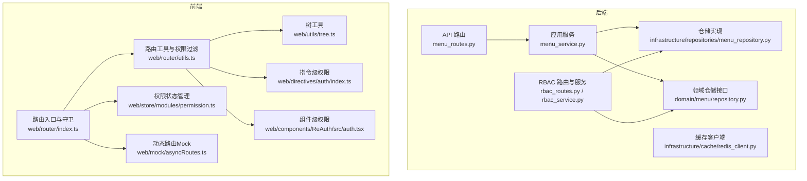
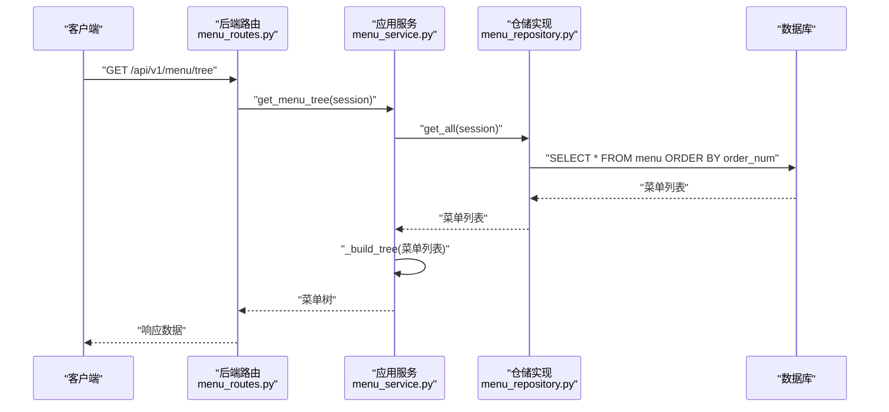
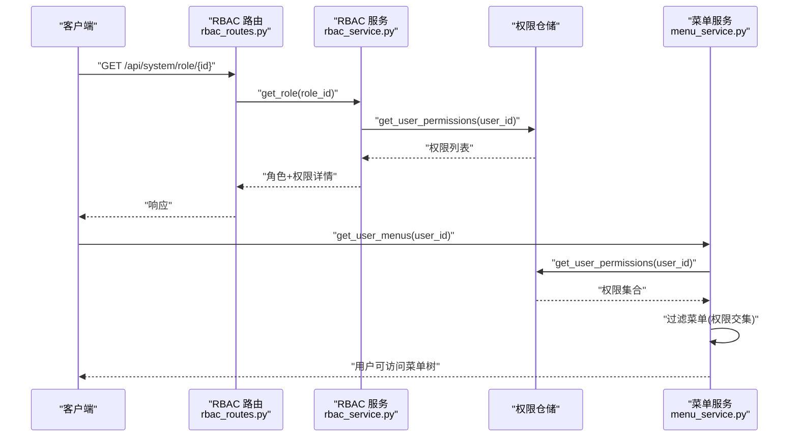
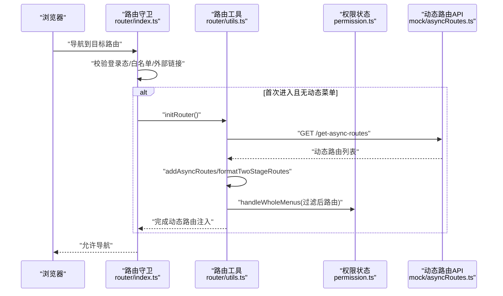
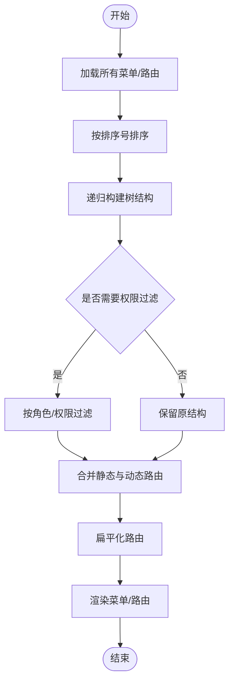
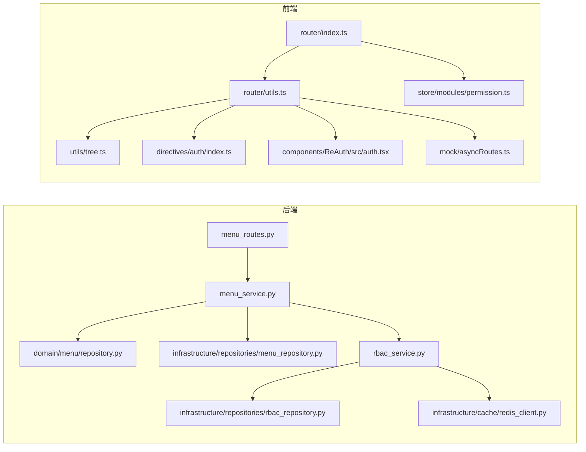

# 菜单权限控制

<cite>
**本文引用的文件**
- [service/src/api/v1/menu_routes.py](file://service/src/api/v1/menu_routes.py)
- [service/src/application/services/menu_service.py](file://service/src/application/services/menu_service.py)
- [service/src/domain/menu/repository.py](file://service/src/domain/menu/repository.py)
- [service/src/infrastructure/repositories/menu_repository.py](file://service/src/infrastructure/repositories/menu_repository.py)
- [service/src/api/v1/rbac_routes.py](file://service/src/api/v1/rbac_routes.py)
- [service/src/application/services/rbac_service.py](file://service/src/application/services/rbac_service.py)
- [service/src/infrastructure/cache/redis_client.py](file://service/src/infrastructure/cache/redis_client.py)
- [web/src/router/index.ts](file://web/src/router/index.ts)
- [web/src/router/utils.ts](file://web/src/router/utils.ts)
- [web/src/store/modules/permission.ts](file://web/src/store/modules/permission.ts)
- [web/src/directives/auth/index.ts](file://web/src/directives/auth/index.ts)
- [web/src/components/ReAuth/src/auth.tsx](file://web/src/components/ReAuth/src/auth.tsx)
- [web/src/utils/tree.ts](file://web/src/utils/tree.ts)
- [web/mock/asyncRoutes.ts](file://web/mock/asyncRoutes.ts)
</cite>

## 目录
1. [简介](#简介)
2. [项目结构](#项目结构)
3. [核心组件](#核心组件)
4. [架构总览](#架构总览)
5. [详细组件分析](#详细组件分析)
6. [依赖分析](#依赖分析)
7. [性能考虑](#性能考虑)
8. [故障排查指南](#故障排查指南)
9. [结论](#结论)
10. [附录](#附录)

## 简介
本技术文档围绕“菜单权限控制系统”展开，系统分为后端服务与前端应用两部分：
- 后端基于 FastAPI，提供菜单与 RBAC 权限的增删改查、菜单树生成、用户菜单过滤等能力，并通过权限注解实现接口级鉴权。
- 前端基于 Vue Router 与 Pinia，实现动态路由加载、菜单树渲染、路由守卫与组件/指令级权限控制。

本文重点解释：
- 动态菜单生成的实现原理与数据流
- 菜单权限与用户权限的映射关系与过滤机制
- 前端路由权限控制（路由守卫、组件/指令级）
- 菜单树形结构生成算法与权限节点渲染逻辑
- 菜单权限缓存策略与性能优化
- 最佳实践与常见问题排查

## 项目结构
后端采用分层架构：API 层负责路由与鉴权，应用层封装业务逻辑，领域层定义仓储接口，基础设施层实现仓储与数据库交互。前端采用模块化组织，路由模块负责动态路由与守卫，权限存储模块负责菜单与缓存管理，工具模块提供树形结构与权限校验。



图表来源
- [service/src/api/v1/menu_routes.py:1-71](file://service/src/api/v1/menu_routes.py#L1-L71)
- [service/src/application/services/menu_service.py:1-169](file://service/src/application/services/menu_service.py#L1-L169)
- [service/src/domain/menu/repository.py:1-43](file://service/src/domain/menu/repository.py#L1-L43)
- [service/src/infrastructure/repositories/menu_repository.py:1-50](file://service/src/infrastructure/repositories/menu_repository.py#L1-L50)
- [service/src/api/v1/rbac_routes.py:1-257](file://service/src/api/v1/rbac_routes.py#L1-L257)
- [service/src/application/services/rbac_service.py:1-231](file://service/src/application/services/rbac_service.py#L1-L231)
- [service/src/infrastructure/cache/redis_client.py:1-24](file://service/src/infrastructure/cache/redis_client.py#L1-L24)
- [web/src/router/index.ts:1-230](file://web/src/router/index.ts#L1-L230)
- [web/src/router/utils.ts:1-424](file://web/src/router/utils.ts#L1-L424)
- [web/src/store/modules/permission.ts:1-76](file://web/src/store/modules/permission.ts#L1-L76)
- [web/src/utils/tree.ts:1-189](file://web/src/utils/tree.ts#L1-L189)
- [web/src/directives/auth/index.ts:1-16](file://web/src/directives/auth/index.ts#L1-L16)
- [web/src/components/ReAuth/src/auth.tsx:1-21](file://web/src/components/ReAuth/src/auth.tsx#L1-L21)
- [web/mock/asyncRoutes.ts:1-342](file://web/mock/asyncRoutes.ts#L1-L342)

章节来源
- [service/src/api/v1/menu_routes.py:1-71](file://service/src/api/v1/menu_routes.py#L1-L71)
- [web/src/router/index.ts:1-230](file://web/src/router/index.ts#L1-L230)

## 核心组件
- 后端菜单服务：提供菜单树构建、用户菜单过滤、菜单 CRUD 等功能。
- 后端 RBAC 服务：提供角色与权限的增删改查、用户角色与权限查询、权限校验等。
- 前端路由与守卫：负责动态路由加载、菜单组装、权限过滤与导航控制。
- 前端权限状态：维护常量菜单、整体菜单、扁平化路由与缓存页面列表。
- 前端树工具：提供层级构建、唯一 ID 生成、节点查找与字段追加等。
- 前端指令与组件：提供按钮级权限的指令与组件两种控制方式。

章节来源
- [service/src/application/services/menu_service.py:1-169](file://service/src/application/services/menu_service.py#L1-L169)
- [service/src/application/services/rbac_service.py:1-231](file://service/src/application/services/rbac_service.py#L1-L231)
- [web/src/router/utils.ts:1-424](file://web/src/router/utils.ts#L1-L424)
- [web/src/store/modules/permission.ts:1-76](file://web/src/store/modules/permission.ts#L1-L76)
- [web/src/utils/tree.ts:1-189](file://web/src/utils/tree.ts#L1-L189)
- [web/src/directives/auth/index.ts:1-16](file://web/src/directives/auth/index.ts#L1-L16)
- [web/src/components/ReAuth/src/auth.tsx:1-21](file://web/src/components/ReAuth/src/auth.tsx#L1-L21)

## 架构总览
后端通过 FastAPI 路由暴露菜单与 RBAC 接口，应用服务调用仓储完成数据持久化与业务计算；前端通过路由守卫与工具函数加载动态路由，结合权限状态与树工具生成菜单树，并在组件与指令层面进行按钮级权限控制。



图表来源
- [service/src/api/v1/menu_routes.py:19-26](file://service/src/api/v1/menu_routes.py#L19-L26)
- [service/src/application/services/menu_service.py:22-25](file://service/src/application/services/menu_service.py#L22-L25)
- [service/src/infrastructure/repositories/menu_repository.py:13-16](file://service/src/infrastructure/repositories/menu_repository.py#L13-L16)

## 详细组件分析

### 后端菜单服务与路由
- 路由层提供菜单树获取、用户菜单获取、菜单 CRUD 等接口，并通过权限装饰器实现接口级鉴权。
- 应用服务负责：
  - 获取完整菜单树：从仓储读取所有菜单，按排序号排序后递归构建树。
  - 用户菜单过滤：获取用户所有权限编码，过滤掉无权限访问的菜单节点，保留有权限或未绑定权限的菜单。
  - 菜单 CRUD：包含父子关系校验、循环引用检测、权限字符串拼接等。
- 仓储层提供统一接口，SQLModel 实现负责具体查询与持久化。

```mermaid
classDiagram
class MenuRoutes {
+GET /tree
+GET /user-menus
+POST ""
+PUT "/{menu_id}"
+DELETE "/{menu_id}"
}
class MenuService {
+get_menu_tree(session)
+get_user_menus(user_id, session)
+create_menu(dto, session)
+update_menu(menu_id, dto, session)
+delete_menu(menu_id, session)
-_build_tree(menus, parent_id)
-_to_response(menu)
}
class MenuRepositoryInterface {
+get_all(session)
+get_by_id(id, session)
+create(menu, session)
+update(menu, session)
+delete(id, session)
+get_by_parent_id(parent_id, session)
}
class MenuRepository {
+get_all(session)
+get_by_id(id, session)
+create(menu, session)
+update(menu, session)
+delete(id, session)
+get_by_parent_id(parent_id, session)
}
MenuRoutes --> MenuService : "调用"
MenuService --> MenuRepositoryInterface : "依赖"
MenuRepositoryInterface <|.. MenuRepository : "实现"
```

图表来源
- [service/src/api/v1/menu_routes.py:1-71](file://service/src/api/v1/menu_routes.py#L1-L71)
- [service/src/application/services/menu_service.py:15-169](file://service/src/application/services/menu_service.py#L15-L169)
- [service/src/domain/menu/repository.py:11-43](file://service/src/domain/menu/repository.py#L11-L43)
- [service/src/infrastructure/repositories/menu_repository.py:10-50](file://service/src/infrastructure/repositories/menu_repository.py#L10-L50)

章节来源
- [service/src/api/v1/menu_routes.py:19-71](file://service/src/api/v1/menu_routes.py#L19-L71)
- [service/src/application/services/menu_service.py:22-169](file://service/src/application/services/menu_service.py#L22-L169)
- [service/src/domain/menu/repository.py:11-43](file://service/src/domain/menu/repository.py#L11-L43)
- [service/src/infrastructure/repositories/menu_repository.py:13-50](file://service/src/infrastructure/repositories/menu_repository.py#L13-L50)

### RBAC 权限与用户权限映射
- RBAC 路由提供角色与权限的增删改查、角色权限分配、用户角色与权限查询等接口。
- 应用服务提供：
  - 用户权限查询：通过角色链路聚合用户权限，形成权限集合。
  - 权限校验：以权限编码为维度进行精确匹配。
- 菜单服务在用户菜单过滤时，将用户权限集合与菜单权限集合求交集，决定菜单可见性。



图表来源
- [service/src/api/v1/rbac_routes.py:84-106](file://service/src/api/v1/rbac_routes.py#L84-L106)
- [service/src/application/services/rbac_service.py:185-199](file://service/src/application/services/rbac_service.py#L185-L199)
- [service/src/application/services/menu_service.py:27-51](file://service/src/application/services/menu_service.py#L27-L51)

章节来源
- [service/src/api/v1/rbac_routes.py:154-177](file://service/src/api/v1/rbac_routes.py#L154-L177)
- [service/src/application/services/rbac_service.py:185-199](file://service/src/application/services/rbac_service.py#L185-L199)
- [service/src/application/services/menu_service.py:27-51](file://service/src/application/services/menu_service.py#L27-L51)

### 前端路由权限控制
- 路由守卫：在 beforeEach 中处理登录态、白名单、外部链接、动态路由初始化与标签页联动；在首次进入且无动态菜单时触发 initRouter。
- 动态路由加载：通过 API 获取后端返回的路由列表，经 addAsyncRoutes 与 formatTwoStageRoutes 处理后注入路由表；同时使用 filterNoPermissionTree 进行角色级权限过滤。
- 权限状态管理：permission store 维护 constantMenus、wholeMenus、flatteningRoutes 与缓存页面列表，提供缓存操作与清理。
- 指令与组件：v-auth 指令与 Auth 组件通过 hasAuth 判断当前路由 meta.auths，决定元素渲染与否。



图表来源
- [web/src/router/index.ts:123-222](file://web/src/router/index.ts#L123-L222)
- [web/src/router/utils.ts:200-235](file://web/src/router/utils.ts#L200-L235)
- [web/src/store/modules/permission.ts:25-34](file://web/src/store/modules/permission.ts#L25-L34)
- [web/mock/asyncRoutes.ts:323-342](file://web/mock/asyncRoutes.ts#L323-L342)

章节来源
- [web/src/router/index.ts:123-222](file://web/src/router/index.ts#L123-L222)
- [web/src/router/utils.ts:84-95](file://web/src/router/utils.ts#L84-L95)
- [web/src/store/modules/permission.ts:25-34](file://web/src/store/modules/permission.ts#L25-L34)
- [web/src/directives/auth/index.ts:4-15](file://web/src/directives/auth/index.ts#L4-L15)
- [web/src/components/ReAuth/src/auth.tsx:12-20](file://web/src/components/ReAuth/src/auth.tsx#L12-L20)

### 菜单树形结构生成与渲染
- 后端树生成：按排序号递归构建树，输出包含 children 的层级结构。
- 前端树工具：提供层级构建、唯一 ID 生成、节点查找与字段追加等通用能力。
- 前端渲染：constantMenus 用于菜单渲染，wholeMenus 由动态路由与静态路由合并并过滤后得到，最终通过组件渲染。



图表来源
- [service/src/application/services/menu_service.py:141-149](file://service/src/application/services/menu_service.py#L141-L149)
- [web/src/utils/tree.ts:56-72](file://web/src/utils/tree.ts#L56-L72)
- [web/src/router/utils.ts:242-279](file://web/src/router/utils.ts#L242-L279)

章节来源
- [service/src/application/services/menu_service.py:141-149](file://service/src/application/services/menu_service.py#L141-L149)
- [web/src/utils/tree.ts:56-72](file://web/src/utils/tree.ts#L56-L72)
- [web/src/router/utils.ts:242-279](file://web/src/router/utils.ts#L242-L279)

### 缓存策略与性能优化
- 前端动态路由缓存：initRouter 支持开启缓存，优先从 localStorage 读取，避免重复请求；成功后写入缓存。
- 前端页面缓存：permission store 维护缓存页面列表，结合标签页联动清理无效缓存。
- 后端缓存：提供 Redis 客户端，可用于菜单树、权限等热点数据缓存（需在服务层扩展）。
- 性能建议：
  - 后端：菜单树与用户权限查询应建立索引；权限集合使用集合运算减少循环。
  - 前端：动态路由缓存与扁平化路由减少渲染开销；keep-alive 仅缓存二级路由。

章节来源
- [web/src/router/utils.ts:200-235](file://web/src/router/utils.ts#L200-L235)
- [web/src/store/modules/permission.ts:49-69](file://web/src/store/modules/permission.ts#L49-L69)
- [service/src/infrastructure/cache/redis_client.py:10-23](file://service/src/infrastructure/cache/redis_client.py#L10-L23)

## 依赖分析
- 后端依赖关系清晰：路由依赖应用服务，应用服务依赖仓储接口，仓储接口由 SQLModel 实现。
- 前端依赖关系：路由守卫依赖工具函数与权限状态；工具函数依赖树工具与认证信息；指令与组件依赖工具函数进行权限判断。



图表来源
- [service/src/api/v1/menu_routes.py:6-13](file://service/src/api/v1/menu_routes.py#L6-L13)
- [service/src/application/services/menu_service.py:8-20](file://service/src/application/services/menu_service.py#L8-L20)
- [service/src/domain/menu/repository.py:6-12](file://service/src/domain/menu/repository.py#L6-L12)
- [service/src/infrastructure/repositories/menu_repository.py:3-7](file://service/src/infrastructure/repositories/menu_repository.py#L3-L7)
- [service/src/application/services/rbac_service.py:3-16](file://service/src/application/services/rbac_service.py#L3-L16)
- [service/src/infrastructure/cache/redis_client.py:3-15](file://service/src/infrastructure/cache/redis_client.py#L3-L15)
- [web/src/router/index.ts:1-27](file://web/src/router/index.ts#L1-L27)
- [web/src/router/utils.ts:1-27](file://web/src/router/utils.ts#L1-L27)
- [web/src/store/modules/permission.ts:1-12](file://web/src/store/modules/permission.ts#L1-L12)
- [web/src/utils/tree.ts:1-7](file://web/src/utils/tree.ts#L1-L7)
- [web/src/directives/auth/index.ts:1-2](file://web/src/directives/auth/index.ts#L1-L2)
- [web/src/components/ReAuth/src/auth.tsx:1-2](file://web/src/components/ReAuth/src/auth.tsx#L1-L2)
- [web/mock/asyncRoutes.ts:1-3](file://web/mock/asyncRoutes.ts#L1-L3)

章节来源
- [service/src/api/v1/menu_routes.py:6-13](file://service/src/api/v1/menu_routes.py#L6-L13)
- [web/src/router/index.ts:1-27](file://web/src/router/index.ts#L1-L27)

## 性能考虑
- 后端：
  - 使用集合运算进行权限交集判断，时间复杂度 O(n)。
  - 菜单树构建为递归过程，深度受限于层级数量；建议限制最大层级并使用索引。
- 前端：
  - 动态路由缓存与扁平化路由减少渲染与匹配成本。
  - keep-alive 仅缓存二级路由，避免深层嵌套带来的内存压力。
  - 树工具的层级构建与唯一 ID 生成为线性复杂度，适合大规模菜单。

[本节为通用性能讨论，不直接分析具体文件]

## 故障排查指南
- 登录态缺失或过期：
  - 现象：被重定向至登录页。
  - 排查：检查 Cookie 与 Token 状态、白名单配置。
- 无权限访问：
  - 现象：路由守卫拦截或按钮不可见。
  - 排查：确认用户角色/权限是否正确下发；检查 meta.roles 与 meta.auths。
- 动态路由未生效：
  - 现象：菜单为空或导航异常。
  - 排查：确认 initRouter 是否执行、缓存是否命中、后端返回路由结构是否正确。
- 菜单树异常：
  - 现象：父子关系错乱或排序异常。
  - 排查：检查后端排序字段与前端 ascending 排序逻辑；确认唯一 ID 生成与层级构建。
- 缓存问题：
  - 现象：页面刷新后菜单丢失或缓存未清理。
  - 排查：检查 localStorage 中 async-routes 缓存；确认 permission store 的缓存清理逻辑。

章节来源
- [web/src/router/index.ts:210-222](file://web/src/router/index.ts#L210-L222)
- [web/src/router/utils.ts:200-235](file://web/src/router/utils.ts#L200-L235)
- [web/src/store/modules/permission.ts:35-69](file://web/src/store/modules/permission.ts#L35-L69)

## 结论
本系统通过后端菜单与 RBAC 服务、前端路由守卫与权限状态管理，实现了完整的菜单权限控制闭环。后端提供稳定的菜单树与权限过滤能力，前端通过缓存与工具函数保障渲染性能与体验。建议在生产环境中进一步完善后端缓存与权限索引，并持续优化动态路由加载策略。

[本节为总结性内容，不直接分析具体文件]

## 附录
- 最佳实践：
  - 菜单权限编码与业务动作一一对应，避免过于宽泛的权限。
  - 动态路由与静态路由分离，便于维护与缓存。
  - 在前端统一收敛权限判断逻辑，指令与组件配合使用。
  - 对高频接口与菜单树进行缓存，降低数据库压力。
- 常见问题：
  - 权限未下发：核对 RBAC 分配与用户角色链路。
  - 菜单排序异常：检查后端排序字段与前端 ascending。
  - 动态路由重复注入：确保路由去重与 addRoute 使用正确。

[本节为通用指导，不直接分析具体文件]