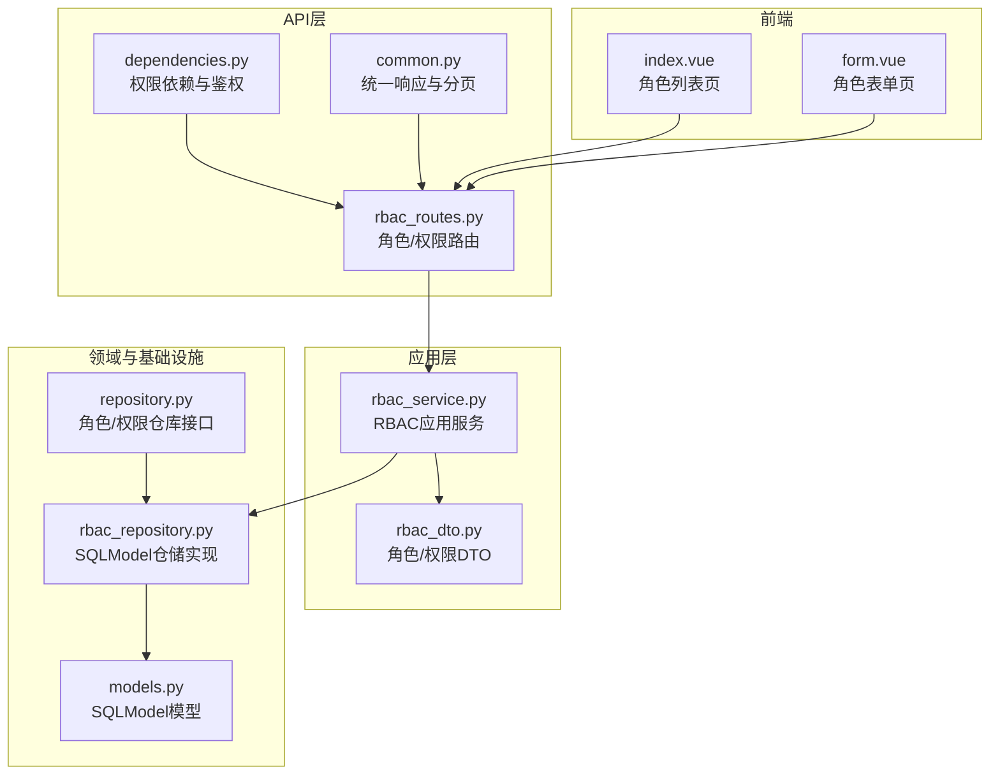
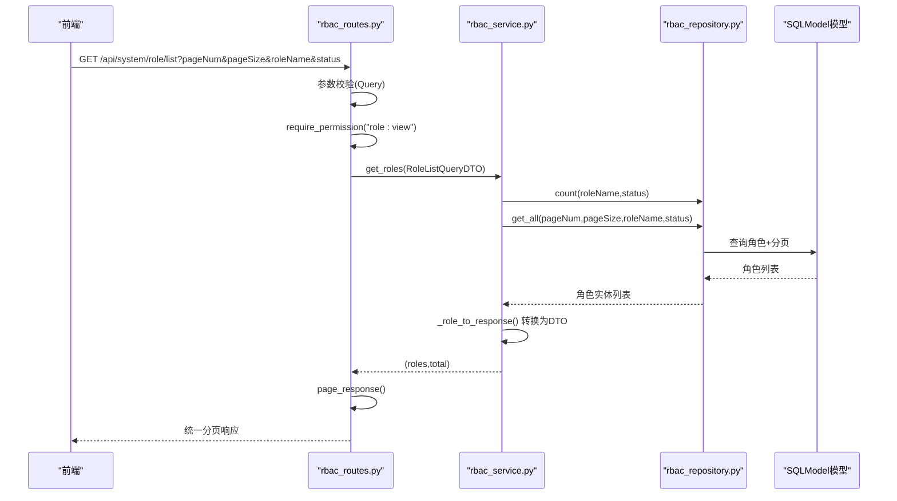
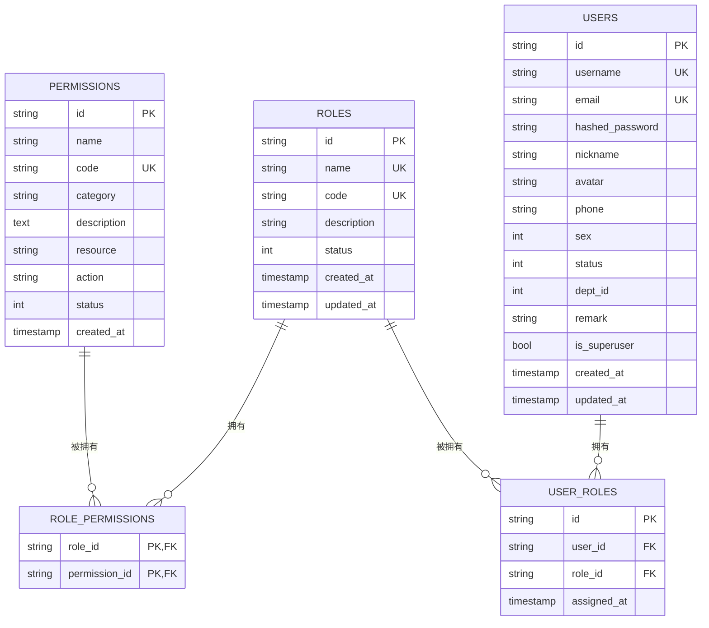
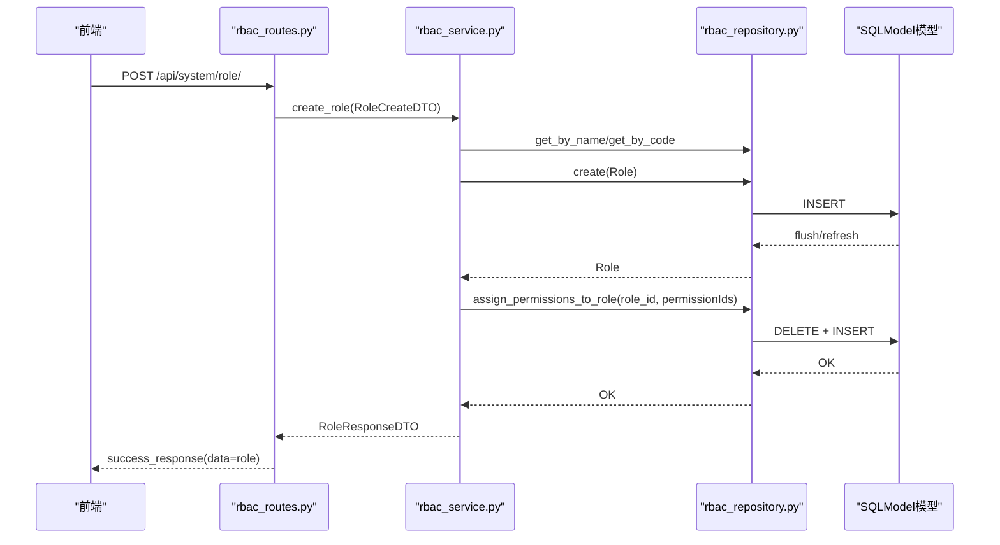
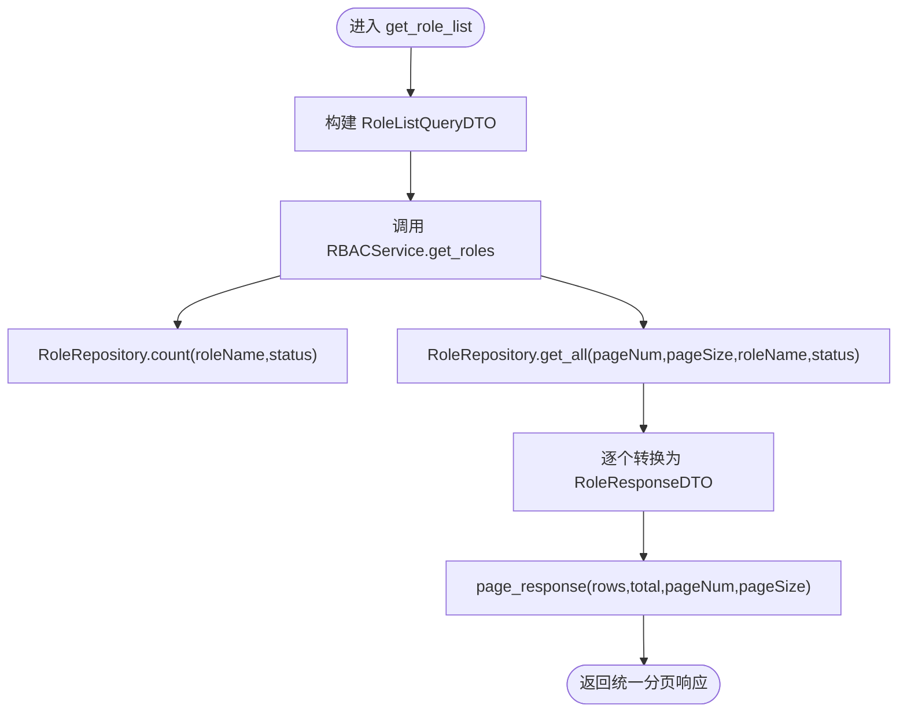
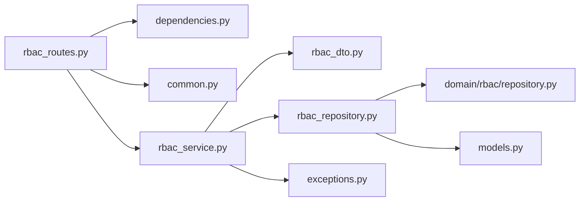

# 角色管理

<cite>
**本文引用的文件**
- [rbac_routes.py](file://service/src/api/v1/rbac_routes.py)
- [rbac_service.py](file://service/src/application/services/rbac_service.py)
- [rbac_dto.py](file://service/src/application/dto/rbac_dto.py)
- [rbac_repository.py](file://service/src/infrastructure/repositories/rbac_repository.py)
- [repository.py](file://service/src/domain/rbac/repository.py)
- [models.py](file://service/src/infrastructure/database/models.py)
- [common.py](file://service/src/api/common.py)
- [dependencies.py](file://service/src/api/dependencies.py)
- [exceptions.py](file://service/src/core/exceptions.py)
- [main.py](file://service/src/main.py)
- [index.vue](file://web/src/views/system/role/index.vue)
- [form.vue](file://web/src/views/system/role/form.vue)
</cite>

## 目录
1. [简介](#简介)
2. [项目结构](#项目结构)
3. [核心组件](#核心组件)
4. [架构总览](#架构总览)
5. [详细组件分析](#详细组件分析)
6. [依赖分析](#依赖分析)
7. [性能考虑](#性能考虑)
8. [故障排查指南](#故障排查指南)
9. [结论](#结论)
10. [附录](#附录)

## 简介
本技术文档围绕角色管理系统（RBAC）进行深入解析，涵盖角色实体的数据模型设计、角色CRUD操作的完整实现流程（从API路由到服务层再到仓储层）、角色列表查询与分页、模糊搜索、角色状态管理、角色权限关联等核心业务逻辑，并提供最佳实践与性能优化建议及常见问题排查方案。文档同时结合前端角色管理页面，帮助读者理解前后端交互与数据流转。

## 项目结构
角色管理相关代码主要分布在后端服务工程的三层架构中：
- API层：负责HTTP路由、参数校验、权限控制与统一响应封装
- 应用层：负责业务编排、事务边界与DTO转换
- 基础设施层：负责数据库模型、仓储实现与SQLModel查询

图表来源
- [rbac_routes.py:1-257](file://service/src/api/v1/rbac_routes.py#L1-L257)
- [rbac_service.py:1-231](file://service/src/application/services/rbac_service.py#L1-L231)
- [rbac_dto.py:1-88](file://service/src/application/dto/rbac_dto.py#L1-L88)
- [rbac_repository.py:1-213](file://service/src/infrastructure/repositories/rbac_repository.py#L1-L213)
- [repository.py:1-77](file://service/src/domain/rbac/repository.py#L1-L77)
- [models.py:1-193](file://service/src/infrastructure/database/models.py#L1-L193)
- [common.py:1-65](file://service/src/api/common.py#L1-L65)
- [dependencies.py:1-72](file://service/src/api/dependencies.py#L1-L72)
- [index.vue:1-342](file://web/src/views/system/role/index.vue#L1-L342)
- [form.vue:1-56](file://web/src/views/system/role/form.vue#L1-L56)

章节来源
- [rbac_routes.py:1-257](file://service/src/api/v1/rbac_routes.py#L1-L257)
- [rbac_service.py:1-231](file://service/src/application/services/rbac_service.py#L1-L231)
- [rbac_dto.py:1-88](file://service/src/application/dto/rbac_dto.py#L1-L88)
- [rbac_repository.py:1-213](file://service/src/infrastructure/repositories/rbac_repository.py#L1-L213)
- [repository.py:1-77](file://service/src/domain/rbac/repository.py#L1-L77)
- [models.py:1-193](file://service/src/infrastructure/database/models.py#L1-L193)
- [common.py:1-65](file://service/src/api/common.py#L1-L65)
- [dependencies.py:1-72](file://service/src/api/dependencies.py#L1-L72)
- [index.vue:1-342](file://web/src/views/system/role/index.vue#L1-L342)
- [form.vue:1-56](file://web/src/views/system/role/form.vue#L1-L56)

## 核心组件
- 角色实体与权限实体：基于SQLModel定义，包含主键、唯一索引、状态字段、时间戳等
- 角色/权限仓储接口：定义角色与权限的CRUD、分页、计数、关联查询等抽象能力
- SQLModel仓储实现：具体执行查询、分页、关联写入与删除
- RBAC应用服务：编排业务逻辑、DTO校验与转换、调用仓储、处理异常
- API路由与依赖：提供REST接口、参数校验、权限拦截、统一响应
- 前端角色管理页面：角色列表、分页、搜索、新增/修改、权限分配弹窗

章节来源
- [models.py:70-121](file://service/src/infrastructure/database/models.py#L70-L121)
- [repository.py:8-77](file://service/src/domain/rbac/repository.py#L8-L77)
- [rbac_repository.py:11-213](file://service/src/infrastructure/repositories/rbac_repository.py#L11-L213)
- [rbac_service.py:19-231](file://service/src/application/services/rbac_service.py#L19-L231)
- [rbac_routes.py:33-177](file://service/src/api/v1/rbac_routes.py#L33-L177)
- [dependencies.py:45-61](file://service/src/api/dependencies.py#L45-L61)
- [common.py:29-65](file://service/src/api/common.py#L29-L65)
- [index.vue:90-325](file://web/src/views/system/role/index.vue#L90-L325)
- [form.vue:24-56](file://web/src/views/system/role/form.vue#L24-L56)

## 架构总览
角色管理采用分层架构，职责清晰：
- API层：暴露REST接口，注入依赖（鉴权、权限校验），返回统一响应
- 应用层：封装业务规则，协调仓储，进行DTO转换
- 基础设施层：SQLModel模型与仓储实现，负责数据库访问与关联表维护

图表来源
- [rbac_routes.py:33-61](file://service/src/api/v1/rbac_routes.py#L33-L61)
- [rbac_service.py:58-77](file://service/src/application/services/rbac_service.py#L58-L77)
- [rbac_repository.py:32-60](file://service/src/infrastructure/repositories/rbac_repository.py#L32-L60)
- [common.py:50-59](file://service/src/api/common.py#L50-L59)

## 详细组件分析

### 角色实体数据模型设计
- 主键与唯一性
  - 角色：id为主键，name与code均唯一；角色与权限通过中间表多对多关联
  - 权限：id为主键，code唯一；权限与角色通过中间表多对多关联
  - 用户-角色关联：user_roles表记录用户与角色的多对多关系
- 字段定义
  - 角色：id、name、code、description、status、created_at、updated_at
  - 权限：id、name、code、category、description、resource、action、status、created_at
  - 用户-角色：id、user_id、role_id、assigned_at
- 关系映射
  - Role.permissions 与 Permission.roles 通过 RolePermissionLink 进行多对多映射
  - User.roles 与 Role.users 通过 UserRole 进行多对多映射

图表来源
- [models.py:70-141](file://service/src/infrastructure/database/models.py#L70-L141)

章节来源
- [models.py:70-141](file://service/src/infrastructure/database/models.py#L70-L141)

### 角色CRUD与权限分配流程
- 创建角色
  - API层接收RoleCreateDTO，校验参数并进行权限拦截
  - 应用服务检查名称/编码唯一性，创建角色，可选分配权限
  - 仓储实现执行插入与flush/refresh，返回持久化后的角色
- 列表查询与分页
  - API层构建RoleListQueryDTO，调用应用服务
  - 应用服务先count再get_all，分页参数传入仓储
  - 仓储使用offset/limit实现分页，模糊匹配roleName
- 详情查询
  - 应用服务获取角色详情，同时加载角色权限列表
- 更新角色
  - 应用服务校验名称/编码唯一性（排除自身），更新字段，可选重新分配权限
- 删除角色
  - 应用服务删除角色，仓储返回布尔值并处理未找到场景
- 权限分配
  - 应用服务调用仓储，先清空旧关联，再批量写入新关联
  - 仓储使用批量删除+循环插入实现“先清后赋”

图表来源
- [rbac_routes.py:64-83](file://service/src/api/v1/rbac_routes.py#L64-L83)
- [rbac_service.py:28-49](file://service/src/application/services/rbac_service.py#L28-L49)
- [rbac_repository.py:62-96](file://service/src/infrastructure/repositories/rbac_repository.py#L62-L96)

章节来源
- [rbac_routes.py:64-151](file://service/src/api/v1/rbac_routes.py#L64-L151)
- [rbac_service.py:28-119](file://service/src/application/services/rbac_service.py#L28-L119)
- [rbac_repository.py:62-96](file://service/src/infrastructure/repositories/rbac_repository.py#L62-L96)

### 角色列表查询、分页与模糊搜索
- 分页参数
  - pageNum默认1，pageSize默认10，最大100
- 模糊搜索
  - roleName使用包含匹配（name.contains）
  - permissionName使用包含匹配（name.contains）
- 计数与列表分离
  - 先执行count统计总数，再执行分页查询
- 统一响应
  - 使用page_response封装total/pageNum/pageSize/totalPage/rows

图表来源
- [rbac_routes.py:33-61](file://service/src/api/v1/rbac_routes.py#L33-L61)
- [rbac_service.py:58-77](file://service/src/application/services/rbac_service.py#L58-L77)
- [rbac_repository.py:32-60](file://service/src/infrastructure/repositories/rbac_repository.py#L32-L60)
- [common.py:50-59](file://service/src/api/common.py#L50-L59)

章节来源
- [rbac_routes.py:33-61](file://service/src/api/v1/rbac_routes.py#L33-L61)
- [rbac_service.py:58-77](file://service/src/application/services/rbac_service.py#L58-L77)
- [rbac_repository.py:32-60](file://service/src/infrastructure/repositories/rbac_repository.py#L32-L60)
- [common.py:50-59](file://service/src/api/common.py#L50-L59)

### 角色状态管理与权限关联
- 状态字段
  - 角色与权限均包含status字段（0-禁用，1-启用）
- 权限拦截
  - require_permission依赖在路由上强制校验用户是否具备指定权限
- 用户-角色与角色-权限
  - 用户-角色：UserRole表记录用户与角色的多对多关系
  - 角色-权限：RolePermissionLink表记录角色与权限的多对多关系
- 权限检查
  - 应用服务提供check_permission方法，按用户权限集合判断是否具备某权限codename

章节来源
- [models.py:70-141](file://service/src/infrastructure/database/models.py#L70-L141)
- [dependencies.py:45-61](file://service/src/api/dependencies.py#L45-L61)
- [rbac_service.py:195-198](file://service/src/application/services/rbac_service.py#L195-L198)

### 前端角色管理页面
- 角色列表页
  - 支持角色名称、角色标识、状态筛选
  - 分页表格展示角色列表，提供新增、修改、删除、权限分配操作
- 角色表单页
  - 表单包含角色名称、角色标识、备注等字段，配合校验规则

章节来源
- [index.vue:90-325](file://web/src/views/system/role/index.vue#L90-L325)
- [form.vue:24-56](file://web/src/views/system/role/form.vue#L24-L56)

## 依赖分析
- API层依赖
  - 依赖鉴权与权限校验：require_permission
  - 依赖统一响应：success_response、page_response
- 应用层依赖
  - 依赖仓储接口：RoleRepositoryInterface、PermissionRepositoryInterface
  - 依赖异常类型：ConflictError、NotFoundError
- 基础设施层依赖
  - 依赖SQLModel模型：Role、Permission、UserRole、RolePermissionLink
  - 依赖SQLModel查询：select、delete、flush、refresh

图表来源
- [rbac_routes.py:1-25](file://service/src/api/v1/rbac_routes.py#L1-L25)
- [dependencies.py:1-72](file://service/src/api/dependencies.py#L1-L72)
- [common.py:1-65](file://service/src/api/common.py#L1-L65)
- [rbac_service.py:1-25](file://service/src/application/services/rbac_service.py#L1-L25)
- [rbac_dto.py:1-88](file://service/src/application/dto/rbac_dto.py#L1-L88)
- [rbac_repository.py:1-213](file://service/src/infrastructure/repositories/rbac_repository.py#L1-L213)
- [repository.py:1-77](file://service/src/domain/rbac/repository.py#L1-L77)
- [models.py:1-193](file://service/src/infrastructure/database/models.py#L1-L193)
- [exceptions.py:1-60](file://service/src/core/exceptions.py#L1-L60)

章节来源
- [rbac_routes.py:1-25](file://service/src/api/v1/rbac_routes.py#L1-L25)
- [dependencies.py:1-72](file://service/src/api/dependencies.py#L1-L72)
- [common.py:1-65](file://service/src/api/common.py#L1-L65)
- [rbac_service.py:1-25](file://service/src/application/services/rbac_service.py#L1-L25)
- [rbac_dto.py:1-88](file://service/src/application/dto/rbac_dto.py#L1-L88)
- [rbac_repository.py:1-213](file://service/src/infrastructure/repositories/rbac_repository.py#L1-L213)
- [repository.py:1-77](file://service/src/domain/rbac/repository.py#L1-L77)
- [models.py:1-193](file://service/src/infrastructure/database/models.py#L1-L193)
- [exceptions.py:1-60](file://service/src/core/exceptions.py#L1-L60)

## 性能考虑
- 分页与计数
  - 列表查询先count后分页，避免一次性加载全部数据
  - 分页大小限制在1-100之间，防止过大请求导致数据库压力
- 查询优化
  - 角色与权限的模糊查询使用包含匹配，建议在高频字段建立合适索引
  - 用户权限查询通过多表join并去重，注意索引覆盖与查询计划
- 写入优化
  - 权限分配采用“先清后赋”，批量删除+循环插入，建议在高并发场景下评估事务粒度与锁竞争
- 缓存策略
  - 可对常用角色/权限列表进行缓存，减少数据库压力（需结合业务场景与一致性需求）

## 故障排查指南
- 常见异常与处理
  - 资源不存在：抛出NotFoundError，返回404
  - 资源冲突（如名称/编码重复）：抛出ConflictError，返回409
  - 权限不足：抛出ForbiddenError，返回403
  - 未认证：抛出UnauthorizedError，返回401
  - 参数验证失败：统一捕获并返回422，携带错误明细
- 排查步骤
  - 检查路由权限依赖是否正确配置（role:view/role:manage/permission:view/permission:manage）
  - 核对DTO字段长度与范围约束，确保前端传参符合后端校验
  - 查看数据库唯一约束冲突（角色name/code、权限code）
  - 检查用户是否具备超级管理员身份或目标权限codename
  - 关注仓储层flush/refresh时机与事务边界，避免脏读或未刷新

章节来源
- [exceptions.py:13-60](file://service/src/core/exceptions.py#L13-L60)
- [dependencies.py:45-61](file://service/src/api/dependencies.py#L45-L61)
- [rbac_routes.py:33-177](file://service/src/api/v1/rbac_routes.py#L33-L177)
- [main.py:61-83](file://service/src/main.py#L61-L83)

## 结论
该角色管理系统以SQLModel为基础，采用DDD分层架构，职责清晰、扩展性强。通过仓储接口抽象与SQLModel实现分离，既保证了业务逻辑的稳定性，又便于后续演进。前端角色管理页面与后端接口形成闭环，支持完整的角色CRUD与权限分配流程。建议在生产环境中结合缓存、索引与事务优化策略，持续监控与迭代。

## 附录
- 统一响应与分页
  - 统一响应体包含code、message、data
  - 分页响应体包含total、pageNum、pageSize、totalPage、rows
- 前端交互要点
  - 列表页支持角色名称、角色标识、状态筛选与分页
  - 表单页提供角色名称、角色标识、备注字段，配合校验规则

章节来源
- [common.py:29-65](file://service/src/api/common.py#L29-L65)
- [index.vue:90-325](file://web/src/views/system/role/index.vue#L90-L325)
- [form.vue:24-56](file://web/src/views/system/role/form.vue#L24-L56)