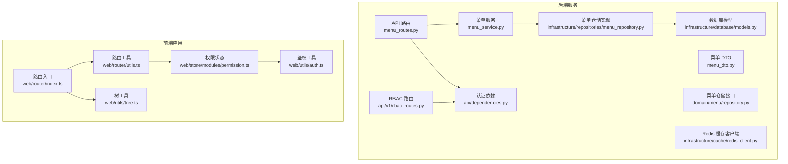
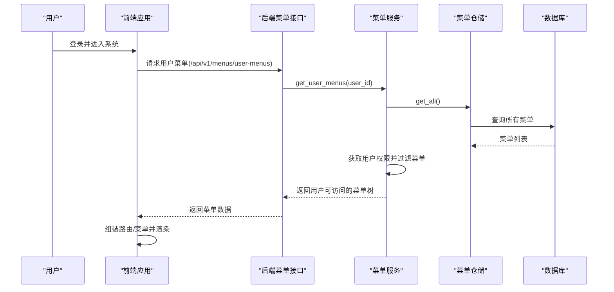
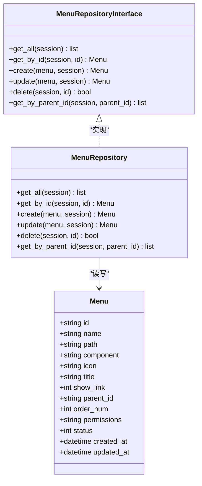
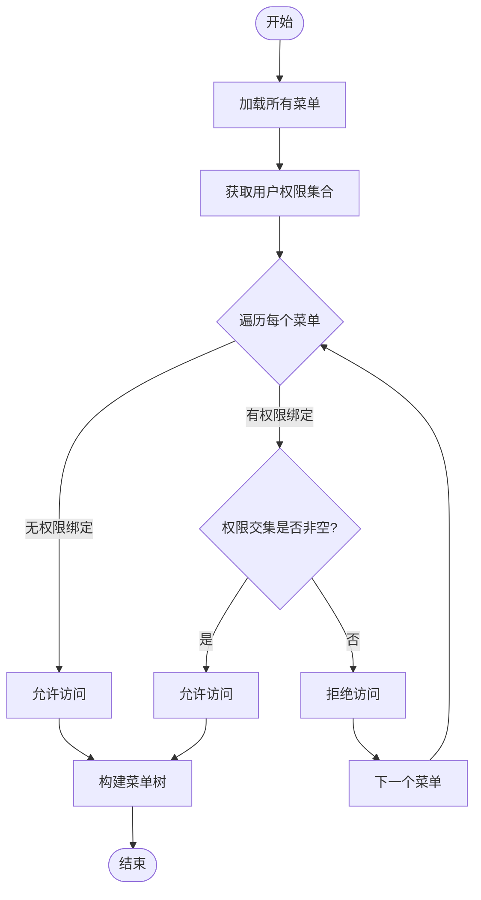
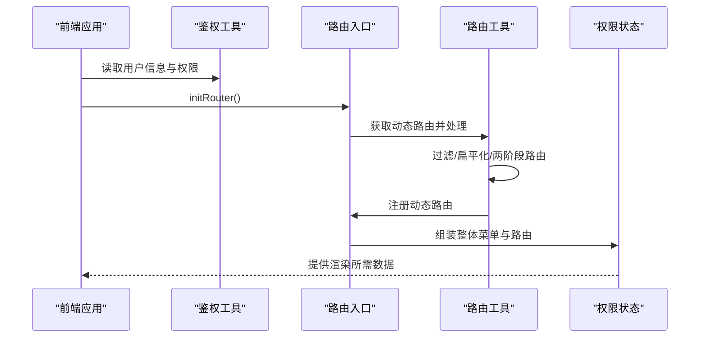
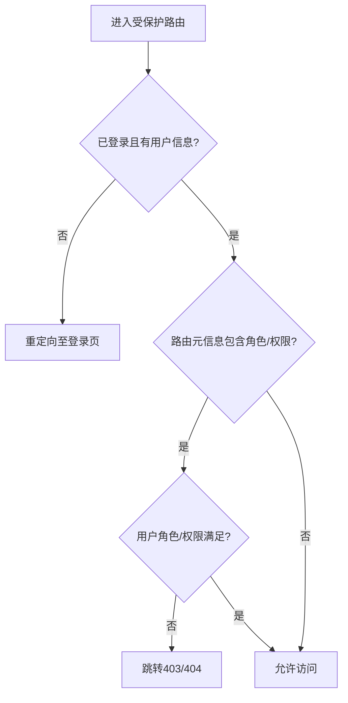
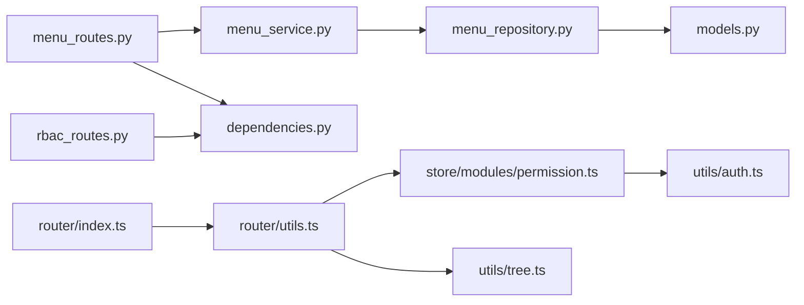
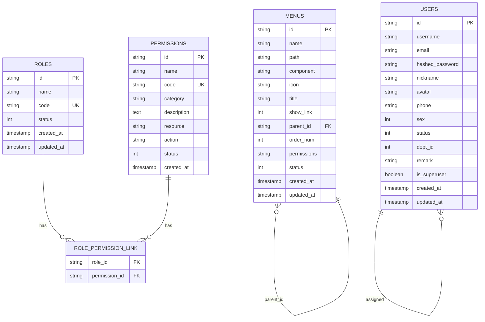

# 动态菜单生成

<cite>
**本文档引用的文件**
- [service/src/api/v1/menu_routes.py](file://service/src/api/v1/menu_routes.py)
- [service/src/application/services/menu_service.py](file://service/src/application/services/menu_service.py)
- [service/src/application/dto/menu_dto.py](file://service/src/application/dto/menu_dto.py)
- [service/src/domain/menu/repository.py](file://service/src/domain/menu/repository.py)
- [service/src/infrastructure/repositories/menu_repository.py](file://service/src/infrastructure/repositories/menu_repository.py)
- [service/src/infrastructure/database/models.py](file://service/src/infrastructure/database/models.py)
- [service/src/api/v1/rbac_routes.py](file://service/src/api/v1/rbac_routes.py)
- [service/src/api/dependencies.py](file://service/src/api/dependencies.py)
- [service/src/infrastructure/cache/redis_client.py](file://service/src/infrastructure/cache/redis_client.py)
- [web/src/router/index.ts](file://web/src/router/index.ts)
- [web/src/router/utils.ts](file://web/src/router/utils.ts)
- [web/src/store/modules/permission.ts](file://web/src/store/modules/permission.ts)
- [web/src/utils/tree.ts](file://web/src/utils/tree.ts)
- [web/src/utils/auth.ts](file://web/src/utils/auth.ts)
</cite>

## 目录
1. [简介](#简介)
2. [项目结构](#项目结构)
3. [核心组件](#核心组件)
4. [架构总览](#架构总览)
5. [详细组件分析](#详细组件分析)
6. [依赖分析](#依赖分析)
7. [性能考虑](#性能考虑)
8. [故障排查指南](#故障排查指南)
9. [结论](#结论)
10. [附录](#附录)

## 简介
本技术文档聚焦于“动态菜单生成”功能，系统性阐述基于权限的菜单树构建、权限过滤逻辑、数据模型与层级关系设计、前端菜单渲染与路由自动注册、权限验证与访问控制流程、最佳实践与性能优化策略、扩展性与自定义菜单项添加方法，以及菜单缓存与实时更新策略。目标是帮助开发者快速理解并高效扩展该能力。

## 项目结构
动态菜单系统由后端 FastAPI 服务与前端 Vue 应用协同完成：
- 后端负责菜单数据的持久化、菜单树构建、用户菜单权限过滤、RBAC 权限管理。
- 前端负责静态路由与动态路由的组装、菜单渲染、权限过滤、路由注册与缓存策略。

图表来源
- [service/src/api/v1/menu_routes.py:1-71](file://service/src/api/v1/menu_routes.py#L1-L71)
- [service/src/application/services/menu_service.py:1-169](file://service/src/application/services/menu_service.py#L1-L169)
- [service/src/application/dto/menu_dto.py:1-56](file://service/src/application/dto/menu_dto.py#L1-L56)
- [service/src/domain/menu/repository.py:1-43](file://service/src/domain/menu/repository.py#L1-L43)
- [service/src/infrastructure/repositories/menu_repository.py:1-50](file://service/src/infrastructure/repositories/menu_repository.py#L1-L50)
- [service/src/infrastructure/database/models.py:146-171](file://service/src/infrastructure/database/models.py#L146-L171)
- [service/src/api/v1/rbac_routes.py:1-257](file://service/src/api/v1/rbac_routes.py#L1-L257)
- [service/src/api/dependencies.py:1-72](file://service/src/api/dependencies.py#L1-L72)
- [service/src/infrastructure/cache/redis_client.py:1-24](file://service/src/infrastructure/cache/redis_client.py#L1-L24)
- [web/src/router/index.ts:1-230](file://web/src/router/index.ts#L1-L230)
- [web/src/router/utils.ts:1-424](file://web/src/router/utils.ts#L1-L424)
- [web/src/store/modules/permission.ts:1-76](file://web/src/store/modules/permission.ts#L1-L76)
- [web/src/utils/tree.ts:1-189](file://web/src/utils/tree.ts#L1-L189)
- [web/src/utils/auth.ts:1-142](file://web/src/utils/auth.ts#L1-L142)

章节来源
- [service/src/api/v1/menu_routes.py:1-71](file://service/src/api/v1/menu_routes.py#L1-L71)
- [web/src/router/index.ts:1-230](file://web/src/router/index.ts#L1-L230)

## 核心组件
- 后端菜单 API：提供菜单树获取、用户菜单获取、菜单增删改查等接口。
- 菜单服务：负责菜单树构建、用户菜单权限过滤、菜单 CRUD 业务逻辑。
- 菜单仓储：抽象菜单数据访问接口与 SQLModel 实现。
- RBAC 路由：提供角色与权限管理接口，支撑菜单权限绑定。
- 前端路由与权限：负责静态/动态路由合并、菜单过滤、路由注册与缓存。

章节来源
- [service/src/api/v1/menu_routes.py:19-71](file://service/src/api/v1/menu_routes.py#L19-L71)
- [service/src/application/services/menu_service.py:22-169](file://service/src/application/services/menu_service.py#L22-L169)
- [service/src/domain/menu/repository.py:11-43](file://service/src/domain/menu/repository.py#L11-L43)
- [service/src/infrastructure/repositories/menu_repository.py:10-50](file://service/src/infrastructure/repositories/menu_repository.py#L10-L50)
- [service/src/api/v1/rbac_routes.py:33-257](file://service/src/api/v1/rbac_routes.py#L33-L257)
- [web/src/router/index.ts:52-116](file://web/src/router/index.ts#L52-L116)
- [web/src/router/utils.ts:199-235](file://web/src/router/utils.ts#L199-L235)
- [web/src/store/modules/permission.ts:14-71](file://web/src/store/modules/permission.ts#L14-L71)

## 架构总览
后端以 FastAPI + SQLModel + RBAC 为核心，前端以 Vue Router + Pinia + 工具函数实现动态菜单与路由自动注册。权限验证贯穿前后端，确保菜单可见性与路由可达性一致。

图表来源
- [service/src/api/v1/menu_routes.py:29-36](file://service/src/api/v1/menu_routes.py#L29-L36)
- [service/src/application/services/menu_service.py:27-51](file://service/src/application/services/menu_service.py#L27-L51)
- [service/src/infrastructure/repositories/menu_repository.py:13-16](file://service/src/infrastructure/repositories/menu_repository.py#L13-L16)
- [web/src/router/utils.ts:199-235](file://web/src/router/utils.ts#L199-L235)

## 详细组件分析

### 后端菜单服务与数据模型
- 菜单模型包含父子关系、排序、权限编码、状态等字段，支持递归构建菜单树。
- 菜单服务提供：
  - 获取完整菜单树：从数据库读取并递归构建树形结构。
  - 获取用户可访问菜单：结合用户权限集合进行过滤，超级用户返回全量。
  - 菜单 CRUD：包含父子关系校验、循环引用检测、权限编码存储等。
- DTO 定义了菜单创建/更新/响应的数据结构，保证前后端一致性。

图表来源
- [service/src/infrastructure/database/models.py:146-171](file://service/src/infrastructure/database/models.py#L146-L171)
- [service/src/domain/menu/repository.py:11-43](file://service/src/domain/menu/repository.py#L11-L43)
- [service/src/infrastructure/repositories/menu_repository.py:10-50](file://service/src/infrastructure/repositories/menu_repository.py#L10-L50)

章节来源
- [service/src/application/services/menu_service.py:22-169](file://service/src/application/services/menu_service.py#L22-L169)
- [service/src/application/dto/menu_dto.py:8-56](file://service/src/application/dto/menu_dto.py#L8-L56)
- [service/src/infrastructure/database/models.py:146-171](file://service/src/infrastructure/database/models.py#L146-L171)

### 权限过滤与菜单树构建
- 用户菜单过滤：服务层获取用户权限集合，与菜单的权限编码进行集合交集判断，未绑定权限的菜单默认放行。
- 菜单树构建：通过递归遍历，依据 parent_id 构建层级树，支持任意层级深度。
- 超级用户放行：超级用户绕过权限校验，直接返回全量菜单树。

图表来源
- [service/src/application/services/menu_service.py:27-51](file://service/src/application/services/menu_service.py#L27-L51)
- [service/src/application/services/menu_service.py:141-149](file://service/src/application/services/menu_service.py#L141-L149)

章节来源
- [service/src/application/services/menu_service.py:27-51](file://service/src/application/services/menu_service.py#L27-L51)
- [service/src/application/services/menu_service.py:141-149](file://service/src/application/services/menu_service.py#L141-L149)

### RBAC 权限与角色管理
- RBAC 路由提供角色与权限的增删改查、角色权限分配等接口，支撑菜单权限绑定。
- 依赖注入 require_permission 在路由层强制权限校验，超级用户豁免。

图表来源
- [service/src/api/v1/rbac_routes.py:154-177](file://service/src/api/v1/rbac_routes.py#L154-L177)
- [service/src/api/dependencies.py:45-61](file://service/src/api/dependencies.py#L45-L61)

章节来源
- [service/src/api/v1/rbac_routes.py:33-257](file://service/src/api/v1/rbac_routes.py#L33-L257)
- [service/src/api/dependencies.py:45-61](file://service/src/api/dependencies.py#L45-L61)

### 前端路由自动注册与菜单渲染
- 静态路由：通过模块扫描自动导入，保持原始层级用于菜单渲染。
- 动态路由：登录后拉取后端返回的菜单树，经工具函数处理后注册到路由表。
- 权限过滤：前端根据用户角色/权限再次过滤，确保菜单与路由一致。
- 菜单树工具：提供层级构建、唯一 ID、查找节点等通用能力。

图表来源
- [web/src/router/index.ts:52-116](file://web/src/router/index.ts#L52-L116)
- [web/src/router/utils.ts:199-235](file://web/src/router/utils.ts#L199-L235)
- [web/src/store/modules/permission.ts:26-34](file://web/src/store/modules/permission.ts#L26-L34)
- [web/src/utils/tree.ts:56-72](file://web/src/utils/tree.ts#L56-L72)

章节来源
- [web/src/router/index.ts:52-116](file://web/src/router/index.ts#L52-L116)
- [web/src/router/utils.ts:199-235](file://web/src/router/utils.ts#L199-L235)
- [web/src/store/modules/permission.ts:26-34](file://web/src/store/modules/permission.ts#L26-L34)
- [web/src/utils/tree.ts:56-72](file://web/src/utils/tree.ts#L56-L72)

### 菜单权限验证与访问控制
- 后端：require_permission 依赖在路由层校验权限，超级用户豁免；用户菜单接口仅需“菜单查看”权限。
- 前端：hasPerms 与 hasAuth 支持按钮级与路由级权限判断；路由守卫在 beforeEach 中拦截并跳转错误页或重定向。

图表来源
- [service/src/api/dependencies.py:45-61](file://service/src/api/dependencies.py#L45-L61)
- [web/src/router/index.ts:123-222](file://web/src/router/index.ts#L123-L222)
- [web/src/utils/auth.ts:131-142](file://web/src/utils/auth.ts#L131-L142)

章节来源
- [service/src/api/dependencies.py:45-61](file://service/src/api/dependencies.py#L45-L61)
- [web/src/router/index.ts:123-222](file://web/src/router/index.ts#L123-L222)
- [web/src/utils/auth.ts:131-142](file://web/src/utils/auth.ts#L131-L142)

### 菜单配置最佳实践
- 菜单层级：建议不超过 3-4 级，避免导航复杂度上升。
- 权限绑定：菜单尽量与具体资源/动作权限一一对应，便于精细化控制。
- 排序与状态：统一使用 order_num 排序，status 控制启用/禁用。
- 组件路径：动态路由的 component 与 path 保持一致或显式映射，减少运行时解析成本。
- 菜单名称：使用国际化键值，配合前端 i18n 统一管理。

章节来源
- [service/src/infrastructure/database/models.py:151-171](file://service/src/infrastructure/database/models.py#L151-L171)
- [service/src/application/dto/menu_dto.py:8-56](file://service/src/application/dto/menu_dto.py#L8-L56)
- [web/src/router/utils.ts:317-343](file://web/src/router/utils.ts#L317-L343)

### 扩展性与自定义菜单项
- 新增菜单：通过菜单创建接口提交 MenuCreateDTO，若需权限控制则填写 permissions。
- 自定义渲染：可在前端菜单组件中扩展图标、标题、外链等字段，保持与后端响应一致。
- 动态模块：新增路由模块后，前端会自动扫描导入，无需手动维护路由清单。

章节来源
- [service/src/api/v1/menu_routes.py:39-47](file://service/src/api/v1/menu_routes.py#L39-L47)
- [service/src/application/dto/menu_dto.py:8-32](file://service/src/application/dto/menu_dto.py#L8-L32)
- [web/src/router/index.ts:45-57](file://web/src/router/index.ts#L45-L57)

### 菜单缓存机制与实时更新
- 前端缓存：动态路由可缓存至 localStorage，避免重复拉取；切换用户或刷新页面时可清空缓存。
- 后端缓存：当前代码未见菜单树缓存实现，建议在高频场景引入 Redis 缓存，结合权限变更事件失效。
- 实时更新：权限变更后，前端可主动清空缓存并重新拉取菜单；后端可提供增量更新接口以降低全量刷新成本。

章节来源
- [web/src/router/utils.ts:200-235](file://web/src/router/utils.ts#L200-L235)
- [service/src/infrastructure/cache/redis_client.py:10-24](file://service/src/infrastructure/cache/redis_client.py#L10-L24)

## 依赖分析
- 后端依赖关系清晰：API 层依赖服务层，服务层依赖仓储接口与数据库模型；RBAC 路由与认证依赖共同保障权限校验。
- 前端依赖关系：路由入口依赖工具函数与权限状态；工具函数依赖树工具与鉴权工具；权限状态依赖路由与标签页状态。

图表来源
- [service/src/api/v1/menu_routes.py:1-71](file://service/src/api/v1/menu_routes.py#L1-L71)
- [service/src/application/services/menu_service.py:1-169](file://service/src/application/services/menu_service.py#L1-L169)
- [service/src/infrastructure/repositories/menu_repository.py:1-50](file://service/src/infrastructure/repositories/menu_repository.py#L1-L50)
- [service/src/infrastructure/database/models.py:146-171](file://service/src/infrastructure/database/models.py#L146-L171)
- [service/src/api/dependencies.py:1-72](file://service/src/api/dependencies.py#L1-L72)
- [service/src/api/v1/rbac_routes.py:1-257](file://service/src/api/v1/rbac_routes.py#L1-L257)
- [web/src/router/index.ts:1-230](file://web/src/router/index.ts#L1-L230)
- [web/src/router/utils.ts:1-424](file://web/src/router/utils.ts#L1-L424)
- [web/src/store/modules/permission.ts:1-76](file://web/src/store/modules/permission.ts#L1-L76)
- [web/src/utils/tree.ts:1-189](file://web/src/utils/tree.ts#L1-L189)
- [web/src/utils/auth.ts:1-142](file://web/src/utils/auth.ts#L1-L142)

章节来源
- [service/src/api/v1/menu_routes.py:1-71](file://service/src/api/v1/menu_routes.py#L1-L71)
- [web/src/router/index.ts:1-230](file://web/src/router/index.ts#L1-L230)

## 性能考虑
- 数据库查询：菜单查询按 order_num 排序，建议在 parent_id 与 order_num 上建立复合索引以提升构建树效率。
- 权限过滤：用户权限集合与菜单权限集合交集计算为 O(n) 级别，建议在前端对权限集合去重并使用 Set 提高查找效率。
- 前端渲染：动态路由注册采用扁平化与两阶段路由处理，减少深层嵌套带来的渲染压力。
- 缓存策略：高频场景建议引入 Redis 缓存菜单树，结合权限变更事件失效，避免重复构建树与权限过滤。

## 故障排查指南
- 菜单无法显示：检查用户权限是否包含菜单权限编码；确认菜单 status 是否启用；确认前端 hasPerms/hasAuth 判断逻辑。
- 路由无法跳转：检查路由元信息 roles/meta.auths 是否正确；确认路由守卫是否拦截；检查动态路由是否已注册。
- 菜单循环引用：创建/更新菜单时若出现“不能设置为自己的子菜单/后代”错误，需调整父子关系。
- 登录后菜单空白：确认 initRouter 是否成功拉取并处理动态路由；检查 localStorage 缓存是否过期。

章节来源
- [service/src/application/services/menu_service.py:82-94](file://service/src/application/services/menu_service.py#L82-L94)
- [web/src/router/index.ts:173-208](file://web/src/router/index.ts#L173-L208)
- [web/src/router/utils.ts:199-235](file://web/src/router/utils.ts#L199-L235)

## 结论
该动态菜单系统通过“后端权限过滤 + 前端路由注册”的双层保障，实现了灵活、可扩展、可维护的菜单与权限体系。建议在生产环境中引入后端缓存与增量更新机制，持续优化权限过滤与前端渲染性能，以满足大规模用户与复杂权限场景的需求。

## 附录
- 菜单数据模型 ER 图

图表来源
- [service/src/infrastructure/database/models.py:146-193](file://service/src/infrastructure/database/models.py#L146-L193)