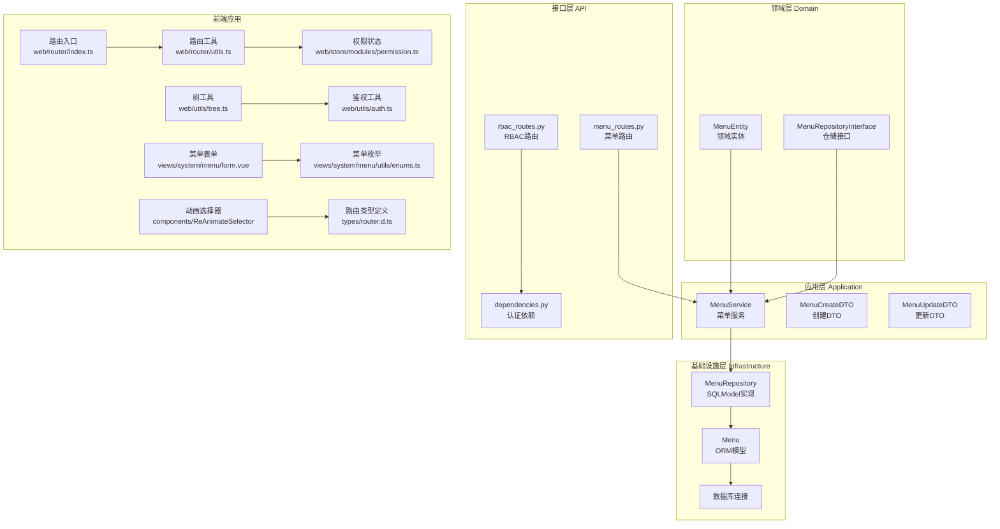
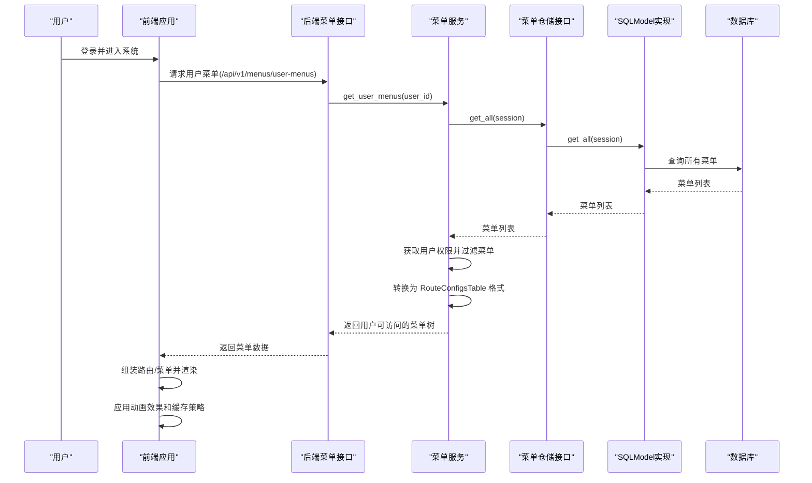
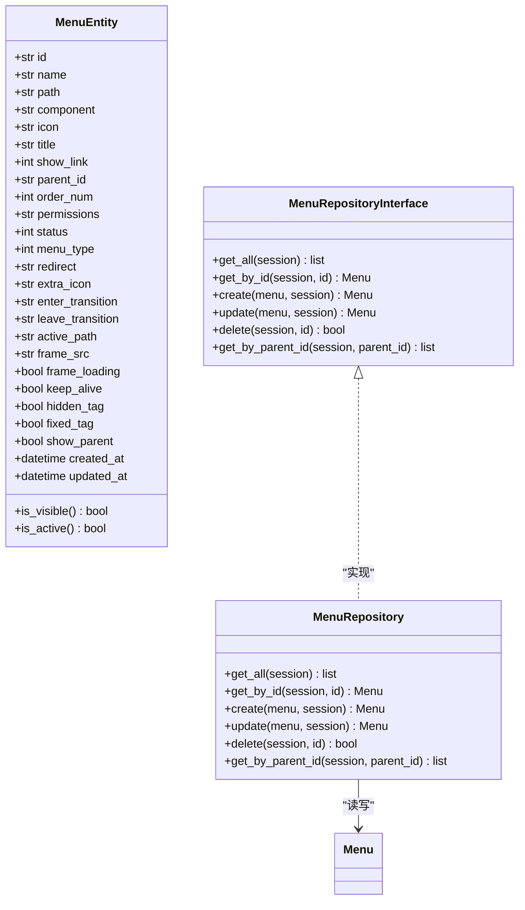
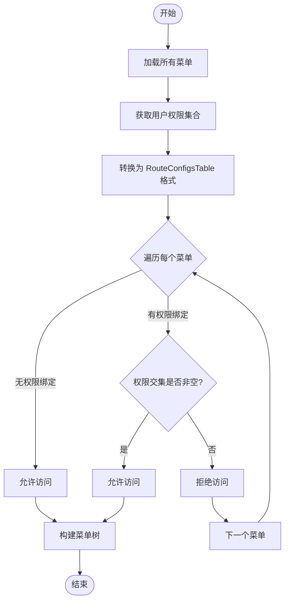
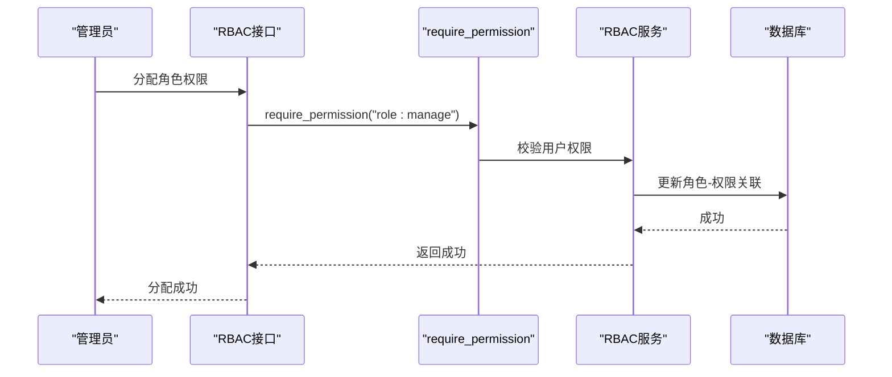
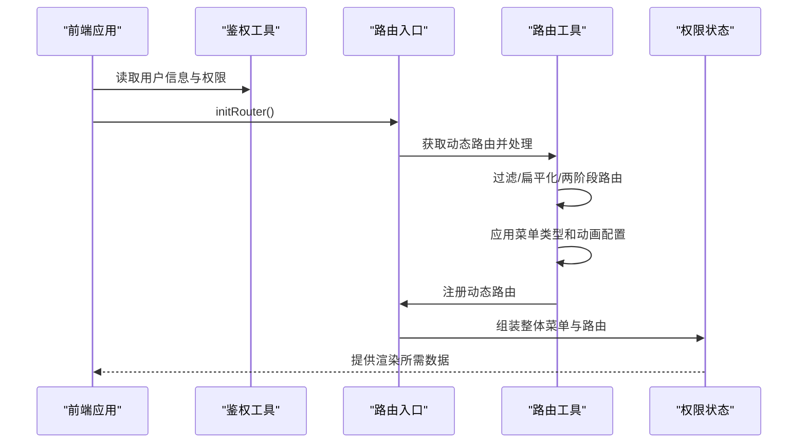
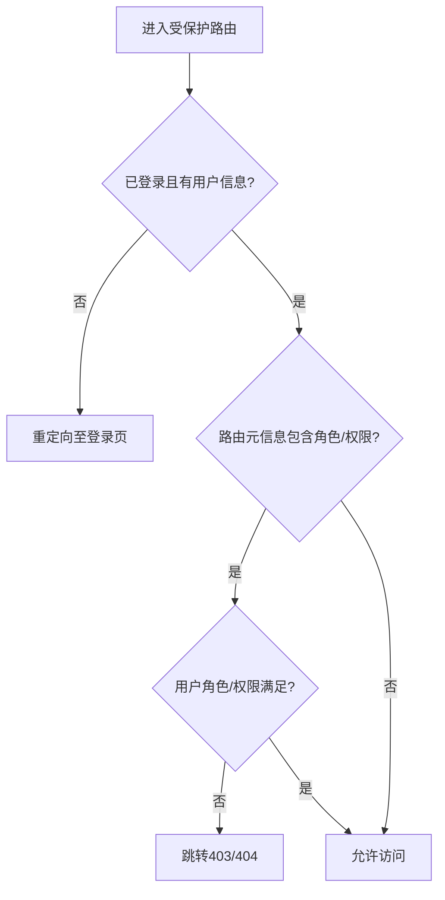
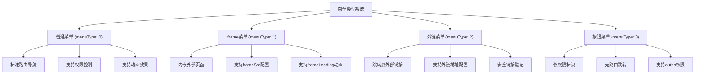
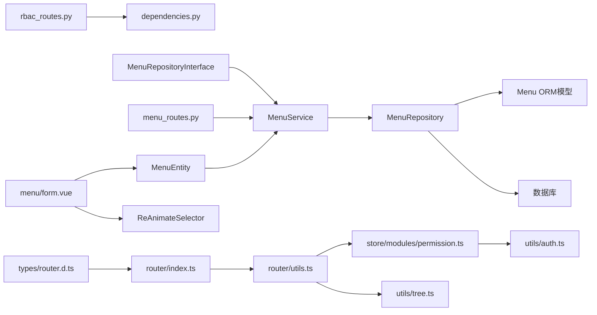
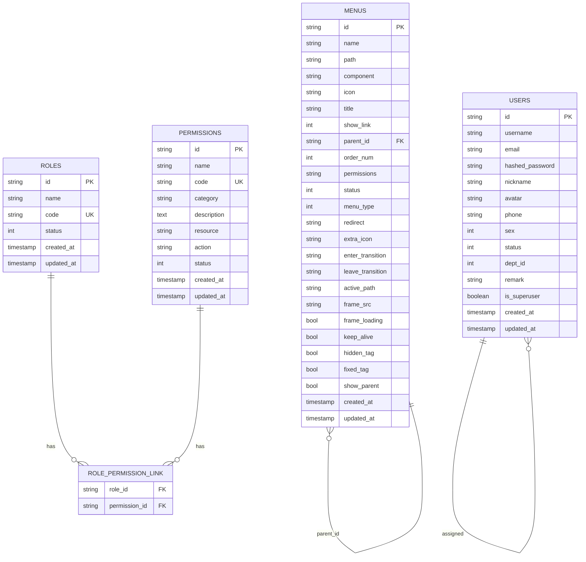

# 动态菜单生成

<cite>
**本文档引用的文件**
- [service/src/api/v1/menu_routes.py](file://service/src/api/v1/menu_routes.py)
- [service/src/application/services/menu_service.py](file://service/src/application/services/menu_service.py)
- [service/src/application/dto/menu_dto.py](file://service/src/application/dto/menu_dto.py)
- [service/src/domain/entities/menu.py](file://service/src/domain/entities/menu.py)
- [service/src/domain/repositories/menu_repository.py](file://service/src/domain/repositories/menu_repository.py)
- [service/src/infrastructure/repositories/menu_repository.py](file://service/src/infrastructure/repositories/menu_repository.py)
- [service/src/infrastructure/database/models.py](file://service/src/infrastructure/database/models.py)
- [service/src/api/v1/rbac_routes.py](file://service/src/api/v1/rbac_routes.py)
- [service/src/api/dependencies.py](file://service/src/api/dependencies.py)
- [service/src/infrastructure/cache/redis_client.py](file://service/src/infrastructure/cache/redis_client.py)
- [web/src/router/index.ts](file://web/src/router/index.ts)
- [web/src/router/utils.ts](file://web/src/router/utils.ts)
- [web/src/store/modules/permission.ts](file://web/src/store/modules/permission.ts)
- [web/src/utils/tree.ts](file://web/src/utils/tree.ts)
- [web/src/utils/auth.ts](file://web/src/utils/auth.ts)
- [web/src/views/system/menu/form.vue](file://web/src/views/system/menu/form.vue)
- [web/src/views/system/menu/utils/enums.ts](file://web/src/views/system/menu/utils/enums.ts)
- [web/src/layout/frame.vue](file://web/src/layout/frame.vue)
- [web/src/layout/components/lay-frame/index.vue](file://web/src/layout/components/lay-frame/index.vue)
- [web/mock/asyncRoutes.ts](file://web/mock/asyncRoutes.ts)
- [web/types/router.d.ts](file://web/types/router.d.ts)
- [web/src/components/ReAnimateSelector/src/animate.ts](file://web/src/components/ReAnimateSelector/src/animate.ts)
- [web/src/style/transition.scss](file://web/src/style/transition.scss)
</cite>

## 更新摘要
**所做更改**
- 菜单实体和仓储已迁移到新的domain结构中，实现领域驱动设计（DDD）
- 新增领域层实体MenuEntity，独立于基础设施层
- 新增领域仓储接口MenuRepositoryInterface，实现依赖倒置原则
- 更新菜单服务以使用新的领域实体和仓储接口
- 新增Pure Admin RouteConfigsTable规范支持
- 新增菜单类型枚举和路由配置结构
- 新增iframe支持和内嵌页面缓存机制
- 新增页面动画效果和过渡动画配置
- 新增标签页管理和页面缓存功能
- 新增按钮级权限和外链菜单支持
- 更新菜单数据模型以支持高级功能

## 目录
1. [简介](#简介)
2. [项目结构](#项目结构)
3. [核心组件](#核心组件)
4. [架构总览](#架构总览)
5. [详细组件分析](#详细组件分析)
6. [依赖分析](#依赖分析)
7. [性能考虑](#性能考虑)
8. [故障排查指南](#故障排查指南)
9. [结论](#结论)
10. [附录](#附录)

## 简介
本技术文档聚焦于"动态菜单生成"功能，系统性阐述基于权限的菜单树构建、权限过滤逻辑、数据模型与层级关系设计、前端菜单渲染与路由自动注册、权限验证与访问控制流程、最佳实践与性能优化策略、扩展性与自定义菜单项添加方法，以及菜单缓存与实时更新策略。**更新后的系统已完全重构以支持领域驱动设计（DDD）架构，菜单实体和仓储已迁移到新的domain结构中，包括新增的菜单类型、iframe支持、动画效果、页面缓存等高级功能。**

## 项目结构
动态菜单系统采用领域驱动设计（DDD）架构，由后端FastAPI服务与前端Vue应用协同完成，现已支持Pure Admin RouteConfigsTable规范：
- **领域层（Domain）**：包含MenuEntity领域实体，独立于基础设施层，定义业务核心逻辑
- **应用层（Application）**：包含MenuService业务服务，负责菜单树构建、用户菜单权限过滤、菜单CRUD业务逻辑
- **基础设施层（Infrastructure）**：包含SQLModel实现的MenuRepository仓储，负责数据持久化
- **接口层（API）**：包含菜单路由和RBAC路由，提供RESTful接口
- 前端负责静态路由与动态路由的组装、菜单渲染、权限过滤、路由注册与缓存策略

**图表来源**
- [service/src/domain/entities/menu.py:11-78](file://service/src/domain/entities/menu.py#L11-L78)
- [service/src/domain/repositories/menu_repository.py:11-90](file://service/src/domain/repositories/menu_repository.py#L11-L90)
- [service/src/application/services/menu_service.py:15-29](file://service/src/application/services/menu_service.py#L15-L29)
- [service/src/infrastructure/repositories/menu_repository.py:10-50](file://service/src/infrastructure/repositories/menu_repository.py#L10-L50)
- [service/src/infrastructure/database/models.py:203-299](file://service/src/infrastructure/database/models.py#L203-L299)
- [web/src/views/system/menu/form.vue:1-343](file://web/src/views/system/menu/form.vue#L1-L343)
- [web/src/views/system/menu/utils/enums.ts:1-109](file://web/src/views/system/menu/utils/enums.ts#L1-L109)
- [web/types/router.d.ts:1-111](file://web/types/router.d.ts#L1-L111)

**章节来源**
- [service/src/domain/entities/menu.py:1-78](file://service/src/domain/entities/menu.py#L1-L78)
- [service/src/application/services/menu_service.py:1-233](file://service/src/application/services/menu_service.py#L1-L233)
- [web/src/router/index.ts:1-230](file://web/src/router/index.ts#L1-L230)

## 核心组件
- **领域实体**：MenuEntity，使用dataclass实现，独立于任何ORM或外部库，定义菜单的业务属性和行为
- **仓储接口**：MenuRepositoryInterface，抽象菜单数据访问接口，遵循依赖倒置原则
- **仓储实现**：SQLModel实现的MenuRepository，实现具体的数据库操作
- **应用服务**：MenuService，负责菜单树构建、用户菜单权限过滤、菜单CRUD业务逻辑
- **数据传输对象**：MenuCreateDTO、MenuUpdateDTO、MenuResponseDTO，定义前后端数据交换格式
- **后端路由**：提供菜单树获取、用户菜单获取、菜单增删改查等接口
- **RBAC路由**：提供角色与权限管理接口，支撑菜单权限绑定
- **前端路由与权限**：负责静态/动态路由合并、菜单过滤、路由注册与缓存
- **新增** 菜单类型管理：支持四种菜单类型（普通菜单、iframe、外链、按钮）
- **新增** 动画效果系统：支持进场/离场动画、过渡动画配置
- **新增** 页面缓存系统：支持keep-alive缓存、iframe缓存管理
- **新增** 标签页管理系统：支持标签页固定、隐藏、缓存等功能

**章节来源**
- [service/src/domain/entities/menu.py:11-78](file://service/src/domain/entities/menu.py#L11-L78)
- [service/src/domain/repositories/menu_repository.py:11-90](file://service/src/domain/repositories/menu_repository.py#L11-L90)
- [service/src/application/services/menu_service.py:15-29](file://service/src/application/services/menu_service.py#L15-L29)
- [service/src/application/dto/menu_dto.py:8-122](file://service/src/application/dto/menu_dto.py#L8-L122)
- [web/src/views/system/menu/utils/enums.ts:3-20](file://web/src/views/system/menu/utils/enums.ts#L3-L20)
- [web/types/router.d.ts:14-35](file://web/types/router.d.ts#L14-L35)

## 架构总览
系统采用领域驱动设计（DDD）架构，后端以FastAPI + SQLModel + RBAC为核心，前端以Vue Router + Pinia + 工具函数实现动态菜单与路由自动注册。**更新后的系统完全支持Pure Admin RouteConfigsTable规范，具备菜单类型、动画效果、页面缓存等高级功能。** 权限验证贯穿前后端，确保菜单可见性与路由可达性一致。

**图表来源**
- [service/src/api/v1/menu_routes.py:43-47](file://service/src/api/v1/menu_routes.py#L43-L47)
- [service/src/application/services/menu_service.py:35-58](file://service/src/application/services/menu_service.py#L35-L58)
- [service/src/domain/repositories/menu_repository.py:14-24](file://service/src/domain/repositories/menu_repository.py#L14-L24)
- [service/src/infrastructure/repositories/menu_repository.py:13-16](file://service/src/infrastructure/repositories/menu_repository.py#L13-L16)
- [web/src/router/utils.ts:199-235](file://web/src/router/utils.ts#L199-L235)

## 详细组件分析

### 领域层实体与仓储接口
**更新** 菜单实体和仓储已完全迁移到新的domain结构中，实现领域驱动设计（DDD）：

- **MenuEntity领域实体**：使用dataclass实现，独立于任何ORM或外部库，包含所有菜单业务属性：
  - 基本属性：id、name、path、component、icon、title、show_link、parent_id、order_num、permissions、status
  - Pure Admin扩展属性：menu_type、redirect、extra_icon、enter_transition、leave_transition、active_path、frame_src、frame_loading、keep_alive、hidden_tag、fixed_tag、show_parent
  - 业务方法：is_visible、is_active属性，简化权限判断

- **MenuRepositoryInterface仓储接口**：抽象菜单数据访问接口，遵循依赖倒置原则：
  - 定义标准的CRUD操作：get_all、get_by_id、create、update、delete、get_by_parent_id
  - 使用Any类型作为过渡方案，因为上层代码仍大量使用ORM模型属性
  - 保证应用层不直接依赖具体实现

**图表来源**
- [service/src/domain/entities/menu.py:11-78](file://service/src/domain/entities/menu.py#L11-L78)
- [service/src/domain/repositories/menu_repository.py:11-90](file://service/src/domain/repositories/menu_repository.py#L11-L90)
- [service/src/infrastructure/repositories/menu_repository.py:10-50](file://service/src/infrastructure/repositories/menu_repository.py#L10-L50)

**章节来源**
- [service/src/domain/entities/menu.py:11-78](file://service/src/domain/entities/menu.py#L11-L78)
- [service/src/domain/repositories/menu_repository.py:11-90](file://service/src/domain/repositories/menu_repository.py#L11-L90)

### 应用层服务与数据传输对象
- **MenuService应用服务**：负责菜单树构建、用户菜单权限过滤、菜单CRUD业务逻辑
  - 获取完整菜单树：从仓储接口读取并递归构建树形结构
  - 获取用户可访问菜单：结合用户权限集合进行过滤，超级用户返回全量
  - 菜单CRUD：包含父子关系校验、循环引用检测、权限编码存储等
  - 转换为Pure Admin格式：将ORM模型转换为前端所需的RouteConfigsTable格式

- **MenuCreateDTO/MenuUpdateDTO**：定义菜单创建/更新的数据结构，保证前后端一致性
  - 包含所有Pure Admin扩展字段：menuType、redirect、extraIcon、enterTransition、leaveTransition、activePath、frameSrc、frameLoading、keepAlive、hiddenTag、fixedTag、showParent
  - 字段验证：空字符串转换为None、父ID标准化处理

- **MenuResponseDTO**：定义菜单响应的数据结构，支持嵌套子菜单

**章节来源**
- [service/src/application/services/menu_service.py:15-233](file://service/src/application/services/menu_service.py#L15-L233)
- [service/src/application/dto/menu_dto.py:8-122](file://service/src/application/dto/menu_dto.py#L8-L122)

### 权限过滤与菜单树构建
- **用户菜单过滤**：服务层获取用户权限集合，与菜单的权限编码进行集合交集判断，未绑定权限的菜单默认放行
- **菜单树构建**：通过递归遍历，依据parent_id构建层级树，支持任意层级深度
- **超级用户放行**：超级用户绕过权限校验，直接返回全量菜单树
- **RouteConfigsTable转换**：将菜单模型转换为Pure Admin RouteConfigsTable格式，包含完整的路由配置信息

**图表来源**
- [service/src/application/services/menu_service.py:35-58](file://service/src/application/services/menu_service.py#L35-L58)
- [service/src/application/services/menu_service.py:203-233](file://service/src/application/services/menu_service.py#L203-L233)

**章节来源**
- [service/src/application/services/menu_service.py:35-58](file://service/src/application/services/menu_service.py#L35-L58)
- [service/src/application/services/menu_service.py:203-233](file://service/src/application/services/menu_service.py#L203-L233)

### RBAC权限与角色管理
- **RBAC路由**：提供角色与权限的增删改查、角色权限分配等接口，支撑菜单权限绑定
- **依赖注入**：require_permission在路由层强制权限校验，超级用户豁免
- **权限验证**：后端路由使用"menu:view"、"menu:add"、"menu:edit"、"menu:delete"等权限码

**图表来源**
- [service/src/api/v1/rbac_routes.py:154-177](file://service/src/api/v1/rbac_routes.py#L154-L177)
- [service/src/api/dependencies.py:45-61](file://service/src/api/dependencies.py#L45-L61)

**章节来源**
- [service/src/api/v1/rbac_routes.py:33-257](file://service/src/api/v1/rbac_routes.py#L33-L257)
- [service/src/api/dependencies.py:45-61](file://service/src/api/dependencies.py#L45-L61)

### 前端路由自动注册与菜单渲染
- **静态路由**：通过模块扫描自动导入，保持原始层级用于菜单渲染
- **动态路由**：登录后拉取后端返回的菜单树，经工具函数处理后注册到路由表
- **权限过滤**：前端根据用户角色/权限再次过滤，确保菜单与路由一致
- **菜单树工具**：提供层级构建、唯一ID、查找节点等通用能力
- **RouteConfigsTable支持**：完全兼容Pure Admin RouteConfigsTable规范
- **菜单类型渲染**：根据menu_type渲染不同类型的菜单项

**图表来源**
- [web/src/router/index.ts:52-116](file://web/src/router/index.ts#L52-L116)
- [web/src/router/utils.ts:199-235](file://web/src/router/utils.ts#L199-L235)
- [web/src/store/modules/permission.ts:26-34](file://web/src/store/modules/permission.ts#L26-L34)
- [web/src/utils/tree.ts:56-72](file://web/src/utils/tree.ts#L56-L72)

**章节来源**
- [web/src/router/index.ts:52-116](file://web/src/router/index.ts#L52-L116)
- [web/src/router/utils.ts:199-235](file://web/src/router/utils.ts#L199-L235)
- [web/src/store/modules/permission.ts:26-34](file://web/src/store/modules/permission.ts#L26-L34)
- [web/src/utils/tree.ts:56-72](file://web/src/utils/tree.ts#L56-L72)

### 菜单权限验证与访问控制
- **后端**：require_permission依赖在路由层校验权限，超级用户豁免；用户菜单接口仅需"菜单查看"权限
- **前端**：hasPerms与hasAuth支持按钮级与路由级权限判断；路由守卫在beforeEach中拦截并跳转错误页或重定向
- **菜单类型权限**：不同菜单类型有不同的权限验证逻辑

**图表来源**
- [service/src/api/dependencies.py:45-61](file://service/src/api/dependencies.py#L45-L61)
- [web/src/router/index.ts:123-222](file://web/src/router/index.ts#L123-L222)
- [web/src/utils/auth.ts:131-142](file://web/src/utils/auth.ts#L131-L142)

**章节来源**
- [service/src/api/dependencies.py:45-61](file://service/src/api/dependencies.py#L45-L61)
- [web/src/router/index.ts:123-222](file://web/src/router/index.ts#L123-L222)
- [web/src/utils/auth.ts:131-142](file://web/src/utils/auth.ts#L131-L142)

### 菜单配置最佳实践
- **菜单层级**：建议不超过3-4级，避免导航复杂度上升
- **权限绑定**：菜单尽量与具体资源/动作权限一一对应，便于精细化控制
- **排序与状态**：统一使用order_num排序，status控制启用/禁用
- **组件路径**：动态路由的component与path保持一致或显式映射，减少运行时解析成本
- **菜单名称**：使用国际化键值，配合前端i18n统一管理
- **菜单类型选择**：根据实际需求选择合适的菜单类型
- **动画效果配置**：合理使用进场/离场动画提升用户体验
- **页面缓存策略**：根据页面重要性和使用频率配置缓存

**章节来源**
- [service/src/infrastructure/database/models.py:208-233](file://service/src/infrastructure/database/models.py#L208-233)
- [service/src/application/dto/menu_dto.py:19-38](file://service/src/application/dto/menu_dto.py#L19-38)
- [web/src/router/utils.ts:317-343](file://web/src/router/utils.ts#L317-L343)
- [web/src/views/system/menu/utils/enums.ts:3-20](file://web/src/views/system/menu/utils/enums.ts#L3-L20)

### 扩展性与自定义菜单项
- **新增菜单**：通过菜单创建接口提交MenuCreateDTO，若需权限控制则填写permissions
- **自定义渲染**：可在前端菜单组件中扩展图标、标题、外链等字段，保持与后端响应一致
- **动态模块**：新增路由模块后，前端会自动扫描导入，无需手动维护路由清单
- **菜单类型扩展**：支持新的菜单类型，如iframe、外链、按钮等
- **动画效果扩展**：支持更多的动画效果和过渡动画

**章节来源**
- [service/src/api/v1/menu_routes.py:50-57](file://service/src/api/v1/menu_routes.py#L50-L57)
- [service/src/application/dto/menu_dto.py:8-45](file://service/src/application/dto/menu_dto.py#L8-45)
- [web/src/router/index.ts:45-57](file://web/src/router/index.ts#L45-L57)
- [web/src/views/system/menu/form.vue:66-72](file://web/src/views/system/menu/form.vue#L66-L72)

### 菜单缓存机制与实时更新
- **前端缓存**：动态路由可缓存至localStorage，避免重复拉取；切换用户或刷新页面时可清空缓存
- **后端缓存**：当前代码未见菜单树缓存实现，建议在高频场景引入Redis缓存，结合权限变更事件失效
- **实时更新**：权限变更后，前端可主动清空缓存并重新拉取菜单；后端可提供增量更新接口以降低全量刷新成本
- **iframe缓存**：支持iframe页面的缓存管理，提高页面加载速度
- **页面缓存**：支持keep-alive缓存，减少页面切换时的重新渲染开销

**章节来源**
- [web/src/router/utils.ts:200-235](file://web/src/router/utils.ts#L200-L235)
- [service/src/infrastructure/cache/redis_client.py:10-24](file://service/src/infrastructure/cache/redis_client.py#L10-L24)
- [web/src/layout/components/lay-frame/index.vue:42-79](file://web/src/layout/components/lay-frame/index.vue#L42-L79)

### 菜单类型与高级功能

#### 菜单类型系统
系统支持四种菜单类型，每种类型都有特定的功能和配置：

**图表来源**
- [web/src/views/system/menu/utils/enums.ts:3-20](file://web/src/views/system/menu/utils/enums.ts#L3-L20)
- [service/src/application/dto/menu_dto.py:19-38](file://service/src/application/dto/menu_dto.py#L19-38)

#### 动画效果系统
系统提供丰富的动画效果配置：

- **进场动画 (enterTransition)**：页面进入时的动画效果
- **离场动画 (leaveTransition)**：页面离开时的动画效果  
- **过渡动画**：支持animate.css动画库
- **内置动画库**：包含bounce、fadeIn、slideIn、zoomIn等114种动画效果

**章节来源**
- [web/src/views/system/menu/form.vue:192-207](file://web/src/views/system/menu/form.vue#L192-L207)
- [web/src/components/ReAnimateSelector/src/animate.ts:1-114](file://web/src/components/ReAnimateSelector/src/animate.ts#L1-L114)
- [web/src/style/transition.scss:1-54](file://web/src/style/transition.scss#L1-L54)

#### 页面缓存系统
系统提供多层次的页面缓存支持：

- **keepAlive缓存**：Vue的keep-alive缓存机制
- **iframe缓存**：iframe页面的状态缓存
- **标签页缓存**：多标签页的页面状态管理
- **缓存策略**：根据页面重要性和使用频率配置缓存

**章节来源**
- [web/src/views/system/menu/form.vue:300-312](file://web/src/views/system/menu/form.vue#L300-L312)
- [web/src/layout/frame.vue:53-82](file://web/src/layout/frame.vue#L53-L82)
- [web/src/layout/components/lay-frame/index.vue:42-79](file://web/src/layout/components/lay-frame/index.vue#L42-L79)

## 依赖分析
**更新** 依赖关系已完全重构以支持领域驱动设计（DDD）：

- **领域层依赖**：MenuEntity独立于任何外部库，MenuRepositoryInterface定义抽象契约
- **应用层依赖**：MenuService依赖仓储接口而非具体实现，遵循依赖倒置原则
- **基础设施层依赖**：MenuRepository实现仓储接口，依赖SQLModel ORM模型
- **后端依赖关系**：API层依赖服务层，服务层依赖仓储接口与数据库模型；RBAC路由与认证依赖共同保障权限校验
- **前端依赖关系**：路由入口依赖工具函数与权限状态；工具函数依赖树工具与鉴权工具；权限状态依赖路由与标签页状态
- **类型系统依赖**：完全支持RouteConfigsTable类型定义，确保类型安全

**图表来源**
- [service/src/domain/entities/menu.py:11-78](file://service/src/domain/entities/menu.py#L11-L78)
- [service/src/domain/repositories/menu_repository.py:11-90](file://service/src/domain/repositories/menu_repository.py#L11-L90)
- [service/src/application/services/menu_service.py:15-29](file://service/src/application/services/menu_service.py#L15-L29)
- [service/src/infrastructure/repositories/menu_repository.py:10-50](file://service/src/infrastructure/repositories/menu_repository.py#L10-L50)
- [service/src/infrastructure/database/models.py:203-299](file://service/src/infrastructure/database/models.py#L203-L299)
- [service/src/api/v1/menu_routes.py:1-72](file://service/src/api/v1/menu_routes.py#L1-L72)
- [service/src/api/dependencies.py:1-72](file://service/src/api/dependencies.py#L1-L72)
- [service/src/api/v1/rbac_routes.py:1-257](file://service/src/api/v1/rbac_routes.py#L1-L257)
- [web/src/router/index.ts:1-230](file://web/src/router/index.ts#L1-L230)
- [web/src/router/utils.ts:1-424](file://web/src/router/utils.ts#L1-L424)
- [web/src/store/modules/permission.ts:1-76](file://web/src/store/modules/permission.ts#L1-L76)
- [web/src/utils/tree.ts:1-189](file://web/src/utils/tree.ts#L1-L189)
- [web/src/utils/auth.ts:1-142](file://web/src/utils/auth.ts#L1-L142)
- [web/src/views/system/menu/form.vue:1-343](file://web/src/views/system/menu/form.vue#L1-L343)
- [web/src/views/system/menu/utils/enums.ts:1-109](file://web/src/views/system/menu/utils/enums.ts#L1-L109)
- [web/types/router.d.ts:1-111](file://web/types/router.d.ts#L1-L111)

**章节来源**
- [service/src/domain/entities/menu.py:1-78](file://service/src/domain/entities/menu.py#L1-L78)
- [service/src/application/services/menu_service.py:1-233](file://service/src/application/services/menu_service.py#L1-L233)
- [web/src/router/index.ts:1-230](file://web/src/router/index.ts#L1-L230)

## 性能考虑
- **数据库查询**：菜单查询按order_num排序，建议在parent_id与order_num上建立复合索引以提升构建树效率
- **权限过滤**：用户权限集合与菜单权限集合交集计算为O(n)级别，建议在前端对权限集合去重并使用Set提高查找效率
- **前端渲染**：动态路由注册采用扁平化与两阶段路由处理，减少深层嵌套带来的渲染压力
- **缓存策略**：高频场景建议引入Redis缓存菜单树，结合权限变更事件失效，避免重复构建树与权限过滤
- **领域层优化**：MenuEntity使用dataclass，内存占用更少，属性访问更快
- **依赖倒置**：应用层不依赖具体实现，便于单元测试和性能优化
- **动画性能**：合理使用动画效果，避免过多复杂的动画影响页面性能
- **缓存优化**：iframe缓存和页面缓存策略需要平衡内存占用和加载速度

## 故障排查指南
- **菜单无法显示**：检查用户权限是否包含菜单权限编码；确认菜单status是否启用；确认前端hasPerms/hasAuth判断逻辑
- **路由无法跳转**：检查路由元信息roles/meta.auths是否正确；确认路由守卫是否拦截；检查动态路由是否已注册
- **菜单循环引用**：创建/更新菜单时若出现"不能设置为自己的子菜单/后代"错误，需调整父子关系
- **登录后菜单空白**：确认initRouter是否成功拉取并处理动态路由；检查localStorage缓存是否过期
- **领域层问题**：MenuEntity属性访问异常，检查dataclass字段定义；确认MenuRepositoryInterface方法签名
- **仓储实现问题**：MenuRepository方法调用失败，检查SQLModel会话管理；确认数据库连接状态
- **菜单类型异常**：检查menuType配置是否正确；确认对应字段配置是否完整
- **动画效果问题**：检查动画名称是否在支持列表中；确认动画CSS文件是否正确加载
- **iframe加载问题**：检查frameSrc地址是否有效；确认跨域设置和安全策略

**章节来源**
- [service/src/application/services/menu_service.py:169-181](file://service/src/application/services/menu_service.py#L169-L181)
- [service/src/domain/entities/menu.py:69-78](file://service/src/domain/entities/menu.py#L69-L78)
- [service/src/infrastructure/repositories/menu_repository.py:36-43](file://service/src/infrastructure/repositories/menu_repository.py#L36-L43)
- [web/src/router/index.ts:173-208](file://web/src/router/index.ts#L173-L208)
- [web/src/router/utils.ts:199-235](file://web/src/router/utils.ts#L199-L235)

## 结论
该动态菜单系统通过"领域驱动设计（DDD）+ 后端权限过滤 + 前端路由注册"的三层保障，实现了灵活、可扩展、可维护的菜单与权限体系。**更新后的系统完全支持Pure Admin RouteConfigsTable规范，菜单实体和仓储已迁移到新的domain结构中，新增了菜单类型、iframe支持、动画效果、页面缓存等高级功能，显著提升了系统的灵活性和用户体验。** 建议在生产环境中引入后端缓存与增量更新机制，持续优化权限过滤与前端渲染性能，以满足大规模用户与复杂权限场景的需求。

## 附录
- **菜单数据模型ER图**

**图表来源**
- [service/src/infrastructure/database/models.py:208-233](file://service/src/infrastructure/database/models.py#L208-233)