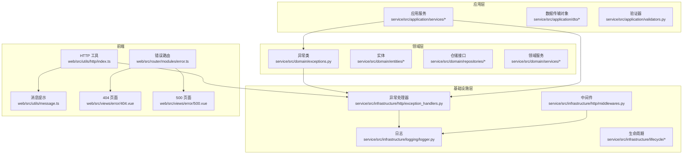
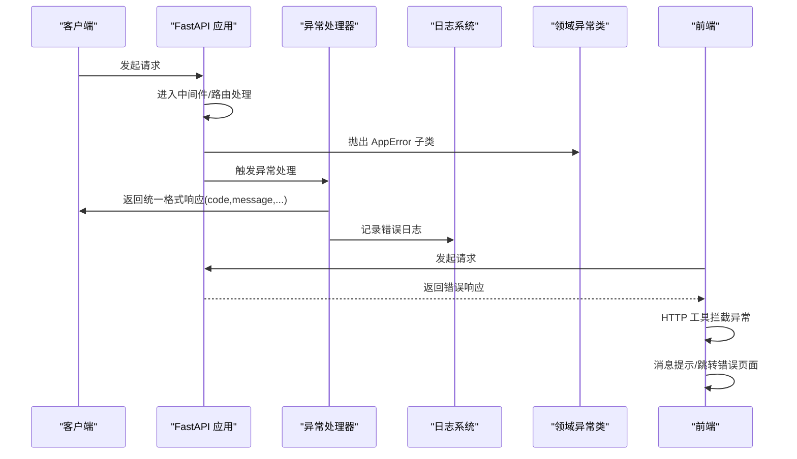
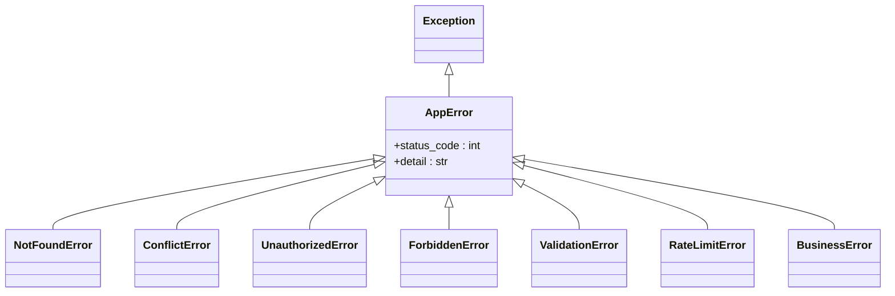
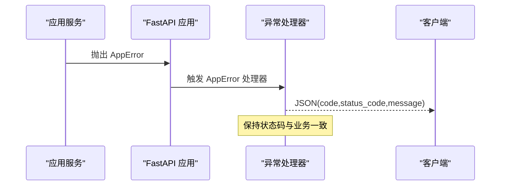
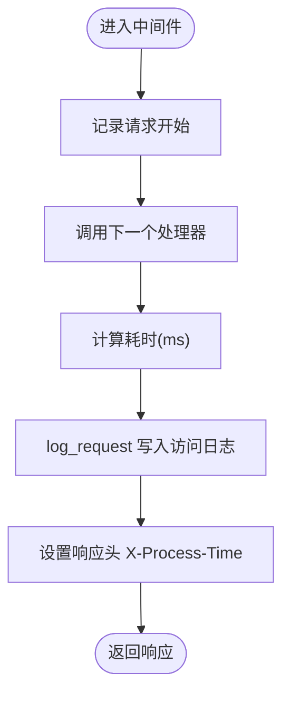
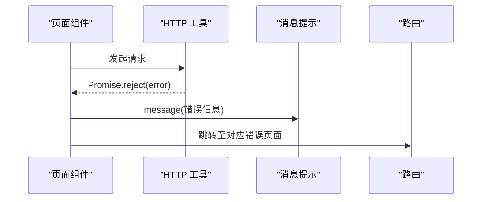
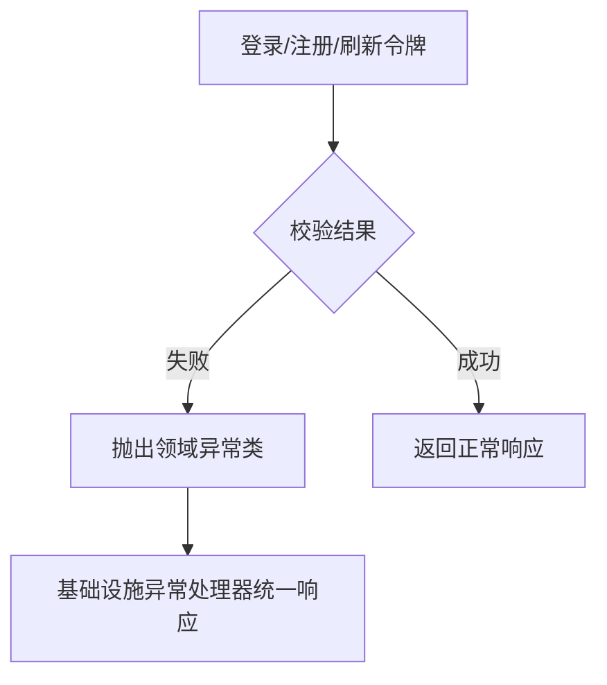
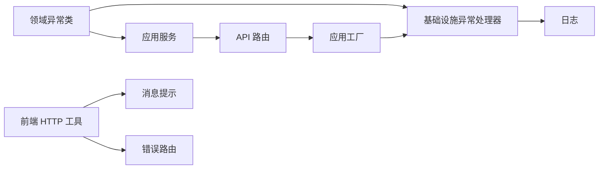

# 异常处理

<cite>
**本文引用的文件**
- [service/src/domain/exceptions.py](file://service/src/domain/exceptions.py)
- [service/src/infrastructure/http/exception_handlers.py](file://service/src/infrastructure/http/exception_handlers.py)
- [service/src/infrastructure/http/middlewares.py](file://service/src/infrastructure/http/middlewares.py)
- [service/src/infrastructure/logging/logger.py](file://service/src/infrastructure/logging/logger.py)
- [service/src/main.py](file://service/src/main.py)
- [service/src/config/settings.py](file://service/src/config/settings.py)
- [service/src/application/services/auth_service.py](file://service/src/application/services/auth_service.py)
- [web/src/utils/http/index.ts](file://web/src/utils/http/index.ts)
- [web/src/utils/message.ts](file://web/src/utils/message.ts)
- [web/src/views/error/404.vue](file://web/src/views/error/404.vue)
- [web/src/views/error/500.vue](file://web/src/views/error/500.vue)
- [web/src/router/modules/error.ts](file://web/src/router/modules/error.ts)
</cite>

## 更新摘要
**所做更改**
- 更新异常处理系统架构：从 `src/core/exceptions.py` 重构为 `src/domain/exceptions.py`
- 新增完整的异常类体系，包括基础异常类和各类业务异常
- 更新异常处理器注册机制，采用基础设施层的异常处理模块
- 重新组织异常处理组件的层次结构，体现领域驱动设计原则

## 目录
1. [简介](#简介)
2. [项目结构](#项目结构)
3. [核心组件](#核心组件)
4. [架构总览](#架构总览)
5. [详细组件分析](#详细组件分析)
6. [依赖分析](#依赖分析)
7. [性能考量](#性能考量)
8. [故障排查指南](#故障排查指南)
9. [结论](#结论)
10. [附录](#附录)

## 简介
本技术文档围绕后端 FastAPI 异常处理系统与前端错误提示体系进行深入解析，涵盖以下主题：
- 全局异常捕获机制与自定义异常类设计
- HTTP 异常、业务异常与系统异常的分类与处理策略
- 异常中间件工作原理与异常信息统一格式化
- 前端错误提示与用户友好消息设计
- 异常日志记录与调试信息收集
- 异常处理最佳实践与性能优化
- 异常系统的扩展性与新异常类型的添加方法
- 开发环境与生产环境的异常处理差异

**更新** 本版本反映了异常处理系统的重构，从核心层迁移至领域层，体现了更清晰的分层架构和DDD设计原则。

## 项目结构
后端异常处理相关代码主要分布在 domain 子模块（异常类定义）、基础设施层（异常处理器、中间件、日志）、应用服务层（业务异常抛出）、API 路由层（统一响应封装），以及前端 web 工程的 HTTP 工具与错误页面。

**图表来源**
- [service/src/domain/exceptions.py:1-62](file://service/src/domain/exceptions.py#L1-L62)
- [service/src/infrastructure/http/exception_handlers.py:1-28](file://service/src/infrastructure/http/exception_handlers.py#L1-L28)
- [service/src/infrastructure/http/middlewares.py:1-59](file://service/src/infrastructure/http/middlewares.py#L1-L59)
- [service/src/infrastructure/logging/logger.py:1-90](file://service/src/infrastructure/logging/logger.py#L1-L90)
- [service/src/application/services/auth_service.py:1-151](file://service/src/application/services/auth_service.py#L1-L151)

**章节来源**
- [service/src/main.py:19-43](file://service/src/main.py#L19-L43)
- [service/src/domain/exceptions.py:1-62](file://service/src/domain/exceptions.py#L1-L62)
- [service/src/infrastructure/http/exception_handlers.py:13-28](file://service/src/infrastructure/http/exception_handlers.py#L13-L28)
- [service/src/infrastructure/http/middlewares.py:12-59](file://service/src/infrastructure/http/middlewares.py#L12-L59)
- [service/src/infrastructure/logging/logger.py:1-90](file://service/src/infrastructure/logging/logger.py#L1-L90)

## 核心组件
- **领域异常类**：基于基础异常类 AppError，定义了资源未找到、权限不足、认证失败、业务逻辑错误等完整的异常体系，便于跨层使用。
- **全局异常处理器**：在基础设施层注册，对 AppError、参数校验错误与通用异常进行格式化响应。
- **请求日志中间件**：记录请求开始/结束、耗时、状态码、客户端 IP，并统一写入访问日志。
- **日志系统**：使用 loguru，分别输出应用日志、错误日志与访问日志，支持轮转与诊断信息。
- **配置系统**：按环境加载不同日志级别、调试开关等，影响异常处理与日志输出行为。
- **前端 HTTP 工具**：Axios 封装，拦截响应异常并统一处理；消息提示组件用于用户反馈；错误路由与页面负责展示 403/404/500。

**更新** 异常类现在位于领域层，体现了DDD设计原则，异常定义与Web框架解耦，提高了代码的可维护性和可测试性。

**章节来源**
- [service/src/domain/exceptions.py:6-62](file://service/src/domain/exceptions.py#L6-L62)
- [service/src/infrastructure/http/exception_handlers.py:13-28](file://service/src/infrastructure/http/exception_handlers.py#L13-L28)
- [service/src/infrastructure/http/middlewares.py:12-59](file://service/src/infrastructure/http/middlewares.py#L12-L59)
- [service/src/infrastructure/logging/logger.py:24-53](file://service/src/infrastructure/logging/logger.py#L24-L53)
- [service/src/config/settings.py:110-188](file://service/src/config/settings.py#L110-L188)

## 架构总览
后端异常处理采用"领域异常类 + 基础设施异常处理器 + 中间件 + 日志"的组合模式；前端通过 HTTP 工具统一拦截异常并结合消息提示与错误页面向用户反馈。

**图表来源**
- [service/src/infrastructure/http/exception_handlers.py:16-27](file://service/src/infrastructure/http/exception_handlers.py#L16-L27)
- [service/src/infrastructure/logging/logger.py:24-53](file://service/src/infrastructure/logging/logger.py#L24-L53)
- [service/src/domain/exceptions.py:6-62](file://service/src/domain/exceptions.py#L6-L62)

## 详细组件分析

### 领域异常类设计
- **基础异常类 AppError**：继承 Python 内置 Exception，统一构造参数（状态码、详情），便于跨层使用。
- **具体异常类型**：
  - 资源相关：NotFoundError（404）、ConflictError（409）
  - 认证授权：UnauthorizedError（401）、ForbiddenError（403）
  - 验证错误：ValidationError（422）
  - 业务逻辑：BusinessError（400）
  - 系统限制：RateLimitError（429）
- **设计要点**：
  - 明确异常语义与HTTP状态码映射
  - 保持 detail 可读性，便于前端友好展示
  - 与基础设施层异常处理器配合，实现统一响应结构

**图表来源**
- [service/src/domain/exceptions.py:6-62](file://service/src/domain/exceptions.py#L6-L62)

**章节来源**
- [service/src/domain/exceptions.py:6-62](file://service/src/domain/exceptions.py#L6-L62)

### 全局异常处理与统一响应
- **AppError 处理器**：返回包含 code 与 message 的 JSON 响应，状态码来自异常实例。
- **参数校验错误处理器**：针对 RequestValidationError，返回 code=422、message 与 errors 列表。
- **通用异常处理器**：捕获未处理异常，记录错误日志并返回 500 响应。
- **统一响应格式**：code、message 字段，必要时携带 errors（参数校验）。

**图表来源**
- [service/src/infrastructure/http/exception_handlers.py:16-27](file://service/src/infrastructure/http/exception_handlers.py#L16-L27)

**章节来源**
- [service/src/infrastructure/http/exception_handlers.py:13-28](file://service/src/infrastructure/http/exception_handlers.py#L13-L28)

### 异常中间件与请求日志
- **RequestLoggingMiddleware**：
  - 记录请求开始与结束、耗时（毫秒）、状态码、客户端 IP
  - 将处理时间写入响应头 X-Process-Time
  - 通过 log_request 写入访问日志
- **IPFilterMiddleware**：
  - 支持白名单/黑名单控制，命中时返回 403 JSON

**图表来源**
- [service/src/infrastructure/http/middlewares.py:15-33](file://service/src/infrastructure/http/middlewares.py#L15-L33)
- [service/src/infrastructure/logging/logger.py:42-52](file://service/src/infrastructure/logging/logger.py#L42-L52)

**章节来源**
- [service/src/infrastructure/http/middlewares.py:12-59](file://service/src/infrastructure/http/middlewares.py#L12-L59)
- [service/src/infrastructure/logging/logger.py:42-53](file://service/src/infrastructure/logging/logger.py#L42-L53)

### 日志系统与调试信息
- **控制台输出**：彩色格式，包含时间、级别、模块与行号
- **应用程序日志**：DEBUG 及以上，按大小轮转、保留 30 天
- **错误日志**：仅 ERROR，带 backtrace 与 diagnose，保留更久
- **访问日志**：过滤 type=access 的记录，记录客户端 IP、方法、路径、状态码、耗时
- **启动/关闭日志**：记录应用启动/关闭信息，包含环境、调试模式、日志级别等

**章节来源**
- [service/src/infrastructure/logging/logger.py:24-87](file://service/src/infrastructure/logging/logger.py#L24-L87)
- [service/src/config/settings.py:110-188](file://service/src/config/settings.py#L110-L188)

### 前端错误提示与用户友好消息
- **HTTP 工具（Axios 封装）**：
  - 响应拦截器：默认透传 response.data，异常时返回 Promise.reject，便于上层统一处理
  - 与消息提示组件配合，展示错误信息
- **消息提示组件**：支持多种类型、位置、时长、图标等配置
- **错误页面与路由**：
  - 错误路由模块定义 403/404/500 路由
  - 对应视图组件展示用户可理解的提示文案与返回首页按钮

**图表来源**
- [web/src/utils/http/index.ts:124-148](file://web/src/utils/http/index.ts#L124-L148)
- [web/src/utils/message.ts:49-93](file://web/src/utils/message.ts#L49-L93)
- [web/src/router/modules/error.ts:1-39](file://web/src/router/modules/error.ts#L1-L39)

**章节来源**
- [web/src/utils/http/index.ts:124-148](file://web/src/utils/http/index.ts#L124-L148)
- [web/src/utils/message.ts:49-93](file://web/src/utils/message.ts#L49-L93)
- [web/src/router/modules/error.ts:1-39](file://web/src/router/modules/error.ts#L1-L39)

### 异常分类与处理策略
- **资源异常**（404/409）：资源未找到、资源已存在
- **认证授权异常**（401/403）：认证失败、权限不足
- **验证异常**（422）：参数验证失败
- **业务异常**（400）：业务规则违反
- **系统异常**（500）：未捕获异常，统一返回内部错误
- **处理策略**：
  - 明确状态码与 message，必要时携带 errors
  - 严格区分业务异常与系统异常，避免泄露敏感信息
  - 在开发环境可输出更多诊断信息，在生产环境收敛细节

**章节来源**
- [service/src/domain/exceptions.py:15-61](file://service/src/domain/exceptions.py#L15-L61)
- [service/src/infrastructure/http/exception_handlers.py:16-27](file://service/src/infrastructure/http/exception_handlers.py#L16-L27)

### 业务异常示例与触发点
- **认证服务中**：
  - 用户名/密码错误或用户被禁用 → UnauthorizedError
  - 用户名已存在 → BusinessError
  - 刷新令牌无效或用户不存在/被禁用 → UnauthorizedError
- **业务异常通过 raise 抛出**，最终由基础设施层异常处理器统一格式化响应

**图表来源**
- [service/src/application/services/auth_service.py:48-151](file://service/src/application/services/auth_service.py#L48-L151)
- [service/src/domain/exceptions.py:29-61](file://service/src/domain/exceptions.py#L29-L61)
- [service/src/infrastructure/http/exception_handlers.py:16-18](file://service/src/infrastructure/http/exception_handlers.py#L16-L18)

**章节来源**
- [service/src/application/services/auth_service.py:39-151](file://service/src/application/services/auth_service.py#L39-L151)

### 开发与生产环境差异
- **日志级别**：
  - 开发：DEBUG，便于调试
  - 生产：WARNING，减少噪声
- **调试模式**：
  - 开发：DEBUG=True
  - 生产：DEBUG=False
- **影响**：
  - 日志输出粒度与敏感信息展示
  - 异常堆栈与诊断信息的可见性

**章节来源**
- [service/src/config/settings.py:110-188](file://service/src/config/settings.py#L110-L188)

## 依赖分析
- **应用服务层**依赖领域异常类，抛出业务异常
- **基础设施层**注册异常处理器与中间件，依赖日志模块
- **主应用工厂**导入基础设施层组件，建立完整的异常处理链路
- **前端 HTTP 工具**依赖消息提示组件与路由，统一处理异常

**图表来源**
- [service/src/domain/exceptions.py:6-62](file://service/src/domain/exceptions.py#L6-L62)
- [service/src/application/services/auth_service.py:9](file://service/src/application/services/auth_service.py#L9)
- [service/src/infrastructure/http/exception_handlers.py:9](file://service/src/infrastructure/http/exception_handlers.py#L9)
- [service/src/main.py:13](file://service/src/main.py#L13)

**章节来源**
- [service/src/application/services/auth_service.py:9](file://service/src/application/services/auth_service.py#L9)
- [service/src/infrastructure/http/exception_handlers.py:9](file://service/src/infrastructure/http/exception_handlers.py#L9)
- [service/src/main.py:19-43](file://service/src/main.py#L19-L43)

## 性能考量
- **中间件开销**：请求/响应头设置与日志写入需关注 I/O 性能，建议在高并发场景下评估日志轮转策略
- **异常处理成本**：尽量在业务层尽早校验与抛错，避免深层调用栈
- **前端拦截**：Axios 拦截器仅做必要处理，避免在响应阶段进行重型计算
- **日志级别**：生产环境降低日志级别，减少磁盘 I/O 与序列化开销
- **异常类加载**：领域异常类无框架依赖，加载开销小，适合频繁使用

## 故障排查指南
- **查看访问日志**：定位请求路径、状态码与耗时
- **查看错误日志**：获取异常堆栈与诊断信息
- **核对异常处理器**：确认返回字段是否符合预期
- **前端提示**：检查消息提示组件与错误页面是否正确渲染
- **环境配置**：核对日志级别与调试模式设置
- **异常类检查**：确认领域异常类定义是否正确

**章节来源**
- [service/src/infrastructure/logging/logger.py:24-87](file://service/src/infrastructure/logging/logger.py#L24-L87)
- [service/src/infrastructure/http/exception_handlers.py:13-28](file://service/src/infrastructure/http/exception_handlers.py#L13-L28)
- [web/src/utils/http/index.ts:124-148](file://web/src/utils/http/index.ts#L124-L148)

## 结论
本异常处理体系通过"领域异常类 + 基础设施异常处理器 + 中间件 + 日志 + 前端统一拦截"的组合，实现了清晰的异常分类、统一的响应格式与一致的用户反馈。异常类从核心层迁移至领域层，体现了DDD设计原则，提高了代码的可维护性和可测试性。开发与生产环境的差异化配置确保了可观测性与安全性。后续扩展可通过新增领域异常类型与完善日志策略持续增强系统稳定性。

## 附录

### 新增异常类型的步骤
- **在领域层新增异常类**：继承 AppError 并指定状态码与默认消息
- **在应用服务层抛出新异常**：在业务逻辑中使用新异常类型
- **基础设施层自动处理**：无需修改异常处理器，自动支持新异常类型
- **更新前端错误页面**：与消息提示策略配合，保证用户友好体验

**章节来源**
- [service/src/domain/exceptions.py:6-62](file://service/src/domain/exceptions.py#L6-L62)
- [service/src/infrastructure/http/exception_handlers.py:13-28](file://service/src/infrastructure/http/exception_handlers.py#L13-L28)

### 异常处理最佳实践
- **异常分类**：严格按照业务语义选择合适的异常类型
- **错误消息**：提供清晰、用户友好的错误描述
- **状态码一致性**：确保HTTP状态码与业务逻辑匹配
- **日志记录**：记录足够的上下文信息但避免敏感信息泄露
- **性能考虑**：避免在异常处理中进行重型计算
- **测试覆盖**：为异常场景编写单元测试和集成测试