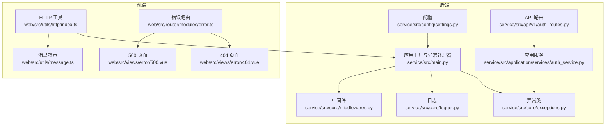
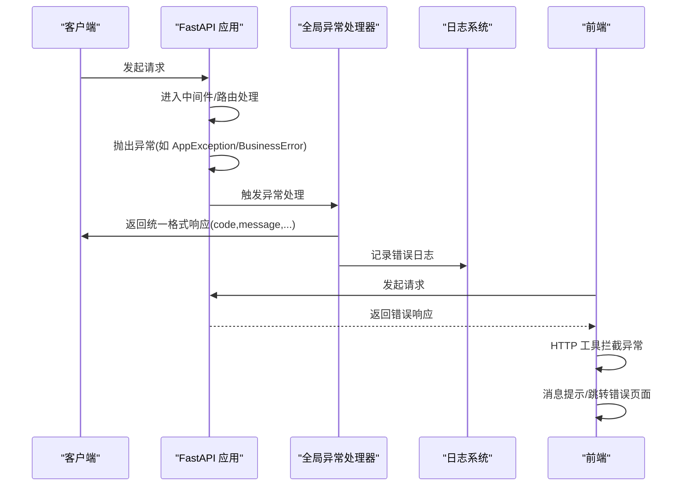
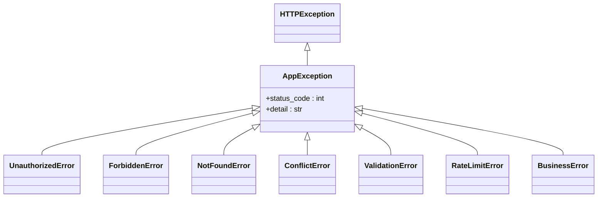
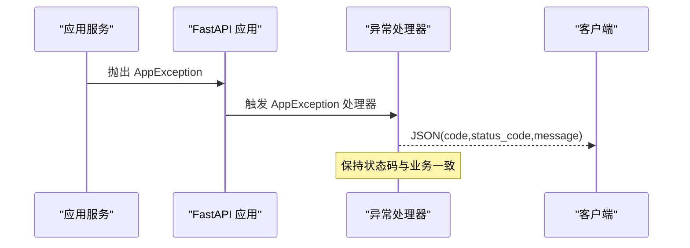
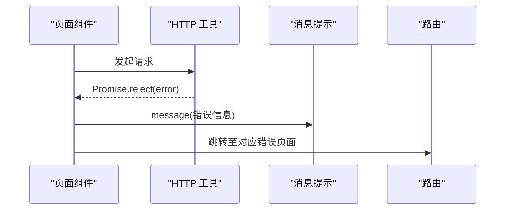
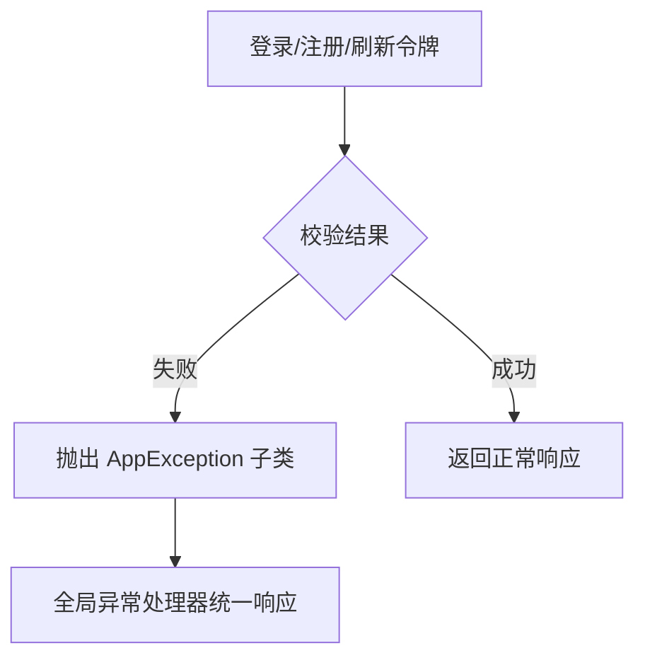
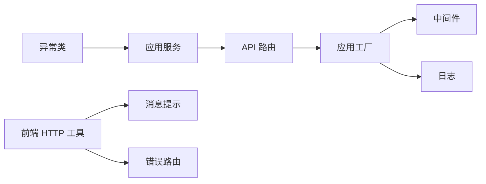

# 异常处理

<cite>
**本文引用的文件**
- [service/src/core/exceptions.py](file://service/src/core/exceptions.py)
- [service/src/core/middlewares.py](file://service/src/core/middlewares.py)
- [service/src/core/logger.py](file://service/src/core/logger.py)
- [service/src/main.py](file://service/src/main.py)
- [service/src/config/settings.py](file://service/src/config/settings.py)
- [service/src/application/services/auth_service.py](file://service/src/application/services/auth_service.py)
- [service/src/api/v1/auth_routes.py](file://service/src/api/v1/auth_routes.py)
- [web/src/utils/http/index.ts](file://web/src/utils/http/index.ts)
- [web/src/utils/message.ts](file://web/src/utils/message.ts)
- [web/src/views/error/404.vue](file://web/src/views/error/404.vue)
- [web/src/views/error/500.vue](file://web/src/views/error/500.vue)
- [web/src/router/modules/error.ts](file://web/src/router/modules/error.ts)
</cite>

## 目录
1. [简介](#简介)
2. [项目结构](#项目结构)
3. [核心组件](#核心组件)
4. [架构总览](#架构总览)
5. [详细组件分析](#详细组件分析)
6. [依赖分析](#依赖分析)
7. [性能考量](#性能考量)
8. [故障排查指南](#故障排查指南)
9. [结论](#结论)
10. [附录](#附录)

## 简介
本技术文档围绕后端 FastAPI 异常处理系统与前端错误提示体系进行深入解析，涵盖以下主题：
- 全局异常捕获机制与自定义异常类设计
- HTTP 异常、业务异常与系统异常的分类与处理策略
- 异常中间件工作原理与异常信息统一格式化
- 前端错误提示与用户友好消息设计
- 异常日志记录与调试信息收集
- 异常处理最佳实践与性能优化
- 异常系统的扩展性与新异常类型的添加方法
- 开发环境与生产环境的异常处理差异

## 项目结构
后端异常处理相关代码主要分布在 core 子模块（异常类、中间件、日志）、应用服务层（业务异常抛出）、API 路由层（统一响应封装），以及前端 web 工程的 HTTP 工具与错误页面。

图表来源
- [service/src/core/exceptions.py:1-60](file://service/src/core/exceptions.py#L1-L60)
- [service/src/core/middlewares.py:1-65](file://service/src/core/middlewares.py#L1-L65)
- [service/src/core/logger.py:1-117](file://service/src/core/logger.py#L1-L117)
- [service/src/main.py:1-96](file://service/src/main.py#L1-L96)
- [service/src/config/settings.py:1-198](file://service/src/config/settings.py#L1-L198)
- [service/src/application/services/auth_service.py:1-154](file://service/src/application/services/auth_service.py#L1-L154)
- [service/src/api/v1/auth_routes.py:1-86](file://service/src/api/v1/auth_routes.py#L1-L86)
- [web/src/utils/http/index.ts:1-197](file://web/src/utils/http/index.ts#L1-L197)
- [web/src/utils/message.ts:1-101](file://web/src/utils/message.ts#L1-L101)
- [web/src/views/error/404.vue:1-78](file://web/src/views/error/404.vue#L1-L78)
- [web/src/views/error/500.vue:1-77](file://web/src/views/error/500.vue#L1-L77)
- [web/src/router/modules/error.ts:1-39](file://web/src/router/modules/error.ts#L1-L39)

章节来源
- [service/src/main.py:34-96](file://service/src/main.py#L34-L96)
- [service/src/core/exceptions.py:6-60](file://service/src/core/exceptions.py#L6-L60)
- [service/src/core/middlewares.py:12-65](file://service/src/core/middlewares.py#L12-L65)
- [service/src/core/logger.py:1-117](file://service/src/core/logger.py#L1-L117)
- [service/src/config/settings.py:41-198](file://service/src/config/settings.py#L41-L198)

## 核心组件
- 自定义异常类：基于 FastAPI 的 HTTPException，定义了业务、HTTP、系统相关异常基类与具体异常类型，便于统一处理与区分。
- 全局异常处理器：在应用工厂中注册，对 AppException、参数校验错误与通用异常进行格式化响应。
- 请求日志中间件：记录请求开始/结束、耗时、状态码、客户端 IP，并统一写入访问日志。
- 日志系统：使用 loguru，分别输出应用日志、错误日志与访问日志，支持轮转与诊断信息。
- 配置系统：按环境加载不同日志级别、调试开关等，影响异常处理与日志输出行为。
- 前端 HTTP 工具：Axios 封装，拦截响应异常并统一处理；消息提示组件用于用户反馈；错误路由与页面负责展示 403/404/500。

章节来源
- [service/src/core/exceptions.py:6-60](file://service/src/core/exceptions.py#L6-L60)
- [service/src/main.py:60-83](file://service/src/main.py#L60-L83)
- [service/src/core/middlewares.py:12-39](file://service/src/core/middlewares.py#L12-L39)
- [service/src/core/logger.py:75-114](file://service/src/core/logger.py#L75-L114)
- [service/src/config/settings.py:82-142](file://service/src/config/settings.py#L82-L142)
- [web/src/utils/http/index.ts:124-148](file://web/src/utils/http/index.ts#L124-L148)
- [web/src/utils/message.ts:49-93](file://web/src/utils/message.ts#L49-L93)

## 架构总览
后端异常处理采用“异常类 + 全局处理器 + 中间件 + 日志”的组合模式；前端通过 HTTP 工具统一拦截异常并结合消息提示与错误页面向用户反馈。

图表来源
- [service/src/main.py:60-83](file://service/src/main.py#L60-L83)
- [service/src/core/logger.py:75-114](file://service/src/core/logger.py#L75-L114)
- [web/src/utils/http/index.ts:124-148](file://web/src/utils/http/index.ts#L124-L148)

## 详细组件分析

### 自定义异常类设计
- 基类 AppException：继承 HTTPException，统一构造参数（状态码、详情），便于上层统一处理。
- 具体异常：
  - HTTP 相关：401/403/404/409/422/429
  - 业务异常：400（业务错误）
- 设计要点：
  - 明确异常语义与状态码映射
  - 保持 detail 可读性，便于前端友好展示
  - 与全局异常处理器配合，实现统一响应结构

图表来源
- [service/src/core/exceptions.py:6-60](file://service/src/core/exceptions.py#L6-L60)

章节来源
- [service/src/core/exceptions.py:6-60](file://service/src/core/exceptions.py#L6-L60)

### 全局异常处理与统一响应
- AppException 处理器：返回包含 code 与 message 的 JSON 响应，状态码来自异常。
- 参数校验错误处理器：针对 RequestValidationError，返回 code=422、message 与 errors 列表。
- 通用异常处理器：捕获未处理异常，记录错误日志并返回 500 响应。
- 统一响应格式：code、message 字段，必要时携带 errors（参数校验）。

图表来源
- [service/src/main.py:60-83](file://service/src/main.py#L60-L83)

章节来源
- [service/src/main.py:60-83](file://service/src/main.py#L60-L83)

### 异常中间件与请求日志
- RequestLoggingMiddleware：
  - 记录请求开始与结束、耗时（毫秒）、状态码、客户端 IP
  - 将处理时间写入响应头 X-Process-Time
  - 通过 log_request 写入访问日志
- IPFilterMiddleware：
  - 支持白名单/黑名单控制，命中时返回 403 JSON

图表来源
- [service/src/core/middlewares.py:12-39](file://service/src/core/middlewares.py#L12-L39)
- [service/src/core/logger.py:75-85](file://service/src/core/logger.py#L75-L85)

章节来源
- [service/src/core/middlewares.py:12-65](file://service/src/core/middlewares.py#L12-L65)
- [service/src/core/logger.py:75-85](file://service/src/core/logger.py#L75-L85)

### 日志系统与调试信息
- 控制台输出：彩色格式，包含时间、级别、模块与行号
- 应用日志：DEBUG 及以上，按大小轮转、保留 30 天
- 错误日志：仅 ERROR，带 backtrace 与 diagnose，保留更久
- 访问日志：过滤 type=access 的记录，记录客户端 IP、方法、路径、状态码、耗时
- 启停日志：记录应用启动/关闭信息，包含环境、调试模式、日志级别等

章节来源
- [service/src/core/logger.py:17-114](file://service/src/core/logger.py#L17-L114)
- [service/src/config/settings.py:32-34](file://service/src/config/settings.py#L32-L34)

### 前端错误提示与用户友好消息
- HTTP 工具（Axios 封装）：
  - 响应拦截器：默认透传 response.data，异常时返回 Promise.reject，便于上层统一处理
  - 与消息提示组件配合，展示错误信息
- 消息提示组件：支持多种类型、位置、时长、图标等配置
- 错误页面与路由：
  - 错误路由模块定义 403/404/500 路由
  - 对应视图组件展示用户可理解的提示文案与返回首页按钮

图表来源
- [web/src/utils/http/index.ts:124-148](file://web/src/utils/http/index.ts#L124-L148)
- [web/src/utils/message.ts:49-93](file://web/src/utils/message.ts#L49-L93)
- [web/src/router/modules/error.ts:1-39](file://web/src/router/modules/error.ts#L1-L39)
- [web/src/views/error/404.vue:1-78](file://web/src/views/error/404.vue#L1-L78)
- [web/src/views/error/500.vue:1-77](file://web/src/views/error/500.vue#L1-L77)

章节来源
- [web/src/utils/http/index.ts:124-148](file://web/src/utils/http/index.ts#L124-L148)
- [web/src/utils/message.ts:49-93](file://web/src/utils/message.ts#L49-L93)
- [web/src/router/modules/error.ts:1-39](file://web/src/router/modules/error.ts#L1-L39)
- [web/src/views/error/404.vue:1-78](file://web/src/views/error/404.vue#L1-L78)
- [web/src/views/error/500.vue:1-77](file://web/src/views/error/500.vue#L1-L77)

### 异常分类与处理策略
- HTTP 异常（4xx）：认证失败、权限不足、资源未找到、资源冲突、参数校验失败、请求过于频繁
- 业务异常（400）：业务规则违反（如用户名已存在）
- 系统异常（500）：未捕获异常，统一返回内部错误
- 处理策略：
  - 明确状态码与 message，必要时携带 errors
  - 严格区分业务异常与系统异常，避免泄露敏感信息
  - 在开发环境可输出更多诊断信息，在生产环境收敛细节

章节来源
- [service/src/core/exceptions.py:13-59](file://service/src/core/exceptions.py#L13-L59)
- [service/src/main.py:68-82](file://service/src/main.py#L68-L82)

### 业务异常示例与触发点
- 认证服务中：
  - 用户名/密码错误或用户被禁用 → UnauthorizedError
  - 用户名已存在 → BusinessError
  - 刷新令牌无效或用户不存在/被禁用 → UnauthorizedError
- 业务异常通过 raise 抛出，最终由全局异常处理器统一格式化响应

图表来源
- [service/src/application/services/auth_service.py:26-154](file://service/src/application/services/auth_service.py#L26-L154)
- [service/src/core/exceptions.py:27-59](file://service/src/core/exceptions.py#L27-L59)
- [service/src/main.py:60-83](file://service/src/main.py#L60-L83)

章节来源
- [service/src/application/services/auth_service.py:26-154](file://service/src/application/services/auth_service.py#L26-L154)

### 开发与生产环境差异
- 日志级别：
  - 开发：DEBUG，便于调试
  - 生产：WARNING，减少噪声
- 调试模式：
  - 开发：DEBUG=True
  - 生产：DEBUG=False
- 影响：
  - 日志输出粒度与敏感信息展示
  - 异常堆栈与诊断信息的可见性

章节来源
- [service/src/config/settings.py:110-142](file://service/src/config/settings.py#L110-L142)

## 依赖分析
- 应用服务层依赖异常类，抛出业务异常
- API 路由层依赖应用服务，统一返回成功响应包装
- 应用工厂注册全局异常处理器与中间件，依赖日志模块
- 前端 HTTP 工具依赖消息提示组件与路由，统一处理异常

图表来源
- [service/src/core/exceptions.py:6-60](file://service/src/core/exceptions.py#L6-L60)
- [service/src/application/services/auth_service.py:15-25](file://service/src/application/services/auth_service.py#L15-L25)
- [service/src/api/v1/auth_routes.py:16-16](file://service/src/api/v1/auth_routes.py#L16-L16)
- [service/src/main.py:34-96](file://service/src/main.py#L34-L96)
- [service/src/core/middlewares.py:12-39](file://service/src/core/middlewares.py#L12-L39)
- [service/src/core/logger.py:75-114](file://service/src/core/logger.py#L75-L114)
- [web/src/utils/http/index.ts:124-148](file://web/src/utils/http/index.ts#L124-L148)
- [web/src/utils/message.ts:49-93](file://web/src/utils/message.ts#L49-L93)

章节来源
- [service/src/application/services/auth_service.py:15-25](file://service/src/application/services/auth_service.py#L15-L25)
- [service/src/api/v1/auth_routes.py:16-16](file://service/src/api/v1/auth_routes.py#L16-L16)
- [service/src/main.py:34-96](file://service/src/main.py#L34-L96)

## 性能考量
- 中间件开销：请求/响应头设置与日志写入需关注 I/O 性能，建议在高并发场景下评估日志轮转策略
- 异常处理成本：尽量在业务层尽早校验与抛错，避免深层调用栈
- 前端拦截：Axios 拦截器仅做必要处理，避免在响应阶段进行重型计算
- 日志级别：生产环境降低日志级别，减少磁盘 I/O 与序列化开销

## 故障排查指南
- 查看访问日志：定位请求路径、状态码与耗时
- 查看错误日志：获取异常堆栈与诊断信息
- 核对异常处理器：确认返回字段是否符合预期
- 前端提示：检查消息提示组件与错误页面是否正确渲染
- 环境配置：核对日志级别与调试模式设置

章节来源
- [service/src/core/logger.py:75-114](file://service/src/core/logger.py#L75-L114)
- [service/src/main.py:60-83](file://service/src/main.py#L60-L83)
- [web/src/utils/http/index.ts:124-148](file://web/src/utils/http/index.ts#L124-L148)

## 结论
本异常处理体系通过“自定义异常类 + 全局异常处理器 + 中间件 + 日志 + 前端统一拦截”的组合，实现了清晰的异常分类、统一的响应格式与一致的用户反馈。开发与生产环境的差异化配置确保了可观测性与安全性。后续扩展可通过新增异常类型与完善日志策略持续增强系统稳定性。

## 附录

### 新增异常类型的步骤
- 在异常模块新增子类，继承 AppException 并指定状态码与默认消息
- 在业务层抛出新异常
- 如需特殊处理，可在应用工厂中新增对应异常处理器
- 更新前端错误页面与消息提示策略，保证用户友好体验

章节来源
- [service/src/core/exceptions.py:6-60](file://service/src/core/exceptions.py#L6-L60)
- [service/src/main.py:60-83](file://service/src/main.py#L60-L83)