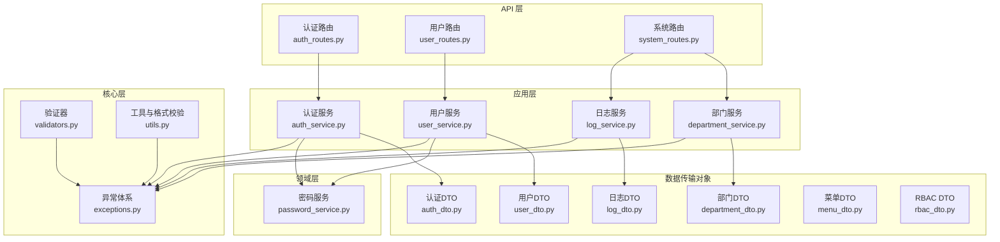
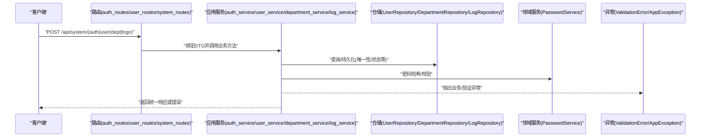
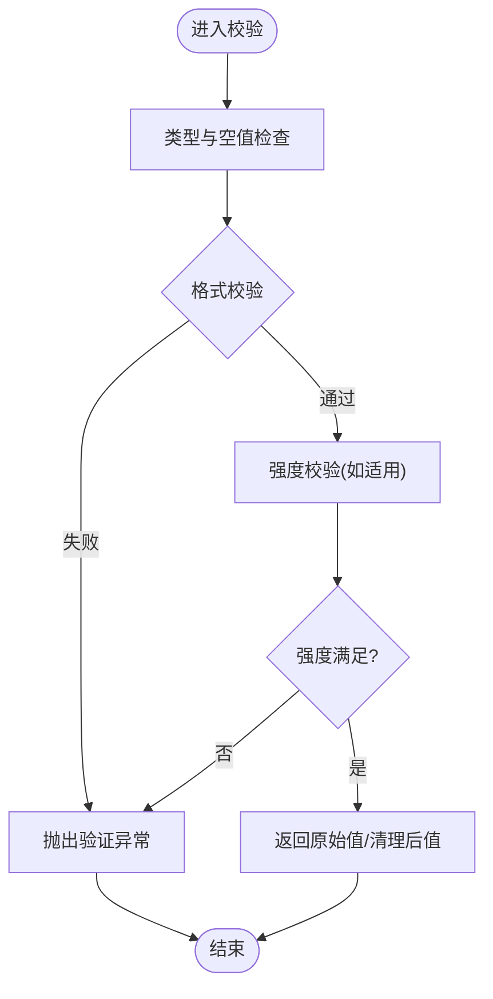
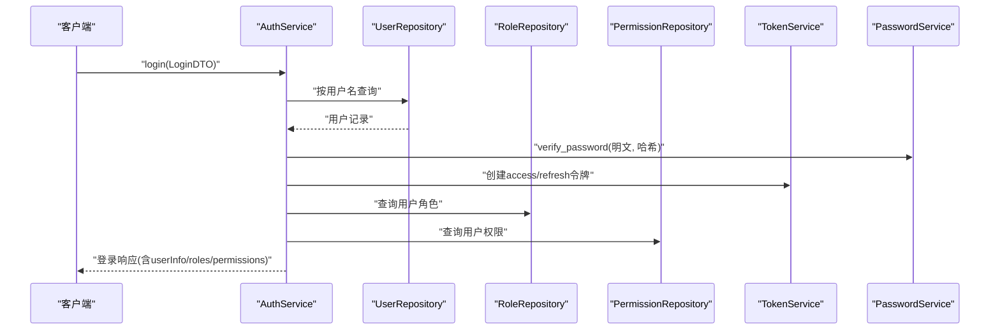
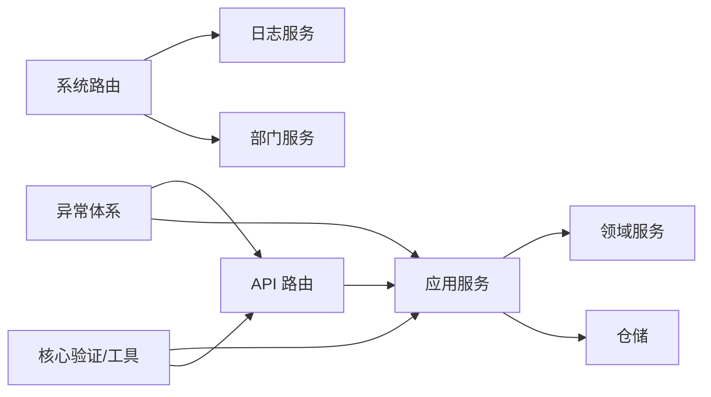

# 数据验证

<cite>
**本文引用的文件**
- [validators.py](file://service/src/core/validators.py)
- [utils.py](file://service/src/core/utils.py)
- [exceptions.py](file://service/src/core/exceptions.py)
- [auth_dto.py](file://service/src/application/dto/auth_dto.py)
- [user_dto.py](file://service/src/application/dto/user_dto.py)
- [department_dto.py](file://service/src/application/dto/department_dto.py)
- [log_dto.py](file://service/src/application/dto/log_dto.py)
- [menu_dto.py](file://service/src/application/dto/menu_dto.py)
- [rbac_dto.py](file://service/src/application/dto/rbac_dto.py)
- [auth_routes.py](file://service/src/api/v1/auth_routes.py)
- [user_routes.py](file://service/src/api/v1/user_routes.py)
- [system_routes.py](file://service/src/api/v1/system_routes.py)
- [auth_service.py](file://service/src/application/services/auth_service.py)
- [user_service.py](file://service/src/application/services/user_service.py)
- [department_service.py](file://service/src/application/services/department_service.py)
- [log_service.py](file://service/src/application/services/log_service.py)
- [password_service.py](file://service/src/domain/auth/password_service.py)
- [test_core.py](file://service/tests/unit/test_core.py)
- [test_auth.py](file://service/tests/unit/test_auth.py)
</cite>

## 更新摘要
**所做更改**
- 新增部门管理相关DTO类（DepartmentDTO）及其验证机制
- 新增日志管理相关DTO类（LoginLogDTO、OperationLogDTO、SystemLogDTO）及其验证机制
- 扩展RBAC管理相关DTO类（RoleDTO、PermissionDTO）的验证规则
- 新增菜单管理相关DTO类（MenuDTO）的验证机制
- 完善输入验证机制，包括字段级验证、格式验证和业务规则验证
- 增强数据清理和预处理功能，支持空字符串转换为None的统一处理

## 目录
1. [引言](#引言)
2. [项目结构](#项目结构)
3. [核心组件](#核心组件)
4. [架构总览](#架构总览)
5. [详细组件分析](#详细组件分析)
6. [依赖分析](#依赖分析)
7. [性能考虑](#性能考虑)
8. [故障排查指南](#故障排查指南)
9. [结论](#结论)
10. [附录](#附录)

## 引言
本文件面向数据验证系统，围绕 Pydantic 模型验证器与自定义验证规则展开，系统性阐述输入数据的类型检查、格式验证与业务规则验证；覆盖密码强度、邮箱格式、手机号等常用验证场景；解释统一验证错误处理与错误消息本地化思路；给出数据清理与预处理最佳实践；提供自定义验证器开发指南与性能优化建议，并说明验证系统的扩展性与第三方验证库的集成方法。

**更新** 本次更新重点反映了数据验证系统的重大改进，新增了多个DTO类及其完整的输入验证机制，包括部门管理、日志管理、RBAC管理和菜单管理等核心业务领域的验证规则。

## 项目结构
后端服务采用分层架构：API 层负责路由与请求绑定，应用层封装业务流程，领域层承载业务能力（如密码哈希），基础设施层对接数据库与仓储。验证贯穿于 DTO 定义、服务层业务校验与异常处理层。

**图表来源**
- [auth_routes.py](file://service/src/api/v1/auth_routes.py)
- [user_routes.py](file://service/src/api/v1/user_routes.py)
- [system_routes.py](file://service/src/api/v1/system_routes.py)
- [auth_service.py](file://service/src/application/services/auth_service.py)
- [user_service.py](file://service/src/application/services/user_service.py)
- [department_service.py](file://service/src/application/services/department_service.py)
- [log_service.py](file://service/src/application/services/log_service.py)
- [validators.py](file://service/src/core/validators.py)
- [utils.py](file://service/src/core/utils.py)
- [exceptions.py](file://service/src/core/exceptions.py)
- [auth_dto.py](file://service/src/application/dto/auth_dto.py)
- [user_dto.py](file://service/src/application/dto/user_dto.py)
- [department_dto.py](file://service/src/application/dto/department_dto.py)
- [log_dto.py](file://service/src/application/dto/log_dto.py)
- [menu_dto.py](file://service/src/application/dto/menu_dto.py)
- [rbac_dto.py](file://service/src/application/dto/rbac_dto.py)
- [password_service.py](file://service/src/domain/auth/password_service.py)

**章节来源**
- [auth_routes.py](file://service/src/api/v1/auth_routes.py)
- [user_routes.py](file://service/src/api/v1/user_routes.py)
- [system_routes.py](file://service/src/api/v1/system_routes.py)
- [auth_service.py](file://service/src/application/services/auth_service.py)
- [user_service.py](file://service/src/application/services/user_service.py)
- [department_service.py](file://service/src/application/services/department_service.py)
- [log_service.py](file://service/src/application/services/log_service.py)
- [validators.py](file://service/src/core/validators.py)
- [utils.py](file://service/src/core/utils.py)
- [exceptions.py](file://service/src/core/exceptions.py)
- [auth_dto.py](file://service/src/application/dto/auth_dto.py)
- [user_dto.py](file://service/src/application/dto/user_dto.py)
- [department_dto.py](file://service/src/application/dto/department_dto.py)
- [log_dto.py](file://service/src/application/dto/log_dto.py)
- [menu_dto.py](file://service/src/application/dto/menu_dto.py)
- [rbac_dto.py](file://service/src/application/dto/rbac_dto.py)
- [password_service.py](file://service/src/domain/auth/password_service.py)

## 核心组件
- **Pydantic DTO**：在应用层定义请求/响应的数据结构与约束，如最小长度、最大长度、可空性、别名等。现已扩展至多个业务领域，包括认证、用户、部门、日志、菜单和RBAC管理。
- **自定义验证器**：在核心层提供通用格式与强度校验（如邮箱、密码强度、用户名）。
- **业务规则校验**：在应用服务层结合仓储与领域服务执行业务约束（如唯一性、状态、权限）。
- **异常体系**：统一的验证错误与业务错误类型，便于上层捕获与本地化处理。
- **密码服务**：提供哈希与校验，保障密码安全存储与比对。

**更新** 新增的DTO类引入了更复杂的验证规则，包括字段级验证、格式验证和业务规则验证的组合使用。

**章节来源**
- [auth_dto.py](file://service/src/application/dto/auth_dto.py)
- [user_dto.py](file://service/src/application/dto/user_dto.py)
- [department_dto.py](file://service/src/application/dto/department_dto.py)
- [log_dto.py](file://service/src/application/dto/log_dto.py)
- [menu_dto.py](file://service/src/application/dto/menu_dto.py)
- [rbac_dto.py](file://service/src/application/dto/rbac_dto.py)
- [validators.py](file://service/src/core/validators.py)
- [utils.py](file://service/src/core/utils.py)
- [exceptions.py](file://service/src/core/exceptions.py)
- [password_service.py](file://service/src/domain/auth/password_service.py)

## 架构总览
下图展示从 API 请求到服务处理再到验证与异常的整体流程，包括新增的部门和日志管理功能。

**图表来源**
- [auth_routes.py](file://service/src/api/v1/auth_routes.py)
- [user_routes.py](file://service/src/api/v1/user_routes.py)
- [system_routes.py](file://service/src/api/v1/system_routes.py)
- [auth_service.py](file://service/src/application/services/auth_service.py)
- [user_service.py](file://service/src/application/services/user_service.py)
- [department_service.py](file://service/src/application/services/department_service.py)
- [log_service.py](file://service/src/application/services/log_service.py)
- [exceptions.py](file://service/src/core/exceptions.py)

## 详细组件分析

### Pydantic 模型与内置验证
- **认证与用户 DTO**：均基于 Pydantic BaseModel，通过字段级约束实现类型检查与基本范围控制。
- **部门管理 DTO**：新增部门创建、更新、列表查询和响应DTO，包含复杂的字段验证和空值处理。
- **日志管理 DTO**：新增登录日志、操作日志、系统日志的查询和响应DTO，支持分页和时间范围查询。
- **菜单管理 DTO**：新增菜单创建、更新和响应DTO，包含丰富的UI配置字段验证。
- **RBAC管理 DTO**：新增角色和权限的创建、更新、查询DTO，支持权限分配和状态管理。

**更新** 新增的DTO类引入了更复杂的验证规则，包括字段级验证、格式验证和业务规则验证的组合使用。

**章节来源**
- [auth_dto.py](file://service/src/application/dto/auth_dto.py)
- [user_dto.py](file://service/src/application/dto/user_dto.py)
- [department_dto.py](file://service/src/application/dto/department_dto.py)
- [log_dto.py](file://service/src/application/dto/log_dto.py)
- [menu_dto.py](file://service/src/application/dto/menu_dto.py)
- [rbac_dto.py](file://service/src/application/dto/rbac_dto.py)

### 自定义验证器与格式校验
- 核心层提供通用格式与强度校验函数，便于在服务层或业务逻辑中复用。
- 关键能力：
  - 邮箱格式校验
  - 密码强度校验（长度、大小写字母、数字）
  - 用户名格式校验（长度与字符集）

**图表来源**
- [validators.py](file://service/src/core/validators.py)
- [utils.py](file://service/src/core/utils.py)
- [exceptions.py](file://service/src/core/exceptions.py)

**章节来源**
- [validators.py](file://service/src/core/validators.py)
- [utils.py](file://service/src/core/utils.py)
- [exceptions.py](file://service/src/core/exceptions.py)

### 业务规则验证与错误处理
- **认证服务**：
  - 登录：用户名存在性、密码校验、账户状态、令牌签发与角色/权限回填。
  - 注册：用户名唯一性、密码哈希、创建用户。
  - 刷新：令牌解码、类型校验、用户状态校验。
- **用户服务**：
  - 创建/更新：唯一性（用户名/邮箱）、选择性更新、密码重置与状态变更。
  - 修改密码：旧密码校验、新密码哈希。
- **部门服务**：
  - 创建：部门名称唯一性、父部门存在性验证、层级关系检查。
  - 更新：父部门有效性、不能设置为自己的子部门。
  - 删除：子部门检查、关联用户检查。
- **日志服务**：
  - 登录日志：分页查询、时间范围过滤、状态过滤。
  - 操作日志：模块过滤、状态过滤、时间范围过滤。
  - 系统日志：模块过滤、请求时间过滤、详情查询。
- **统一异常**：业务错误、未授权、冲突、验证错误等。

**图表来源**
- [auth_service.py](file://service/src/application/services/auth_service.py)
- [auth_routes.py](file://service/src/api/v1/auth_routes.py)
- [password_service.py](file://service/src/domain/auth/password_service.py)

**章节来源**
- [auth_service.py](file://service/src/application/services/auth_service.py)
- [user_service.py](file://service/src/application/services/user_service.py)
- [department_service.py](file://service/src/application/services/department_service.py)
- [log_service.py](file://service/src/application/services/log_service.py)
- [auth_routes.py](file://service/src/api/v1/auth_routes.py)
- [user_routes.py](file://service/src/api/v1/user_routes.py)
- [system_routes.py](file://service/src/api/v1/system_routes.py)

### 错误处理与本地化支持
- 统一异常基类与具体异常类型，便于捕获与转换为 HTTP 响应。
- 建议：
  - 在中间件或全局异常处理器中捕获异常，统一包装为标准响应。
  - 将错误消息与业务文案集中管理，结合国际化框架实现多语言输出。
  - 对于 Pydantic 校验错误，可提取字段级错误并映射到本地化键值。

**章节来源**
- [exceptions.py](file://service/src/core/exceptions.py)

### 数据清理与预处理最佳实践
- **输入清理**：
  - 移除前后空白、归一化大小写（如邮箱）、剔除无意义字符（如手机号去除非数字）。
  - 对可选字段进行显式 None 判断，避免空字符串污染默认值。
  - **新增**：统一的空字符串转换为None机制，支持多种字段类型的智能清理。
- **输出清理**：
  - DTO 层通过 from_attributes 映射时，确保敏感字段不泄露。
- **性能注意**：
  - 正则表达式缓存与预编译（如邮箱/用户名正则）。
  - 复杂规则优先在服务层一次性校验，减少重复计算。

**更新** 新增的DTO类引入了统一的空字符串处理机制，通过field_validator装饰器实现智能数据清理。

**章节来源**
- [validators.py](file://service/src/core/validators.py)
- [utils.py](file://service/src/core/utils.py)
- [auth_dto.py](file://service/src/application/dto/auth_dto.py)
- [user_dto.py](file://service/src/application/dto/user_dto.py)
- [department_dto.py](file://service/src/application/dto/department_dto.py)
- [log_dto.py](file://service/src/application/dto/log_dto.py)
- [menu_dto.py](file://service/src/application/dto/menu_dto.py)
- [rbac_dto.py](file://service/src/application/dto/rbac_dto.py)

### 自定义验证器开发指南
- **设计原则**：
  - 单一职责：每个验证器聚焦一类规则。
  - 可复用：函数式设计，便于在多个 DTO 或服务中调用。
  - 可测试：提供清晰的输入输出与边界条件用例。
- **开发步骤**：
  - 定义输入签名与返回值（通常返回原值或清理后的值）。
  - 编写边界用例与反例，覆盖空值、极值、非法字符等。
  - 在服务层调用并结合异常体系抛出统一错误。
- **示例参考**：
  - 邮箱/密码强度/用户名格式的实现路径见核心层验证器与工具函数。

**章节来源**
- [validators.py](file://service/src/core/validators.py)
- [utils.py](file://service/src/core/utils.py)
- [test_core.py](file://service/tests/unit/test_core.py)

### 常用验证场景与实现要点
- **密码强度验证**：
  - 最小长度、至少一个大写字母、一个小写字母、一个数字。
  - 建议在注册/修改密码时强制执行，并与领域服务配合完成哈希。
- **邮箱格式验证**：
  - 基础正则校验，结合 DTO 的 EmailStr 类型可获得更强约束。
- **手机号验证**：
  - 建议引入国家/地区规则与长度约束，必要时集成第三方库（见"扩展性"）。
- **新增字段验证**：
  - **部门管理**：名称长度限制、排序和状态的数值验证、联系信息格式验证。
  - **日志管理**：分页参数验证、时间范围处理、状态值转换。
  - **菜单管理**：丰富的UI配置字段验证、类型枚举验证。
  - **RBAC管理**：权限标识验证、状态值范围验证。

**更新** 新增了多个业务领域的专用验证规则，涵盖企业级应用场景的复杂验证需求。

**章节来源**
- [validators.py](file://service/src/core/validators.py)
- [utils.py](file://service/src/core/utils.py)
- [user_dto.py](file://service/src/application/dto/user_dto.py)
- [department_dto.py](file://service/src/application/dto/department_dto.py)
- [log_dto.py](file://service/src/application/dto/log_dto.py)
- [menu_dto.py](file://service/src/application/dto/menu_dto.py)
- [rbac_dto.py](file://service/src/application/dto/rbac_dto.py)

### 性能优化建议
- 避免重复校验：在 DTO 层完成基础约束，在服务层补充业务规则。
- 正则优化：复用编译后的正则对象，减少重复编译开销。
- 异步与并发：在仓储查询与外部校验（如第三方 API）时保持异步特性。
- 缓存策略：对热点校验（如黑名单/白名单）引入缓存层。
- **新增优化点**：
  - DTO字段验证的性能优化，利用Pydantic的内置验证机制。
  - 批量操作的验证优化，减少重复的业务规则检查。

## 依赖分析
- API 层依赖应用服务与 DTO；应用服务依赖仓储与领域服务；核心层提供验证与工具；异常体系贯穿各层。
- 依赖方向清晰，耦合度低，便于扩展与替换。
- **新增依赖关系**：
  - 系统路由依赖部门服务和日志服务。
  - 部门服务依赖部门仓储。
  - 日志服务依赖日志仓储。

**图表来源**
- [auth_routes.py](file://service/src/api/v1/auth_routes.py)
- [user_routes.py](file://service/src/api/v1/user_routes.py)
- [system_routes.py](file://service/src/api/v1/system_routes.py)
- [auth_service.py](file://service/src/application/services/auth_service.py)
- [user_service.py](file://service/src/application/services/user_service.py)
- [department_service.py](file://service/src/application/services/department_service.py)
- [log_service.py](file://service/src/application/services/log_service.py)
- [exceptions.py](file://service/src/core/exceptions.py)
- [validators.py](file://service/src/core/validators.py)
- [utils.py](file://service/src/core/utils.py)

**章节来源**
- [auth_routes.py](file://service/src/api/v1/auth_routes.py)
- [user_routes.py](file://service/src/api/v1/user_routes.py)
- [system_routes.py](file://service/src/api/v1/system_routes.py)
- [auth_service.py](file://service/src/application/services/auth_service.py)
- [user_service.py](file://service/src/application/services/user_service.py)
- [department_service.py](file://service/src/application/services/department_service.py)
- [log_service.py](file://service/src/application/services/log_service.py)
- [exceptions.py](file://service/src/core/exceptions.py)
- [validators.py](file://service/src/core/validators.py)
- [utils.py](file://service/src/core/utils.py)

## 性能考虑
- DTO 层约束可拦截大部分无效输入，减少后续处理成本。
- 业务规则尽量在一次事务内完成，避免多次往返数据库。
- 对高频校验（如邮箱/密码强度）采用缓存与预编译正则。
- 在高并发场景下，注意仓储查询的索引与分页参数的合理性。
- **新增性能考虑**：
  - 大量DTO字段验证的性能优化。
  - 批量操作的验证性能优化。
  - 复杂业务规则的缓存策略。

## 故障排查指南
- **常见问题定位**：
  - Pydantic 校验失败：检查 DTO 字段约束与传参类型。
  - 业务规则失败：查看服务层异常抛出点与仓储查询结果。
  - 密码错误：确认哈希算法一致与编码正确。
  - **新增问题**：
    - 部门层级关系错误：检查父子部门关系和循环引用。
    - 日志查询参数错误：检查分页参数和时间范围格式。
    - 菜单配置错误：检查UI配置字段的有效性。
- **建议的日志与断点**：
  - 在路由绑定后、服务入口、仓储调用前后记录关键上下文。
  - 对异常进行分类记录，便于统计与告警。

**章节来源**
- [test_core.py](file://service/tests/unit/test_core.py)
- [test_auth.py](file://service/tests/unit/test_auth.py)
- [exceptions.py](file://service/src/core/exceptions.py)

## 结论
该验证体系以 Pydantic DTO 为基础，结合核心层通用验证器与应用层业务规则，形成从输入到输出的全链路校验闭环。通过统一异常与可测试的验证器，既保证了数据质量，也为扩展与维护提供了清晰路径。本次更新大幅扩展了验证覆盖范围，新增了部门管理、日志管理、RBAC管理和菜单管理等核心业务领域的验证机制，进一步提升了系统的完整性和可靠性。建议在现有基础上完善本地化与第三方库集成，持续提升可用性与可维护性。

## 附录

### 常用验证器清单与调用位置
- 邮箱格式：核心工具函数，适合在服务层或业务逻辑中调用。
- 密码强度：核心工具函数，适合在注册/修改密码流程中调用。
- 用户名格式：核心验证器，适合在注册/登录流程中调用。

**章节来源**
- [utils.py](file://service/src/core/utils.py)
- [validators.py](file://service/src/core/validators.py)

### 新增DTO类验证机制概览
- **部门管理DTO**：
  - DepartmentCreateDTO：名称长度验证、联系信息格式验证、状态值验证
  - DepartmentUpdateDTO：选择性字段验证、空值处理机制
  - DepartmentListQueryDTO：状态值转换、模糊匹配支持
- **日志管理DTO**：
  - LoginLogListQueryDTO：分页参数验证、时间范围处理、状态值转换
  - OperationLogListQueryDTO：模块过滤、状态过滤、时间范围处理
  - SystemLogListQueryDTO：模块过滤、请求时间过滤
- **菜单管理DTO**：
  - MenuCreateDTO：丰富的UI配置字段验证、类型枚举验证
  - MenuUpdateDTO：选择性字段验证、UI配置字段验证
- **RBAC管理DTO**：
  - RoleCreateDTO：角色名称和代码验证、权限ID列表处理
  - PermissionCreateDTO：权限标识验证、分类和描述验证

**章节来源**
- [department_dto.py](file://service/src/application/dto/department_dto.py)
- [log_dto.py](file://service/src/application/dto/log_dto.py)
- [menu_dto.py](file://service/src/application/dto/menu_dto.py)
- [rbac_dto.py](file://service/src/application/dto/rbac_dto.py)