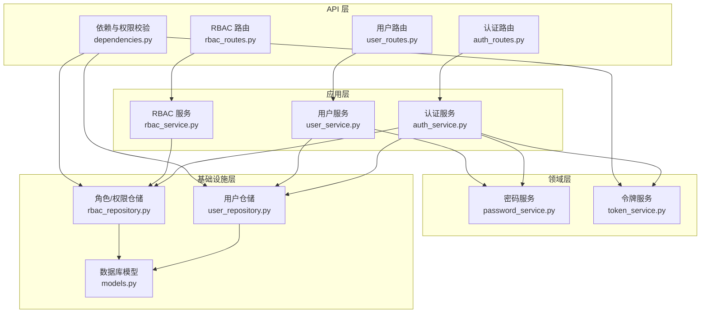
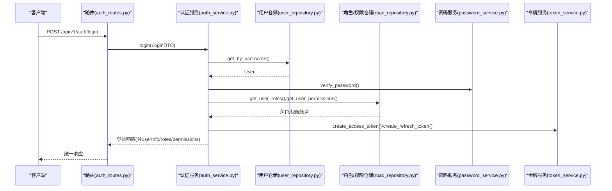
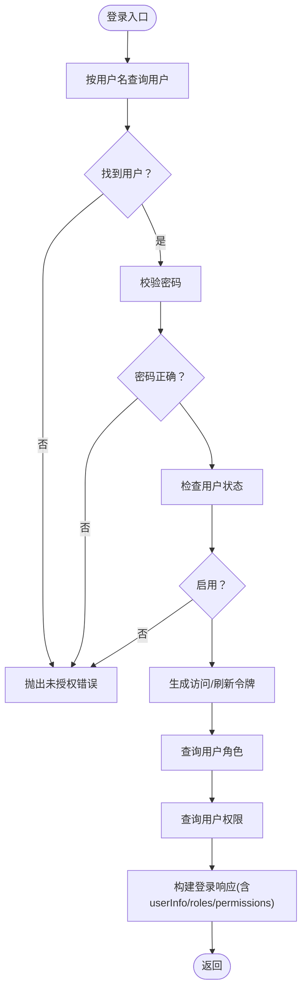
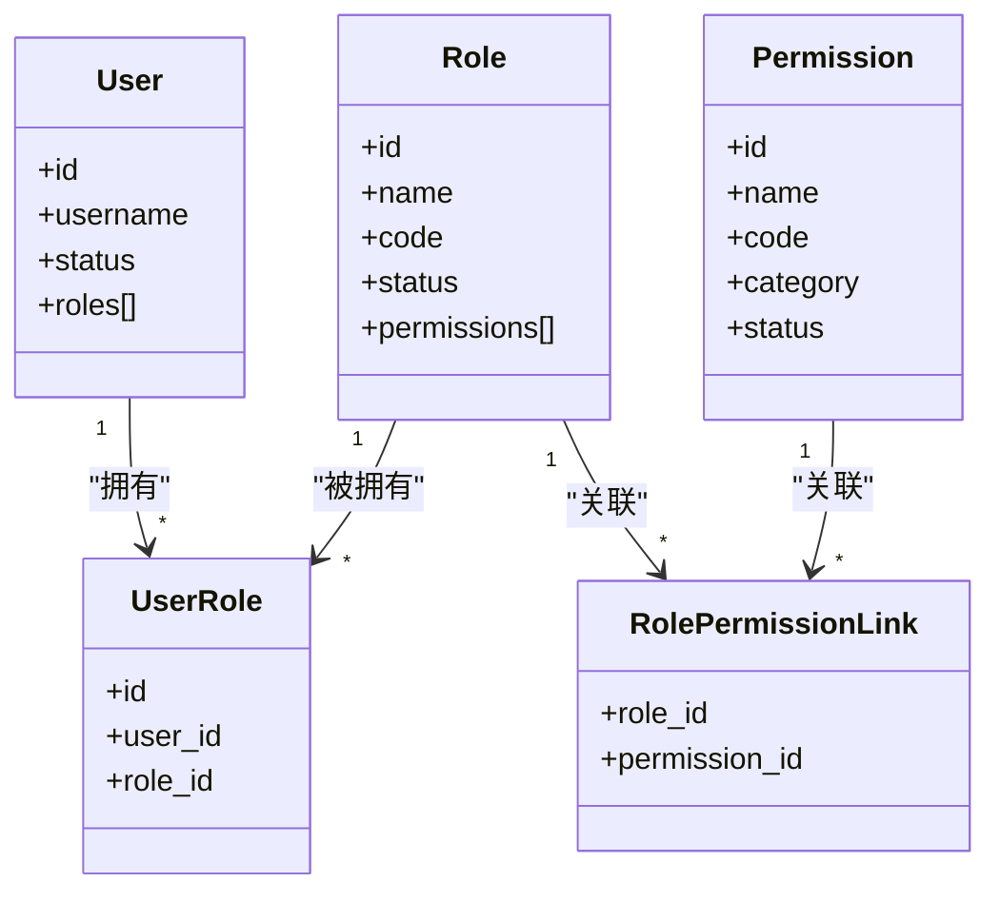
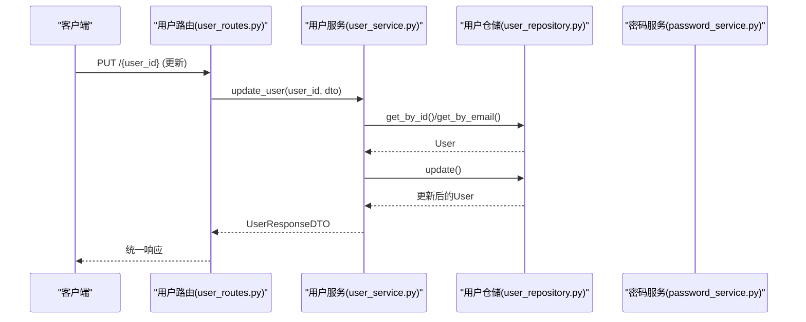
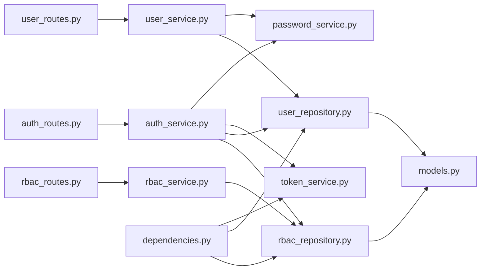

# 核心特性

<cite>
**本文引用的文件**
- [README.md](file://service/README.md)
- [pyproject.toml](file://service/pyproject.toml)
- [main.py](file://service/src/main.py)
- [settings.py](file://service/src/config/settings.py)
- [auth_routes.py](file://service/src/api/v1/auth_routes.py)
- [rbac_routes.py](file://service/src/api/v1/rbac_routes.py)
- [user_routes.py](file://service/src/api/v1/user_routes.py)
- [auth_service.py](file://service/src/application/services/auth_service.py)
- [rbac_service.py](file://service/src/application/services/rbac_service.py)
- [user_service.py](file://service/src/application/services/user_service.py)
- [password_service.py](file://service/src/domain/auth/password_service.py)
- [token_service.py](file://service/src/domain/auth/token_service.py)
- [models.py](file://service/src/infrastructure/database/models.py)
- [user_repository.py](file://service/src/infrastructure/repositories/user_repository.py)
- [rbac_repository.py](file://service/src/infrastructure/repositories/rbac_repository.py)
- [dependencies.py](file://service/src/api/dependencies.py)
- [middlewares.py](file://service/src/core/middlewares.py)
- [auth_dto.py](file://service/src/application/dto/auth_dto.py)
</cite>

## 目录
1. [简介](#简介)
2. [项目结构](#项目结构)
3. [核心组件](#核心组件)
4. [架构总览](#架构总览)
5. [详细组件分析](#详细组件分析)
6. [依赖关系分析](#依赖关系分析)
7. [性能考量](#性能考量)
8. [故障排查指南](#故障排查指南)
9. [结论](#结论)
10. [附录](#附录)

## 简介
Hello-FastApi 是一个基于 FastAPI 的 RESTful API 服务，采用领域驱动设计（DDD）分层架构与 RBAC 权限控制。项目提供完善的认证体系（JWT）、用户管理、角色与权限管理能力，并通过统一的响应格式与中间件确保可观测性与安全性。本文聚焦于认证系统、RBAC 权限控制、用户管理、角色管理与权限管理五大核心特性，阐述其业务价值、技术实现、特性间的协同关系、使用场景与最佳实践，并给出扩展与定制化建议。

## 项目结构
服务端采用典型的 DDD 分层：
- 应用层：封装业务用例，协调领域与基础设施
- 领域层：密码与令牌等核心业务逻辑
- 基础设施层：数据库模型、仓储实现、缓存与连接
- API 层：路由、依赖注入与权限校验
- 核心模块：中间件、异常、日志、常量与工具

图表来源
- [auth_routes.py:1-86](file://service/src/api/v1/auth_routes.py#L1-L86)
- [user_routes.py:1-252](file://service/src/api/v1/user_routes.py#L1-L252)
- [rbac_routes.py:1-257](file://service/src/api/v1/rbac_routes.py#L1-L257)
- [auth_service.py:1-154](file://service/src/application/services/auth_service.py#L1-L154)
- [user_service.py:1-322](file://service/src/application/services/user_service.py#L1-L322)
- [rbac_service.py:1-231](file://service/src/application/services/rbac_service.py#L1-L231)
- [password_service.py:1-21](file://service/src/domain/auth/password_service.py#L1-L21)
- [token_service.py:1-45](file://service/src/domain/auth/token_service.py#L1-L45)
- [user_repository.py:1-185](file://service/src/infrastructure/repositories/user_repository.py#L1-L185)
- [rbac_repository.py:1-213](file://service/src/infrastructure/repositories/rbac_repository.py#L1-L213)
- [models.py:1-193](file://service/src/infrastructure/database/models.py#L1-L193)
- [dependencies.py:1-72](file://service/src/api/dependencies.py#L1-L72)

章节来源
- [README.md:27-93](file://service/README.md#L27-L93)
- [pyproject.toml:1-76](file://service/pyproject.toml#L1-L76)

## 核心组件
- 认证系统：基于 JWT 的登录、注册、刷新与登出；密码哈希与令牌签发/校验
- RBAC 权限控制：角色与权限的增删改查、角色权限分配、用户角色分配、权限校验
- 用户管理：用户增删改查、批量删除、密码重置/修改、状态变更
- 角色管理：角色 CRUD、角色权限分配
- 权限管理：权限 CRUD、权限查询
- 统一响应与中间件：统一响应体、请求日志、CORS、异常处理、IP 白黑名单

章节来源
- [auth_routes.py:1-86](file://service/src/api/v1/auth_routes.py#L1-L86)
- [rbac_routes.py:1-257](file://service/src/api/v1/rbac_routes.py#L1-L257)
- [user_routes.py:1-252](file://service/src/api/v1/user_routes.py#L1-L252)
- [auth_service.py:1-154](file://service/src/application/services/auth_service.py#L1-L154)
- [rbac_service.py:1-231](file://service/src/application/services/rbac_service.py#L1-L231)
- [user_service.py:1-322](file://service/src/application/services/user_service.py#L1-L322)
- [middlewares.py:1-65](file://service/src/core/middlewares.py#L1-L65)

## 架构总览
系统以 FastAPI 为入口，通过路由层调用应用服务，应用服务协调仓储与领域服务完成业务处理。认证依赖 JWT 令牌与仓储查询用户状态，RBAC 依赖角色/权限关联表实现权限继承与校验。统一响应体与中间件贯穿请求链路，保证可观测性与一致性。

图表来源
- [auth_routes.py:19-34](file://service/src/api/v1/auth_routes.py#L19-L34)
- [auth_service.py:26-74](file://service/src/application/services/auth_service.py#L26-L74)
- [user_repository.py:22-25](file://service/src/infrastructure/repositories/user_repository.py#L22-L25)
- [rbac_repository.py:128-133](file://service/src/infrastructure/repositories/rbac_repository.py#L128-L133)
- [password_service.py:18-20](file://service/src/domain/auth/password_service.py#L18-L20)
- [token_service.py:15-30](file://service/src/domain/auth/token_service.py#L15-L30)

## 详细组件分析

### 认证系统
- 功能要点
  - 登录：校验用户名/密码，检查用户状态，签发访问与刷新令牌，返回用户角色与权限清单
  - 注册：校验用户名唯一性，哈希密码，创建启用状态用户
  - 刷新：校验刷新令牌有效性与用户状态，签发新令牌
  - 登出：JWT 无状态，仅返回成功（客户端清理本地令牌）
- 业务价值
  - 提供安全、标准的认证流程，支持长短期令牌策略
  - 将用户角色与权限在登录阶段一次性下发，前端可据此做界面与按钮级权限控制
- 技术实现
  - 令牌：HS256 签名，独立的访问/刷新令牌，过期时间可配置
  - 密码：bcrypt 哈希与校验
  - 路由：统一响应包装，参数校验由 DTO 与 Pydantic 完成
- 使用场景
  - 管理后台登录、第三方系统集成（携带访问令牌访问受控资源）
- 最佳实践
  - 强制 HTTPS 传输，合理设置过期时间
  - 刷新令牌单独存储与传输，避免泄露
  - 登出时客户端删除令牌，服务端无需持久化黑名单
- 扩展与定制
  - 支持多因子认证（MFA）接入
  - 可替换为 RSA/ECDSA 签名算法
  - 可引入刷新令牌黑名单（Redis）实现即时吊销

图表来源
- [auth_service.py:26-74](file://service/src/application/services/auth_service.py#L26-L74)
- [password_service.py:18-20](file://service/src/domain/auth/password_service.py#L18-L20)
- [token_service.py:15-30](file://service/src/domain/auth/token_service.py#L15-L30)
- [rbac_repository.py:128-133](file://service/src/infrastructure/repositories/rbac_repository.py#L128-L133)

章节来源
- [auth_routes.py:19-85](file://service/src/api/v1/auth_routes.py#L19-L85)
- [auth_service.py:26-154](file://service/src/application/services/auth_service.py#L26-L154)
- [password_service.py:1-21](file://service/src/domain/auth/password_service.py#L1-L21)
- [token_service.py:1-45](file://service/src/domain/auth/token_service.py#L1-L45)
- [auth_dto.py:1-54](file://service/src/application/dto/auth_dto.py#L1-L54)

### RBAC 权限控制
- 功能要点
  - 角色管理：CRUD、分页查询、按名称/状态筛选、分配权限
  - 权限管理：CRUD、分页查询、按名称筛选
  - 用户角色分配：为用户分配/移除角色
  - 权限校验：依赖注入 require_permission 校验当前用户是否具备所需权限
- 业务价值
  - 精细化权限控制，支持“最小权限”原则
  - 通过角色聚合权限，降低权限分散管理成本
- 技术实现
  - 模型：用户-角色、角色-权限多对多关联表
  - 服务：角色/权限仓储封装查询、分配、统计等操作
  - 路由：为敏感操作添加 require_permission 依赖
- 使用场景
  - 系统管理后台的页面与按钮级权限控制
  - 不同租户/部门的资源访问隔离
- 最佳实践
  - 权限编码命名规范（如 user:view、role:manage），便于前端判断
  - 超级用户绕过校验需谨慎，仅限系统运维场景
- 扩展与定制
  - 引入资源维度权限（如按部门/项目域）
  - 支持动态权限表达式（如带条件的权限）

图表来源
- [models.py:17-141](file://service/src/infrastructure/database/models.py#L17-L141)
- [rbac_repository.py:1-213](file://service/src/infrastructure/repositories/rbac_repository.py#L1-L213)

章节来源
- [rbac_routes.py:33-256](file://service/src/api/v1/rbac_routes.py#L33-L256)
- [rbac_service.py:19-231](file://service/src/application/services/rbac_service.py#L19-L231)
- [rbac_repository.py:1-213](file://service/src/infrastructure/repositories/rbac_repository.py#L1-L213)

### 用户管理
- 功能要点
  - 列表查询：支持用户名/手机/邮箱/状态/部门筛选与分页
  - 创建/更新/删除：字段选择性更新，唯一性约束（用户名/邮箱）
  - 批量删除：返回删除计数与请求总数
  - 密码管理：管理员重置密码、用户修改密码（旧密码校验）
  - 状态管理：启用/禁用
  - 当前用户信息：返回包含角色与权限的完整信息
- 业务价值
  - 统一用户生命周期管理，保障数据一致性与可审计性
- 技术实现
  - 仓储提供筛选、分页、批量删除等能力
  - 服务负责业务规则与 DTO 转换
- 使用场景
  - HR 系统对接、后台用户管理、自助服务密码修改
- 最佳实践
  - 更新用户信息时仅传递必要字段，避免覆盖默认值
  - 密码修改需严格校验旧密码
- 扩展与定制
  - 支持用户扩展字段（如头像上传、多部门挂载）
  - 引入用户状态变更审计日志

图表来源
- [user_routes.py:117-139](file://service/src/api/v1/user_routes.py#L117-L139)
- [user_service.py:115-156](file://service/src/application/services/user_service.py#L115-L156)
- [user_repository.py:121-126](file://service/src/infrastructure/repositories/user_repository.py#L121-L126)

章节来源
- [user_routes.py:27-252](file://service/src/api/v1/user_routes.py#L27-L252)
- [user_service.py:18-322](file://service/src/application/services/user_service.py#L18-L322)
- [user_repository.py:1-185](file://service/src/infrastructure/repositories/user_repository.py#L1-L185)

### 角色管理
- 功能要点
  - 创建角色：校验名称/编码唯一性，可同时分配权限
  - 更新角色：可更新名称/编码/描述/状态，支持重新分配权限
  - 删除角色：级联删除关联关系
  - 查询角色：分页、名称/状态筛选
  - 分配权限：先清空旧权限，再建立新关联
- 业务价值
  - 通过角色聚合权限，简化权限治理
- 技术实现
  - 服务层封装角色与权限的创建、查询、更新、分配
  - 仓储层提供权限分配与用户角色查询
- 使用场景
  - 新员工入职自动分配基础角色
  - 管理员批量调整角色权限
- 最佳实践
  - 角色编码应全局唯一且语义明确
  - 权限分配采用“最小授权”原则
- 扩展与定制
  - 支持角色继承（子角色叠加父角色权限）
  - 引入角色模板与批量复制

章节来源
- [rbac_routes.py:33-177](file://service/src/api/v1/rbac_routes.py#L33-L177)
- [rbac_service.py:28-130](file://service/src/application/services/rbac_service.py#L28-L130)
- [rbac_repository.py:84-96](file://service/src/infrastructure/repositories/rbac_repository.py#L84-L96)

### 权限管理
- 功能要点
  - 创建权限：校验编码唯一性
  - 删除权限：删除后影响角色与用户的权限集合
  - 查询权限：分页、名称筛选
- 业务价值
  - 统一权限资产，支撑细粒度访问控制
- 技术实现
  - 权限编码作为唯一标识，便于前端与后端一致校验
- 使用场景
  - 新增菜单/接口时同步创建权限
  - 清理废弃权限
- 最佳实践
  - 权限编码命名规范，避免冲突
  - 删除权限前评估影响范围
- 扩展与定制
  - 支持权限分类与层级
  - 引入权限版本与灰度发布

章节来源
- [rbac_routes.py:186-256](file://service/src/api/v1/rbac_routes.py#L186-L256)
- [rbac_service.py:133-165](file://service/src/application/services/rbac_service.py#L133-L165)
- [rbac_repository.py:185-192](file://service/src/infrastructure/repositories/rbac_repository.py#L185-L192)

### 统一响应与中间件
- 统一响应：success_response/page_response 包裹业务返回，前端统一处理
- 中间件：请求日志、CORS、异常处理、IP 白黑名单
- 业务价值：提升可观测性、安全性与跨域兼容性
- 最佳实践：生产环境精简日志级别，开发环境开启详细日志

章节来源
- [main.py:60-83](file://service/src/main.py#L60-L83)
- [middlewares.py:12-65](file://service/src/core/middlewares.py#L12-L65)

## 依赖关系分析
- 路由依赖应用服务，应用服务依赖仓储与领域服务
- 权限校验依赖 JWT 解析与仓储查询用户权限
- 数据模型通过 SQLModel 映射，仓储实现基于 SQLModel 异步会话

图表来源
- [auth_routes.py:1-86](file://service/src/api/v1/auth_routes.py#L1-L86)
- [user_routes.py:1-252](file://service/src/api/v1/user_routes.py#L1-L252)
- [rbac_routes.py:1-257](file://service/src/api/v1/rbac_routes.py#L1-L257)
- [auth_service.py:1-154](file://service/src/application/services/auth_service.py#L1-L154)
- [user_service.py:1-322](file://service/src/application/services/user_service.py#L1-L322)
- [rbac_service.py:1-231](file://service/src/application/services/rbac_service.py#L1-L231)
- [password_service.py:1-21](file://service/src/domain/auth/password_service.py#L1-L21)
- [token_service.py:1-45](file://service/src/domain/auth/token_service.py#L1-L45)
- [user_repository.py:1-185](file://service/src/infrastructure/repositories/user_repository.py#L1-L185)
- [rbac_repository.py:1-213](file://service/src/infrastructure/repositories/rbac_repository.py#L1-L213)
- [models.py:1-193](file://service/src/infrastructure/database/models.py#L1-L193)
- [dependencies.py:1-72](file://service/src/api/dependencies.py#L1-L72)

章节来源
- [dependencies.py:45-60](file://service/src/api/dependencies.py#L45-L60)

## 性能考量
- 异步 ORM：SQLModel AsyncIO 提升并发吞吐
- 分页查询：列表接口均支持分页与筛选，避免一次性拉取大量数据
- 缓存：Redis 配置可用作令牌缓存或热点数据缓存（需在应用层扩展）
- 日志与中间件：请求耗时记录与异常捕获，便于定位性能瓶颈
- 最佳实践
  - 合理设置分页大小上限，防止内存压力
  - 对高频查询建立索引（用户名、邮箱、角色编码等）
  - 控制权限查询深度，避免 N+1 查询

## 故障排查指南
- 认证相关
  - 未授权/令牌无效：检查令牌签名、算法、过期时间与类型
  - 用户被禁用：确认用户状态与角色/权限是否仍有效
- 权限相关
  - 403 权限不足：确认当前用户是否具备所需权限编码
  - 超级用户绕过：仅在必要场景使用，注意审计
- 数据相关
  - 唯一性冲突：用户名/邮箱/角色编码/权限编码冲突
  - 删除失败：确认资源是否存在与关联关系
- 中间件与异常
  - 全局异常处理器返回统一错误结构，便于前端统一处理
  - 请求日志包含处理时间与状态码，可用于性能分析

章节来源
- [auth_service.py:40-48](file://service/src/application/services/auth_service.py#L40-L48)
- [dependencies.py:45-58](file://service/src/api/dependencies.py#L45-L58)
- [middlewares.py:12-39](file://service/src/core/middlewares.py#L12-L39)

## 结论
Hello-FastApi 通过 DDD 分层与 RBAC 权限模型，构建了高内聚、低耦合的认证与权限体系。认证系统提供安全可靠的登录与令牌管理；RBAC 体系支持角色与权限的灵活编排；用户管理覆盖全生命周期操作。配合统一响应与中间件，系统具备良好的可观测性与扩展性。建议在生产环境中强化安全配置（HTTPS、密钥轮换、令牌吊销）、完善审计与监控，并按需扩展资源维度权限与动态权限表达式。

## 附录
- 快速开始与环境配置参考项目 README 与配置模块
- API 概览与部署参考项目 README 与 pyproject.toml

章节来源
- [README.md:95-188](file://service/README.md#L95-L188)
- [settings.py:41-198](file://service/src/config/settings.py#L41-L198)
- [pyproject.toml:1-76](file://service/pyproject.toml#L1-L76)