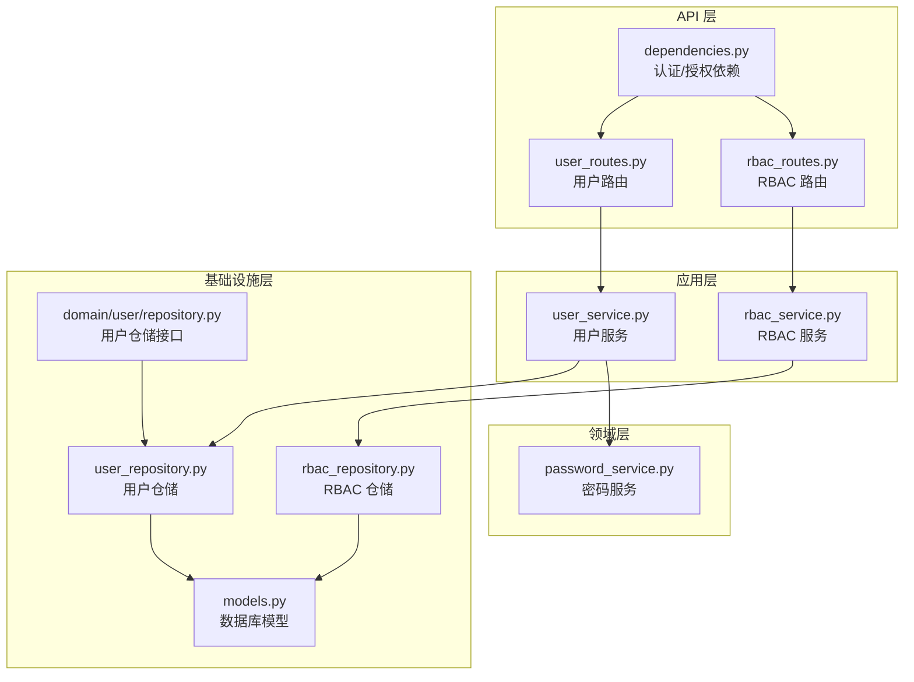
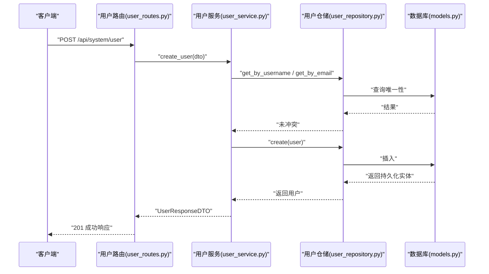
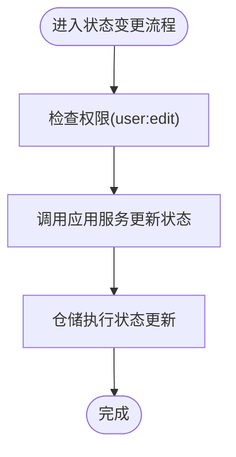
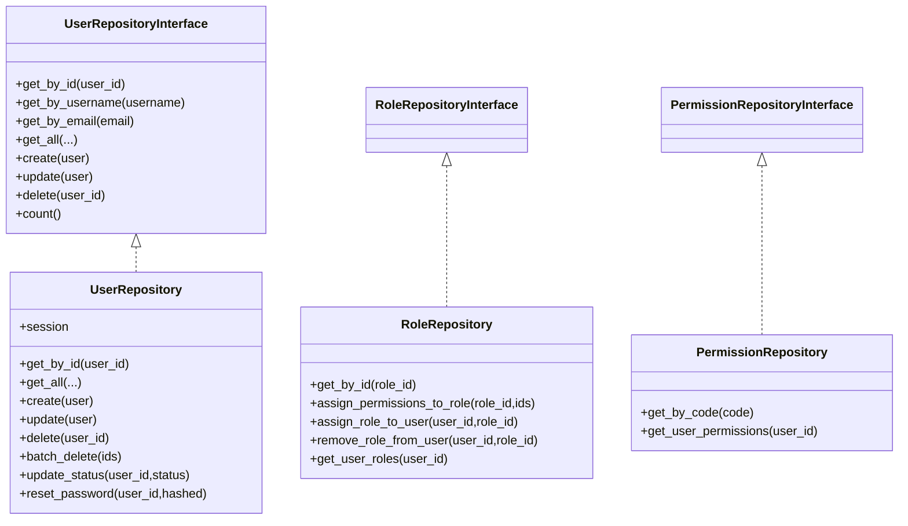
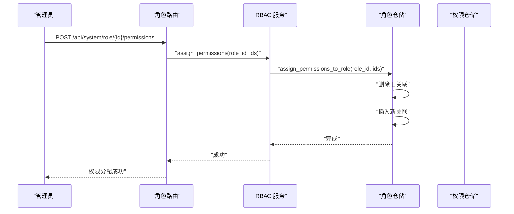
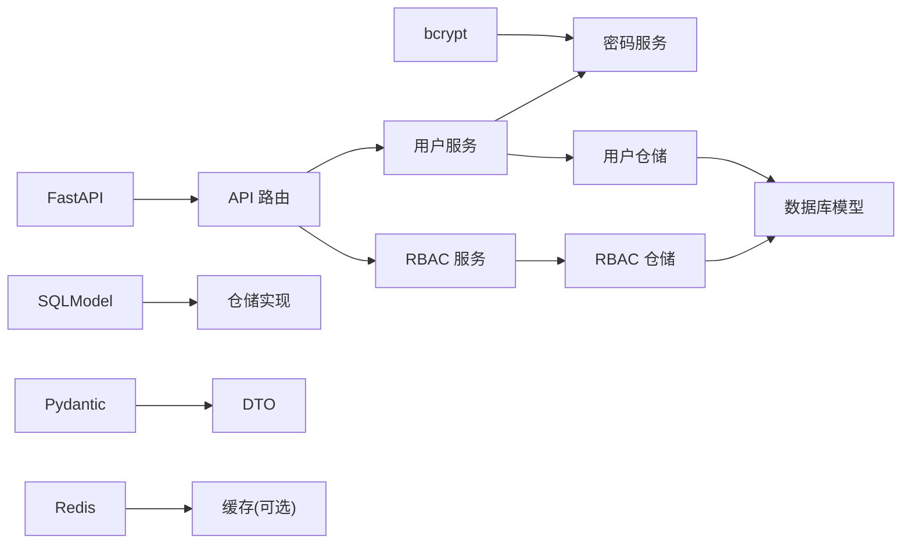

# 用户管理

<cite>
**本文引用的文件**
- [service/src/api/v1/user_routes.py](file://service/src/api/v1/user_routes.py)
- [service/src/application/services/user_service.py](file://service/src/application/services/user_service.py)
- [service/src/application/dto/user_dto.py](file://service/src/application/dto/user_dto.py)
- [service/src/infrastructure/repositories/user_repository.py](file://service/src/infrastructure/repositories/user_repository.py)
- [service/src/domain/user/repository.py](file://service/src/domain/user/repository.py)
- [service/src/infrastructure/database/models.py](file://service/src/infrastructure/database/models.py)
- [service/src/api/v1/rbac_routes.py](file://service/src/api/v1/rbac_routes.py)
- [service/src/application/services/rbac_service.py](file://service/src/application/services/rbac_service.py)
- [service/src/application/dto/rbac_dto.py](file://service/src/application/dto/rbac_dto.py)
- [service/src/infrastructure/repositories/rbac_repository.py](file://service/src/infrastructure/repositories/rbac_repository.py)
- [service/src/api/dependencies.py](file://service/src/api/dependencies.py)
- [service/src/core/exceptions.py](file://service/src/core/exceptions.py)
- [service/src/domain/auth/password_service.py](file://service/src/domain/auth/password_service.py)
- [web/src/views/system/user/index.vue](file://web/src/views/system/user/index.vue)
- [service/pyproject.toml](file://service/pyproject.toml)
</cite>

## 目录
1. [简介](#简介)
2. [项目结构](#项目结构)
3. [核心组件](#核心组件)
4. [架构总览](#架构总览)
5. [详细组件分析](#详细组件分析)
6. [依赖分析](#依赖分析)
7. [性能考虑](#性能考虑)
8. [故障排查指南](#故障排查指南)
9. [结论](#结论)
10. [附录](#附录)

## 简介
本文件面向“用户管理系统”的功能与实现，围绕用户CRUD（创建、更新、删除、查询）、数据验证与业务约束、状态管理、密码重置与修改、账户激活流程、仓储层设计与数据访问模式、权限分配与角色绑定等主题，提供系统化、可操作的技术文档。同时给出最佳实践与性能优化建议，并说明安全存储与隐私保护要点。

## 项目结构
后端采用 FastAPI + DDD（领域驱动设计）+ RBAC（基于角色的权限控制），按层次划分清晰：
- API 层：路由与依赖注入，负责请求接入与权限校验
- 应用层：业务服务编排，协调仓储与领域服务
- 领域层：密码服务等纯业务能力
- 基础设施层：SQLModel ORM、仓储实现、数据库模型
- 前端：用户管理界面示例，展示查询、新增、编辑、删除、批量删除、重置密码、状态变更、角色分配等交互

图表来源
- [service/src/api/v1/user_routes.py:1-252](file://service/src/api/v1/user_routes.py#L1-L252)
- [service/src/api/v1/rbac_routes.py:1-257](file://service/src/api/v1/rbac_routes.py#L1-L257)
- [service/src/api/dependencies.py:1-72](file://service/src/api/dependencies.py#L1-L72)
- [service/src/application/services/user_service.py:1-322](file://service/src/application/services/user_service.py#L1-L322)
- [service/src/application/services/rbac_service.py:1-231](file://service/src/application/services/rbac_service.py#L1-L231)
- [service/src/domain/auth/password_service.py:1-21](file://service/src/domain/auth/password_service.py#L1-L21)
- [service/src/infrastructure/repositories/user_repository.py:1-185](file://service/src/infrastructure/repositories/user_repository.py#L1-L185)
- [service/src/infrastructure/repositories/rbac_repository.py:1-213](file://service/src/infrastructure/repositories/rbac_repository.py#L1-L213)
- [service/src/infrastructure/database/models.py:1-193](file://service/src/infrastructure/database/models.py#L1-L193)
- [service/src/domain/user/repository.py:1-50](file://service/src/domain/user/repository.py#L1-L50)

章节来源
- [service/src/api/v1/user_routes.py:1-252](file://service/src/api/v1/user_routes.py#L1-L252)
- [service/src/api/v1/rbac_routes.py:1-257](file://service/src/api/v1/rbac_routes.py#L1-L257)
- [service/src/api/dependencies.py:1-72](file://service/src/api/dependencies.py#L1-L72)
- [service/src/application/services/user_service.py:1-322](file://service/src/application/services/user_service.py#L1-L322)
- [service/src/application/services/rbac_service.py:1-231](file://service/src/application/services/rbac_service.py#L1-L231)
- [service/src/domain/auth/password_service.py:1-21](file://service/src/domain/auth/password_service.py#L1-L21)
- [service/src/infrastructure/repositories/user_repository.py:1-185](file://service/src/infrastructure/repositories/user_repository.py#L1-L185)
- [service/src/infrastructure/repositories/rbac_repository.py:1-213](file://service/src/infrastructure/repositories/rbac_repository.py#L1-L213)
- [service/src/infrastructure/database/models.py:1-193](file://service/src/infrastructure/database/models.py#L1-L193)
- [service/src/domain/user/repository.py:1-50](file://service/src/domain/user/repository.py#L1-L50)

## 核心组件
- 用户路由与控制器：提供用户列表、详情、创建、更新、删除、批量删除、密码重置、状态变更、当前用户信息等接口；统一响应封装与权限校验
- 用户应用服务：实现业务规则（唯一性校验、密码处理、状态变更、批量删除统计等）
- 用户仓储：SQLModel 实现，支持分页、筛选、计数、批量删除、状态/密码更新
- RBAC 路由与服务：角色与权限的增删改查、角色权限分配、用户角色/权限查询
- 密码服务：基于 bcrypt 的哈希与校验
- 数据模型：用户、角色、权限、用户-角色关联、角色-权限关联等
- 认证与授权依赖：JWT 解码与校验、当前用户解析、权限检查、超级用户校验

章节来源
- [service/src/api/v1/user_routes.py:27-252](file://service/src/api/v1/user_routes.py#L27-L252)
- [service/src/application/services/user_service.py:25-322](file://service/src/application/services/user_service.py#L25-L322)
- [service/src/infrastructure/repositories/user_repository.py:17-185](file://service/src/infrastructure/repositories/user_repository.py#L17-L185)
- [service/src/api/v1/rbac_routes.py:33-257](file://service/src/api/v1/rbac_routes.py#L33-L257)
- [service/src/application/services/rbac_service.py:28-231](file://service/src/application/services/rbac_service.py#L28-L231)
- [service/src/domain/auth/password_service.py:6-21](file://service/src/domain/auth/password_service.py#L6-L21)
- [service/src/infrastructure/database/models.py:31-141](file://service/src/infrastructure/database/models.py#L31-L141)
- [service/src/api/dependencies.py:16-72](file://service/src/api/dependencies.py#L16-L72)

## 架构总览
系统遵循 DDD 分层与 Clean Architecture 思想，API 层负责请求接入与权限拦截，应用层编排业务流程，仓储层屏蔽数据访问细节，领域服务提供纯业务能力，模型定义数据结构与关系。

图表来源
- [service/src/api/v1/user_routes.py:54-74](file://service/src/api/v1/user_routes.py#L54-L74)
- [service/src/application/services/user_service.py:25-58](file://service/src/application/services/user_service.py#L25-L58)
- [service/src/infrastructure/repositories/user_repository.py:114-119](file://service/src/infrastructure/repositories/user_repository.py#L114-L119)
- [service/src/infrastructure/database/models.py:31-64](file://service/src/infrastructure/database/models.py#L31-L64)

## 详细组件分析

### 用户 CRUD 功能
- 列表查询：支持分页、用户名/手机/邮箱/状态/部门筛选，返回分页数据与总数
- 详情查询：按用户 ID 查询，不存在抛出未找到异常
- 创建用户：校验用户名与邮箱唯一性，生成哈希密码，写入扩展字段（昵称、电话、性别、头像、状态、部门、备注），返回响应 DTO（含角色与权限列表）
- 更新用户：按 DTO 非空字段选择性更新，邮箱唯一性校验，返回更新后的响应 DTO
- 删除用户：按 ID 删除，不存在抛出未找到异常
- 批量删除：按 ID 列表循环删除，返回删除数量与请求总数
- 密码重置：管理员重置指定用户密码，生成哈希后更新
- 状态变更：管理员更新用户状态（0-禁用，1-启用）
- 当前用户信息：返回当前登录用户完整信息（含角色与权限）

章节来源
- [service/src/api/v1/user_routes.py:27-252](file://service/src/api/v1/user_routes.py#L27-L252)
- [service/src/application/services/user_service.py:59-322](file://service/src/application/services/user_service.py#L59-L322)
- [service/src/infrastructure/repositories/user_repository.py:32-185](file://service/src/infrastructure/repositories/user_repository.py#L32-L185)
- [service/src/application/dto/user_dto.py:8-86](file://service/src/application/dto/user_dto.py#L8-L86)

### 数据验证规则与业务约束
- 用户创建/更新 DTO 使用 Pydantic 校验：最小/最大长度、必填、别名映射、数值范围
- 唯一性约束：用户名与邮箱在创建/更新时进行唯一性检查，冲突抛出冲突异常
- 密码处理：明文密码经 bcrypt 哈希后存储，修改密码需验证旧密码正确性
- 状态取值：0-禁用，1-启用
- 分页参数：pageNum ≥ 1，pageSize ∈ [1,100]
- 响应 DTO：包含角色与权限列表，便于前端直接使用

章节来源
- [service/src/application/dto/user_dto.py:8-86](file://service/src/application/dto/user_dto.py#L8-L86)
- [service/src/application/services/user_service.py:37-41](file://service/src/application/services/user_service.py#L37-L41)
- [service/src/application/services/user_service.py:134-137](file://service/src/application/services/user_service.py#L134-L137)
- [service/src/domain/auth/password_service.py:9-21](file://service/src/domain/auth/password_service.py#L9-L21)
- [service/src/core/exceptions.py:13-25](file://service/src/core/exceptions.py#L13-L25)

### 用户状态管理、密码重置与账户激活
- 状态管理：提供状态更新接口，支持 0/1 状态切换
- 密码重置：管理员调用重置接口，生成新哈希密码并保存
- 密码修改：当前用户凭正确旧密码方可修改
- 账户激活：通过状态字段控制（启用/禁用），前端可结合状态字段进行激活/停用操作

图表来源
- [service/src/api/v1/user_routes.py:209-231](file://service/src/api/v1/user_routes.py#L209-L231)
- [service/src/application/services/user_service.py:210-225](file://service/src/application/services/user_service.py#L210-L225)
- [service/src/infrastructure/repositories/user_repository.py:152-167](file://service/src/infrastructure/repositories/user_repository.py#L152-L167)

章节来源
- [service/src/api/v1/user_routes.py:185-231](file://service/src/api/v1/user_routes.py#L185-L231)
- [service/src/application/services/user_service.py:189-225](file://service/src/application/services/user_service.py#L189-L225)
- [service/src/infrastructure/repositories/user_repository.py:152-184](file://service/src/infrastructure/repositories/user_repository.py#L152-L184)

### 仓储层设计与数据访问模式
- 用户仓储接口：定义按 ID/用户名/邮箱查询、分页列表、计数、创建、更新、删除、批量删除、状态/密码更新等抽象
- 用户仓储实现：基于 SQLModel 的查询构建、分页偏移计算、条件拼接、flush/refresh 等生命周期管理
- RBAC 仓储：角色与权限的 CRUD、角色权限分配（先清后增）、用户角色/权限查询
- 模型关系：用户-角色多对多、角色-权限多对多，均通过关联表维护

图表来源
- [service/src/domain/user/repository.py:8-50](file://service/src/domain/user/repository.py#L8-L50)
- [service/src/infrastructure/repositories/user_repository.py:11-185](file://service/src/infrastructure/repositories/user_repository.py#L11-L185)
- [service/src/infrastructure/repositories/rbac_repository.py:11-213](file://service/src/infrastructure/repositories/rbac_repository.py#L11-L213)

章节来源
- [service/src/domain/user/repository.py:1-50](file://service/src/domain/user/repository.py#L1-L50)
- [service/src/infrastructure/repositories/user_repository.py:1-185](file://service/src/infrastructure/repositories/user_repository.py#L1-L185)
- [service/src/infrastructure/repositories/rbac_repository.py:1-213](file://service/src/infrastructure/repositories/rbac_repository.py#L1-L213)

### 权限分配与角色绑定
- 角色管理：创建/更新/删除角色，支持按名称与状态筛选分页
- 权限管理：创建/删除权限，支持按名称筛选分页
- 角色权限分配：先清理旧关联，再建立新关联
- 用户角色分配/移除：检查重复分配，支持查询用户角色与权限
- 权限检查：基于用户角色推导权限集合，进行精确匹配

图表来源
- [service/src/api/v1/rbac_routes.py:154-177](file://service/src/api/v1/rbac_routes.py#L154-L177)
- [service/src/application/services/rbac_service.py:121-129](file://service/src/application/services/rbac_service.py#L121-L129)
- [service/src/infrastructure/repositories/rbac_repository.py:84-96](file://service/src/infrastructure/repositories/rbac_repository.py#L84-L96)

章节来源
- [service/src/api/v1/rbac_routes.py:33-257](file://service/src/api/v1/rbac_routes.py#L33-L257)
- [service/src/application/services/rbac_service.py:28-231](file://service/src/application/services/rbac_service.py#L28-L231)
- [service/src/application/dto/rbac_dto.py:8-88](file://service/src/application/dto/rbac_dto.py#L8-L88)
- [service/src/infrastructure/repositories/rbac_repository.py:1-213](file://service/src/infrastructure/repositories/rbac_repository.py#L1-L213)

### 前端用户管理界面
- 支持搜索（用户名、手机号、状态）、分页、批量删除、单条删除、修改、重置密码、分配角色等
- 与后端接口对接，实现完整的用户管理闭环

章节来源
- [web/src/views/system/user/index.vue:1-200](file://web/src/views/system/user/index.vue#L1-L200)

## 依赖分析
- 外部依赖：FastAPI、SQLModel、aiosqlite/asyncpg、Pydantic、bcrypt、Redis、HTTPX、loguru 等
- 内部模块耦合：API 依赖应用服务；应用服务依赖仓储与领域服务；仓储依赖模型；RBAC 与用户模块共享权限模型

图表来源
- [service/pyproject.toml:7-20](file://service/pyproject.toml#L7-L20)
- [service/src/api/v1/user_routes.py:1-252](file://service/src/api/v1/user_routes.py#L1-L252)
- [service/src/application/services/user_service.py:1-322](file://service/src/application/services/user_service.py#L1-L322)
- [service/src/application/services/rbac_service.py:1-231](file://service/src/application/services/rbac_service.py#L1-L231)
- [service/src/infrastructure/repositories/user_repository.py:1-185](file://service/src/infrastructure/repositories/user_repository.py#L1-L185)
- [service/src/infrastructure/repositories/rbac_repository.py:1-213](file://service/src/infrastructure/repositories/rbac_repository.py#L1-L213)
- [service/src/infrastructure/database/models.py:1-193](file://service/src/infrastructure/database/models.py#L1-L193)
- [service/src/domain/auth/password_service.py:1-21](file://service/src/domain/auth/password_service.py#L1-L21)

章节来源
- [service/pyproject.toml:1-76](file://service/pyproject.toml#L1-L76)

## 性能考虑
- 分页与筛选：仓储层已实现分页与条件过滤，建议前端合理设置 pageSize，避免过大分页
- 唯一性检查：创建/更新时对用户名与邮箱进行查询，建议在数据库层面确保索引与唯一约束
- 密码哈希：bcrypt 开销较高，建议在批量导入场景下异步处理或批量化调度
- 缓存策略：可对热点用户信息与权限集合做短期缓存，降低数据库压力
- 并发控制：批量删除与状态更新建议加锁或幂等设计，避免并发冲突
- 日志与监控：结合 loguru 与中间件记录关键操作，便于性能分析与问题定位

## 故障排查指南
- 401 未认证/令牌无效：检查 JWT 令牌是否有效、类型是否为 access、负载是否包含 sub
- 403 权限不足：确认当前用户是否具备所需权限（如 user:add、user:edit、user:delete、user:view）
- 404 资源不存在：用户/角色/权限 ID 错误或已被删除
- 409 冲突：用户名或邮箱重复
- 422 参数校验失败：DTO 字段长度、范围、必填等不符合约束
- 429 请求过于频繁：触发限流策略

章节来源
- [service/src/api/dependencies.py:16-72](file://service/src/api/dependencies.py#L16-L72)
- [service/src/core/exceptions.py:13-60](file://service/src/core/exceptions.py#L13-L60)

## 结论
该用户管理系统以 DDD 为核心，结合 FastAPI 的强类型与异步特性，实现了完善的用户 CRUD、RBAC 权限体系、密码安全与状态管理。通过清晰的分层与仓储抽象，系统具备良好的可维护性与扩展性。建议在生产环境中进一步完善缓存、限流与审计日志机制，并持续优化数据库索引与查询计划。

## 附录
- 最佳实践
  - DTO 校验前置，尽早失败
  - 唯一性检查在事务内进行，避免竞态
  - 密码处理使用 bcrypt，禁止明文存储
  - 权限检查在路由依赖中集中处理
  - 批量操作使用事务或幂等设计
- 安全与隐私
  - 密码必须哈希存储
  - 传输层使用 HTTPS
  - 严格限制敏感字段暴露（如密码字段）
  - 审计日志记录关键操作（创建、更新、删除、重置密码、状态变更、角色分配）