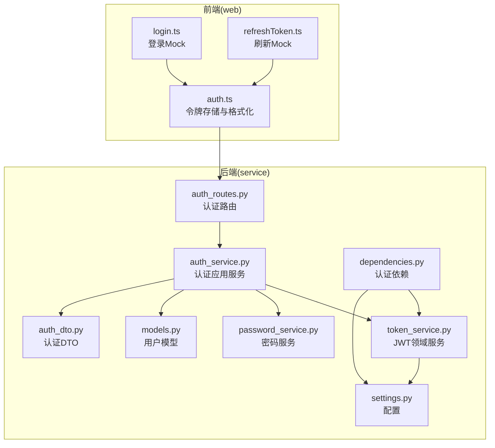
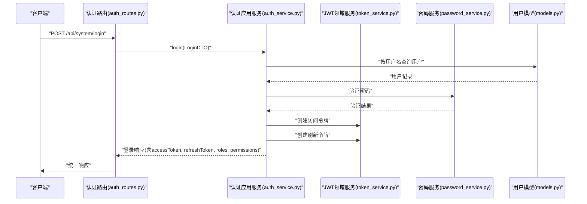
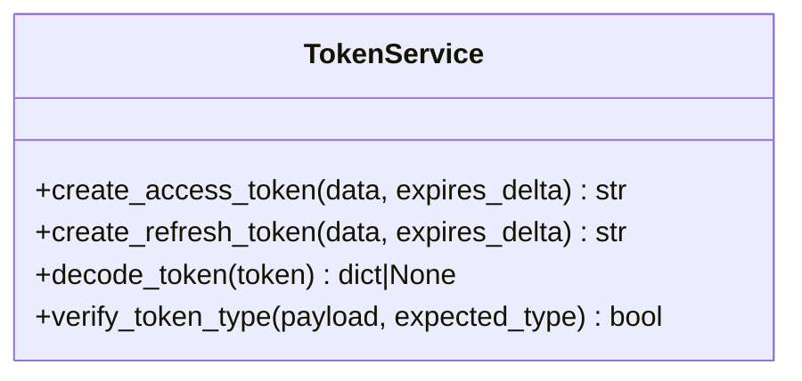
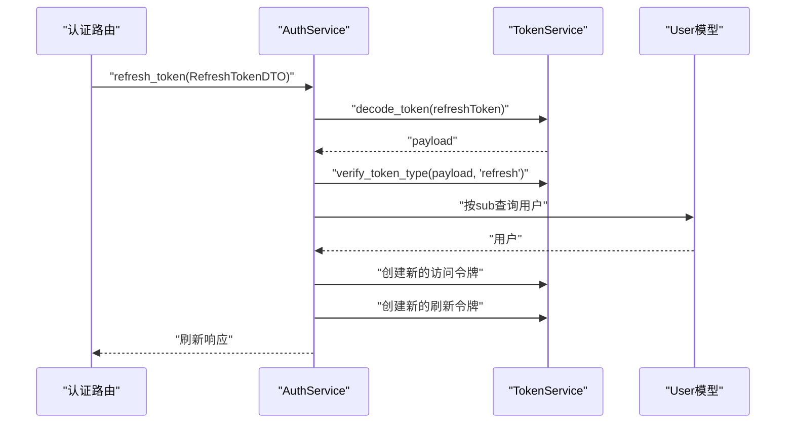
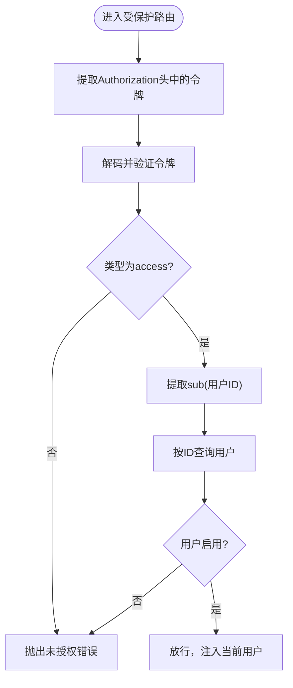
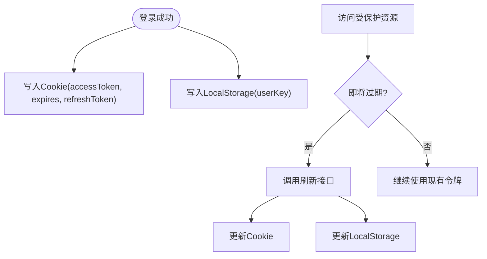
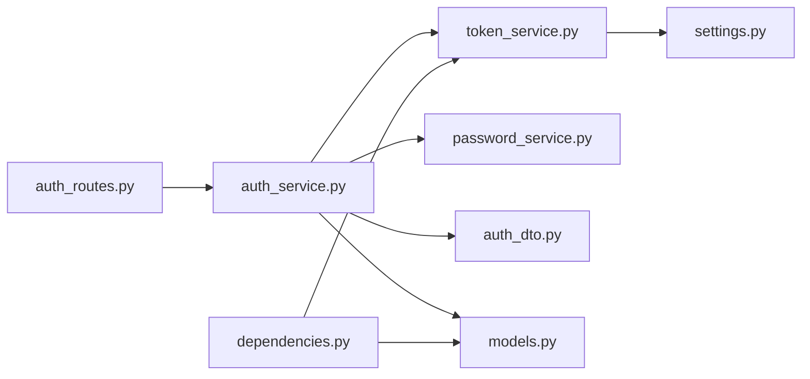

# JWT 令牌管理

<cite>
**本文引用的文件**
- [token_service.py](file://service/src/domain/auth/token_service.py)
- [auth_service.py](file://service/src/application/services/auth_service.py)
- [auth_routes.py](file://service/src/api/v1/auth_routes.py)
- [settings.py](file://service/src/config/settings.py)
- [auth_dto.py](file://service/src/application/dto/auth_dto.py)
- [dependencies.py](file://service/src/api/dependencies.py)
- [password_service.py](file://service/src/domain/auth/password_service.py)
- [models.py](file://service/src/infrastructure/database/models.py)
- [auth.ts](file://web/src/utils/auth.ts)
- [login.ts](file://web/mock/login.ts)
- [refreshToken.ts](file://web/mock/refreshToken.ts)
- [test_auth.py](file://service/tests/unit/test_auth.py)
</cite>

## 目录
1. [简介](#简介)
2. [项目结构](#项目结构)
3. [核心组件](#核心组件)
4. [架构总览](#架构总览)
5. [详细组件分析](#详细组件分析)
6. [依赖分析](#依赖分析)
7. [性能考量](#性能考量)
8. [故障排查指南](#故障排查指南)
9. [结论](#结论)
10. [附录](#附录)

## 简介
本文件面向JWT（JSON Web Token）令牌管理系统，基于仓库中的FastAPI后端与Vue前端实现，系统性阐述以下主题：
- JWT生成算法、签名机制与有效期管理
- 访问令牌与刷新令牌的区别、使用场景与安全策略
- 令牌的编码与解码过程、负载结构与声明类型
- 令牌验证流程、过期处理与撤销机制
- 具体的代码示例路径（以文件与行号定位）
- 令牌存储的安全考虑与最佳实践

## 项目结构
该系统采用分层架构：API层负责路由与HTTP交互；应用层封装业务流程；领域层提供核心业务能力（如密码与令牌服务）；基础设施层负责数据库与缓存；前端通过Cookie与LocalStorage存储令牌。

**图表来源**
- [auth_routes.py:1-86](file://service/src/api/v1/auth_routes.py#L1-L86)
- [auth_service.py:1-154](file://service/src/application/services/auth_service.py#L1-L154)
- [token_service.py:1-45](file://service/src/domain/auth/token_service.py#L1-L45)
- [password_service.py:1-21](file://service/src/domain/auth/password_service.py#L1-L21)
- [auth_dto.py:1-54](file://service/src/application/dto/auth_dto.py#L1-L54)
- [dependencies.py:1-72](file://service/src/api/dependencies.py#L1-L72)
- [settings.py:1-198](file://service/src/config/settings.py#L1-L198)
- [models.py:1-193](file://service/src/infrastructure/database/models.py#L1-L193)
- [auth.ts:1-142](file://web/src/utils/auth.ts#L1-L142)
- [login.ts:1-45](file://web/mock/login.ts#L1-L45)
- [refreshToken.ts:1-30](file://web/mock/refreshToken.ts#L1-L30)

**章节来源**
- [auth_routes.py:1-86](file://service/src/api/v1/auth_routes.py#L1-L86)
- [auth_service.py:1-154](file://service/src/application/services/auth_service.py#L1-L154)
- [token_service.py:1-45](file://service/src/domain/auth/token_service.py#L1-L45)
- [password_service.py:1-21](file://service/src/domain/auth/password_service.py#L1-L21)
- [auth_dto.py:1-54](file://service/src/application/dto/auth_dto.py#L1-L54)
- [dependencies.py:1-72](file://service/src/api/dependencies.py#L1-L72)
- [settings.py:1-198](file://service/src/config/settings.py#L1-L198)
- [models.py:1-193](file://service/src/infrastructure/database/models.py#L1-L193)
- [auth.ts:1-142](file://web/src/utils/auth.ts#L1-L142)
- [login.ts:1-45](file://web/mock/login.ts#L1-L45)
- [refreshToken.ts:1-30](file://web/mock/refreshToken.ts#L1-L30)

## 核心组件
- JWT领域服务：负责访问令牌与刷新令牌的创建、解码与类型校验。
- 认证应用服务：封装登录、注册、刷新令牌的业务流程，并查询用户角色与权限。
- 认证路由：对外暴露登录、注册、登出、刷新等接口。
- 认证依赖：从HTTP头中提取并验证访问令牌，派生当前用户。
- 配置：集中管理JWT密钥、算法与有效期等参数。
- 前端工具：负责令牌的存储、格式化与无感刷新策略。

**章节来源**
- [token_service.py:11-45](file://service/src/domain/auth/token_service.py#L11-L45)
- [auth_service.py:15-154](file://service/src/application/services/auth_service.py#L15-L154)
- [auth_routes.py:19-86](file://service/src/api/v1/auth_routes.py#L19-L86)
- [dependencies.py:16-43](file://service/src/api/dependencies.py#L16-L43)
- [settings.py:63-67](file://service/src/config/settings.py#L63-L67)
- [auth.ts:34-123](file://web/src/utils/auth.ts#L34-L123)

## 架构总览
系统遵循“无状态”JWT认证范式：服务端不维护会话，仅通过密钥验证令牌有效性。前端在登录成功后接收访问令牌与刷新令牌，前者用于受保护资源访问，后者用于在过期后换取新的访问令牌。

**图表来源**
- [auth_routes.py:19-34](file://service/src/api/v1/auth_routes.py#L19-L34)
- [auth_service.py:26-74](file://service/src/application/services/auth_service.py#L26-L74)
- [token_service.py:14-30](file://service/src/domain/auth/token_service.py#L14-L30)
- [password_service.py:18-21](file://service/src/domain/auth/password_service.py#L18-L21)
- [models.py:31-64](file://service/src/infrastructure/database/models.py#L31-L64)

## 详细组件分析

### JWT领域服务（TokenService）
- 生成算法与签名机制
  - 使用对称加密算法（默认HS256），通过密钥对载荷进行签名。
  - 密钥与算法来自配置，确保一致性与安全性。
- 有效期管理
  - 访问令牌：以分钟为单位配置过期时间。
  - 刷新令牌：以天为单位配置过期时间，通常远长于访问令牌。
- 载荷结构与声明
  - 标准声明：exp（过期时间）。
  - 自定义声明：type（令牌类型，区分access与refresh）。
  - 业务声明：sub（用户标识）、username（用户名）等。
- 解码与验证
  - 解码失败或签名不匹配时返回空，调用方据此判定无效。

**图表来源**
- [token_service.py:11-45](file://service/src/domain/auth/token_service.py#L11-L45)

**章节来源**
- [token_service.py:14-44](file://service/src/domain/auth/token_service.py#L14-L44)
- [settings.py:63-67](file://service/src/config/settings.py#L63-L67)

### 认证应用服务（AuthService）
- 登录流程
  - 校验用户名与密码，检查用户状态。
  - 生成访问令牌与刷新令牌，查询用户角色与权限，构建完整登录响应。
- 注册流程
  - 校验用户名唯一性，对密码进行哈希，创建启用状态的用户。
- 刷新令牌流程
  - 解码并校验刷新令牌类型，确认用户存在且启用，生成新的访问令牌与刷新令牌。

**图表来源**
- [auth_routes.py:70-85](file://service/src/api/v1/auth_routes.py#L70-L85)
- [auth_service.py:118-153](file://service/src/application/services/auth_service.py#L118-L153)
- [token_service.py:33-44](file://service/src/domain/auth/token_service.py#L33-L44)
- [models.py:31-64](file://service/src/infrastructure/database/models.py#L31-L64)

**章节来源**
- [auth_service.py:26-153](file://service/src/application/services/auth_service.py#L26-L153)
- [auth_dto.py:22-24](file://service/src/application/dto/auth_dto.py#L22-L24)

### 认证依赖（依赖注入与令牌验证）
- 从HTTP Authorization头中提取令牌并解码。
- 校验令牌类型必须为access，否则拒绝访问。
- 从载荷提取用户标识，再次从数据库校验用户存在且启用。

**图表来源**
- [dependencies.py:16-43](file://service/src/api/dependencies.py#L16-L43)
- [token_service.py:33-44](file://service/src/domain/auth/token_service.py#L33-L44)
- [models.py:31-64](file://service/src/infrastructure/database/models.py#L31-L64)

**章节来源**
- [dependencies.py:16-43](file://service/src/api/dependencies.py#L16-L43)

### 前端令牌管理（auth.ts）
- 存储策略
  - 访问令牌与过期时间、刷新令牌以Cookie形式存储，便于跨页面共享且可设置过期。
  - 用户信息（头像、用户名、昵称、角色、权限等）以LocalStorage持久化，支持多标签页登录。
- 无感刷新
  - 基于后端返回的expires时间，计算剩余有效期，在过期前触发刷新接口，更新Cookie与LocalStorage。
- 格式化
  - 对令牌进行“Bearer ”前缀格式化，便于HTTP请求头携带。

**图表来源**
- [auth.ts:48-123](file://web/src/utils/auth.ts#L48-L123)
- [login.ts:8-25](file://web/mock/login.ts#L8-L25)
- [refreshToken.ts:8-27](file://web/mock/refreshToken.ts#L8-L27)

**章节来源**
- [auth.ts:34-123](file://web/src/utils/auth.ts#L34-L123)
- [login.ts:8-25](file://web/mock/login.ts#L8-L25)
- [refreshToken.ts:8-27](file://web/mock/refreshToken.ts#L8-L27)

### 配置与数据模型
- 配置
  - JWT密钥、算法、访问令牌过期分钟数、刷新令牌过期天数。
- 数据模型
  - 用户模型包含启用状态字段，配合令牌验证流程进行账户有效性检查。

**章节来源**
- [settings.py:63-67](file://service/src/config/settings.py#L63-L67)
- [models.py:31-64](file://service/src/infrastructure/database/models.py#L31-L64)

## 依赖分析
- 组件耦合
  - API层依赖应用服务；应用服务依赖领域服务与仓储；领域服务依赖配置；认证依赖依赖领域服务与仓储。
- 外部依赖
  - JWT库用于编码/解码；bcrypt用于密码哈希；Redis客户端用于缓存（可扩展）。
- 循环依赖
  - 未发现循环导入；各层职责清晰。

**图表来源**
- [auth_routes.py:1-86](file://service/src/api/v1/auth_routes.py#L1-L86)
- [auth_service.py:1-154](file://service/src/application/services/auth_service.py#L1-L154)
- [token_service.py:1-45](file://service/src/domain/auth/token_service.py#L1-L45)
- [password_service.py:1-21](file://service/src/domain/auth/password_service.py#L1-L21)
- [auth_dto.py:1-54](file://service/src/application/dto/auth_dto.py#L1-L54)
- [dependencies.py:1-72](file://service/src/api/dependencies.py#L1-L72)
- [settings.py:1-198](file://service/src/config/settings.py#L1-L198)
- [models.py:1-193](file://service/src/infrastructure/database/models.py#L1-L193)

**章节来源**
- [auth_routes.py:1-86](file://service/src/api/v1/auth_routes.py#L1-L86)
- [auth_service.py:1-154](file://service/src/application/services/auth_service.py#L1-L154)
- [token_service.py:1-45](file://service/src/domain/auth/token_service.py#L1-L45)
- [dependencies.py:1-72](file://service/src/api/dependencies.py#L1-L72)

## 性能考量
- 令牌验证为O(1)，仅需解码与校验签名，开销极低。
- 密码哈希采用bcrypt，成本因子适中，兼顾安全性与性能。
- 建议
  - 将频繁访问的用户信息缓存至Redis，减少数据库查询。
  - 控制访问令牌过期时间，缩短刷新令牌有效期，降低泄露风险。
  - 对高并发接口开启限流与熔断，避免令牌风暴。

## 故障排查指南
- 常见问题
  - 令牌无效：检查密钥是否一致、算法是否匹配、签名是否被篡改。
  - 类型错误：确认使用了正确的令牌类型（访问令牌用于资源访问，刷新令牌用于换取新令牌）。
  - 用户被禁用：登录后若用户状态异常，将导致令牌验证失败。
  - 前端存储丢失：确认Cookie与LocalStorage的键名与过期策略。
- 定位方法
  - 后端：查看认证依赖与应用服务的日志与异常抛出点。
  - 前端：检查auth.ts中的存储逻辑与无感刷新时机。

**章节来源**
- [dependencies.py:16-43](file://service/src/api/dependencies.py#L16-L43)
- [auth_service.py:118-153](file://service/src/application/services/auth_service.py#L118-L153)
- [auth.ts:34-123](file://web/src/utils/auth.ts#L34-L123)

## 结论
本系统采用标准JWT无状态认证，结合访问令牌与刷新令牌的双轨策略，实现了安全、可扩展的用户认证体系。通过明确的分层设计与严格的令牌验证流程，既保证了用户体验，也强化了安全性。建议在生产环境中进一步引入黑名单与撤销机制、短令牌长刷新、以及更细粒度的权限控制。

## 附录

### 令牌生命周期与最佳实践
- 生命周期
  - 访问令牌：短期有效，用于日常资源访问。
  - 刷新令牌：长期有效但需严格保护，用于换取新的访问令牌。
- 最佳实践
  - 令牌仅通过HTTPS传输，Cookie设置HttpOnly与SameSite。
  - 刷新令牌单独存储，定期轮换。
  - 引入黑名单与撤销机制，支持用户登出与吊销。
  - 对敏感操作增加二次验证与动态权限校验。

### 代码示例路径（不含具体代码内容）
- 创建访问令牌
  - [token_service.py:14-21](file://service/src/domain/auth/token_service.py#L14-L21)
- 创建刷新令牌
  - [token_service.py:24-30](file://service/src/domain/auth/token_service.py#L24-L30)
- 解码与验证令牌
  - [token_service.py:33-39](file://service/src/domain/auth/token_service.py#L33-L39)
- 校验令牌类型
  - [token_service.py:42-44](file://service/src/domain/auth/token_service.py#L42-L44)
- 登录流程（生成令牌与返回角色/权限）
  - [auth_service.py:26-74](file://service/src/application/services/auth_service.py#L26-L74)
- 刷新令牌流程
  - [auth_service.py:118-153](file://service/src/application/services/auth_service.py#L118-L153)
- 受保护路由的令牌验证
  - [dependencies.py:16-43](file://service/src/api/dependencies.py#L16-L43)
- 前端存储与无感刷新
  - [auth.ts:34-123](file://web/src/utils/auth.ts#L34-L123)
- 单元测试（覆盖令牌创建、解码与类型校验）
  - [test_auth.py:30-67](file://service/tests/unit/test_auth.py#L30-L67)