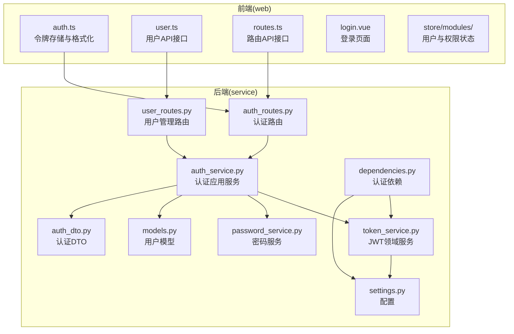
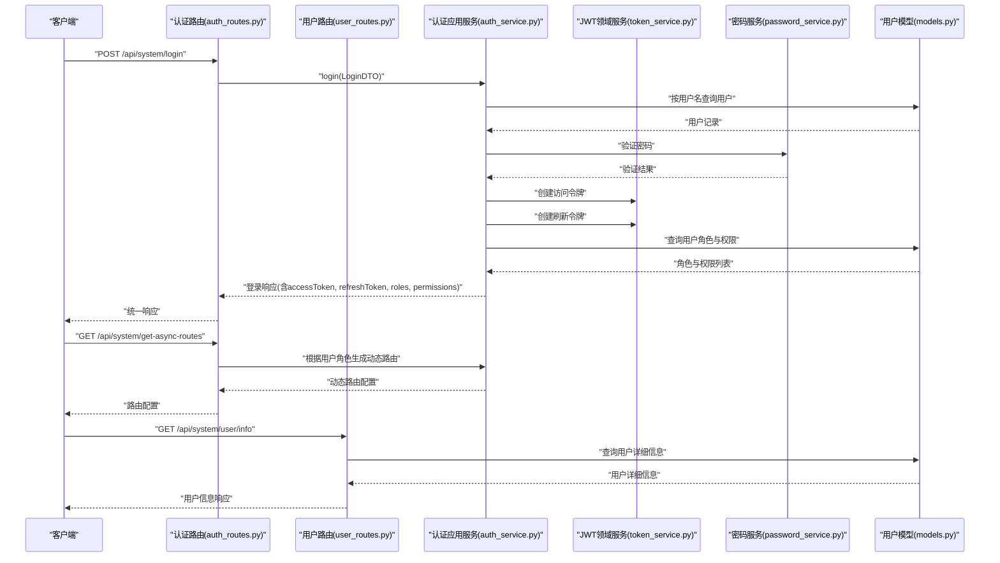
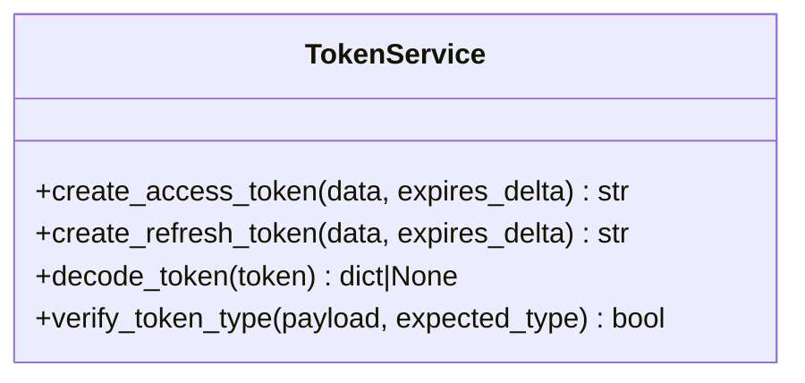
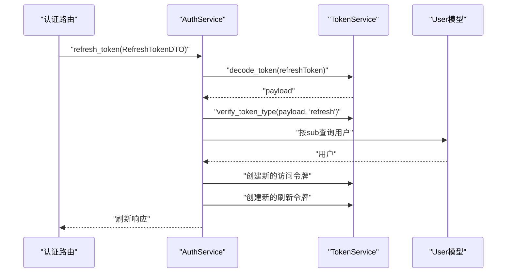
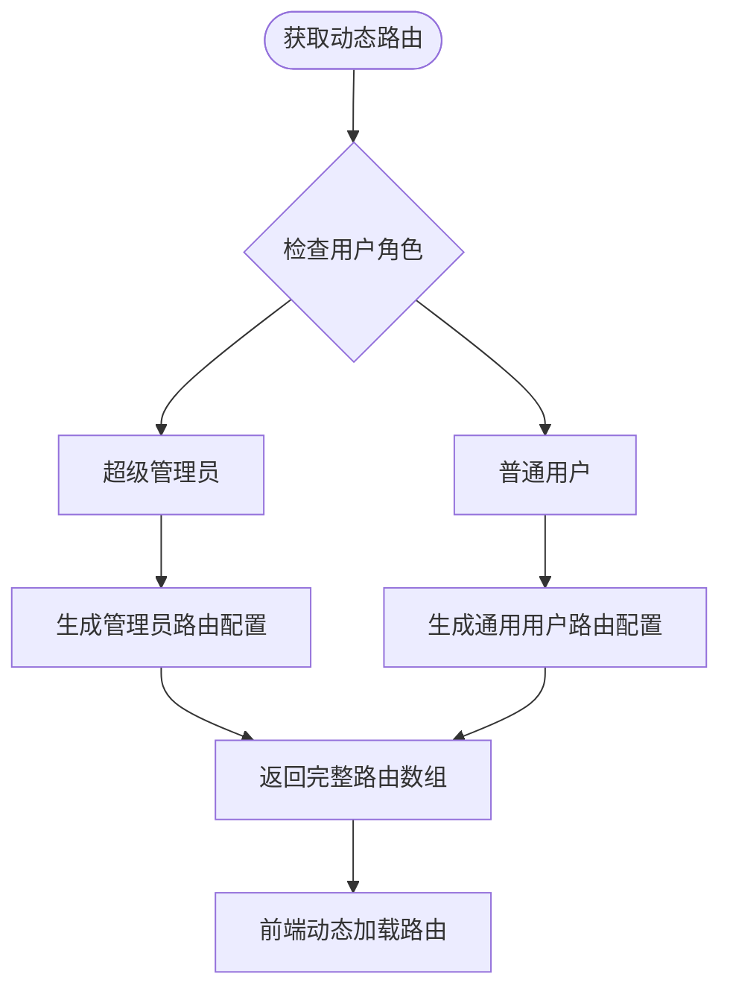
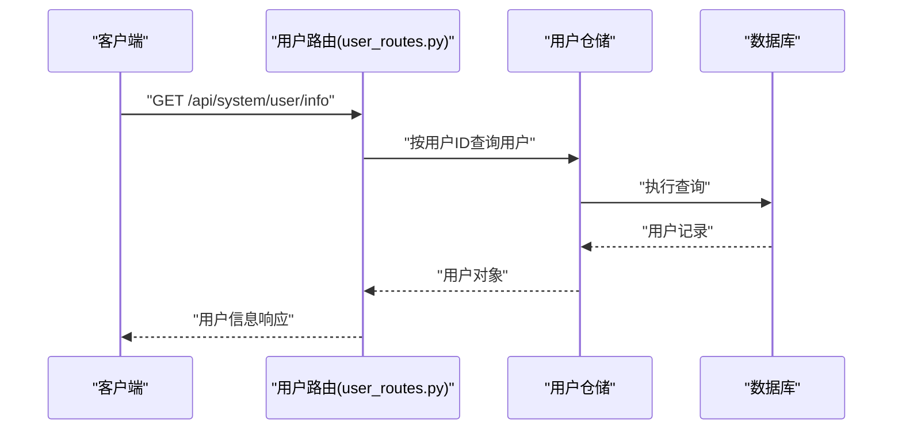
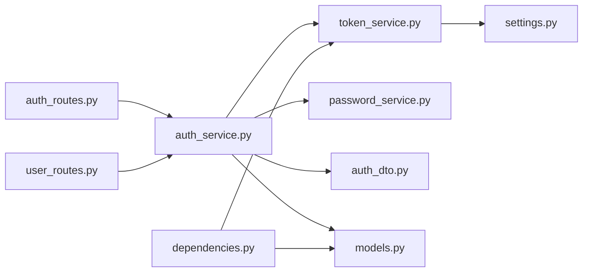

# JWT 令牌管理

<cite>
**本文引用的文件**
- [token_service.py](file://service/src/domain/auth/token_service.py)
- [auth_service.py](file://service/src/application/services/auth_service.py)
- [auth_routes.py](file://service/src/api/v1/auth_routes.py)
- [user_routes.py](file://service/src/api/v1/user_routes.py)
- [settings.py](file://service/src/config/settings.py)
- [auth_dto.py](file://service/src/application/dto/auth_dto.py)
- [dependencies.py](file://service/src/api/dependencies.py)
- [password_service.py](file://service/src/domain/auth/password_service.py)
- [models.py](file://service/src/infrastructure/database/models.py)
- [auth.ts](file://web/src/utils/auth.ts)
- [user.ts](file://web/src/api/user.ts)
- [routes.ts](file://web/src/api/routes.ts)
- [login.ts](file://web/mock/login.ts)
- [refreshToken.ts](file://web/mock/refreshToken.ts)
- [test_auth.py](file://service/tests/unit/test_auth.py)
</cite>

## 更新摘要
**所做更改**
- 新增动态路由生成功能，支持基于用户角色的菜单权限控制
- 新增用户信息获取接口，提供完整的用户个人信息查询
- 优化刷新令牌流程，改进令牌过期时间处理
- 增强前端路由管理和权限控制机制
- 完善用户角色和权限的数据结构

## 目录
1. [简介](#简介)
2. [项目结构](#项目结构)
3. [核心组件](#核心组件)
4. [架构总览](#架构总览)
5. [详细组件分析](#详细组件分析)
6. [依赖分析](#依赖分析)
7. [性能考量](#性能考量)
8. [故障排查指南](#故障排查指南)
9. [结论](#结论)
10. [附录](#附录)

## 简介
本文件面向JWT（JSON Web Token）令牌管理系统，基于仓库中的FastAPI后端与Vue前端实现，系统性阐述以下主题：
- JWT生成算法、签名机制与有效期管理
- 访问令牌与刷新令牌的区别、使用场景与安全策略
- 令牌的编码与解码过程、负载结构与声明类型
- 令牌验证流程、过期处理与撤销机制
- 动态路由生成功能与用户信息获取接口
- 具体的代码示例路径（以文件与行号定位）
- 令牌存储的安全考虑与最佳实践

## 项目结构
该系统采用分层架构：API层负责路由与HTTP交互；应用层封装业务流程；领域层提供核心业务能力（如密码与令牌服务）；基础设施层负责数据库与缓存；前端通过Cookie与LocalStorage存储令牌，并支持动态路由生成。

**图表来源**
- [auth_routes.py:1-391](file://service/src/api/v1/auth_routes.py#L1-L391)
- [user_routes.py:1-264](file://service/src/api/v1/user_routes.py#L1-L264)
- [auth_service.py:1-164](file://service/src/application/services/auth_service.py#L1-L164)
- [token_service.py:1-45](file://service/src/domain/auth/token_service.py#L1-L45)
- [password_service.py:1-21](file://service/src/domain/auth/password_service.py#L1-L21)
- [auth_dto.py:1-54](file://service/src/application/dto/auth_dto.py#L1-L54)
- [dependencies.py:1-72](file://service/src/api/dependencies.py#L1-L72)
- [settings.py:1-198](file://service/src/config/settings.py#L1-L198)
- [models.py:1-193](file://service/src/infrastructure/database/models.py#L1-L193)
- [auth.ts:1-142](file://web/src/utils/auth.ts#L1-L142)
- [user.ts:1-94](file://web/src/api/user.ts#L1-L94)
- [routes.ts:1-12](file://web/src/api/routes.ts#L1-L12)

**章节来源**
- [auth_routes.py:1-391](file://service/src/api/v1/auth_routes.py#L1-L391)
- [user_routes.py:1-264](file://service/src/api/v1/user_routes.py#L1-L264)
- [auth_service.py:1-164](file://service/src/application/services/auth_service.py#L1-L164)
- [token_service.py:1-45](file://service/src/domain/auth/token_service.py#L1-L45)
- [password_service.py:1-21](file://service/src/domain/auth/password_service.py#L1-L21)
- [auth_dto.py:1-54](file://service/src/application/dto/auth_dto.py#L1-L54)
- [dependencies.py:1-72](file://service/src/api/dependencies.py#L1-L72)
- [settings.py:1-198](file://service/src/config/settings.py#L1-L198)
- [models.py:1-193](file://service/src/infrastructure/database/models.py#L1-L193)
- [auth.ts:1-142](file://web/src/utils/auth.ts#L1-L142)
- [user.ts:1-94](file://web/src/api/user.ts#L1-L94)
- [routes.ts:1-12](file://web/src/api/routes.ts#L1-L12)

## 核心组件
- JWT领域服务：负责访问令牌与刷新令牌的创建、解码与类型校验。
- 认证应用服务：封装登录、注册、刷新令牌的业务流程，并查询用户角色与权限。
- 认证路由：对外暴露登录、注册、登出、刷新等接口，新增动态路由生成和用户信息获取功能。
- 用户管理路由：提供用户信息查询、角色管理和权限分配等接口。
- 认证依赖：从HTTP头中提取并验证访问令牌，派生当前用户。
- 配置：集中管理JWT密钥、算法与有效期等参数。
- 前端工具：负责令牌的存储、格式化与无感刷新策略，支持动态路由生成。

**章节来源**
- [token_service.py:11-45](file://service/src/domain/auth/token_service.py#L11-L45)
- [auth_service.py:17-164](file://service/src/application/services/auth_service.py#L17-L164)
- [auth_routes.py:23-292](file://service/src/api/v1/auth_routes.py#L23-L292)
- [user_routes.py:88-104](file://service/src/api/v1/user_routes.py#L88-L104)
- [dependencies.py:16-43](file://service/src/api/dependencies.py#L16-L43)
- [settings.py:63-67](file://service/src/config/settings.py#L63-L67)
- [auth.ts:34-123](file://web/src/utils/auth.ts#L34-L123)

## 架构总览
系统遵循"无状态"JWT认证范式：服务端不维护会话，仅通过密钥验证令牌有效性。前端在登录成功后接收访问令牌与刷新令牌，前者用于受保护资源访问，后者用于在过期后换取新的访问令牌。新增的动态路由生成功能允许根据用户角色实时生成菜单权限。

**图表来源**
- [auth_routes.py:23-89](file://service/src/api/v1/auth_routes.py#L23-L89)
- [auth_routes.py:137-292](file://service/src/api/v1/auth_routes.py#L137-L292)
- [user_routes.py:88-104](file://service/src/api/v1/user_routes.py#L88-L104)
- [auth_service.py:28-80](file://service/src/application/services/auth_service.py#L28-L80)
- [token_service.py:14-44](file://service/src/domain/auth/token_service.py#L14-L44)
- [password_service.py:18-21](file://service/src/domain/auth/password_service.py#L18-L21)
- [models.py:31-64](file://service/src/infrastructure/database/models.py#L31-L64)

## 详细组件分析

### JWT领域服务（TokenService）
- 生成算法与签名机制
  - 使用对称加密算法（默认HS256），通过密钥对载荷进行签名。
  - 密钥与算法来自配置，确保一致性与安全性。
- 有效期管理
  - 访问令牌：以分钟为单位配置过期时间。
  - 刷新令牌：以天为单位配置过期时间，通常远长于访问令牌。
- 载荷结构与声明
  - 标准声明：exp（过期时间）。
  - 自定义声明：type（令牌类型，区分access与refresh）。
  - 业务声明：sub（用户标识）、username（用户名）等。
- 解码与验证
  - 解码失败或签名不匹配时返回空，调用方据此判定无效。

**图表来源**
- [token_service.py:11-45](file://service/src/domain/auth/token_service.py#L11-L45)

**章节来源**
- [token_service.py:14-44](file://service/src/domain/auth/token_service.py#L14-L44)
- [settings.py:63-67](file://service/src/config/settings.py#L63-L67)

### 认证应用服务（AuthService）
- 登录流程
  - 校验用户名与密码，检查用户状态。
  - 生成访问令牌与刷新令牌，查询用户角色与权限，构建完整登录响应。
- 注册流程
  - 校验用户名唯一性，对密码进行哈希，创建启用状态的用户。
- 刷新令牌流程
  - 解码并校验刷新令牌类型，确认用户存在且启用，生成新的访问令牌与刷新令牌。

**图表来源**
- [auth_routes.py:74-89](file://service/src/api/v1/auth_routes.py#L74-L89)
- [auth_service.py:124-163](file://service/src/application/services/auth_service.py#L124-L163)
- [token_service.py:33-44](file://service/src/domain/auth/token_service.py#L33-L44)
- [models.py:31-64](file://service/src/infrastructure/database/models.py#L31-L64)

**章节来源**
- [auth_service.py:28-163](file://service/src/application/services/auth_service.py#L28-L163)
- [auth_dto.py:22-24](file://service/src/application/dto/auth_dto.py#L22-L24)

### 动态路由生成（新增功能）
- 功能概述
  - 根据用户角色动态生成菜单路由配置，支持系统管理、系统监控、权限管理、外部页面和标签页等路由。
  - 每个路由配置包含路径、元信息（图标、标题、排序等）和子路由。
- 路由结构
  - 系统管理路由：用户管理、角色管理、菜单管理、部门管理等。
  - 系统监控路由：在线用户、登录日志、操作日志、系统日志等。
  - 权限路由：页面权限和按钮权限，支持不同角色的访问控制。
  - 外部页面路由：支持iframe嵌入和外链跳转。
  - 标签页路由：支持多标签页管理和参数传递。

**图表来源**
- [auth_routes.py:137-292](file://service/src/api/v1/auth_routes.py#L137-L292)

**章节来源**
- [auth_routes.py:137-292](file://service/src/api/v1/auth_routes.py#L137-L292)

### 用户信息获取接口（新增功能）
- 接口功能
  - 提供当前登录用户的个人信息查询，包括头像、用户名、昵称、邮箱、电话等基本信息。
  - 支持安全日志查询接口（stub实现）。
- 数据结构
  - 用户信息响应包含头像、用户名、昵称、邮箱、电话、描述等字段。
  - 安全日志响应包含分页的日志列表和统计信息。

**图表来源**
- [user_routes.py:88-104](file://service/src/api/v1/user_routes.py#L88-L104)

**章节来源**
- [user_routes.py:88-104](file://service/src/api/v1/user_routes.py#L88-L104)

### 认证依赖（依赖注入与令牌验证）
- 从HTTP Authorization头中提取令牌并解码。
- 校验令牌类型必须为access，否则拒绝访问。
- 从载荷提取用户标识，再次从数据库校验用户存在且启用。

**图表来源**
- [dependencies.py:16-43](file://service/src/api/dependencies.py#L16-L43)
- [token_service.py:33-44](file://service/src/domain/auth/token_service.py#L33-L44)
- [models.py:31-64](file://service/src/infrastructure/database/models.py#L31-L64)

**章节来源**
- [dependencies.py:16-43](file://service/src/api/dependencies.py#L16-L43)

### 前端令牌管理（auth.ts）
- 存储策略
  - 访问令牌与过期时间、刷新令牌以Cookie形式存储，便于跨页面共享且可设置过期。
  - 用户信息（头像、用户名、昵称、角色、权限等）以LocalStorage持久化，支持多标签页登录。
- 无感刷新
  - 基于后端返回的expires时间，计算剩余有效期，在过期前触发刷新接口，更新Cookie与LocalStorage。
- 格式化
  - 对令牌进行"Bear"前缀格式化，便于HTTP请求头携带。

**图表来源**
- [auth.ts:48-123](file://web/src/utils/auth.ts#L48-L123)
- [user.ts:76-88](file://web/src/api/user.ts#L76-L88)
- [routes.ts:9-11](file://web/src/api/routes.ts#L9-L11)

**章节来源**
- [auth.ts:34-123](file://web/src/utils/auth.ts#L34-L123)
- [user.ts:76-88](file://web/src/api/user.ts#L76-L88)
- [routes.ts:9-11](file://web/src/api/routes.ts#L9-L11)

### 配置与数据模型
- 配置
  - JWT密钥、算法、访问令牌过期分钟数、刷新令牌过期天数。
- 数据模型
  - 用户模型包含启用状态字段，配合令牌验证流程进行账户有效性检查。

**章节来源**
- [settings.py:63-67](file://service/src/config/settings.py#L63-L67)
- [models.py:31-64](file://service/src/infrastructure/database/models.py#L31-L64)

## 依赖分析
- 组件耦合
  - API层依赖应用服务；应用服务依赖领域服务与仓储；领域服务依赖配置；认证依赖依赖领域服务与仓储。
- 外部依赖
  - JWT库用于编码/解码；bcrypt用于密码哈希；Redis客户端用于缓存（可扩展）。
- 循环依赖
  - 未发现循环导入；各层职责清晰。

**图表来源**
- [auth_routes.py:1-391](file://service/src/api/v1/auth_routes.py#L1-L391)
- [user_routes.py:1-264](file://service/src/api/v1/user_routes.py#L1-L264)
- [auth_service.py:1-164](file://service/src/application/services/auth_service.py#L1-L164)
- [token_service.py:1-45](file://service/src/domain/auth/token_service.py#L1-L45)
- [password_service.py:1-21](file://service/src/domain/auth/password_service.py#L1-L21)
- [auth_dto.py:1-54](file://service/src/application/dto/auth_dto.py#L1-L54)
- [dependencies.py:1-72](file://service/src/api/dependencies.py#L1-L72)
- [settings.py:1-198](file://service/src/config/settings.py#L1-L198)
- [models.py:1-193](file://service/src/infrastructure/database/models.py#L1-L193)

**章节来源**
- [auth_routes.py:1-391](file://service/src/api/v1/auth_routes.py#L1-L391)
- [user_routes.py:1-264](file://service/src/api/v1/user_routes.py#L1-L264)
- [auth_service.py:1-164](file://service/src/application/services/auth_service.py#L1-L164)
- [token_service.py:1-45](file://service/src/domain/auth/token_service.py#L1-L45)
- [dependencies.py:1-72](file://service/src/api/dependencies.py#L1-L72)

## 性能考量
- 令牌验证为O(1)，仅需解码与校验签名，开销极低。
- 密码哈希采用bcrypt，成本因子适中，兼顾安全性与性能。
- 动态路由生成在用户登录时一次性完成，后续访问无需重复计算。
- 建议
  - 将频繁访问的用户信息缓存至Redis，减少数据库查询。
  - 控制访问令牌过期时间，缩短刷新令牌有效期，降低泄露风险。
  - 对高并发接口开启限流与熔断，避免令牌风暴。

## 故障排查指南
- 常见问题
  - 令牌无效：检查密钥是否一致、算法是否匹配、签名是否被篡改。
  - 类型错误：确认使用了正确的令牌类型（访问令牌用于资源访问，刷新令牌用于换取新令牌）。
  - 用户被禁用：登录后若用户状态异常，将导致令牌验证失败。
  - 前端存储丢失：确认Cookie与LocalStorage的键名与过期策略。
  - 动态路由不显示：检查用户角色权限和路由配置。
- 定位方法
  - 后端：查看认证依赖与应用服务的日志与异常抛出点。
  - 前端：检查auth.ts中的存储逻辑与无感刷新时机。

**章节来源**
- [dependencies.py:16-43](file://service/src/api/dependencies.py#L16-L43)
- [auth_service.py:124-163](file://service/src/application/services/auth_service.py#L124-L163)
- [auth.ts:34-123](file://web/src/utils/auth.ts#L34-L123)

## 结论
本系统采用标准JWT无状态认证，结合访问令牌与刷新令牌的双轨策略，实现了安全、可扩展的用户认证体系。新增的动态路由生成功能和用户信息获取接口进一步增强了系统的灵活性和用户体验。通过明确的分层设计与严格的令牌验证流程，既保证了用户体验，也强化了安全性。建议在生产环境中进一步引入黑名单与撤销机制、短令牌长刷新、以及更细粒度的权限控制。

## 附录

### 令牌生命周期与最佳实践
- 生命周期
  - 访问令牌：短期有效，用于日常资源访问。
  - 刷新令牌：长期有效但需严格保护，用于换取新的访问令牌。
- 最佳实践
  - 令牌仅通过HTTPS传输，Cookie设置HttpOnly与SameSite。
  - 刷新令牌单独存储，定期轮换。
  - 引入黑名单与撤销机制，支持用户登出与吊销。
  - 对敏感操作增加二次验证与动态权限校验。

### 新增功能代码示例路径
- 动态路由生成
  - [auth_routes.py:137-292](file://service/src/api/v1/auth_routes.py#L137-L292)
- 用户信息获取
  - [user_routes.py:88-104](file://service/src/api/v1/user_routes.py#L88-L104)
- 前端路由API
  - [routes.ts:9-11](file://web/src/api/routes.ts#L9-L11)
- 前端用户API
  - [user.ts:85-93](file://web/src/api/user.ts#L85-L93)

### 代码示例路径（不含具体代码内容）
- 创建访问令牌
  - [token_service.py:14-21](file://service/src/domain/auth/token_service.py#L14-L21)
- 创建刷新令牌
  - [token_service.py:24-30](file://service/src/domain/auth/token_service.py#L24-L30)
- 解码与验证令牌
  - [token_service.py:33-39](file://service/src/domain/auth/token_service.py#L33-L39)
- 校验令牌类型
  - [token_service.py:42-44](file://service/src/domain/auth/token_service.py#L42-L44)
- 登录流程（生成令牌与返回角色/权限）
  - [auth_service.py:28-80](file://service/src/application/services/auth_service.py#L28-L80)
- 刷新令牌流程
  - [auth_service.py:124-163](file://service/src/application/services/auth_service.py#L124-L163)
- 受保护路由的令牌验证
  - [dependencies.py:16-43](file://service/src/api/dependencies.py#L16-L43)
- 前端存储与无感刷新
  - [auth.ts:34-123](file://web/src/utils/auth.ts#L34-L123)
- 单元测试（覆盖令牌创建、解码与类型校验）
  - [test_auth.py:30-67](file://service/tests/unit/test_auth.py#L30-L67)