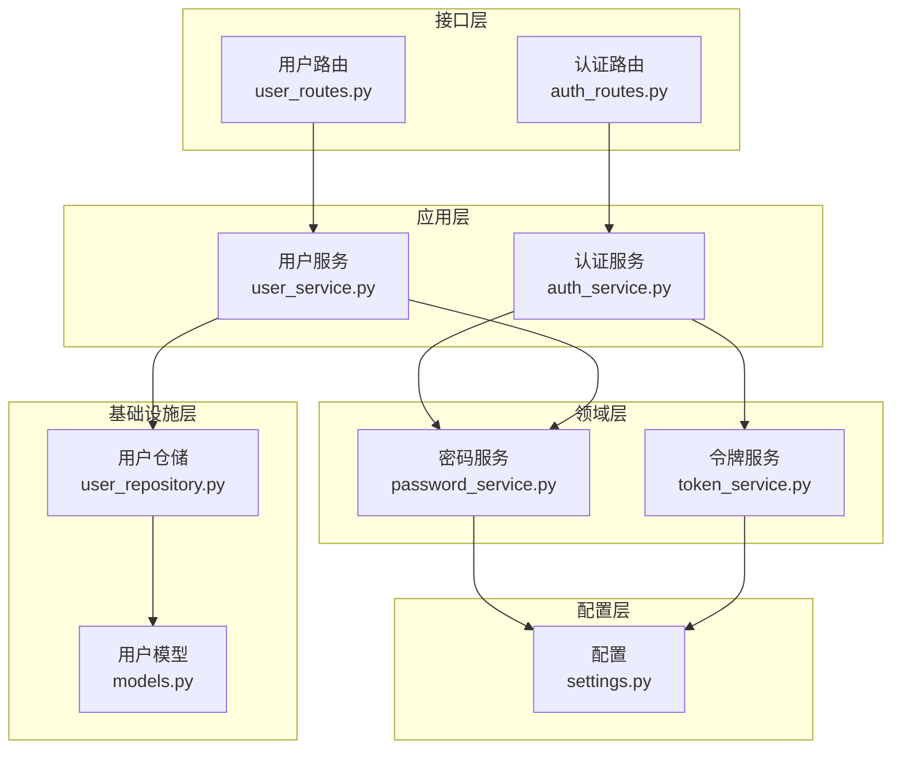
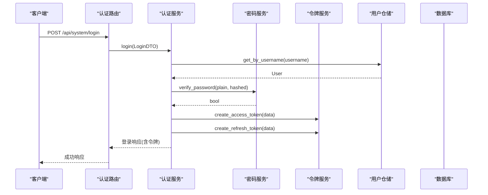
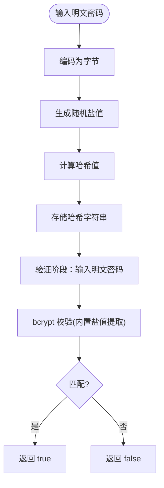
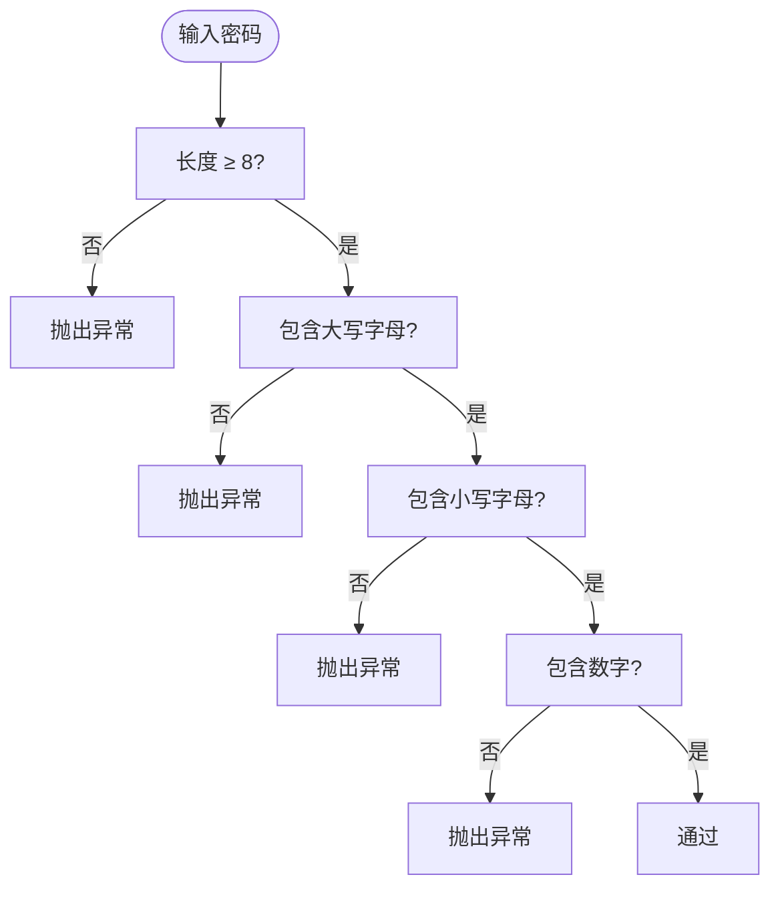
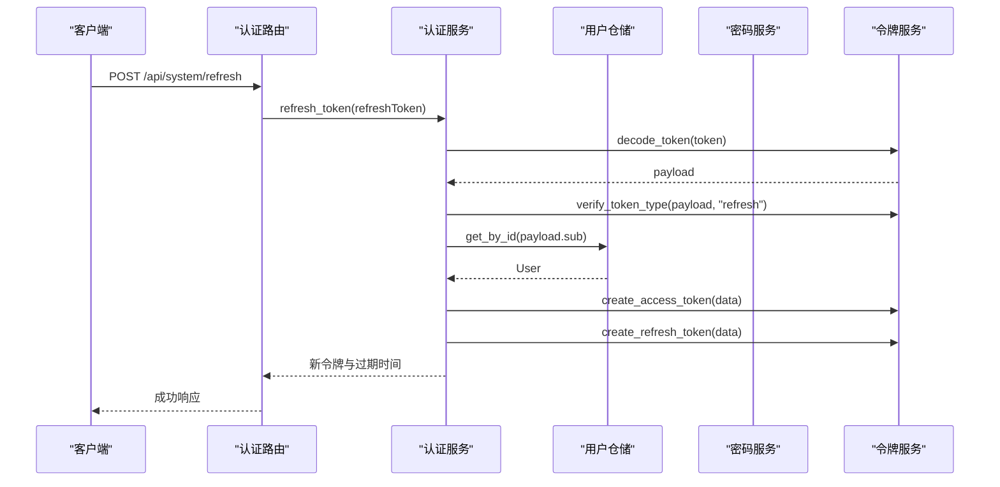
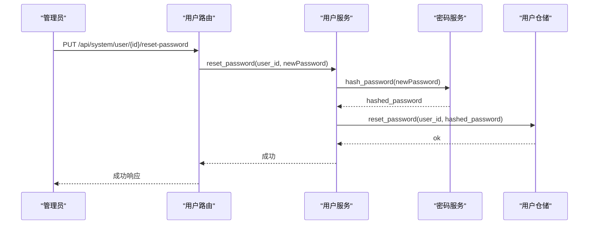
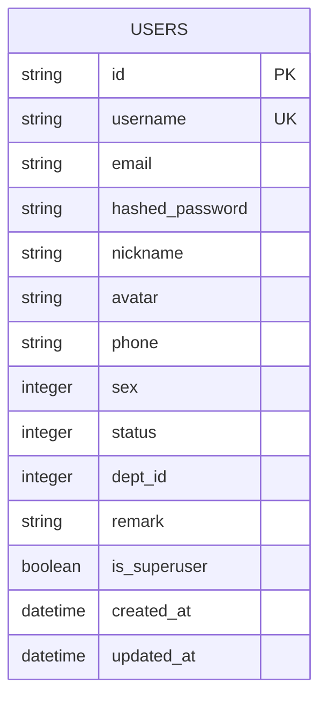
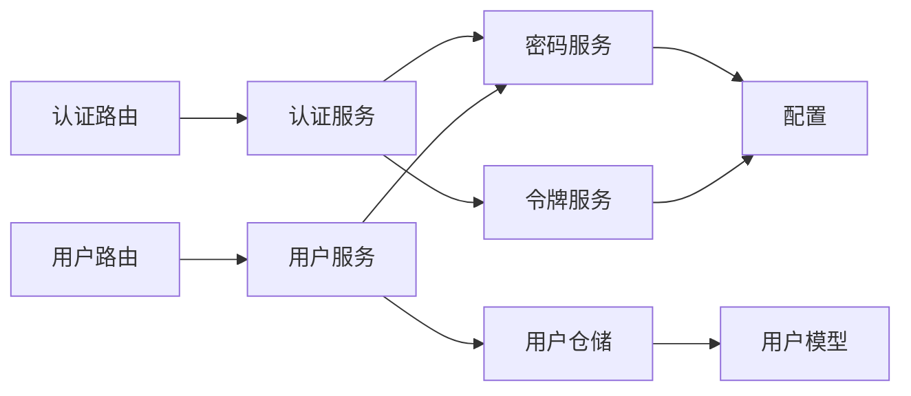

# 密码安全机制

<cite>
**本文引用的文件**
- [password_service.py](file://service/src/domain/auth/password_service.py)
- [token_service.py](file://service/src/domain/auth/token_service.py)
- [auth_service.py](file://service/src/application/services/auth_service.py)
- [user_service.py](file://service/src/application/services/user_service.py)
- [auth_routes.py](file://service/src/api/v1/auth_routes.py)
- [user_routes.py](file://service/src/api/v1/user_routes.py)
- [validators.py](file://service/src/core/validators.py)
- [models.py](file://service/src/infrastructure/database/models.py)
- [settings.py](file://service/src/config/settings.py)
- [auth_dto.py](file://service/src/application/dto/auth_dto.py)
- [user_dto.py](file://service/src/application/dto/user_dto.py)
- [user_repository.py](file://service/src/infrastructure/repositories/user_repository.py)
</cite>

## 目录
1. [引言](#引言)
2. [项目结构](#项目结构)
3. [核心组件](#核心组件)
4. [架构总览](#架构总览)
5. [详细组件分析](#详细组件分析)
6. [依赖分析](#依赖分析)
7. [性能考虑](#性能考虑)
8. [故障排除指南](#故障排除指南)
9. [结论](#结论)
10. [附录](#附录)

## 引言
本文件系统化阐述本项目的密码安全机制，重点围绕 bcrypt 密码哈希算法的实现原理与安全优势，详述密码加密过程、盐值生成与验证机制；说明密码强度验证规则与安全策略；覆盖密码重置与“修改密码”流程；提供可定位到源码的实现路径，帮助读者快速理解与落地最佳实践。

## 项目结构
密码安全相关代码主要分布在以下层次：
- 领域层：密码与令牌服务封装 bcrypt 与 JWT，屏蔽底层细节
- 应用层：认证与用户服务编排业务流程，调用领域服务与仓储
- 接口层：认证与用户路由暴露 REST API，接收 DTO 并返回统一响应
- 基础设施层：数据库模型持久化用户与密码哈希，仓储实现 CRUD
- 配置层：JWT 秘钥、算法与过期策略集中管理

图表来源
- [auth_routes.py:1-86](file://service/src/api/v1/auth_routes.py#L1-L86)
- [user_routes.py:1-252](file://service/src/api/v1/user_routes.py#L1-L252)
- [auth_service.py:1-154](file://service/src/application/services/auth_service.py#L1-L154)
- [user_service.py:1-322](file://service/src/application/services/user_service.py#L1-L322)
- [password_service.py:1-21](file://service/src/domain/auth/password_service.py#L1-L21)
- [token_service.py:1-45](file://service/src/domain/auth/token_service.py#L1-L45)
- [models.py:1-193](file://service/src/infrastructure/database/models.py#L1-L193)
- [user_repository.py:1-185](file://service/src/infrastructure/repositories/user_repository.py#L1-L185)
- [settings.py:1-198](file://service/src/config/settings.py#L1-L198)

章节来源
- [auth_routes.py:1-86](file://service/src/api/v1/auth_routes.py#L1-L86)
- [user_routes.py:1-252](file://service/src/api/v1/user_routes.py#L1-L252)
- [auth_service.py:1-154](file://service/src/application/services/auth_service.py#L1-L154)
- [user_service.py:1-322](file://service/src/application/services/user_service.py#L1-L322)
- [password_service.py:1-21](file://service/src/domain/auth/password_service.py#L1-L21)
- [token_service.py:1-45](file://service/src/domain/auth/token_service.py#L1-L45)
- [models.py:1-193](file://service/src/infrastructure/database/models.py#L1-L193)
- [user_repository.py:1-185](file://service/src/infrastructure/repositories/user_repository.py#L1-L185)
- [settings.py:1-198](file://service/src/config/settings.py#L1-L198)

## 核心组件
- 密码服务（PasswordService）
  - 提供密码哈希与校验，基于 bcrypt，自动处理盐值生成与比较
  - 参考路径：[password_service.py:9-21](file://service/src/domain/auth/password_service.py#L9-L21)
- 令牌服务（TokenService）
  - 基于 JWT 的访问令牌与刷新令牌生成、解码与类型校验
  - 参考路径：[token_service.py:14-45](file://service/src/domain/auth/token_service.py#L14-L45)
- 认证服务（AuthService）
  - 登录、注册、刷新令牌的业务编排，调用密码与令牌服务
  - 参考路径：[auth_service.py:26-154](file://service/src/application/services/auth_service.py#L26-L154)
- 用户服务（UserService）
  - 用户密码重置与修改的业务编排，调用密码服务与仓储
  - 参考路径：[user_service.py:189-251](file://service/src/application/services/user_service.py#L189-L251)
- 数据模型（User）
  - 存储 hashed_password 字段，长度上限 255 字符
  - 参考路径：[models.py:31-65](file://service/src/infrastructure/database/models.py#L31-L65)
- 配置（Settings）
  - JWT 秘钥、算法、过期时间等安全参数集中管理
  - 参考路径：[settings.py:63-67](file://service/src/config/settings.py#L63-L67)

章节来源
- [password_service.py:1-21](file://service/src/domain/auth/password_service.py#L1-L21)
- [token_service.py:1-45](file://service/src/domain/auth/token_service.py#L1-L45)
- [auth_service.py:1-154](file://service/src/application/services/auth_service.py#L1-L154)
- [user_service.py:1-322](file://service/src/application/services/user_service.py#L1-L322)
- [models.py:1-193](file://service/src/infrastructure/database/models.py#L1-L193)
- [settings.py:1-198](file://service/src/config/settings.py#L1-L198)

## 架构总览
密码安全贯穿“接口层 → 应用层 → 领域层 → 基础设施层”的分层设计，确保职责清晰、边界明确：

图表来源
- [auth_routes.py:19-34](file://service/src/api/v1/auth_routes.py#L19-L34)
- [auth_service.py:26-74](file://service/src/application/services/auth_service.py#L26-L74)
- [password_service.py:17-21](file://service/src/domain/auth/password_service.py#L17-L21)
- [token_service.py:14-30](file://service/src/domain/auth/token_service.py#L14-L30)
- [user_repository.py:17-25](file://service/src/infrastructure/repositories/user_repository.py#L17-L25)

## 详细组件分析

### bcrypt 密码哈希与验证
- 实现原理
  - 密码哈希：将明文密码编码为字节，调用 bcrypt 生成随机盐值并计算哈希，最终以 UTF-8 字符串形式存储
  - 密码验证：将明文密码与存储的哈希值进行比对，bcrypt 内部提取盐值并重新计算，比较结果
- 安全优势
  - 自带盐值，防彩虹表与并行暴力破解
  - 可配置成本因子（cost），随硬件提升而增加计算难度
- 数据持久化
  - 用户模型的 hashed_password 字段长度上限 255，足以容纳 bcrypt 输出
- 代码路径
  - [password_service.py:10-21](file://service/src/domain/auth/password_service.py#L10-L21)
  - [models.py:39](file://service/src/infrastructure/database/models.py#L39)

图表来源
- [password_service.py:10-21](file://service/src/domain/auth/password_service.py#L10-L21)

章节来源
- [password_service.py:1-21](file://service/src/domain/auth/password_service.py#L1-L21)
- [models.py:1-193](file://service/src/infrastructure/database/models.py#L1-L193)

### 密码强度验证规则与安全策略
- 规则定义
  - 最短长度 8 位
  - 必须包含至少一个大写字母
  - 必须包含至少一个小写字母
  - 必须包含至少一个数字
- 应用位置
  - 用户注册与密码修改流程在应用层调用密码服务前进行强度校验
- 代码路径
  - [validators.py:15-26](file://service/src/core/validators.py#L15-L26)
  - [auth_service.py:93-94](file://service/src/application/services/auth_service.py#L93-L94)
  - [user_service.py:246-247](file://service/src/application/services/user_service.py#L246-L247)

图表来源
- [validators.py:15-26](file://service/src/core/validators.py#L15-L26)

章节来源
- [validators.py:1-26](file://service/src/core/validators.py#L1-26)
- [auth_service.py:1-154](file://service/src/application/services/auth_service.py#L1-L154)
- [user_service.py:1-322](file://service/src/application/services/user_service.py#L1-L322)

### 登录与令牌管理
- 登录流程
  - 根据用户名查询用户，若不存在或状态异常则拒绝
  - 使用 PasswordService 验证密码
  - 生成访问令牌与刷新令牌，返回用户角色与权限
- 刷新令牌
  - 解码并校验令牌类型，确认用户存在且启用
  - 生成新的访问令牌与刷新令牌
- 代码路径
  - [auth_service.py:26-74](file://service/src/application/services/auth_service.py#L26-L74)
  - [auth_service.py:118-154](file://service/src/application/services/auth_service.py#L118-L154)
  - [token_service.py:14-45](file://service/src/domain/auth/token_service.py#L14-L45)

图表来源
- [auth_routes.py:70-85](file://service/src/api/v1/auth_routes.py#L70-L85)
- [auth_service.py:118-154](file://service/src/application/services/auth_service.py#L118-L154)
- [token_service.py:32-45](file://service/src/domain/auth/token_service.py#L32-L45)

章节来源
- [auth_routes.py:1-86](file://service/src/api/v1/auth_routes.py#L1-L86)
- [auth_service.py:1-154](file://service/src/application/services/auth_service.py#L1-L154)
- [token_service.py:1-45](file://service/src/domain/auth/token_service.py#L1-L45)

### 密码重置与修改流程
- 管理员重置密码
  - 校验目标用户存在性
  - 使用 PasswordService 对新密码进行哈希
  - 通过仓储更新用户 hashed_password
- 当前用户修改密码
  - 校验旧密码与当前用户身份
  - 使用 PasswordService 对新密码进行哈希
  - 通过仓储更新用户 hashed_password
- 代码路径
  - [user_routes.py:185-206](file://service/src/api/v1/user_routes.py#L185-L206)
  - [user_routes.py:233-251](file://service/src/api/v1/user_routes.py#L233-L251)
  - [user_service.py:189-208](file://service/src/application/services/user_service.py#L189-L208)
  - [user_service.py:227-251](file://service/src/application/services/user_service.py#L227-L251)
  - [user_repository.py:169-184](file://service/src/infrastructure/repositories/user_repository.py#L169-L184)

图表来源
- [user_routes.py:185-206](file://service/src/api/v1/user_routes.py#L185-L206)
- [user_service.py:189-208](file://service/src/application/services/user_service.py#L189-L208)
- [password_service.py:10-15](file://service/src/domain/auth/password_service.py#L10-L15)
- [user_repository.py:169-184](file://service/src/infrastructure/repositories/user_repository.py#L169-L184)

章节来源
- [user_routes.py:1-252](file://service/src/api/v1/user_routes.py#L1-L252)
- [user_service.py:1-322](file://service/src/application/services/user_service.py#L1-L322)
- [user_repository.py:1-185](file://service/src/infrastructure/repositories/user_repository.py#L1-L185)
- [password_service.py:1-21](file://service/src/domain/auth/password_service.py#L1-L21)

### 数据模型与字段约束
- 用户模型包含 hashed_password 字段，最大长度 255，满足 bcrypt 输出需求
- 用户状态字段 status 用于启用/禁用控制，登录流程中进行校验
- 代码路径
  - [models.py:31-65](file://service/src/infrastructure/database/models.py#L31-L65)

图表来源
- [models.py:31-65](file://service/src/infrastructure/database/models.py#L31-L65)

章节来源
- [models.py:1-193](file://service/src/infrastructure/database/models.py#L1-L193)

### 配置与安全参数
- JWT 配置
  - 秘钥（JWT_SECRET_KEY）、算法（JWT_ALGORITHM）、访问令牌过期（ACCESS_TOKEN_EXPIRE_MINUTES）、刷新令牌过期（REFRESH_TOKEN_EXPIRE_DAYS）
- 密码与令牌服务通过配置读取这些参数
- 代码路径
  - [settings.py:63-67](file://service/src/config/settings.py#L63-L67)
  - [token_service.py:14-45](file://service/src/domain/auth/token_service.py#L14-L45)

章节来源
- [settings.py:1-198](file://service/src/config/settings.py#L1-L198)
- [token_service.py:1-45](file://service/src/domain/auth/token_service.py#L1-L45)

## 依赖分析
- 组件耦合
  - 应用服务依赖领域服务与仓储，保持业务逻辑内聚
  - 领域服务仅依赖第三方库（bcrypt、jose），避免反向依赖
- 外部依赖
  - bcrypt：密码哈希与校验
  - jose：JWT 编解码与校验
- 循环依赖
  - 未发现循环依赖，分层清晰

图表来源
- [auth_routes.py:1-86](file://service/src/api/v1/auth_routes.py#L1-L86)
- [user_routes.py:1-252](file://service/src/api/v1/user_routes.py#L1-L252)
- [auth_service.py:1-154](file://service/src/application/services/auth_service.py#L1-L154)
- [user_service.py:1-322](file://service/src/application/services/user_service.py#L1-L322)
- [password_service.py:1-21](file://service/src/domain/auth/password_service.py#L1-L21)
- [token_service.py:1-45](file://service/src/domain/auth/token_service.py#L1-L45)
- [user_repository.py:1-185](file://service/src/infrastructure/repositories/user_repository.py#L1-L185)
- [models.py:1-193](file://service/src/infrastructure/database/models.py#L1-L193)
- [settings.py:1-198](file://service/src/config/settings.py#L1-L198)

章节来源
- [auth_routes.py:1-86](file://service/src/api/v1/auth_routes.py#L1-L86)
- [user_routes.py:1-252](file://service/src/api/v1/user_routes.py#L1-L252)
- [auth_service.py:1-154](file://service/src/application/services/auth_service.py#L1-L154)
- [user_service.py:1-322](file://service/src/application/services/user_service.py#L1-L322)
- [password_service.py:1-21](file://service/src/domain/auth/password_service.py#L1-L21)
- [token_service.py:1-45](file://service/src/domain/auth/token_service.py#L1-L45)
- [user_repository.py:1-185](file://service/src/infrastructure/repositories/user_repository.py#L1-L185)
- [models.py:1-193](file://service/src/infrastructure/database/models.py#L1-L193)
- [settings.py:1-198](file://service/src/config/settings.py#L1-L198)

## 性能考虑
- bcrypt 成本因子
  - 可通过扩展配置引入 cost 参数，平衡安全性与性能
- 令牌大小
  - JWT 作为无状态令牌，建议仅携带必要声明，避免过长载荷
- 数据库索引
  - 用户名与邮箱建立唯一索引，加速登录与注册时的唯一性检查
- 缓存策略
  - 对热点用户信息可采用缓存，但密码哈希不缓存

## 故障排除指南
- 登录失败
  - 检查用户名是否存在与用户状态是否启用
  - 确认密码哈希与明文匹配
  - 参考路径：[auth_service.py:38-48](file://service/src/application/services/auth_service.py#L38-L48)
- 令牌无效
  - 校验签名与过期时间，确认类型为 access 或 refresh
  - 参考路径：[token_service.py:32-45](file://service/src/domain/auth/token_service.py#L32-L45)
- 密码修改失败
  - 核对旧密码是否正确，新密码是否满足强度规则
  - 参考路径：[user_service.py:246-247](file://service/src/application/services/user_service.py#L246-L247)
- 密码重置异常
  - 确认目标用户存在，新密码经哈希后写入成功
  - 参考路径：[user_service.py:202-208](file://service/src/application/services/user_service.py#L202-L208)

章节来源
- [auth_service.py:1-154](file://service/src/application/services/auth_service.py#L1-L154)
- [token_service.py:1-45](file://service/src/domain/auth/token_service.py#L1-L45)
- [user_service.py:1-322](file://service/src/application/services/user_service.py#L1-L322)

## 结论
本项目采用 bcrypt 进行密码哈希，结合 JWT 令牌体系与严格的密码强度规则，构建了安全、清晰的密码安全机制。通过分层设计与职责分离，既保证了安全性，也便于维护与扩展。建议在生产环境中进一步强化配置管理与审计日志，并持续关注 bcrypt 成本因子与令牌生命周期策略的动态调整。

## 附录
- 代码示例定位（仅提供路径，不展示具体代码内容）
  - bcrypt 密码哈希与验证
    - [password_service.py:10-21](file://service/src/domain/auth/password_service.py#L10-L21)
  - 登录与令牌生成
    - [auth_service.py:26-74](file://service/src/application/services/auth_service.py#L26-L74)
    - [token_service.py:14-30](file://service/src/domain/auth/token_service.py#L14-L30)
  - 刷新令牌
    - [auth_service.py:118-154](file://service/src/application/services/auth_service.py#L118-L154)
    - [token_service.py:23-45](file://service/src/domain/auth/token_service.py#L23-L45)
  - 密码强度验证
    - [validators.py:15-26](file://service/src/core/validators.py#L15-L26)
  - 管理员重置密码
    - [user_routes.py:185-206](file://service/src/api/v1/user_routes.py#L185-L206)
    - [user_service.py:189-208](file://service/src/application/services/user_service.py#L189-L208)
  - 当前用户修改密码
    - [user_routes.py:233-251](file://service/src/api/v1/user_routes.py#L233-L251)
    - [user_service.py:227-251](file://service/src/application/services/user_service.py#L227-L251)
  - 用户模型与字段
    - [models.py:31-65](file://service/src/infrastructure/database/models.py#L31-L65)
  - JWT 配置
    - [settings.py:63-67](file://service/src/config/settings.py#L63-L67)