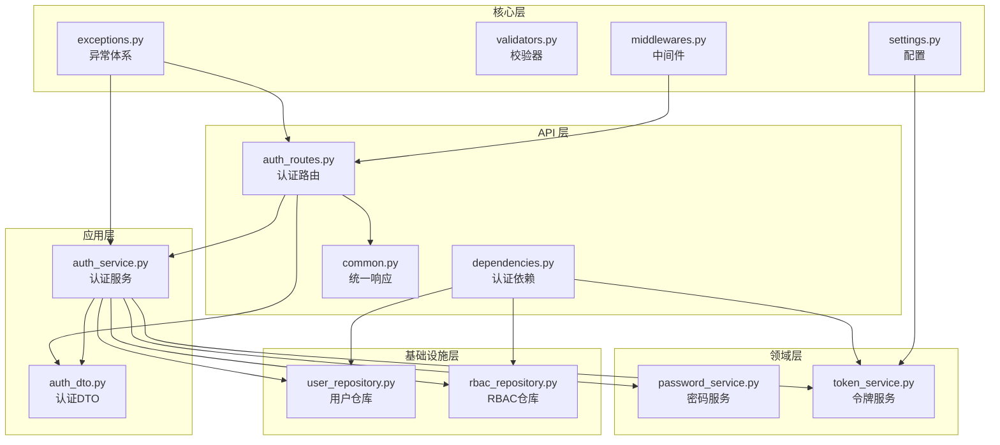
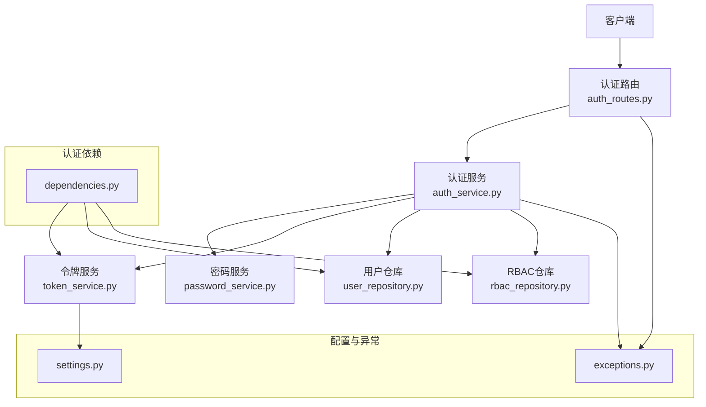
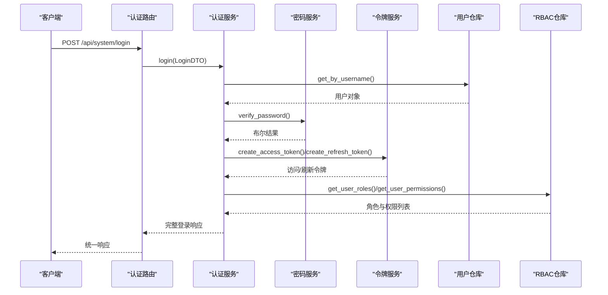
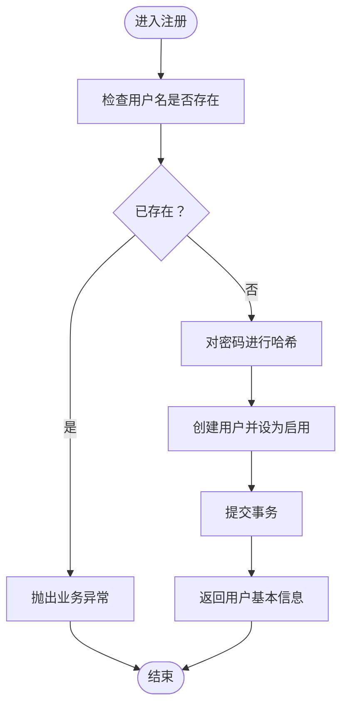
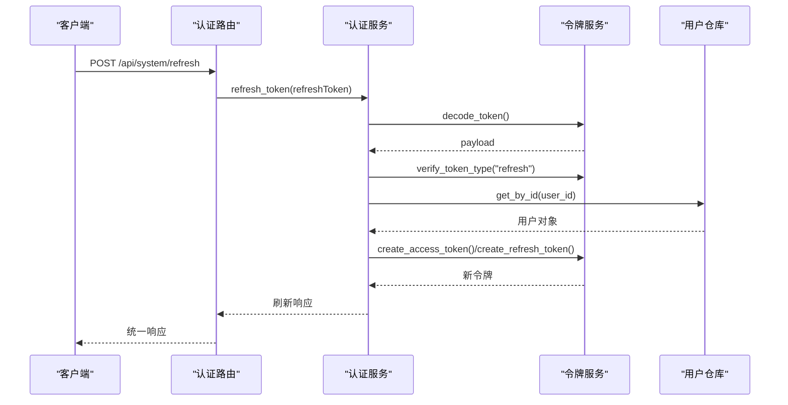
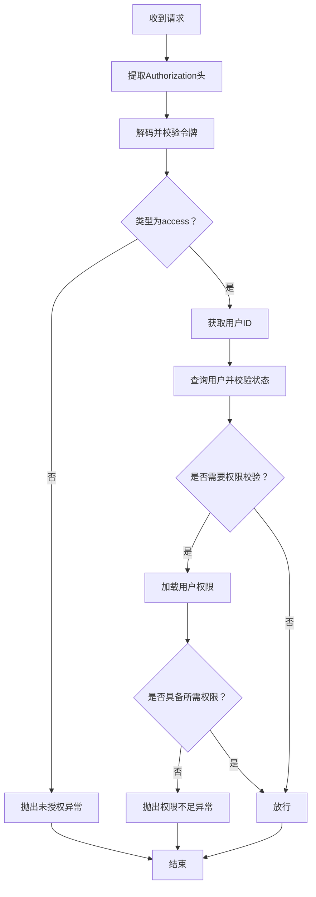
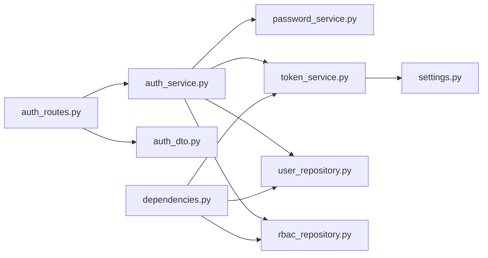

# 认证流程实现

<cite>
**本文引用的文件**
- [service/src/api/v1/auth_routes.py](file://service/src/api/v1/auth_routes.py)
- [service/src/application/dto/auth_dto.py](file://service/src/application/dto/auth_dto.py)
- [service/src/application/services/auth_service.py](file://service/src/application/services/auth_service.py)
- [service/src/domain/auth/password_service.py](file://service/src/domain/auth/password_service.py)
- [service/src/domain/auth/token_service.py](file://service/src/domain/auth/token_service.py)
- [service/src/api/dependencies.py](file://service/src/api/dependencies.py)
- [service/src/core/middlewares.py](file://service/src/core/middlewares.py)
- [service/src/config/settings.py](file://service/src/config/settings.py)
- [service/src/infrastructure/repositories/user_repository.py](file://service/src/infrastructure/repositories/user_repository.py)
- [service/src/infrastructure/repositories/rbac_repository.py](file://service/src/infrastructure/repositories/rbac_repository.py)
- [service/src/core/exceptions.py](file://service/src/core/exceptions.py)
- [service/src/core/validators.py](file://service/src/core/validators.py)
- [service/src/api/common.py](file://service/src/api/common.py)
- [service/src/main.py](file://service/src/main.py)
- [service/tests/unit/test_auth.py](file://service/tests/unit/test_auth.py)
</cite>

## 目录
1. [简介](#简介)
2. [项目结构](#项目结构)
3. [核心组件](#核心组件)
4. [架构总览](#架构总览)
5. [详细组件分析](#详细组件分析)
6. [依赖分析](#依赖分析)
7. [性能考虑](#性能考虑)
8. [故障排查指南](#故障排查指南)
9. [结论](#结论)
10. [附录](#附录)

## 简介
本文件面向认证流程实现，系统性阐述用户登录、注册、登出与令牌刷新的完整业务流程与数据流转；详解认证服务的实现逻辑、错误处理与异常管理；说明DTO数据传输对象的设计与验证规则；解释认证中间件的工作机制与权限拦截；并提供可定位到源码路径的示例，帮助读者快速定位实现细节。同时给出扩展性与定制化建议，便于在实际项目中按需演进。

## 项目结构
认证相关代码采用分层架构组织，遵循领域驱动设计（DDD）思想：
- API 层：定义认证路由与依赖注入，负责请求接入与统一响应封装
- 应用层：封装认证业务逻辑（登录、注册、刷新）
- 领域层：密码哈希与JWT令牌管理
- 基础设施层：用户与RBAC仓库实现，提供数据持久化能力
- 核心层：异常体系、中间件、校验器、公共响应模型

图表来源
- [service/src/api/v1/auth_routes.py:1-86](file://service/src/api/v1/auth_routes.py#L1-L86)
- [service/src/application/services/auth_service.py:1-154](file://service/src/application/services/auth_service.py#L1-L154)
- [service/src/domain/auth/password_service.py:1-21](file://service/src/domain/auth/password_service.py#L1-L21)
- [service/src/domain/auth/token_service.py:1-45](file://service/src/domain/auth/token_service.py#L1-L45)
- [service/src/api/dependencies.py:1-72](file://service/src/api/dependencies.py#L1-L72)
- [service/src/infrastructure/repositories/user_repository.py:1-185](file://service/src/infrastructure/repositories/user_repository.py#L1-L185)
- [service/src/infrastructure/repositories/rbac_repository.py:1-213](file://service/src/infrastructure/repositories/rbac_repository.py#L1-L213)
- [service/src/api/common.py:1-65](file://service/src/api/common.py#L1-L65)
- [service/src/core/exceptions.py:1-60](file://service/src/core/exceptions.py#L1-L60)
- [service/src/core/validators.py:1-26](file://service/src/core/validators.py#L1-L26)
- [service/src/core/middlewares.py:1-65](file://service/src/core/middlewares.py#L1-L65)
- [service/src/config/settings.py:1-198](file://service/src/config/settings.py#L1-L198)

章节来源
- [service/src/api/v1/auth_routes.py:1-86](file://service/src/api/v1/auth_routes.py#L1-L86)
- [service/src/application/services/auth_service.py:1-154](file://service/src/application/services/auth_service.py#L1-L154)
- [service/src/domain/auth/password_service.py:1-21](file://service/src/domain/auth/password_service.py#L1-L21)
- [service/src/domain/auth/token_service.py:1-45](file://service/src/domain/auth/token_service.py#L1-L45)
- [service/src/api/dependencies.py:1-72](file://service/src/api/dependencies.py#L1-L72)
- [service/src/infrastructure/repositories/user_repository.py:1-185](file://service/src/infrastructure/repositories/user_repository.py#L1-L185)
- [service/src/infrastructure/repositories/rbac_repository.py:1-213](file://service/src/infrastructure/repositories/rbac_repository.py#L1-L213)
- [service/src/api/common.py:1-65](file://service/src/api/common.py#L1-L65)
- [service/src/core/exceptions.py:1-60](file://service/src/core/exceptions.py#L1-L60)
- [service/src/core/validators.py:1-26](file://service/src/core/validators.py#L1-L26)
- [service/src/core/middlewares.py:1-65](file://service/src/core/middlewares.py#L1-L65)
- [service/src/config/settings.py:1-198](file://service/src/config/settings.py#L1-L198)

## 核心组件
- 认证路由模块：提供登录、注册、登出、刷新接口，统一返回格式
- 认证服务：聚合仓储与领域服务，执行业务规则与令牌发放
- 密码服务：基于bcrypt的密码哈希与校验
- 令牌服务：JWT访问/刷新令牌的生成、解码与类型校验
- 认证依赖：从请求头提取并校验访问令牌，获取当前活跃用户，权限/超级用户依赖工厂
- 仓库实现：用户与RBAC数据访问，支持角色与权限查询
- 异常体系：统一的业务异常与HTTP异常映射
- 校验器：用户名与密码强度校验
- 中间件：请求日志与IP黑白名单过滤
- 配置：JWT密钥、算法、过期时间等

章节来源
- [service/src/api/v1/auth_routes.py:19-86](file://service/src/api/v1/auth_routes.py#L19-L86)
- [service/src/application/services/auth_service.py:15-154](file://service/src/application/services/auth_service.py#L15-L154)
- [service/src/domain/auth/password_service.py:6-21](file://service/src/domain/auth/password_service.py#L6-L21)
- [service/src/domain/auth/token_service.py:11-45](file://service/src/domain/auth/token_service.py#L11-L45)
- [service/src/api/dependencies.py:16-72](file://service/src/api/dependencies.py#L16-L72)
- [service/src/infrastructure/repositories/user_repository.py:11-185](file://service/src/infrastructure/repositories/user_repository.py#L11-L185)
- [service/src/infrastructure/repositories/rbac_repository.py:11-213](file://service/src/infrastructure/repositories/rbac_repository.py#L11-L213)
- [service/src/core/exceptions.py:6-60](file://service/src/core/exceptions.py#L6-L60)
- [service/src/core/validators.py:8-26](file://service/src/core/validators.py#L8-L26)
- [service/src/core/middlewares.py:12-65](file://service/src/core/middlewares.py#L12-L65)
- [service/src/config/settings.py:63-67](file://service/src/config/settings.py#L63-L67)

## 架构总览
认证系统采用“路由-应用服务-领域服务-仓储”的分层结构，配合依赖注入与统一异常处理，形成清晰的职责边界与可测试性。

图表来源
- [service/src/api/v1/auth_routes.py:19-86](file://service/src/api/v1/auth_routes.py#L19-L86)
- [service/src/application/services/auth_service.py:15-154](file://service/src/application/services/auth_service.py#L15-L154)
- [service/src/domain/auth/password_service.py:6-21](file://service/src/domain/auth/password_service.py#L6-L21)
- [service/src/domain/auth/token_service.py:11-45](file://service/src/domain/auth/token_service.py#L11-L45)
- [service/src/api/dependencies.py:16-72](file://service/src/api/dependencies.py#L16-L72)
- [service/src/infrastructure/repositories/user_repository.py:11-185](file://service/src/infrastructure/repositories/user_repository.py#L11-L185)
- [service/src/infrastructure/repositories/rbac_repository.py:11-213](file://service/src/infrastructure/repositories/rbac_repository.py#L11-L213)
- [service/src/config/settings.py:63-67](file://service/src/config/settings.py#L63-L67)
- [service/src/core/exceptions.py:6-60](file://service/src/core/exceptions.py#L6-L60)

## 详细组件分析

### 登录流程（登录、令牌发放与角色权限回传）
- 输入：LoginDTO（用户名、密码）
- 步骤：
  1) 根据用户名查询用户并校验密码
  2) 校验用户状态（启用）
  3) 生成访问令牌与刷新令牌
  4) 查询用户角色与权限
  5) 组装完整登录响应（含用户信息、角色、权限）
- 输出：统一响应（包含accessToken、expires、refreshToken、userInfo、roles、permissions）

图表来源
- [service/src/api/v1/auth_routes.py:19-34](file://service/src/api/v1/auth_routes.py#L19-L34)
- [service/src/application/services/auth_service.py:26-74](file://service/src/application/services/auth_service.py#L26-L74)
- [service/src/domain/auth/password_service.py:17-21](file://service/src/domain/auth/password_service.py#L17-L21)
- [service/src/domain/auth/token_service.py:14-30](file://service/src/domain/auth/token_service.py#L14-L30)
- [service/src/infrastructure/repositories/user_repository.py:22-25](file://service/src/infrastructure/repositories/user_repository.py#L22-L25)
- [service/src/infrastructure/repositories/rbac_repository.py:128-133](file://service/src/infrastructure/repositories/rbac_repository.py#L128-L133)

章节来源
- [service/src/api/v1/auth_routes.py:19-34](file://service/src/api/v1/auth_routes.py#L19-L34)
- [service/src/application/services/auth_service.py:26-74](file://service/src/application/services/auth_service.py#L26-L74)
- [service/src/domain/auth/password_service.py:17-21](file://service/src/domain/auth/password_service.py#L17-L21)
- [service/src/domain/auth/token_service.py:14-30](file://service/src/domain/auth/token_service.py#L14-L30)
- [service/src/infrastructure/repositories/user_repository.py:22-25](file://service/src/infrastructure/repositories/user_repository.py#L22-L25)
- [service/src/infrastructure/repositories/rbac_repository.py:128-133](file://service/src/infrastructure/repositories/rbac_repository.py#L128-L133)

### 注册流程（用户创建与状态管理）
- 输入：RegisterDTO（用户名、密码、昵称、邮箱、手机）
- 步骤：
  1) 校验用户名唯一性
  2) 对密码进行哈希
  3) 创建用户（默认启用状态）
  4) 提交事务并返回用户基本信息
- 输出：统一响应（包含新用户基本信息）

图表来源
- [service/src/application/services/auth_service.py:76-116](file://service/src/application/services/auth_service.py#L76-L116)
- [service/src/domain/auth/password_service.py:9-15](file://service/src/domain/auth/password_service.py#L9-L15)
- [service/src/infrastructure/repositories/user_repository.py:114-119](file://service/src/infrastructure/repositories/user_repository.py#L114-L119)

章节来源
- [service/src/application/services/auth_service.py:76-116](file://service/src/application/services/auth_service.py#L76-L116)
- [service/src/domain/auth/password_service.py:9-15](file://service/src/domain/auth/password_service.py#L9-L15)
- [service/src/infrastructure/repositories/user_repository.py:114-119](file://service/src/infrastructure/repositories/user_repository.py#L114-L119)

### 登出流程（JWT 无状态特性）
- 登出接口直接返回成功，因为JWT为无状态，服务端不保存会话；登出由客户端删除本地令牌即可
- 该设计简化服务端状态管理，提升可扩展性

章节来源
- [service/src/api/v1/auth_routes.py:55-67](file://service/src/api/v1/auth_routes.py#L55-L67)

### 刷新令牌流程（令牌续期）
- 输入：RefreshTokenDTO（刷新令牌）
- 步骤：
  1) 解码并校验刷新令牌
  2) 校验令牌类型为“refresh”
  3) 根据payload中的用户ID查询用户并校验状态
  4) 重新签发访问令牌与刷新令牌
- 输出：统一响应（包含新的accessToken、expires、refreshToken）

图表来源
- [service/src/api/v1/auth_routes.py:70-85](file://service/src/api/v1/auth_routes.py#L70-L85)
- [service/src/application/services/auth_service.py:118-153](file://service/src/application/services/auth_service.py#L118-L153)
- [service/src/domain/auth/token_service.py:33-44](file://service/src/domain/auth/token_service.py#L33-L44)
- [service/src/infrastructure/repositories/user_repository.py:17-20](file://service/src/infrastructure/repositories/user_repository.py#L17-L20)

章节来源
- [service/src/api/v1/auth_routes.py:70-85](file://service/src/api/v1/auth_routes.py#L70-L85)
- [service/src/application/services/auth_service.py:118-153](file://service/src/application/services/auth_service.py#L118-L153)
- [service/src/domain/auth/token_service.py:33-44](file://service/src/domain/auth/token_service.py#L33-L44)
- [service/src/infrastructure/repositories/user_repository.py:17-20](file://service/src/infrastructure/repositories/user_repository.py#L17-L20)

### 认证中间件与权限拦截
- 认证中间件：从HTTP Authorization Bearer头中提取令牌，解码并校验类型，获取当前活跃用户
- 权限拦截：依赖工厂require_permission与require_superuser，分别校验用户权限与超级用户身份
- RBAC查询：通过用户ID查询其角色与权限，用于权限判定

图表来源
- [service/src/api/dependencies.py:16-72](file://service/src/api/dependencies.py#L16-L72)
- [service/src/infrastructure/repositories/rbac_repository.py:203-212](file://service/src/infrastructure/repositories/rbac_repository.py#L203-L212)

章节来源
- [service/src/api/dependencies.py:16-72](file://service/src/api/dependencies.py#L16-L72)
- [service/src/infrastructure/repositories/rbac_repository.py:203-212](file://service/src/infrastructure/repositories/rbac_repository.py#L203-L212)

### DTO 设计与验证规则
- 登录DTO：用户名、密码
- 注册DTO：用户名、密码、昵称、邮箱、手机（可空）
- 刷新DTO：刷新令牌
- 用户信息DTO：用户标识与基础资料（from_attributes）
- 登录响应DTO：令牌、过期时间、用户信息、角色、权限
- 验证器：用户名3-50字符且仅允许字母数字与下划线；密码至少8位且包含大小写字母与数字

章节来源
- [service/src/application/dto/auth_dto.py:7-54](file://service/src/application/dto/auth_dto.py#L7-L54)
- [service/src/core/validators.py:8-26](file://service/src/core/validators.py#L8-L26)

### 错误处理与异常管理
- 自定义异常：未找到、冲突、未授权、禁止访问、验证错误、限流、业务错误
- 全局异常处理器：AppException映射为统一JSON响应；参数验证错误与未捕获异常分别处理
- 业务异常：注册用户名重复、登录凭据错误、用户被禁用、刷新令牌无效等

章节来源
- [service/src/core/exceptions.py:6-60](file://service/src/core/exceptions.py#L6-L60)
- [service/src/main.py:60-82](file://service/src/main.py#L60-L82)
- [service/src/application/services/auth_service.py:38-48](file://service/src/application/services/auth_service.py#L38-L48)
- [service/src/application/services/auth_service.py:88-91](file://service/src/application/services/auth_service.py#L88-L91)
- [service/src/application/services/auth_service.py:130-143](file://service/src/application/services/auth_service.py#L130-L143)

## 依赖分析
- 路由依赖应用服务与DTO；应用服务依赖领域服务与仓储；依赖注入贯穿始终
- 认证依赖从令牌服务与仓储中抽取用户上下文，形成权限控制闭环
- 配置集中于settings，令牌服务据此生成/校验JWT

图表来源
- [service/src/api/v1/auth_routes.py:19-85](file://service/src/api/v1/auth_routes.py#L19-L85)
- [service/src/application/services/auth_service.py:18-24](file://service/src/application/services/auth_service.py#L18-L24)
- [service/src/api/dependencies.py:16-72](file://service/src/api/dependencies.py#L16-L72)
- [service/src/domain/auth/token_service.py:14-44](file://service/src/domain/auth/token_service.py#L14-L44)
- [service/src/config/settings.py:63-67](file://service/src/config/settings.py#L63-L67)

章节来源
- [service/src/api/v1/auth_routes.py:19-85](file://service/src/api/v1/auth_routes.py#L19-L85)
- [service/src/application/services/auth_service.py:18-24](file://service/src/application/services/auth_service.py#L18-L24)
- [service/src/api/dependencies.py:16-72](file://service/src/api/dependencies.py#L16-L72)
- [service/src/domain/auth/token_service.py:14-44](file://service/src/domain/auth/token_service.py#L14-L44)
- [service/src/config/settings.py:63-67](file://service/src/config/settings.py#L63-L67)

## 性能考虑
- 令牌生成与校验为CPU密集型，建议在高并发场景下：
  - 使用高性能加密库与合适的密钥长度
  - 合理设置ACCESS_TOKEN_EXPIRE_MINUTES与REFRESH_TOKEN_EXPIRE_DAYS，平衡安全性与用户体验
  - 对频繁调用的接口（如刷新令牌）增加缓存策略（如Redis），减少数据库压力
- 数据库查询：
  - 用户名/邮箱查询应建立索引
  - 分页查询时注意筛选条件与排序字段的索引优化
- 中间件：
  - 请求日志中间件在生产环境建议降低日志级别或按采样输出

## 故障排查指南
- 登录失败
  - 检查用户名是否存在与密码是否正确
  - 确认用户状态为启用
  - 查看令牌服务是否正常生成访问/刷新令牌
- 注册失败
  - 核对用户名唯一性约束
  - 检查密码强度校验是否通过
- 刷新令牌失败
  - 校验刷新令牌是否有效且类型为“refresh”
  - 确认用户存在且状态为启用
- 权限不足
  - 检查用户角色与权限映射是否正确
  - 确认依赖工厂require_permission是否正确注入

章节来源
- [service/src/application/services/auth_service.py:38-48](file://service/src/application/services/auth_service.py#L38-L48)
- [service/src/application/services/auth_service.py:88-91](file://service/src/application/services/auth_service.py#L88-L91)
- [service/src/application/services/auth_service.py:130-143](file://service/src/application/services/auth_service.py#L130-L143)
- [service/src/api/dependencies.py:45-71](file://service/src/api/dependencies.py#L45-L71)

## 结论
本认证实现以清晰的分层架构与完善的异常处理为基础，结合JWT无状态特性与RBAC权限模型，提供了可扩展、可维护的认证能力。通过依赖注入与统一响应模型，系统在保证安全性的同时兼顾了易用性与可测试性。建议在生产环境中进一步完善缓存策略、监控与审计能力，并持续优化令牌与查询性能。

## 附录
- 单元测试覆盖了密码哈希与令牌编解码的关键行为，可作为集成测试的参考

章节来源
- [service/tests/unit/test_auth.py:7-68](file://service/tests/unit/test_auth.py#L7-L68)