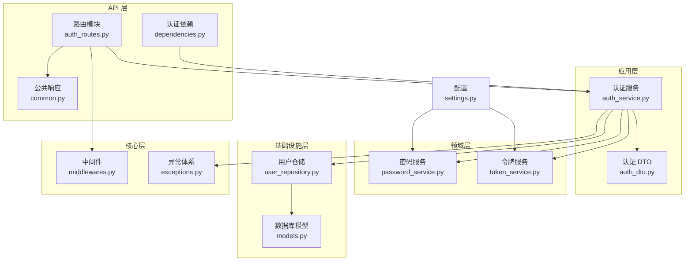
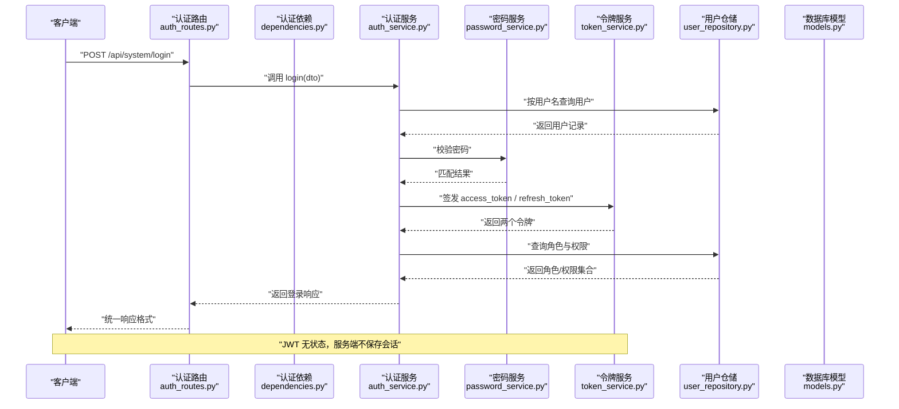
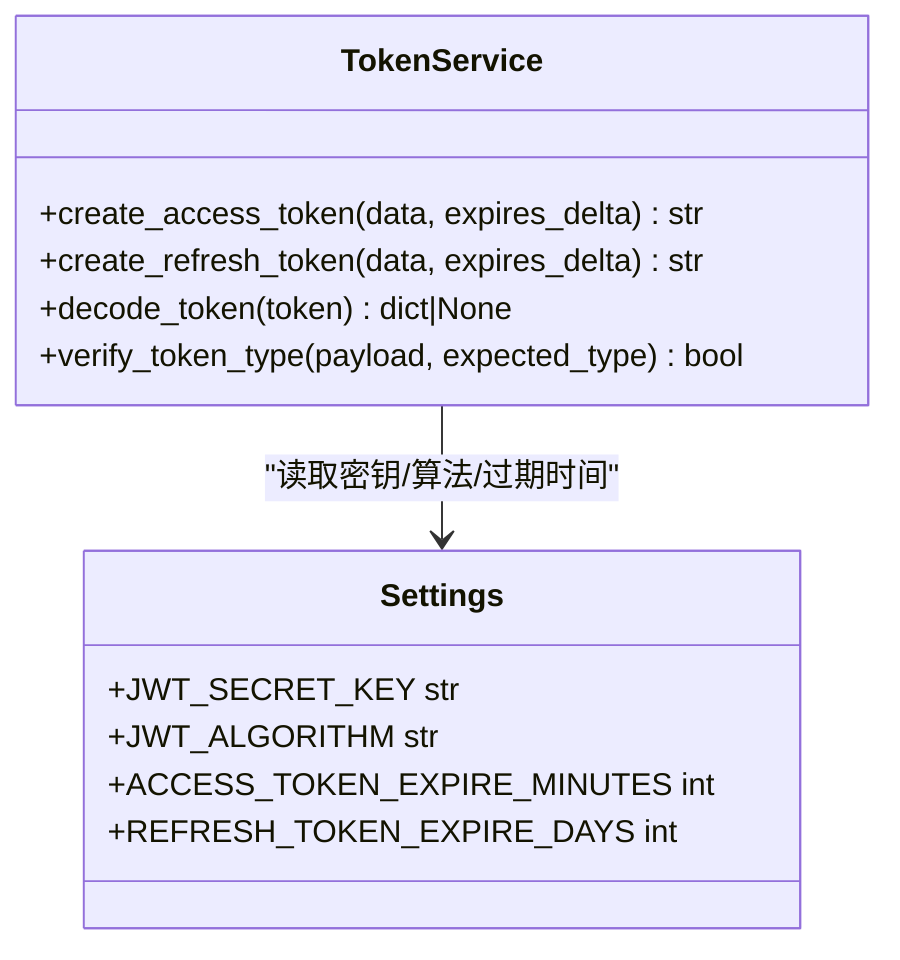
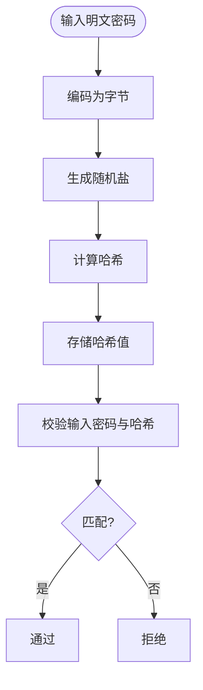
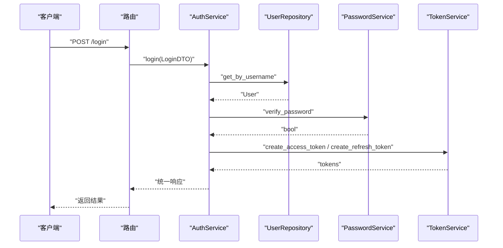
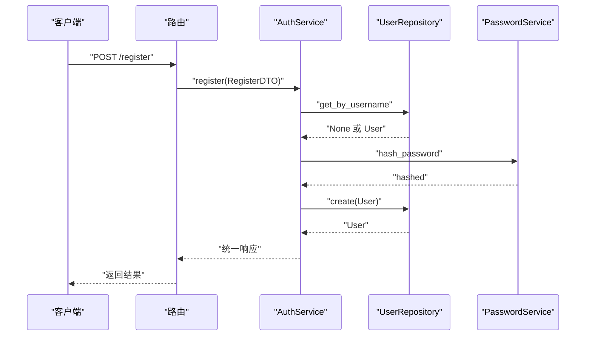
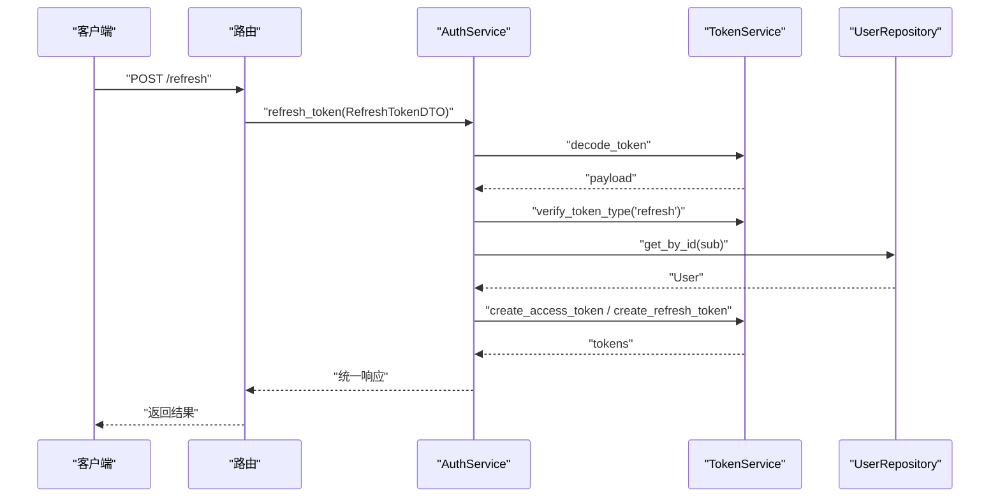
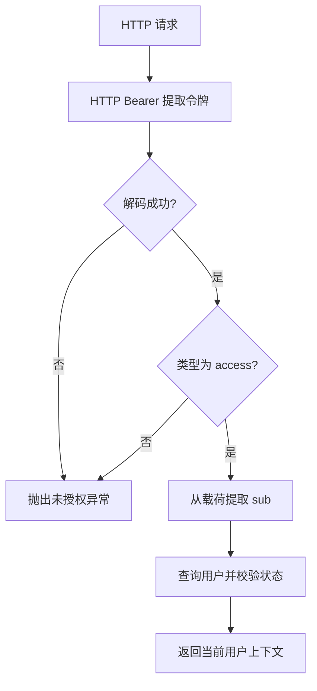
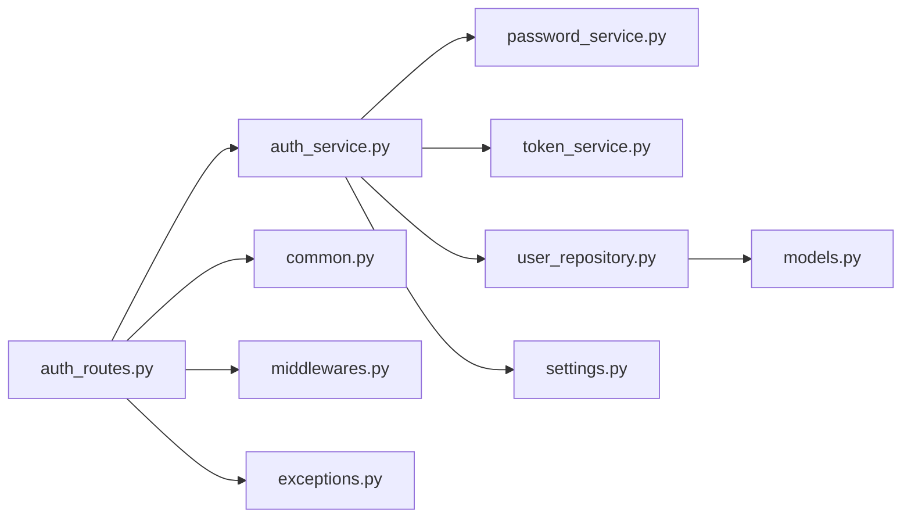

# 认证系统

<cite>
**本文引用的文件**
- [service/src/domain/auth/password_service.py](file://service/src/domain/auth/password_service.py)
- [service/src/domain/auth/token_service.py](file://service/src/domain/auth/token_service.py)
- [service/src/application/services/auth_service.py](file://service/src/application/services/auth_service.py)
- [service/src/api/v1/auth_routes.py](file://service/src/api/v1/auth_routes.py)
- [service/src/api/dependencies.py](file://service/src/api/dependencies.py)
- [service/src/application/dto/auth_dto.py](file://service/src/application/dto/auth_dto.py)
- [service/src/infrastructure/repositories/user_repository.py](file://service/src/infrastructure/repositories/user_repository.py)
- [service/src/infrastructure/database/models.py](file://service/src/infrastructure/database/models.py)
- [service/src/config/settings.py](file://service/src/config/settings.py)
- [service/src/core/middlewares.py](file://service/src/core/middlewares.py)
- [service/src/core/exceptions.py](file://service/src/core/exceptions.py)
- [service/src/api/common.py](file://service/src/api/common.py)
- [service/tests/unit/test_auth.py](file://service/tests/unit/test_auth.py)
</cite>

## 目录
1. [简介](#简介)
2. [项目结构](#项目结构)
3. [核心组件](#核心组件)
4. [架构总览](#架构总览)
5. [详细组件分析](#详细组件分析)
6. [依赖分析](#依赖分析)
7. [性能考虑](#性能考虑)
8. [故障排查指南](#故障排查指南)
9. [结论](#结论)
10. [附录](#附录)

## 简介
本文件为认证系统的详细技术文档，聚焦于以下目标：
- 深入解释 JWT 令牌认证机制的实现原理，覆盖令牌生成、验证、刷新与失效处理。
- 详述密码加密算法（bcrypt）的使用与安全策略。
- 说明用户登录、注册、登出的完整流程与数据流转。
- 解释认证中间件与依赖注入的工作机制及安全最佳实践。
- 提供可落地的配置选项与扩展/定制化建议。

## 项目结构
认证系统采用分层架构：API 层负责路由与依赖注入；应用层封装业务流程；领域层提供密码与令牌的核心服务；基础设施层负责仓储与数据库模型；配置层集中管理运行参数；核心层提供中间件与异常体系。

图表来源
- [service/src/api/v1/auth_routes.py:1-86](file://service/src/api/v1/auth_routes.py#L1-L86)
- [service/src/api/dependencies.py:1-72](file://service/src/api/dependencies.py#L1-L72)
- [service/src/application/services/auth_service.py:1-154](file://service/src/application/services/auth_service.py#L1-L154)
- [service/src/application/dto/auth_dto.py:1-54](file://service/src/application/dto/auth_dto.py#L1-L54)
- [service/src/domain/auth/password_service.py:1-21](file://service/src/domain/auth/password_service.py#L1-L21)
- [service/src/domain/auth/token_service.py:1-45](file://service/src/domain/auth/token_service.py#L1-L45)
- [service/src/infrastructure/repositories/user_repository.py:1-185](file://service/src/infrastructure/repositories/user_repository.py#L1-L185)
- [service/src/infrastructure/database/models.py:1-193](file://service/src/infrastructure/database/models.py#L1-L193)
- [service/src/core/middlewares.py:1-65](file://service/src/core/middlewares.py#L1-L65)
- [service/src/core/exceptions.py:1-60](file://service/src/core/exceptions.py#L1-L60)
- [service/src/api/common.py:1-65](file://service/src/api/common.py#L1-L65)
- [service/src/config/settings.py:1-198](file://service/src/config/settings.py#L1-L198)

章节来源
- [service/src/api/v1/auth_routes.py:1-86](file://service/src/api/v1/auth_routes.py#L1-L86)
- [service/src/application/services/auth_service.py:1-154](file://service/src/application/services/auth_service.py#L1-L154)
- [service/src/domain/auth/password_service.py:1-21](file://service/src/domain/auth/password_service.py#L1-L21)
- [service/src/domain/auth/token_service.py:1-45](file://service/src/domain/auth/token_service.py#L1-L45)
- [service/src/infrastructure/repositories/user_repository.py:1-185](file://service/src/infrastructure/repositories/user_repository.py#L1-L185)
- [service/src/infrastructure/database/models.py:1-193](file://service/src/infrastructure/database/models.py#L1-L193)
- [service/src/config/settings.py:1-198](file://service/src/config/settings.py#L1-L198)
- [service/src/core/middlewares.py:1-65](file://service/src/core/middlewares.py#L1-L65)
- [service/src/core/exceptions.py:1-60](file://service/src/core/exceptions.py#L1-L60)
- [service/src/api/common.py:1-65](file://service/src/api/common.py#L1-L65)

## 核心组件
- 密码服务（PasswordService）：基于 bcrypt 对明文密码进行哈希与校验，确保密码存储安全。
- 令牌服务（TokenService）：基于 PyJWT/JOSE 实现 JWT 的签发、解码与类型校验，支持访问令牌与刷新令牌。
- 认证服务（AuthService）：编排登录、注册、令牌刷新的业务流程，整合仓储与领域服务。
- 认证依赖（dependencies.py）：通过 HTTP Bearer 方式从请求头提取并验证 JWT，派生当前用户上下文。
- 路由模块（auth_routes.py）：暴露 /login、/register、/logout、/refresh 四个接口，并统一响应格式。
- 配置（settings.py）：集中管理 JWT 密钥、算法、过期时间、Redis、CORS 等关键参数。
- 异常体系（exceptions.py）：标准化认证与授权相关的异常类型，便于前端统一处理。
- 中间件（middlewares.py）：提供请求日志与 IP 黑白名单过滤，增强可观测性与访问控制。

章节来源
- [service/src/domain/auth/password_service.py:1-21](file://service/src/domain/auth/password_service.py#L1-L21)
- [service/src/domain/auth/token_service.py:1-45](file://service/src/domain/auth/token_service.py#L1-L45)
- [service/src/application/services/auth_service.py:1-154](file://service/src/application/services/auth_service.py#L1-L154)
- [service/src/api/dependencies.py:1-72](file://service/src/api/dependencies.py#L1-L72)
- [service/src/api/v1/auth_routes.py:1-86](file://service/src/api/v1/auth_routes.py#L1-L86)
- [service/src/config/settings.py:1-198](file://service/src/config/settings.py#L1-L198)
- [service/src/core/exceptions.py:1-60](file://service/src/core/exceptions.py#L1-L60)
- [service/src/core/middlewares.py:1-65](file://service/src/core/middlewares.py#L1-L65)

## 架构总览
认证系统遵循“路由 → 依赖 → 应用服务 → 领域服务/仓储”的调用链路，配合配置中心与异常体系，形成清晰、可扩展且安全的认证子系统。

图表来源
- [service/src/api/v1/auth_routes.py:1-86](file://service/src/api/v1/auth_routes.py#L1-L86)
- [service/src/api/dependencies.py:1-72](file://service/src/api/dependencies.py#L1-L72)
- [service/src/application/services/auth_service.py:1-154](file://service/src/application/services/auth_service.py#L1-L154)
- [service/src/domain/auth/password_service.py:1-21](file://service/src/domain/auth/password_service.py#L1-L21)
- [service/src/domain/auth/token_service.py:1-45](file://service/src/domain/auth/token_service.py#L1-L45)
- [service/src/infrastructure/repositories/user_repository.py:1-185](file://service/src/infrastructure/repositories/user_repository.py#L1-L185)
- [service/src/infrastructure/database/models.py:1-193](file://service/src/infrastructure/database/models.py#L1-L193)

## 详细组件分析

### JWT 令牌机制
- 令牌类型与用途
  - 访问令牌（access）：短期有效，用于受保护资源访问。
  - 刷新令牌（refresh）：长期有效，用于在访问令牌过期后换取新的访问令牌。
- 生成与验证
  - 使用配置中的密钥与算法签发，携带 exp 过期时间与 type 类型标识。
  - 解码时校验签名与算法，再按 type 校验令牌类型。
- 刷新与失效
  - 刷新接口仅接受 refresh 类型令牌，校验用户状态后重新签发一对新令牌。
  - JWT 本身无服务端状态，无法直接撤销；可通过黑名单/撤销列表等扩展方案实现。

图表来源
- [service/src/domain/auth/token_service.py:1-45](file://service/src/domain/auth/token_service.py#L1-L45)
- [service/src/config/settings.py:63-67](file://service/src/config/settings.py#L63-L67)

章节来源
- [service/src/domain/auth/token_service.py:1-45](file://service/src/domain/auth/token_service.py#L1-L45)
- [service/src/config/settings.py:63-67](file://service/src/config/settings.py#L63-L67)

### 密码加密与安全策略
- bcrypt 哈希
  - 将明文密码编码为字节，生成随机盐并计算哈希，返回可逆字符串形式。
  - 校验时使用相同盐比较输入密码与存储哈希，避免明文泄露。
- 安全策略
  - 存储仅保留哈希值，永不保存明文。
  - 密码长度与复杂度建议由上层 DTO/校验器约束（本项目以 Pydantic 字段约束为主）。
  - 配置中提供最小密钥长度字段，生产环境务必替换默认密钥。

图表来源
- [service/src/domain/auth/password_service.py:10-20](file://service/src/domain/auth/password_service.py#L10-L20)

章节来源
- [service/src/domain/auth/password_service.py:1-21](file://service/src/domain/auth/password_service.py#L1-L21)

### 登录流程（登录 → 令牌签发 → 角色权限回传）
- 输入：用户名、密码（LoginDTO）。
- 校验：按用户名查询用户，校验密码哈希，检查用户状态。
- 生成：以用户标识与用户名构造载荷，分别签发 access_token 与 refresh_token。
- 查询：拉取用户角色与权限集合。
- 输出：统一响应，包含 accessToken、expires（秒）、refreshToken、userInfo、roles、permissions。

图表来源
- [service/src/api/v1/auth_routes.py:19-34](file://service/src/api/v1/auth_routes.py#L19-L34)
- [service/src/application/services/auth_service.py:26-74](file://service/src/application/services/auth_service.py#L26-L74)
- [service/src/infrastructure/repositories/user_repository.py:22-25](file://service/src/infrastructure/repositories/user_repository.py#L22-L25)
- [service/src/domain/auth/password_service.py:18-20](file://service/src/domain/auth/password_service.py#L18-L20)
- [service/src/domain/auth/token_service.py:15-30](file://service/src/domain/auth/token_service.py#L15-L30)

章节来源
- [service/src/api/v1/auth_routes.py:19-34](file://service/src/api/v1/auth_routes.py#L19-L34)
- [service/src/application/services/auth_service.py:26-74](file://service/src/application/services/auth_service.py#L26-L74)

### 注册流程（用户名唯一性 → 密码哈希 → 创建用户）
- 输入：用户名、密码、昵称、邮箱、手机号（RegisterDTO）。
- 校验：检查用户名唯一性。
- 处理：对密码进行 bcrypt 哈希，创建用户并启用状态。
- 输出：返回新用户的简要信息。

图表来源
- [service/src/api/v1/auth_routes.py:37-52](file://service/src/api/v1/auth_routes.py#L37-L52)
- [service/src/application/services/auth_service.py:76-116](file://service/src/application/services/auth_service.py#L76-L116)
- [service/src/infrastructure/repositories/user_repository.py:114-119](file://service/src/infrastructure/repositories/user_repository.py#L114-L119)
- [service/src/domain/auth/password_service.py:10-15](file://service/src/domain/auth/password_service.py#L10-L15)

章节来源
- [service/src/api/v1/auth_routes.py:37-52](file://service/src/api/v1/auth_routes.py#L37-L52)
- [service/src/application/services/auth_service.py:76-116](file://service/src/application/services/auth_service.py#L76-L116)

### 登出流程（JWT 无状态）
- JWT 为无状态令牌，服务端不维护会话。
- 登出接口仅返回成功响应，实际“登出”由客户端删除本地令牌实现。
- 如需强制使令牌失效，可在网关或服务端引入黑名单/撤销列表机制（扩展建议见附录）。

章节来源
- [service/src/api/v1/auth_routes.py:55-67](file://service/src/api/v1/auth_routes.py#L55-L67)

### 令牌刷新流程（refresh 接口）
- 输入：refreshToken（RefreshTokenDTO）。
- 校验：解码令牌，验证类型为 refresh，校验用户存在且状态正常。
- 生成：以用户标识签发新的 access_token 与 refresh_token。
- 输出：统一响应，包含新令牌与过期时间。

图表来源
- [service/src/api/v1/auth_routes.py:70-85](file://service/src/api/v1/auth_routes.py#L70-L85)
- [service/src/application/services/auth_service.py:118-153](file://service/src/application/services/auth_service.py#L118-L153)
- [service/src/domain/auth/token_service.py:33-39](file://service/src/domain/auth/token_service.py#L33-L39)
- [service/src/infrastructure/repositories/user_repository.py:17-20](file://service/src/infrastructure/repositories/user_repository.py#L17-L20)

章节来源
- [service/src/api/v1/auth_routes.py:70-85](file://service/src/api/v1/auth_routes.py#L70-L85)
- [service/src/application/services/auth_service.py:118-153](file://service/src/application/services/auth_service.py#L118-L153)

### 认证中间件与依赖注入
- 认证依赖
  - 通过 HTTP Bearer 从 Authorization 头提取令牌，解码并校验类型为 access。
  - 从载荷提取用户标识，查询数据库获取当前活跃用户上下文。
- 权限依赖
  - require_permission 与 require_superuser 提供细粒度权限控制。
- 中间件
  - RequestLoggingMiddleware：记录请求开始/结束、耗时与状态码。
  - IPFilterMiddleware：支持白名单/黑名单访问控制。

图表来源
- [service/src/api/dependencies.py:16-42](file://service/src/api/dependencies.py#L16-L42)
- [service/src/domain/auth/token_service.py:33-39](file://service/src/domain/auth/token_service.py#L33-L39)
- [service/src/infrastructure/repositories/user_repository.py:17-20](file://service/src/infrastructure/repositories/user_repository.py#L17-L20)

章节来源
- [service/src/api/dependencies.py:1-72](file://service/src/api/dependencies.py#L1-L72)
- [service/src/core/middlewares.py:1-65](file://service/src/core/middlewares.py#L1-L65)

### 数据模型与仓储
- 用户模型包含用户名、邮箱、哈希密码、状态、是否超级用户等字段。
- 用户仓储提供按 ID/用户名/邮箱查询、创建、更新、删除与状态变更等方法。
- 与认证流程的衔接：登录/注册/刷新均依赖仓储进行用户数据访问。

章节来源
- [service/src/infrastructure/database/models.py:31-64](file://service/src/infrastructure/database/models.py#L31-L64)
- [service/src/infrastructure/repositories/user_repository.py:1-185](file://service/src/infrastructure/repositories/user_repository.py#L1-L185)

## 依赖分析
- 组件耦合
  - 路由依赖应用服务；应用服务依赖领域服务与仓储；依赖注入贯穿始终。
  - 领域服务与仓储之间为弱耦合，通过接口与数据传输对象交互。
- 外部依赖
  - PyJWT/JOSE 用于 JWT 编解码；bcrypt 用于密码哈希；SQLModel/异步会话用于数据访问。
- 配置依赖
  - JWT 密钥、算法、过期时间、Redis、CORS 等集中于配置模块，便于环境切换与热更新。

图表来源
- [service/src/api/v1/auth_routes.py:1-86](file://service/src/api/v1/auth_routes.py#L1-L86)
- [service/src/application/services/auth_service.py:1-154](file://service/src/application/services/auth_service.py#L1-L154)
- [service/src/domain/auth/password_service.py:1-21](file://service/src/domain/auth/password_service.py#L1-L21)
- [service/src/domain/auth/token_service.py:1-45](file://service/src/domain/auth/token_service.py#L1-L45)
- [service/src/infrastructure/repositories/user_repository.py:1-185](file://service/src/infrastructure/repositories/user_repository.py#L1-L185)
- [service/src/infrastructure/database/models.py:1-193](file://service/src/infrastructure/database/models.py#L1-L193)
- [service/src/config/settings.py:1-198](file://service/src/config/settings.py#L1-L198)
- [service/src/api/common.py:1-65](file://service/src/api/common.py#L1-L65)
- [service/src/core/middlewares.py:1-65](file://service/src/core/middlewares.py#L1-L65)
- [service/src/core/exceptions.py:1-60](file://service/src/core/exceptions.py#L1-L60)

章节来源
- [service/src/api/v1/auth_routes.py:1-86](file://service/src/api/v1/auth_routes.py#L1-L86)
- [service/src/application/services/auth_service.py:1-154](file://service/src/application/services/auth_service.py#L1-L154)
- [service/src/config/settings.py:1-198](file://service/src/config/settings.py#L1-L198)

## 性能考虑
- 令牌签发与校验为 CPU 密集型但开销较小，主要瓶颈在数据库查询与网络往返。
- 建议：
  - 使用连接池与异步会话减少 IO 阻塞。
  - 对频繁访问的用户信息进行缓存（如 Redis），降低数据库压力。
  - 控制令牌过期时间平衡安全性与用户体验。
  - 合理设置速率限制与熔断策略（中间件与限流可结合使用）。

## 故障排查指南
- 常见异常与定位
  - 未授权/令牌无效：检查 Authorization 头、令牌类型与过期时间。
  - 用户不存在/被禁用：确认用户状态与数据库一致性。
  - 密码错误：确认 bcrypt 校验流程与存储哈希正确性。
- 日志与监控
  - 使用请求日志中间件定位慢请求与错误路径。
  - 结合统一响应格式与异常类型，快速定位问题来源。
- 单元测试参考
  - 密码服务与令牌服务的典型用例可作为行为验证依据。

章节来源
- [service/src/core/exceptions.py:27-31](file://service/src/core/exceptions.py#L27-L31)
- [service/src/core/middlewares.py:12-39](file://service/src/core/middlewares.py#L12-L39)
- [service/src/api/common.py:45-47](file://service/src/api/common.py#L45-L47)
- [service/tests/unit/test_auth.py:1-68](file://service/tests/unit/test_auth.py#L1-L68)

## 结论
该认证系统以清晰的分层设计实现了 JWT 令牌的签发、验证与刷新，结合 bcrypt 密码哈希与严格的依赖注入，提供了高内聚、低耦合且易于扩展的安全能力。通过配置中心与中间件，系统具备良好的可运维性与可扩展性。建议在生产环境中强化令牌撤销、速率限制与审计日志等能力，进一步提升整体安全性。

## 附录

### 配置选项（关键项）
- JWT 相关
  - JWT_SECRET_KEY：令牌签名密钥（生产必须替换默认值）。
  - JWT_ALGORITHM：签名算法（默认 HS256）。
  - ACCESS_TOKEN_EXPIRE_MINUTES：访问令牌过期分钟数。
  - REFRESH_TOKEN_EXPIRE_DAYS：刷新令牌过期天数。
- 其他
  - REDIS_URL：缓存连接地址。
  - CORS_ORIGINS：跨域源列表。
  - RATE_LIMIT_TIMES/RATE_LIMIT_SECONDS：限流阈值与周期。

章节来源
- [service/src/config/settings.py:63-80](file://service/src/config/settings.py#L63-L80)

### 扩展与定制化方案
- 引入令牌撤销/黑名单
  - 在 Redis 中维护已撤销的 jti 或子集令牌集合，刷新/鉴权时进行检查。
- 多因子认证（MFA）
  - 在登录流程中增加二次验证步骤（短信/邮件/TOTP），成功后再发放令牌。
- 速率限制与风控
  - 结合 IPFilterMiddleware 与限流中间件，针对登录/注册接口设置更严格阈值。
- 审计与日志
  - 记录登录/登出、令牌刷新、权限变更等关键事件，便于追踪与合规。
- 多租户与组织隔离
  - 在令牌载荷中加入租户标识，在依赖解析与仓储查询中加入租户过滤。